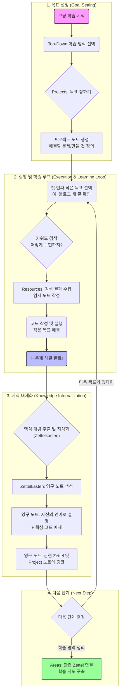

```mermaid
graph TD
    subgraph "1. 목표 설정 (Goal Setting)"
        A("코딩 학습 시작") --> B("Top-Down 학습 방식 선택")
        B --> C{"Projects: 목표 정하기"}
        C --> D["프로젝트 노트 생성<br>해결할 문제/만들 것 정의"]
    end

    subgraph "2. 실행 및 학습 루프 (Execution & Learning Loop)"
        D --> E("첫 번째 작은 목표 선택<br>예: 블로그 새 글 확인")
        E --> F{"키워드 검색<br>어떻게 구현하지?"}
        F -.-> G["Resources: 검색 결과 수집<br>임시 노트 작성"]
        G --> H("코드 작성 및 실행<br>작은 목표 해결")
        H ==> I("✨ 문제 해결 완료!")
    end

    subgraph "3. 지식 내재화 (Knowledge Internalization)"
        I --> J{"핵심 개념 추출 및 지식화<br>(Zettelkasten)"}
        J --> K["Zettelkasten: 영구 노트 생성"]
        K --> L["영구 노트: 자신의 언어로 설명<br>+ 핵심 코드 예제"]
        L --> M["영구 노트: 관련 Zettel 및<br>Project 노트에 링크"]
    end

    subgraph "4. 다음 단계 (Next Step)"
        M --> N{"다음 단계 결정"}
        N -- "다음 목표가 있다면" --> E
        N -- "학습 영역 정리" --> O["Areas: 관련 Zettel 연결<br>학습 지도 구축"]
    end

    %% 스타일링
    style A fill:#f9f,stroke:#333,stroke-width:2px
    style I fill:#bbf,stroke:#333,stroke-width:2px
    style O fill:#9f9,stroke:#333,stroke-width:2px
```