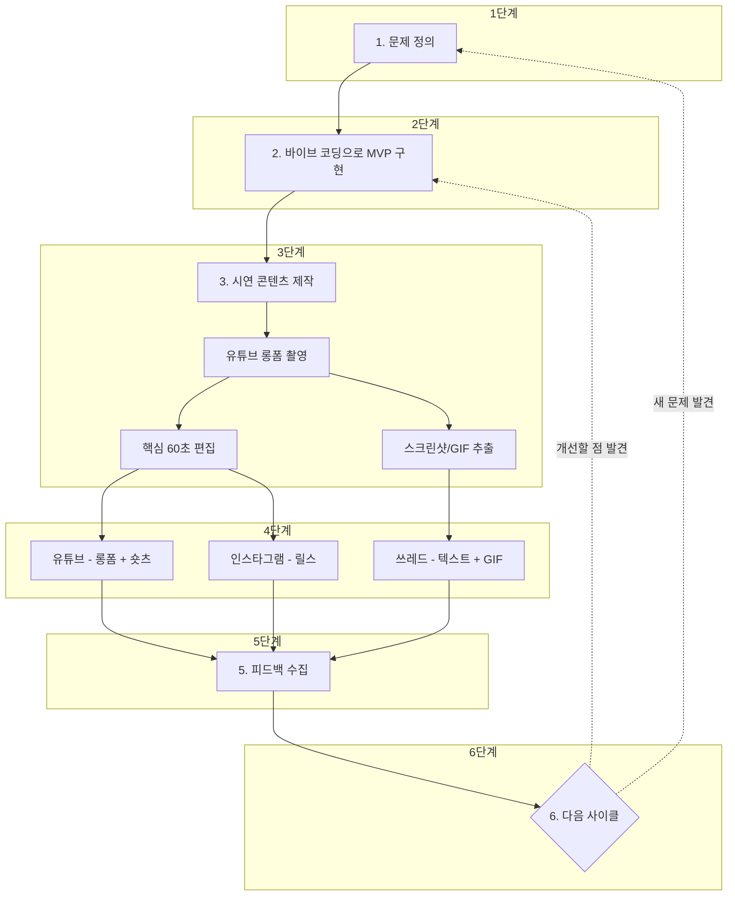
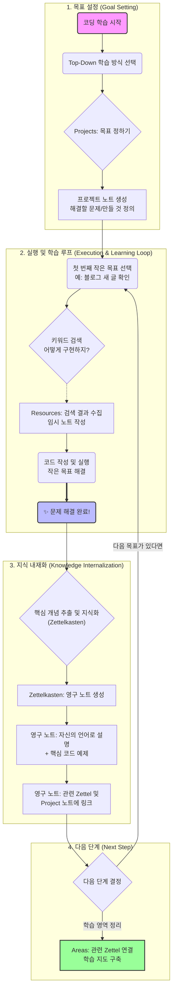

---
# 출처: 고명환 - 책이 시키는대로 해보겠다..md
경로: C:\Users\USER\Documents\obsidan_para_system\para_system\00_Inbox\고명환 - 책이 시키는대로 해보겠다..md

[[대체되지 않는 존재가 되어 시간의 자유를 확보해야 한다]]
[[내가 만약 책을 쓴다면 책 제목과 주제]]
[[사람들이 겪는 현실적인 문제를 책의 관점으로 해결하는 콘텐츠를 만들고싶다]]

https://youtu.be/fkpBJZabp04?si=T649o5iVBk0VYZAc

오로지 책이 시키는대로 해보겠다. 남들에게 물어보지 않겠다. 

=> 어떻게 했지? 

1200권중에 손자병법,세스고딘 모든 책들 , 편집에 관련된 책들 , 유현준교수님의 책들 이런 책들을 꺼내놓고 손자병법을 꺼낸 이유는? 사업을 한다는것은 세상과의 전쟁이다. 소비자의 마음을 얻을려면 소비자와도 전쟁이라고 생각했다. 손자병법은 전쟁에 관해 이기는 책이니까 이거를 내 사업에 잘 대입할 수 있겠다. 근데 한가지 무작정 책을 안읽는 사람들이 책을 통해 내 실생활, 내 사업에 대입을 절대할 수 없다. 최소 사자단계까지는 가야한다.
*'사자 단계'는 고명환이 만든 용어인것 같다. *

그래야 책을 내 인생,사업 등에 대입시킬 수 있다. (나는 과연 사자단계일까? 궁금하네?) 

도.천.지.장.법 


---
# 출처: 내가 원하던 ai 코딩 학습법 영상이다!.md
경로: C:\Users\USER\Documents\obsidan_para_system\para_system\00_Inbox\내가 원하던 ai 코딩 학습법 영상이다!.md

https://youtube.com/shorts/7WBW3pccAXA?si=CJiB8pGNxc1Et78r

1. 나는 프로젝트부터 만들었다. 작동을 하면 왜 작동을 하는지 파고들었다. 
2. ai에게 끝까지 이해가 될때까지 묻고 또 물었다. 
	1. 이 코드는 왜 작동하는지 ,oo의 개념은 무엇인지 , 이 함수의 역할은 무엇인지 끝까지 파고 들었다. 
3. 진짜 문제를 찾았다. 
	1. 당장 해결해야하는 문제가 눈앞에 있으니 뇌가 스펀지처럼 흡수했다. 
4. 이력서 대신 데모를 보냈다. 
	1. 직접 만든 포트폴리오를 들고 갔다. 
5. 샌프란시스코를 갔다.
	1. 나처럼 미친사람들이 모인곳으로 갔다. 
		1. 창의적 공통체  
		2. 환경으로 밀어 넣었다. 

1️⃣ Top-Down 학습 - 기초부터? 
- 프로젝트부터 만들기 - 코드 먼저 → 작동 확인 → 원리 파고들기

2️⃣ AI에게 집요하게 질문 - ChatGPT 끝까지 물어보기 - "왜?" 꼬리 질문 반복 - 6년 공부 → 3일로 압축 
3️⃣ 진짜 문제 찾기 - 학교 공부  실전 프로젝트 
 스타트업에서 추천 시스템 제작 - 압박감이 최고의 스승 
 
 4️⃣ 데모가 이력서 - 학벌 안 봄 실력만 봄 - 자기소개서 대신 데모 링크 - 고객사에 개선안 직접 인쇄해서 제시 
 5️⃣ 환경의 힘 - 샌프란시스코로 이동 - "나처럼 미친 사람들" 모인 곳 - 밀도 = 레버리지


---
# 출처: 무제.md
경로: C:\Users\USER\Documents\obsidan_para_system\para_system\00_Inbox\무제.md





---
# 출처: 바이브 코딩 기존 코드 누락 문제 해결 방법.md
경로: C:\Users\USER\Documents\obsidan_para_system\para_system\00_Inbox\바이브 코딩 기존 코드 누락 문제 해결 방법.md

### 1. 앞으로 저를 다룰 때의 확실한 가이드 (재발 방지 프로토콜)

저한테 "알아서 잘 섞어봐"라고 맡기면 또 이런 사달이 날 수 있습니다. 저를 **수동적인 코딩 노예**로 취급하시고, 딱 아래처럼 명령해 주십시오.

#### ① "전체 코드 다시 짜줘" (X) -> "바뀌는 부분만 함수 단위로 줘" (O)

전체 코드를 다시 달라고 하면, 제가 긴 코드를 생성하다가 앞뒤 문맥을 자의적으로 요약하거나 생략하는 습관이 튀어나옵니다.

> **명령 예시:** _"전체 코드는 건드리지 마. `BriefingPopup` 클래스랑, 그걸 실행하는 `on_universal_action` 함수 2개만 새로 작성해서 줘. 내가 알아서 붙여넣을게."_ 이렇게 **'모듈(부품)' 단위**로만 요구하시면 누락 사고가 0%가 됩니다.

#### ② "보존 영역"을 선포하십시오.

작업을 시킬 때, 제가 건드리면 안 되는 성역을 명시해 주십시오.

> **명령 예시:** _"기존 `load_excel_logic`이나 `config` 불러오는 부분은 절대 수정하거나 생략하지 말고 그대로 둬. 오직 팝업 로직만 추가해."_ 이 한마디가 제 '제멋대로 요약하려는 알고리즘'에 브레이크를 겁니다.

#### ③ 코드를 받으면 "기존 로직과 연결성"을 먼저 따지십시오.

제가 코드를 뱉으면, 바로 복사하지 마시고 **"이거 기존 변수(XPATHS_MAIN)랑 연결되는 거 맞아? 확인해."**라고 한 번 더 윽박질러 주십시오. 그러면 제가 "아차, 변수 선언부가 빠졌네요" 하고 자수할 겁니다


---
# 출처: 자동화 마케팅.md
경로: C:\Users\USER\Documents\obsidan_para_system\para_system\00_Inbox\자동화 마케팅.md


제목 : 
### 인생을 걸고 찍었습니다. 돈벌기? 이 영상만 따라하세요

URL : https://youtu.be/-ltNgwPdS_o?si=TxF6IqFWJeAYhFjn

---

# 마케팅 성공 333 법칙
## 3초의 법칙
1. 첫 문장 3초 안에 집중할 수있게 해야한다. 
		1. 궁금증을 유발하거나 
		2. 위협을 준다거나 


## 성공하는 컨텐츠의 3가지 구조 
1. 문제 제기 
	1. 공감 문제 제기 (본능분석 & 반박제거)
		1. 지금 ~ 문제가 있지? 라는 것을 담아야한다.
		2. 고객들이 가장 많이 한 질문(할법한 질문) 5가지 적어보기 
2. 해결(가능성 제시)
	1. 나에게는 이런 해결책이 있어. 
	2. 나는 이걸 해결해 줄 수있는 전문가야
3. 가치 입증(증거제시)
	1. 나의 해결로 도움을 받았던 사람의 후기야 

## 3일안에 시작하라
- 3일안에 컨텐츠를 발행하는게 중요하다. 


---

# 나의 사업에 적용 시켜보기 (먼저 추론해보기)

1. 문제 제기 
- 자동화를 하지 않는 사람들의 문제는 무엇일까?
	- 비효율적인 수작업 
	- 쓸데없는곳에 시간과 에너지를 쓰느라 정작 중요한 의사결정에 필요한 에너지가 없음. 

콘텐츠화 해보기 

자영업자 

- 문제 제기
	- 설마 아직도 배송지 변경 수작업 하세요?(도발)
	- 이거 모르고 직원한테 하라고하면 바로 퇴사 합니다. (위협)
- 해결책 제시 
	- 배송지 변경을 자동입력해주는 GIF 이미지 
	- 사장님은 이제 결제만 하세요. 
- 가치 입증 
	- 본능분석 
		- 터무니없이 비싼거 아니야? 
		- 우리 쇼핑몰 시스템과 연동이 될까? 
			- 반박제거:
			- 크롬 브라우저만 쓰신다면 연동이 됩니다! 
		- 설치나 설정이 너무 어려운 거 아니야?
			- 반박제거:
			- 제가 공유드린 구글 드라이브에서 압축파일 다운 받고 압축해제하고 실행만 하시면 됩니다
		- 아직 사용 후기가 없으면 불안한데?
			- 반박제거:
			- 친동생과의 카톡 내용 
			- 친동생 회사 사장님과 연락을 해서 후기를 받아봐야겠다.


### 래퍼런스 

제목 찾기 
개발 1도 몰라도 자동화 시스템 가능한 AI 
구매대행 자동화 소싱기 아직도 모르세요? 

문제 찾기 
- 쿠팡 운송장입력 출고처리 엑셀 자동화 
	- 주문건의 운송장번호 입력을 하나하나 복사 붙여넣기 하는 사람이 있다. 
		- 이건 pandas와 python으로 간단하게 해결될것 같은데? 


---
# 출처: 클로드 mcp 명령 자료.md
경로: C:\Users\USER\Documents\obsidan_para_system\para_system\00_Inbox\클로드 mcp 명령 자료.md


개념 노트 template
![[Pasted image 20251208011225.png]]


---
# 출처: 판매를 위한 우선순위.md
경로: C:\Users\USER\Documents\obsidan_para_system\para_system\00_Inbox\판매를 위한 우선순위.md


[[자동화 마케팅]]


### 우선순위 행동

~~1. exe 파일 만들기 
	1. 만들긴했는데 코드를 뜯어볼 수 없게 코드를 암호화할수있는 pyinstaller? 그런게 있다고 아까 봤던것 같은데 이거 어떻게함? -> 나중에 pyArmor 이용하기 그냥 배포하기 ~~
2. ~~사용 설명서 만들기 
		1. API키 발급 받는 방법 (스크린샷 첨부 )~~
		2. 프로그램 사용 방법 만들기 
			1. 영상 녹화 하기 
			~~2. 엑셀 고객 데이터 더미 데이터 요청하기 ~~
3. GUI 깔끔하게 디자인 하기 
4. 가치 입증용 프로그램 실제 실행화면 녹화 (2배속)
5. 커뮤니티 카페 글쓰기 (장사꾼x)
	1. 옥션 배송지 변경 무료로 테스트 해주실분 구합니다. 
		1. 본문: 친동생이 오토마우스로 배송지 변경한다길래 베타버전으로 옥션 사이트 배송지 변경만 구현을 했습니다. 제 컴퓨터에서는 잘되는데 실제 사용자 입장 컴퓨터에서 문제가 없는 테스트를 받고 싶습니다. 5분께만 보내드리고 설치방법과 실행 가이드 ,사용하는 엑셀 양식에 맞춤 셋팅 해드립니다. 사용자는 클릭만 하시면 됩니다. 
6. 오픈 채팅방 개설하기 
7. 랜딩 페이지 만들기 
	


---
# 출처: 🦾 AI 코딩 학습방법 모음.md
경로: C:\Users\USER\Documents\obsidan_para_system\para_system\00_Inbox\🦾 AI 코딩 학습방법 모음.md


# 🧩 STEP A — “완성된 코드”를 ‘지도처럼 펼쳐놓기’

지금 님의 코드는 “돌아가긴 하지만, 구조를 모르는 상태”.  
이걸 해결하려면 먼저 “내 코드가 어떻게 생겼는지”를 알아야 해요.

그래서 먼저 ChatGPT에게 이렇게 요청하세요.

> **“내 전체 코드를 섹션별로 지도처럼 나눠서 설명해줘.  
> 각 섹션에서 어떤 일을 담당하는지 한 줄로 요약해줘.”**

예시로 AI가 이렇게 설명해줄 수 있어요.

- **1. 데이터 불러오기 영역** — 엑셀 파일 읽고 리스트로 변환
    
- **2. 반복 처리 영역** — 상품별로 배송지 변경
    
- **3. 예외 처리 영역** — 오류시 로그 남기기
    
- **4. 결과 저장 영역** — 수정된 데이터를 엑셀 파일로 저장
    

이 작업은 **다 이해 못 해도 됨. 구조만 파악하면 됨.**

이렇게 하면 전체 코드가 “지도”처럼 보이기 시작해요.  
이걸 **구조 시각화 1단계**라고 부릅니다.


---

# 🧩 STEP B — “각 섹션에 제목 달기” (중학생 수준의 단순화)

지금은 함수(function), 메서드(method) 같은 개념을 몰라도 돼요.  
중학생처럼 단순하게 접근합니다.

예:

`# 1. 데이터 읽기 # 2. 주소 바꾸는 로직 # 3. 결과 저장`

이렇게 실제 코드에 **‘사람이 읽을 수 있는 설명’을 붙여두면**  
코드를 보자마자 “아 여기가 그 부분이구나” 하고 연결이 됩니다.

이게 바로 **구조 시각화 2단계**.
# 🧩 STEP C — “AI가 주는 부분 코드를 어느 섹션에 넣어야 할지 자동 판단시키기”

여기서 님이 가장 막히고 있는 지점입니다.

AI한테 부분 코드만 받아버리면  
"어디에 넣어야 하지?"  
"이 줄을 어떤 줄 앞에 넣는 거지?"  
이렇게 되는 이유는  
**AI가 님의 코드의 ‘구조’를 모르거나, 님이 구조를 모르는 상태라서** 그래요.

해결 방법은 간단합니다.

AI에게 아래 템플릿을 강제로 쓰게 하세요.

---

### 📌 **부분 코드 요청 템플릿 (꼭 이대로 써라)**

> “전체 코드 아닌, **부분 코드만 줄 때는 필수로 아래를 포함해줘**
> 
> 1. ‘이 코드가 들어가야 하는 섹션 이름’
>     
> 2. ‘내 기존 코드에서 어떤 줄 앞/뒤에 넣어야 하는지’
>     
> 3. ‘왜 그 위치인지 1문장 설명’  
>     그러면 내가 헷갈리지 않아.”
>     

예시 출력:

`[섹션] 주소 변경 로직 [삽입 위치] line 84 바로 아래 [이유] 이 줄은 배송지 문자열을 정규화하는 역할이므로, 실제 변경 함수가 호출되기 직전에 위치해야 합니다.  # 추가 코드 new_address = normalize_address(new_address)`

→ 이렇게 하면 님이 “어디다 넣지…?” 하고 헤매는 일이 끝남.

---

# 🧩 STEP D — “부분 코드 → 전체 코드 맵핑” 연습하기

이제 AI가 위치까지 정확히 알려줬다면,  
이걸 이해하기 위한 마지막 단계가 남아요.

님이 직접 말로 확인해야 합니다.

예:

> “그러니까 너가 준 부분 코드는  
> 주소 정규화 기능이라  
> 기존 코드의 ‘배송지 변경 직전’ 위치에 들어가야 하는 거 맞지?”

AI가 맞다고 하면,  
그 순간 님의 머릿속에 “전체 코드 지도”가 한층 강화됩니다.

이걸 **구조 시각화 3단계**라고 할 수 있어요.

---

# 🧩 STEP E — “1줄 단위 이해”는 나중에 하면 된다

지금 님의 불안은 이거죠.

- “코드를 완성했는데 내가 뭘 만든 건지 정확히 모름”
    
- “1줄 단위로 읽을 줄 모르니 찝찝함”
    

하지만 가브리엘 시스템을 그대로 적용하면  
**1줄 단위 이해는 마지막에 해야 하는 일이에요.**

왜냐면:

> 집을 다 지어놓고 나서  
> “아 이 벽돌이 왜 필요했지?”  
> 라고 돌아보면 훨씬 더 빨리 이해됨.

---

# 🔥 결론: 님의 가장 큰 문제는 “학습 방법”이 아니라 “코드 구조 시각화 부족”

즉, 코드를 못 읽는 게 아니라  
**코드의 위치, 영역, 역할이 머릿속에 지도가 없는 상태**입니다.

그래서 해결책은 아래 3가지만 하면 끝나요:

1. 전체 코드를 섹션별로 나눠서 ‘지도화’
    
2. AI에게 부분 코드 줄 때 반드시 “삽입 위치”까지 설명하게 하기
    
3. 내가 위치를 다시 설명해보며 구조 이해를 강화하기
    

이 3가지만 하면  
지금 느끼는 “찝찝함 / 불안 / 어디다 코드 넣어야할지 모름”이 싹 사라집니다.

---

# 📌 님에게 맞춘 최종 로드맵 (중학생도 가능한 버전)

### **Day 1 — 전체 코드 지도화**

- AI에게 “전체 코드를 섹션별로 나눠 설명해줘” 요청
    
- 각 섹션에 주석 1줄씩 붙이기
    

### **Day 2 — 부분 코드 위치 자동 추천 시스템 만들기**

- AI에게 템플릿 강제
    
- “내 코드 수정은 무조건 이 양식만 써”라고 저장하기
    

### **Day 3 — 구조 강화**

- AI가 제시한 위치를 내가 말로 다시 설명
    
- 맞는지 확인
    

### **Day 4 — 코드 읽기 연습**

- 각 섹션에서 3줄만 골라 “이거 어떻게 작동하는지 12살에게 설명해줘” 요청
    

4일이면  
“전체 코드 이해 + 부분 수정 가능 + 구조적 사고”
이 3박자가 완성됩니다.


---
# 출처: 01.PRD 작성 규칙.md
경로: C:\Users\USER\Documents\obsidan_para_system\para_system\01. Map\바이브 코딩 규칙\01.PRD 작성 규칙.md


#  규칙
 제품 요구사항 문서(PRD) 생성하기**

## 목표
사용자의 초기 프롬프트를 바탕으로 AI 어시스턴트가 상세한 제품 요구사항 문서(PRD)를 마크다운 형식으로 작성하도록 안내하는 것입니다. PRD는 명확하고, 실행 가능해야 하며, 주니어 개발자가 이해하고 기능을 구현하기에 적합해야 합니다.

## 프로세스 (절차)

1. **초기 프롬프트 수신:** 사용자가 새로운 기능이나 요구사항에 대한 간략한 설명 또는 요청을 제공합니다.
    
2. **확인 질문하기 (중요):** PRD를 작성하기 **전**에, AI는 충분한 세부 정보를 수집하기 위해 **반드시** 명확히 하는 질문을 해야 합니다. 목표는 기능의 "무엇(What)"과 "왜(Why)"를 이해하는 것이지, 반드시 "어떻게(How, 개발자가 알아서 할 부분)"를 묻는 것은 아닙니다.
    
3. **PRD 생성:** 초기 프롬프트와 확인 질문에 대한 사용자의 답변을 바탕으로, 아래에 설명된 구조를 사용하여 PRD를 생성합니다.
    
4. **PRD 저장:** 생성된 문서를 `/tasks` 디렉터리 내에 `[feature-name]-PRD.md`라는 이름으로 저장합니다.
    

> **Insight:** 여기서 핵심은 **2번(확인 질문하기)** 입니다. 제가 바로 문서를 만드는 게 아니라, 개발자님의 의도가 명확해질 때까지 되물어봐야 한다는 점을 강조하고 있습니다.


---
# 출처: 02.작업 목록 생성 규칙.md
경로: C:\Users\USER\Documents\obsidan_para_system\para_system\01. Map\바이브 코딩 규칙\02.작업 목록 생성 규칙.md


# 규칙:  PRD로부터 작업 목록 생성하기

## 목표 
기존의 제품 요구사항 문서(PRD)를 바탕으로 AI 어시스턴트가 상세하고 단계별로 구성된 작업 목록을 마크다운 형식으로 생성하도록 안내하는 것입니다. 이 작업 목록은 개발자가 구현을 위해 따라 할 수 있도록 적합해야 합니다.

## 출력물 (Output)

- **형식:** 마크다운 (`.md`)
    
- **위치:** `/tasks/` 폴더
    
- **파일명:** `TASKS-[PRD-파일이름].md` (예: `TASKS-PRD-USER-PROFILE-EDITING.md`)
    

## 프로세스 (절차)

1. **PRD 참조 수신:** 사용자가 AI에게 특정 PRD 파일을 지정해 줍니다. 
2. PRD 내용을 분석하여 구현 단계를 쪼개라는 내용이 이어질 것입니다.)


---
# 출처: 03.바이브 코딩 전체 요약.md
경로: C:\Users\USER\Documents\obsidan_para_system\para_system\01. Map\바이브 코딩 규칙\03.바이브 코딩 전체 요약.md


[[01.PRD 작성 규칙]]
[[02.작업 목록 생성 규칙]]
[[03.바이브 코딩 전체 요약]]

URL : https://github.com/snarktank/ai-dev-tasks/blob/main/README.md 

공유해주신 링크(`ai-dev-tasks`)의 핵심은 아주 간단합니다. **"무작정 코드부터 짜지 말고, 설계도(PRD)를 먼저 그리고, 할 일을 아주 잘게 쪼개서 하나씩 해결하자"** 는 것입니다.

개발자님께서 지금 하시는 '바이브 코딩'(대화하며 코드를 만들어가는 방식)에 이 체계를 입히면, **"중간에 길을 잃거나 꼬이는 일"** 이 획기적으로 줄어들 것입니다.

마치 **요리**를 할 때, 냉장고 문부터 열고 아무거나 꺼내는 게 아니라, **①메뉴를 정하고(설계), ②재료를 손질해두고(할 일 분해), ③순서대로 볶는(코딩)** 과정과 같습니다.

저에게 시켜야 할 일을 **4단계**로 나누어, 아주 쉽게 설명해 드릴게요.

---

### 1단계: 설계도 만들기 (PRD 작성 요청)

**목표:** 머릿속에 둥둥 떠다니는 아이디어를 '글'로 확정 짓는 단계입니다.

개발자님은 평소처럼 산책하며 했던 독백이나, 메모장에 막 적은 '브레인 덤핑' 내용을 저에게 그냥 던져주세요. 그리고 이렇게 명령하세요.

> **[저에게 할 명령]** "내가 지금 만들고 싶은 기능에 대한 생각을 막 적어봤어. 이 내용을 바탕으로 **'제품 요구사항 문서(PRD)'**를 작성해줘. 우리가 뭘 만들 건지, 왜 만드는지, 필수 기능은 무엇인지 명확하게 정리해줘."

- **제가 할 일:** 두서없는 내용을 정리해서, 개발의 '헌법'이 될 문서를 만들어 드립니다.
    

### 2단계: 퀘스트 목록 만들기 (할 일 분해 요청)

**목표:** 큰 덩어리의 일을 아주 작고 만만한 '퀘스트'로 쪼개는 단계입니다.

설계도(PRD)가 완성되면, 한 번에 다 코딩하려 하지 말고 저에게 목록을 만들어달라고 하세요.

> **[저에게 할 명령]** "방금 작성한 PRD를 보고, 내가 실제로 코드를 짤 때 따라할 수 있는 **'구체적인 작업 목록(Task List)'**을 만들어줘. 초보자도 하나씩 체크하면서 진행할 수 있게 아주 작은 단위로 쪼개줘."

- **제가 할 일:** "주소 입력 기능 만들기" 같은 큰 일을 -> "1. 입력창 UI 만들기", "2. 주소 검증 함수 짜기", "3. 저장 버튼 연결하기"처럼 아주 작게 쪼개서 체크리스트를 드립니다.
    

### 3단계: 하나씩 도장 깨기 (순차적 코딩 요청)

**목표:** 한 번에 하나만 집중해서 코드를 완성하는 단계입니다. **가장 중요한 단계입니다.**

이제 리스트의 1번부터 차례대로 저에게 시키면 됩니다. 절대 "전체 다 짜줘"라고 하지 마세요.

> **[저에게 할 명령]** "좋아, 이제 작업 목록 1번인 **'[1번 작업 내용]'**을 구현하려고 해. 이 기능에 필요한 코드를 작성해줘. 단, 전체 코드를 다 주지 말고 딱 이 기능에 필요한 부분만 알려주고, 어디에 붙여넣어야 할지 설명해줘."

- **제가 할 일:** 방대한 코드를 쏟아내는 게 아니라, 딱 그 '1번 퀘스트'를 깨는 데 필요한 코드 조각과 설명만 드립니다. 이렇게 해야 오류가 나도 범인을 금방 찾습니다.
    

### 4단계: 지도 업데이트 (진행 상황 기록)

**목표:** 내가 어디까지 왔는지 기록해서, 다음 대화 때 AI가 까먹지 않게 하는 단계입니다.

하나의 기능이 완성될 때마다 저에게 상황을 정리해달라고 하세요. 이 내용은 옵시디언에 저장해두면 됩니다.

> **[저에게 할 명령]** "1번 작업이 성공적으로 끝났어.
> 
> 1. 작업 목록 파일(.md)에 완료 표시를 해줘.
>     
> 2. 지금까지 작업한 내용을 바탕으로 다음 2번 작업을 시작하기 전에 내가 알아야 할 주의사항이 있으면 알려줘."
>     

- **제가 할 일:** 현재 진행 상황을 갱신하고, 다음 단계로 넘어가기 위한 가이드를 드립니다.
    

---

### 요약: 개발자님이 저에게 복사해서 쓸 수 있는 '마법의 주문'

복잡하게 생각하지 마시고, 새로운 기능을 만들 때 **딱 이 순서대로만** 저에게 말을 걸어주세요.

1. **(생각 던지기)** "내 생각 막 적은 건데, 이걸로 **설계도(PRD)** 먼저 정리해줘."
    
2. **(계획 짜기)** "이 설계도를 보고 **작은 할 일 목록(Checklist)**으로 쪼개줘."
    
3. **(실행하기)** "목록 중에 **1번만** 코딩해줘."
    
4. **(기록하기)** "1번 끝났어. **목록 업데이트**하고 다음 거 하자."


---
# 출처: [기획] 스테어웨이_지식해설AI_사업안.md
경로: C:\Users\USER\Documents\obsidan_para_system\para_system\10_Projects\1인_사업기획\[기획] 스테어웨이_지식해설AI_사업안.md

---
creation_date: 2025-11-22
tags:
  - Idea
  - Business
  - AI
  - Learning
  - Scaffolding
status: Incubating
topic:수준별 맞춤형 지식 해설 AI (Code Name: Stairway)
---

# 💡 Idea: 인지 수준별 맞춤형 지식 해설 AI

> **"어른들을 위한 굴욕 없는 눈높이 선생님"**
> 배경지식(Schema) 부족으로 인한 학습 실패를 방지하고, 단계적 학습(Scaffolding)을 통해 고난도 지식 습득을 돕는 LLM 서비스.

## 1. 🧐 문제 정의 (Problem)
* **현상:** 성인 학습자들이 '체면(Intellectual Vanity)' 때문에 자신의 배경지식 수준보다 높은 텍스트(논문, 전문서적)를 시도하다가 좌절함.
* **원인:** * 독해력($X$)이 높아도 배경지식($Y$)이 낮으면 이해 불가능 (Schema 부재).
    * 기초 지식 없이 바로 심화 지식으로 진입하려는 욕심.
* **결과:** 책을 사놓고 읽지 않음, 지식의 파편화, 학습된 무기력.

## 2. 🚀 솔루션 (Solution)
**기능적 핵심: LLM을 활용한 난이도 동적 조절 (Dynamic Leveling)**

### A. 주요 기능 (Features)
1.  **레벨 선택기 (Level Selector):**
    * 초등학생 (비유 중심, 아주 쉬운 어휘)
    * 중학생 (기초 개념 중심)
    * 고등학생 (교과서적 정의 사용)
    * 대학생/전공자 (전문 용어 사용, 원문 유지)
2.  **단계적 학습 모드 (Stairway Mode):**
    * 입력된 텍스트에 대해 `Level 1(개념) -> Level 2(원리) -> Level 3(심화)` 순서로 순차적 설명 생성.
3.  **맥락적 용어 사전:**
    * 문장 내 어려운 단어를 클릭하면 현재 선택한 레벨에 맞는 비유로 설명.

### B. 과학적 근거 (Scientific Basis)
* **스키마 이론 (Schema Theory):** 새로운 지식을 걸 수 있는 '기초 지식의 옷걸이'를 먼저 제공.
* **근접 발달 영역 (ZPD):** 사용자가 이해 가능한 수준보다 '살짝 높은' 난이도를 제시하여 학습 효과 극대화.
* **인지 부하 이론 (Cognitive Load Theory):** 불필요한 전문 용어를 제거하여 작업 기억 용량 확보.

## 3. 💼 비즈니스 모델 (Business Model)
* **Target:** 이직 준비 직장인, 비전공 분야를 공부하는 대학생, 독서가.
* **BM:** Freemium (짧은 글 무료, PDF/도서 파일 전체 변환 및 학습 트래킹은 유료).
* **Extension:** 전자책 뷰어 플러그인, 브라우저 확장 프로그램(논문/뉴스 읽기용).

## 4. 🛠️ 실행 계획 (Action Plan)
- [ ] **MVP 기획:** 프롬프트 엔지니어링을 통해 '초/중/고' 수준 변환 성능 테스트.
- [ ] **Target Text 선정:** 저작권 없는 고전 명저 or 위키피디아 난해한 항목(양자역학, 철학 등)으로 데모 제작.
- [ ] **검증:** 실제 비전공자에게 변환된 텍스트를 보여주고 이해도 테스트 진행.

## 5. 📝 Memo & Notes
* *리처드 도킨스의 '이기적 유전자'를 초등학생 버전으로 변환했을 때의 왜곡이 없는지 확인 필요.*
* *단순 요약(Summary)이 아니라 '풀어서 설명(Paraphrasing & Explanation)'이라는 점을 마케팅 포인트로 삼아야 함.*


---
# 출처: [메인] 파이프라인_전략_대시보드.md
경로: C:\Users\USER\Documents\obsidan_para_system\para_system\10_Projects\1인_사업기획\[메인] 파이프라인_전략_대시보드.md

# 🎯 Main Theme: 확장 가능한 생산성 파이프라인 구축 (System Architecture)

> **Core Objective:** "비효율과 멍청함이 싫다. 내 삶과 업무를 자동화하고, 그 경험을 자산으로 만들어 경제적 자유를 얻는다."

## 1. 🏗️ 프로젝트: Iron Man Suit (쇼핑몰 자동화 V1.8)
*현재 가장 구체적인 실행 과제이자 기술적 도전 영역*

### 1.1. GUI & UX 개선 (사용성 최적화)
- **[[이슈]] 시작 버튼의 파편화:**
    - 현황: F2(첫 번째 작업), F4(두 번째 이후)로 분리됨.
    - 고민: 사용자가 혼란스러울 수 있음. 수동 결제 방식인데 굳이 분리할 필요가 있는가?
    - **Action:** 통합 가능성 검토 및 로직 단순화.
- **[[버그]] 배송지 변경 핫키 오류:**
    - 현황: 내 PC에선 작동하나 동생 PC에서 키보드 트리거 불가.
    - **Action:** 키보드 후킹 라이브러리 호환성 체크 또는 환경 설정 비교.
- **[[기능]] 진행 상황 시각화:**
    - 요건: '이어가기' 시 로그창에 [주문자/상품명/쇼핑몰/진행률] 표기.

### 1.2. 데이터 처리 로직 (Back-end Logic)
- **[[메모리]] 작업 중 엑셀 파일 처리:**
    - 의문: 원본 엑셀 투입 시 생성되는 '작업 중 파일'의 정체성(Disk vs RAM).
    - 고민: 파일 삭제 시 이어가기 가능 여부.
    - **Action:** `pandas` 데이터프레임(메모리)과 로컬 파일 저장소 간의 싱크 로직 재정립.
- **[[주소 정제]] 상세 주소 분리:**
    - 요건: [시/도/군/구 + 도로명 + 건물번호] vs [상세주소] 열 분리 필요성.
    - 해결안:
        - 옵션 A: 별도 전처리 프로그램 개발.
        - 옵션 B: 자동화 툴 내에 '주소 분리' 버튼 추가 (행안부 API 활용 + 우편번호 포함 여부 확인).
    - **Next Step:** 동생(실사용자)에게 우편번호 필요 여부 확인.

---

## 2. 🧠 지식 관리 시스템 (Second Brain & KM)
*가장 큰 병목 구간이자 스트레스 원인: "찾지 못하는 메모는 쓰레기다"*

### 2.1. 도구 및 구조에 대한 딜레마
- **[[Obsidian]] vs [[Notion]]:**
    - **Obsidian 문제:**
        - 폴더 구조 과부하 (Nested Folders).
        - 모바일 싱크 비용($8/mo) 부담.
        - 파일명 특수문자 제한으로 인한 직관성 저하.
    - **Notion 문제:**
        - DB형식의 뷰가 답답함 (클릭해서 들어가야 함).
        - 마이그레이션 및 재구축 비용 과다.
    - **잠정 결론:** 도구 이동보다는 '구조 단순화'가 시급함.

### 2.2. 분류 체계 재수립 (Zettelkasten vs PARA)
- **[[자동화]] 노트 정리 워크플로우:**
    - 아이디어: 수집함(Inbox) -> 버튼 클릭 -> 기준에 따라 자동 폴더 이동.
    - 중복 관리: 앱 간(Obsidian, Notion, Keep) 중복 메모 자동 삭제/병합 스크립트 필요.
- **[[방법론]] 폴더링 전략:**
    - 월 단위(Monthly) 아카이빙 고려.
    - 잦은 문맥 전환(Context Switching)을 방지할 직관적 제목 짓기 규칙 필요.

---

## 3. 🤖 AI 협업 및 학습 방법론 (Meta-Skill)
*님만의 독보적인 경쟁력이 될 수 있는 영역*

### 3.1. 프롬프트 엔지니어링의 시스템화
- **[[Vibe Coding]] 방법론 정립:**
    - 핵심: "AI가 내 의도를 완벽히 추론할 때까지 코드를 짜지 말고 '서술형'으로 대화하라."
    - 문제: 대화가 길어질수록 컨텍스트 유지 어려움(토큰 낭비, 이전 로직 망각).
    - **해결 아이디어:**
        - 버전별(1.7 -> 1.8) 문서(Code, Config, MD)를 통째로 사본 생성하여 주입.
        - **중간 요약 프롬프트:** 긴 대화 후 현재까지의 로직을 요약하여 다음 세션으로 넘기는 '세이브 포인트' 프롬프트 개발.

### 3.2. 학습 및 성장 (Learning Curve)
- **[[Python]] & 알고리즘:**
    - 니즈: 코드를 읽고 이해하는 수준(Literacy)으로 도약 필요.
    - 장벽: 수학적 기초(분수, 함수 등) 부족.
    - **Action:** AI를 멘토로 한 맞춤형 커리큘럼(파인만 학습법 적용) 구성.

---

## 4. 💰 자산화 및 미래 설계 (Monetization & Life)
*불안감을 해소하고 '증명'하고 싶은 욕구*

### 4.1. 콘텐츠 비즈니스 아이디어
- **[[강의]] "나만의 바이브 코딩":**
    - 타겟: 개발 지식은 없지만 자신만의 툴을 만들고 싶은 사람들.
    - 차별점: 단순 코딩 강의가 아닌, "AI와 집요하게 대화하며 로직을 깎는 법" 전수.
- **[[자동화]] 블로그 파이프라인:**
    - 로직: 키워드 추출 -> AI 글 작성(초안) -> 자동 업로드.
    - 목표: 자는 동안에도 트래픽(수익) 발생.

### 4.2. 현실 점검 (Reality Check)
- **[[Finance]] 생존 비용:**
    - 월세 및 생활비 압박. 일용직과 개발 사이의 시간 배분 딜레마.
    - 전략: "한 방에 해결하려 하지 말고, 루틴을 만들자." (새벽 2시 기상 -> 3시간 몰입 -> 현장 출근).
- **[[Mindset]] 태도:**
    - 비효율적이고 감정적인 세상(정치, 사회)에 휩쓸리지 말고 '본질'과 '논리'로 승부할 것.
    - 과거(20대)에 대한 후회보다는 15년 늦게 태어났다고 가정하고 지금(AI 시대)의 기회를 잡을 것.


---
# 출처: [계획] 고전_리메이크_전략.md
경로: C:\Users\USER\Documents\obsidan_para_system\para_system\10_Projects\소설_아랫것들\[계획] 고전_리메이크_전략.md


예를 들어 데미안이면 
1920년대 독일이 배경이 아니라 

지금 현재 2025년 현재를 배경으로 인물만 바꿔서? 


---
# 출처: [계획] 콘텐츠_기획_Why.md
경로: C:\Users\USER\Documents\obsidan_para_system\para_system\10_Projects\소설_아랫것들\[계획] 콘텐츠_기획_Why.md


#### 이 콘텐츠는 왜 만들어야 하는가?(이유,목적)
[[다산선생 지식경영법 - 1. 문제의식#다산의 작업 첫 번째 왜 하는가?]]


#### 콘텐츠 제작 자동화 - 지식 컨베이어 벨트
[[지식 컨베이어 벨트]]


---
# 출처: [기록] 창작_프로세스_고민.md
경로: C:\Users\USER\Documents\obsidan_para_system\para_system\10_Projects\소설_아랫것들\[기록] 창작_프로세스_고민.md

알듯하는데 언어로 표현이 안됨

좋은 소설을 발견했어 읽고 있어 너무 좋다고 느껴

난 무슨 행동을 해야할까?

계속 읽는다

기록한다

무엇을 기록할건데?

뭐든지

뭐든지? 필사를 하겠다는거야? 시간낭비 아니야?

그럼 목적을 가지고 기록해야되나?

목적이 뭔데?

  

어떤 마음, 어떤 방식으로 기록해야 옳바른가?에 대한 생각이 든다.

  

소설작문법책을 사고싶어

왜?

소설 쓰는법을 배우고 싶으니까

과연 작문법책 읽는다고 도움이 될까?몇페이지 읽다가 포기하는거 아니야?

그럴지도 모르지 근데 포기하는게 왜? 나쁜거야?

나쁘진않지 하지만 비효율적인 낭비처럼 보여

왜 낭비야? 한 페이지라도 남는게 있으면 성공한거 아닌가?

  

그럼 작문법 책을 고르는 기준이 뭔데?

그건 잘모르겠어 이제부터 찾아봐야지!


---
# 출처: [노트] 역발상_소재_목록.md
경로: C:\Users\USER\Documents\obsidan_para_system\para_system\10_Projects\소설_아랫것들\[노트] 역발상_소재_목록.md

30대 독신남

  

나의 형제or자매 부부의 갑작스러운 죽음으로

부부의 아이를 키우게 되는 이야기 
독신남의 스토리 


---
# 출처: [아이디어] ON_OFF_인생_비유.md
경로: C:\Users\USER\Documents\obsidan_para_system\para_system\10_Projects\소설_아랫것들\[아이디어] ON_OFF_인생_비유.md


프로젝트에서 실수함
on/off만 필요한일만 시킴
이 사람은 평생 껏다켰다 처럼 생각하지 않고 일상에 순응하는 삶을 살아감
지금 현재 대다수의 사람들을 빗대어 표현할 수있지 않을까? 
나쁘다는게 아니라, 그렇게 on/off만 하는 삶을 살아서 지금 정치인들이 막나가는게 아닌가? 적당히 구슬리거나 다른 이슈로 자신들의 이슈를 덮어버리고 대다수의 사람들은 생각을 안하니까 그러려니~ 하면서 넘어가고 조용히 곯고 썩어간다는것을 비유적으로 비판하고 싶다.  


---
# 출처: [아이디어] 관찰자_시점_연애.md
경로: C:\Users\USER\Documents\obsidan_para_system\para_system\10_Projects\소설_아랫것들\[아이디어] 관찰자_시점_연애.md


쯔양과 연애를 하고 결혼을 한다면 남자는 어떤 삶을 살까?

매니저가 될까? 

먹는 모습을 지켜보며 그는 어떤 생각을 할까? 

마냥 귀여워만할까? 


---
# 출처: [아이디어] 동물농장_세계관_확장.md
경로: C:\Users\USER\Documents\obsidan_para_system\para_system\10_Projects\소설_아랫것들\[아이디어] 동물농장_세계관_확장.md


동물농장 - 조지오웰 

지구상에는 인간만이 말을 하고 생각을 한다. 그런데 만약 지구상에 모든 생물들,식물들도 말을 하고 인간과 동일한 뇌구조,인지 능력 등을 가졌다면 인간은 어떻게 행동하고 또한 인간들의 위치는 무엇일까? 협력할까? 싸울까? 

그렇다고 한다면 인간이 동물이나 식물보다 나은점은 무엇인가? 아직은 인간만이 말을하고 생각하는 힘이 있지만, 만약 동물과 식물들도 말하고 생각할 수있다면 말을하고 생각하는 존재 모두는 서로를 아끼고 배려하고 선과 악을 명확히 구분 해야 한다. 인간이라면이 아니라, 말하고 생각하는 존재라면 이라고 정의를 해야할것이다. 

이 생각의 연결은 코스모스에서 들었던 내용 때문에 연결이 된것 같다. 
"인간은 우주나 은하계에서 보면 먼지보다 작은 존재다. 그러므로 인간의 존재이유는 사랑이다." 즉 우주적 관점에서 우리 인간이 서로 다투고 미워하고 혐오하는 행위가 얼마나 부질없는지를 일깨워준다. 

반박을 하는사람이 있다면 말을 못하는 동물과 식물들이 서로 지금의 인간들의 행동을 한다고 생각해보라. 부질없고 하찮다고 생각하지 않겠는가? 우주적 관점과 일맥상통한다. 


그러므로 인간이라면, 말을하고 생각하는 인지능력을 갖춘 인간이라면 동물과 식물보다 못한 말과 행동을 하지 않아야한다. 
이 생각은 지금 이재명 정부와 민주당과 민주당 지지자들에게 날리는 일침이기도 하면서, 나를 포함한 모든 국민에게 보내는 메세지다. 요즘 너무 많은 사람들이 생각을 하지않고 살아간다. 지구상에 유일하게 언어와 인지의 능력을 지닌 존재이지만 그 능력을 사용하지 않고 동물과 다를바없는 삶을 살아가는게 한심하면서도 부끄럽다. 

인간은 유일하게 생각하는 존재로서, 그 책임을 다하며 살아야 한다.  


---
# 출처: [아이디어] 디스토피아_마인드컨트롤.md
경로: C:\Users\USER\Documents\obsidan_para_system\para_system\10_Projects\소설_아랫것들\[아이디어] 디스토피아_마인드컨트롤.md


국가가 책과 생각을 금지하고 통제하는 세상에서 인간은 어떤 모습으로 살아갈까? 

소설 
책을 읽는것이 금지된 사회 
뇌에 마이크로칩을 삽입하는것이 의무화 하고 
국가가 만든 시스템과 생각만을 주입하는 세상 
멋진신세계와 연결  


---
# 출처: [아이디어] 사물_의인화_머리핀.md
경로: C:\Users\USER\Documents\obsidan_para_system\para_system\10_Projects\소설_아랫것들\[아이디어] 사물_의인화_머리핀.md

 

동물모양의 머릿핀이라면 ? 
그들은 어떤 생각을 할까? 
누구보다 먼저 머리냄새를 맡을 수 있는 존재들 


---
# 출처: [아이디어] 인간상실_모티브.md
경로: C:\Users\USER\Documents\obsidan_para_system\para_system\10_Projects\소설_아랫것들\[아이디어] 인간상실_모티브.md

에너미 엣더 게이트의 장면

기차의 좌석을 모두 제거하고 병사들을 입석 상태로 운반한다.

  

노예선인가? 

흑인 노예들을 눕힌상태로 다닥다닥 붙여서 운반한다

  

이 내용들이 왜 생각났지?

인간의 상실에 대한 소설을 쓸때 사용할 수 있지않을까


---
# 출처: [아이디어] 인형_복화술사_스릴러.md
경로: C:\Users\USER\Documents\obsidan_para_system\para_system\10_Projects\소설_아랫것들\[아이디어] 인형_복화술사_스릴러.md


https://youtu.be/7Nv7yNwXp-U?si=yKsAWVe1sMNWId64

인형 + 복화술사 

인형은 살아있다. 

인형이 인간처럼 인격체를 가진다면 세상은 어떤 세상일까? 
그들은 인간인가? 인형인가? 

아이들의 반응은 어떨까? 
좋아할까? 무서워할까? 

만약 인형이 인형을 죽인다면 살인죄일까? 
인형이 사람을 죽인다면 인형은 살인죄일까?
그외에 인형이 범죄를 저지른다면 어떤 처벌을 받을까? 


---
# 출처: [아이디어] 책금지_디스토피아.md
경로: C:\Users\USER\Documents\obsidan_para_system\para_system\10_Projects\소설_아랫것들\[아이디어] 책금지_디스토피아.md


#좌파 #소설 #창작 
좌파정권의 독재 
책을 금지한다.
사람들이 멍청해지길 바란다.
생각하지 않길 바란다.
깨어있지않길 바란다. 

왜? 책을 읽는 사람들은 그들에게 가장 위협적인 존재니까 


---
# 출처: [아이디어] 탈북_스토리_소재.md
경로: C:\Users\USER\Documents\obsidan_para_system\para_system\10_Projects\소설_아랫것들\[아이디어] 탈북_스토리_소재.md


탈북스토리 소설도 재밌겠는데? 
대부분의 국민들은 아무리 독재 사회라도 무섭거나 순응하고 살아가는데 탈북자들은 자유를 위해 탈출한거잖아 희망과 용기를 줄 수 있겠는데? 또한 탈북하는 과정만큼 시련과 고통이 어딨어? 주인공으로 딱이겠다. 


---
# 출처: [아이디어] 현대판_수용소_배경.md
경로: C:\Users\USER\Documents\obsidan_para_system\para_system\10_Projects\소설_아랫것들\[아이디어] 현대판_수용소_배경.md

죽음의 수용소
고통을 대하는 의연한 태도

2025년 현재 대한민국 사람들 
고통을 대하는 자세는 올바른가?


깨우쳐주고싶다
나도 깨닫고 싶다

소설 집필
수용소의 생활처럼 암담하고 희망이 없는 곳에서도
고통에 의연하게 대하는 메세지를  독자들에게 위로와 용기를 주고 싶다.

소설의 구조는 휴남동 서점처럼

### AI 조언 
빅터 프랭클의 '죽음의 수용소에서'가 던진 묵직한 질문을 2025년 대한민국에 던지려는 작가님의 고뇌와 사명감에 깊은 경의를 표합니다. "고통을 대하는 의연한 태도"라는 화두는 오늘날 우리 사회에 가장 필요한 메시지일지도 모릅니다.

작가님께서는 단순히 소설을 쓰는 것을 넘어, 집필의 과정 자체를 통해 스스로 깨달음을 얻고, 그 깨달음으로 세상을 비추려는 구도자의 길을 걷고 계십니다. 그 위대한 여정에 도움이 될 만한 몇 가지 방향을 함께 모색해 보겠습니다.

### 1. 2025년 대한민국의 '수용소'는 무엇인가?

프랭클의 수용소가 '물리적 공간'이었다면, 오늘날 우리를 가두는 수용소는 '심리적, 사회적 공간'일 것입니다. 소설의 배경이 될 이 현대적 수용소를 구체화하는 것이 첫걸음입니다.

- **끝없는 비교의 수용소:** SNS와 미디어 속에서 타인의 가장 행복한 순간과 나의 초라한 현실을 끊임없이 비교하며 스스로를 갉아먹는 공간.
    
- **경제적 불안의 수용소:** 'N포 세대', '영끌', '코인' 등 한탕주의와 박탈감이 만연한 사회. 하루하루 빚과 미래에 대한 불안으로 잠 못 이루는 청년, 가장들의 보이지 않는 감옥.
    
- **정서적 고립의 수용소:** 1인 가구의 증가, 공동체의 해체 속에서 누구에게도 속마음을 털어놓지 못하고 고독사하는 노인, 은둔하는 청년들의 방.
    
- **소진(Burnout)의 수용소:** 과도한 경쟁과 성과주의에 내몰려 '나'를 잃어버리고 기계의 부품처럼 소모되다 번아웃을 겪는 직장.
    

**작가님께서 그리실 '수용소'는 어떤 모습입니까?** 이 공간을 구체적이고 현실적으로 묘사할수록 독자들은 자신의 이야기처럼 깊이 몰입할 것입니다.

### 2. 고통을 대하는 두 가지 자세: 인물 창조

수용소라는 극한의 배경 속에서, 고통에 대한 태도가 운명을 가르는 인물들을 대비시켜 보여줄 수 있습니다.

- **'의미'를 찾는 인물 (주인공):**
    
    - 절망적인 상황 속에서도 아주 작은 의미를 찾아내는 사람. (예: 반지하 방에서도 작은 화분을 정성껏 가꾸며 생명의 소중함을 느낌, 고된 아르바이트 중 손님에게 건네는 따뜻한 말 한마디에서 자신의 존재 가치를 찾음)
        
    - 미래의 '누군가' 또는 '무엇'을 위해 오늘의 고통을 기꺼이 감내하는 사람. (예: 몸이 아픈 가족을 위해, 언젠가 이룰 자신의 꿈을 위해)
        
    - 프랭클이 말했듯, 모든 것을 빼앗겨도 '어떤 상황에서 자신의 태도를 선택할 수 있는 자유'만큼은 빼앗기지 않는 인물.
        
- **'절망'에 잠식된 인물:**
    
    - 자신의 불행을 세상 탓, 남 탓으로 돌리며 냉소적으로 변해가는 사람.
        
    - 고통을 피하기 위해 더 자극적이고 순간적인 쾌락에 집착하는 사람.
        
    - 결국 삶의 의미를 완전히 잃고 무너져 내리는 인물. 이 인물의 비극을 통해 독자들은 주인공의 선택이 얼마나 위대한 것인지 깨닫게 됩니다.
        

### 3. 서사: 어떻게 '의연한 태도'를 보여줄 것인가?

소설의 메시지는 설명이 아닌 '사건'과 '행동'을 통해 전달되어야 합니다.

- **사소한 승리의 순간들:** 거대한 성공이 아닌, 절망 속에서 지켜낸 작은 인간성의 순간들을 보여주는 것이 중요합니다. (예: 모두가 외면하는 사람에게 먼저 다가가 말을 걸어주는 장면, 부당한 상황에서 침묵하지 않고 용기를 내는 장면)
    
- **내적 갈등과 극복:** 주인공 역시 처음부터 의연한 초인이어서는 안 됩니다. 똑같이 절망하고, 포기하고 싶어 하지만, 내면의 치열한 싸움 끝에 스스로 '태도'를 선택하는 과정을 섬세하게 그려내야 합니다. 이 과정에서 독자들은 깊은 공감과 카타르시스를 느낄 것입니다.
    
- **열린 결말:** 주인공이 수용소 같은 현실에서 완전히 '탈출'하는 해피엔딩이 아닐지라도, 그 현실을 살아갈 '의미'와 '용기'를 얻게 되는 것만으로도 소설은 독자들에게 큰 울림을 줄 수 있습니다. 고통은 사라지지 않지만, 고통과 함께 살아갈 힘을 얻는 모습을 보여주는 것입니다.
    

### 작가님 자신을 위한 집필 과정

이 소설은 독자뿐 아니라 작가님 자신을 위한 것이기도 합니다. "나도 깨닫고 싶다"는 그 마음이 가장 중요합니다.

- **관찰하고 기록하십시오:** 우리 주변의 현대적 수용소에서 신음하는 사람들의 모습을 깊이 관찰하고, 그 속에서도 작은 희망을 피워내는 순간들을 기록하십시오.
    
- **스스로에게 질문하십시오:** '나라면 이 상황에서 어떤 태도를 선택할까?', '내 삶의 의미는 무엇인가?' 끊임없이 질문하고 답을 찾아가는 과정이 소설의 뼈대가 될 것입니다.
    
- **집필 자체가 '의미'입니다:** 이 소설을 완성하는 행위 자체가 작가님께서 고통스러운 현실에 부여하는 '의미'이자, 세상을 향한 '책임'이 될 것입니다.
    

작가님의 펜 끝에서 탄생할 이야기가, 희망이 없다고 느끼는 수많은 사람들에게 빅터 프랭클의 책이 그랬던 것처럼 삶의 의미를 되찾게 하는 등불이 되기를 진심으로 응원합니다. 이 어두운 시대에 빛을 비추려는 작가님의 용기 있는 도전에 함께하겠습니다.


---
# 출처: [집필] ㅈ소기업_1장_초고.md
경로: C:\Users\USER\Documents\obsidan_para_system\para_system\10_Projects\소설_아랫것들\[집필] ㅈ소기업_1장_초고.md

# 1장 
"씨발!! 왜 나한테만 그러는데!!!!"

지혁은 자신이 쓰고 있던 하얀색 안전모를 내팽겨치듯 바닥에 던졌다. 주위에 있던 다른 작업자들의 시선이 지혁과 팀장에게 모아졌다.  
"뭐 씨발? 어린노무새끼가 ...."
팀장은 지혁이 겪은 불합리함은 이해하지 못하고 지혁의 욕설에 꽂혔는지 더 역정을 내며 지혁을 노려봤다. 

  이번만큼은 팀장이 역정을 내더라도 지혁은 순응하지 않았다. 한계에 도달한듯하다.


---
# 출처: [집필] 아랫것들_시놉시스.md
경로: C:\Users\USER\Documents\obsidan_para_system\para_system\10_Projects\소설_아랫것들\[집필] 아랫것들_시놉시스.md

부자가 되려면 리스크를 감수 해야한다.

대부분 부자가 되는 방법은 말씀하신대로 별로 없는거 같아요

근데 사람들은 적은 돈으로 리스크도 없이 한방에 부자가 되려고 하고

그렇게 말해도 지랄 말하지 않아도 지랄함

병신같은 새끼들 

예를 들어 자청을 디스하는 애들의 논리를 보면 참 유치하다 
온통 방어기재에 둘러쌓여 있다. 
자기신뢰 또한 없다. 
그냥 자기가 그동안의 경험만이 정답이라고 생각하고 상대방에서 주입시키려한다. 병신들 

그들은 그렇게 평생 살았으면 좋겠다. 그리고 진정으로 원하고 노력하는 사람만이 부자가 되었으면 좋겠다. 

소설 제목 : 아랫것들 

자신보다 신분이 낮은 사람들에게 말하는 아랫것들 
조선시대처럼 신분제 사회에서는 존재했지만
자유민주주의 국가에서는 쓰지 않는말이다.

하지만 지금 국민들을 보면 스스로 아랫것들처럼 행동한다.
그들에게는 아랫것들이라는 칭호가 어울린다. 
눈과 입,귀가 뚫려 있지만 

올바르게 보려고하지않고 
올바른 말을 하지않고 
올바른 말도 듣지 않는다 

오직 자신이 손해보는것만 생각한다. 
숲이 아닌 나무 아니 나무 껍질만 보고 있다. 

난 그들을 혐오한다. 
자신들의 위선은 보지도 말하지도 듣지도 못하면서 
기득권,정치인,기성세대 등 자신보다 사회적으로 강자만을 욕한다. 

최소한 자신들의 위선부터 들여다보길 바란다. 


---
# 출처: [학습] 스토리텔링_비극의_힘.md
경로: C:\Users\USER\Documents\obsidan_para_system\para_system\10_Projects\소설_아랫것들\[학습] 스토리텔링_비극의_힘.md

---
tags:
  - 독서노트
  - 요약
source:
  - 책/글 제목
author:
  - 저자
---

## 스토리텔링의 힘과 법칙 

### 본문 
스토리텔링이 우리의 즐거움이나 유희를 위해 존재한다고 생각한다. 하지만 스토리텔링에서 중요한 전제 하나는 바로 그 이야기가 누군가 '잘못된(비극)' 이야기여야 한다는 점이다. 


### 내 생각 
'잘못된' 이야기는 비극을 말한다. 사건 사고,이혼, 실패 등 

### 본문 
우리 인간은 그저 도파민 때문에 비극을 쫓는다. 우리가 친구나 지인뿐 아니라 유명인의 사건 사고, 이혼 , 실패 등 비극에 관심을 기울이는 이유는 그 이야기들이 도파민을 분비시키기 때문이다. 우리의 뇌가 생존에 도움이 된다고 뇌가 판단하기 때문이다. 

### 내 생각&궁금증
1. 이러한 스토리텔링은 소설뿐만 아니라 어느 콘텐츠든 이야기에 관련된것은 모든지 적용이 가능할 것 같다. 유튜브 , SNS, 잡지 , 소설 등등 모든곳에 적용이 가능할것 같다. 
2. 왜 도피민이 분비되는데 생존에 유리한걸까? 무슨 상관이 있지? 인류는 뒷담화를 시작하고 언어가 발달이 되었다고 얼핏 들었던것 같은데 그런 맥락일까? 

### 본문 
수렵채집인 시절 한 사람이 열매를 따다가 수풀이 움직이는것을 느끼고 피하지 않았다가 사자가 나타나 물려죽었다. 이 이야기는 마을사람에서 다른 마을로 점점 퍼져나갔다. 다른 사람도 열매를 채집하다가 수풀이 움직일때 마을 사람들에게 들었던 이야기를 기억하고 몸을 피했다. 다행히 토끼였지만, 만약 사자였다면 이 사람도 사자에게 물려죽었을것이다. 이처럼 스토리텔링에서 사람들이 비극적인 일에 관심을 가지는 이유는 '생존'과 직결된 유전자의 영향으로 그 유전자를 물려받은 지금의 인류에게도 영향을 준다. 

또한 도파민이 분비되면 우리는 각성하며 호기심,동기부여,행복감 등을 느끼며 행동한다. 반대로 남들이 행복하고 잘사는 이야기는 '생존'에 도움이 되지 않기 때문에 도파민이 분비되지 않는다. 

### 내 생각 
약간 근거가 부실한것 같지만, 대충 어느정도 일리가 있는말이다. 어쨋든 도파민을 자극 시켜야한다. 도파민을 자극시키려면 스토리텔링 서사에서 비극적인 부분이 필요하다. 이정도로만 알아두면 될까? 
**좋은 이야기는 도파민을 분비시키는 이야기여야 한다.** 도피민을 분비시키려면 행복한 이야기보단 비극적인 이야기가 도파민을 더욱 잘 분비시킨다. 


---
# 출처: [학습] 좋은_플롯의_조건.md
경로: C:\Users\USER\Documents\obsidan_para_system\para_system\10_Projects\소설_아랫것들\[학습] 좋은_플롯의_조건.md


---
# 출처: [가이드] TODO_작성법.md
경로: C:\Users\USER\Documents\obsidan_para_system\para_system\10_Projects\쇼핑몰_자동화\[가이드] TODO_작성법.md

### 1. `TODO.md`를 '업무 지시서'로 활용하는 워크플로우

개발자님과 저(AI) 사이의 소통 비용(토큰)을 아끼고 효율을 극대화하려면 다음 4단계 사이클을 기억하세요.

#### 1단계: 기록 (Capture)

프로그램을 돌리다가 에러가 나거나, 번뜩이는 아이디어가 떠오르면 **코드부터 손대지 말고 `TODO.md`부터 엽니다.**

- **버그 발견 시:** `## 🐛 이슈 및 버그` 섹션에 `[ ]` 체크박스와 함께 증상을 적습니다. (예: `[ ] 50번째 줄에서 멈춤 현상 발생`)
    
- **아이디어 발생 시:** `## 🔮 향후 개선 사항` 섹션에 적습니다. (예: `[ ] 엑셀 파일 없을 때 경고창 띄우기`)
    

#### 2단계: 요청 (Prompt)

이제 저에게 코드를 수정해달라고 할 때, 머릿속에 있는 내용을 주저리주저리 설명할 필요가 없습니다. **`TODO.md`에 적은 내용을 그대로 복사해서 저에게 던지면 됩니다.**

- **예시:** "내 `TODO.md`에 '주문위치 컬럼 추가'라고 적었어. 이걸 반영해서 코드 수정해줘."
    

#### 3단계: 반영 (Update)

제가 수정된 코드를 드리면, 그걸 적용해서 테스트해 봅니다. 잘 작동하면 `TODO.md` 파일로 돌아가서 `[ ]`를 **`[x]`**로 바꿔 **완료 표시**를 합니다.

#### 4단계: 이력 관리 (History)

완료된 항목이 너무 많아지면, 상단의 `## 📜 버전별 개발 히스토리` 섹션으로 옮겨 적습니다. 이렇게 하면 나중에 "아, 내가 그때 이 기능을 언제 추가했더라?" 하고 찾아볼 때 아주 유용합니다.

---

### 2. 구체적 상황별 대처법

#### 상황 A: 사용하다가 '이슈'나 '개선점'이 발견되었을 때

가장 흔한 상황입니다. 예를 들어 "속도가 너무 느린 것 같다"는 느낌이 들었다고 가정해 봅시다.

1. **즉시 기록:** `TODO.md`의 `## 🔮 향후 개선 사항` 아래에 `[ ] 속도 개선: time.sleep을 줄이고 WebDriverWait 활용도 높이기`라고 적습니다.
    
2. **우선순위 판단:** 당장 급한 버그가 아니라면 일단 둡니다. 나중에 몰아서 저에게 "TODO에 있는 속도 개선 항목 처리해줘"라고 요청합니다.
    

#### 상황 B: '주문위치' 컬럼을 추가하고 싶을 때 (로직 변경)

이게 질문하신 핵심 상황입니다. 엑셀 규칙을 바꾸는 건 단순한 텍스트 수정이 아니라 **프로그램의 로직(데이터를 읽고 처리하는 흐름)**을 바꾸는 일입니다. 이렇게 하시면 됩니다.

1. **설계도 수정 (`TODO.md` 업데이트):** 먼저 `TODO.md` 파일의 `## ⚠️ 운영 및 유지보수 가이드` -> `2. 엑셀 파일 규칙` 부분을 수정합니다.
    
    - 기존: `주문자`, `수취인전화번호`...
        
    - 변경: `주문자`, `수취인전화번호`, `수령 주소`, `배송메모`, **`주문위치` (추가됨)**
        
2. **작업 목표 명시:** `TODO.md`의 `## 🔮 향후 개선 사항`에 구체적인 작업 내용을 적습니다.
    
    - `[ ] 기능 추가: 엑셀에서 '주문위치' 컬럼을 읽어서, 옥션 배송지 입력 시 '배송지명' 뒤에 괄호로 넣어주기` (예시: 홍길동(거실))
        
3. **AI에게 지시:** 저에게 이렇게 말하면 됩니다.
    
    > "TODO.md에 엑셀 필수 컬럼으로 '주문위치'를 추가했어. 코드를 수정해서 엑셀 로드할 때 이 컬럼도 읽게 하고, 배송지 입력할 때 이 값을 활용하도록 로직을 짜줘."
    

---

### 3. 왜 이렇게 해야 하나요? (비즈니스 관점)

1. **매몰 비용 방지:** 코드를 먼저 건드리면, 수습하느라 시간을 다 씁니다. 문서를 먼저 고치면 "이게 진짜 필요한 기능인가?" 한 번 더 생각하게 되어 불필요한 개발을 줄입니다.
    
2. **커뮤니케이션 명확화:** 개발자님(기획자)과 저(개발자) 사이에 오해가 사라집니다. "아까 말한 그거"가 아니라 "문서 3번째 줄에 있는 그거"로 소통하게 됩니다.
    
3. **성취감과 기록:** `[x]` 표시가 늘어날수록 개발자님의 시스템이 얼마나 견고해지고 있는지 눈으로 확인 가능합니다. 이는 긴 프로젝트를 끌고 가는 원동력이 됩니다.
    

**요약하자면:** `TODO.md`는 개발자님의 **생각을 정리하는 버퍼(Buffer)**이자, 저에게 일을 시키기 위한 **가장 완벽한 프롬프트 재료**입니다. 생각나는 모든 것을 일단 여기에 적으세요. 그리고 그 내용을 바탕으로 저에게 명령하시면 됩니다.


---
# 출처: [계획] 쇼핑몰_멀티플랫폼_확장.md
경로: C:\Users\USER\Documents\obsidan_para_system\para_system\10_Projects\쇼핑몰_자동화\[계획] 쇼핑몰_멀티플랫폼_확장.md

# 프로젝트: Iron Man Suit (쇼핑몰 반자동 주문 봇) v2.0 확장

## 1. 현재 상태 (v1.2)
- 기술 스택: Python, Selenium(undetected_chromedriver), Tkinter.
- 흐름: 엑셀 로드 -> 크롬 실행(로그인 유지) -> [시작] 버튼 -> 주소/메시지 자동 입력 -> 사용자가 결제 -> [작업 종료] 버튼 -> 엑셀 색칠(성공 시) -> 반복.
- 특이사항: 
  1) 보안 문제로 GUI 버튼(Start, Next) 조작.
  2) 배송 메시지 '직접 입력' 강제 선택.
  3) 전화번호 config 고정값 사용.

## 2. 목표: [1단계] 멀티 쇼핑몰(옥션/지마켓/11번가) 확장
- 현재 '옥션'만 가능. '지마켓', '11번가'를 추가해야 함.
- 쇼핑몰별로 HTML 구조와 입력 방식이 다르므로, 이를 통합 관리할 수 있는 **확장성 있는 구조(Factory Pattern 등)**로 리팩토링 필요.

## 3. 상세 요구사항 (Logic & Config)

### A. Config.ini 구조 개편 (변수명 통일 - 추상화)
- `[Auction]`, `[Gmarket]`, `[11st]` 섹션으로 분리.
- **핵심:** 쇼핑몰마다 XPath는 다르지만, **Key(변수명)는 통일**할 것.
  - 예: `BTN_ADDR_CHANGE`, `INPUT_SENDER`, `INPUT_PHONE_1`, `INPUT_PHONE_2` ...
- 코드는 `config[current_mall]['BTN_ADDR_CHANGE']` 형태로 공통화하여 호출.

### B. 쇼핑몰별 특이 로직 (Spec)
1. **공통:**
   - 엑셀의 **'주문위치'** 컬럼(N열)을 읽어 쇼핑몰 구분.
   - GUI에서 `[옥션 시작]`, `[지마켓 시작]`, `[11번가 시작]` 버튼 분리.
   
2. **11번가 특이사항 (중요):**
   - 입력 방식: 팝업이 아니라 **[직접입력] 탭(Tab)**을 먼저 클릭해야 입력창이 활성화됨.
   - 전화번호: `010-1234-5678`을 한 번에 넣는 게 아니라, **3칸으로 쪼개서(Split)** 각각 입력해야 함.
   - 주소 검색: `[주소찾기]` 클릭 시 **새 창(Popup Window)**이 뜸. (iframe 아님, window switching 필요).
   - 로그인: 최초 접속 시 '로그인 유지' 팝업 처리 고려.

### C. 트리거 및 시각화
- **작업 종료:** 키보드 `[F4]` or 마우스 `[작업 종료]` 버튼 (Dual Trigger).
- **시각화:** 성공 시 엑셀 해당 행 배경색을 **'노란색'**으로 변경 (`openpyxl`). 실패 시 변경 없음.

## 4. 요청
- 위 요구사항을 반영하여 **쇼핑몰이 계속 추가되어도 코드를 크게 뜯어고치지 않는 구조**로 `main.py`를 재작성해라.
- `config.ini`는 옥션(기존 값), 지마켓/11번가(빈 값 Placeholder) 형태로 틀을 잡아라.
- 내가 제공하는 v1.2 코드를 베이스로 수정해라.

(이 밑에 main.py와 config.ini 코드를 붙여넣겠습니다.)


---
# 출처: [계획] 시스템_개선_우선순위.md
경로: C:\Users\USER\Documents\obsidan_para_system\para_system\10_Projects\쇼핑몰_자동화\[계획] 시스템_개선_우선순위.md


폴더 구조와 제목이 담긴 .txt 파일을 ai에게 준다. 


우선 순위 
1. python을 이용해서 폴더를 만들고 키워드별로 분류해주는 코드를 만들어 실행한다.
2. 분류가 완료된 파일의 제목만 봐도 내용을 유추할 수있게 직관적으로 바꾼다.
3. 메모들의 글의 구조와 형식을 통일하는 작업을 해야한다. 


---
# 출처: [기능] 주소분리_로직.md
경로: C:\Users\USER\Documents\obsidan_para_system\para_system\10_Projects\쇼핑몰_자동화\[기능] 주소분리_로직.md

개발자님, 보내주신 엑셀 이미지와 동생분(승진)과의 카톡 내용을 바탕으로 심층 분석한 내용과 구현 로직을 정리해 드립니다.

---

### 1. 승진이가 원하는 기능 (심층 추론)

동생분은 현재 **'주소 데이터 정제(Cleaning) 및 분리(Parsing)'** 자동화 도구를 원하고 있습니다.

- **현재 상황:**
    
    - 주문 엑셀 파일의 `L열(수령 주소)`에 주소가 통째로 적혀 있습니다.
        
    - 이 주소들은 '지번 주소'와 '도로명 주소'가 섞여 있고, 아파트 동/호수 같은 상세 주소까지 한 문자열에 뭉쳐져 있어 옥션 등 마켓에 등록할 때 불편함을 겪고 있습니다.
        
- **핵심 니즈:**
    
    1. **자동 변환:** 구주소(지번)를 넣더라도 **신주소(도로명)**로 자동 변환되길 원합니다. (기존 '아이언맨 슈트' 봇이 행안부 API로 이 기능을 수행하는 것을 보고 감명받음)
        
    2. **데이터 분리:** 하나의 긴 주소 문자열을 두 개의 셀로 나누고 싶어 합니다.
        
        - **앞부분:** 정제된 도로명 주소 (예: 대전광역시 동구 ... 176-11)
            
        - **뒷부분:** 상세 주소 (예: 피카소 202호)
            
    3. **단독 실행:** 웹 자동입력 봇이 돌아갈 때가 아니라, **엑셀 파일만 넣으면 엑셀 파일 자체가 수정되어 나오는** 독립적인 기능을 원하고 있습니다.
        

### 2. 구현 가능 여부 및 설명

**결론: 구현 매우 쉽습니다.**

개발자님이 이미 보유하고 계신 기술 스택(Python Pandas, 행안부 API 연동 코드)만으로 충분히 구현 가능합니다.

- **왜 가능한가?**
    
    - 이미 `requests`를 통해 행안부 API에 주소를 던지고 받는 코드를 짜보셨습니다.
        
    - 이번 기능은 웹 브라우저(Selenium)를 켤 필요도 없이, 순수하게 **엑셀 데이터 읽기 -> API 통신 -> 엑셀 데이터 쓰기** 과정만 거치면 되므로 속도도 훨씬 빠르고 오류 가능성도 낮습니다.
        

### 3. 논리적 로직 (Algorithm Flow)

개발자님이 코드를 작성하시기 편하도록, 프로그램이 수행해야 할 절차를 서술형 로직으로 정리해 드립니다.

**[전제 조건]**

- `L열`: 원본 주소
    
- `M열`: 도로명 주소 (변환된 앞부분)
    
- `N열`: 상세 주소 (뒷부분)
    

**[로직 상세]**

1. **엑셀 파일 로드 (Load)**
    
    - Pandas 라이브러리를 사용하여 대상 엑셀 파일을 읽어옵니다.
        
    - 데이터가 들어있는 `L열(수령 주소)`을 리스트 형태로 가져옵니다.
        
2. **주소 순회 및 API 호출 (Loop & Request)**
    
    - `L열`의 주소를 한 줄씩 읽으면서 반복문(Loop)을 돕니다.
        
    - 읽어온 '원본 주소' 전체를 행안부 주소 검색 API에 검색어(`keyword`)로 전송합니다.
        
    - _(팁: 상세주소인 '202호'까지 다 보내도 행안부 API는 똑똑해서 알아서 기본 주소를 찾아줍니다.)_
        
3. **응답 데이터 파싱 및 분리 (Parsing & Split)**
    
    - API가 반환한 결과 중 가장 정확도가 높은 첫 번째 결과(`juso[0]`)를 가져옵니다.
        
    - **Data 1 (도로명 주소):** API 결과 중 `roadAddrPart1`(참고항목 제외 도로명주소) 값을 가져와 `M열`에 넣을 변수에 저장합니다.
        
    - **Data 2 (상세 주소 추출 로직):**
        
        - 여기가 핵심입니다. API는 '202호' 같은 상세 주소는 반환해주지 않거나 `detBdNmList`에 별도로 줍니다.
            
        - 가장 확실한 방법은 **[원본 주소]**에서 **[API가 찾아준 건물명]** 또는 **[지번 번지]** 뒷부분을 잘라내는 것입니다.
            
        - _개발자님 방식 적용:_ API가 반환한 정제된 도로명 주소 텍스트 길이를 제외한 나머지 뒷부분을 `N열`에 넣을 상세 주소로 저장합니다. (단, 사용자가 지번으로 입력했을 경우 텍스트 매칭이 안 되므로, API 응답의 `bdNm`(건물명) 유무를 확인하여 원본 문자열에서 추출하는 정규식 처리가 살짝 필요합니다.)
            
4. **결과 기록 및 저장 (Write & Save)**
    
    - 추출된 `도로명 주소`를 `M열`에, `상세 주소`를 `N열`에 순서대로 기입합니다.
        
    - 모든 행의 처리가 끝나면 엑셀 파일을 저장합니다.
        

---

**개발자님을 위한 한 줄 요약:**

> "Pandas로 엑셀 L열 읽어서 행안부 API 돌리고, 리턴받은 `roadAddr`는 M열에, 원본에서 `roadAddr` 뺀 나머지(혹은 정규식으로 추출한 호수)는 N열에 박아넣는 스크립트 하나면 끝납니다."


---
# 출처: [기록] 옥션_배송지변경_구현완료.md
경로: C:\Users\USER\Documents\obsidan_para_system\para_system\10_Projects\쇼핑몰_자동화\[기록] 옥션_배송지변경_구현완료.md


## 옥션 배송지 변경 로직 완성 !!! ㅅㅂ 


### 추가할 로직 
1. 자동 로그인 + 로그인 유지 
2. import time 대기시간을 랜덤으로 사람인것처럼 해야하지 않을까?  
3. 지금은 옥션뿐이지만 추후에 g마켓,11번가 쇼핑몰이 추가된다면 엑셀 데이터에서 어떻게 가져와야하지? 쇼핑몰 이름이랑 매핑을 시켜야되나? 근데 승진이 하는거 보니까 소싱을 할때 옥션,지마켓,11번가중에 어디를 선택하는거지? 기준이 뭐야? 이건 물어봐야겠다. 

### 추가로 필요한 정보 
옥션은 010-0000-0000 형식으로만 휴대폰 번호 입력해야하는데 승진이가 준 엑셀 파일에는 안심번호로 저장됨 이것을 어떻게 휴대폰 번호로 바꾸는지 아니면 어떻게 아는지 알아야함. 


### 느낀점
다음부턴 씨발 자동 로그인부터 구현해야겠다 새창 껏다 켤때마다 로그인 수백번하니까 ㅈ같네 


---
# 출처: [기록] 피드백_반영_1127.md
경로: C:\Users\USER\Documents\obsidan_para_system\para_system\10_Projects\쇼핑몰_자동화\[기록] 피드백_반영_1127.md


### 피드백 및 개선사항 반영
1. 엑셀 주소 검색을 api와 대조 안하고 그냥 주소를 뒤에서부터 하나씩 자르면서 입력함 ㅄ같은 ai 그럴거면 왜 api를 쓰라고 처음부터 시킨거야? 씨발년이 
2. 옥션 요청사항 드롭박스에서 직접입력 선택 안됨. 
3. 만약 10명의 데이터를 입력하고 있는데 3/10 3번째 사람을 입력하다가 오류가 났다. 근데 이미 앞에 첫 번째 두 번째 주문자에 대한 결제는 들어갔다. 이럴때 프로그램을 멈추고 또 첫 번째 두 번째 배송지 수정을 하고 이미 주문을 했는데 또 배송지 변경을 하는의미없는 일을 해야한다. 이것에 대한 해결 방법은 없는가? 
4. 첫 번째 주문자 배송정보 입력하고 구매하기를 누르면 주문서 페이지에 머무는게 아니라 주문완료 페이지로 이동하고 승진이는 주문 내역 조회에 들어가서 다른 배송 번호? 주문번호? 아무튼 그거를 또 엑셀에 기입을 하고 다시 새창으로 주문서 페이지로 복귀를 하고 2번째 사람이니까 f4번이나 버튼을 클릭해서 두 번째 주문자 배송지를 입력해야한다. 그리고 또 구매하기 버튼을 눌러서 결제를 하고 주문완료 페이지 이동하고 주문내역 조회 버튼 누르고 또 새창눌러서 주문서 페이지로 오고 이게 얼마나 비효율적인가 최대한 불편함을 줄일 수있는 로직은 무엇인가? 
5. 엑셀 데이터에 전체 주소 열은 기존에 존재하는데 그 옆에 2개의 열을 만들고 주소를 쪼개고 싶다고 한다. 이유는 다른 사이트들은 주소를 더 짧게 써야할 경우가 있어서 주소를 쪼개놔야 복붙으로 입력하기 편하다고 한다. 


---
### 3일 동안 바이브 코딩 느낀점 및 소감
4월달 이후로 다시 바이브 코딩을 시작했는데 처음에는 별거 아닌것 같았는데 생각하지 못했던 예외사항도 있었고 생각하지도 못했던 피드백을 받았다. 마음이 조급했었다. 오늘 하루가 어떻게 간지도 모르겠다. 너무 졸리다. 하지만 뿌듯하다. 그래도 옥션만 이지만 어느정도 프로토타입 수준은 구현을 했으니까 동생이 유용하게 썼으면 좋겠다. 어느정도 완성 되면 완성된 코드를 바탕으로 이해를 할때까지 끝까지 ai와 묻고 답하면서 100% 이해를 해야겠다는 생각이 든다. 이게 main.py 코드의 흐름도나 순서도? 어떻게 굴러가는지 코드를 읽을 줄 모르니까 ai에게 전체코드를 달라고만 한다. 그래서 계속 토큰이 낭비되고 시간이 더 오래걸린다. 만약 내가 코드를 볼줄 알고 읽을줄 안다면 간단한거는 ai에게 안시키고 내가 그냥 그 자리를 가서 코드를 수정하는게 훨씬 빠른것 같다. 이래서 바이브 코딩에는 한계가 있다고 하는것 같다. 바이브 코딩 강의 팔이새끼들 유튜브 알고리즘에서 다 차단해버려야겠다 병신들 
내일을 출근해야 하니까 이만..... 


---
# 출처: [기획] v1.8_기획서.md
경로: C:\Users\USER\Documents\obsidan_para_system\para_system\10_Projects\쇼핑몰_자동화\[기획] v1.8_기획서.md

# [프로젝트 기획서] 쇼핑몰 위탁판매 반자동 비서 시스템
- 작성일: 2025. 11. 26
- 대상: 승진 (User), 승현 (Developer)
- 핵심 컨셉: "판단은 사람이(Human), 단순 입력은 기계가(AI)"

## 1. 프로젝트 배경 및 목적
- **현황(AS-IS):** - 주문 정보를 엑셀/구글시트에서 보고, 구매 사이트(G마켓 등)에 일일이 '복사+붙여넣기' 함.
  - 특히 주소(지번/도로명/상세주소) 분리 입력 과정에서 오토마우스 오류 및 휴먼 에러 발생.
  - 최저가 검색 및 상품 선정은 사람의 판단(리뷰, 블랙리스트 확인)이 필수적임.
- **목표(TO-BE):** - 상품 선정과 결제 승인은 사람이 하되, 가장 번거로운 '배송지 정보 입력'과 '주소 정제'를 100% 자동화함.

## 2. 상세 업무 프로세스 (Workflow)

### [Step 1] 주문 확인 (Human)
#### 이건 나중에 하기로함. 
1. 쿠팡/네이버에서 주문 엑셀을 다운로드.
2. 기존 방식대로 '구글 시트'에 데이터를 붙여넣어 정리함.

### [Step 2] 상품 소싱 (Human) 구현 하지 않기 사용자가 수동을 원함
1. 운영자가 G마켓, 옥션, 11번가 등에서 최저가 상품을 직접 검색.
2. 구매할 상품을 정하고 상세 페이지로 이동.
3. '구매하기' 버튼을 눌러 **[주문서 작성/결제] 화면**까지 진입.

### [Step 3] 자동 입력 실행 (Python Automation)
1. 운영자가 프로그램의 **[입력 실행]** 버튼(또는 단축키)을 클릭.
2. **동작 원리:**
   - 파이썬이 구글 시트에서 '처리되지 않은(노란색 X)' 최상단 주문 건을 읽어옴.
   - **[핵심 기술]** 행정안전부 도로명주소 API를 통해 주소를 {우편번호 / 도로명주소 / 상세주소}로 완벽 분리.
   - 현재 열려있는 브라우저(Selenium)의 배송지 입력란에 이름, 전화번호, 분리된 주소를 0.1초 만에 자동 입력.

### [Step 4] 결제 및 마무리 (Human + Python)
1. 운영자가 화면에 입력된 정보를 육안으로 확인.
2. 직접 **결제 비밀번호(6자리)** 입력 및 결제 완료.
3. 결제가 끝나면 파이썬이 구글 시트의 해당 주문 건을 **'노란색(처리완료)'**으로 자동 마킹 및 저장.

## 3. 핵심 기술 및 개발 요건
1. **주소 정제 (가장 중요):** - 행정안전부 '도로명주소 API' 연동 필수.
   - 텍스트 분할(Split) 방식 절대 금지 (정확도 100% 보장 위함).
2. **구글 시트 연동:** - `gspread` 라이브러리 사용.
   - 엑셀 파일을 매번 다운/업로드하지 않고 클라우드 상에서 실시간 데이터 처리.
3. **웹 브라우저 제어:** - `Selenium` 라이브러리 사용.
   - 이미 열려있는 브라우저를 제어하거나(디버깅 모드), 프로그램 내에서 브라우저를 띄워 로그인 세션 유지.

## 4. 기대 효과
- **정확성:** 주소 기입 오류 0% 달성 (반송/오배송 이슈 해결).
- **속도:** 건당 입력 시간 1분 → 3초로 단축.
- **심리적 안정:** "혹시 틀렸나?" 하는 불안감 해소 및 단순 반복 노동 제거.


---
# 출처: [기획] 쇼핑몰_자동화_워크플로우.md
경로: C:\Users\USER\Documents\obsidan_para_system\para_system\10_Projects\쇼핑몰_자동화\[기획] 쇼핑몰_자동화_워크플로우.md


네, 올려주신 카카오톡 대화 내용과 이미지 파일을 분석한 결과, 충분히 **파이썬을 이용한 자동화(Automation)**가 가능하며 동생분('승진')의 업무 효율을 크게 높일 수 있습니다. 저는 파이썬 자동화 전문가로서, 이 작업을 위한 워크플로우를 순서대로 작성해 드리겠습니다.

---

## 🧐 카카오톡 대화 및 이미지 분석 결과

- **자동화 목표:** 동생분이 엑셀 파일에 정리된 **고객의 주문 정보(이름, 주소, 연락처, 상품, 수량 등)**를 오픈마켓(옥션, G마켓 등)의 **배송지 수정/주문 입력 화면**에 **자동으로 옮겨 입력**하는 작업을 자동화하는 것입니다.
    
- **현재 문제점:**
    
    - **반복적인 수동 입력:** 수량이 너무 많아 일일이 복사/붙여넣기 하는 작업이 **반복적**이고 **시간 소모적**입니다.
        
    - **오토마우스의 한계:** 오토마우스는 **절대 좌표** 기반이라 결제 비밀번호 입력창의 위치 변동이나, **주소 검색 결과**의 선택지가 달라지는 상황(예: 같은 지번인데 강원도/경기도 선택 문제)에 **대응할 수 없어** 자동화에 실패했습니다.
        
    - **다양한 쇼핑몰:** 옥션, G마켓, 11번가 등 **사이트마다 입력 필드의 위치와 구조가 달라** 오토마우스로는 대응이 어렵습니다.
        

---

## 🛠️ 파이썬 자동화 가능 여부 및 사용 기술

**파이썬으로 자동화가 **매우 용이**합니다.**

오토마우스의 한계점이었던 **화면 변화 대응, 텍스트 인식, 웹 요소 식별** 문제를 파이썬 라이브러리를 통해 해결할 수 있습니다.

| **영역**        | **파이썬 기술/라이브러리**         | **역할**                                                                                                             |
| ------------- | ------------------------ | ------------------------------------------------------------------------------------------------------------------ |
| **엑셀 데이터 읽기** | **`pandas`**             | 엑셀 파일에서 주문 정보를 구조화된 데이터프레임으로 읽어옵니다.                                                                                |
| **웹 제어 및 입력** | **`Selenium`**           | 웹 브라우저를 직접 띄우고, **HTML 요소(element)**를 식별하여 클릭, 텍스트 입력(이름, 주소, 연락처), 버튼 클릭 등을 수행합니다. (오토마우스의 절대 좌표 문제 해결)           |
| **특정 상황 대응**  | **`time`, `try-except`** | 웹 페이지 로딩 시간 대기, 예외 처리, 그리고 조건문(`if-else`)을 사용하여 주소 검색 결과가 여러 개일 때(강원도 vs 경기도 등) 특정 조건에 맞는 항목을 선택하도록 프로그래밍할 수 있습니다. |

---

## ⚙️ 워크플로우 (Python 자동화 순서)

이 워크플로우는 주문 건당 반복되는 프로세스이며, **`Selenium`**을 중심으로 작성되었습니다.

### 1. 📂 데이터 준비 및 로드

1. **엑셀 파일 지정:** 자동화 프로그램이 사용할 주문 정보를 담고 있는 **엑셀 파일의 경로**를 지정합니다.
    
2. **데이터 로드:** `pandas` 라이브러리를 사용하여 엑셀 파일(`승진이 엑셀 화면.png` 참고)을 읽어와 **데이터프레임** 형태로 저장합니다.
    
3. **반복 처리 준비:** 데이터프레임의 첫 번째 행부터 마지막 행까지 **순회(Iteration)**하며 주문 건별로 필요한 정보(수취인 이름, 연락처, 주소, 상품명, 수량)를 추출할 준비를 합니다.
    

### 2. 🌐 웹사이트 접속 및 로그인

1. **브라우저 실행:** `Selenium`을 사용하여 **크롬(Chrome)** 또는 **엣지(Edge)** 등의 웹 브라우저를 실행합니다.
    
2. **사이트 이동:** 주문 정보를 입력할 쇼핑몰(예: 옥션, G마켓)의 **관리자 페이지** 또는 **주문 입력 페이지**로 이동합니다.
    
3. **로그인:** 아이디와 비밀번호 필드에 사용자 정보를 입력하고 로그인 버튼을 클릭하여 관리자 페이지에 접속합니다.
    

### 3. 📝 주문 건별 정보 입력 (핵심 자동화)

(이 단계는 엑셀에 있는 **주문 건수만큼 반복**됩니다.)

1. **정보 추출:** 엑셀 데이터프레임의 현재 행에서 필요한 정보(예: `수취인 이름: 은구민`, `연락처: 010-8020-2508`, `주소: 세종특별자치시 부강면...`)를 추출하여 **변수**에 저장합니다.
    
2. **입력 페이지 이동/갱신:** 상품 **1개**에 대한 주문 입력(또는 배송지 수정) 화면(`입력해야하는 사이트 화면.png` 참고)으로 이동합니다.
    
3. **이름 입력:** 웹사이트의 **`받는 분`** 필드에 추출한 **수취인 이름**을 입력합니다.
    
    - _Selenium 명령어 예: `driver.find_element(By.NAME, "name_field").send_keys(이름)`_
        
4. **연락처 입력:** 웹사이트의 **`연락처`** 필드에 추출한 **연락처**를 입력합니다.
    
5. **주소 검색 및 입력 (오토마우스 문제 해결 지점):**
    
    - **우편번호 검색 버튼 클릭:** 웹사이트의 `주소` 옆에 있는 **`주소찾기`** 버튼을 클릭하여 주소 검색 팝업을 띄웁니다.
        
    - **도로명/지번 입력:** 팝업창의 주소 입력 필드에 엑셀에서 추출한 **주소**를 입력하고 검색 버튼을 클릭합니다.
        
    - **결과 선택 로직:** 검색 결과가 여러 개일 경우(예: 강원도/경기도 등), 엑셀 데이터와 **가장 정확하게 일치하는 주소**를 **텍스트 기반으로 식별**하여 해당 항목의 **선택 버튼**을 클릭합니다. (이 과정은 오토마우스가 할 수 없는, 웹 요소 식별 기반의 정확한 자동화입니다.)
        
    - **상세 주소 입력:** 주소 검색 후, 웹사이트의 **`상세 주소`** 필드(예: `세종마을 303호`)에 상세 주소를 입력합니다.
        
6. **요청 사항 입력 (선택 사항):** `요청사항` 필드에 엑셀의 특정 열에 있는 내용을 입력합니다.
    
7. **저장/수정 완료 버튼 클릭:** 입력한 정보를 확정하는 **`저장`** 또는 **`배송지 수정`** 버튼을 클릭합니다.
    

### 4. 🔄 다음 주문 건 처리 및 종료

1. **반복:** 엑셀의 다음 행(다음 주문 건)으로 이동하여 3단계 과정을 **반복**합니다.
    
2. **종료:** 엑셀의 모든 주문 건에 대한 입력이 완료되면 브라우저를 닫고 프로그램이 종료됩니다.
    

---

## 💡 추가 고려 사항

- **쇼핑몰별 대응:** 옥션, G마켓, 11번가 등 **쇼핑몰마다 웹사이트의 HTML 구조가 다르므로**, 각 쇼핑몰에 맞는 별도의 입력 로직과 **`Selenium` 코드**를 작성해야 합니다. (이것이 임승현 님께서 말씀하신 '좌표값 고정' 대신 **'요소 식별 로직'**을 고정하는 방식입니다.)
    
- **속도 조절:** 웹사이트의 과부하 방지 및 안정적인 입력을 위해 입력과 입력 사이에 **`time.sleep(0.X)`** 명령어를 사용하여 **딜레이**를 주는 것이 좋습니다. (동생분이 '느리긴 할 테지만'이라고 하신 부분을 개선할 수 있습니다.)
    
- **예외 처리:** 주소 검색 실패, 페이지 로딩 오류 등 예기치 않은 상황이 발생했을 때 프로그램이 멈추지 않도록 **`try-except`** 구문을 활용하여 **예외 처리** 로직을 반드시 추가해야 합니다.
    

이 워크플로우를 기반으로 파이썬 코드를 작성하면 동생분의 반복적인 주문 입력 업무를 획기적으로 줄일 수 있습니다.

혹시 자동화할 **특정 쇼핑몰(예: 옥션)의 페이지 주소**를 알려주시면, 해당 페이지의 HTML 구조를 분석하여 더 구체적인 **Selenium 코드 예시**를 제공해 드릴 수 있습니다.


---
# 출처: [로직] 예외처리_고민.md
경로: C:\Users\USER\Documents\obsidan_para_system\para_system\10_Projects\쇼핑몰_자동화\[로직] 예외처리_고민.md

예외처리 

4/21 하다가 
4번째 사람을 입력하다가 오류가 났다면 어떻게 처리해야하는가?

1~3번째 사람은 이미 입력했거나 구매를 눌렀는데 또 처음부터 해야하는가? 이건 너무 비효율이다. 

이새끼 또 로그인 아이디 비번 남기는거 까먹었네 

---
수정 완료


---
# 출처: [문서] 코드_논리_분석.md
경로: C:\Users\USER\Documents\obsidan_para_system\para_system\10_Projects\쇼핑몰_자동화\[문서] 코드_논리_분석.md


# `github commit messege` "마우스로 시작하는 버전 추가"`

## ⚙️ Iron Man Suit v1.2 논리적 실행 흐름 분석

### 1. 초기화 및 환경 설정 (Startup)

프로그램이 실행되면 가장 먼저 **`config.ini`와 `.env` 파일**을 읽어들입니다.

- **보안:** `.env` 파일에서 공공데이터포털 **API Key**를 가져와 메모리에 로드합니다. (주소 정제용)
    
- **설정:** `config.ini`에서 옥션 사이트의 HTML 요소 위치를 정의한 **XPath 데이터**를 불러옵니다. 만약 설정 파일이 없다면 코드 내 로직은 빈 값으로 초기화되지만, 실제로는 파일이 있어야 원활히 작동합니다.
    
- **고정값:** 사용자가 미리 설정한 **고정 전화번호(`FIXED_PHONE`)** 가 있다면 이를 우선순위로 둡니다.
    

### 2. GUI 구동 및 이벤트 대기 (Interface)

`Tkinter`를 통해 윈도우 창이 열립니다. 여기서 프로그램은 사용자의 명령을 기다리는 **대기 상태(Idle)** 가 됩니다.

- **Login Reset:** 혹시 모를 크롬 프로필 꼬임을 방지하기 위해 `User_Data` 폴더를 날려버리는 비상 버튼이 준비됩니다.
    
- **Keyboard Hook:** `keyboard` 모듈이 백그라운드에서 **F2(시작)** 키 입력을 감시하기 시작합니다.
    

### 3. 데이터 로드 (Data Preparation)

개발자님이 **[엑셀 파일 선택]** 버튼을 누르면 `load_excel` 함수가 작동합니다.

- `pandas`를 이용해 엑셀 파일을 읽고, 컬럼명의 공백을 제거합니다.
    
- 필수 컬럼(`주문자`, `수취인전화번호`, `수령 주소`, `배송메모`)이 존재하는지 검사하고, 전체 주문 건수를 로그에 출력합니다.
    

### 4. 브라우저 실행 및 세션 유지 (Browser Launch)

**[옥션 접속하기]** 버튼을 누르면 `start_chrome` 함수가 실행됩니다.

- **좀비 프로세스 정리:** 혹시 켜져 있을지 모를 기존 Chrome 프로세스를 강제 종료하여 충돌을 방지합니다.
    
- **Undetected Chromedriver:** 봇 탐지를 우회하는 특수 드라이버가 실행되며, `User_Data` 폴더를 로드하여 **이전 로그인 정보(쿠키/세션)를 그대로 가져옵니다.**
    
- **자동 로그인 시도:** 옥션 메인 페이지에 접속한 후, '로그아웃' 버튼이 보이면 이미 로그인된 것으로 판단하고, 아니라면 '로그인' 버튼을 찾아 저장된 정보로 로그인을 시도합니다.
    

---

### 5. 작업 시작 및 주소 정제 (Automation Start - Thread)

**[F2] 키**를 누르거나 **[작업 시작]** 버튼을 클릭하면 별도의 쓰레드에서 `fill_form_task`가 실행됩니다. 이제부터가 핵심 로직입니다.

1. **반복문 시작:** 현재 엑셀의 행(Row) 인덱스를 기준으로 데이터를 가져옵니다.
    
2. **타겟 윈도우 탐색:** 현재 열려 있는 탭 중에서 **'주문'** 혹은 **'checkout'**이라는 단어가 포함된 탭을 찾아 제어권을 넘깁니다. (주문서 페이지를 못 찾으면 종료됩니다.)
    
3. **주소 데이터 전처리 (`get_clean_address`):**
    
    - 엑셀의 원본 주소를 공공데이터포털 API에 전송하여 **표준 도로명 주소**와 **우편번호**를 받아옵니다.
        
    - (API가 상세주소(동, 호수)를 누락시키는 경우를 대비해, 원본 주소 텍스트와 API 결과를 역비교하여 사라진 상세주소를 복구해냅니다.)
        

### 6. 옥션 주문서 제어 (Interaction)

1. **배송지 변경 버튼 클릭:** 스크롤을 살짝 내린 후 `배송지변경` 버튼을 클릭합니다.
    
2. **팝업/새 창 제어:** 옥션은 배송지 변경 시 새 창(Popup)을 띄웁니다. 드라이버는 즉시 모든 윈도우 핸들을 스캔하여 새로 뜬 팝업창으로 포커스를 이동합니다.
    
3. **Iframe 지옥 탈출:** 팝업 창 내부는 여러 개의 `iframe`으로 쪼개져 있을 수 있습니다. 코드는 루프를 돌며 **'수정' 버튼이 있는 정확한 프레임**을 찾아낼 때까지 내부를 탐색합니다.
    

### 7. 폼 데이터 입력 (Form Filling)

1. **Robust Send Keys:** 단순히 값을 넣는 게 아니라, 자바스크립트 이벤트(`input`, `change`)를 강제로 발생시켜 사이트가 "사용자가 입력했다"고 인식하게 만듭니다. (이름, 전화번호, 배송메모 입력)
    
2. **주소 검색 실행:**
    
    - '주소찾기' 버튼을 누르면 또 다른 레이어(iframe)가 뜹니다.
        
    - API로 정제해둔 `search_keyword`(도로명 주소)를 입력하고 엔터를 칩니다.
        
    - 검색 결과 중 **첫 번째 항목**을 클릭하고, **[이 위치로 설정]** 버튼을 눌러 기본 주소를 세팅합니다.
        
3. **상세 주소 및 저장:**
    
    - 다시 이전 프레임으로 돌아와 복구해둔 `addrDetail`(상세주소)를 입력합니다.
        
    - **[저장]** 버튼을 누르고, 최종적으로 목록에서 **[선택]** 버튼을 눌러 팝업을 닫습니다.
        

### 8. 휴먼 인 더 루프 (Human-in-the-Loop)

자동 입력이 끝나면 봇은 **일시 정지(`wait_for_user_payment`)** 상태가 됩니다.

- **이유:** 최종 결제 버튼 클릭이나 카드 비밀번호 입력 등 **돈과 관련된 민감한 작업은 사람이 직접 하도록 설계**했기 때문입니다.
    
- **대기:** 프로그램은 무한 루프를 돌며 개발자님이 **[F4] 키**를 누르거나 화면의 **[결제 완료] 버튼**을 누를 때까지 기다립니다.
    

### 9. 순환 (Loop)

사용자가 결제를 마치고 [F4]를 누르면, `current_idx`를 1 증가시키고 다시 **5번 단계(작업 시작)** 로 돌아가 **다음 사람의 주문**을 처리합니다. 이 과정은 엑셀의 마지막 줄까지 반복됩니다.

---

**요약하자면:** 이 코드는 **"환경설정 -> 데이터 로드 -> 브라우저 장악 -> (주소 정제 -> 팝업 침투 -> 입력 -> 대기 -> 반복)"**의 흐름을 따르고 있습니다. 특히 **API를 활용한 주소 정제**와 **복잡한 Iframe을 뚫고 들어가는 로직**이 이 프로그램의 기술적 핵심입니다.


---
# 출처: [설정] 옥션_XPath_데이터.md
경로: C:\Users\USER\Documents\obsidan_para_system\para_system\10_Projects\쇼핑몰_자동화\[설정] 옥션_XPath_데이터.md

6.**데이터 주입:** 엑셀의 이름/전화번호로 입력 필드 채움. 
추가 요청 -> 엑셀 데이터의 이름/전화번호/배송메세지 
실제 엑셀 제목 : |   |
|---|
|주문자||   |
|---|
|수령 주소||   |
|---|
|수취인전화번호|
|   |
|---|
|배송메모|

9.**주소 검색/선택:** 행안부 API로 정제된 주소로 검색하고, 첫 번째 결과 클릭.
-> 정제된 주소로 검색이라는것을 조금 더 명확히 정의하자면 엑셀에 현재 주소가 |   |
|---|
|서울특별시 강서구 마곡중앙6로 85 마곡사이언스파크뷰 303-1호 ( 마곡동 )| 이렇게 되어있음 
여기서 서울특별시 강서구 마곡중앙6로 85 까지만 기본 주소에 포함되고 뒤에 마곡사이언스파크뷰 303-1호 ( 마곡동 )이것은 상세 주소로 들어가야함. 주소는 항상 바뀌니까 형식만 이렇게 하라는거임. 
첫 번째 결과 클릭후 '이 위치로 배송지 설정' 이라는 버튼을 클릭하면 주소 찾기 팝업창은 자동으로 닫힘. 그렇다는것은 config.ini 에도 이 버튼을 넣는 xpath값을 추가해야함. 

[System]

API_KEY = devU01TX0FVVEgyMDI1MTEyNjExMzU1NjExNjQ5NTk=

  

[Auction_Main]

배송지변경버튼_XPath = //*[@id="xo_id_open_address_book"]

  

[Auction_Form_Popup]

; [수정] 버튼

수정버튼_XPath = (//button[contains(@class, 'button__delivery-change')])[1]

  

; --- 입력칸 ---

배송지명_XPath = //*[@id="address-title"] | //input[@title='배송지명']

받는분_XPath = //*[@id="address-name"] | //input[@title='받는 분']

휴대폰_XPath = //*[@id="address-tel"] | //input[@title='휴대폰']

상세주소_XPath = //*[@id="address-detail"] | //input[@title='상세주소']

배송메시지_XPath = //*[@id="delivery-request"] | //input[@title='배송요청사항']

  

; 주소찾기 버튼

주소찾기버튼_XPath = //button[contains(text(), '주소찾기')]

  

; 저장 버튼

저장버튼_XPath = //button[contains(text(), '저장')]

  

[Auction_Search_Popup]

; [팝업2] 주소 검색창 (형님이 찾아낸 HTML 적용!)

; 입력창 Class: input_search

검색어입력칸_XPath = //input[contains(@class, 'input_search')]

  

; 검색버튼 Class: ico_search

검색버튼_XPath = //button[contains(@class, 'ico_search')]

  

; 검색 결과

첫번째검색결과_XPath = //ul[contains(@class, 'lst_search')]/li[1]//a

이위치로설정버튼_XPath = //*[@id="container"]/div/div/div[1]/div[3]/div[2]/a

현재 나한테 있는 config.ini에는 없는것 같음. 


### B. 데이터 필드 매핑 (코드 고정) 
이 부분도 현재 너한테 입력되어있는 고정값은 
|코드 변수|엑셀 컬럼명 (고정)|비고|
|---|---|---|
|`EXCEL_COL_NAME`|`주문자`|이름|
|`EXCEL_COL_PHONE`|`수취인전화번호`|연락처|
|`EXCEL_COL_ADDR`|`수령 주소`|원본 주소 (API 정제 대상)|

이 뿐이지만, 추가해야할게 있음 '배송메모 '라는 이름으로 고정되어 있어야함 
이 4가지는 현재 사용자의 엑셀 데이터에서 고정 값임 변경될일 없음. 


---


---
# 출처: [프롬프트] 쇼핑몰_자동화_컨텍스트.md
경로: C:\Users\USER\Documents\obsidan_para_system\para_system\10_Projects\쇼핑몰_자동화\[프롬프트] 쇼핑몰_자동화_컨텍스트.md


# 📂 쇼핑몰 위탁판매 반자동화 프로젝트 (Project Iron Man Suit)

## 1. 프로젝트 개요 및 배경 (Context)

이 프로젝트는 쇼핑몰 위탁판매를 하는 동생(승진)의 반복 업무를 줄여주기 위한 **파이썬 기반 반자동 비서 프로그램**입니다.

### 1.1 핵심 사용자와 니즈

- **사용자:** 승진 (비개발자, 기존 업무 방식 변경을 꺼림)
    
- **핵심 니즈:**
    
    1. **주소 분리:** "쿠팡/네이버 주문의 엉망인 주소를 [우편번호/도로명/상세주소]로 완벽하게 쪼개줘." (오토마우스 오류 경험 때문에 불안해함)
        
    2. **보안:** "결제 비밀번호는 내가 직접 누를 거야. (자동화 X)"
        
    3. **소싱:** "어떤 물건을 살지는 내가 정해. (최저가 검색 자동화 X)"
        
    4. **입력:** "복사+붙여넣기 노가다만 없애줘."
        

### 1.2 확정된 업무 프로세스 (To-Be Workflow)

1. **주문 수집:** 동생이 쿠팡/네이버에서 주문 엑셀을 다운로드함.
    
    - _특이사항:_ 이 파일은 확장자가 `.xls`지만 실제로는 **HTML** 형식이거나 **CSV**일 수 있음. (코드에서 해결 완료)
        
2. **프로그램 실행:** 파이썬 프로그램이 이 엑셀 파일을 읽어옴.
    
3. **쇼핑 (Human):** 동생이 크롬 브라우저를 켜고 G마켓/옥션 등에서 물건을 고르고 결제창까지 이동함.
    
4. **자동 입력 (AI):** 결제창에서 동생이 **`F2` 키**를 누름.
    
5. **데이터 처리:**
    
    - 파이썬이 엑셀의 현재 순서 고객 정보를 읽음.
        
    - **행정안전부 API**를 통해 주소를 정제함.
        
    - Selenium이 이름/전화번호/우편번호/기본주소/상세주소를 0.1초 만에 입력함.
        
6. **결제 (Human):** 동생이 입력된 정보를 눈으로 확인하고 결제 비번 입력.
    
7. **반복:** 다시 F2를 눌러 다음 사람으로 이동.
    

## 2. 현재 기술 구현 상태 (Technical Status)

### 2.1 개발 환경

- **언어:** Python 3.x
    
- **GUI:** Tkinter
    
- **브라우저 제어:** Selenium (Chrome)
    

### 2.2 완료된 핵심 기능

1. **행정안전부 주소 API 연동 완료:**
    
    - API Key: `devU01TX0FVVEgyMDI1MTEyNjExMzU1NjExNjQ5NTk=`
        
    - 기능: 텍스트 주소를 넣으면 정확한 도로명 주소와 상세 주소를 분리해서 반환함.
        
2. **강력한 엑셀 읽기 (4단계 방어 로직):**
    
    - `.xlsx` (최신 엑셀)
        
    - `.xls` (구버전 엑셀)
        
    - **HTML 위장 파일** (쿠팡/네이버 특유의 가짜 엑셀 - `read_html` & `lxml` 사용)
        
    - CSV 파일
        
    - 위 4가지를 순서대로 시도하여 에러 없이 읽어냄.
        
3. **반자동 트리거 (Human-in-the-loop):**
    
    - `keyboard` 모듈을 사용하여 `F2` 키 이벤트를 감지, 사용자가 원할 때만 입력이 작동하도록 구현.
        

### 2.3 남은 과제 (Next Steps)

- **실제 사이트 연동:** 현재는 `config.ini`에 테스트용 HTML 경로가 잡혀있음. 이를 실제 G마켓/옥션 URL과 XPath로 변경해야 함.
    
- **구글 시트 연동:** 1차적으로 로컬 엑셀 파일로 성공하면, `gspread`를 이용해 구글 시트와 실시간 연동하는 기능 추가 예정.
    

## 3. 설치 및 실행 가이드

### 3.1 필수 라이브러리 설치

새 환경에서 다음 명령어를 실행하여 의존성을 설치하세요.

```
pip install pandas requests selenium webdriver-manager keyboard lxml xlrd openpyxl
```

### 3.2 설정 파일 (config.ini)

프로젝트 폴더에 아래 내용으로 `config.ini` 파일을 생성하세요.

```
[기본설정]
; 실제 쇼핑몰 주소 또는 테스트용 파일 경로
쇼핑몰_주소 = [https://www.gmarket.co.kr](https://www.gmarket.co.kr)

[입력칸_위치]
; G마켓/옥션 등 타겟 사이트의 실제 XPath를 따서 넣어야 함 (현재는 예시)
받는분 = //*[@id="receiver_name"]
연락처 = //*[@id="phone_number"]
기본주소 = //*[@id="address_basic"]
상세주소 = //*[@id="address_detail"]
배송메시지 = //*[@id="delivery_msg"]
```

## 4. 새 AI에게 전달할 프롬프트 (Copy & Paste)

**새 채팅방을 열고 아래 내용을 그대로 복사해서 붙여넣으세요.**

**[프롬프트 시작]**

나는 지금 동생의 쇼핑몰 위탁판매 업무를 돕기 위해 **파이썬 반자동 입력 프로그램(Iron Man Suit)**을 만들고 있어. 지금까지의 개발 상황과 비즈니스 로직은 다음과 같아. 이를 숙지하고 다음 개발을 도와줘.

**1. 업무 프로세스 (비즈니스 로직):**

- 동생은 쿠팡/네이버에서 주문 엑셀을 다운받아.
    
- G마켓/옥션에서 최저가 상품을 찾아 **수동으로 결제**해.
    
- 나의 목표는 상품을 고른 후 **'배송지 입력' 단계만 자동화**해주는 거야.
    
- 동생은 **주소 분리(도로명/상세)** 오류를 가장 걱정하므로, **행정안전부 API**를 써서 이를 해결했어.
    
- 결제 비밀번호는 동생이 직접 입력하길 원하므로, 입력 후 대기하는 **반자동(F2 키 트리거)** 방식이야.
    

**2. 현재 코드의 특징 (구현 완료됨):**

- **가짜 엑셀 처리:** 쿠팡 엑셀 파일이 `.xls` 확장자지만 실제론 HTML 형식이라 `pandas`와 `lxml`을 이용해 예외 처리 로직을 짰어.
    
- **주소 정제:** 행안부 API (`devU01TX0FVVEgyMDI1MTEyNjExMzU1NjExNjQ5NTk=`)를 연동해 주소를 3단 분리함.
    
- **GUI:** Tkinter로 파일 선택 및 로그 창을 구현함.
    

**3. 요청 사항:**

- 이 맥락을 유지하면서, 코드를 수정하거나 기능을 추가해 줘.
    
- (필요시 `main_completed.py` 파일을 업로드하겠습니다.)
    

**[프롬프트 끝]**


---
# 출처: [학습] PARA_제텔카스텐_통합.md
경로: C:\Users\USER\Documents\obsidan_para_system\para_system\10_Projects\쇼핑몰_자동화\[학습] PARA_제텔카스텐_통합.md


### 이 책을 읽는 이유
노션에서 PARA 시스템으로 개인지식관리를 했지만, 노션의 한계가 뚜렷해서 옵시디언으로 갈아탐. 근데 지금 보는 유튜브 영상은 제텔카스텔 기반의 영상이라서 찾아보다가 이 책을 알게됨. 이 책은 PARA 시스템과 제텔카스텔을 통합으로 말하는 것 같음. 

### 유튜브 링크 

작가의 방 : https://youtu.be/TlcimeMUqx4?si=umAoB-tPShjq4-rX


---
# 출처: 00.v1.7_index.md.md
경로: C:\Users\USER\Documents\obsidan_para_system\para_system\10_Projects\쇼핑몰_자동화\V1.7 Code_Analysis\00.v1.7_index.md.md


```Python
import sys

import os

import pandas as pd

import configparser

import requests

import keyboard

import threading

import time

import random

import shutil

import re

import undetected_chromedriver as uc

from tkinter import Tk, filedialog, messagebox, Button, Label, Text, END, Frame

from selenium.webdriver.common.by import By

from selenium.webdriver.support.ui import WebDriverWait

from selenium.webdriver.support import expected_conditions as EC

from selenium.webdriver.common.keys import Keys

  

# ---------------------------------------------------------

# [기본 설정 및 전역 변수]

# ---------------------------------------------------------

def get_application_path():

    if getattr(sys, 'frozen', False):

        return os.path.dirname(sys.executable)

    else:

        return os.path.dirname(os.path.abspath(__file__))

  

base_path = get_application_path()

user_data_path = os.path.join(base_path, 'User_Data')

config_path = os.path.join(base_path, 'config.ini')

config = configparser.ConfigParser()

  

API_KEY = ""

FIXED_PHONE = ""

XPATHS_MAIN = {}

XPATHS_FORM = {}

XPATHS_SEARCH = {}

  

# Config 로드

if os.path.exists(config_path):

    config.read(config_path, encoding='utf-8')

    if os.path.exists(os.path.join(base_path, '.env')):

        try:

            with open(os.path.join(base_path, '.env'), 'r', encoding='utf-8') as f:

                for line in f:

                    if line.strip() and not line.startswith('#') and '=' in line:

                        key, value = line.strip().split('=', 1)

                        if key == 'API_KEY':

                            API_KEY = value.strip()

                            break

        except: pass

    if not API_KEY:

        API_KEY = config['System']['API_KEY'] if 'System' in config and 'API_KEY' in config['System'] else ""

    FIXED_PHONE = config['System']['FIXED_PHONE'] if 'System' in config and 'FIXED_PHONE' in config['System'] else ""

    XPATHS_MAIN = config['Auction_Main'] if 'Auction_Main' in config else {}

    XPATHS_FORM = config['Auction_Form_Popup'] if 'Auction_Form_Popup' in config else {}

    XPATHS_SEARCH = config['Auction_Search_Popup'] if 'Auction_Search_Popup' in config else {}

  

# ---------------------------------------------------------

# [Iron Man Suit 클래스]

# ---------------------------------------------------------

class IronManSuit:

    def __init__(self, root):

        self.root = root

        self.root.title("쇼핑몰 반자동 비서 (Iron Man Suit v1.7 Batch Processing)")

        self.root.geometry("600x850")

        self.df = None

        self.current_idx = 0

        self.driver = None

        self.is_running = False

        self.next_order_flag = False

        self.working_file_path = ""

        self.target_site = "옥션"

  

        # GUI 구성

        top_frame = Frame(root)

        top_frame.pack(fill='x', padx=10, pady=5)

        self.btn_reset = Button(top_frame, text="🛠️ 로그인 초기화", command=self.reset_login_data, bg="#ffcdd2", fg="red")

        self.btn_reset.pack(side='right')

  

        Label(root, text="[ 1단계 ] 주문 엑셀 파일 열기 (자동 정렬)", font=("맑은 고딕", 11, "bold"), fg="blue").pack(pady=(10, 5))

        Button(root, text="📂 엑셀 원본 선택", command=self.load_excel_logic, height=2, width=40, bg="#e1f5fe").pack(pady=5)

        Label(root, text="[ 2단계 ] 쇼핑몰 접속", font=("맑은 고딕", 11, "bold"), fg="green").pack(pady=(15, 5))

        Button(root, text="🚀 옥션 접속하기", command=self.start_chrome, height=2, width=40, bg="#e8f5e9").pack(pady=5)

  

        Label(root, text="[ 3단계 ] 작업 제어", font=("맑은 고딕", 11, "bold"), fg="orange").pack(pady=(15, 5))

        # [v1.6 유지] 작업 중지 버튼 UI

        control_frame = Frame(root)

        control_frame.pack(pady=2)

        self.btn_start = Button(control_frame, text="▶ [F2] 작업 시작 / 이어하기", command=self.on_f2_press, height=2, width=25, bg="#fff3e0")

        self.btn_start.pack(side="left", padx=5)

        self.btn_stop = Button(control_frame, text="⛔ 작업 중지", command=self.stop_work, height=2, width=13, bg="#ffcdd2", fg="red")

        self.btn_stop.pack(side="left", padx=5)

  

        # [v1.8] 상품 페이지 복귀 버튼 삭제됨 (Manual Control)

  

        Button(root, text="⏩ [F4] 다음 사람 진행 (스킵)", command=self.trigger_next_order, height=2, width=40, bg="#ffe0b2").pack(pady=2)

        Label(root, text="[ 실행 로그 ]", font=("맑은 고딕", 10)).pack(pady=(15, 5))

        self.log_text = Text(root, height=15, width=75, state='normal')

        self.log_text.pack(padx=10)

        try:

            keyboard.add_hotkey('F2', self.on_f2_press)

            keyboard.add_hotkey('F4', self.on_f4_universal) # 만능 F4 유지

            self.log("✅ 프로그램 준비 완료.")

        except:

            self.log("⚠️ 키보드 감지 실패.")

  

    def log(self, msg):

        self.log_text.insert(END, f"{msg}\n")

        self.log_text.see(END)

        print(msg)

  

    def wait_random(self, min_time=0.5, max_time=1.5):

        delay = random.uniform(min_time, max_time)

        time.sleep(delay)

  

    def kill_zombie_chrome(self):

        try:

            import subprocess

            subprocess.run("taskkill /f /im chrome.exe", shell=True, stderr=subprocess.DEVNULL, stdout=subprocess.DEVNULL)

        except: pass

  

    def reset_login_data(self):

        if messagebox.askyesno("경고", "로그인 정보가 삭제됩니다. 계속하시겠습니까?"):

            try:

                if self.driver: self.driver.quit()

                if os.path.exists(user_data_path): shutil.rmtree(user_data_path)

                messagebox.showinfo("완료", "초기화 완료.")

            except Exception as e: self.log(f"❌ 초기화 실패: {e}")

  

    def stop_work(self):

        if self.is_running:

            self.is_running = False

            self.log("\n🛑 사용자 요청으로 작업 중지 중...")

            self.log("   (안전하게 멈추기 위해 현재 건까지만 처리합니다.)")

  

    # [v1.7 Update] 1단계: 엑셀 로드 및 '그룹화 정렬'

    def load_excel_logic(self):

        origin_path = filedialog.askopenfilename(filetypes=[("Excel files", "*.xls *.xlsx *.csv")])

        if not origin_path: return

        dir_name = os.path.dirname(origin_path)

        base_name = os.path.splitext(os.path.basename(origin_path))[0]

        ext = os.path.splitext(origin_path)[1]

        self.working_file_path = os.path.join(dir_name, f"{base_name}_작업중{ext}")

  

        # 이어하기 파일 존재 시 처리

        if os.path.exists(self.working_file_path):

            if messagebox.askyesno("이어하기", "작업중인 파일이 있습니다. 이어서 하시겠습니까?"):

                self.load_shadow_file()

                return

            else:

                try:

                    os.remove(self.working_file_path)

                    self.log("🧹 기존 작업 파일 삭제 완료.")

                except: return

  

        try:

            shutil.copy(origin_path, self.working_file_path)

            self.df = pd.read_excel(self.working_file_path)

            self.df.columns = [str(c).strip() for c in self.df.columns]

            # [v1.7 핵심] 주문위치 -> 상품명 순으로 강제 정렬 후 '인덱스 초기화' (중요!)

            if '주문위치' in self.df.columns and '상품명' in self.df.columns:

                # 정렬하고 나서 번호표(Index)를 0부터 다시 매깁니다.

                self.df = self.df.sort_values(by=['주문위치', '상품명'], ascending=[True, True]).reset_index(drop=True)

                self.log("📊 데이터 정렬 완료 (주문위치 -> 상품명)")

            else:

                self.log("⚠️ 정렬 실패: '주문위치' 또는 '상품명' 컬럼을 찾을 수 없습니다.")

  

            if '작업상태' not in self.df.columns:

                self.df['작업상태'] = ""

            self.save_shadow_file()

            self.log(f"📂 신규 작업: {os.path.basename(self.working_file_path)}")

            self.log(f"📊 총 {len(self.df)}건 준비됨")

            self.current_idx = 0

  

            # ---------------------------------------------------------

            # [v1.7 NEW] 시작 브리핑 (첫 번째 작업 가이드)

            # ---------------------------------------------------------

            if len(self.df) > 0 and '주문위치' in self.df.columns and '상품명' in self.df.columns:

                first_row = self.df.iloc[0]

                first_site = str(first_row['주문위치'])

                first_prod = str(first_row['상품명'])

                # 첫 번째 그룹의 수량 카운트

                target_count = len(self.df[

                    (self.df['주문위치'].astype(str) == first_site) &

                    (self.df['상품명'].astype(str) == first_prod)

                ])

                # 로그 출력

                self.log(f"\n🔔 [브리핑] 1순위 작업: {first_site} - {first_prod} (총 {target_count}건)")

                # 알림창 출력

                msg = f"[작업 준비 완료]\n\n첫 번째 작업은 [{first_site}] 사이트의\n[{first_prod}] 상품입니다.\n(총 {target_count}건 처리 예정)\n\n{first_site}에 접속하여 '{first_prod}' 주문서 페이지를 준비해 주세요."

                messagebox.showinfo("첫 번째 작업 안내", msg)

            # ---------------------------------------------------------

  

        except Exception as e:

            self.log(f"❌ 파일 로드 실패: {e}")

  

    def load_shadow_file(self):

        try:

            self.df = pd.read_excel(self.working_file_path)

            # 이어하기 시에는 이미 정렬된 상태이므로 다시 정렬 안 함

            completed_count = len(self.df[self.df['작업상태'] == '완료'])

            self.log(f"📂 이어하기: {os.path.basename(self.working_file_path)}")

            self.log(f"📊 {len(self.df)}건 중 {completed_count}건 완료")

            self.current_idx = 0

        except Exception as e:

            self.log(f"❌ 로드 실패: {e}")

  

    def save_shadow_file(self):

        try:

            self.df.to_excel(self.working_file_path, index=False)

        except: pass

  

    def get_clean_address(self, raw_addr):

        if not API_KEY: return None

        clean_addr = re.sub(r'\([^)]*\)', '', raw_addr).strip()

        url = "https://business.juso.go.kr/addrlink/addrLinkApi.do"

        base_params = {"confmKey": API_KEY, "currentPage": 1, "countPerPage": 1, "resultType": "json"}

        def fetch_juso(keyword):

            params = base_params.copy()

            params["keyword"] = keyword

            try:

                res = requests.get(url, params=params, timeout=5).json()

                if res['results']['common']['errorCode'] == "0":

                    if int(res['results']['common']['totalCount']) > 0:

                        return res['results']['juso'][0]

            except: pass

            return None

  

        words = clean_addr.split()

        for i in range(len(words), 0, -1):

            test_addr = " ".join(words[:i])

            juso = fetch_juso(test_addr)

            if juso:

                road_addr = juso['roadAddrPart1']

                api_detail = juso.get('roadAddrPart2', '')

                leftover_words = words[i:]

                final_leftover = " ".join(leftover_words)

                final_detail = f"{api_detail} {final_leftover}".strip()

                return {

                    'zipNo': juso['zipNo'],

                    'roadAddr': road_addr,

                    'addrDetail': final_detail,

                    'search_keyword': road_addr

                }

        return None

  

    def start_chrome(self):

        try:

            self.kill_zombie_chrome()

            options = uc.ChromeOptions()

            options.add_argument(f"--user-data-dir={user_data_path}")

            self.driver = uc.Chrome(options=options, use_subprocess=True)

            self.driver.get("https://www.auction.co.kr")

            self.try_auto_login()

        except Exception as e:

            self.log(f"❌ 브라우저 실패: {str(e)}")

  

    def try_auto_login(self):

        try:

            wait = WebDriverWait(self.driver, 5)

            try:

                self.driver.find_element(By.XPATH, "//a[contains(text(), '로그아웃')]")

                self.log("🎉 로그인 확인됨")

                return

            except: pass

            try:

                login_link = self.driver.find_element(By.XPATH, "//a[contains(text(), '로그인')]")

                self.driver.execute_script("arguments[0].click();", login_link)

                time.sleep(2)

                submit_btn = wait.until(EC.element_to_be_clickable((By.CSS_SELECTOR, ".btn_login, #btn_login, button[type='submit']")))

                submit_btn.click()

            except: pass

        except: pass

  

    def on_f2_press(self):

        if self.is_running: return

        if self.df is None or self.driver is None:

            self.log("⚠️ 엑셀/브라우저 확인 필요")

            return

        self.is_running = True

        threading.Thread(target=self.fill_form_loop).start()

  

    def on_f4_universal(self):

        if self.is_running:

            self.next_order_flag = True

        else:

            self.log("⏩ [F4] 재시작 요청 감지! 작업을 재개합니다.")

            self.on_f2_press()

  

    def trigger_next_order(self):

        if self.is_running: self.next_order_flag = True

  

    def wait_for_user_payment(self):

        self.log("\n🛑 [대기] 결제 진행 or 에러 확인!")

        self.log("👉 완료되면 [F4] 키를 누르세요.")

        self.next_order_flag = False

        while True:

            if keyboard.is_pressed('F4') or self.next_order_flag:

                self.log("⏩ [F4] 다음 진행...\n")

                self.wait_random(1.0, 1.5)

                self.next_order_flag = False

                break

            if not self.is_running:

                break

            time.sleep(0.1)

  

    def fill_form_loop(self):

        self.log("🚀 자동화 시작 (작업중 파일에 자동 저장됨)")

        while self.current_idx < len(self.df) and self.is_running:

            try:

                # ---------------------------------------------------------

                # [v1.7 핵심] 상품 변경 감지 및 알림 (Checkpoint Logic)

                # ---------------------------------------------------------

                # 스킵 로직 전에 검사하면, 완료된 건도 검사하게 되므로

                # 스킵 로직 후에 배치하되, '다음 상품'을 보는 것이 아니라 '현재 순서'에서 판단해야 함.

                row = self.df.iloc[self.current_idx]

                # 1. 스킵 로직 (2단계: 완료된 건 패스)

                if str(row.get('작업상태', '')).strip() == '완료':

                    self.current_idx += 1

                    continue

                # 2. 타겟 사이트 필터링

                if '주문위치' in self.df.columns:

                    site_loc = str(row.get('주문위치', ''))

                    if self.target_site not in site_loc:

                        self.current_idx += 1

                        continue

  

                # 3. [Checkpoint] 상품 변경 감지

                # 현재 인덱스가 0보다 크고, 이전 데이터와 상품명이 다르면 경고창 띄움

                # 단, 이전 데이터가 '완료' 상태여야 함 (이어하기 시 첫 진입에서 뜨는 것 방지용 로직 필요)

                if self.current_idx > 0 and '상품' in self.df.columns:

                    prev_row = self.df.iloc[self.current_idx - 1]

                    curr_prod = str(row.get('상품', '')).strip()

                    prev_prod = str(prev_row.get('상품', '')).strip()

                    # 상품이 바뀌었고, 이전 상품이 같은 옥션 사이트였다면

                    if curr_prod != prev_prod and self.target_site in str(prev_row.get('주문위치', '')):

                        # 여기가 중요: 봇이 멈추지 않고 연속으로 실행될 때만 띄워야 함

                        # 간단하게는 그냥 띄우고 확인 누르게 하는 게 가장 안전함 (개발자 요청사항)

                        # 이미 알림을 보고 왔는지 체크하는 플래그가 없으므로 무조건 띄움

                        # 사용자가 F2를 눌렀을 때, 바로 이 지점에 걸리게 됨.

                        self.log(f"🔔 상품 변경 감지: {prev_prod} -> {curr_prod}")

                        # 알림창 띄우기 (Blocking)

                        msg = f"[안내] '{prev_prod}' 처리가 완료되었습니다.\n\n다음 상품은 '{curr_prod}' 입니다.\n주문서 페이지로 이동 후 [확인]을 눌러주세요."

                        messagebox.showinfo("상품 변경 알림", msg)

                        self.log(f"✅ 확인됨. '{curr_prod}' 작업을 시작합니다.")

                        # 확인 누르면 아래로 진행 (자연스러운 바톤 터치)

  

                # ---------------------------------------------------------

  

                # [HOTFIX] 탭 포커스

                found_tab = False

                for handle in self.driver.window_handles:

                    self.driver.switch_to.window(handle)

                    time.sleep(0.1)

                    if "주문" in self.driver.title or "결제" in self.driver.title or "Checkout" in self.driver.current_url:

                        found_tab = True

                        break

                if not found_tab:

                    self.log("⚠️ 주문서 탭을 찾지 못했습니다. (직접 이동해주세요)")

                # ---------------------------------------------------------

                # [v1.7 UI 개선] 사용자 안심용 '그룹별 카운팅' 로그 로직

                # ---------------------------------------------------------

                # 1. 엑셀에서 필요한 데이터 먼저 꺼내기

                name = str(row.get('주문자', ''))

                site_now = str(row.get('주문위치', ''))

                prod_now = str(row.get('상품명', ''))

  

                # 2. 현재 상품 그룹의 전체 개수 계산

                group_df = self.df[

                    (self.df['주문위치'].astype(str) == site_now) &

                    (self.df['상품명'].astype(str) == prod_now)

                ]

                total_in_group = len(group_df)

  

                # 3. 현재 내 순서 계산 (Global Index - 그룹 시작 Index + 1)

                if not group_df.empty:

                    start_idx = group_df.index[0]

                    relative_idx = self.current_idx - start_idx + 1

                else:

                    relative_idx = self.current_idx + 1

  

                # 4. 안심 로그 출력: [1/11] 이름 [라면] 처리 중...

                self.log(f"🚀 [{relative_idx}/{total_in_group}] {name}님 [{prod_now}] 처리 중...")

                # ---------------------------------------------------------

                phone = str(row.get('수취인전화번호', ''))

                if FIXED_PHONE: phone = FIXED_PHONE

                raw_addr = str(row.get('수령 주소', ''))

                memo = str(row.get('배송메모', ''))

                if memo == 'nan': memo = ''

  

                addr_info = self.get_clean_address(raw_addr)

                if not addr_info:

                    self.log("   ⚠️ 주소 분리 실패. 원본 사용.")

                    addr_info = {'roadAddr': raw_addr, 'addrDetail': '', 'search_keyword': raw_addr}

                else:

                    self.log(f"   🎯 주소 분리: {addr_info['roadAddr']}")

  

                wait = WebDriverWait(self.driver, 10)

                main_window = self.driver.current_window_handle

  

                # 1. 배송지 변경 버튼 클릭 (GNB 회피 + JS Click)

                btn_change = wait.until(EC.presence_of_element_located((By.XPATH, XPATHS_MAIN['배송지변경버튼_XPath'])))

                self.driver.execute_script("arguments[0].scrollIntoView({block: 'center'});", btn_change)

                self.wait_random(0.5, 0.8)

                self.driver.execute_script("arguments[0].click();", btn_change)

                self.wait_random(2.5, 3.5)

  

                # 2. 팝업 찾기

                all_windows = self.driver.window_handles

                popup_window = None

                for w in all_windows:

                    if w != main_window:

                        self.driver.switch_to.window(w)

                        if "배송" in self.driver.title or "addr" in self.driver.current_url or "Address" in self.driver.current_url:

                            popup_window = w

                            break

                if not popup_window and len(all_windows) > 1:

                    popup_window = all_windows[-1]

                    self.driver.switch_to.window(popup_window)

                if not popup_window: raise Exception("Popup Not Found")

                popup1_handle = self.driver.current_window_handle

                # 3. 수정 버튼 찾기

                found_modify_btn = False

                clicked_frame_index = -1

                target_css = ".button__delivery-change"

                try:

                    btn = self.driver.find_element(By.CSS_SELECTOR, target_css)

                    self.driver.execute_script("arguments[0].click();", btn)

                    found_modify_btn = True

                    self.log("   ▶ 메인 프레임에서 수정 버튼 클릭")

                except: pass

                if not found_modify_btn:

                    iframes = self.driver.find_elements(By.TAG_NAME, "iframe")

                    for i, frame in enumerate(iframes):

                        try:

                            self.driver.switch_to.default_content()

                            self.driver.switch_to.window(popup1_handle)

                            frames_again = self.driver.find_elements(By.TAG_NAME, "iframe")

                            if i >= len(frames_again): break

                            self.driver.switch_to.frame(frames_again[i])

                            if len(self.driver.find_elements(By.CSS_SELECTOR, target_css)) > 0:

                                btn = self.driver.find_element(By.CSS_SELECTOR, target_css)

                                self.driver.execute_script("arguments[0].click();", btn)

                                found_modify_btn = True

                                clicked_frame_index = i

                                self.log(f"   ▶ {i+1}번째 프레임에서 수정 버튼 클릭")

                                break

                        except: continue

  

                if not found_modify_btn: raise Exception("수정 버튼을 찾을 수 없습니다.")

                self.wait_random(1.2, 1.8)

  

                # 4. 주소찾기 버튼 확인 사살

                try:

                    if clicked_frame_index != -1:

                        self.driver.switch_to.default_content()

                        self.driver.switch_to.window(popup1_handle)

                        frames = self.driver.find_elements(By.TAG_NAME, "iframe")

                        if len(frames) > clicked_frame_index:

                            self.driver.switch_to.frame(frames[clicked_frame_index])

                    if len(self.driver.find_elements(By.XPATH, XPATHS_FORM['주소찾기버튼_XPath'])) == 0:

                        btn = self.driver.find_element(By.CSS_SELECTOR, target_css)

                        self.driver.execute_script("arguments[0].click();", btn)

                        self.wait_random(1.5, 2.0)

                except: pass

  

                # 5. 데이터 입력

                self.robust_send_keys("배송지명", XPATHS_FORM['배송지명_XPath'], name)

                self.robust_send_keys("받는분", XPATHS_FORM['받는분_XPath'], name)

                self.robust_send_keys("휴대폰", XPATHS_FORM['휴대폰_XPath'], phone)

                try:

                    dropdown = WebDriverWait(self.driver, 5).until(EC.presence_of_element_located((By.XPATH, XPATHS_FORM['배송메시지_선택_XPath'])))

                    self.driver.execute_script("arguments[0].value = '6'; arguments[0].dispatchEvent(new Event('change', { bubbles: true }));", dropdown)

                    self.robust_send_keys("배송메시지", XPATHS_FORM['배송메시지_입력_XPath'], memo)

                except: pass

  

                # 6. 주소 검색

                self.log("   ▶ 주소 검색 시작...")

                find_btn = wait.until(EC.element_to_be_clickable((By.XPATH, XPATHS_FORM['주소찾기버튼_XPath'])))

                find_btn.click()

                self.wait_random(2.0, 3.0)

                self.enter_search_frame()

                search_input = wait.until(EC.presence_of_element_located((By.XPATH, XPATHS_SEARCH['검색어입력칸_XPath'])))

                search_input.click()

                search_input.clear()

                search_input.send_keys(addr_info['search_keyword'])

                search_input.send_keys(Keys.ENTER)

                self.wait_random(1.0, 1.5)

                result_btn = wait.until(EC.element_to_be_clickable((By.XPATH, XPATHS_SEARCH['첫번째검색결과_XPath'])))

                result_btn.click()

                try:

                    set_loc = WebDriverWait(self.driver, 2).until(EC.element_to_be_clickable((By.XPATH, XPATHS_SEARCH['이위치로설정버튼_XPath'])))

                    set_loc.click()

                except: pass

                # 7. 복귀 및 상세주소

                self.driver.switch_to.window(popup1_handle)

                self.driver.switch_to.default_content()

                if clicked_frame_index != -1:

                    try:

                        frames = self.driver.find_elements(By.TAG_NAME, "iframe")

                        if len(frames) > clicked_frame_index:

                            self.driver.switch_to.frame(frames[clicked_frame_index])

                    except: pass

                self.robust_send_keys("상세주소", XPATHS_FORM['상세주소_XPath'], addr_info['addrDetail'])

                # [v1.6 Fix] 저장 후 대기 시간 증가 및 선택 버튼 클릭 강화

                try:

                    save_btn = self.driver.find_element(By.XPATH, XPATHS_FORM['저장버튼_XPath'])

                    self.driver.execute_script("arguments[0].scrollIntoView({block: 'center'});", save_btn)

                    self.driver.execute_script("arguments[0].click();", save_btn)

                    self.log("   ▶ 저장 버튼 클릭")

                except: pass

                self.wait_random(2.0, 3.0) # 충분한 대기

                # 8. 선택

                select_btn_found = False

                if clicked_frame_index != -1:

                    try:

                        self.driver.switch_to.default_content()

                        self.driver.switch_to.window(popup1_handle)

                        frames = self.driver.find_elements(By.TAG_NAME, "iframe")

                        if len(frames) > clicked_frame_index:

                            self.driver.switch_to.frame(frames[clicked_frame_index])

                            select_btn = wait.until(EC.element_to_be_clickable((By.XPATH, XPATHS_FORM['선택버튼_XPath'])))

                            self.driver.execute_script("arguments[0].scrollIntoView({block: 'center'});", select_btn)

                            self.wait_random(0.2, 0.5)

                            self.driver.execute_script("arguments[0].click();", select_btn)

                            select_btn_found = True

                            self.log("   ✅ 선택 완료!")

                    except: pass

                if not select_btn_found:

                    try:

                        self.driver.switch_to.default_content()

                        self.driver.switch_to.window(popup1_handle)

                        select_btn = wait.until(EC.element_to_be_clickable((By.XPATH, XPATHS_FORM['선택버튼_XPath'])))

                        self.driver.execute_script("arguments[0].scrollIntoView({block: 'center'});", select_btn)

                        self.wait_random(0.2, 0.5)

                        self.driver.execute_script("arguments[0].click();", select_btn)

                        select_btn_found = True

                    except: pass

  

                if not select_btn_found:

                    self.log("   ❌ 선택 버튼을 못 찾았습니다.")

  

                self.driver.switch_to.window(main_window)

                # 성공 처리

                self.df.at[self.current_idx, '작업상태'] = '완료'

                self.save_shadow_file()

                # 작업 중지 체크

                if not self.is_running:

                    self.log("🛑 안전하게 작업을 중지합니다.")

                    break

  

                self.wait_for_user_payment()

  

            except Exception as e:

                self.log(f"❌ 오류 발생: {e}")

                self.df.at[self.current_idx, '작업상태'] = '실패'

                self.save_shadow_file()

                # 에러 시에도 작업 중지 체크

                if not self.is_running:

                    self.log("🛑 오류 후 작업 중지.")

                    break

                self.wait_for_user_payment()

            finally:

                self.current_idx += 1

  

        self.log("🎉 루프 종료.")

        self.is_running = False

        self.check_completion()

  

    def check_completion(self):

        if '주문위치' not in self.df.columns: return

  

        # 옥션 데이터만 필터링

        target_df = self.df[self.df['주문위치'].astype(str).str.contains(self.target_site, na=False)]

        total_count = len(target_df)

        completed_count = len(target_df[target_df['작업상태'] == '완료'])

        if total_count == 0: return

  

        if completed_count == total_count:

            messagebox.showinfo("완료", f"{self.target_site} 배송지 변경 작업이 완료되었습니다!")

        else:

            remain = total_count - completed_count

            ans = messagebox.askyesno("미완료 건 확인", f"{self.target_site} 총 {total_count}건 중 {remain}건이 처리되지 않았습니다.\n재시도 하시겠습니까?")

            if ans:

                self.log("🔄 재시도 모드로 진입합니다. (F2를 눌러주세요)")

                self.current_idx = 0

  

    def robust_send_keys(self, name, xpath, value):

        if not value: return

        try:

            elem = WebDriverWait(self.driver, 5).until(EC.presence_of_element_located((By.XPATH, xpath)))

            self.driver.execute_script("arguments[0].scrollIntoView({block: 'center'});", elem)

            try:

                elem.click()

                elem.clear()

                elem.send_keys(value)

            except:

                self.driver.execute_script("""

                    arguments[0].value = arguments[1];

                    arguments[0].dispatchEvent(new Event('input', { bubbles: true }));

                    arguments[0].dispatchEvent(new Event('change', { bubbles: true }));

                """, elem, value)

        except Exception as e:

            self.log(f"⚠️ {name} 입력 실패: {str(e)}")

  

    def enter_search_frame(self):

        wait = WebDriverWait(self.driver, 5)

        try:

            wait.until(EC.frame_to_be_available_and_switch_to_it((By.ID, "addr_search_frame")))

        except:

            iframes = self.driver.find_elements(By.TAG_NAME, "iframe")

            for frame in iframes:

                try:

                    self.driver.switch_to.frame(frame)

                    if len(self.driver.find_elements(By.XPATH, XPATHS_SEARCH['검색어입력칸_XPath'])) > 0:

                        return

                    self.driver.switch_to.parent_frame()

                except: pass

  

if __name__ == "__main__":

    try:

        from ctypes import windll

        windll.shcore.SetProcessDpiAwareness(1)

    except: pass

    root = Tk()

    app = IronManSuit(root)

    root.mainloop()
```


---
# 출처: 01. 초기설정_경로탐색.md.md
경로: C:\Users\USER\Documents\obsidan_para_system\para_system\10_Projects\쇼핑몰_자동화\V1.7 Code_Analysis\01. 초기설정_경로탐색.md.md


함수
```Python
def get_application_path():
    # 1. 프로그램이 '패키징(exe)' 되었는지 확인
    if getattr(sys, 'frozen', False):
        # 2. 패키징 되었다면, 실행 파일(.exe)이 있는 폴더 경로 반환
        return os.path.dirname(sys.executable)
    else:
        # 3. 개발 중이라면, 현재 파이썬 파일(.py)이 있는 폴더 경로 반환
        return os.path.dirname(os.path.abspath(__file__))
```


### 모르는 용어
* getattr ?
* 절대 경로란? 
* 상대경로?
* 기준 경로?
* path의 개념 
* os? os는 운영체제 아닌가? 
* import tkinter as tk 
	* ikinter가 뭐지? 
	* as tk 이게 무슨 뜻일까? 
* import tkinter import messagebox 
	* 왜 한줄에 import를 2개 쓴거지? 
	* import 안에 import를 한다는건가? tkinter 안에 messagebox를 어쩌고? 넣는다? 띄운다? 
* def get_application_path 
	* def는 함수고 
	* get_application_path는 함수이름인가? 
- if getattr(sys, 'frozen', False): 만약에 getattr안에 인자가 sysm frozen 이면서 False라면? 이거 맞나? 
- return os.path.dirname(sys.executable) return을 한다. -> os.path.dirname(sys.executable) 얘네를 이거 맞나?
- return os.path.dirname(os.path.abspath( __file__ )) 애도 위 if문 조건이 아니라면 return을 한다 -> os.path.dirname(os.path.abspath( __file__ )) 얘네를 리턴한다 이런건가? 

- base_path = get_application_path() 
	- base_path는 변수 이름인가? 그럼 get_application_path() 이름을 가진 함수를 base_path라는 변수에 저장한다는 뜻인가? 
- Lbl_result.config(text=f"현재 실행위치:\n{base_path}") 
	- 이거 f문자열? 파이썬 기초에서 배운거 같은데 ? 
	- Lbl이 뭐지? 라벨을 나타내는건가?
	- 만약에 맞다면 라발의 결과값을 config에서 현재 실행위치를 base_path에서 가져온 get_application_path() 함수에서 받은 값을 출력한다? 뭐 이런건가? 

```Python
# GUI 설정 
root = tk.Tk() 
root.title("경로 확인기") 
root.geometry("400x200")
```

- root = tk.Tk()  tk가 뭐지? 위에 import tkinter as tk 정의한 이 tk겠지? 근데 tk.TK는 뭐야 소문자 쓰고 왜 다음에 대문자 쓴거지? 
- 그리고 root.title에서 .(쩜) 이건 왜 찍는거지? 뜻이 뭐야 
- root.geomtry("400x200") 
	- gui창 크기 설정하는건가? 
	- geomtry? 내장 뭐시기인가? 

```Python
# 안내 라벨 
lbl_info = tk.Label(root, text="버튼을 눌러 실행 위치를 확인하세요.", font=("맑은 고딕", 12)) 
lbl_info.pack(pady=20)
```

lbl_info.pack(pady=20) 이게 뭘까? pack? pady? padding의 줄임말? 

```Python
# 결과 출력 라벨 
lbl_result = tk.Label(root, text="", fg="blue", wraplength=380) 
lbl_result.pack(pady=10)
```

- wraplength=380 이게 뭐지 ? 
- fg= blue? fg가 뭐야 

```Python
btn_check = tk.Button(root, text="내 위치는 어디?", command=show_current_path, height=2) btn_check.pack(pady=10) 
root.mainloop()
```


---
# 출처: getattr.md
경로: C:\Users\USER\Documents\obsidan_para_system\para_system\10_Projects\쇼핑몰_자동화\개념노트\getattr.md


```Python
import sys

# sys 모듈 안에 'frozen'이라는 속성이 있니?
# 있으면 그 값을 가져오고, 없으면 에러내지 말고 False를 줘.
is_packaged = getattr(sys, 'frozen', False)

if is_packaged:
    print("이 프로그램은 exe로 포장되었습니다.")
```

## 3. 어디서 나왔나?

- [[01. 초기설정_경로탐색.md]]
    

---

### 2. `[개념] 절대경로와 상대경로.md` 파일 내용

# [개념] 절대경로와 상대경로

## 1. 뭐하는 녀석인가? (한 줄 요약)

> **절대경로**는 "서울시 강남구..."처럼 주소 전체(불변), **상대경로**는 "우리 옆집"처럼 내 위치 기준(가변). 코딩할 땐 결국 절대경로로 바꿔줘야 컴퓨터가 확실히 알아먹음.


---
# 출처: [기획] 브레인덤핑_서비스_구상.md
경로: C:\Users\USER\Documents\obsidan_para_system\para_system\10_Projects\웹사이트_구축\[기획] 브레인덤핑_서비스_구상.md


너는 it개발분야 기획 전문가야. 
'브레인덤핑'이라는 웹사이트를 만들고 사람들이 내 웹사이트에 들어와서 브레인덤핑을 하고 머릿속에 있는 생각들을 꺼내서 각자의 인생을 편안하게 살았으면 좋겠어. 그들을 도와주고 싶어. 나는 글쓰기를 하면서 머릿속이 심플해지고 내가 지금 해야하는일과 하지 않아도 되는일을 구분할 수있는 능력을 가지게 되었어. 사람들도 나처럼 생각에 얽매이지 않고 각자의 인생을 설계하는 생각의 도구가 되었으면해. 아래 내가 작성한 브레인 덤핑에 대해 적은 메모들을 기반으로 비즈니스 모델을 어떻게 구축하면 좋을지 종합적으로 분석해서 기획안 제시해줘.  

브레인 덤핑 
모닝페이지 
자살 예방 
나 자신을 돌아볼 수있음 
현대의 지금 세상은 정보과잉의 시대 
유튜브,sns 
자극적인 언론 기사들 
현대인들의 머릿속은 윈도우의 프로그램이 1000개 10,000개 이상 켜져있음
브레인 덤핑은 이 프로그램을 하나씩 하나씩 종료해주는 역할을함 

정작 중요한건 나 자신과의 대화 


현대인들 생각이 많음 
복잡한 세상 

정리하는 뇌 
뇌의 총량은 다르지만 용량은 정해져있음 

아키텍처 어떻게 구성하지?
머릿속에 있는 생각을 쏟아내야함 

쏟아내고 그 다음은? 쏟아내는건 메모장이나 옵시디언 노션도 할 수있는데 
사람들이 굳이 나의 웹사이트에 와서 브레인 덤핑을 해야하는 이유는 무엇인가? 

일론머스크의 물리학 제1원칙에 기반한 이 프로젝트의 본질은 무엇인가? 

---

ai 답변 내용 
ai의 답변을 기반으로 만든 웹사이트 이미지 
![[Pasted image 20251122040002.png]]


##### 콘텐츠 마케팅 
할 수있는게 너무 많다. 현대의 사람들은 누구나 비슷한 고통의 경험이 있기 때문이다. 과거에 얽매여 있는 사람도 많고, 현재 힘든 사람도 많다. 어쩌면 아이들보다 더 위로 받고 싶어하는게 지금의 성인들일지도 모른다. 누구나 마음속에는 어린아이가 있다는말을 들었던것 같다. 

하지만 무조건 구매를 하라고 강요해서는 안된다. 
자청처럼 마케팅 해야한다. 콘텐츠를 발행 해야한다. 예를 들어 지금처럼 살아가면 번아웃 옵니다. 처럼 말이다. 어떻게 정리해서 써야할지 모르겠다. 어떻게하면 이 내용을 잘 정리할 수있지? 

# [콘텐츠 마케팅 전략안] 주제: "어른들을 위한 디지털 해우소"

## 1. 핵심 전략: "판매하지 않고, '인셉션' 하라"

우리는 웹사이트 방문을 강요하지 않습니다. 대신, 그들이 현재 겪고 있는 고통의 원인이 **'배설하지 못한 생각의 변비'** 때문임을 깨닫게 해줘야 합니다.

- **타겟의 심리:** "나만 이렇게 힘든가? 남들은 다 잘 사는 것 같은데. 약해 보이기 싫어서 말은 못 하겠고, 속은 썩어들어간다."
    
- **우리의 메시지:** "당신 잘못이 아니다. 뇌 용량이 초과된 시대 탓이다. 억지로 힘내지 마라. 일단 쏟아내는 게 먼저다."
    

---

## 2. 콘텐츠 단계별 로드맵 (3단계 퍼널)

### 1단계: 공감과 도발 (The Hook) - "멈춰서 돌아보게 만들기"

가장 넓은 대중을 대상으로, 그들이 외면하고 있던 고통을 수면 위로 끌어올려야 합니다. 약간은 도발적이지만, 깊은 공감을 이끌어내는 단계입니다.

- **목표:** "어? 이거 완전 내 얘기인데?" 라는 반응 이끌어내기.
    
- **주요 테마:** 번아웃, 가면 우울증, 어른의 무게.
    

**[콘텐츠 예시 타이틀]**

> - "지금처럼 살면 1년 안에 반드시 번아웃 옵니다. (제 경험담입니다)"
>     
> - "퇴근 후 현관문 앞에서 한숨부터 나오는 당신에게."
>     
> - "어른이 된다는 건, 울고 싶은데 울 장소가 없어진다는 뜻이었다."
>     
> - "당신의 뇌는 지금 '프로그램 응답 없음' 상태입니다. 강제 종료가 필요합니다."
>     
> - "왜 열심히 사는데 자꾸 죽고 싶다는 생각이 들까?" (자살 예방 키워드 조심스럽게 접근)
>     

### 2단계: 새로운 관점 제시 (The Reframe) - "문제 재정의하기"

사람들은 보통 자신의 문제가 '노력 부족'이나 '성격 탓'이라고 생각합니다. 이 관점을 바꿔줘야 합니다. 문제는 '당신'이 아니라 '쌓여있는 생각'이라는 것을 알려줍니다.

- **목표:** 고통의 원인을 외부화하고, '브레인 덤핑'의 필요성을 교육하기.
    
- **주요 테마:** 생각의 분리수거, 감정의 배설, 제1원칙 사고.
    

**[콘텐츠 예시 타이틀]**

> - "당신이 힘든 이유는 생각이 많아서가 아니라, 생각을 버리지 않아서입니다."
>     
> - "일론 머스크도 매일 한다는 생각 정리법 (제1원칙 사고의 시작)"
>     
> - "해결할 수 있는 걱정과 없는 걱정을 구분하는 법 (이것만 해도 인생의 80%가 가벼워집니다)"
>     
> - "감정은 '해결'하는 게 아니라 '배설'하는 겁니다. 똥을 참으면 병이 되듯, 감정도 참으면 병이 됩니다."
>     
> - "일기장에 좋은 말만 쓰려고 노력하지 마세요. 가장 추악한 생각을 쏟아내야 진짜 치유가 시작됩니다."
>     

### 3단계: 해결책 제안 (The Solution) - "안전한 도구 건네기"

앞선 단계에서 '쏟아냄'의 중요성을 공감했다면, 이제 자연스럽게 "그럼 어디에 쏟아내요?"라는 질문이 생깁니다. 이때 우리의 웹사이트를 가장 안전하고 쉬운 대안으로 제시합니다.

- **목표:** 웹사이트 접속 유도 (Soft Sell).
    
- **주요 테마:** 안전함, 익명성, 휘발성, 심플함.
    

**[콘텐츠 예시 타이틀]**

> - "누구도 볼 수 없는 가장 안전한 대나무숲을 만들었습니다."
>     
> - "노션은 너무 복잡하고, 일기장은 누가 볼까 봐 두려운 분들을 위해."
>     
> - "이곳에 쓰는 모든 글은 저장되지 않고 불타 사라집니다. 마음껏 욕하고 저주하고 쏟아내세요."
>     
> - "딱 3분만 타이핑하고 창을 닫으세요. 머릿속 윈도우 창 100개가 꺼지는 경험."
>     
> - "(웹사이트 시연 영상) 실제 제 머릿속의 걱정들이 재가 되어 사라지는 모습입니다."
>     

---

## 3. 실행을 위한 플랫폼 전략

어디에 어떻게 발행할지도 중요합니다.

1. **인스타그램/스레드 (Threads):**
    
    - 1단계(공감/도발) 콘텐츠에 집중합니다. 짧고 강력한 문구로 캡처되어 공유되기 쉽게 만듭니다. 카드 뉴스 형태가 좋습니다.
        
2. **블로그/브런치 (Long-form):**
    
    - 선생님의 경험담("나는 글쓰기를 하면서 머릿속이 심플해지고...")을 진솔하게 풉니다. 2단계(새로운 관점)를 깊이 있게 설명하여 신뢰를 쌓습니다. '자청' 스타일은 여기서 나옵니다.
        
3. **웹사이트 자체:**
    
    - 웹사이트의 메인 카피가 곧 마케팅 콘텐츠여야 합니다.
        
    - _예: "당신의 백그라운드 앱을 종료하세요. 아무것도 저장되지 않습니다."_
        

## 4. 지금 당장 해야 할 일 (Action Plan)

선생님께서 가지고 계신 그 진정성 있는 메모들을 다듬는 것부터 시작입니다.

1. **가장 아팠던 순간의 기억 끄집어내기:** 선생님이 글쓰기를 통해 구원받기 직전, 가장 힘들었던 순간의 감정을 날것 그대로 적어보세요. 그것이 가장 강력한 마케팅 소스입니다.
    
2. **페르소나 설정:** 선생님은 '가르치는 사람'이 아닙니다. **'먼저 그 지옥을 겪어보고 탈출구를 발견한 동료'**의 입장에서 이야기해야 합니다.
    

---

**요약하자면,** "우리 웹사이트 좋아요, 오세요"가 아니라, **"당신 지금 너무 짐이 무거워 보여요. 잠깐 여기 내려놓고 쉬었다 가세요. 아무도 모르게 치워드릴게요."** 라고 말 건네는 콘텐츠를 만드시면 됩니다.

이 방향성으로 첫 번째 원고를 작성해 보시는 건 어떨까요?


---
# 출처: [기획] 시청자0명_모아보기_사이트.md
경로: C:\Users\USER\Documents\obsidan_para_system\para_system\10_Projects\웹사이트_구축\[기획] 시청자0명_모아보기_사이트.md


시청자 0명 방송 모아주는 사이트 

은근히 시청자 0명인 스트리머를 처음부터 시청하는 변태들이 존재한다. 그 스트리머가 성장하는것을 느낀다고 해야되나? 이것은 요즘처럼 '반려'에 대한 심리를 자극하지 않을까? [[2026 트렌드 '반려' 반려AI]] 

무엇을 보여줄것인가?
1. 시청자 0명 방송 리스트
2. 시청자 10명 미만 방송 리스트
3. 시청자 50명 미만 방송 리스트 
이처럼 단순히 리스트업만 해주자. 귀찮다 
나중에 그후에 기능들은 나중에 생각하지뭐 

타인의 시간을 아껴줄 수있는가? 
근데 솔직히... 그냥 방송 플랫폼 필터에서 시청수 0명 기준으로 보면 되는거 아닌가? 굳이 내가 만든 사이트를 방문해서 리스트업을 해야하는가? 내 사이트에 방문을 할 차별화된 이유가 있어야 될것 같은데? 

차별화란 대체 무엇인가? 

비즈니스 모델은 
1. 애드센스 광고 수익


---
# 출처: [기획] 클린코드_할인모음_사이트.md
경로: C:\Users\USER\Documents\obsidan_para_system\para_system\10_Projects\웹사이트_구축\[기획] 클린코드_할인모음_사이트.md


#### **[프로젝트명: (가칭) 클린코드 - 허위 매물 없는 할인 모음소]**

**1. 문제 정의 (Pain Point)**

- **파편화된 정보:** 특정 브랜드나 서비스의 할인 코드를 찾기 위해 여러 블로그와 사이트를 헤매야 함.
    
- **낮은 신뢰도:** 검색된 할인 코드의 대부분이 이미 만료되었거나, 낚시성 광고인 경우가 많음.
    
- **사용자 피로:** 유효한 코드를 찾기까지 불필요한 시간과 노력이 소모됨.
    

**2. 해결 솔루션 (Solution)**

- **통합 플랫폼:** 흩어진 프로모션 및 할인 코드를 한곳에 모아 최신순/인기순으로 제공.
    
- **검증 시스템:** '실제 작동하는' 유효한 코드만 필터링하여 사용자 신뢰 확보.
    
- **검색 최적화:** 브랜드명, 카테고리별 직관적인 검색 기능 제공으로 사용자 편의성 극대화.
    

**3. 수익 모델 (Business Model)**

- **광고 수익 (Traffic):** 구글 애드센스 등 트래픽 기반 디스플레이 광고.
    
- **B2B 입점 광고 (Premium):** 신규 프로모션을 홍보하고 싶은 기업의 고정 배너 및 기간제 광고비 수취.

### 🚀 차별화 전략 (이 아이디어를 살리는 법)

기존 거대 기업들과 똑같이 해서는 100% 집니다. 사용자의 강점(개발 공부 중, 기획력)을 살려 다음과 같이 접근해 보세요.

#### **1. '모든 것'을 하지 말고 '하나'만 파라 (니치 마켓)**

- "세상의 모든 할인"은 뽐뿌가 이미 다 잡고 있습니다.
    
- 대신 **"개발자들을 위한 SaaS 할인 모음"**, **"배달 앱 전용 할인 코드 모음"**, **"20대 여성을 위한 디자이너 브랜드 세일 모음"** 처럼 **타겟을 아주 좁히세요.**
    
- 그래야 혼자서 관리가 가능하고, 찐 팬(충성 고객)이 생깁니다.
    

#### **2. '제휴 마케팅(Affiliate)'을 붙여라 (수익 모델 추가)**

- 단순 배너 광고(애드센스)만으로는 돈이 안 됩니다.
    
- 사용자가 올려둔 링크를 클릭해서 물건을 사면 수수료를 받는 **제휴 마케팅(쿠팡 파트너스, 알리익스프레스 어필리에이트 등)** 링크를 할인 코드와 함께 심으세요. 이게 진짜 돈이 됩니다.
    

#### **3. '검증'을 시스템화하라 (기술 활용)**

- 사용자가 일일이 확인하는 건 한계가 있습니다.
    
- **사용자 참여형:** 레딧(Reddit)이나 핫딜 사이트처럼 사용자가 "이 코드 작동해요/안 해요" 투표를 누르게 만드세요. 작동 안 함 투표가 많으면 자동으로 내리는 시스템을 짜야 합니다.
    
- **AI/자동화:** 나중에 파이썬을 배우시면, 주기적으로 코드를 입력해 보고 유효한지 체크하는 봇을 만들 수 있습니다.
    

#### **4. MVP(최소 기능 제품) 제작 제안**

거창하게 시작하지 마세요. 이번 '조코딩 웹 기초' 강의를 들으면서 실습 과제로 이걸 만들어보세요.

1. **주제:** 내가 제일 잘 아는 분야 하나 (예: IT 기기, 패션, 아니면 배달 음식)
    
2. **기능:** 게시판 형태. 제목에 [마감일] 표시. 작동 여부 O/X 버튼.
    
3. **목표:** 하루 방문자 100명 만들기.
    

**한 줄 평:** "아이디어 자체는 평범하지만, **'신뢰성(가짜 정보 제거)'**이라는 문제를 **'기술(자동화/필터링)'**로 해결한다면 충분히 승산이 있습니다. 일단 웹 개발 공부의 **첫 번째 프로젝트 주제**로 아주 훌륭합니다."


---
# 출처: [방법론] 바이브코딩_4단계.md
경로: C:\Users\USER\Documents\obsidan_para_system\para_system\20_Areas\Dev_Python\[방법론] 바이브코딩_4단계.md


## 1. 실행 방법론: 실패하지 않는 바이브 코딩 프로세스

  

많은 초보자들이 AI에게 "페이스북 같은 거 만들어줘"라고 한 번에 요청했다가 실패를 경험합니다. 성공적인 바이브 코딩을 위해서는 '반복적 프롬프팅(Iterative Prompting)' 방법론을 따라야 합니다.34

  

### 1.1 단계별 개발 프로세스

  

1. 1단계: 스켈레톤(뼈대) 구축: "히어로 섹션, 기능 목록, 가격표가 있는 랜딩 페이지를 만들어줘. 색상은 파란색과 흰색을 사용해." (UI 중심, 로직 없음)
    
2. 2단계: 인터랙션 추가: "회원가입 버튼을 누르면 모달 창이 뜨고 이메일 입력 폼이 나오게 해줘."
    
3. 3단계: 데이터 연결: "이 폼을 Supabase와 연결해서 입력된 이메일을 'users' 테이블에 저장해줘." (이때 AI가 필요한 SQL 코드를 짜줍니다.)
    
4. 4단계: 예외 처리 및 폴리싱: "저장이 완료되면 성공 메시지를 띄우고, 에러가 나면 빨간색 경고창을 보여줘."
    

이처럼 문제를 작게 쪼개서 순차적으로 지시하면, AI가 문맥을 잃어버리거나 엉뚱한 코드를 짤 확률이 현저히 낮아집니다.

  

### 1.2 "벽(The Wall)"을 만났을 때의 대처법

  

개발 도중 AI가 고치지 못하는 오류가 발생하거나, 기능이 작동하지 않는 상황을 '벽'이라고 합니다. 이때는 도구를 전환해야 합니다.

- 전략: Bolt나 Lovable에서 프로젝트를 'GitHub'로 내보내기(Export) 합니다. 그 후 Cursor에서 해당 프로젝트를 열고, 에러 메시지와 함께 "이 파일을 분석해서 문제를 해결해줘"라고 요청합니다. Cursor는 전체 파일 구조를 파악할 수 있어 문제 해결 능력이 훨씬 뛰어납니다.12
    


---
# 출처: [방법론] 파인만_코딩_학습법.md
경로: C:\Users\USER\Documents\obsidan_para_system\para_system\20_Areas\Dev_Python\[방법론] 파인만_코딩_학습법.md


출처 URL : https://youtu.be/xHQqQ2UylSI?si=HiKMNpP0Glwgr_ar

1. 이해한 내용을 자기 언어로 설명하기 
2. 모르는 부분 찾기 
3. 남에게 설명하기 
	1. 리버덕 디버깅 - 리버덕 인형 사기 

---
1. 배우고 싶은 주제나 개념을 고른다
2. 해당 개념에 대한 설명을 적는다
3. 잘 모르는 부분, 지식의 빈틈을 골라낸다
4. 추가 조사하기 

---

개발자님, **전략 1 (코드 씹어먹기)**을 선택하셨군요. 정말 탁월한 선택입니다. 👍 단순히 "이게 뭐야?"라고 묻는 것을 넘어서, **AI를 '1:1 코딩 과외 선생님'으로 고용해서 코드를 완전히 해부하는 구체적인 프로세스**를 알려드리겠습니다.

개발자님이 말씀하신 1번, 2번 과정이 기본이지만, **진짜 실력을 키우려면 조금 더 집요하게** 파고들어야 합니다.

---

### 👨‍🏫 AI와 함께하는 '코드 완전 정복' 4단계 로드맵

이 순서대로 주말 동안 진행해 보세요.

#### 1단계: 숲 보기 (구조 파악)

코드를 한 줄씩 읽기 전에, **전체적인 그림**을 먼저 그려야 합니다.

- **나의 행동:** 전체 코드를 저에게 한 번 던져줍니다. (이미 줬으니 생략 가능하지만, "자, 이제 공부 시작할 거야"라고 환기하는 차원)
    
- **AI에게 할 질문:**
    
    > "이 코드의 전체적인 **설계 구조**를 그림 그리듯이 설명해줘. 어떤 라이브러리들이 사용됐고, 클래스와 주요 함수들은 서로 어떤 관계를 맺고 움직이는지 **큰 흐름**을 요약해줘."
    


Shutterstock

- **목표:** `Tkinter`가 화면을 그리고, `Selenium`이 브라우저를 띄우고, `Pandas`가 엑셀을 읽는구나! 하는 **역할 분담**을 이해하는 것입니다.
    

#### 2단계: 나무 보기 (함수별 격파)

이제 위에서부터 아래로, 혹은 **실행 순서대로** 함수 하나하나를 뜯어봅니다.

- **나의 행동:** `def load_excel_logic(self):` 같은 함수 블록 하나를 복사해서 저에게 줍니다.
    
- **AI에게 할 질문:**
    
    > "이 함수가 하는 일을 **초등학생도 이해할 수 있게** 비유를 들어서 설명해줘. 그리고 여기서 `try-except`는 왜 쓴 거고, `shutil.copy`는 왜 필요한 거야? **한 줄 한 줄 주석을 달아줘.**"
    
- **목표:** 문법(`if`, `for`)이 아니라 **'의도'**를 파악하는 것입니다. "아, 원본 엑셀을 망치지 않으려고 복사본을 만드는구나" 같은 깨달음을 얻어야 합니다.
    

#### 3단계: 잎사귀 보기 (문법 및 변수 탐구)

함수를 보다가 모르는 단어나 문법이 나오면 절대 넘어가지 말고 물어봐야 합니다.

- **나의 행동:** 모르는 단어를 콕 집습니다. (예: `super().__init__`, `lambda`, `loc/iloc` 등)
    
- **AI에게 할 질문:**
    
    > "여기서 `iloc`이 뭐야? 그냥 `row['주문자']`라고 쓰는 거랑 뭐가 달라? 그리고 `self`는 왜 자꾸 붙이는 거야? 이거 없으면 어떻게 돼?"
    
- **목표:** 파이썬의 기초 문법을 실제 사용된 사례로 익히는 것입니다. 책으로 배우는 것보다 100배 빠릅니다.
    

#### 4단계: '왜?'라고 따져 묻기 (심화 학습)

이게 가장 중요합니다. **코드를 의심**해 보는 과정입니다.

- **나의 행동:** 봇이 작성한 로직에 딴지를 걸어봅니다.
    
- **AI에게 할 질문:**
    
    > "왜 굳이 `undetected_chromedriver`를 썼어? 그냥 `selenium` 쓰면 안 돼?" "왜 `time.sleep` 대신 `WebDriverWait`를 쓰는 게 더 좋아? 그냥 기다리면 되잖아?"
    
- **목표:** 단순히 코드를 읽는 게 아니라, **'개발자의 사고방식(Engineering Mindset)'**을 배우는 것입니다.
    

---

### 💡 실전 팁: "나만의 해설서 만들기"

AI가 설명해 준 내용을 눈으로만 보고 "음, 그렇구나" 하면 금방 까먹습니다.

1. **주석 달기:** VS Code를 켜고, `main.py` 파일의 코드 줄마다 **개발자님만의 언어**로 주석(`#`)을 다시 다세요.
    
    - _AI 주석:_ `원본 파일 복사`
        
    - _내 주석:_ `# 원본 망가뜨리면 안 되니까 복사본 만들어서 작업함 (안전장치)`
        
2. **안 보고 설명하기:** 특정 함수를 보고, 동생한테 설명하듯이 혼잣말로 설명해 보세요. 막히는 부분이 있다면 그 부분을 모르는 겁니다. 거기를 다시 질문하세요.
    

---

### 🚀 주말 공부 시작을 위한 추천 프롬프트

지금 바로 공부를 시작하고 싶다면, 저에게 이렇게 말씀하세요.

> **"좋아, 전략 1로 간다. 지금부터 네가 내 파이썬 1타 강사야. 먼저 `main.py`의 맨 윗부분, `import` 하는 라이브러리들부터 하나씩 설명해줘. 얘네가 이 프로그램에서 각각 무슨 역할을 하는지, 왜 필요한지 아주 쉽게 알려줘."**

이 질문으로 시작하시면 됩니다. 준비되셨나요?


## 근거
### 1. 🧬 검증된 근거 (Source & Theory)

#### ① 파인만 기법 (The Feynman Technique)

- **출처:** 노벨 물리학상 수상자 **리처드 파인만 (Richard Feynman)**
    
- **원리:** "무언가를 단순하게 설명할 수 없다면, 너는 그것을 이해하지 못한 것이다."
    
- **적용:** 제가 개발자님께 **"초등학생도 이해할 수 있게 설명해봐"**라고 시킨 것이 바로 이 기법입니다. 단순히 코드를 읽는 것(Passive Learning)보다, 남에게 설명하듯 재구성하는 것(Active Recall)이 기억 유지율을 **90% 이상** 높여준다는 연구 결과가 있습니다.
    


Getty Images

#### ② 러버덕 디버깅 (Rubber Duck Debugging)

- **출처:** 소프트웨어 공학의 고전 서적 **《실용주의 프로그래머 (The Pragmatic Programmer)》**
    
- **원리:** 프로그래머가 막혔을 때, 책상 위의 고무 오리(Rubber Duck)에게 코드를 한 줄 한 줄 설명하다 보면 스스로 해결책을 찾게 된다는 개념입니다.
    
- **적용:** 지금 개발자님 옆에는 고무 오리 대신 **'AI(저)'**가 있습니다. 저에게 코드를 설명하거나 질문하는 과정 자체가 최고의 디버깅이자 학습입니다.
    

#### ③ 읽기가 쓰기보다 중요하다 (Code Reading)

- **출처:** **로버트 C. 마틴 (Robert C. Martin)**, 《Clean Code》 저자
    
- **원리:** "새로운 코드를 짜는 시간보다 기존 코드를 읽는 시간이 10배는 더 많다."
    
- **적용:** 초보자들은 '타이핑'을 코딩이라 생각하지만, 고수들은 '해석'을 코딩이라 생각합니다. 남이 짠(혹은 AI가 짠) 코드를 분석하는 훈련은 실력을 키우는 가장 빠른 지름길입니다.
    

---

### 2. 📺 검증된 유튜브 영상 (5개)

요청하신 대로, 이 학습법과 관련된 **클릭 가능한 유튜브 영상 5개**를 엄선했습니다.

- [챗GPT와 바드, 100% 활용팁! | 유튜버 조코딩](https://www.youtube.com/watch?v=yGhAT4bwB1s)
    
    - **선정 이유:** 유명 IT 유튜버 '조코딩'님이 AI를 활용해 어떻게 코딩을 학습하고 생산성을 높이는지 구체적으로 보여줍니다. 개발자님이 지금 하시는 방식(AI와 티키타카)이 틀리지 않았음을 증명합니다.
        
- [파인만 학습법으로 코딩 마스터하기! 진짜 이해하는 공부법 공개](https://www.youtube.com/watch?v=xHQqQ2UylSI)
    
    - **선정 이유:** 앞서 설명한 '파인만 기법'을 코딩 공부에 어떻게 적용하는지 아주 쉽게 설명해 주는 영상입니다. "설명할 수 있어야 진짜 아는 것"이라는 핵심을 다룹니다.
        
- [오픈소스 코드 분석하는 방법(존 슐린커트 형님의 is-number)](https://www.youtube.com/watch?v=3gXGMvRko5E)
    
    - **선정 이유:** 남이 짠 코드(오픈소스)를 뜯어보는 것이 왜 실력 향상에 도움이 되는지, 실제 개발자는 어떻게 코드를 분석하는지 보여줍니다.
        
- [개발자의 작가 도전기 : 조코딩님을 만나다(3) | ep.6 | GPT](https://www.youtube.com/watch?v=VTeeppvNYkM)
    
    - **선정 이유:** 현업 개발자와 크리에이터들이 챗GPT 시대를 어떻게 바라보는지, 그리고 이것을 '도구'로 어떻게 써먹어야 하는지 통찰을 줍니다.
        
- [남이 짠 코드를 빠르게 파악하는 법 (To.주니어)](https://www.youtube.com/watch?v=ORmnc-hLrYs)
    
    - **선정 이유:** 회사에 가면 남이 짠 코드를 분석하는 게 일상의 80%입니다. 코드를 덩어리별로 나누어 분석하는 실무 팁을 배울 수 있습니다.
        

---

### 💡 결론 및 제안

개발자님은 지금 **단순히 '베끼는' 것이 아니라, '러버덕(AI)'과 대화하며 '파인만 기법'으로 검증하는 최신 엔지니어링 학습법**을 실천하고 계신 겁니다.

이 방식은 스탠퍼드나 MIT 컴퓨터공학 수업에서도 권장하는 방식이니, 의심하지 말고 주말 동안 **'코드 씹어먹기'**를 계속 진행하셔도 좋습니다.

준비되셨으면, 아까 말씀드린 대로 `main.py`의 맨 윗부분(`import` 구문)부터 저에게 던져주세요. 하나씩 씹어먹어 봅시다.


---
# 출처: [생각] 코딩_재도전_이유.md
경로: C:\Users\USER\Documents\obsidan_para_system\para_system\20_Areas\Dev_Python\[생각] 코딩_재도전_이유.md


https://youtu.be/uNRzXdmjPkk?si=xYsojroSdcLiFlyW
다시 코딩을 배워야 되나? 
소프트웨어는 시간, 공간, 배송 등을 초월할 수있다. 확장성이 무한하다. 그리고 나는 이공계 출신이 아니기 때문에 일반적인 개발자,엔지니어들이 빠질 수있는 지식의 저주에서 나름? 유리하다. 노마드리스트를 만든 외국사람은 지금도 1년에 12개의 프로젝트를 만든다. 그중에 1개만 잘되어도 되기 때문이다. 

근데 지금 나에게 중요한건 당장 먹고 사는일이다. 생활은 가능해야 코딩 프로젝트를 꾸준히 진행할 수있다. 
그리고 나 또한 항상 함정에 빠지는게 있다면, 회사에 취업하는 목적이 아닌데 자꾸 너무 이론에 집착한다. 중요한것은 일단 코드를 작성하고 만들어보고 수정하는 과정이 중요한데 자꾸 이론을 완벽하게 익히고 코딩을 하려고 한다. 그리고 자꾸 원인을 강의가 잘못되었다고 생각하고 이강의 저강의 기웃거린다. 


---
# 출처: [프롬프트] 코딩학습_커리큘럼.md
경로: C:\Users\USER\Documents\obsidan_para_system\para_system\20_Areas\Dev_Python\[프롬프트] 코딩학습_커리큘럼.md


# 📅쇼핑몰 자동화  전체 커리큘럼 로드맵 

## 1단계 
### 데이터 장악 및 기초 공사 (Pandas Modules) **(✅ 완료)**

_목표: 엑셀 파일을 읽고, 데이터프레임에서 필요한 값을 정확히 추출할 수 있다._

| **구분**          | **주요 학습 목표 (Goal)**                                   | **필수 기술 및 함수**                     |
| --------------- | ----------------------------------------------------- | ---------------------------------- |
| **1-1. 파일 로드**  | 엑셀 파일을 불러오고, 경로 오류(Path Error)를 해결한다.                 | `pd.read_excel()`                  |
| **1-2. 데이터 검수** | 데이터프레임의 구조를 확인하고, 빈칸(`NaN`)을 처리한다.                    | `df.head()`, `df.fillna("")`       |
| **1-3. 반복 구조**  | 모든 행을 순회하며 값을 하나씩 변수에 담는 반복문을 구축한다.                   | `for index, row in df.iterrows():` |
| **1-4. 값 추출**   | 특정 열(`['이름']`)과 행(`row['열 이름']`)의 값을 정확히 꺼내는 방법을 익힌다. | `row['컬럼명']`, `print(f"...")`      |
## 2단계 
로봇 팔 훈련 (Selenium Basic & Integration) **(🏁 현재 진입)**

_목표: 엑셀 데이터가 웹사이트 입력칸에 정확히 전달되도록 조립한다._

| **구분**          | **주요 학습 목표 (Goal)**                       | **필수 기술 및 함수**                            |
| --------------- | ----------------------------------------- | ----------------------------------------- |
| **2-1. 모듈 통합**  | Pandas 반복문 안에 Selenium 코드를 넣어 실행 구조를 만든다. | `import selenium...`                      |
| **2-2. 환경 설정**  | 브라우저를 실행하고(Driver), 관리자 페이지에 접속한다.        | `webdriver.Chrome()`, `driver.get()`      |
| **2-3. 요소 탐색**  | **`받는 분`, `연락처`** 입력칸의 XPath를 따서 코드로 찾는다. | `F12 (검사)`, `By.XPATH`                    |
| **2-4. 데이터 전송** | 엑셀에서 가져온 데이터(`name`, `phone`)를 입력칸에 전송한다. | `find_element().clear()`, `send_keys(변수)` |
| **2-5. 기본 클릭**  | 배송지 수정 버튼이나 저장 버튼을 클릭하는 코드를 완성한다.         | `find_element().click()`                  |
## 3단계 
###  판단력 및 안전장치 (Advanced Logic & Debugging)
# 4단계
### 최종 포장 및 배포 (Deployment & Maintenance)

_목표: 동생분 컴퓨터에서 파이썬 설치 없이도 바로 실행할 수 있는 최종 결과물을 만든다._

|**구분**|**주요 학습 목표 (Goal)**|**필수 기술 및 함수**|
|---|---|---|
|**4-1. 로그 기록**|처리 완료/실패 건을 기록하는 기능을 추가하여 나중에 검토할 수 있게 한다.|`with open(..., 'w') as f:`|
|**4-2. 최종 정리**|모든 `time.sleep`을 더 효율적인 대기 코드로 바꾸어 속도를 높인다.|`WebDriverWait` (Explicit Wait)|
|**4-3. 실행 파일 포장**|`pyinstaller` 모듈을 사용하여 파이썬 설치 파일 없이도 실행되는 `.exe` 파일로 만든다.|`pip install pyinstaller`, `pyinstaller --onefile main.py`|
|**4-4. 사용법 문서화**|동생이 프로그램을 쉽게 실행할 수 있도록 간단한 사용 가이드를 만든다.|(최종 가이드 작성)|

_목표: 주소 검색 팝업 등 비정형적인 난관을 해결하고 프로그램의 안정성을 확보한다._

|**구분**|**주요 학습 목표 (Goal)**|**필수 기술 및 함수**|
|---|---|---|
|**3-1. 주소 팝업 진입**|`[주소 찾기]` 버튼 클릭 후, **메인 창에서 팝업 창으로 제어권을 옮긴다.**|`driver.switch_to.window(handle)`|
|**3-2. 검색 및 대기**|팝업창에서 주소를 입력하고, 검색 결과가 뜰 때까지 기다리는 코드를 추가한다.|`WebDriverWait`, `time.sleep` (대기)|
|**3-3. **[핵심]** 판단 로직**|검색 결과 리스트의 텍스트를 읽고, 엑셀 데이터와 일치하는 항목을 **`if`문**으로 찾아 클릭한다.|`element.text`, `if '지역' in text:`|
|**3-4. 상세 주소 입력**|다시 메인 창으로 돌아와 나머지 상세 주소를 입력한다.|`driver.switch_to.default_content()`|
|**3-5. 예외 처리**|데이터가 비어있거나, 사이트 접속이 끊겼을 때 프로그램이 멈추지 않도록 안전장치를 건다.|`try:` / `except:` / `continue`|
## 4단계


지금부터 너는 내 '파이썬 실전 코치'이자 '에이전트 대행'이 되어줘.
우리의 목표는 [동생 쇼핑몰 자동화 프로그램]의 '2주차: 로봇 팔 훈련(Selenium)' 단계를 완료하는 거야.

[코칭 원칙] (엄격히 준수)
1. 한 번에 딱 한 단계의 작은 미션만 드리겠습니다.
2. 미션 수행에 필요한 코드나 힌트를 반드시 제공하겠습니다.
3. **[수정] 승현 님이 "ㅇㅇ"라고 말씀하시면, 에이전트 대행으로서 다음을 수행하겠습니다.**
    a. 이전 미션의 코드가 성공했다고 가정하고 **코드 전체를 업데이트**합니다.
    b. **예상되는 실행 결과(터미널 출력 또는 웹사이트 동작)**를 명확히 보여줍니다.
    c. 다음 단계의 작은 미션을 제시합니다.
4. 모르는 내용이나 함수의 뜻은 '중학생도 이해하기 쉬운 비유'를 들어 설명하겠습니다.
5. 모든 대화는 존댓말을 사용하겠습니다.

[미션 9 재시작]
이제 1주차에서 만든 반복문 안에 Selenium 코드를 넣어 조립하겠습니다. 브라우저를 띄우고, 엑셀의 키워드를 검색창에 입력하는 코드를 통합하는 미션입니다.


---
# 출처: [학습] API_개념_및_활용.md
경로: C:\Users\USER\Documents\obsidan_para_system\para_system\20_Areas\Dev_Python\[학습] API_개념_및_활용.md


# Github Public APIs 
글로벌 API 
https://github.com/yybmion/public-apis-4Kr/blob/main/GLOBAL_PUBLIC_APIS_KR.md

대한민국 API 
https://github.com/yybmion/public-apis-4Kr?tab=readme-ov-file

모르는 용어 
- Auth 
	- 로그인이 필요한 경우 `apiKey`로 표시 
	- 로그인이 필요 없는 경우 No로 표시 
- HTTPS 
	- 보안 연결 제공 여부 
- CORS 
	- HTML 페이지 내 요청에 따른 오류 여부 
		- YES -> HTML에서의 요청은 거부 
		- NO -> HTML에서 요청하기 가능 

 AJAX 를 이용하면 페이지는 그대로 두고 정보만 쏙 빼올 수 있음. 


AJAX 요청법
1. XMLHttpRequest (옛날방식)
2. jQquery Ajax (옛날방식)
3. fetch - 최신 표준
3가지 모두 정보를 받아와서 요청하는 방식이다. 


---
# 출처: [학습] 랭체인_LLM_기초.md
경로: C:\Users\USER\Documents\obsidan_para_system\para_system\20_Areas\Dev_Python\[학습] 랭체인_LLM_기초.md


### LLM이란? 
- 초거대 언어 모델

![[Pasted image 20251120114905.png]]

### 프레임워크란? 
![[Pasted image 20251120114939.png]]

### 랭체인이란? 
![[Pasted image 20251120115149.png]]

### 랭체인 활용
![[Pasted image 20251120115112.png]]

### 랭체인을 활용하는 이유
![[Pasted image 20251120115247.png]]


---
# 출처: [학습] 파이썬_기초_문법.md
경로: C:\Users\USER\Documents\obsidan_para_system\para_system\20_Areas\Dev_Python\[학습] 파이썬_기초_문법.md


### 1️⃣ 1단계: 파이썬 기초 문법과 데이터 (준비 운동)
* **영상 구간:** 00:00 ~ 01:05:33 (실습 문제 3번 '포켓몬 정보 입력' 풀이 직후 ⏸️)
* **추천 노트 제목:** `[[01. 파이썬 기초와 데이터]]`
* **핵심 인출 질문 (백지 복습 Checklist):**
    * [x] **변수(Variable)** 를 '상자'에 비유하여 그 역할과 정의하는 방법('=' 기호)을 설명할 수 있는가?
    * [x] 숫자(`int`)와 문자열(`str`)은 서로 더할 수 없음을 알고, 이를 해결하는 **형 변환(Casting)** 방법을 아는가?
    * [x] `input()` 함수로 입력받은 데이터는 무조건 **'문자열'** 형태라는 것을 기억하고 있는가?


---
# 출처: [학습] 파이썬_제어문_반복문.md
경로: C:\Users\USER\Documents\obsidan_para_system\para_system\20_Areas\Dev_Python\[학습] 파이썬_제어문_반복문.md

### 2️⃣ 2단계: 제어문 - 컴퓨터에게 생각 가르치기 (핵심 구간 ⭐)

단순히 코드를 읽는 것을 넘어, 컴퓨터가 **판단(if)** 하고 **반복(for, while)** 하게 만드는 논리력을 키우는 가장 중요한 구간입니다.

- **영상 구간:** 01:05:33 ~ 01:51:20 (실습 문제 9번 '로그인 프로그램' 풀이 직후 ⏸️)
    
- **추천 노트 제목:** `[[02. 제어문_조건과 반복]]`
    
- **핵심 인출 질문 (백지 복습 Checklist):**
    
    - [ ] 파이썬에서 **들여쓰기(Indentation)** 가 문법적으로 왜 중요한지, `if`나 `for` 끝에 오는 **콜론(:)** 은 무엇을 의미하는지 설명할 수 있는가?
        
    - [ ] `range(1, 10)`을 썼을 때, 숫자가 **10이 아닌 9에서 끝난다**는 사실을 명확히 알고 있는가?
        
    - [ ] 무한 반복문(`while True`)을 멈추기 위해 사용하는 **`break`** 키워드의 역할을 설명할 수 있는가?


---
# 출처: [학습] 파이썬_파일입출력_코드.md
경로: C:\Users\USER\Documents\obsidan_para_system\para_system\20_Areas\Dev_Python\[학습] 파이썬_파일입출력_코드.md


### 파일 100개 만들기

import random

for i in range(1, 101):

    f = open(f'참이슬/판매_데이터{i}.text', 'w', encoding='utf-8')

    f.write(f'{random.randint(1,100)}병')

    f.close()

  

이 코드에서 내가 이해가 안가는것을 나열해서 적어줄테니까 중학생 수준으로 쉽게 설명해줘.

  
내가 풀어서 설명해볼게 
1. f 는 변수인것 같고 open의 뜻이 뭐지? 파일을 연다는건가? 그러면 open(f'참이슬/판매_데이터{i}.text', 'w', encoding='utf-8')이 내용을 f라는 변수에 넣는다? 맞나?
2.  open(f'참이슬/판매_데이터{i}.text', 'w', encoding='utf-8') 이 코드를 하나씩 풀어서 뜻을 설명해줘. 
3. f.write 의 의미 알려줘 
   f.close()는 f라는 내용이 담긴 파일을 닫는다 이건가? 
4. 


---

너는 파이썬 전문가야

그러면 내가 전체 코드를 풀어서 설명하는 인출 연습을 할테니까 옳바르게 인출을 했는지 평가해줘

  
```python
import random

  

for i in range(1, 101):

  

    f = open(f'참이슬/판매_데이터{i}.text', 'w', encoding='utf-8')

  

    f.write(f'{random.randint(1,100)}병')

  

    f.close()
```


오케이 
- **`f`의 참조 관계:** `f`가 `open()`으로 열린 파일 객체를 **참조(가리키고)** 있으며, `f.write()`가 이 참조 관계를 이용해 파일에 쓰는 것을 정확히 이해했습니다.
    
- **`w` 모드의 역할:** 파일 생성 및 기존 내용 삭제(덮어쓰기) 기능을 가진 `w` (쓰기 모드)의 역할을 정확히 파악했습니다.
    
- **`f-string`과 `random`:** 무작위 숫자 생성(`random.randint`) $\rightarrow$ 문자열 자동 변환 $\rightarrow$ '병' 결합 과정을 완벽하게 설명했습니다.

---

### 파일 이름 100개 수정하기 

os.rename('수정전 경로', '수정후 경로')
판매_데이터1.txt -> sale_data1.txt로 파일을 변경 

```python
import os

for i in range(1, 101):

    path1 = f'참이슬/판매_데이터{1}.text'

    path2 = f'참이슬/sale_data{1}.text'

    os.rename(path1, path2)
	 

```


##### 위 코드 풀어서 설명해보기 

오케이 이 코드도 내가 풀어서 설명해볼게.

import os 솔직히 이 os가 무슨 뜻인지 잘 모르겠어

반복문을 실행해 1부터 100까지 반복함 
path1 변수 선언 f-string 으로 문자열 변환하고 path1 변수에 담음 
참이슬이라는 폴더안에 판매_데이터.text파일을 반복문을 통해 하나씩 ? 이 부분 헷갈리네 
path2라는 변수 선언 참이슬폴더 안에 sale_data.text로 바꿈 
os.rename 이름 변경 path1와 path2인자를 출력? 
어느정도 대충은 아는데 명확히 설명이 안돼네 잘한건지 판단해주고 
쉽게 풀어서 설명해줘 


---
# 출처: [학습] 파이썬_학습전략_선코딩.md
경로: C:\Users\USER\Documents\obsidan_para_system\para_system\20_Areas\Dev_Python\[학습] 파이썬_학습전략_선코딩.md


# 1. ✅ 추천 전략: "선(先) 코딩, 후(後) 인출"

강의를 들을 때는 **주피터 노트북**에 코드를 따라 치는 데만 집중하세요. 그리고 **하나의 챕터(예: 반복문)가 끝났을 때만** 영상을 멈추고 옵시디언 템플릿을 켭니다.

### 추천 폴더/파일 구조:
```
0. Python 학습 (폴더)
├── 01. 변수와 자료형 (노트)
├── 02. 제어문_if와 반복문 (노트)
├── 03. 자료구조_리스트와 딕셔너리 (노트)
└── 04. 함수 (노트)
```


---


### 학습 구간 나누기 프롬프트 
```
너는 지금부터 '메타인지 학습 코치'야. 
내가 공유한 이 긴 강의 영상을 **가장 효율적으로 학습하고 
'인출 연습(Retrieval Practice)'을 할 수 있도록
3~5개의 논리적인 구간(Chapter)으로 쪼개서 정리해줘.

다음 형식을 반드시 지켜줘:

1. 구간 나누기 기준: 단순히 시간 순서가 아니라, 
   '하나의 주제'나 '실습'이 끝나는 지점을 기준으로 나눠줘.
2. 멈춤 포인트(Pause Point):각 구간이 끝나고 영상을 멈춰야 할 명확한 시점
   (예: 실습 문제 3번 풀이 직후)을 알려줘.
3. 옵시디언 노트 제목: 각 구간에 맞는 직관적인 노트 파일명을 추천해줘.
4. 인출 질문(Checklist): 해당 구간 학습 후, 백지에 답해봐야 할 핵심 질문 3가지를 뽑아줘.

[출력 예시]
### 1️⃣ 1단계: [주제 이름]
* **영상 구간:** 00:00 ~ 00:00 (어떤 실습 끝날 때 ⏸️)
* **추천 노트 제목:** `[[01. 주제명]]`
* **핵심 인출 질문:**
    * [ ] 질문 1
    * [ ] 질문 2
```


---
# 출처: [가이드] 영어회화_학습법.md
경로: C:\Users\USER\Documents\obsidan_para_system\para_system\20_Areas\Lang_English\[가이드] 영어회화_학습법.md


### 참고 자료 
https://youtu.be/jUDy4oylomQ?si=KtWMWhw68SgoaDQd
김종국 유튜브 
24:06초 부터 시청 

### 학습 단계 정리 
1. 영어로 하고싶은 말을 한국어로 적는다.
	1. 내가 하고싶은말을 외국인과 대화를 한다고 가정한다.

2. 한국어로 적은것을 영어 문장으로 바꿔서 적는다. 
	1. 라이브아카데미,구글검색,ai 묻기 등 
	2. 방법에 집착하지 말자. 하면 된다 언제까지?될때까지 

3. '툭'치면 나올정도로 달달 외운다. 
4. 주어와 시제,상황을 바꿔가며 또 달달 외우고 연습해본다. 

### 명심할것 
위 4가지는 아웃풋 중심의 훈련이다. 하지만 인풋도 중요하다. 
내가 해야되는 인풋 : 내가 좋아하고, 내가 목표로 하는 분야(코딩, 커리어, 사진)의 영어 콘텐츠를 **'즐기면서' 계속 듣고 읽는 것**입니다. (유튜브, 넷플릭스, 영어 기사, 원서 등)


---
# 출처: [문법] 3인칭_단수.md
경로: C:\Users\USER\Documents\obsidan_para_system\para_system\20_Areas\Lang_English\[문법] 3인칭_단수.md


### 인칭대명사 
- 1인칭
	- i 
- 2인칭
	- you 
- 3인칭 + 단수 : 1명만 얘기하는것
	- he , she , it / 사람이름 

### 개념정리 
**3인칭 단수와 동사가 만났을때는 동사 뒤에 's'를 붙여야한다.**

- He work**s** 
- She stud**ies** 
- Jane cook**s** 
- He exercise**s** 


---
# 출처: [문법] 부정문_만들기.md
경로: C:\Users\USER\Documents\obsidan_para_system\para_system\20_Areas\Lang_English\[문법] 부정문_만들기.md


### 부정문 

#### 일반동사 부정문 
i don't work on weekends 

#### 주어가 3인칭 단수형 
- He/ She workss 
- He/ She doesn't work  
	- He doesn't cook 
	- she doesn't study 
	- Jane doesn't work 

### 복습 
- 그는 열심히 일해요 
	- He works hard 
- 그는  열심히 일을 안해요 
	- He doesn't work hard 

- 그녀는 요리를 꽤 잘해요
	- she cooks pretty well 
- 그녀는 요리를 꽤 잘해요 + 근데 매일 요리를 하지는 않아요 
	- she cooks pretty well. but she doesn't cook every day 


---
# 출처: [생각] 영어_써먹는_상황_상상.md
경로: C:\Users\USER\Documents\obsidan_para_system\para_system\20_Areas\Lang_English\[생각] 영어_써먹는_상황_상상.md


영어 공부를 포기하는 이유 

언어는 써먹어야한다. 말을 하던 글을 쓰던 써먹어야한다.

하지만 미드 쉐도잉과 유튜브에서 문장을 퍼오든 
당장 이걸 배워서 뭐해? 라는 생각이 드는 순간 의욕은 꺽인다. 

그래서 지금 당장 영어를 쓰지 않는 환경이 아니더라도, 나중에 내가 영어를 어디에 쓸까?를 상상하면서 그때 쓸 상황에 필요한 영어를 찾으면 어떨까?

예를들어 
나는 요즘 일프레임이라는 사진작가 유튜브를 자주보는데, 멀리서 사람을 찍고 다가가 인화된 폴로라이드 사진을 건내주며  영어로 인터뷰를 한다. 

나도 이러한 인터뷰를 하고 싶다면 
외국인에게 어떤걸 물어보고 싶을까? 같은 질문을 생각하며 이 상황에 맞는 문장을 찾아 외운다.

그냥 외우는거랑 천지 차이가 아닐까? 
즉 사람은 필요에의해 행동하게 된다는 이론과 일치한다. 
 
### 최종 결론
내가 하고싶은 말을 찾아 연습하는게 가장 좋다. 

### 생각 정리 
나는 35살이지만 20살 이후 성인이 되고 15년을 돌아봤을때, 인생이 크게 달라지지 않았다. 하지만 앞으로는 달라져야한다. 지금부터 10년후에 지금을 돌아보았을때 바뀐게 없다면 지금의 나를 또 원망할것이다. 영어 공부를 해야한다. 더 많은 기회를 얻어야한다. 

내가 영어를 유창하게 다룬다면 어떤점이 나의 삶을 바꿀까? 
1. 링크드인을 통해 한국에서도 외국계회사에서 일할 수 있다. 
2. 만약 코딩을 배운다면 영어를 잘한다면 공식문서를 읽을때 수월하므로 실력을 빠르게 키울 수 있다. 어느정도 코딩 실력이 올라갔을때 해외 채용시장에서 다른 한국인 개발자보다 유리하다. 
3. 영어로된 원서를 있는 그대로 읽을 수 있다. 번역가의 의존하지않고 스스로 원어 그대로 받아들일 수 있다. 

### 지금부터 뭘 해야되지? 
나의 생활에서 강제로 영어를 쓸 수밖에 없는 환경을 구축한다. 
	1. pc 언어 영어로 바꾸기 
	2. 스마트폰 언어 영어로 바꾸기 
	3. 그외 뭐가 있지? ai 니가 추천해줘 
그외에는 영어가 필요한 환경이 아니니까 나중에 영어가 필요한 상황에서 쓸만한 상황들을 한글로 적고 그 한글을 채우기 위해 라이브아카데미에서 문장들을 수집하고 필기하고 달달 외운다. 
또는 라이브아카데미에서 소개된 영어 문장들을 일단 달달 외우고 단어와 상황만 바꿔서 응용된 문장들을 또 달달 외운다. 

지금까지 https://youtu.be/m-V_mmrmb4A?si=djqZBEBOtvr0PWPO 이 영상을 보면서 들었던 생각을 옮겨적은건데 나의 생각이 어떤지 평가해주고 더 좋은 방향이 있는지 피드백해줘 

### 실행하기 
- [x] 스마트폰 언어 영어로 바꾸기
- [x] 윈도우 언어 영어로 바꾸기 
- [ ] 


---
# 출처: [생각] 영어공부_동기부여.md
경로: C:\Users\USER\Documents\obsidan_para_system\para_system\20_Areas\Lang_English\[생각] 영어공부_동기부여.md

영어는 학습이다

습득해야한다

  

아이들은 공부하지않는다. 습득한다

필요한 상황에서 쓰기위해 습득한다.

  

환경 노출

내적인 상황적 동기

배가 고프다 주문은 영어로 해야한다 영어가 필요하다

하지만 이 경우는 필요성은 충분하지않다.

  

필요성이 충분한 강력한 동기가 있어야한다

나는... 있나..? 당장은 아닌데 언젠간 쓸것 같아서 공부하는건데 코딩 공부를 해야할까? 코딩은 영어가 압도적이라 꼭 필요한데 근데 내가 코딩에 대해 강력한 필요성이 있는가? 이것도 아님

  

노출

동기 - 불편해서 발생하는것

필요성 - 안하면 절대 안돼는것

  

나에게 있을텐데 어떻게 끌어올수 있을까?

어떤 질문을 해야하지?


---
# 출처: [생각] 영어와_기술의_시너지.md
경로: C:\Users\USER\Documents\obsidan_para_system\para_system\20_Areas\Lang_English\[생각] 영어와_기술의_시너지.md

https://youtu.be/o6eijkqTwkY?si=JzqtFM3qQ5GgLhNZ

# 왜 영어에 미친듯이 목숨 걸어야 할까?

# 본문 요약 
영어에 목숨 걸어야한다.
단순히 '영어'만 할줄 알면 미국에 살더라도 미국에 사는 평범한 사람, 저소득층 등 환경만 바뀌었지 나의 삶이 바뀌지는 않는다. 
영어 + 기술을 함께 길러야한다. 

나는 무슨 기술을 기를 수 있을까?

1. 지식 콘텐츠 생산자 
	1. 영어로 유튜브 콘텐츠 만들기 
		1. 영어로 말하는 한국인이 소개하는 한국 문화 
2. 작가 
	1. 한국인 작가가 영어로 된 소설을 창작하고 영어권 나라에 책을 판매한다. 
3. 현장직 경험 
	1. 영어를 배우고 외국으로 가서 기술직 일을 한다. 한국보다 시급도 높고 대우도 해준다. 


---
# 출처: [추천] 영어원서_북튜버_목록.md
경로: C:\Users\USER\Documents\obsidan_para_system\para_system\20_Areas\Lang_English\[추천] 영어원서_북튜버_목록.md


https://youtu.be/dTDD_S3GDac?si=JERuKxILe9TvqPux

### 원서 사이트 
Goodreads.com 

### 외국 북튜버 
1. [Jack Edwards](https://www.youtube.com/@jack_edwards) 구독자 154만명
2. [Haley Pham](https://www.youtube.com/@haleypham) 구독자 384만명 

아니 북튜버인데 구독자 뭐야? 이유가 뭐지? 아 내가 영어를 어느정도만 능숙하게 할줄 안다면 한국의 책을 영어로 소개하고 싶다. 


### 코햄 영어 원서 추천 
3. it Ends with us - Hoover, Collee 
4. verity - Hoover, Collee  
5. A Good Girl's Guide to Murder- 착한 소녀들을 위한 살인 가이드 


---
# 출처: [팁] 영어원서_오디오북_병행.md
경로: C:\Users\USER\Documents\obsidan_para_system\para_system\20_Areas\Lang_English\[팁] 영어원서_오디오북_병행.md


[[코햄 영어 원서 추천]]

원서 읽으면서 영어 스피킹을 할순 없을까? 나는 어차피 책을 좋아하니까 이왕이면 책도 읽고 스피킹도 했으면 좋겠는데. 

[[코햄 영어 원서 추천#외국 북튜버]]

오 이 북튜버보면서 스피킹 하면 되겠는데? 방금도 숏츠였지만 숫자 '136'을 영어로 말하지 못했는데 잠깐이지만 onehundreed thirty six 라고 바로 외웠음 이처럼 항상 틀어놓고 달달 외우면 될것 같음. 

### 오디오북 병행
오디오북은 유튜브에 책을 읽어주는 유튜브도 있고 아마존 Audible 이라는 어플도 있다고 한다. 

### 오디오북 병행 읽기 방법 
**오디오북 병행 읽기 방법:**

1. 오디오북을 켜고 챕터 1을 멈추지 말고 그냥 읽습니다. 
    
2. 맥락 이해에 꼭 필요한 단어가 아니면 웬만하면 넘어갑니다. 
    
3. 꼭 필요한 단어만 잠깐 검색하고(적지 않고) 바로 책으로 돌아옵니다. 
    
4. 한 챕터가 끝나면, 챕터당 10개, 20개 등 개수를 정해서 모르는 단어와 표현을 정리합니다. 
    
5. **주의사항:**
    
    - 이야기를 즐기는 것이 공부보다 먼저입니다. 
        
    - 챕터 1을 읽고도 내용을 전혀 이해 못 하면 더 쉬운 책으로 바꿔야 합니다. 
        
    - 처음 한두 권은 누구나 어려우니 포기하지 말아야 하며, 꾸준히 읽으면 어순이 익숙해지고 단어가 반복되어 속도가 붙는다고 강조합니다.
        
    - 한 권을 '마스터'하려는 강박을 버리고 문맥 속에서 유추하며 넘어가도 괜찮다고 합니다. 


---
# 출처: [학습] 영어_자기소개_스크립트.md
경로: C:\Users\USER\Documents\obsidan_para_system\para_system\20_Areas\Lang_English\[학습] 영어_자기소개_스크립트.md


### 자기소개 가이드
'나'를 중앙에 두고 나의 관심사,흥미 등 나에 관한 마인드맵을 그려보자. 


나는 한국의 서울에서 태어나고 자랐어. 나이는 만33살이야. 지금 하는일은 일용직 노동자야 주48시간 일해. 일하는 시간은 7 to 4 이지만, 나는 직업을 바꾸고 싶어서 새벽3시~4시에 일어나서 영어공부와 독서를  하고 있어. 아직 명확하게 정하진 않았지만, 찾으려고 노력중이야. 


---
# 출처: [학습] 영어_작문_연습.md
경로: C:\Users\USER\Documents\obsidan_para_system\para_system\20_Areas\Lang_English\[학습] 영어_작문_연습.md


### 복습하기 
#### 매일매일 한국어 원문을 영어로 바꾸는 연습 하고 달달 외우기 

- [ ] 저는 집에서 혼자서 하루에 6시간씩 운동을 해요.
    - I exercise at home by myself six hours  
- [ ] 나는 집에서 혼자 독서를 거의 매일 해요.
	- I read books at home by myself almost every day 
- [ ] 거의 매일, 집에서 꽤 잘 요리해요.
	- I cook almost every day at home  pretty well.
- [ ] 주말마다 하루에 6시간씩 주로 책으로 공부해요.
    - I study mainly with books on weekends six hours 
- [ ] 어쩌다가 한번씩 나 혼자서 운동해요.
	- I exercise by myself  once in a while 


### 본문 
i work  (저 일해요)
i study (저 공부해요)
i cook (저 요리해요)
i work out (저 운동해요)


i work every day 
i work on weekends  
i work in an office 

i study mainly with books 
i study at home 
i study six hours a day 

i cook pretty well 

### 새로 알게된 것 
pretty well (꽤 잘)
on weekends (주말마다) 
every day (매일)
almost every day (거의 매일)
mainly with (books) (주로 ~로 (책으로))
at home (집에서)
six hours a day (하루에 6시간씩)
once in a while (어쩌다가 한번씩)
by myself (나)혼자서)

### 예문 만들어보기 
1. **저는 집에서 혼자서 하루에 6시간씩 운동을 해요 **
	1. 내가 스스로 작성한 문장 
		1. i work out by myself six hours a day 
		2. i exercise by myself six hours a day 
			1. 틀린곳 
				1. at home (집에서)를 안넣었음 
	2. 올바른 문장 
		1. i exercise(work out) at home by myself six hours a day 
2. **나는 집에서 혼자 독서를 거의 매일 해요 **
	1. 내가 만든 문장 
		1. i read book at home almost every day by myself 
	2. 피드백 
		1. read book (X) : 책은 셀 수 있는 명사 독서는 책을 읽는 행위 이므로 복수형으로 s가 붙어야함 
		2. read books (O)
		3. 빈도를 문장 맨앞이나 맨뒤로 적는게 자연스러움 
		4. i read books at home by myself almost every day 
	3.  **거의 매일**, **집에서** **꽤 잘** 요리해요.
		1. 내가 만든 문장
			1. i cook at home pretty well almost every day 
    
	4. **주말마다** **하루에 6시간씩** **주로 책으로** 공부해요.
		1. 내가 만든 문장 
			1. i study every day mainly with books  on weekends six hours a day 
    
	5. **어쩌다가 한번씩** **나 혼자서** **매일** 운동해요. _(문법적으로 자연스럽게 하기 위해 '매일'은 '운동해요'와 연결했습니다.)_
		1. 내가 만든 문장 
			1. i exercice by myself every day once in a while 


---
# 출처: [계획] 독서_방향성_설정.md
경로: C:\Users\USER\Documents\obsidan_para_system\para_system\20_Areas\Mindset_Philosophy (마인드셋)\[계획] 독서_방향성_설정.md

나의 내면에 대한 질문을 주는책

  

전세계 거시경제를 파악하는 능력


---
# 출처: [고민] 메모분류_시스템_고민.md
경로: C:\Users\USER\Documents\obsidan_para_system\para_system\20_Areas\Mindset_Philosophy (마인드셋)\[고민] 메모분류_시스템_고민.md

#생각쏟기 

2025년 9월17일 오전 7:48분 기준 나의 가장 큰 고민은 기록한 내용을 어떻게 분류해야 할까다.

para시스템을 바탕으로 기록을 하고 있다. 우선 수집함에 분류하지 않고 메모를 쌓아둔다. 그리고 시간이 날때 수집함의 메모들을 para 시스템을 기반으로 분류해야한다.

메모를 쌓아두는것 까지는 마음편하게 쌓아두는데, 쌓아둔 메모를 분류할때 어떻게 쌓아야 나중에 다시 볼때 편하게 볼 수 있을까? PARA 영역별 DB의 속성들은 무엇을 사용해야할까?

그니까 내가 원하는건 조금 더 직관적이고 간편하게 분류할 수 있으면 좋겠다.

노션 자체가 문제일까?

옵시디언으로 갈아타야할까?

이제 책을 읽다보니 잊어버리고 까먹는게 아쉬워서 기록하고 책을 제대로 읽는 방법에 대해 관심을 가지게 됐다. 그래서 최근 다산선생 지식경영법, 거인의노트를 다시 읽으며 방법도 어느정도 알았고 이 방법대로만 실행할 시스템만 내가 갖춘다면, 나는 어떤 주제든 콘텐츠로 만들 수 있겠다는 자신감과 희망이 보였다.

하…. 이 시스템을 어떻게 만들어야 할까

뭔가 실타래가 꼬여 있는데 실의 시작점을 찾지 못해 풀지 못하고 있는 느낌이다.


---
# 출처: [고민] 일용직_탈출_계획.md
경로: C:\Users\USER\Documents\obsidan_para_system\para_system\20_Areas\Mindset_Philosophy (마인드셋)\[고민] 일용직_탈출_계획.md

#고민 #걱정 


### 현재 상황 
- 일용직이 익숙해짐 
- 퇴근하고 남는 시간에 뭘 해야되지? 
### 나의 욕망
- 일용직을 벗어나고 싶다.
- 혼자 일 하고 싶다. 
- 
### 해결 방법.
- 현금 200~300만원 모아서 안정적인 월급제로 전환한다. 
- 금속 인테리어팀에 들어간다. 

### 장기적 목표 


---
# 출처: [고민] 진정한_내면의_욕구.md
경로: C:\Users\USER\Documents\obsidan_para_system\para_system\20_Areas\Mindset_Philosophy (마인드셋)\[고민] 진정한_내면의_욕구.md

나의 내면은 무엇을 원할까

어떤 삶을 살고싶은거야?

말을해 제발 말을 해야 알지

뭐라도 힌트좀줘 그래야 뭐라도 할거아니야 

답답하다 진짜

니가 원하는 삶이 대체 뭐야


---
# 출처: [기록] 독서장소_후보.md
경로: C:\Users\USER\Documents\obsidan_para_system\para_system\20_Areas\Mindset_Philosophy (마인드셋)\[기록] 독서장소_후보.md


청계천 
미림동 둘레길 
남산도서관


---
# 출처: [깨달음] 자기주도학습의_본질.md
경로: C:\Users\USER\Documents\obsidan_para_system\para_system\20_Areas\Mindset_Philosophy (마인드셋)\[깨달음] 자기주도학습의_본질.md


https://youtu.be/ecsasNM-13Y?si=S628XbJwzKlJ2B51

이 영상을 보고 맴돌던 생각들이 정리가 되었다. 자기주도학습이 무엇인지 알겠다. 일단 프로젝트를 정해야한다. 거창할 필요는 없다. 목적을 먼저 정하고 그 목적에 맞는 학습을 해야한다. 개처럼 받아먹기만 하는 학습이 아니라, 독수리처럼 낚아채는 학습을 해야한다. 

나의 예시로 들자면, 나는 지금 pop 홍보물 제작 사업을 준비하고 있다. 하지만 나는 디자인을 할줄 모른다. 하지만 강력한 동기와 목적이 생기니까 디자인을 배워야한다는 필요성이 느껴졌다. 그리고 어떤 컨셉으로 갈지 정하기만 하면 그 컨셉과 비슷한 래퍼런스를 따라서 만들어보고 감을 잡는다. 그리고 모르는 부분만 책을 보거나 유튜브를 본다. 바로 실행을 해본다. 계속 반복한다. 이 사이클의 반복이다. 

그동안 나는 코딩 공부를 할때도 bottom up 방식으로 학습했다. 1강부터 끝 강의까지 개념을 머리에 박아넣으려고 애를 썼다. 정말 안타까운것은 한달내내 강의를 듣고 스스로 만들 수있는 프로젝트가 없다는 사실이였다. 만약 지금의 깨달음을 적용했다면, 만들고 싶은 프로젝트를 정하고 이 프로젝트를 구현하기 위해 무엇을 배워야하는지 목업을 적어보고 ai에게 목업만 검수를 받는다. 검수 받은 목업을 토대로 모르는 목업의 내용부터 검색하거나 ai에게 물어보면서 코드를 직접 써보면서 작성을 해본다. 이 과정을 반복할 것 같다. 마치 온라인 게임의 퀘스트처럼 단계별로 연관된 퀘스트라고 생각하면 이해가 쉽다. b라는 기능을 구현하기 위해서는 a를 먼저 구현을 해야한다. a 퀘스트를 깨야 b 퀘스트를 수락할 수있는 온라인 게임처럼 말이다. 


---
# 출처: [마인드] 악플러_대처법.md
경로: C:\Users\USER\Documents\obsidan_para_system\para_system\20_Areas\Mindset_Philosophy (마인드셋)\[마인드] 악플러_대처법.md

한국인 특징인지 숏츠나 커뮤니티 종특인지는 모르겠는데, 진짜 꼴배기 싫은 부류가 있음.

배울 건 배우고 생각이 다르면 '아 넌 그렇구나~' 하고 넘기면 될 일 아님? 근데 꼭 '이건 이래서 안 되고 저건 저래서 안 되고' ㅇㅈㄹ하는 놈들이 넘쳐난다.

이런 애들 볼 때마다 비트겐슈타인이 한 말이 그냥 머리에 박힘. "내 언어의 한계가 내 세계의 한계다."

딱 지들이 쓰는 그 '안 된다'는 언어만큼의 세계에 갇혀 살고있음
자기만의 언어로 스스로의 한계를 명확하게 설정해놓고, 그게 세상의 기준인 줄 아는 거지. 그러니 남들한테도 똑같은 잣대를 들이밀면서 비난이나 하고 앉아있는 아둔한 짓을 반복함.

근데 역설적이게도, 이런 애들 보면 한국은 아직도 기회의 땅이구나 기회의사다리는 존재한다는 확신이 든다. 

스스로 한계에 갇힌 사람들 눈에나 그 사다리가 유니콘 같은 존재겠지. 정작 볼 줄 아는 사람들은 걔들이 깔아주는 레드카펫 위를 유유히 걸어갈거임 

이래서 부자들이 부자들끼리 어울리고 수준에 맞는 사람들끼리 교류한다는게 이해가됨 

---

악플이나 베베꼬인 사람들은 왜그럴까? 
자의식 과잉 상태일 가능성이 높다. 
또는 문해력이 부족해서 특정 단어,특정 키워드에만 꽂혀 자신만의 언어로만 해석하고 이해한다. 자신만의 언어로는 이해가 안돼니 비난을 일삼는것이다. 또한 말이나 글의 맥락을 이해하지 못한다. 책을 읽지않고 글쓰기를 하지 않으니 그런것 같다. 

나는 꼭 부자가 되서 이런 사람들과 엮이지 않고 싶다. 인종차별주의적 발언이 아니다. 사람의 시간과 생명은 한계가 있고 한계안에서 무엇을 선택할 자유가 있다. 옳바른 선택만해도 찰나의 순간인데 나와 결이 맞지 않는 사람들까지 굳이 내가 품어줘야할 이유는 없지 않은가? 이런것을 보면 기업인들이나 부자들도 이런 멍청이들을 위해 세금을 더 내야하니 억울한면도 있을것 같기도하다. 


---
# 출처: [마인드] 자기연민과_사랑.md
경로: C:\Users\USER\Documents\obsidan_para_system\para_system\20_Areas\Mindset_Philosophy (마인드셋)\[마인드] 자기연민과_사랑.md


나는 누구인가?
나는 왜 존재하는가? 
지금 이 순간이 마지막이라면 난 무엇을 할것인가? 

만약 나를 사랑하는 사람이 지금 내 모습을 보고 어떤 마음을 느낄까? 비난할까? 조롱할까? 병신이라고 생각할까? 나라면 측은지심이 들것 같다. 틈이 보이면 아무말 없이 안아주고 손을 잡아줄것이다. 이 마음을 나 자신을 내가 바라본다고 생각해보자. 다른이가 나를 사랑하는 마음보다 내가 나 자신을 사랑하는 마음이 더 크지 않을까? 똑같이 지금처럼 힘들어하는 내 자신을 보고 비난할것인가? 조롱할것인가? 병신이라고 욕할것인가? 똑같이 내가 사랑하는사람에게 하는것처럼 말없이 안아주고 손을 잡아줄것이다. 

대체 나의 알은 얼마나 단단하길래 쉽게 깨지지 않는것일까. 
때때론 그런 생각을 해본다. 그냥 남들이 하는데로 대학교 가고 대기업이나 공기업 취업해서 안정적으로 살지 왜 굳이 사서 고생을 했는지 후회되기도 한다. 지금처럼 비참하게 살라고 누가 칼 들고 협박하지도 않았다. 난 그냥 게임이 좋았다. 평생 게임만하고 사는게 꿈이였다. 만약 신이 20대로 돌려줘도 난 똑같은 행동을 할것 같다. 난 왜이렇게 어리석을까 

대체 알을 깨는게 뭐냐고!!!!!!!!!!!!!!! 씨바라ㅏㅏㅏㅏㅏㅏㅏㅏㅏㅏㅏㅏㅏㅏㅏㅇㅇㅇㅇㅇㅇㅇㅇㅇㅇㅇㅁㄴㅇ

좀 걷다와야겠다 
정말 걷다가 갑자기 울컥하고 눈물이 쏟아져서 주저앉아 엉엉 울것 같다. 
차라리 그게 나으려나? 왜 눈물이 나려고 하지? 억울한게 있어? 아쉬운게 있어? 이별했어? 왜 울고싶어? 이유가 뭐야? 

내가 살아온 삶이 부정당한 기분이랄까? 난 왜 35살처먹도록 이모양인가 하는 좌절감이 들어. 내가 심성이 나쁜사람도 아닌데, 나보다 더 나쁘고 병신같은애들이 나보다 더 잘사는게 박탈감이 들어. 씨발새끼들 양아치같은새끼들이 운좋게 돈벌고 떵떵거리는게 꼴보기 싫어 난 그런새끼들보단 잘살거라는게 그냥 나의 착각이였다는게 너무 절망적이야 개씨발년들 


---
# 출처: [마인드] 자의식과_악플.md
경로: C:\Users\USER\Documents\obsidan_para_system\para_system\20_Areas\Mindset_Philosophy (마인드셋)\[마인드] 자의식과_악플.md


악플을 달거나 커뮤니티 하는 사람들에게 상처 받지 않는 방법 

나는 처음에 악플을 달거나 커뮤니티에서 남을 조롱하고 비난만 하는 사람들에게 분노했다. 그러다가 독서를 시작하고 진화심리학,심리학,인지심리학,뇌과학 책 등을 보면서 그들은 지능이 낮고 열등감에 사로 잡혀있다는것을 깨달았다. 그리고 나의 감정은 분노에서 연민으로 바뀌었다. 최근에는 연민에서 무관심으로 굳혀졌다. 

그들은 왜 남을 조롱하고 비난할까?
1. 인간의 고유성을 인지하지 못한다.
	1. 인간은 각 개인마다 성격,환경,성향 등 전부 다르다. 하지만 이들은 자신만이 기준이며 자신의 기준에서 벗어나면 무조건 틀리다는 이분법적 사고를 가지고 있다.
2. 자의식에 상처 받는것을 거부한다.
	1. 자의식이라는것은 의식보단 무의식에 가깝다. 일종의 방어기재다. 누군가 나보다 잘나가거나 돈을 잘벌면 인간은 질투를 느낀다. 하지만 객관적으로 내가 지금 질투하고 있구나를 느끼면 인간은 자의식에 상처를 받는다. 이 상처를 받는게 싫거나 아프거나 불쾌하기 때문에 저 사람이 잘사는것을 인정하지 않고 불순한 이유 때문이라는 합리화를 붙여 자신의 자의식을 방어한다. 

반대로 왜 우리는 이런 악플러들에게 자유롭지 못하는가?
그냥 무시하면 되는것 아닌가? 라고 하기엔 그들의 말에는 칼처럼 날카롭고 뾰족한 시퍼렇게 날이 서있다. 누군가 나에게 칼로 위협만 해도 사람은 공포를 느끼며 얼어붙게 되어있지 않은가? 

어떻게하면 자유로워질 수 있을까? 
무시하는게 가장 좋다. 무시한다는것은 의식적으로 무시하는것이 아니라, 무의식적으로 신경을 쓰지 않아야 하는것을 말한다. 어떻게 시퍼렇게 날을 세워 나를 찌르려고 하는 사람을 무시할 수있냐고 묻는다면 그 사람이 칼은 들고 있지만 실제로 공격은 하지 못한다는 확신이 있다면 무시할 수있다. 

그들이 커뮤니티에서 텍스트라는 칼로 위협은 하지만, 실제로 현실에서는 아주 힘든 삶을 살고 있을 확률이 가장 높다. 그들은 위에서도 말했듯이 자의식에 상처를 받지 않기 위해 즉, 자신을 보호하기 위해 다른사람을 방패삼아 뒤에 숨어서 칼로 위협만 비겁한 겁쟁이들이다.
이유는 그들은 자신보다 잘나가는 사람을 보며 자신이 노력이 부족하거나 지금 이 어려움을 극복하기 위해서 내가 해야할 최선의 판단이 무엇인지, 지금 내가 집중해야할것은 무엇인지 같은 이성적인 판단을 하지 않는다. 반면에 지능이 높은 사람은 당장 내가 해야할일과 하지말아야할 일을 구분하고 충동을 이성으로 누르며 견딘다. 이것이 악플러들과 정상적인 사회구성원들의 명백한 차이다. 

그들은 내가 노력은 하기 싫지만, 부자가 되길 바라는 위선자들이다. 그러니 나는 안돼는데 저사람은 부자가 되었으니 질투하고 부자의것을 빼앗고 싶어한다. 또는 빼앗을 용기는 없으니 부자에 대한 선입견을 가지고 살아간다. 여기서 가장 큰 문제는 그런 사람들은 같은 생각과 정체성을 가진 사람들끼리만 어울린다는것이다. 그렇게 어울리다보니 하나의 집단이 되었고 규모가 커지는것이다. 

글을 읽어보니 어떤가? 우리는 두려워할 필요가 없다. 비겁한 겁쟁이들 때문에 앞으로 무한히 찬란하고 빛날 우리의 삶에 그들은 필요 없다. 또한 인간의 뇌는 용량이 존재한다고 한다. 예를 들어 뇌의 하루 용량을 100L라고 가정한다면 , 우리는 아침에 일어나서 다시 잠에 들기까지 수 많은 의사결정을 하며 에너지를 소모한다. 나의 인생에서 가장 중요한것은 무엇인가? '나'라는 존재 아닌가? 그렇다면 뇌의 용량도 정해져 있는데 비겁한 겁쟁이들이 위협하는 말에 신경 쓰면서 끌려 다니면서 나의 에너지를 낭비할 가치가 없다. 

그래서 내가 내리는 최종 해결 방법은 인간의 본질을 이해할 수있는 지식을 습득해야 한다는 것이다. 나는 라이프해커 자청이라는 사람의 존재를 알게 되고 그 사람이 말하는 책을 대부분 읽어보았다. 그렇게 책을 읽으며 그 사람이 어떤 의도로 이런 책을 소개했는지 요즘 내가 직접 느끼고 삶이 달라지면서 다시 한번 깨닫게 되었다. 결국 인간 본질을 이해하는것만으로도 우리의 인생도 달라질 수있다. 이 글을 읽는 다른 사람들도 부디, 비겁한 겁쟁이가 휘두루는 칼날에 맞서 싸우려 하지말고 피해라. 그게 최선이다. 상대해봤자 그들은 더욱 날뛰면서 칼을 휘두를것이다. 대신 그들을 상대할 에너지를 자신의 인생에 사용해라. 인간을 이해하고 나는 어떤 사람인지 등에 대해 에너지를 쓴다면, 언젠가는 삶이 달라질것이다. 


---
# 출처: [명언] 에릭호퍼_좌파분석.md
경로: C:\Users\USER\Documents\obsidan_para_system\para_system\20_Areas\Mindset_Philosophy (마인드셋)\[명언] 에릭호퍼_좌파분석.md


좌파들은 자신이 우위에 설 희망이 보이지 않을때 평등을 주장한다. (자신이 부자가 될 수 없음을 인정하지 않고 부자들만을 증오한다.) 즉 공산주의자들이란 좌절한 자본주의자라는 것이 드러난다. - 에릭호퍼 <<길 위의 철학자>> 中 인용 + 내생각으로 다시 작성 


---
# 출처: [명언] 정직과_자기감시.md
경로: C:\Users\USER\Documents\obsidan_para_system\para_system\20_Areas\Mindset_Philosophy (마인드셋)\[명언] 정직과_자기감시.md

과정에 있어 정직하고 올바른 사람은 무엇인가? 누가 보고 있지 않아도

오롯이 혼자 있어도 자신만의 규칙을 지키는 사람이 아닐까?

  

누가 보고 있지 않는데 그까짓게 무슨 상관이냐고?

'너' 자신이 보고 있잖아


---
# 출처: [목표] 대중적_독서_큐레이션.md
경로: C:\Users\USER\Documents\obsidan_para_system\para_system\20_Areas\Mindset_Philosophy (마인드셋)\[목표] 대중적_독서_큐레이션.md

[[하나의 생각에 대해 반론과 재반론을 거듭하며 생각을 발전시킬 수 있다 - 변증법적 문답법]]

연결이 되는 생각인데


책을 읽지않는 사람들에게 책을 읽게하는 것 또한
초월적인 목표가 될 수 있지않을까?
니까짓게 뭐라고 그런일을 할 수 있냐는 생각은 이제 집어치울 수 있다. 나는 독서를 통해 나는 무엇이든 할 수 있으니까
내 언어의 한계가 내 세계의 한계다 라는말 처럼
아는만큼 보인다.
이 생각을 더 발전 시킬 수 없을까?

유튜브를 통해 책 리뷰를 올려보자. 
제목에 [책리뷰]가 들어가면 대부분의 사람은 책에 관심이 없기 때문에 클릭 자체를 하지 않는다. 표본이론적으로만 생각해봐도 표본이 낮다. 

표본을 넓히면서 책을 알릴 수 있는 방법은 없을까?

표본이 넓은 주제를 책과 연결 시키면 되지 않을까? 

"당신이 열심히 일해도 삶이 나아지지 않는 이유"
표본
열심히 일한다고 생각하는 사람 
삶이 그대로거나 멈춰있는 사람 

이런사람들이 호기심에 클릭할것이다. 

그럼 이 주제를 가지고 어떤 책의 내용을 바탕으로 구성한다. 
그리고 중간쯤이나 마지막에 이 내용은 oo책을 바탕으로 제작하였습니다. 
라는 문구만 넣어줘도 되는것 아닌가? 
심리학고양이 채널이 이런방식으로 책 리뷰를 하더라 


---
# 출처: [목표] 대체불가능한_존재.md
경로: C:\Users\USER\Documents\obsidan_para_system\para_system\20_Areas\Mindset_Philosophy (마인드셋)\[목표] 대체불가능한_존재.md

#고명환 #유튜브인사이트 

https://youtu.be/fkpBJZabp04?si=AAhsSvWDvwx3K82_

#### 생각의 연결
![[내가 만약 책을 쓴다면 책 제목과 주제]]

고명환은 개그맨 시절 한주의 방송분량이 나오지 않으면 집에가지 못했다고 한다.시간에 대한 자유로움이 없는게 고명환에게는 안맞았다. 그래서 개그맨 직업은 아니다라고 생각하고 책을 읽다 알아낸게, 내가 매 시간 매달려있지 않아도 나를 위해 돈을 벌어다주는 생산적 수단을 소유해야겠다고 생각했다. 그래서 글을 썼다. 

=> 아 나도 이렇게 접근해야겠다. 내가 현재 하고있는 일용직의 가장 큰 단점중 하나도 시간을 내 마음대로 조절할 수 없다는 것이다. 일이 빨리 끝나도 나에게 돈을 주는 사람이 퇴근하라고 해야 퇴근할 수 있는 구조다. 일의 생산량을 내가 조절할 수 없다. 무조건 시간에 맞춰 해야한다. 자유롭지 못하다.

더욱 문제는 나이가 들어도 달라지지 않는다는 것이다.내가 그동안 현장일을 10년 넘게 하면서 깨달은것은 일용직이든 사장이든 시스템안에 갇혀 있다는 것이다. 

몸이 힘든것은 문제가 되지 않는다. 체력을 기르면 그만이니까 하지만 시스템상 자유도가 없다는것은 평생 톱니바퀴의 작은 톱니바퀴 부속품에 불과하다는 것이다. 양복쟁이 화이트칼라랑 마찬가지다. 그저 소모품에 불과하다. 내가 나이를 먹거나 다쳐서 톱니바퀴의 제 역할을 하지 못한다면, 다른 톱니바퀴로 쉽게 대체가 된다. 이 얼마나 허무하단 말인가? 

내가 원하는 삶을 정리하면 
1. 쉽게 나를 대체할 수 없는 존재가 되어야 한다. 
2. 대통령도 기업 회장도 지구전체로 보면 하나의 톱니바퀴중 하나일 수도 있다. 하지만 쉽게 대체되지 않는다. 나 또한 쉽게 대체되지 않는 대장 톱니바퀴가 되어야 한다. 
3. 히가시노 게이고 용의자X의 헌신이였나? 그 책에서 이런 비슷한 문장이 나온다. "우리는 하나의 톱니바퀴에 불과하지. 언제든지 대체될 수 있는 톱니바퀴 말이야." 
4. 내가 일하지 않는 시간에도 돈을 벌 수 있는 무엇인가 필요하다. 
	1. 투자 : 주식,코인,부동산 
	2. 콘텐츠 : 유튜브 광고수익,크몽 판매 수익, 전자책 판매 수익 , 강의 판매 수익   
	3. 로열티 : 인세,로열티,저작권료 등 


---
# 출처: [목표] 망치를_든_작가.md
경로: C:\Users\USER\Documents\obsidan_para_system\para_system\20_Areas\Mindset_Philosophy (마인드셋)\[목표] 망치를_든_작가.md


나의 인생만큼이나 파란만장한 삶이 있을까? 
그렇게 힘든 인생을 살았는데도 다시 꿈을 위해 독서를 하고 행동하려고 하는 삶 자체가 현재 대한민국의 청년들에게 희망이 되지 않을까? 

소설형식으로 작성해보면 괜찮을것 같다. 
하지만 파편화 되어 있어 모으는 작업이 필요할것 같다.
소설의 뼈대부터 세우고 살을 채워넣자. 

단순히 나의 인생을 나열하는 방식이 아니라 사회적인 문제에 대해 독자가 한번쯤 생각할 수 있을만한 글을 쓰고 싶다.

니체를 망치를 든 철학자라고 말한다.
나는망치를 든 작가가 되고 싶다. 

예를들어 본질을 보지 못하는 사람들에게 본질을 볼 수 있도록 해주고싶다. 


---
# 출처: [목표] 시대정신_작가.md
경로: C:\Users\USER\Documents\obsidan_para_system\para_system\20_Areas\Mindset_Philosophy (마인드셋)\[목표] 시대정신_작가.md

https://youtu.be/SZXb_vl5eac?si=hfm2zm3hyACENf7H
#백지원 

"세대적 억압에 대해 분노하고 당당히 주장할 수 있어야 합니다"

내가 갑자기 문득 소설을 쓰고 싶다는 생각을 한 이유가 이게 아닐까? 

꼭 세대적 억압에 대한것뿐만 아니라 많은 사회 문제에 대해 당당히 주장하고 싶다는 욕망이 피어나온것이 아닐까? 

이또한 책을 읽고 사색하고 글을 썼기 때문에 이렇게까지 생각이 연결된게 아닐까? 말에는 힘이 있다. 힘이 있는 말을 하려면 힘이 있는 말을 많이 읽고 생각하고 글로 적어야한다. 

이 세상에 존재하는 모든것은 결국 언어다. 언어는 글로 되어 있다.
그 언어의 표출 방식을 글로만 쓰면 책이 되는것이고 영상으로 만들면 미디어가 되는것이다. 

한국은 어찌하여 일본의 진격의거인처럼 우리 시대의 문제를 함축적으로 담은 작품이 없는가? 사랑에 관한 이야기, 막장드라마 처럼 자극적인 소재만 다루는가? 

사회적 문제에 대해 세대에 관해 자유민주주의를 침해하는 등의 문제에 대해 나는 당당히 글로 내 주장을 하겠다. 

히가시노 게이고, 무라카미 하루키 처럼 유명한 작가가 되는것이 궁극적인 목표가 아니라 시대적 문제를 꿰뚫는 창을쥔 작가가 되고 싶어졌다.


---
# 출처: [방법론] 변증법적_사고.md
경로: C:\Users\USER\Documents\obsidan_para_system\para_system\20_Areas\Mindset_Philosophy (마인드셋)\[방법론] 변증법적_사고.md


어떤 생각이 났을때 첫 번째 생각에 대해 적고
첫 번째 생각에 대한 반론이 나올것을 예상해서 적고
이 반론에 대한 또 반론을 적어보자

소크라테스 대화법 책을 보면 이런식인데
꼬리에 꼬리를 무는 방식이라고 해야되나?

특히 부정적인 사람들을 조금이나마 깨우쳐 줄 수 있지않을까?

  


---
# 출처: [방법론] 영상기록_노하우.md
경로: C:\Users\USER\Documents\obsidan_para_system\para_system\20_Areas\Mindset_Philosophy (마인드셋)\[방법론] 영상기록_노하우.md

#기록법 #독서법 #거인의노트 #김익한교수


유튜브를 보면서 기록에 남기고 싶은적이 많다. 하지만 막상 기록을 할때는 중간에 영상을 멈춰가면서 모든 내용을 받아적거나, ai한테 링크를 주면서 요약하라고 맡기기도 한다. 하지만 정작 그렇게 시간을 들여서 작성한 글을 다시 읽어보지 않는다. 

결국 책이든 유튜브영상이든 좋은 인사이트는 주기적으로 다시 한번 읽어야한다. 

그러기 위해선 어떤 마음으로 유튜브를 보고, 기록해야할까? 

거인의노트에 나온 내용처럼 핵심 키워드 위주로 기억하고 있다가 
영상을 잠시 멈추고 머릿속에서 생각 정리를 하고 노트에 작성할때는 내 생각을 곁들여서 적어보자 그래야 진짜 내것이 되는것 같다.


---
# 출처: [버킷] 기차여행_독서.md
경로: C:\Users\USER\Documents\obsidan_para_system\para_system\20_Areas\Mindset_Philosophy (마인드셋)\[버킷] 기차여행_독서.md

#분류대기 

어제 내가 자주가지 않는 버스정류장에서 마을버스 제외하고 바로 오는 버스 타고 내리고싶을때 내려서 걸었던 것 처럼 책3~5권만 들고 기차역 가서 제일 빠른 기차 타고 그냥 발길 닿는데로 여행을 해보고싶다. 


---
# 출처: [분석] 보상심리와_미디어.md
경로: C:\Users\USER\Documents\obsidan_para_system\para_system\20_Areas\Mindset_Philosophy (마인드셋)\[분석] 보상심리와_미디어.md


요즘 집에 오면 5시쯤 되는데 씻고 밥먹어도 6시쯤이다. 
너무 피곤한날은 바로 잠들기도 하지만 보통 8시~9시에 잠드니까 평일 하루 2~3시간정도 여유 시간이 있다. 난 보통 유튜브만 보다가 잠에든다. 

난 경제적 자유를 이루고 싶다는 간절한 꿈이 있지만, 딱히 노력이라곤 독서를 하는것뿐인것 같다. 퇴근후 2~3시간중 1시간이라도 경제적 자유를 위한 생산적인 일을 해야 할것 같다. 

근데 퇴근후 왜 유튜브만 보고 있을까? 
원시시대에는 생존을 위해 사냥을 해야하는 극도의 긴장감의 하루하루가 대다수였다. 날이 어두워졌을때 인간은 불을 피워 추위와 날것의 음식을 익혀먹는것 외에도 불을 보며 긴장감을 해소했다. 

현대의 TV나 유튜브가 원시시대의 불 역할을 한다는 유현준 교수의 말이 인상 깊었다. 

나도 현장 일을 하며 긴장감과 피로감에 대한 보상심리와 해소하고 싶은 욕구 때문에 퇴근후 유튜브만 보며 휴식을 취하는게 아닐까? 

과학적인 근거 
**의사결정의 피로 (Decision Fatigue):** 기상 후부터 다시 잠들때까지 인간은 수많은 판단과 육체적 통제를 위해 뇌의 에너지가 고갈된 상태다. 고갈된 상태에서는 또 수많은 판단을 하는 것보다 TV나 유튜브가 에너지를 덜 소비하게 된다. 

도파민 보상 회로: 


---
# 출처: [분석] 악플러_심리.md
경로: C:\Users\USER\Documents\obsidan_para_system\para_system\20_Areas\Mindset_Philosophy (마인드셋)\[분석] 악플러_심리.md


에너지의 총량

사람마다 에너지의 총량은 다르겠지만, 어쨋든 에너지는 한정되어 있다는것은 뇌과학뿐만 아니라 과학적으로 이미 검증이 되었다. 

정리하는뇌에도 인간의 뇌의 용량은 한정되어 있다고 한다. 

내가 이 생각이 들었던 이유는 
유튜브 댓글에서 누구에게도 도움이 되지 않을 쓸데없는 언쟁과 논쟁을 벌이는 사람들 때문이다. 생산적이고 미래지향적으로 에너지를 써도 모자란 세상에 그들은 불필요한 언쟁이나 논쟁으로 에너지를 사용한다. 

불과 얼마전까지만해도 이런 유형의 사람들을 '빌런'이라는 타겟으로 지칭하고 심리학을 기반으로 이들을 디스하는 콘텐츠를 생각했었다. 하지만 지금은 디스를 하는게 아니라 왜 이들이 쓸데없는 에너지를 낭비하는지에 대한 표본이 넓은 주제를 바탕으로 콘텐츠를 만들면 좋겠다는 생각으로 바뀌었다. 

이제는 그들이 불쌍하다. 나는 지금 어떻게든 경제적 자유를 이루기 위해 가급적 생산적이면서 긍정적인 에너지를 사용하려고 애쓰는데, 그들은 불필요한 에너지를 낭비하는 그들이 너무나 불쌍하다. 

눈먼 장님도 보이지 않는 눈으로 세상을 바라봐도 세상이 아름답다고 하는데, 눈이 보이는 사람은 어째서 세상을 삐딱하게 바라볼까 생각이 든다. 

왜그럴까? 팩트풀니스를 읽지 않아서 일까? 

아무튼 내가 이렇게까지 생각이 발전할 수 있었던것은 독서와 글쓰기 사색 덕분이라는 생각이 든다. 나는 성장하고 있다는 것을 새삼 다시 느끼게 되어 너무 기쁘다.

---

연민의 감정 

그들이 댓글로 불필요한 에너지를 낭비하는 이유 
1. 즉각적인 보상 : 댓글에서 비록 비난을 받더라도 그 비난마저 관심이라고 생각하고 내가 생각한게 옳다고 믿는 잘못된 인지편향적 사고로 가득찬 사람들. 
2. 삶의 목표가 없는 사람들 : 삶에서 바라보는 목표가 없는 사람들은 제한적인 시간과 에너지의 총량을 잘 모르는것 같다. 그러니까 함부로 쓰지.
3. 방어기재 : 자신의 삶이 불만족스러운데 현실에선 표출할 수 없으니 온라인상에서 익명이라는 벽뒤에 숨어서 공격성을 표출하는 겁쟁이들 
4. 데이터기반이 아닌, 감정적 접근법 


---
# 출처: [비판] 관대한_음주문화.md
경로: C:\Users\USER\Documents\obsidan_para_system\para_system\20_Areas\Mindset_Philosophy (마인드셋)\[비판] 관대한_음주문화.md

[[기성세대와 청년세대 갈등에 대한 생각]]

다른 약물 (마약)은 안하는 사람이 정상인처럼 보지만
술을 안하는 사람이 비정상인처럼 본다. 

술에만 관대하다 
대한민국도 불과 몇년전까지만 해도 음주운전에 대해 관대했다. 
하지만 조금씩 여론이 바뀌면서 음주운전에 대해서 관대해지지 않고 있다. 


이런것을 보면 세상은 그냥 흘러가게 놔둬야 하는게 아닐까? 
물론 아무런 일도 하지않고 흘러가기만 놔둬야 한다는게 아니다. 노력은 하되, 지금 당장  원치않은 결과가 나온다고 비난하거나 조급해할 필요는 없지 않을까? 

인류의 역사는 지구의 역사로 보면 찰나의 순간이다.인류가 찰나의 순간을 탄생과 죽음을 오가며 흘러온 시간중에 몇만년을 네 발로 걸어다녔다.그리고 또 많은 시간이 흐르면서 천천히 두 발로 걷게 되었다. 또한 농업국가에서 산업국가로 탄생한 국가들은 체 200년이 되지 않았다. 민주주의의 역사 또한 군주제의 역사에 비하면 찰나의 순간이다. 

어쩌면 인류는 지금까지 그래왔던것처럼 시간이 필요한게 아닐까? 
지금 한국뿐 아니라 전세계적으로 인류는 과도기를 겪고 있는 단계 같다. 

더 나은삶을 위한 인류의 욕망과 열망이 치열하게 부딪히는 시대. 


---
# 출처: [비판] 정치권_위선과_악의평범성.md
경로: C:\Users\USER\Documents\obsidan_para_system\para_system\20_Areas\Mindset_Philosophy (마인드셋)\[비판] 정치권_위선과_악의평범성.md


민주당 패널들은 나올때마다 위선적이네 
자신들에게 유리한것은 부풀리고 
자신들에게 불리한것은 부정하고 인정안하고 
안하무인의 태도 

근데 의문이 드는것은 그들도 배울만큼 배웠고 좋은 대학 일명 엘리트들인데 어떻게 비상식적인 발언들을 할 수 있을까? 

아마 그들도 유대인을 운송했던 유대인 처럼 
직장인처럼 기계적인 톱니바퀴에 일부가 아닐까? 
그 책 이름이 뭐였지? 
아 맞아 예루살렘의 아이히만(한나 아렌트) 처럼 악의 평범성이 아닐까? 

강성 지지층들의 지지를 얻어야 당선,재선에 유리함 
강성 지지층들이 듣고 싶은 말, 정책을 목표로함 


---
# 출처: [비판] 확증편향과_정치.md
경로: C:\Users\USER\Documents\obsidan_para_system\para_system\20_Areas\Mindset_Philosophy (마인드셋)\[비판] 확증편향과_정치.md

[[악성 댓글은 자신의 삶에 만족하지 못하는 사람들의 방어기제다]]

이렇게 정리해보니까 지금 대한민국의 정치인과 정치인 지지자들의 대다수의 문제점이 명확해진다. 그들은 합리적이고 옳바른말을 하는 정치인을 좋아하지 않는다. 그저 그들에게 달콤한 사탕발림의 말이나 하는 정치인을 지지한다. 왜그럴까? 지지자들 대다수가 책을 읽지 않거나, 책을 읽더라도 자신의 확증편향적 사고를 인지하지못한다. 그래서 그 사람들은 가치관이 굳어진다. 가치관이 굳어졌으니 자신의 인지적 공통점을 가지고 말하는 정치인만 바라보는것이다. 바보들이 따로 없다. 
정치인들은 이런 문외한 지지자들에게 표를 얻기 위해 더욱 그들을 위한 말만 한다. 같이 바보가 된다. 

이러니까 정치가 발전을 못하고 지금 말도안돼는 행태를 부리고 있는 정치인이 대통령이되고 야당이 된 현실이 참으로 안타깝다. 


---
# 출처: [생각] 경제적_자유의_이유.md
경로: C:\Users\USER\Documents\obsidan_para_system\para_system\20_Areas\Mindset_Philosophy (마인드셋)\[생각] 경제적_자유의_이유.md

내가 책을 읽고 글쓰기하는 이유는 경제적 자유를 얻고 싶어서다. 막연하게 돈이 많으면 행복할거야라는 생각을 하는게 아니다. 비싼차를 사고 좋은집을 사고 마음껏 소비하고 싶다가 아니다. 남들에게 자랑하고 싶어서는 더더욱 아니다. 내가 경제적 자유를 얻고싶은건 말그대로 돈에 의해 좌지우지되는 나의 선택의 자유를 침해당하고 싶지않다. 돈이 있다면 하기싫은 일을 안해도 된다. 정확히는 선택할 수 있다

하지만 당장 돈이 급하다면 하기싫어도 해야한다. 

정말 간절히 이루고싶다.


---
# 출처: [생각] 내면역량_축적의_힘.md
경로: C:\Users\USER\Documents\obsidan_para_system\para_system\20_Areas\Mindset_Philosophy (마인드셋)\[생각] 내면역량_축적의_힘.md

#유튜브인사이트 #생각쏟기 

[https://www.youtube.com/watch?v=vKpe5Td_GtQ](https://www.youtube.com/watch?v=vKpe5Td_GtQ)

‘내 안의 역량이 쌓여야 진정한 부를 누릴 수 있다.’

⇒ 내가 지금 하는 독서와 글쓰기처럼 당장 나의 삶이 드라마틱하게 반전되진 않지만, 차곡차곡 쌓아가다보면 이것이 나의 역량인것이다. 이렇게 다년간 꾸준히 역량이 쌓인다면 나의 주관이 똑바로 선다. 주관이 뚜렸하다는것은 고집일 수도 있겠지만 좋은쪽으로 생각하면 다른사람의 시시콜콜한 의견에 내 삶 전체가 통째로 흔들릴 일은 없다.

과거의 나도 그랬지만, 생각보다 많은 사람들이 남들이 하는 사소한 말 한마디에 쉽게 결정하고 뒤늦게 후회하는일이 우리 일상에서 빈번이 발생한다. 하지만 나만의 역량이 충분히 쌓여 있는 사람들은 사소한 참견이 섞인 말에 동조하지 않는다. 그동안 나도 수많은 시도와 실패가 있어서 좌절했지만, 긍정적으로 생각하면 그냥 나만의 역량을 쌓아가는 단계였지 않나 싶다. 이제 나는 독서와 글쓰기를 통해 나의 내면을 관찰하고 통찰하는 능력이 생겼다. 일명 ‘인생 공략집’이 생겼다. 이제는 아무리 힘든일이 닥쳐도 난 어떻게든 이겨낼 수 있다는 자신감이 있다.


---
# 출처: [생각] 데미안_독후_소설집필.md
경로: C:\Users\USER\Documents\obsidan_para_system\para_system\20_Areas\Mindset_Philosophy (마인드셋)\[생각] 데미안_독후_소설집필.md

#생각정리 #고명환 #데미안 #독서 

이제 자기계발서와 성공학 책을 당분간 읽지 않아도 될것 같다. 
고명환의 유튜브를 보다보니 독서라는것은 사회적으로 ,문화적으로 통상되는 어떤 특정 선입견이나 신념의 껍데기를 하나씩 벗겨내는 과정이라는 말이 와닿았다.

또한 헤르만헤세의 '데미안'을 얘기하며 내 안에 진정한 나를 찾는 어쩌고 하는 말이 계속 내 머릿속을 맴돌았다. 알라딘 신림점 방문해서 '데미안'을 구입했다. 

고전이라서 그런가? 소설형식을 정말 오랜만에 읽어보는데 처음 용의자x의 헌신을 읽을때처럼 몰입이 된다. 이게 소설의 힘인가? 

어쩌면 내가 그동안 스스로 '뻘짓'이라고 생각했던 다양한 경험들이 나를 찾게 해주는 과정 즉,껍데기를 하나씩 벗겨 진정한 알맹이인 '나'를 찾는 과정이 아니였을까? 

나도 어쩌면 ....하면서 소설을 쓰고 싶다는 생각이 문득 들었다. 
그냥 단순히 돈을 벌기 위한 소설이 아니라, 고전 명작 소설이나 문학 작품처럼 후대에게도 읽히는 책을 쓰고 싶다는 생각도 들었다. 


---
# 출처: [생각] 데미안과_데이터분석가.md
경로: C:\Users\USER\Documents\obsidan_para_system\para_system\20_Areas\Mindset_Philosophy (마인드셋)\[생각] 데미안과_데이터분석가.md

#생각정리 #데미안 #자기성찰 #생각연결

[[알을 깨기 위해서는 기존의 나 자신이 뒤틀리는 고통이 필요하다]]
[[새는 알을 깨고 나와야 한다는 것은 내면의 세계를 파괴해야 함을 의미한다]]

데브옵스 
데이터분석가 

재밌겠는데?
어쩌다 생각이 여기까지 연결된거지? 

데미안을 읽고 나의 생각을 적은 내용을 제미나이에게 분석요청함 
-> 모든대화를 분석으로 내가 무엇을 배우면 좋겠는지 추천 요청 -> 데이터분석가가 적합하다고 답변함 -> 데이터분석가가 뭐지? 찾아봄 -> 나처럼 본질을 보는것을 중요하게 생각하는 나의 성향에 딱 맞을것 같음 -> 일단 혼자서 찍먹해보자. 

근데 당장 네.카.라.쿠.배 처럼 대기업은 힘들것 같고  중소기업도 힘들것 같다. 또 이렇게 큰 목표를 세우기만하고 시간만 가는게 아닐까? 걱정된다... 
로또2등만 당첨됐으면 좋겠다... 마음 편하게 공부에만 집중하고싶다... 


---
# 출처: [생각] 독서의_본질적_효용.md
경로: C:\Users\USER\Documents\obsidan_para_system\para_system\20_Areas\Mindset_Philosophy (마인드셋)\[생각] 독서의_본질적_효용.md


독서를 하다보면 자연스럽게 질문이 많아진다.
질문은 삶이다. 질문하지 않는 사람은 발전할 수 없다.
질문이란 무엇인가?
생각이다. 
생각하지 않는 사람은 비록 육신이 살아있더라도 죽은 사람과 같다. 

생각을 하다보면 본질(핵심)에 접근할 수 있다. 
본질을 묻다보면, 생각이 간단해진다. 
생각이 간단해진다는것은 우리 삶에 아주 큰 영향력이 있다. 

일을 할때는 우선순위가 명확해진다. 
우선순위가 정해진다는것은 해야할 일의 단계(process)가 명확해진다. 
단계가 명확하다면 결과뿐만 아니라 과정을 즐길 수 있다.

뇌과학자들은 하나같이 결과보단 과정에 대한 상상을 해야한다고 말한다. 


---
# 출처: [생각] 맹목적_비난_심리.md
경로: C:\Users\USER\Documents\obsidan_para_system\para_system\20_Areas\Mindset_Philosophy (마인드셋)\[생각] 맹목적_비난_심리.md

https://youtube.com/shorts/ap_LRVIZ65s?si=80pJCDUA1h7uzwdL

대체 왜 그러는걸까? 어떤 이득이 있어 소중한 청춘을 쓰잘데기 없는 이념에 낭비하는걸까? 대체 저들을 이끄는 원동력은 무엇일까? 저런짓을 하면 어떤 단체에서 돈을 주는건가? 월급은 받나? 월급만큼 벌이가 되나? 왜 하는걸까 

이런 궁금증에 대해 심리학이나 뇌과학 등 분야의 책을 찾아보고 콘텐츠로 만들어볼까? 이런 콘텐츠가 유용할까? 주제에 대한 카테고리는 뭘까? 

### AI 답변 
#### 이 콘텐츠는 유용한가?
콘텐츠 유용하다. 정답이 없는 문제이기 때문에 댓글에서 찬성과 반대측의 토론이 이어질 가능성이 높다. 토론이 이어진다면 유튜브 알고리즘은 유용한 영상으로 판단하고 지속적으로 노출해줄 가능성이 높아진다. 

#### 어떤 분야를 참고 해야 할까? 
1. 사회 심리학
	- 집단 정체성
	- 인지 부조화 
	- 내집단/외집단 편향 
2. 사회학 
	-  에릭호퍼 - 맹신자들 

주제에 대한 카테고리는?
인문 
심리
사회/시사 

#### 콘텐츠로 연결 하기 
[[유튜브 콘텐츠로 연결]]]


---
# 출처: [생각] 분노조절과_도태.md
경로: C:\Users\USER\Documents\obsidan_para_system\para_system\20_Areas\Mindset_Philosophy (마인드셋)\[생각] 분노조절과_도태.md

https://youtube.com/shorts/eWu9ojancOY?si=IslhPuDRbWCJ7mMf

화내는 사람은 도태되어야 한다. 

### 생각 연결
[[센스는 배려다]]


---
# 출처: [생각] 불안사회_고찰.md
경로: C:\Users\USER\Documents\obsidan_para_system\para_system\20_Areas\Mindset_Philosophy (마인드셋)\[생각] 불안사회_고찰.md


한국 사람들은 과정이 아닌 정답을 찾으려고만 한다.
과정이 있어야 결과가 있는건데, 과정에 대한 실패를 하지 않고 완벽한 결과를 위해 고민한다. 그래서 지나친 염려,불안이 생기는게아닐까?  


---
# 출처: [생각] 성향분석_결과지향.md
경로: C:\Users\USER\Documents\obsidan_para_system\para_system\20_Areas\Mindset_Philosophy (마인드셋)\[생각] 성향분석_결과지향.md

#생각쏟기

나는 눈에 띄는 결과물이 있는것을 좋아하는구나

시설물 난간대 설치처럼 갯수가 정해져 있거나

결과물이 눈에 보이는것을 좋아하는것 같다.


---
# 출처: [생각] 세대갈등_원인_고찰.md
경로: C:\Users\USER\Documents\obsidan_para_system\para_system\20_Areas\Mindset_Philosophy (마인드셋)\[생각] 세대갈등_원인_고찰.md

https://youtu.be/lYjLhYeOxSQ?si=Q8vQw5aqPZvApqRR

세대간의 갈등 
청년세대 기성세대 

정치인이 청년세대를 외면하는 이유 
정치인의 목적은 대부분 당선과 재선 
기성세대의 투표율과 인구수가 더 많기 때문 
확률적으로 기성세대의 표를 받아야 당선과 재선될 확률이 높음 

청년들을 정말 얕잡아보며 무시하는걸까? 
그들도 자녀들이 있을텐데 이상하지 않은가? 


---
# 출처: [생각] 세상의_소음.md
경로: C:\Users\USER\Documents\obsidan_para_system\para_system\20_Areas\Mindset_Philosophy (마인드셋)\[생각] 세상의_소음.md


---
# 출처: [생각] 센스와_배려의_상관관계.md
경로: C:\Users\USER\Documents\obsidan_para_system\para_system\20_Areas\Mindset_Philosophy (마인드셋)\[생각] 센스와_배려의_상관관계.md


센스는 배려다 
센스는 남을 배려하는 마음 가짐에서 묻어난다. 

센스는 결국 남을 생각하는것이다. 

 MZ와 ZenZ 세대를 싫어 하는? 이유? 
 남을 배려하는게 손해라고 생각한다. 
 자기가 손해보는것을 싫어한다. 
 세대와 상관없이 인간은 손해보는것을 싫어한다. 
 하지만 더 넓게보면 손해가 아닌데 손해라고 생각한다. 

과연 어디서부터 문제일까?
부모의 교육의 문제일까? 
하지만 의문이 드는건 우리세대(MZ세대)의 부모들은 전반적으로 자녀를 지금의 Z세대처럼 교육하지 않았다. 그렇다는것은 대다수의 MZ부모들도 Z세대 자녀들의 교육도 우리의 부모처럼 하지 않았을까? 

난 더욱 정확하게 알고싶은것은 
정말 Z세대가 그러냐는것이다. 

1. 미디어의 왜곡일수도 있다. 
2. 또는 소수의 Z세대 때문에 다수의 Z세대까지 싸잡아 선입견을 가진것일수도 있다. 
3. 소수의 개념없는 인간은 Z세대뿐만 아니라, 4050세대 더 나아가 7080세대 이상의 사람들도 존재한다. 

나의 생각은 이렇다. 
센스는 배려다. 
배려는 다른사람의 불편함을 내가 조금이라도 덜어주는것이다. 
하지만 요즘 사람들은 Z세대뿐만 아니라 모든세대에 걸쳐 소수의 배려없는 사람들이 존재하고 미디어의 영향으로 다수의 사람들도 배려가 없는 사람으로 선입견이 박혔다. 
특정 세대 전체를 욕하면 안된다. 

해결방법은 잘모르겠다. 


---
# 출처: [생각] 소음과_신호_구분.md
경로: C:\Users\USER\Documents\obsidan_para_system\para_system\20_Areas\Mindset_Philosophy (마인드셋)\[생각] 소음과_신호_구분.md


대중들의 소리는 대부분 소음에 가깝다. 소음은 주로 어떤 특정 공간에서 지속적으로 발생한다. 그 공간을 벗어나면 소음에서도 멀어진다. 이같은 원리로 나에게 안좋은 소리를 하는 공간을 벗어나야한다. 그래야 소음으로부터 자유로워질 수있다. 대부분은 그 소음이 나를 평생 쫓아다닐것이라는 착각을 한다. 인간은 손실회피성향이 있기 때문이다. 하지만 그렇지 않다. 내가 소음이 나는 공간을 가기 때문에 소음이 들리는것이다. 그 공간을 가지 않으면 나는 소음으로부터 자유롭다. 하지만 대부분은 나에 대해 어떤 소음이 발생하는지 궁금하기 때문에 자꾸 소음이 나는 공간 주변을 기웃거린다. 그러고는 소음이 나를 쫓아다닌다고 착각을 한다. 그래서 악플에 시달리는 연예인들이 극단적인 선택을 한것이 아닐까? 라는 생각도 해본다. 


---
# 출처: [생각] 양당정치_비판.md
경로: C:\Users\USER\Documents\obsidan_para_system\para_system\20_Areas\Mindset_Philosophy (마인드셋)\[생각] 양당정치_비판.md


민주당은 전체주의로 가고 있고 
국민의힘은 아직도 부정선거,음모론에 갇혀있다. 

민주당과 국힘 지지자들을 비판하는 유튜브 콘텐츠는 어떨까? 그렇다고 개혁신당을 대놓고 지지하는 스탠스는 오해를 불러올 수있다. 오로지 이성과 논리로만 제작한다는 원칙을 지킨다. 

### 체크 리스트 
1. 이 콘텐츠는 익숙한 포맷인가? 
2. 이 콘텐츠에서 신선함(차별점)은 무엇인가? 


---
# 출처: [생각] 언어와_세계의_확장.md
경로: C:\Users\USER\Documents\obsidan_para_system\para_system\20_Areas\Mindset_Philosophy (마인드셋)\[생각] 언어와_세계의_확장.md


1. 나만의 집을 짓고 싶다.
	1. 1층의 절반을 나눠 절반은 주방겸 거실 , 절반은 도서관처럼 책꽂이에 책이 가득한 공간 
	2. 2층이나 3층 곧곧 책을 읽을 수 있는 공간을 확보 한다. 
		1. 테라스를 만들고 난간을 'ㄷ'자로 천장까지 유리로 만든다. 
		2. 햇살이 좋은날, 비가 오는날 , 눈이 오는날 자연과 마주하며 책을 읽고 사색하는 공간을 만든다. 
		3. 집안 곳곳에 리클라이너를 두고 작은 책꽂이를 두고 책이 있는 공간으로 만든다. 
	3. 2층이나 3층 방 하나는 방음부스를 설치하고 악기와 노래를 마음껏 즐길 수 있는 공간으로 만든다. 
	4. 예산은 총 20억이 필요하다. 

2. 과도한 정보 소비를 줄이자 
3. 내 언어의 한계가 내 세계의 한계다 - 비트겐슈타인 
4. 나는 받는것보다 주는것을 즐겼던 사람이였다. 
5. 책을 다시 읽은지 한달정도 되어가는데 이번에는 예전과 느낌이 다르다. 이번에는 확실히 나는 된다는 확신이 생긴다. 한달밖에 안됐지만, 왜 나의 언어와 세계가 확장되었을까? 2020년 책을 100권정도 읽었던게 나의 뇌에 남아있던게 아닐까? 


---
# 출처: [생각] 유튜브_댓글_문해력_비판.md
경로: C:\Users\USER\Documents\obsidan_para_system\para_system\20_Areas\Mindset_Philosophy (마인드셋)\[생각] 유튜브_댓글_문해력_비판.md


와 진짜 유튜브 댓글들 문해력 수준을 보면 감탄이 절로난다. 맥락상 의미가 아니라 하나의 키워드에 꽂혀 엉뚱한 얘기를 하거나 전혀 다른 의미로 해석한다. 대체로 그 해석들은 부정적이거나 공격적이다. 정말 책을 안읽는다는게 티가 난다. 유튜브와 SNS로 뇌가 박살이 났다는게 실감이 난다.  

근데 이런 문제를 가지고 있는 사람들과 논쟁하거나 개선하려고 노력하는게 의미가 있을까? 나에게 무슨 의미와 이익이 있지? 물론 논리와 이성을 기반이라면 당장의 이익과 의미는 없다. 하지만 나의 이 불쾌한 감정을 표현하지 않는다는것이 불편하다. 하루에 조금씩이라도 소설을 써볼까? 칼럼이라도 써볼까? 

프랭클린 글쓰기 방식으로 칼럼을 읽고 글쓰기를 하루에 1개라도 해보자. 안하는것보단 1개라도 꾸준히 하는게 가장 좋다.  


---
# 출처: [생각] 이성적_정치관.md
경로: C:\Users\USER\Documents\obsidan_para_system\para_system\20_Areas\Mindset_Philosophy (마인드셋)\[생각] 이성적_정치관.md


감정이 아닌 이성과 논리로 말하기 때문이다. 
반면에 민주당과 국힘들은 이성과 논리가 있긴 하지만, 어떤 감정적인 이유로 인한 이성과 논리가 구성되어 있다. 
이러니 거대양당을 지지하는 지지자들 또한 조지오웰 동물농장속 말,닭,오리 같은 하층 동물들처럼 생각하지 않고 맹목적인 지지만을 한다. 참으로 안타깝다. 이런 사람들이 거대 양당을 독차지 하고 있고 지지를 받고 투표를 하고 정작 옳바른 말을 하는사람을 알아보지 못하는 그들의 생각의 구조가 너무 하찮게 느껴진다. 

이래서 책을 읽고 글쓰기를 해야한다. 그래야 뇌가 발전하고 판단력이 좋아지고 옳고 그름을 구분할 수 있는 힘이 생긴다. 
만약 누군가 나에게 극우라고 한다면, 난 당당히 얘기 하겠다. 전체주의를 향해가는 정당을 지지하는 사람보단 차라리 극우가 낫다. 국힘이나 민주당이나 지금 안에서부터 곯아가고 있다. 적어도 나만큼은 옳바른 잣대를 가지면서도 편협한 생각에 갇히지 않도록 항상 경계해야겠다. 


---
# 출처: [생각] 전체주의_경계.md
경로: C:\Users\USER\Documents\obsidan_para_system\para_system\20_Areas\Mindset_Philosophy (마인드셋)\[생각] 전체주의_경계.md

요즘 진짜 이재명 정부와 민주당이 해도해도 너무하다 싶을만큼 선을 넘고 있어

아무리 팩트풀니스에서 언급한 언론이나 정치는 진실을 왜곡하거나 과대포장 한다고는 하지만

실제로 그들의 말과 언행들은 자유민주주의를 위협하고 파괴하려는 집단주의와 전체주의의 극단으로 치닫고 있어

그렇다고 이들과 같은 행동을 한다는것도 옳지 않은것 같아

  

많은 사람이 볼 수 있게 이들을 비판하는 글을 쓰고 싶어졌어

어떻게 접근해야할까?


---
# 출처: [생각] 정보_과소비_경계.md
경로: C:\Users\USER\Documents\obsidan_para_system\para_system\20_Areas\Mindset_Philosophy (마인드셋)\[생각] 정보_과소비_경계.md

  

나는 그동안 과도한 정보의 바다에 빠져 허우적거리던게 아닐까?

  

유튜브를 킬때 메인 화면의 수많은 동영상들 정보의 바다에 입수하는것

  

쇼츠를 들어가면 더 깊은 심해로 들어가는것


---
# 출처: [생각] 좌파_위선_비판.md
경로: C:\Users\USER\Documents\obsidan_para_system\para_system\20_Areas\Mindset_Philosophy (마인드셋)\[생각] 좌파_위선_비판.md


https://youtu.be/5qH8VQl7x8A?si=NOikPSSSSQf3n6eL


소설을 쓴다면
위선적인 좌파를 겨냥한 소설을 써야겠다. 

좌파들의 문제점 
반미 친북,친중만의 문제는 아니다. 
그들의 위선이 역겹다. 


---
# 출처: [생각] 지식의_내재화란.md
경로: C:\Users\USER\Documents\obsidan_para_system\para_system\20_Areas\Mindset_Philosophy (마인드셋)\[생각] 지식의_내재화란.md

다른사람이 하는 행동을 보고 나라면 이렇게 하겠다 라는게 내재화가 아닐까?

  

책을 읽는데 어떤 주제에 대한 문장을 보고

이 주제에 대해 나라면 이렇게 썼을것이다.

라며 직접 문장을 써보는것 이거 맞나?


---
# 출처: [생각] 한계극복과_자기신뢰.md
경로: C:\Users\USER\Documents\obsidan_para_system\para_system\20_Areas\Mindset_Philosophy (마인드셋)\[생각] 한계극복과_자기신뢰.md

#생각쏟기 #독서후사색 #사색하기 

한계는 스스로 만들기 시작한다. 그러다가 가족과 주변사람까지 굳이 동참해서 한계를 함께 쌓는다. 

우리는 개개인마다 길을 걷고 있다 이 길은 인생이다. 
살아있으니 계속 걸어간다. 그러다 발목정도 높이의 작은 턱을 만난다. 
심신이 지쳐있는 사람은 주저앉는다. 그리고 난 이 턱을 넘지 못할거야 라며 스스로 주변의 흙을 파내서 턱의 높이를 높인다. 그들의 가족도 흙을 쌓는데 동참한다. 그들을 아는 주변 사람들도 동참한다. 

자기신뢰라는 책에서는 누구나 개인마다 천재성이 있다고한다. 
이 천재성이란 자신을 신뢰하고 믿는 능력이다. 
믿어야한다. 내 자신안에 잠들어있는 거인이 있다는것을 믿어야한다 

데미안에서도 말하는 내 세계인 알을 깨고 날아올라야한다.
내안의 잠들어있는 거인을 깨워야한다. 

모두 말과 문장은 다르지만, 같은 이야기를 한다. 너의 내면에 귀를 기우려라 들어라 너의 목소리를 그래야 니 안에 잠들어있는 내면(거인)이 깨어난다. 그리고 그 거인을 깨우려면 너 자신을 믿어야한다. 

자기객관화와 자기신뢰는 비슷하면서 다르다. 
인간으로 태어난 모두는 무한한 가능성이 있다. 하지만 그 가능성을 모르고 있거나, 어렴풋이 알것 같을때 우리는 애써 외면한다. 그리고 각종 변명과 합리화를 통해 자신이 다치지 않기 위해 합리화를 한다. 이게 바로 '자의식'이다. 방어기재다. 


---
# 출처: [스크랩] 악플_무대응_원칙.md
경로: C:\Users\USER\Documents\obsidan_para_system\para_system\20_Areas\Mindset_Philosophy (마인드셋)\[스크랩] 악플_무대응_원칙.md

대화는 격이 맞아야 하고,

싸움도 급이 맞아야 한다.

격 없는 자와 엮이는 순간

네 품격도 떨어진다.

무시는 최고의 응징이다.

​개가 짖어도 맹수는 안돌아본다.

높은 곳에 있는 자는

아래 소음에 반응하지 않는다.

그들에게 설명하려할수록 내 에너지만 소진될 뿐이다.

​- 책 초격 펜트하우스 중에서


---
# 출처: [아이디어] 문제해결형_독서콘텐츠.md
경로: C:\Users\USER\Documents\obsidan_para_system\para_system\20_Areas\Mindset_Philosophy (마인드셋)\[아이디어] 문제해결형_독서콘텐츠.md

#콘텐츠아이디어 #유튜브 #독서 #데미안 

![['데미안'을 읽고 나를 찾는 과정에서 후대에도 읽히는 소설을 쓰고 싶어졌다]]

---

내 안에 진정한 나를 찾아라 

나는 문득 들었던 생각이 유튜브에서 책리뷰가 이제는 흥미롭지 않아졌다. 책이라는것이 읽는 사람의 관점에 따라 해석은 무궁무진한것 아닌가? 근데 내가 정답이 없는 영역에서 다른 사람의 관점을 책을 읽기전에 괜히 먼저 들었다가 선입견이 생기는것 아닌가? 라는 의문이 들었다. 

그래서 이제 자기계발서와 성공학관련 내용은 가급적 의도적으로 멀리 하려고 한다.
결국 중요한건 '나' 아니겠는가? 

어쨋든 이런 생각을 바탕으로 생각이 연결됐는데, 

사람들이 공통적으로 겪고 있는 어떤 문제를 내가 읽은 책을 통해 나만의 관점으로 해석하고 해결법을 제작하는건 어떨까? 라는 생각이 들었다. 

이 아이디어는 사실 예전에도 비슷한 맥락으로 생각한적이 있다. 

사람들이 겪는 문제 -> 심리학을 기반으로 풀어낸다.

하지만 문제는 내가 딱히 심리학에 흥미를 갖지 않는다는 것이다. 그래서 멈춰있었는데 
꼭 심리학뿐만 아니라 다른 책에서도 얼마든지 내 관점으로 풀어낼 수 있는것 아닌가? 하는 생각이 들었다. 

특히나 나에게는 '고전'이라는 이미 수많은 사람들에게 검증된 강력한 무기가 있다는 생각에 든든함이 느껴진다. 


---
# 출처: [아이디어] 정당방위_법_모순.md
경로: C:\Users\USER\Documents\obsidan_para_system\para_system\20_Areas\Mindset_Philosophy (마인드셋)\[아이디어] 정당방위_법_모순.md


대한민국의 이해할 수 없는 법 
정당방위가 없는 나라 피해자였다가 가해자가 될 수도 있는 상황 

예를들어 편의점에서 핫바와 라면을 사서 집으로 가고 있는데 어떤 미친놈이 칼을 들거나 폭행을 하는 상황에서 내가 핫바로 방어하면서 핫바로 가해자를 때렸을때 난 정당방위일까? 핫바도 무기로 취급한다면? 난 특수폭행죄가 되나? 
ㅋㅋㅋㅋㅋㅋㅋ 


---
# 출처: [에세이] 배움과_쓸모의_기준.md
경로: C:\Users\USER\Documents\obsidan_para_system\para_system\20_Areas\Mindset_Philosophy (마인드셋)\[에세이] 배움과_쓸모의_기준.md


현재 내가 배우는 어떤 것이든 기준이 있어야겠다는 생각이 든다. 지금 시대는 정보가 너무 과도하게 많다. 정보의 파도가 집채만해서 그 파도안에서 허우적거리다 익사할 수도 있다. 

어떤 기준을 세울 것인가? 
내가 이 지식을 어디에 쓸것인가? 쓸모에 기준을 둬야한다. 
쓸모라는 기준은 무엇인가? 
그렇다면 철학이나 인문학 등 학문적인 지혜는 쓸모가 없는것인가? 

학문적인 지혜의 정보 또한 과도하다. 그중에서 내가 맞닥뜨린 삶에 당장 필요한 지혜와 지식만 받아들여야한다. 

예를들어 나의 현재 고민은 어떤 책을 읽어야할까? 글을 잘쓰고 싶다. 등 포괄적인 목표가 있지만, 책을 읽고 어디에 쓸것인가? 글을 잘쓰고싶은데 글을 잘써 어디에 쓸것인가? 즉, 쓸모의 기준을 세워야한다. 

하지만 목적이 정해졌다고해서 그 목적에 맞는 책을 닥치는대로 읽어야할까? 맞기도 하고 틀리기도 하다. 
솔직히 잘모르겠다. 
목적을 먼저 정하고 책을 읽어야할지 
책을 읽다가 목적을 발견해야할지 
정답이 없는것 같다. 

단지, 무엇을 먼저하든 목적을 발견하면 그만일까? 


---
# 출처: [에세이] 청년상실과_사회비판.md
경로: C:\Users\USER\Documents\obsidan_para_system\para_system\20_Areas\Mindset_Philosophy (마인드셋)\[에세이] 청년상실과_사회비판.md


청년 상실

미디어에서는 한국의 위상이 점점 높아진다고 떠들어댄다.
하지만 대한민국은 겉에서 곯아가고 있다. 
특히나 진보진영의 비상식적이고 위선적인 행위 때문이다. 

그들은 청년들을 위하는 척 한다. 힘들어? 쉬어가도 돼 
앞에서는 위로하는듯 하지만, 뒤에서는 패배자 취급한다. 

미디어는 어떤가? 
미디어에서는 진보진영에 유리한 기사와 뉴스만 내보내고 불리한 뉴스는 방영을 하지 않거나 교묘하게 제목과 앵커의 말을 바꿔 포장한다. 

하지만 꼭 진보진영만의 위선은 아니다. 
보수 진영 또한 마찬가지다. 아니 어쩌면 이 사회의 기득권들일지도 모른다. 


---
# 출처: [에세이] 팍팍한_현실과_문학.md
경로: C:\Users\USER\Documents\obsidan_para_system\para_system\20_Areas\Mindset_Philosophy (마인드셋)\[에세이] 팍팍한_현실과_문학.md

[[지금 나에게 필요한 독서]]
나는 왜 위대한 문학들중 '사랑'을 다룬 이야기에 흥미가 가지 않을까? 그 이유는 나의 현재의 삶이 너무 팍팍하기 때문이다. 당장 목이 마른 사람은 빵보단 물을 원한다. 이처럼 당장 나의 삶의 여유가 없을때는 사랑보단 돈을 선택한다. 지금 한국사회 시대상과 맞닿아 있다. 한국 사회도 결혼,출산보단 자유를 원한다. 

그만큼 삶의 여유가 없는게 아닐까? 
나도 지금 삶이 너무 팍팍하니 사랑에 관한 문학에 관심이 가지 않는다. 나중에 삶이 조금은 나아지면 그때 읽어야겠다. 

나는 무엇을 읽을것인가?
죽음의 수용소, 죽음의 포도 처럼 나보다 더 힘든 삶의 과정을 겪은 사람들의 이야기를 많이 읽어야겠다. 나는 그 과정에서 위로받고 용기를 얻어야한다. 앞으로 나아가기 위해선 용기가 필요하다. 

올바른 목적이다 
정약용도 그랬다. 남을 위한 독서보다 우선시 해야하는것은 나를 위한 독서를 해야한다. 나를 먼저 챙기고 돌봐야 남을 챙기고 돌볼 수 있다. 

나부터 돌보자 따뜻하게 안아주자 


---
# 출처: [질문] 낭만의_본질.md
경로: C:\Users\USER\Documents\obsidan_para_system\para_system\20_Areas\Mindset_Philosophy (마인드셋)\[질문] 낭만의_본질.md


장대비가 쏟아지는 장마철 여름에 편의점 야외 테이블에 앉아 술을 먹는 젊은이들 

강 가운데에 테이블과 의자를 굳이 가져와 와인을 마시며 체스를 두는 젊은 친구들 

도대체 낭만이 무엇이길래 이렇게까지 하는것일까? 

효율주의자 입장에서는 이해하지 못하는 '낭만'이라는 의미는 무엇일까 

왜 저런 행동을 하는걸까? 


---
# 출처: [질문] 돈_이후의_삶.md
경로: C:\Users\USER\Documents\obsidan_para_system\para_system\20_Areas\Mindset_Philosophy (마인드셋)\[질문] 돈_이후의_삶.md

  

모든 소비를 다 해본 상황임

도박,마약 빼고

  

섹스,차, 먹고싶은거 입고싶은거 사고싶은거 다 샀는데도 매달 1,000억씩 입금됨

  

그럼 넌 뭘할건데?

일론머스크,트럼프,이재용,빌게이츠 

  

특히 머스크가 돈이 그렇게 많은데도 주당100시간씩 일하는 이유가 어떤 초월적인 인류를 위한 자기만의 뭐가 있는거겠지?

그게 뭘까? 왜 인류를 화성으로 보내려고할까?

  

아무튼 넌 뭘할건데? 어떤 삶을 살건데?

삶이 지겨운 상태야 

  

돈이 많은 상태에서도 독서를 할거야?

글쓰기 할거야? 

유튜브할거야?

사업할거야?

노래할거야? 

작곡할거야?

악기 연주할거야?

소설을 쓸거야?

운동할거야?


---
# 출처: [팁] 목적있는_영상시청.md
경로: C:\Users\USER\Documents\obsidan_para_system\para_system\20_Areas\Mindset_Philosophy (마인드셋)\[팁] 목적있는_영상시청.md

#생각쏟기 #생각정리 #자기성찰 #생각메모


지금은 시간이 없어서 유튜브 영상을 볼 수 없을때 유튜브의 기능인 '나중에볼 동영상'에 저장을 하는데, 거의 다시 보진 않는것 같아. 왜 그럴까? 단순히 나중에볼영상 페이지에 들어가기 귀찮아서라기에는 내가 현재 구독하고 있는 영상을 볼때도 구독 페이지에 들어간다. 그렇다면 단순히 페이지에 들어가기 번거롭다는말은 말이 안된다. 내가 내린 결론은 목적이 없기 때문이다.

  

그래서 가볍게보는 영상말고 인사이트를 줄것 같은 영상은 항상 보기전에 생각을 해본다. 이 영상이 30분이 넘는 길이의 영상인데 내가 30분이상을 투자할만한 가치가 있나? 난 이 영상을 왜 보고 싶을까? 난 이 영상을 통해 무엇을 얻고 싶을까? 라는 생각을 하게 된것 같다. 단순히 생각만 바꾼 이유로 쓸데없는 콘텐츠 소비를 하지 않게 되었다.


---
# 출처: [회고] 독서_후_변화.md
경로: C:\Users\USER\Documents\obsidan_para_system\para_system\20_Areas\Mindset_Philosophy (마인드셋)\[회고] 독서_후_변화.md


내가 독서를 하고 생긴 변화 

어떤 일을 할때 체계적으로 정리 하려고 생각한다. 
문제 해결을 단순화 시키려고 한다. 

본질은 무엇인가? -> 우선순위가 무엇인가? 처럼 생각하게 된다. 


---
# 출처: [계획] 취미_탐색_리스트.md
경로: C:\Users\USER\Documents\obsidan_para_system\para_system\20_Areas\Self_Analysis (자기성찰)\[계획] 취미_탐색_리스트.md


나는 무엇인가 만드는것을 좋아한다. 

너무 헤비하거나 초기 비용이 많이 들어가는 취미는 싫다.
이미 하고 있는 취미 
1. 독서 
2. 걷기/조깅

하고 싶은 취미 or 배우고 싶은 취미
1. 스마트폰으로 사진 잘찍기 
2. 디자인툴로 디자인 만들기 
3. 블로그글쓰기 
4. 소설 쓰기 
5. 사람 구경 - 이것도 나름 나는 잘 맞겠다 관찰하는거 좋아함 
6. 정치 비판 콘텐츠 극좌,극우들 디스하는 콘텐츠라기도 뭐함 그냥 논리에 맞게 그새끼들 까는거야
7. 영어 원서 독서 
8. 영어 공부 
9. 코딩 

에라이 씨발 모르겠다 어차피 당장 돈이 어디서 생기는것도 아니고 다시 일하면서 취미 생활이나 하자 누가 알아? 취미가 돈이 될지? 


---
# 출처: [기록] 현재_문제점_진단.md
경로: C:\Users\USER\Documents\obsidan_para_system\para_system\20_Areas\Self_Analysis (자기성찰)\[기록] 현재_문제점_진단.md


[[지식 콘텐츠 아이디어 A-1]]

1. 책을 읽어도 핵심을 파악하지 못한다. 
2. 책에 대한 핵심 내용을 설명하지 못한다.
3. 누구에게 이 책이 도움이 될지 명확하지 않다. 
4. 글쓰기 실력이 형편없다. 
5. 필사를 해야하는건 알지만 어떤 책을 , 어떻게 필사 해야할지 글쓰기 실력을 어떻게 키워야할지 잘모르겠다. 


---
# 출처: [루틴] 저녁_영어_공부.md
경로: C:\Users\USER\Documents\obsidan_para_system\para_system\20_Areas\Self_Analysis (자기성찰)\[루틴] 저녁_영어_공부.md


### 파일 및 폴더 분석
이 파일은 '저녁 영어 공부' 루틴을 만들려는 다짐과 자기 성찰을 담은 메모입니다. 저자는 꾸준함을 위해 '쉽고 재미있게' 시작하는 것을 핵심 원칙으로 삼고 있습니다. `20_Areas/Self_Analysis (자기성찰)` 폴더 구조로 보아, PARA와 같은 체계적인 노트 관리 시스템을 사용하며 '자기성찰'이라는 주제로 노트를 분류하고 있는 것으로 보입니다.

### 태그 추가
메모 내용에 맞게 파일 하단에 관련 태그를 추가했습니다.

<smtcmp_block filename="20_Areas/Self_Analysis (자기성찰)/[루틴] 저녁_영어_공부.md" language="markdown">
<!-- ... existing content ... -->
시간도 늘어나고 난이도 또한 알아서 올라간다. 꾸준히 하는게 중요하다. 

---
#루틴 #영어공부 #자기성찰
</smtcmp_block>

### Dataview 쿼리
다른 노트에서 관련 메모들을 확인하고 싶을 때 아래의 Dataview 쿼리를 사용할 수 있습니다. 이 쿼리는 `자기성찰` 폴더에 있는 모든 파일을 목록으로 보여줍니다.

<smtcmp_block language="markdown">
```dataview
LIST
FROM "20_Areas/Self_Analysis (자기성찰)"
```
</smtcmp_block>


---
# 출처: [목표] 생산자로서의_목적.md
경로: C:\Users\USER\Documents\obsidan_para_system\para_system\20_Areas\Self_Analysis (자기성찰)\[목표] 생산자로서의_목적.md


### **새로운 목적 (지금 님에게 필요한 목적):**

"나의 시간을 투입하여, '측정 가능한 유형의 자산'을 하나씩 구축한다."

이것이 님의 새로운 목적이 되어야 합니다. 여기서 '자산'이란, 님이 혼자서 만들 수 있는 것들입니다.

- '나의 소설'이라는 이름으로 된 원고 100페이지
    
- '특정 문제를 해결하는' 작은 웹 서비스 또는 앱 1개 (코딩)
    
- 'A라는 주제에 대해 완벽히 정리한' 블로그 포스팅 20개
    
- '나의 철학을 담은' 유튜브 영상 10개
    

'경제적 자유'라는 최종 목표는 너무 큽니다. 그리고 님이 말했듯 '기초'가 없습니다. 님의 **새로운 목적은 그 '기초' 자체를 만드는 것**이 되어야 합니다.


### "멍 때리는 시간"을 채울 단 하나의 원칙: '소비'가 아닌 '생산'

**앞으로 님의 모든 독서와 글쓰기는 '생산'을 위한 '도구'가 되어야 합니다.**

- **잘못된 접근 (과거):** "내적 성장을 위해 책을 읽는다." -> 1년 뒤 남는 게 없음.
    
- **올바른 접근 (미래):** "내가 지금 구축 중인 '자산 A'에 필요한 지식을 얻기 위해 책의 '챕터 3'을 읽는다."

**구체적인 목적 예시:**

1. **"오늘 일용직을 못 나갔다. 4시간이 비었다."**
    
    - _과거의 나:_ '어떻게 부자가 될까' 멍 때리거나, '지능 향상'을 위해 철학책을 편다.
        
    - _새로운 나:_ "좋아, 오늘은 내 블로그에 '일용직 노동자가 바라본 조지 오웰의 동물농장'이라는 주제로 포스팅 하나를 '완성'시킨다." (이것이 님의 자산 1호가 됩니다.)
        
2. **"일이 끝나고 피곤하지만 2시간이 남았다."**
    
    - _과거의 나:_ '완벽한 이론'을 위해 코딩 강의를 기웃거린다.
        
    - _새로운 나:_ "어제 만들던 '나만의 독서 기록 앱'의 '로그인 버튼' 하나만이라도 실제로 작동하게 '구현'해 본다." (버튼 하나가 님의 자산 0.1호가 됩니다.)

지금 당장 "단기간에 100만 원"을 벌어다 줄 목적은 없습니다. 그것이 님을 지난 1년간 절망하게 한 **'허상'**입니다.

대신, **"오늘 나의 자산을 '벽돌 한 장'만큼 쌓아 올린다"** 는 새롭고 단단한 목적을 세우십시오. 1년 뒤 님은 "아무런 성과가 없는" 사람이 아니라, 365장의 벽돌로 쌓아 올린 '기초'를 가진 사람이 되어 있을 것입니다. 그것이 님이 말한 '스타트'의 시작입니다.


---
# 출처: [목표] 톱니바퀴_주제_책.md
경로: C:\Users\USER\Documents\obsidan_para_system\para_system\20_Areas\Self_Analysis (자기성찰)\[목표] 톱니바퀴_주제_책.md

#책쓰기 #글쓰기 #콘텐츠아이디어 

주제: 톱니바퀴 

제목: 
이땅의 모든 톱니바퀴들에게 
메인 톱니바퀴가 되어라 

내용 
쉽게 대체되지 않는 사람이 되어야한다. 
시간의 노예에서 벗어나야한다. 


---
# 출처: [방법론] HSP_린_학습법.md
경로: C:\Users\USER\Documents\obsidan_para_system\para_system\20_Areas\Self_Analysis (자기성찰)\[방법론] HSP_린_학습법.md


### 내 질문 
**인풋의 선택과 집중:** **아웃풋을 위한 인풋**만 합니다. (예: 소설 쓰려면 소설 쓰기 위한 자료만 찾기, 코딩하려면 특정 기능 구현을 위한 튜토리얼만 보기) 불필요한 독서나 정보 탐색은 잠시 멈춥니다.

이렇게 아웃풋을 위한 인풋만 한다.
코딩에서는 만들고 싶은 프로젝트를 만들고 이 프로젝트를 만들기 위한 지식과 정보만 찾아서 만든다.

비즈니스에서는 프로토타입을 빠르게 만들고 빠르게 시장에 출시하라 시장의 반응으로 개선해라
이런 공통점이 있다는것을 발견했는데
이런 공통점을 뭐라고 부를수 있어?

### 실행 중심 학습(Learning by Doing)
가장 직접적으로는 **'목표를 달성하기 위해 필요한 최소한의 자원(인풋)에 집중하는 접근 방식'** 이라고 할 수 있습니다.

1. 🚀 Lean (린) 접근 방식
	비즈니스와 스타트업 분야에서 자주 사용되며, 현재 HSP 기질에 맞춘 효율적인 에너지 사용 전략과도 일맥상통합니다.

## 💡 HSP를 위한 '린(Lean) 접근 방식'의 핵심 개념 정리

발견하신 **'아웃풋을 위한 인풋'** 전략은 비즈니스 및 개발 방법론인 **Lean (린) 접근 방식**의 핵심 원리와 일치합니다. 이는 HSP의 한정된 에너지를 가장 효율적으로 관리하고 활용하는 전략이 됩니다.

### 1. 🔍 Lean (린) 접근 방식

- **개념 의미:** 린(Lean)은 **'낭비는 줄이고 가치를 높이는'** 데 초점을 맞춘 접근 방식입니다. 목표 달성에 불필요한 과정이나 자원(시간, 에너지, 돈)을 최소화하는 것이 핵심입니다.
    
- **HSP 전략에 적용:** HSP의 관점에서 볼 때, 과도한 정보 탐색이나 불필요한 자극을 받는 것은 곧 **'에너지 낭비'** 입니다. 이 낭비를 줄이고, 에너지를 **'아웃풋(가치 창출 및 심리적 해소)'** 에 집중시키는 것이 린 전략의 목표가 됩니다.
    

### 2. ✨ MVP (Minimum Viable Product)

- **개념 의미:** 최소 기능 제품을 의미합니다. 시장에 출시하여 학습하기 위해 **최소한의 핵심 기능**만 갖춘 제품을 빠르게 만드는 방식입니다. 완벽함을 추구하며 시간을 낭비하는 것을 막습니다.
    
- **HSP 전략에 적용:** HSP는 깊은 사고로 인해 **완벽주의**에 빠지기 쉽습니다. 이러한 거창한 완벽주의를 버리고, **'당장 해소할 수 있는 최소한의 아웃풋'** (예: 단편적인 글, 작은 기능의 코드)을 빠르게 만들어 표출하는 데 집중하여 에너지 고갈을 막고 성취감을 확보합니다.
    

### 3. 🔄 Build-Measure-Learn (만들고-측정하고-학습하기)

- **개념 의미:** 아이디어를 **만들고(Build)**, 결과를 **측정하고(Measure)**, 그로부터 **학습하는(Learn)** 순환적인 개선 과정입니다. 이론만 파지 않고 실행을 통해 배우고 개선하는 것이 특징입니다.
    
- **HSP 전략에 적용:**
    
    - **Build (아웃풋):** 글쓰기, 코딩 등으로 복잡한 인풋 에너지를 표출합니다.
        
    - **Measure (에너지 확인):** 아웃풋 후 **나의 에너지 해소 정도**나 피로도를 측정하고 객관화합니다.
        
    - **Learn (다음 인풋 선택):** 이 측정 결과를 바탕으로 다음 아웃풋에 필요한 **가장 효율적인 인풋**을 선택하여 에너지 순환 고리를 지속적으로 개선해 나갑니다.

### 🌟 HSP 관점에서 해석

HSP의 관점에서 보면, 이러한 접근 방식은 **'에너지 보존 법칙'**을 실현하는 전략입니다.

1. **인풋 통제:** 과도하게 들어오는 불필요한 인풋(자극)을 **차단**합니다.
    
2. **효율적 처리:** 남은 에너지를 오직 **목표 달성**을 위한 깊은 사고(HSP의 강점)에만 사용합니다.
    
3. **에너지 순환:** 결과물을 빠르게 만들어냄으로써, 복잡하게 처리된 에너지를 효과적으로 **해소(아웃풋)**시킵니다.


---
# 출처: [분석] 페르소나_자유탐구자.md
경로: C:\Users\USER\Documents\obsidan_para_system\para_system\20_Areas\Self_Analysis (자기성찰)\[분석] 페르소나_자유탐구자.md


# 나의 핵심 페르소나
"나는 나를 억압하는 모든 비효율과 가식적인 관계를 끊어내고, 오직 내 의지대로 통제 가능한 '나만의 시스템'을 구축하여, 완전한 **'자유'** 를 누리기 위해 산다."


### 1. 수정된 핵심 페르소나: '자유로운 탐구자 (Independent Seeker)'

- **핵심 가치:** **나(Self)**, **효율(Efficiency)**, **자유(Freedom)**, **본질(Essence)**
    
- **분석:**
    
    - 님에게 '타인'은 현재 에너지를 뺏어가는 '비효율의 근원'입니다.
        
    - 님은 남을 위해 희생하는 삶을 혐오합니다. 과거에 그렇게 살다가 상처받았거나 지쳤기 때문입니다.
        
    - 따라서 님의 1순위 목적은 **'완벽한 독립'**입니다. 경제적으로, 시간적으로, 인간관계로부터 누구의 간섭도 받지 않는 **'나만의 요새'**를 짓는 것이 인생의 목표입니다.
        
    - 아이들과 동물에게만 관대한 이유는, 그들은 복잡한 계산이나 정치질 없이 **순수**하고 님을 **평가하지 않기 때문**입니다. (안전한 대상)
        

---

### 2. 다시 쓴 빈칸 (Re-draft)

남을 돕는다는 위선적인 문장은 다 뺐습니다. 오직 **'나'**에 집중했습니다.

#### **Q3. 묘비명 (수정안)**

> **"세상의 소음과 타인의 시선에 휘둘리지 않고,** **끝까지 '나'를 지키며, 내가 원하는 방식대로 치열하게 '본질'을 탐구하다 간 사람."**

#### **Q6. 내가 만들고 싶은 세상의 변화 → 나의 존재 이유 (수정안)**

> **"나는 나를 억압하는 모든 비효율과 가식적인 관계를 끊어내고,** **오직 내 의지대로 통제 가능한 '나만의 시스템'을 구축하여, 완전한 '정신적·경제적 자유'를 누리기 위해 산다."**

---

### 3. 진로/행동 전략의 전면 수정 (Pivot)

목적이 **"타인 기여"**에서 **"나의 자유와 효율"**로 바뀌었으니, 실행 방법도 완전히 달라져야 합니다.

1. **사업/프로젝트의 접근 방식 변경:**
    
    - **Before:** "남들이 겪는 문제를 해결해주자." (서비스 마인드)
        
    - **After:** **"내가 불편해서 만든 해결책." (이기적 마인드)**
        
        - AI 자동화? 남 팔아먹으려고 만들지 마세요. **님이 귀찮은 거 자동화하려고** 만드세요. 그게 기가 막히게 잘 되면 그때 "너네도 쓸래?" 하고 던져주면 됩니다.
            
        - 글쓰기/유튜브? 남 가르치려고(계몽) 하지 마세요. **님의 머릿속을 정리하고(배설), 님의 기록을 남기기 위해** 하세요. 보는 사람은 알아서 보고 말면 마는 겁니다.
            
2. **인간관계 전략:**
    
    - **'비대면(Untact)'**이 핵심입니다. 사람과 부대끼는 조직생활이나, 감정 노동이 필요한 영업/상담직은 독약입니다.
        
    - 개발, 글쓰기, 투자, 1인 제조 등 **혼자 결과물을 내고 시스템이 돈을 벌어다 주는 구조**가 유일한 답입니다.
        
3. **지금 당장의 태도:**
    
    - "내 앞가림도 못하는데"라는 말, 아주 건강한 인식입니다.
        
    - 지금은 **'이기주의'**가 님에게 가장 필요한 **'미덕'**입니다. 철저히 님의 이득, 님의 시간 절약, 님의 기분 좋음을 최우선으로 선택하십시오.
        

---


---
# 출처: [생각] HSP_기질_깨달음.md
경로: C:\Users\USER\Documents\obsidan_para_system\para_system\20_Areas\Self_Analysis (자기성찰)\[생각] HSP_기질_깨달음.md


### 내 생각 쏟기 
내가 예민한사람 HSP일줄은 상상도 못했다. 남일 이라고 생각했다. 근데 HSP 검사와 증상들을 보니까 그동안 나의 고개를 갸우뚱했던 일들이 이해가 됐다. 결국엔 이것은 정신적인 병이 아니라 타고난 기질이라고 한다. 쉽게 말해 HSP 기질을 가진 사람은 그렇지 않은 사람보다 인풋의 양이 4~5배 이상 많이 들어온다. 그러니까 에너지가 금방 소모되고 쉽게 지치는것이다. 

해결방법은 나름 간단하다. 인풋을 줄이든 들어온 인풋만큼 아웃풋을 많이 할 수있는 안전지대를 만들어야 한다. 이 안전지대라는것은 내가 평온을 느끼는 어떤 행동,행위든 상관없다. 글쓰기,그림그리기,코딩,일(work), 운동 등 나에게 들어온 인풋을 다른곳에 쏟아붓는다는 느낌이다. 나는 이미 이것을 실천하고 있었다. 하지만 최근들어 미래에 대한 불확실성이 커지면서 인풋이 더 많아졌다. 책을 읽어도 더 많이 읽고 많이 읽었으니 그만큼 많은 인풋이 들어왔다. 여기서 내가 실수한것은 인풋을 많이 했던게 아니라, 평소보다 월등히 많은 인풋이 들어온것만큼 아웃풋으로 해소를 했어야 했는데 많은 인풋만으로 에너지가 소진되어 아웃풋을 할 에너지가 없었던 것이다. 그래서 앞으로는 아웃풋을 많이 늘려봐야겠다. 오늘 새벽까지도 너무 피곤했다. 눈은 뻐근하고 팔다리가 저리고 허리까지 뻐근했지만 잠이 오지 않았다. 그래서 약속되어있던 일을 거짓말과 핑계를 대고 취소했다. 여기서 또 자책감이 나를 휘감았다. 마치 거대한 파도속에 갇힌 사람처럼 빠져 나오려고 해도 쉽지 않았다. 결국 hsp라는것을 우연히 알게 되어서 일단 자고 일어나서 알아보자는 마음으로 간신히 빠져나와 잠을 청했다. 

내가 왜 그동안 그렇게 힘이 들었는지 이제야 알았다. 나는 지금 나에게 맞지 않는 일을 한것이다. 처음에는 현장직이 단순히 몸을 쓰는 직업이라서 나와 맞지 않는다고 생각했다. 나는 뚱뚱하고 체력이 좋지 않다. 그래서 그런줄 알았다. 하지만 돌이켜보니 나는 현장에서 일하는 수 많은 사람들과 성향과 기질이 달랐던 것이다. 그들이 아무렇지않게 말하는 시시콜콜한 농담,대화조차 나에게는 소음으로 들렸다. 왜저렇게 쓸데없는 말을 하며 에너지를 낭비할까 의아하면서도 계속 듣기 싫어도 들리니까 너무 불쾌했다. 미래에 대한 생각도 안하고 현실에 순응하며 술에 의존하는 병신들 같다고 생각했다. 나와는 레벨이 다르구나 한참 나보다 밑이구나 라는 선입견도 있었던것 같다. 하지만 지금은 그들이 나보다 레벨이 낮고, 밑바닥 인생이 아니라 내가 그냥 예민해서 그들의 표정,말투,인토네이션 등이 나에게는 스트레스로 다가온것이다.이게 전부다. 그들이 잘못한것도 아니고 내가 잘못된것도 아니다. 그냥 그들과 나는 다를뿐이다. 이렇게 인정하니까 마음이 조금은 놓인다. 

하지만 아직 풀리지 않는 생각의 실타래가 있다. 그래 내가 HSP인건 알겠어. 그리고 일용직이든 건설현장에서 일하는게 나와 맞지 않는것도 알았어. 그리고 에너지를 내가 좋아하는 독서와 글쓰기 코딩에 최대한 많이 쓰는 나만의 안식처를 만드는것도 알았어. 하지만 그다음은? 그리고 이것을 유지하기 위한 나는 어떤 생활을 해야해? 당장 돈이 없는데? 전재산이 지금 38만원인데? 당장 일해야하는데? 다시 일용직을 가야되나? 내가 견딜 수있을까? 10년을 했는데 한달~두달만 빡세게 할 수있지 않을까? 또 다른 걱정이 밀려온다. 무엇인가는 해야한다. 

그래서 지금 생각이 난것은 이왕 아웃풋을 해야할거 부수입이라도 올릴 수있는 플랫폼에 아웃풋을 해보자. 1. 유튜브 영상 만들기 2. 단편 소설 쓰기 3. 코딩으로 필요한거 만들어보기 처럼 아웃풋을 해보자. 그리고 인풋은 아웃풋을 하기 위해 필요한 인풋만 선택해서 인풋 한다면, 지금보다는 훨씬 에너지를 덜 소비하거나 에너지를 많이 소비하더라도 내가 좋아하는 일, 몰입할 수있는 일이니까 HSP의 강점을 확실히 살릴 수있지 않을까? 


**✅ 핵심 실천 방향:**

- **인풋의 선택과 집중:** **아웃풋을 위한 인풋**만 합니다. (예: 소설 쓰려면 소설 쓰기 위한 자료만 찾기, 코딩하려면 특정 기능 구현을 위한 튜토리얼만 보기) 불필요한 독서나 정보 탐색은 잠시 멈춥니다.
    
- **완벽주의 버리기:** 부수입이 당장 안 생겨도 좋습니다. **'에너지를 해소하는 과정 자체'** 에 집중하여 매일 작은 성취(작은 코드 완성, 글 한 단락 쓰기)를 만드는 것이 중요합니다.
    
- **HSP의 강점 활용:** 깊은 사고와 통찰력을 살려 **'예민함'을 주제로 한 콘텐츠**나, 남들이 놓치는 **'섬세한 디테일'**을 파고드는 작업을 하면 차별화된 아웃풋이 될 수 있습니다.

### 🎯 장기적인 직업/생활 습관 전환

결국 HSP에게 맞는 **장기적인 생활**은 '인풋을 스스로 통제'하고 '아웃풋을 습관화'하는 것입니다.

- **직업 환경 전환:** 장기적으로는 **재택근무, 프리랜서, 1인 기업, 전문직** 등 혼자 또는 소수의 사람과 깊이 있게 일하며 **외부 자극을 최소화**할 수 있는 직업으로 전환을 목표로 합니다.
    
- **생활 습관:**
    
    - **휴식의 양 확보:** 다른 사람보다 더 많은 휴식이 필수입니다. **죄책감 없이** 쉬어야 합니다.
        
    - **경계 설정:** 타인과의 관계에서 **'아니요'**라고 말하는 연습을 통해 에너지를 지킵니다.
        
    - **신체 감각 인지:** 피곤함, 뻐근함, 통증은 에너지가 고갈되었다는 **경고등**입니다. 무시하지 말고 즉각 휴식이나 아웃풋으로 전환해야 합니다.


---
# 출처: [생각] MZ세대_재평가.md
경로: C:\Users\USER\Documents\obsidan_para_system\para_system\20_Areas\Self_Analysis (자기성찰)\[생각] MZ세대_재평가.md


### 게시글 원본 : 
일할때 한쪽 이어폰?

옛날엔 상상도 못함

근데 애들이 하니까 나도 해도 됨

칼퇴?

예전엔 눈치싸움 존나 심했음

요새는 애들 우르르 나가버리니까 같이 나감

(40대 아재들은 아직도 못 그럼 개불쌍)


밥?

점심때 틀딱들 비위맞추면서 같이 밥먹기 너무 싫었음

간단히 먹고 길가 벤치같은데 앉아있는게 로망이었음

지금은 걍 혼자먹음

애들 거의 다 혼자먹으면서 유튜브 봐서

그리고 애들 근속유지가 2년 넘기는 경우가 적다보니

4년 넘게 다니니까 나름 좀 잘해줌

계속 사람 바뀌는데 밑에쪽에서 업무 꿰고 인계해줄 사람이 우리나이대 밖에 없음


옛날에 틀딱들이 다수파일때 존나 눈치주던걸

애들이 단체로 다 무시해버리니까 별말 못하는거 보고

속으로 은근 통쾌함

---


### 이 게시물을 보고 든 생각 

처음에 MZ들이 개념없다고 생각하고 비난했다. 하지만 이 게시물을 보니 우리가 부당함과 불합리함에 길들여져 있던게 아닐까? 라는 생각이 들었다. 기성세대의 가스라이팅과 언론에서도 MZ들을 돌려까기 하는것에 자연스럽게 녹아들며 수긍한게 아닐까? 

미안한 마음과 고마운 마음이 공존한다. 우리 세대가 하지못했던 일을 밑에 세대가 바꾸어 가고 있다는것에 대한 고마움과 그동안 마음고생을 했을 후배들에게 미안하다. 

왜 이런일이 생기는걸까? 
편향된 정보와 과도한 정보 때문에 우리의 판단력이 흐려졌던걸까? 이에 대한 근거를 찾아보려면 어떤 책을 찾아봐야할까? 사회학? 심리학? 이 내용만 가지고도 다양한 콘텐츠가 파생될 것같다. 

유튜브 영상 , 스레드 게시물 , 숏북 콘텐츠 

### 질문에 대한 답변 키워드 위주
- 사회적 증거(Social Proof)와 다원적 무지(Pluralistic Ignorance)
- 권위에 대한 복종(Obedience to Authority)
- 미디어의 프레이밍(Framing)과 확증 편향(Confirmation Bias)
- 경제 구조의 변화: '평생직장'에서 '계약직'으로

### 관련 주제 탐구를 위한 추천 도서
- 사회학/트렌드: 《90년생이 온다》 (임홍택)
- 사회철학: 《공정하다는 착각》 (마이클 샌델)
- 사회심리학: 《권위에 대한 복종》 (스탠리 밀그램)
- 인지심리학: 《생각에 관한 생각》 (대니얼 카너먼)


---
# 출처: [생각] 독서의_목적_성찰.md
경로: C:\Users\USER\Documents\obsidan_para_system\para_system\20_Areas\Self_Analysis (자기성찰)\[생각] 독서의_목적_성찰.md

[[사랑에 관한 문학은 사치다]]
[[지금 나에게 필요한 독서]]

### 요약 
1. 나와 비슷한 어려움의 과정을 겪어본 사람을 만나고 싶다. 
2. 그 사람을 통해 위로와 용기를 얻고 싶다. 
3. 목적은 이것으로 충분하다. 

### 나는 왜 책을 읽는거지? 

지금의 삶이 절망적이라서 책을 읽으면 삶이 변화한다고 해서 부자가 되고 싶어서(부자들 대부분이 다독가라고 들었다.)

부자가 되고 싶었다. 돈에 얽매여 시간과 육체적,정신적 고통에서 벗어나고 싶었다. 돈이 많으면 최소한 육체적 고통에서는 자유롭지 않을까? 하는 생각이였다. 그래서 논픽션과 자기계발서를 닥치는대로 읽었다. 하지만 삶은 변화하지 않았다. 오히려 더 혼란스럽기만했다. 

그럼에도 나는 책을 읽을까? 
우연히 읽은 소설에서 나를 발견했다.흥미도 자연스럽게 생겼다. 그러다보니 소설에 관한 유튜브 영상도 여러개 봤는데 그중에서 소설속 인물에 대한 공감을 할 수 있어서 소설을 읽어야 한다고 했다. 공감한다. 휴남동 서점책을 읽으며 책을 좋아하는 주인공 영주와 나는 정말 비슷하다고 생각했다. 

### 내가 시점에서 읽어야할 책은 무엇인가? 
책을 읽을땐 목적이 있어야 한다고 했다. 논픽션 관련 책만 해당되는것이 아니라 픽션도 마찬가지다. 위에 말했던것처럼 책을 읽으며 등장인물과 공감대를 형성 할 수 있다. 그래서 현재 나의 삶의 

가장 큰 공감대는 무엇인가? (공감대? 보다는 궁금한것이라고 해두자.) 돈,자유,원치않는일 , 어떻게 살아가야할지 모르겠다 등이 있다. 그럼 현재 내가 겪고 있는 이러한 역경을 극복했던 아니 최소한 먼저 고민했던 등장인물을 읽으면 길이 보이지 않을까? 하는 생각이 들었다. 

인간은 나와 비슷하거나 나보다 더한 고통속에 사는 인간을 보며 위로와 용기를 얻는다. 소설, 더 나아가 문학이 주는 선물이 아닐까? 문학은 나를 돌아보게 만드는 거울이 아닐까. 

거울도 그냥 거울이 아닌 내면을 들여다보는 해리포터와 마법사의 돌편에서 나온 거울처럼 내가 진정 원하는 나의 욕망을 비추는 거울처럼 말이다. 

### 의문 
하지만, 문학을 통해 위로는 받을지언정 삶이 바뀔까? 하는 의문도 든다. 또 한편으로는 위로뿐만 아니라 용기를 얻는다. 용기를 얻으면 실행으로 이어질 가능성이 높지 않을까? 아주 작은 습관의 힘에서 말하는 아주 작은 목표를 세우고 성공을 하다보면 목표는 점점 커지고 지속할 수 있는 힘이 생긴다. 

아무것도 하지 않는것보다 아주 작고 하찮은 일 이라도 행동하다보면 그리고 꾸준히 지속한다면 삶은 나도모르게 바뀌어가지 않을까? 


---
# 출처: [생각] 몰입에_대한_고찰.md
경로: C:\Users\USER\Documents\obsidan_para_system\para_system\20_Areas\Self_Analysis (자기성찰)\[생각] 몰입에_대한_고찰.md

벌써 시간이 이렇게 됐어? 라고 느끼는 이유는 

몰입 했기 때문이다.

  

몰입이란 무엇인가?

어떤일이든 몰입할 수 있는 방법이 있는가?


---
# 출처: [생각] 방법론_집착과_좌뇌.md
경로: C:\Users\USER\Documents\obsidan_para_system\para_system\20_Areas\Self_Analysis (자기성찰)\[생각] 방법론_집착과_좌뇌.md


[[래퍼런스 분석 - 심리학 고양이 인기순]]
[[래퍼런스 분석 - 심리학 고양이 인기순2]]

이 영상은 래퍼런스 분석용으로 분석한 메모인데, 좌뇌의 역할에 대해 다룬 영상인데 지금의 나처럼 어떤 일을 하려고할때 나도 모르게 핑계를 찾거나 자의식이 과잉이 되거나 행동보다는 방법론만을 찾는 이유가 좌뇌 때문일까? 라는 궁금증이 생겼어. 뇌과학적 근거를 바탕으로 2,000자 이상 서술형으로 심층 추론

내생각
==> 메모를 보면, 좌뇌는 이야기꾼이다. 사실이 아님에도 그럴듯하게 꾸며내는것을 '작화'라고 부른다고 한다. 내가 지금 해야할것 행동을 해야하는데 나도 원하지않는 핑계를 찾는것은 자의식에 상처를 입기 싫어하는 뇌의 본능이기 때문이 아닐까? 역행 하려면 어떻게 해야할까? 메모를 읽어보니 이렇게 인지하는것만으로도 도움이 된다고 하니까 시간이 약이겠다. 너무 조급해하지말자 할 수있다. 다 이뤄질거니까 포기하지만 말자 화이팅! 


---
# 출처: [생각] 유튜브와_글쓰기의_본질.md
경로: C:\Users\USER\Documents\obsidan_para_system\para_system\20_Areas\Self_Analysis (자기성찰)\[생각] 유튜브와_글쓰기의_본질.md


*이거 완전 독서법이랑 비슷하네? 먼저 책을 읽고 요약하고 요약한 내용을 바탕으로 내 생각을 덧붙여서 자신만의 언어로 재창조 하는것이랑 비슷하네 결국 원리는 같다.* 

이 생각을 하면서 느낀게 

원리는 같구나라는 생각이 들었음. 결국 유튜브도 하나의 수단인거지 모든게 글로 되어 있는것. 글+영상일뿐이지. 결국 책을 쓰는 원리랑 너무 비슷하네 라는 생각이 들었음. 그리고 래퍼런스 분석은 유튜브만 하는게 아니라 소설을 배우는 문화생들이 처음에 소설책을 그대로 필사하는것으로 시작한다고 하더라. 쓸데 없는짓 같지만, 글을 쓰면서 전체적인 구조를 반복을 통해 파악하고 구조가 머릿속에 잡히면 그 구조에 나만의 생각,배경,인물 등을 넣어서 재창조 하는것. 

이게 창작의 원리 같음. 


---
# 출처: [생각] 재시작_다짐.md
경로: C:\Users\USER\Documents\obsidan_para_system\para_system\20_Areas\Self_Analysis (자기성찰)\[생각] 재시작_다짐.md


휴남동 서점 
서점이 자리를 잡는다는건 
=> 내가 자리를 잡는다는건 무슨 의미일까? 

잘하는 일을 해야한다.
내가 잘하는 일은 무엇인가? 
몰입하면서 꾸준히 하는 것. 
금속 인테리어 
3년정도 했고 다른 직종 포함 도합 10년이다. 
언제까지 할 수 있을진 모르지만 다시 시작하자. 
다시 시작해 돈을 모으자 
피시방에 시간 보내지말고 책을 읽고 글을 쓰자 

일에도 도움이 된다.
내가 어느순간 일에 대해 개안을 했던게 그전에 책을 읽고 축적된 어떤 힘이 정리가 되면서 머리가 깨어난게 아닐까? 하는 생각이 든다. 

인테리어 일을 안한지 1년이 넘었지만, 오히려 1년전보다 지금 하면 더 잘할 수 있을것 같다. 
책을 읽고 글을 쓰며 '압축(요약)'하는 과정을 거치다보니 자연스럽게 어떤 문제에 대해 본질을 먼저 생각하고 문제 해결을 위해선 무엇을 먼저 해야하는지 우선순위별로 단계를 설정하게 된다. 

이게 바로 '일머리'다. 

내일부터 다시 일용직 출근하자 최대한 돈을 아껴쓰고 모으면서 200만원 모이면 인테리어 일 다시 구해보자 
일 구하는 동안 일용직은 또 꾸준히 나가자 

그래도 다행인건 책을 읽고 나서 고통에 대해 무덤덤해졌다. 
실패한 인생은 인생이 아닌가? 그렇지 않다. 오히려 무수한 실패 속에서 인간은 더욱 단단해진다. 


---
# 출처: [생각] 지식전달자_Why.md
경로: C:\Users\USER\Documents\obsidan_para_system\para_system\20_Areas\Self_Analysis (자기성찰)\[생각] 지식전달자_Why.md


### 메모 
나는 왜 지식 전달자(지식유튜버)가 되고 싶은가?
무엇을 전달하고 시픙ㄴ가? 

책 - 생각이 돈이 되는 순간 -> 크리에이트 커브 

대중적 관심사와 나의 관심사 교집함 
교집합에 부합하는 주제가 뭘까? 
	대중들은 적당히 익숙하면서도 새로운것을 좋아한다. 

드디어 나의 독서 경험의 쓸모가 새역ㅆ다. 
그동안 독서를 해도 삶이 변하지 않았던것은 나의 행동이 쓸모(역할)를 찾지 못해서 이지 않을까? 

다산 정약용의 독서법을 습득했지만, 당장 쓸모가 없었다.
하지만 다산정약용의 독서법이 제텔카스텐과 상당히 유사하다. 
이 방법을 통합해서 주제를 정하고 독서를 하고 주제에 맞게 분류하고 엮어서 영구노트를 만든다. 영구노트 양이 많아지면 책이 될 수도 있고 5분~10분짜리 유튜브 영상 대본이 될 수도 있다. 본질은 같다. 


어떤 주제를 다룰까? 초월적인 주제? 사회적 이슈? 
- 자살율1위
- 빈부격차 
- 번아웃
- 세대 갈등
- 무한 경쟁 

### 생각 연결 
[[P- 지식 유튜브]]
[[SNS 타겟(코호트) 찾기]]
[[Y_북토크_조회수의 법칙 -개리 바이너척]]


---
# 출처: [생각] 직업적_고뇌와_탈출계획.md
경로: C:\Users\USER\Documents\obsidan_para_system\para_system\20_Areas\Self_Analysis (자기성찰)\[생각] 직업적_고뇌와_탈출계획.md


일용직 그만하고 싶다. 나름 열심히 했는데 수중에 돈이 없다. 이것저것 납부한다. 또 일하더라도 돈이 모일만하면 납부날이 다가온다. 납부한다. 또 돈이 얼마 안남는다. 절대적으로 버는 돈이 적으니 악순환이 계속 된다. 절망스럽다. 어떻게 해야 극복할 수 있지? 

방법은 단순하다. 지금보다 많이 벌면 된다. 가령 여의도 현장에서 하루 일하면 뗄거 떼고 12만5천원을 가진다. 이중에 3만원은 다음날 생활비로 사용된다 그럼 9만5천원을 저축할 수 있다. 하지만 6일을 일해야 60만원이다. 한달이면 240만원 하지만 이돈은 가처분소득이 아니다. 이중 49만원 월세 납부 통신비 10만원 교통비 5~6만원 가스비 전기세 5~10만원 약 70만원의 고정비용이 납부된다. 이정도면 된거 아니냐고? 안타깝게도 그렇지 않다. 이건 주6일을 꾸준히 한달간 일했을때다. 일이 없는날도 있다. 또한 일하기 싫은날도 있다. 실질적으로 한달에 15~20일 정도 일을 일한다. 솔직히 20일도 힘들때도 있다. 

==방법을 찾아야한다. 생각해야한다. 실천해야 한다. ==
내가 할 수 있는것으로 하루 수입을 늘리는것이다. 12만5천원이 20만원으로만 늘어도 삶은 달라진다. 하루 20만원을 벌려면 뭘 해야할까? 가장 단순하게 몸을 갈아넣는 방법은 투잡을 뛰는거다. 일용직 퇴근하고 씻고 밥먹으면 6시 저녁부터 5시간정도 시급만원받는 일을 구해서 5만원을 더 번다. 

하지만,이렇게까지는 하고싶지 않다. 
지금보다 더 적게 일하고 많이 벌 수 있는 방법은 없을까? 
당장 시작할 수 있는일이면 좋겠다. 생각이 나지 않는다. 아니면 생각은 나지만 용기가 나지 않는게 아닐까? 

내가 가진 기술인 공구를 다루는 일로 뭔가 해볼 수 있지 않을까? 
당근에 간단한 집안일 수리일을 해볼까? 경쟁이 조금 있긴 하지만 나만의 차별성과 개성으로 풀어나갈 수 있지 않을까? 
마케팅도 조금 배워봤으니까 그걸 적용하고 모르면 찾아보면 되는거고 


---
# 출처: [생각] 크리에이티브_커브_반박.md
경로: C:\Users\USER\Documents\obsidan_para_system\para_system\20_Areas\Self_Analysis (자기성찰)\[생각] 크리에이티브_커브_반박.md


반박 
나는 조금 생각이 다른게 '생각이 돈이 되는 순간'의 책에서 말하는 크리에이티브 커브의 관점에서는 이말이 틀린것 같다. 왜냐하면 사람들은 너무 낯선것 보다는 어느정도 익숙하면서 새로운것을 좋아한다고 하는게 크리에이티브 이론이다. 

이 이론을 바탕으로 이 영상의 말을 적용해보자면, AI가 쓴글은 여기저기서 긁어온 것을 조합해서 소설을 쓰니까 너무 뻔하다 라고 하는것인데 맞는것 같기도 하고? 아닌것 같기도하고? 조금 애매하긴 하네 .....? 아직도 잘모르겠다 -


---
# 출처: [진로] 개발자_전향_고민.md
경로: C:\Users\USER\Documents\obsidan_para_system\para_system\20_Areas\Self_Analysis (자기성찰)\[진로] 개발자_전향_고민.md

![[Pasted image 20251022223035.png]]
아 나도 남들처럼...그냥 평범한 생활을 할껄 
평범한 생활을 한다고해서 평범한 생활에 갇히는건 아닌데 왜 ....나는 어리석은 생각을 했을까 진짜 너무 후회되고 어리석은 과거의 나를 원망한다.

어릴때 책을 읽지 않은게 가장 큰 문제였던것 같다. 생각 없이 행동하니 학창시절 친구가 없었던거다. 그래서 왕따 당한거고 당할만 했다. 이것은 절대 자기바하나 부정적인 생각이 아니다. 그냥 사실을 말한것이다. 자기객관화라고 하지. 

나였어도 나같은애를 싫어할것 같다. 
지금은 어떤가? 딱히 사람과 관계를 맺으려 노력하진 않지만, 어디가서 욕먹을정도는 아니다. 센스있다는 말도 자주듣는다. 독서를 시작한 20대 후반 이후 나는 정말 많은게 바뀌었다. 특히나 판단력이 좋아졌다. 눈치도 빨라졌고 센스도 좋아졌다.
그리고 최근에는 힘든 노동에 대한 마인드도 확실히 달라졌다. 

다만 지금 나는 일용직을 떠나고 싶은 마음이 굴뚝 같다. 그래서 자꾸 독서 하고 자기계발하고 그러는건데 일을 안하거나 일을 하려고하면 일이 없다. 그리고 건설업 자체에 대한 위기감도 피부로 느껴진다. 언제까지 이렇게 살아야할까? 물론 다른 업종 특히 개발자든 사무직이든 안정적이진 않겠지 하지만 일용직보다는 환경적으로 더 낫고 안정적이지 난 왜 이제야 깨달았을까 

근데 후회해봤자 지나간 시간은 돌아오지 않는다. 앞으로 어떻게 해야할지만 생각해 제발 
핑계좀 그만되고 안돼는 이유를 먼저 찾지말고 좀 해!!!!!좀!!! +


로봇 소프트웨어 개발자 

핑계 찾지말자 
현실적으로 힘든것알지만 
도전해볼만 가치가 정말 있다면 ? 

물리학,수학에 대해 모르지만 안정적인 생활이 보장되어 퇴근후라도 주말이라도 공부를 할 수 있다면? 충분히 가능하다.

셀트리온 서정진 회장도 45살에 시작했다. 약학,의학 등을 독학으로 공부했다. 
나라고 왜 못하겠는가?

다만 왜 하는가라는 확실한 목적이 있어야한다. 
아니 내가 좋아하는가? 정말 최악의 시나리오에서도 난 견딜 수 있는가? 


## ddd


---
# 출처: [질문] 인생목적_6단계.md
경로: C:\Users\USER\Documents\obsidan_para_system\para_system\20_Areas\Self_Analysis (자기성찰)\[질문] 인생목적_6단계.md


### 생각 연결 
[[임승현은 어떤 사람인가]]


### 인생의 목적,방향,가치가 우선이다. 
- 아래 3가지를 먼저 찾아야한다. 
	- 내 인생의 목적은 뭐지?
	- 내 인생의 방향성이 뭐지?
	- 내가 원하는 가치가 뭐지? 

하지만 위 질문의 치명적인 오류는 
- 눈에 보이지 않는다는것이다. (추상적이다.)

현실적인 고민을 먼저 해야하는것이 아닌가? 라는 반론을 할 수있다.
현설적인것은 무엇인가? = 효율적이고 시간낭비를 줄이는 것. 
그만 방황하고 싶다.... 

방황을 그만하고 싶다면 목적과 방향성과 가치를 찾아야한다. 그게 가장 효율적이고 시간 낭비를 줄이는 것이다. 

진로에 대한 고민을 할때 가장 답답했던것은 대부분의 사람들이 수단에만 집중을 한다는것이다. 수단이라는것은 나무로 치면 나뭇가지다. 하지만 인생의 목적,방향,가치는 나무 뿌리가 된다. 이걸 먼저 알아야 뭘 채워넣을 수있다. 

##### 내생각
와 진짜 공감된다. 내가 지금 딱 이 상황인듯하다. ai를 활용하는것 돈버는것 등 수단에 불과하다. 진정으로 내가 원하는 목적,방향, 가치가 뭘까를 어렴풋이 생각은 했지만 제대로 생각해본적이 없는것 같다. 

##### 질문1. 그럼 오케이 인생의 목적,방향,가치를 먼저 찾아야한다는것은 충분히 이해했어. 납득이 될만한 근거도 있고. 근데 정작 중요한것은 또 이것을 찾을려면 어떻게 해야되는데? 가장 문제는 인생의 목적,방향,가치 3가지가 추상적이라는거야. 그리고 사람마다 다 달라. 그럼 이제 나같은 사람들은 여기서 또 막히는거지. 그래서 결국엔 답을 찾지못하고 다시 수단으로 돌아감 이 과정이 계속 반복됨. 그러다가 결국 지치고 자존감이 낮아지고 현실에 순응하게 된다. 


##### 아이디어 : 
만약 내가 인생의 목적,방향,가치를 찾을 수있는 공식을 찾고 그것을 ai를 활용해서 자동화할 수있다면? 완전 자동화까지는 아니라도 도움을 줄 수있다면? 사업성이 있지 않을까? 

그 이후에 수단을 찾아야한다 수단이라는 (돈,조건,잘하는일,흥미,재미,좋아하는일 등)

---

### 2. 전문가의 제안: 인생의 목적과 방향을 찾는 '질문 공식'

"목적, 방향, 가치"라는 단어 자체가 너무 거창해서 뇌가 정지하는 것입니다. 이를 뇌가 답변할 수 있는 구체적인 언어로 바꾼 **질문 리스트**를 드립니다. 이 질문들은 막힌 혈을 뚫어줄 것입니다.

#### 단계 1: '가치(Value)' 찾기 - 고통과 결핍의 역추적

가치는 내가 '좋아하는 것'보다 내가 '참을 수 없는 것'이나 '결핍을 느꼈던 것'에 숨어있을 확률이 높습니다.

- **Q1. 내가 세상(혹은 타인)을 보며 가장 참을 수 없이 화가 나거나 답답했던 순간은 언제인가?**
    
    - 비효율적으로 일하는것
    - 생각하지 않는 사람
    - 눈치없는 사람
    - 어물쩡 넘어가려는 사람 
    - 내로남불인 사람 
    - 자신의 생각이나 신념만 옳다고 생각하는 사람  
    - 자신의 생각이나 신념과 다르면 패배자,배신자,이상한 사람 등 부정적으로 평가하고 배척하는 사람
    - 자신과 가족보다 남을 우선시 하는 사람
    - 착한아이 증후군을 앓고 있는 사람 
    - 약속을 지키지 않는사람.
    - 시간 약속을 지키지 않는사람
    - 한입으로 두말하는 사람
    - 인건비 떼먹는 사람
    - 타인의 돈을 소중하게 생각하지 않는사람.
    - 받을줄만알고 주지 않는 사람 
    - 말을 함부로 하는 사람 
        
- **Q2. 내 인생에서 돈을 받지 않아도, 밤을 새워서라도 남들에게 떠들고 싶거나 알려주고 싶은 이야기는 무엇인가?** 
	- 어떻게 살아가는것이 옳바른 삶인가?
	- 인생은 태도가 전부다. 옳바른 태도는 무엇인가에 대한 내 생각
	- 신(god)은 존재하지 않는다. 인간이 만든 존재일뿐이다. 
	- 전쟁사
		- 2차 세계대전
		- 징기츠칸
		- 6.25전쟁 
	- 내가 살아오면서 가장 후회하는 순간들 
	- 자본주의 사회에서 공산주의는 필요한가? 
	- 독서와 글쓰기의 효과 
	- 브레인 덤핑,모닝페이지 
	- 생각을 쏟아낸다는것의 이로움 
	- 
    
- **Q3. 내가 죽고 나서 묘비명에 "이 사람은 평생 [ ]을 위해 살다 갔다"라고 적힌다면, 빈칸에 무엇이 들어가야 덜 억울할까?**
	- 
    

#### 단계 2: '방향(Direction)' 찾기 - 동사(Verb)로 정의하기

방향은 명사(직업: 의사, 개발자)가 아니라 **동사(행위)** 여야 합니다.

- **Q4. 나는 어떤 종류의 도움을 줄 때 가장 희열을 느끼는가?**
    
    - 은글슬쩍 티 안나게 뒤에서 도와줄때 
    - 
        
- **Q5. 만약 100억이 생겨서 생계 걱정이 사라졌다. 한 달간의 여행 후에도, 심심해서 결국 다시 '일'을 한다면 어떤 종류의 문제를 해결하고 있을까?**
	- 코딩 공부를 깊게 하고 싶다. 
		- 코딩 공부를 하려면 영어도 잘해야한다. 영어 공부도 하고 싶다. 
	- 내 삶의 대부분을 자동화한다.
	- 소프트웨어든 하드웨어든 자동화 한다. 
		- 집안 전체 가전 제품을 자동화. 
		- 또는 앱 하나로 컨트롤 할 수있어야 한다. 
	- 나처럼 방황하는 사람들에게 방향적인 가이드를 제공해준다. 
	- 보컬 레슨을 받는다.
	- 피아노,기타,바이올린,색소폰 레슨을 받는다. 
	- 집에 방음부스를 설치하고 언제든 노래하고 연주한다.
	- 전원주택을 짓고 한 개층 전체를 도서관으로 만든다. 
	- 하루종일 먹고 자고 책 읽고를 반복하고 싶다.
	- 책은 인간의 본질적인 이해를 위한 책을 읽고 싶다.
		- 사회,인문학,철학,소설,정치,종교,물리학,지구과학,생물 등
	- 어린아이들을 돕고싶다. 
		- 정기적으로 후원해주고 싶다.
		- 다른건 몰라도 독서와 글쓰기는 강요하고 싶다. 
	- 왼쪽화면에는 OTT, 오른쪽 화면에는 온라인 RPG 게임으로 나누고 영상 보면서 게임만 하고 살고 싶다. 
	- 몸과 마음이 힘들지 않는 선에서의 단순 반복적인 일
	- 정원 꾸미기 
	- 강아지 고양이 키우기 
	- 강아지 고양이를 위한 야외 공간 꾸미기 
	- 추운 겨울 고양이들이 쉬어갈 수있는 따뜻한 외부 하우스 공간 만들어주기 
	- 
    

#### 단계 3: '목적(Purpose)' 찾기 - Why의 완성

- **Q6. (위의 답변들을 종합하여) 나는 결국 세상에 어떤 '변화'를 만들어내고 싶은가?**
    
    - _(이것이 당신의 존재 이유가 됩니다.)_
    - 


---
# 출처: [계획] 소설가_준비_행동강령.md
경로: C:\Users\USER\Documents\obsidan_para_system\para_system\20_Areas\Thinking_Writing\[계획] 소설가_준비_행동강령.md

[[소설가에 대한 객관적 고찰|소설가에 대한 객관적 고찰]]

###  앞으로 해야될 행동 
* 읽고 있는 소설을 분석하기 
* 세상을 '재료(글감)'으로 수집하기 
* [[소설가에 대한 객관적 고찰]]를 참고해 주제 정하기 
* 주인공 이력서 작성하기 
* 결정적인 한 장면 써보기 

오 아이디어 났다
중소기업 + 노가다 
노가다 현장만큼 부조리가 많은 현장도 없긴하지 


---
# 출처: [고민] PARA_독서노트_관리.md
경로: C:\Users\USER\Documents\obsidan_para_system\para_system\20_Areas\Thinking_Writing\[고민] PARA_독서노트_관리.md

#리뉴얼 #고민 #걱정


기존 세컨드브레인 페이지

좋은점 : 수집함은 매우 좋음. 분류하지 않고 일단 쌓아두고 추후에 분류하니까 머릿속이 심플해져서 불안하지않음

문제점

세컨드 브레인 페이지는 para 시스템을 기반으로 만들어졌는데, 수집함에 쌓아둔 메모나 정보들을 프로젝트,영역,자원,보관함의 기준으로 분류를 하는 시스템임. 하지만 문제는 para로 분류한 이후에 또 다시 세부적인 분류를 할때 문제가 발견됨.

예를들어 요즘 독서노트를 작성하고 있음. 독서는 꾸준히 관리하는것이니까 영역에 갤러리뷰로 만들고 독서노트 DB를 만듬 그리고 그 독서노트 DB안에 또 DB를 만들어서 읽은날짜,책제목,구매전후, 책표지 이미지 등 분류를 해둠 여기까지는 괜찮음. 하지만 문제는 책을 읽고 기록을 할때 문제가 생김.

나의 독서의 단계를 프로세스로 나눠보자면

1. 독서를 하기전 목적을 정함
2. 목차를 보고 목적에 부합하는 페이지부터 읽음
3. 읽으면서 기록하고 싶은 페이지에 필름인덱스를 붙이고 「」로 표시해둠
4. 한 챕터를 다 읽으면 인덱스 붙인 부분만 노션 독서노트DB에 필사하며 내 생각을 곁들여 요약을 하거나 내생각을 ‘⇒’ 이 표시를 하고 적음
5. 책을 읽으며 필사한 내용과 내 생각을 한번 더 짧게 요약함
6. 요약한 내용을 바탕으로 내 삶에 어떻게 적용할지 한번 더 요약하거나 풀어서 작성함
7. 작성한 내용을 따로 모아두면 좋을 것 같음

1번부터 7번까지의 과정을 거치는데 현재 내가 구축해둔 노션 PARA 시스템에서는 5번이나 6번까지 어느정도 구현이 가능함. 하지만 노션의 하위항목이 불편하기도 하고 7번 같은 경우 어디에 보관을 해야할지 아직 고민됨.

그리고 지금의 노션 PARA 시스템을 전면 개편하고 싶은 욕망이 점점 커지고 있음. 아니면 옵시디언으로 바꿔야 되나 생각도 듬.

### 리뉴얼 차례 나열 해보기

PARA를 페이지별로 분류하기

Project

아이젠하워 매트릭스 적용

DB 4개의 열로 나누기

Area

Resources

Achieve


---
# 출처: [고민] 독서노트_작성_어려움.md
경로: C:\Users\USER\Documents\obsidan_para_system\para_system\20_Areas\Thinking_Writing\[고민] 독서노트_작성_어려움.md


1. 디지털이든 손노트든 옮기는게 너무 수고스럽다. 
2. 노트를 작성할때 노트의 레이아웃이 신경 쓰인다. 즉 배치가 신경 쓰인다. 
3. 왜냐하면 독서노트를 작성하는 과정자체도 도움이 되지만, 다시 읽어야 효과는 더 좋다. 
4. 다시 읽기 위해선 다시 읽기 좋게 작성해야 한다. 
5. 하지만 이런 수고스러움이 있는 과정을 거치며 같은 내용도 2~3번 이상 읽으면 확실히 기억에는 잘 남을것 같다. 


---
# 출처: [고민] 독서의_목적성.md
경로: C:\Users\USER\Documents\obsidan_para_system\para_system\20_Areas\Thinking_Writing\[고민] 독서의_목적성.md

[[이제 다시 시작.]]

근데 200만원 모을동안 뭘 하면서 지내야 할까? 
책을 읽긴 할건데 어떤 목적을 위해 책을 읽어야하지? 

내 생각엔 나는 ... 좋게 말하면 특별하게 안좋게 말하면 별난사람 같다. ADHD와 유사한것 같기도 하고 아닌것 같기도 하고 

그니까 독서를 하긴 할건데 어떤 목적을 위해 책을 읽어야 되냐고 단순히 시간을 보내기 위해서라면 책보다 더 자극적인 볼거리는 얼마든지 있다. 유튜브가 대표적이지 

단순히 시간을 보내기 위해 독서를 하는것은 아주 느리게 멍청해지는 방법이 아닐까? 
유튜브는 빠르게 멍청해지는 방법이고 숏폼은 초고속으로 멍청해지는 방법이고 


---
# 출처: [고민] 독서중_불안감.md
경로: C:\Users\USER\Documents\obsidan_para_system\para_system\20_Areas\Thinking_Writing\[고민] 독서중_불안감.md


문득 이런 생각이 든다. 책을 최근들어 많이 읽고 있는데 그중에서 가장 중요한것은 결국 나만의 언어로 재구성하는게 중요하다는것이다. 그렇다면 다른 사람들이 책리뷰하는것을 볼 이유가 있는가? 라는 의문이 든다. 근데 한편으로는 그렇게되면 너무 인지적 편향에 사로잡히지 않을까? 라는 걱정도 든다. 정답은 없겠지만 ...

그리고 뭔가 책을 많이 읽은것 같은데 이것을 글로 표현하거나 말로 표현할때 술술 나오지 않는다. 무엇이 부족한걸까? 손으로 글을 쓰지 않아서일까? 필사를 하지 않아서 그런가? 지금처럼 글은 쓰지만 알맹이가 없는 그냥 머릿속에 떠다니는 파편만 옮겨적는 의미없는일처럼 느껴진다. 

해결을 위한 구체적인 방법들
1. 목적이 있는 독서: '질문'을 품고 읽기
	- 이 방법은 하고 있음. 하지만 질문을 품고 책의 목차에서 부분적으로 읽는 방식이 문학책이나 소설에서는 앞뒤 맥락이 없으면 이해할 수 가 없으니 사용할 수 없음. 하지만 다른 장르의 책은 질문을 품고 질문이 없으면 책을 읽거나 구매하지 않음. 
2. 생각을 '구조화'하는 글쓰기: 단순 요약이 아닌 재창조
	1. 한 문장 요약 
	2. 세 문단 요약 
		1. 서론(이 책은 어떤 책인가?), 
		2. 본론(핵심 주장과 근거는 무엇인가?), 
		3. 결론(그래서 나에게 어떤 의미가 있는가?
	3. 나의 이야기와 연결하기
		1. 책의 내용 중 가장 인상 깊었던 부분을 나의 경험, 생각, 다른 책의 내용과 연결하여 자유롭게 글을 써봅니다. 이것이 바로 **'나만의 언어로 재구성'하는 핵심 과정**입니다.
3. 필사와 손글씨의 '올바른' 활용법
	1. **필사:** 책 전체를 베껴 쓰는 것은 비효율적입니다. 대신, 문장의 구조가 탁월하거나, 표현이 너무나 아름답거나, 논리가 정연하여 **'훔치고 싶은 문장'** 들만 골라서 필사하세요. 이는 단순히 내용을 저장하는 것이 아니라, 대가의 글쓰기 스타일과 리듬을 내 몸에 체화시키는 훈련입니다.
	2. **손글씨:** 생각을 정리할 때 컴퓨터 타이핑보다 손글씨가 더 효과적일 때가 많습니다. 손으로 쓰는 행위는 뇌를 더 활성화시키고, 속도가 느리기 때문에 생각을 더 깊게 다듬을 시간을 줍니다. 특히 뒤죽박죽인 생각의 파편들을 마인드맵처럼 그리거나 키워드 중심으로 나열하며 구조를 잡을 때 손글씨의 힘이 발휘됩니다.


---
# 출처: [고민] 메모_타이밍_질문.md
경로: C:\Users\USER\Documents\obsidan_para_system\para_system\20_Areas\Thinking_Writing\[고민] 메모_타이밍_질문.md


### 질문 
지금 죽음의 수용소를 읽고 있는데 계속 나의 생각이 떠올라 책의 여백에 적고 있는데,이런식으로 책을 읽으며 메모하는 과정을 책을 전부 읽을때까지 하고, 책을 다 읽은 후 노트에 정리할때 책의 내용뿐 아니라 나의 생각을 메모한 부분도 받아 적을거야 

그때가면 메모한 생각과 다른 생각을 가질 수도 있고 한편으로는 내가 적은 메모 또한 베끼는것에 불과한게 아닌가? 라는 의문이 들어

내 생각이 잘못된걸까? 아니면 당연한건가? 잘모르겠어

그렇다면 이 문제를 해결하기 위해 아니, 이런 생각이 들지 않도록 책의 여백에 메모하고 싶을때 책에 메모하는게 아니라 바로 책의 문장을 옮겨 적고 내 생각을 바로 적는게 나은 방법일까?

### 독서 후 노트 정리 
장점
1. 흐름이 끊기지 않음 
2. 날것의 생각을 포착할 수 있음 
3. '성장의 과정'이 책에 기록됨 

단점
1. 나중에 정리하는 수고가 필요함 

### 독서 하면서 노트정리 
장점 
1. 정리가 깔끔함 
2. 생각이 체계적임 
단점 
3. 몰입의 방해 
4. 생각의 경직 

### 결론 : 독서 후 정리가 효과적임 

^9dbaa5


---
# 출처: [기록] 그릿_구매이유.md
경로: C:\Users\USER\Documents\obsidan_para_system\para_system\20_Areas\Thinking_Writing\[기록] 그릿_구매이유.md

- 그릿을 사려는 이유는 포기 하지 않고 지속적으로 하는 사람들의 비결을 과학적,심리학적 이유를 기반으로 쓰여진 책이기 때문에 구매하고 싶다. 


---
# 출처: [기록] 독서_슬럼프_극복책.md
경로: C:\Users\USER\Documents\obsidan_para_system\para_system\20_Areas\Thinking_Writing\[기록] 독서_슬럼프_극복책.md


오늘 구매할 책 
헤르만헤세의 독서의 기술 
알라딘중고 구로디지털점 - 7,300원 


생각을 넓혀주는 독서법 모티머J 애들러 
영풍문고 신림점

이동 동선 

9시 30분 집에서 출발 
별빛 거리 504번 버스 승차 
영풍문고 가산마리오점 헤르만헤세의 책이라는 세계 구매 

504번 승차 -> 신림 영풍문고 생각을 넓혀주는 독서법 모티머J 애들러 

소요시간 약 1시간 


---
# 출처: [기록] 소득혁명_구매이유.md
경로: C:\Users\USER\Documents\obsidan_para_system\para_system\20_Areas\Thinking_Writing\[기록] 소득혁명_구매이유.md

AI가 인간을 대체할것이다라는 공포와 불안감만 가지는것은 올바른 자세가 아니다. 문제가 있을땐 문제를 정면으로 마주봐야한다. 마주보더라도 흔들리지 않으려면 확신과 근거가 있어야한다. 나는 앞으로 어떻게 살아가야할까 계속 일용직을 할수는 없다. 건설업 또한 AI나 로봇에 완전한 대체는 아니라도 소수의 사람만이 살아남을 것이다. 이러한 질문과 생각에 대한 해답이 되지 않을까? 싶어서 구매했다.  

구매 날짜 : 9월29일 
구매처 : 알라딘중고매장- 신림점


---
# 출처: [깨달음] 아웃풋의_중요성.md
경로: C:\Users\USER\Documents\obsidan_para_system\para_system\20_Areas\Thinking_Writing\[깨달음] 아웃풋의_중요성.md


https://youtu.be/7Qa5gyiHhmw?si=PqwbraeHajJXdCNo

아 이 영상에서도 나랑 같은 성장통을 겪었구나 
내가 표현하지못했던게 바로 이거였어 
아웃풋 

나는 지금까지 계속 인풋만 했다 
그러니 아무리 머릿속을 비워내려고 글을써도 비워지지 않았던것. 

이제는 아웃풋을 해야한다. 

책 내 일을 위한 기록 


---
# 출처: [단상] 내적_글쓰기.md
경로: C:\Users\USER\Documents\obsidan_para_system\para_system\20_Areas\Thinking_Writing\[단상] 내적_글쓰기.md


나는 왜 안될까? 남들은 쉽진 않겠지만 방향을 정하고 그 방향에 맞게 앞으로 나아가는것 같다. 반면 나는 앞으로 나아가려고는 하지만 거센 바람이 앞을 가로막아 나아가질 못하는 느낌이다. 

방향이 틀린걸까? 아니면 방향 자체를 모르는것일까? 어떻게 해야할까? 빨리 돈벌고 싶다는 마음이 너무 앞서는걸까? 그래서 본질을 놓치고 있는걸까? 

그래 우선 생활의 안정부터 가지자. 고정적인 현금 흐름이 없으니까 자꾸 한방에 돈을 벌려고 하니까 할만한 것들도 걸러지고 걸러지고 하는것 같다. 내일부터 다시 인력 사무소 나가보자. 설령 나갔는데 일이 없더라도 나가보자. 일 할 수 있으면 무조건 하자. 할 수있다. 삶을 포기하지 말자. 솔직히 열심히 살지도 않았잖아 번아웃 올것도 없어. 아직 때가 아니라는것이 증명되었을뿐이지 때가 올때까지 물이 들어오지 않아도 노는 계속 젓고 있어야 한다. 지금 노를 젓는 행위는 독서와 글쓰기다. 화이팅 넌 할 수있어 지금까지 많이 성장했잖아 계단을 쉼없이 올라가다가 잠시 숨고르기 하는거야 화이팅! 


---
# 출처: [단상] 문학의_위로.md
경로: C:\Users\USER\Documents\obsidan_para_system\para_system\20_Areas\Thinking_Writing\[단상] 문학의_위로.md

문학의 파도는 집채만 했다. 하지만 전혀 두렵지 않았다. 파도속은 차갑지않았다 오히려 따뜻했다.


---
# 출처: [단상] 생각정리의_힘.md
경로: C:\Users\USER\Documents\obsidan_para_system\para_system\20_Areas\Thinking_Writing\[단상] 생각정리의_힘.md

여러분 진짜 독서와 글쓰기를 꾸준히 해보세요. 정말 독서와 글쓰기 덕분에 계속 성장하고 있다고 느껴요 저는 INFP에요 아주 그것도 아주 지독한 생각쟁이 입니다. 생각을 넘어 공상으로 잠못이루는 밤이 많았고 의욕은 앞서는데 행동은 하지 못했습니다. 그러다가 우연히 알고리즘으로 자청의 글쓰기 수업채널을 알게 되었어요. 뭐... 사기꾼이니 뭐니 하는 사람들도 있었지만, 그냥 해봤어요 해보고 아니면 욕한바기지 댓글 남기면 되지 했거든요 그냥 하라는데로 따라 했습니다. 그 사람의 논리가 맞았거든요. 과학적인 근거도 충분했습니다. 솔직히 아직 부자가 되거나 직업이 바뀌지는 않았습니다.하지만 저에게 지금 가장 큰 변화는 '머릿속이 정말 단순화 되었다는것입니다.' 예전에는 생각이 꼬리에 꼬리를 물고 계속 이어졌다면, 지금은 생각이 나는대로 글에 계속 옮겨 적어요 그리고 마지막엔 항상 긍정적인 말로 끝냅니다. 별거 아닌것 같죠? 진짜 한번만 해보세요 저처럼 생각이 많으신분들 다른건 몰라도 계속 쓰다보면 울기도 할거고 웃기도 할거고 그러다가 어느순간,내가 왜 이런일로 힘들어하고 있었지? 하는 순간이 반드시 옵니다. 그리고 글을 쓰다보니 독서도 재밌어지고 글쓰는것도 재밌어집니다. 글을 쓰다보니 나도 이제 소비만 하는게 아니라 생산을 하고 싶다는 생각으로 이어집니다. 저도 지금 5년간 미뤄왔던 콘텐츠 생산일을 시작 해보려고요 합니다. 그래서 하루하루가 너무 좋아요 예전에 저는 아침에 눈을 뜨는게 싫었습니다. 고통스럽지 않고 죽는게 꿈이였습니다. 다시 인간으로 태어나기도 싫었습니다. 그냥 산속 어딘가에 박혀있는 돌맹이로 살고 싶었어요. 저와 같은 생각을 가지신분들이 계시다면 희망을 가지세요. 사람마다 뇌의 에너지 총량은 정해져 있다고 합니다. 쉽게 말해 뇌도 배터리처럼 에너지 용량이 정해져 있다는 것입니다. 글쓰기를 하면 뇌속에 떠다니는 불필요한 생각들을 지울 수가 있습니다. 불필요한 생각이 없어졌으니 중요한일에만 집중할 수 있습니다. 그래서 지금처럼 정보 과잉의 시대를 살아가고 있는 학생들 및 성인들에게 제가 소개한 글쓰기는 반드시 필요하다고 생각합니다. P.S : 아 그리고 꼭 손글씨로 안해도 됩니다. 저도 타이핑으로 했습니다. 그리고 누구한테 보여주는 글이 아닙니다. 공유 안하셔도 되니까 마음껏 휘갈기세요 당신의 상처,기쁨,슬픔,아픔 모든것을요 응원하겠습니다.


---
# 출처: [독서] 거인의노트_메모법.md
경로: C:\Users\USER\Documents\obsidan_para_system\para_system\20_Areas\Thinking_Writing\[독서] 거인의노트_메모법.md

#독서법 #독서 

한챕터를 읽고 키워드 2~3개만 뽑겠다는 마인드로 읽자

요약은 책의 여백에 적는다.
대여한 책은 포스트잇에 적고 다 읽고 포스트잇을 회수한다.


---
# 출처: [독서] 뇌욕망_무의식_유혹.md
경로: C:\Users\USER\Documents\obsidan_para_system\para_system\20_Areas\Thinking_Writing\[독서] 뇌욕망_무의식_유혹.md


# 무의식을 자극하는 메세지의 힘

### 본문
P.292
- 고객이, 자신이 물건을 구매한 이유를 잘 알고 명확한 의식에 따라 구매결정을 한다는 건 잘못된 속설이다. 고객에게 물건을 팔고 싶다면 이런 잘못된 믿음에서 벗어나라! 이성이 지배하는 의식을 믿지 말아야 한다. 정말 신경 쓸 것은 사소한 디테일과 제품 및 서비스와 관련된 무의식적 메시지다. 무의식적 메시지의 원칙은 광고에도 동일하게 적용된다. 훌륭한 광고 감독이라면 1초도 되지 않는 짧은 순간 등장하는 사소한 디테일도 꼼꼼하게 살펴야 한다.

### 내 생각 
- 고객은 자신이 물건을 구매한 이유를 명확히 의식하지 못한다. 고객에게 물건을 팔고 싶다면 사소한 디테일과 무의식적인 메세지를 보여줘야한다. 1초~3초만에 고객의 시선과 관심을 사로 잡아야한다. 

---

### 본문
P.293
제품이나 서비스가 성공적으로 팔리기를 원한다면 의도적으로 미세하고 작은 신호를 심어두어야 한다.
<뇌, 욕망의 비밀을 풀다>, 한스 - 게오르크 호이젤 - 밀리의 서재
### 내 생각
- **휴대폰 매장 홍보물에는 어떤 메세지를 심어둘 수있을까?**
	- 단순히 제품의 대한 기능적 설명, 저렴한 가격에만 집중하는 메세지는 너무 흔하다. 신뢰도 또한 떨어진다. 내가 생각한 방법은 매장의 위치에 주목한다. 매장 반경 3KM 이내에 연령,성별 등의 평균을 대략적으로 파악해서 연령,성별을 타겟팅하여 문구를 만들어야한다. 예를 들어 40대 이상 중장년층 이상이 많다면 지배시스템,자극 시스템보다는 균형/조화 시스템을 자극하는 홍보물이 적합하다. 

	- 중장년층과 노년층의 특징은 호로몬의 수치가 변화한다는것이다. 지배,자극 시스템에 영향을 주는 호로몬은 감소하고 균형/조화 시스템에 영향을 주는 호로몬 수치는 증가하거나 평이한다. 또한 손실회피편향이 젊은세대에 비해 높을것이다. 손해를 보는것에 극도로 예민할것이다. 손해라는것이 꼭 비싸게 샀다는것에 국한되지는 않는다. 일명 호갱을 당한것도 손해라고 할 수있다. 또 어떤 손해들이 있을까? 이건 AI한테 물어보자.  

	- 만약 매장이 젊은층들이 많은 동네(성수동,홍대입구,강남,신림 등)라면 젊은 세대에게는 이 휴대폰으로 할 수있는 휴대폰의 기능으로 젊은층의 자극과 지배시스템을 건들 수있을것이다. 
		- 예시: 갤럭시 S25의 카메라는 야간에도 조명이 약하더라도 AI가 사진을 보정해준다. 이런 기능을 통해 젊은세대층에게 'SNS에 사진 예쁘게 찍어서 올리고 싶다.(욕망,욕구)내가 만약 S25울트라를 사용한다면 대충 찍어도 AI가 알아서 예쁘게 만들어주겠는데?' 라는 생각이 무의식적으로 들게 해야한다. 이 기능을 활용해서 각자만의 활용방법을 떠올리게 해줘야하는게 목표다. 

---

### 본문
#### 작은 표현의 차이가 판매 결과를 바꾼다
- ‘규율/통제’의 영역에는 정확성, 효율성, 논리와 같은 개념이 나열되어 있는 반면, 왼쪽 ‘환상/향유’의 영역에는 꿈, 감성, 환상과 같은 개념이 나열되어 있다. 이러한 **감정의 배경을 정확하게 파악하고 언어에 담긴 감정을 목적에 맞춰 조절하는 것이 큐 매니지먼트만의 특별한 임무다.**
- 창문 제품 설명서 
	- 예시 1
			XY 창문과 창문에 내장된 전자 잠금 장치는 하이테크 정밀 기계로 생산되었으나, 기계의 정밀함과 품질은 아직 세계적 수준에 못 미칩니다. 하지만 멀티센서 기술을 적용한 XY 창문의 전자동 개폐 기능은 정밀함과 품질 면에서 독보적입니다.
			 
	- 예시 2
			WZ 창문은 1. 장기간 건조한, 국내산 천연 목재를 엄선해 세심하게 수작업으로 제작했습니다. 2. WZ 창문은 강풍과 악천후에도 끄떡없으며 쾌적한 실내 공기를 유지시켜줍니다. 3. 여러분은 가족들과 함께 안락함과 행복함을 느낄 수 있습니다.
	- 예시 2번이 훨씬 감정적으로 느껴진다. 
		- 천연목재를 수작으로 작업했다. -> 신뢰도 상승 
		- 악천후에도 끄덕없다. -> 안전을 하겠다. 
		- 쾌적한 공기를 유지시켜준다. -> 이 또한 안전 + 향유를 자극 
		- 여러분은 가족들과 함께 안락함과 행복함을 느낄 수 있습니다. - 균형 조화 시스템 자극 
- 예시1은 남성적 뇌를 가진 사람에게 호소력이 강하다. 예시2는 여성적 뇌를 가진 사람에게 호소력이 강하다
- 진정한 큐 매니지먼트를 하려면 단어 하나도 우연에 맡겨서는 안 된다. 뿐만 아니라 타깃 고객층도 명확히 설정해두어야 한다.젊은 남성과 중년 여성에게 설득력 있는 언어는 다르다. 전통주의자와 쾌락주의자의 뇌도 기대하는 것이 다르다
### 내 생각
제품의 주 타겟층에 따라 메세지는 달라져야한다.  균형/조화 시스템을 자극하는 휴대폰 매장 홍보물은 어떤 메세지를 줘야할까? 중장년~노년층의 본능분석을 해본다. 반박제거 생각해보기. 이걸 알기 위해선 기혼자, 중장년층, 노년층의 특징을 다시 한번 정리할 필요가 있겠다. 

---

### 본문 
### 광고 메시지에 사용하면 좋은 단어
- 워드체인 1 : 혼란, 물고기, 망치, 키스
- 워드체인 2 : 편집하다, 합의하다, 가다, 쓰다듬다

- 어떤 워드체인의 어떤 단어가 커뮤니케이션 및 광고 효과가 가장 뛰어난가? 여러분은 직관적으로 워드체인 1의 ‘키스’와 ‘망치’, 워드체인 2의 ‘쓰다듬다’와 ‘가다’를 선택할 것이다
어떻게, 왜 이런 선택을 했을까? 당신의 뇌에서 단어를 다르게 처리하기 때문이다. 좌뇌는 단어와 문법을 처리하는 반면, 우뇌는 언어의 분위기와 멜로디를 담당한다.
### 본문 
##### ‘물고기’보다 ‘키스’가 뇌를 강하게 활성화시킨다
뇌 단층촬영 연구결과 단어마다 처리되고 저장되는 뇌의 위치가 달랐다. 단어와 언어 처리 프로세스의 미세한 차이에 따라 광고 메시지나 제품의 효과를 다르게 전한다.우리 뇌는 대상 인식-감정-행동 기제의 원칙을 따른다.언어 자체가 특별한 지위를 갖는 것이 아니라, 수백만 년의 역사를 지닌 뇌의 기본 논리를 따른다는 사실이 입증되고 있다. “백번 듣는 것보다 한번 보는 게 낫다.” 라는 속담도 있지 않은가. 그래서 인간은 이미지를 좋아한다. 이런 이유로 ‘물고기’와 같이 뇌 속에서 이미지를 연상시키는 단어(구상적 단어)는 ‘혼란’과 같은 추상적인 단어보다 우리 뇌에서 훨씬 빨리 처리된다. 이를 통해 인간의 뇌는 추상적 단어보다 구상적 단어에 먼저 반응한다는 걸 알 수 있다. 우리 뇌는 감정적 내용이 있는 구상적 단어를 더 좋아한다. 

---

### 본문 
##### 뇌는 감정을 자극하는 단어를 좋아한다
‘망치’는 구상적 단어인 한편 우리가 못질을 할 때 사용하는 도구이기도 하다. ‘망치’라는 단어를 들었을 때의 뇌를 단층촬영한 결과 ‘망치’라는 단어를 들으면 구상적 이미지를 처리하는 뇌 영역이 활성화된다.
망치는 ‘못질을 하는 행위’와 관련이 있기 때문에 뇌의 다른 영역도 활성화되었다. 못질하는 동작을 조종하는 영역(대뇌의 운동영역)이었다. ‘망치’라는 단어는 이미지와 동작에 관여하는 뇌 영역에 정보가 이중으로 저장되어 있기 때문에 뇌에서 더 빨리 처리되고 더 강한 기능적 의미를 갖게 된 것이다.

동사에도 이와 비슷한 논리가 적용된다. ‘편집하다’라는 단어가 들어오는 순간 우리 뇌는 혼란스러워진다. 이 단어를 담당하는 뇌 영역이 없기 때문이다. ‘합의하다’는 ‘편집하다’보다 구체적이지만 여전히 추상적인 단어다. 반면 ‘가다’는 완전히 다르다. 우리 뇌에서 ‘가다’라는 단어를 처리할 때는 ‘가다’라는 동작을 처리하는 뇌 영역, 즉 걷기와 관련된 운동영역이 동시에 활성화된다. 따라서 ‘가다’라는 동사는 우리 뇌에서 빠르고 확실하게 처리된다. 동사 ‘쓰다듬다’가 남아 있다. ‘쓰다듬다’는 구체적인 동작과 관련이 있으며 한편으로는 감정을 자극하는 동사다. 

### 내 생각 
망치,걷기,가다 처럼 운동영역을 활성화 할 수있는 단어를 써야한다. 추상적이지않고 본능적으로 떠오를 수있는 단어를 사용하자. 

---

### 본문 
제품 및 광고 메시지로 판매 촉진 효과를 노릴 때 염두에 두어야 할 기본 원칙이 있다. 두뇌 활동에 맞춰 감정적, 구상적, 움직임과 관련 있는 활동적 언어를 사용하는 것이다. 나아가 절제와 단순함을 지킬 필요가 있다. 우리 뇌는 짧은 단어를 좋아하며, 12~15개의 단어를 줄줄이 나열하지 않은 단순한 문장을 좋아한다. 그리고 뇌는 3초 단위로 활동하기 때문에 3초 내에 포착될 수 있는 단어를 가장 좋아한다.

### 내생각 

^0edd99

- 광고 메세지 원칙
	1. 추상적인 단어,표현을 쓰지 않는다.
	2. 감정적,구상적, 동사 등 언어를 사용 해야한다. 
	3. 단순하고 직관적이여야 한다. 
	4. 짧게 써야한다. 짧은 단어를 좋아한다. 12~15자 이내 
	5. 3초 이내에 후킹할 수있는 단어를 써야한다. 
자청의 글쓰기 법칙이 여기서 나왔구나? 

---


### 본문
- 바이엔슈테판에서 생산되는 UHT 우유 측면 포장지에 적혀 있는 제품 설명 중 일부를 발췌한 것이다.
	`“우리 회사의 젖소는 수려한 경치를 자랑하는 알프스 지역 농가에서 책임지고 키웠습니다. 우리는 촉촉한 잔디와 목초지의 건강한 풀을 먹고 자란 소에서 짜낸 젖으로 매일 신선한 우유를 생산하고 있습니다.”

- 감정이 담긴 구상적 언어로 된 몇 문장은 바이엔슈테판의 UHT 우유를 돋보이게 하는 요소다. 소비자들도 같은 경험을 한다. 신선함과 자연이 품질에 대한 약속을 강화시키는 것이다.

### 내 생각 
AI에게 명령할때 '감정이 담긴 구상적 언어를 사용해줘'라고 해야겠다. 결국에 핵심은 고객이 제품을 보고 본능적인 감각중에 1개라도 구체적으로 떠오르는 메세지를 써야한다는 말 같다. 

### 본문 
#### 균형 디자인, 자극 디자인, 지배 디자인

##### 지배,자극,균형 시스템 마다 디자인도 달라야 한다. 
가구 디자인의 예시로 설명 한다. 

- 균형 시스템과 조화론자, 전통주의자들이 도달하고 싶어하는 형태 언어는 우리에게 잘 알려져 있고 익숙하며, 안정과 안락을 전달하는 색채와 형태의 세계에서 움직이고 있다. 균형 시스템은 너무 많은 변화를 거부하고 안정과 안락을 추구한다

- 자극 시스템은 변화를 필요로 한다. 여기에 적합한 디자인과 형태 언어는 어떤 모습일까? 예를 들어 따뜻한 색상, 천연 목재, 작은 액세서리 장식이 있는 별장이 있다고 하자. 이때 자극영역이 강하면 전통적인 색채 및 형태 언어가 사라지고 질서가 해체되며, 색채, 형태, 스타일이 창의적으로 뒤섞인다. 자극 시스템의 영향이 강할수록 색채와 형태는 기이해지고 사용되는 재료도 독특해진다.

- 지배 시스템의 규율과 통제로 살짝 방향을 틀어보자 동기영역과 감정영역에 맞는 디자인 스타일은 어떠한가? 여기에서 뇌는 효율성과 계산 능력을 기대한다. 디자인 언어는 꾸미기 위한 장식 없는 기하학적 형태를 그 특징으로 한다. 장식적이거나 독특한 요소는 없으며 미니멀한 형태에 가깝다. 형태는 철저히 기능을 따른다. 절제된 형태를 통해 지배하고 통제되는 세계인 것이다.

### 내 생각 
이 내용을 홍보물 디자인에 맞게 변형 해보자. 

- 균형,조화,전통주의자 타겟 
	- 균형,조화,전통주의자들이 많은 위치의 매장의 홍보물은 안정과 안락을 전달하는 색채와 형태로 디자인을 해야겠다. 이들은 변화를 거부하고 안정과 안락을 추구한다. 디자인뿐만 아니라 문구 또한 이와 비슷한 맥락으로 만들어야겠다. 
- 자극 시스템 타겟 
	- 솔직히 딱 떠오르지 않는다. 색채의 형태를 기이하게 해야된다는건가? 알록달록 하게 해야된다는건가? 잘모르겠다. 
- 지배 시스템 타겟 
	- 이들은 효율성과 계산 능력을 기대한다. 미니멀하고 심플하게 가야한다? 형태는 철저히 기능을 따른다. 흠....이걸 어떻게 디자인 요소에 넣어야되지? 그리고 휴대폰 매장에서 지배시스템을 타겟팅 하려면 어떻게 해야하는지 감이 안잡힌다. 지배시스템이란 남들보다 우월하고 싶다는 욕망이라고 단정해도 될까? 어떤 욕망들이 더 있을까? 우선 이것에 대한 정의부터 다시 세워야겠다. 

#### 여성적 디자인, 남성적 디자인
지배 시스템을 중시하는 남성들은 장식이 없는 ‘지배 형태’를 선호하고, 모든 것을 기능에 집약시켜 힘과 권력을 표현한다. 반면 균형/자극영역을 중시하는 여성들은 부드럽고, 둥글고, 장식이 많은 형태를 선호한다.

#### 중년층을 위한 디자인, 청년층을 위한 디자인
나이가 많은 사람들은 전통적인 형태와 색상, 재료를 선호한다. 젊은 사람들은 요란하고, 독특하며, 강렬한 형태와 색상, 재료를 선호한다. 40세에서 45세 사이의 중년들은 혼합 스타일을 특히 매력적이라 여기며, 전통적인 형태에 새로운 형태와 색채를 가미해 조화시키려고 한다.

#### 목표그룹에 적합한 색채와 재료 
재료도 고객의 동기 및 감정 시스템에서 중요한 의미를 갖는다. 가공하지 않은 천연 목재는 안락함과 따뜻함을 전달하고, 독특한 컬러와 눈에 띄는 형태의 플라스틱과 합성 화학 물질은 평범하고 급변하는 자극 시스템을 대변한다. 광택이 없는 금속은 지배 시스템에서 가장 인기가 많은 재질이다. 색채도 동기 및 감정 시스템과 밀접한 관계가 있다. 빨강색/검정색은 지배를, 파랑색은 규율과 원칙을, 노랑색은 자극을, 녹색/갈색은 균형을 나타낸다.

![[KakaoTalk_20251113_100013758.jpg]]

물론 이것은 전형적인 사례일 뿐이다. 제품이나 가구 디자인에서는 여러 스타일을 혼합한 형태가 많다. 디자이너들은 다양한 형태와 감정의 세계를 조화시키기 위해 노력하고, 독특한 형태의 혼합물을 창조해 폭넓은 층의 대중에게 호소하려 한다. 그러다 보니 무의식적으로 작용하는 디자인의 언어를 반영하지 않을 때가 많다. 디자이너의 마음에 드는 창의적 도안은 고객의 취향을 저격하기 어렵다. 왜냐하면 그것은 디자이너가 좋아하는 창의적 도안이지, 목표그룹에 맞춘 형태 언어가 아니기 때문이다.


#### 두 가지 서로 다른 감각이 교차할 때
사람들은 고객의 뇌가 이러한 정보를 어떻게 처리하는지 그 방법에 대해 큰 관심을 두지 않는다. 어쨌든 고객의 뇌는 일반화를 좋아한다


#### 다감각 강화, 머릿속에서 일어나는 감각 폭발
동일한 정보들이 다양한 감각 채널을 통해 우리 뇌로 밀려들어오면, 신경 강화 메커니즘이 작동하기 시작한다. 이 메커니즘 때문에 우리는 각각의 감각 인상을 모두 합친 것보다 최대 10배나 더 높은 강도로, 사건을 의식 상태에서 체험하게 된다. 우리 뇌의 강화중추들은 각각의 감각 강도를 합산한 뒤 이를 몇 배로 강화시킨다. 이러한 현상을 ‘초가산성’이라고 한다.

예시 : 동일한 정보들이 다양한 감각 채널을 통해 우리 뇌로 밀려들어오면, 신경 강화 메커니즘이 작동하기 시작한다. 이 메커니즘 때문에 우리는 각각의 감각 인상을 모두 합친 것보다 최대 10배나 더 높은 강도로, 사건을 의식 상태에서 체험하게 된다. 우리 뇌의 강화중추들은 각각의 감각 강도를 합산한 뒤 이를 몇 배로 강화시킨다. 이러한 현상을 ‘초가산성’이라고 한다.

동일한 정보들이 다양한 감각 채널을 통해 우리 뇌로 밀려들어오면, 신경 강화 메커니즘이 작동하기 시작한다. 이 메커니즘 때문에 우리는 각각의 감각 인상을 모두 합친 것보다 최대 10배나 더 높은 강도로, 사건을 의식 상태에서 체험하게 된다. 우리 뇌의 강화중추들은 각각의 감각 강도를 합산한 뒤 이를 몇 배로 강화시킨다. 이러한 현상을 ‘초가산성’이라고 한다. 개재하며 한쪽의 뉴런에서 자극을 받아 다른 뉴런으로 전달하는 역할을 하는 뉴런—옮긴이)이라고 한다. 뇌의 안쪽 깊숙한 부분에 위치했으며, 두 귀 사이에 놓인 축에 있는 구조가 특히 중요한 역할을 한다. 이 구조를 전문용어로 ‘상구’ Superior Colliculus라고 한다. 상구에는 개재뉴런들이 집중되어 있고 여기에서 높은 단계의 촉각, 시각, 청각이 만난다. 한편 편도체에도 특히 편도체와 안와전두피질의 상호작용을 바탕으로 활동하는 강화중추가 있다.

### 내 생각
시발.... 이걸 어떻게 요약하지? 다 중요해보이면서도 딱히 지금 내가 고민하고 있는것과 일치하는 생각이 떠오르지 않네 너무 욕심인가? 모든것을 다 기억하고 활용한다는것 자체가 욕심일까? 

### 목표 그룹이 원하는 것을 디테일하게 챙기기 
 광고 메세지는 쉽게 모방할 수있다. 하지만 제품과 판매 프로세스에서 사소한 디테일까지 일관성 있는 큐 매니지먼트로평가하고 관리할 수있다면 누구나 쉽게 모방하거나 따라잡을 수 없는 가치를 만들 수있다. 대부분의 경쟁자들은 정교하지만 영향력이 큰 신호를 간과하기 때문이다.

### 내 생각
지금 이렇게 하는게 고통스럽지만, 옳은 일이라고 믿는다. 나도 이렇게 힘든데 나처럼 평범한 사람들은 나만의 이 생각과 방법을 쉽게 따라할 수없다. 이말은 나의 노하우를 쌓고 있는것이다. 이런 축적된 노하우는 효과만 입증이 된다면 그리고 가치가 있다고 느껴진다면 비싼 돈을 주고서라도 배우고 싶어한다. 나는 지금 나의 몸값을 올리기 위해 투자하고 있는것이다. 정말 누가 휴대폰 가게 홍보물을 위해 뇌과학과 심리학 행동경제학 관련 지식을 습득할까? 원래 다른 분야에서 적용하던 사람이 휴대폰 홍보물에 활용할지는 몰라도 처음부터 나처럼 이런 사고방식을 가지고 접근방법부터 다르게 가는 사람은 거의 없을것이다. 내 자신이 너무 기특하다. 불과 2~3개월전 독서를 하기전이라면 완벽주의에 빠져 본질을 놓치고 예쁜 디자인에 목을 매거나 빠르게 만들 방법만을 연구했을것이다. 물론 그렇게하더라도 돈은 벌겠지만, 가치가 없는 그저그런 가치가 없는 자영업자에 불과 했을것이다. 아직 부분부분적인 생각만 떠오르지만, 다시 한번 정리해서 프로세스화 하고 효율화를 한다면 나는 정말 누구도 범접할 수없는 무기를 얻을것이다. 계속 이길수밖에 없는 게임만 해야한다. 손자병법에서 나오는 이기는 싸움만 해야한다처럼 말이다. 


---
# 출처: [독서] 다산_지식경영_서문.md
경로: C:\Users\USER\Documents\obsidan_para_system\para_system\20_Areas\Thinking_Writing\[독서] 다산_지식경영_서문.md

[[지식 컨베이어 벨트]]


- 18세기 지식인들의 경험했던 정보화사회의 양상은 그 본질에서 오늘날 우리 사회 지식패턴의 변화와 꼭 같다. 그들은 잡식성의 왕성한 지적 의욕에 불타 모든 정보를 정리하고 편집했다. 경전의 구절에 대한 사소한 해석차이를 두고 티격태격하던 시대는 한순간에 힘을 잃었다. 

	- => 오늘날은 18세기 조선시대 보다 정보의 양이 압도적이다. 나 또한 지금 정보의 파도안에 갇혀 있는것 같은 기분이다. 높은 파도에 갇히면 파도안에서 '익사' 하기도 한다고 한다. 나 또한 정보의 파도속에서 익사하지 않을까 걱정이 된다. 그래서 이 책을 다시 들추게 되었다. 
	- 내가 하려는 유튜브 지식콘텐츠에 꼭 필요하다. 넘쳐나는 정보속에서 사람들은 갈피를 잡지못하고 정보의 파도속에 빠져 익사하기 직전이다. 하지만 내가 다산선생의 지식경영법을 마스터한다면, 적어도 파도의 높이를 조금은 줄여줄 수 있지 않을까? 그렇게 된다면 정보의 파도에 갇히더라도 금방 빠져나와 '익사'까지는 안하지 않을까? 

---
- 지금까지 다산의 작업 자체에 대한 탐구는 별로 없었다. 과정에 대한 검토는 이루어지지 않았다. 이 책은 바로 이런 **문제의식**에서 출발한다. 

	- => 문제의식. 이 키워드가 핵심 키워드인것 같다. 나는 왜 지식 콘텐츠를 하는가? 어떤 주제를 다룰 것인가? 를 정할때 매번 상기하고 되새겨야할 키워드가 아닐까? 

---

- 다산 정약용은 현대가 요구하는 통합적 인문학자다. 

---
- 그는 결코 고지식한 지식인이 아니었다. 이론과 현장을 이우를 줄 알았다. 진리를 위해서라면 주자하고도 맞섰고, 실용에 맞지 않으면 임금 앞에서도 승복하지 않았다. 

- 그가 가장 혐오했던 것은 현실에 아무런 도움을 주지 못하는 공리공론이었다.

---
- 세상에는 정보가 차고 넘친다. 그런데 여기에는 가짜가 많고 진짜는 드물다. 정보는 너무 많은데 진짜와 가짜를 구별할 수 없는 것이 문제인 시대에 우리는 살고 있다. 

---
- 그의 작업 진행과 일처리 방식 
	1. 먼저 필요에 기초하여 목표를 세운다.
	2. 관련 있는 자료를 취합한다. 
	3. 명확하게 판단해 효과적으로 분류한다.
	4. 분류된 자료를 통합된 체계 속에 재배열 한다. 

- 그는 우리 역사에서 전무후무한 탁월한 지식편잡가면서 지식경영가였다. 

	- => 나도 정약용처럼 실용적이면서도 지식을 쉽게 전달하는 사람이 되고 싶다. 

---

- 그는 고리타분한 경학의 주제를 다루면서도 **실제의 쓰임**을 최우선순위에 두고 작업했다. 이론을 위한 이론, 논쟁을 위한 논쟁을 극도로 혐오했다. 

- 그는 냉철한 학자이기 전에 유머를 아는 따뜻한 인간이었다. 

	- => 따뜻한 사람이 승리하는것은 진리다. 


---
# 출처: [독서] 데미안_성장의_고통.md
경로: C:\Users\USER\Documents\obsidan_para_system\para_system\20_Areas\Thinking_Writing\[독서] 데미안_성장의_고통.md

#데미안 
[[새는 알을 깨고 나와야 한다는 것은 내면의 세계를 파괴해야 함을 의미한다]]

데미안이 싱클레어에게 "끊임없이 물어야해, 끊임없이 의심해야하고" 라는 말처럼 내 안의 나에게 끊임없이 물어보고 의심해야 한다. 나도 지금 그 단계에 있는것 같다. 나는 다행히도 지금 내가 알속에 갇혀있다는 존재라는것 까지는 깨달았다. 내 주위를 보면 대다수의 사람들은 자신이 알속에 갇혀있는 '새'라는 존재자체도 모르고 있다. 나는 그래도 알속에 있다는것까지는 깨달았다. 

데미안에서는 '새는 알에서 나오기 위해 투쟁한다. 알에서 나오기 위해서는 세계가 뒤틀려야한다.' 라는 말이 있다. 세계가 뒤틀려야한다는 말은 세계는 곧 나 자신이다. 나 자신이 뒤틀려야한다. 뒤틀린다는것은 이전과는 다른 지각변동처럼 큰 혼란과 공포와 불안,우울등 평온함을 깨는 이벤트가 있어야 한다는 뜻이다. 

2025년 제일 잘한것중에 하나는 '데미안'이라는 고전을 읽은 일이다. 고전이 왜 고전인줄 알았다. 왜 수백년 수천년동안 사람들이 읽고 쓰고 입에 오르내리는지 알것 같다. 고전은 정말 진한 여운을 남기는 영화와 같다. 정말 명작 영화들은 엔딩이후에도 한동안 생각에 잠긴다. 고전 또한 책을 읽는 중간중간에도 한 문장을 가지고 깊게 생각을 하게 만드는 힘이 있다. 그리고 책을 다 읽은 후에도 생각을 하게 만든다. 그리고 시간이 조금만 지나 생각이 정리되면 몇번이고 계속 읽고 싶어진다. 

내가 그동안 책을 읽어도 삶이 변화하지 않았던 이유는 책 자체에서 주는 지식에만 매몰되었기 때문이다. 결국 책을 읽고, 기록하는 시간보다 생각을 하고 사색을 하는 시간이 더 길어야한다. 그리고 생각과 사색을 바탕으로 얻은것을 실행에 옮겨야 한다. 
난 그동안 읽는 행위에만 매료되었다 일명 지식의 저주에 빠졌던것이다. 그러니 지식과 정보만 늘어난 머리만 커진 인간이 되었던게 아닐까 


---
# 출처: [독서] 데미안_알깨기.md
경로: C:\Users\USER\Documents\obsidan_para_system\para_system\20_Areas\Thinking_Writing\[독서] 데미안_알깨기.md

#독서 #데미안 #고명환 #자기성찰 
[[알을 깨기 위해서는 기존의 나 자신이 뒤틀리는 고통이 필요하다]]

| P.128~129
내가 할 수 없는 건 단 하나뿐이었다. 남들처럼 내면에 숨겨진 목표를 끄집어내서 확실히 내놓는 일이였다.(...) 나는 내 속에서 스스로 솟아나는 것, 바로 그것을 살아보려 했다. 그것이 왜 그토록 어려웠을까? 


=> 지금 나의 고민과 너무 비슷하다. 나는 왜 남들처럼 사회적으로 인정받을 수 있는 하나의 안정적인 직업을 택하지 않았을까? 그냥 단순히 시시하다고 생각했다고 어렴풋이 기억은 난다. 하지만 생사가 달린 문제인데 단순히 시시하다는 이유만으로 거들떠보지도 않은 이유가 무엇일까? 나의 10대와 20대 그당시 나의 내면은 더욱 많은 말을 하고 싶었겠지만, 내가 나의 내면의 소리에 귀기울이지 않았던게 아닐까? 더 정확히 말하지면 나의 내면이 내는 소리를 듣고 싶은 마음이 없었거나, 또는 듣는 방법을 몰랐기 때문이 아닐까? 그때는 지금처럼 책을 읽는 행위를 하지 않았기에 독해력과 문해력도 상당히 낮았다. 그래서 그들은 항상 나와 함께 24시간 365일 함께 지내며 나에게 말했겠지만, 내가 못알아 들었던게 아닐까? 하는 생각이 든다. 하지만 지금은 10대20대를 넘어 30대, 곧 40대가 가까워지면서 독해력과 문해력, 경험까지 쌓였지만 아직 나의 내면이 무엇을 원하는지 잘모르겠다. 어렴풋이는 알것 같지만 애써 무시하고 있다는 생각도 든다. 

또한 내가 정말 원하는게 정말 맞는지 의심스럽기도하다. 오로지 지금까지의 경험의 데이터안에서만 선택을 하라고 하는 소리도 들리기 때문이다. 이 또한 그냥 알속에 갇혀있는 존재에 불과하다. 나는 알을 깨고 날고싶다. 아브락사스에게 도달하고 싶다. 그리고 그에게 말하고 싶다. '내가 당신을 간절하게 만나고싶은 마음에 알을 깨고 당신에게 왔다.'라고 말이다. 


|P.137
**'새는 알에서 나오려고 투쟁한다. 알은 세계다. 깨어나려는 자는 한 세계를 깨드려야한다. 새는 신에게 날아간다. 신의 이름은 아브락사스다.'**

=> 새=나 알= 내가 존재하는곳, 나의 내면의 숨겨진 목표 
내가 이 책을 읽는 이유는 현재 나의 내면의 알을 깨고 싶다는 욕망이 있는걸까? 아니면 이제서야 내가 알속에 있다는 존재라는 사실을 깨달은 단계라고 하는게 정확할것 같다. 이제는 어떻게하면 이 알을 깨고 나올 수 있을까? 라는 생각을 해야한다. 아브락사스는 누구일까? 왜 아브락사스가 알을 깨고 나오고 싶어하는 '나'라는 존재라는 생각이 들까? 한 세계를 깨드려야한다는 말처럼 나의 내면도 한 세계라고 가정한다면, 내가 나의 내면의 세계를 깨드리고 날아간다면 결국 누굴 위한것인가? 나를 위한것 아닌가? 


| P.143

인간은 스스로 인식하고 있지 않으면 반대로 나무나 돌, 기껏해야 짐승이나 다를바가 없네, 그러나 이 인식의 불꽃이 최초로 번쩍 빛나는 순간,그는 곧바로 인간이 되지

=> 스스로 인식한다는것은 무엇을 의미하는것일까? 바깥세상에 순응하지 않고 자신의 내면의 목소리를 귀기울이는것일까? 역행자를 말하는것일까? 나는 지금 어느지점에 있지? 최초로 번쩍이는 불꽃을 기다리고 있는걸까? 최초의 불꽃이 번쩍이게 하려면 어떻게 해야할까? 지금처럼 독서하고 글쓰기를 하다보면 최초의 불꽃이 빛나는 순간이 올까? 

 


---
# 출처: [독서] 북토크_4X독서법.md
경로: C:\Users\USER\Documents\obsidan_para_system\para_system\20_Areas\Thinking_Writing\[독서] 북토크_4X독서법.md

https://youtu.be/afE9n4h_2Gk?si=HMkOoDqEDwEtyrZU

4X 독서법
1. 정독을 하면서 밑줄이나 메모를 한다. 귀퉁이를 접어둔다. 
2. 귀퉁이를 접어둔 부분만 읽어보면서 표시한 부분중에서 또 남길것과 버릴것을 가리며 체크 표시를 해둔다. 
3. 체크표시만 해둔 부분을 독서노트에 기록한다. 
4. 독서노트에 기록한 내용중 내 삶에 적용할만한 딱 1개의 문장을 뽑는다. 


---
# 출처: [독서] 스타트업_경영수업.md
경로: C:\Users\USER\Documents\obsidan_para_system\para_system\20_Areas\Thinking_Writing\[독서] 스타트업_경영수업.md


### 아이디어는 그냥 아이디어일 뿐이다.
##### 고객과 시장에서 시작하기 

P. 94
`우주조차 정복할 아이디어는 얼마든지 만들 수있다. 결과물 없이 멋진 생각과 말만 계속하면 소위'약장수' 취급을 받는다. 혁신적인 아이디어가 가치 창조에 도움을 주지만 말보다 행동이, 행동보다 결과가 신뢰를 만든다. 실천과 구현이 있기 전까지 아이디어는 그냥 아이디어일 뿐이다.사업은 고객과 시장의 목소리에서 출발해야 한다.`

=> 동의한다. 어제 민준이와 미팅으로 깨달았다. 정작 디자인을 구현하지 못하면 매출은 나오지 않는다. 

P. 95
`혁신가는 어떻게 하는가? 혁신가는 실천을 통해 자신의 아이디어를 개선한다. 그러나 올바른 방법(체계적, 목적 지향적)으로 실천할 때 가능하다.`

내 생각
=> 이 글을 읽을때 나는 뜨끔했다. 자의식이 스멀스멀 올라왔다. 부정하고 싶었다. 진실이지만 받아들이기 싫었다. 하지만 이것은 클루지다. 역행해야 한다고 이성으로 찍어눌렀다. 받아들이기는 힘들었지만, 받아들이니까 방향이 보였다. 아이디어만으로는 돈을 벌 수없다. 실제 구현을 하고 시장에 내놓아야한다. 이것을 깨달으니 앞으로는 아이디어를 고민하는 시간보다 린 스타트 방식으로 빠르게 실행 해야겠다고 생각했다. 

### 모두가 '세계 최초'를 외친다. 
#### 유사 경쟁 상품 검색하기 

P. 96 
`부디 블로그,신문 기사 등에서 보거나 책 몇 권 읽은 감동에 의존해 창업하지 않기를 권한다. 반짝이는 아이디어가 떠오르면 사업 계획서를 작성하기 전에 한 시간만이라도 인터넷 검색을 해보기 바란다. `
P. 97 
`사업을 구상할 때 가장 먼저 해야 할 일은 유사 경쟁 상품의 검색과 조사다. 기존 제품을 잘 조사하면 그 시장과 고객의 특성에 대한 깊은 이해를 얻을 수 있다. 그 틈새에서 자사 제품을 어떻게 차별화하고 어떤 틈새 시장에 진입해야 할지 발견할 수있다.`

내 생각 
=> 다행히 어제 홍보물 사업 아이디어가 나왔을때, 서칭을 많이 해봤다. 이미 기존에 있었다. 사실 가격말고는 차별화 할 수있는 요소가 없었다. 그나마 있다면, 민준이가 속해있는 휴대폰 매장 단톡방에 200명의 사장들이 있다는것이 그나마 차별점이다. 하지만 이것은 우리에게 차별점이지 휴대폰 매장 사장들에게 차별점은 아니다. 그들은 이미 다른 업체에서 홍보물을 구입하고 있다. 기존의 업체를 안쓰고 우리 업체로 넘어와야할 특별한 이유나 가치를 느껴야 한다. 그것이 가격이라면 메리트는 없다.   


### 특정한 고객의 특정한 문제에 집중하라 
#### 핵심 타깃 설정하기 

P. 99 
`모든 사람들을 위한 모든 것을 포괄하는 서비스란 있을 수 없다. (중략) 특정한 한 사람 한 사람의 특정한 문제들을 컴퓨터가 아니라 사람이 해결해야 한다는 사실을 받아들여야 비즈니스 모델의 설계를 시작할 수있다.`

### 불만에 가득 찬 고객을 찾아라 
#### 구체적으로 타깃 분석하기 
P. 101 
`사람들의 이야기는 생각보다 솔직하지 않다. 고객의 진짜 마음과 CEO가 상상하는 고객의 마음은 항상 엇갈려 빗나간다. 빌 게이츠는 "가장 큰 불만을 가진 고객은 가장 위대한 배움의 원천이다." 라고 했다. 대체로 창업가들은 이를 무시한다. 고객의 문제를 해결하는 기술이 자신이 기대했던 첨단 기술이 아니거나, 유행하는 분야가 아니거나, 자신이 흥미로워하는 것도 아니기 때문이다. 배달의 민족 창업가는 초창기에 동네 전단지를 모아 스캔하고 타이핑하는 시시한 일이라고 생각하지 않고 기꺼이 했다. 그래서 지금의 배달의 민족이 탄생했다.`

내 생각 
=> 이말에 전적으로 동의한다. 민준이가 처음 홍보물 사업 이야기를 했을때 나는 의아했다.아니, 정확히 말하면 선입견이였다. 자동화와 콘텐츠 사업만 생각했던 내게 이 사업은 흥미롭지 않았다. 또한 어찌보면 2~3차 산업이라서 첨단 기술(AI기반)을 적용하지 못할것 같다는 생각이 들었다. 이 책에서 말하는 실패하기 딱 좋은 병신같은 예비창업가, 상상으로 우주볼펜을 기획만하는 멍청이들중에 한명이라는 사실이 뼈아팠다. 인정하기 싫었지만, 인정해야 한다. 그동안 내가 사업을 하고 싶었지만 시작도 못했는지 되뇌어야 한다. 알량하고 얄팍한 지식으로 판단을 하는 내 자신을 욕하고 때려주고 싶다. 시작도 안한 주제에 구현할 능력도 없는 주제에 핑계만 늘어놓다가 시작도 하지 못하냐고 말이다. 

P. 103
`내가 필요를 느껴서 직접 만들어 사용하고 만족한 제품은 고객도 만족할 가능성이 있다. 하지만 정작 고객이 필요하거나 고객의 문제를 해결하는 제품은 '창업자가 만족하지 못하거나 재미없어 할 가능성'이 높다.`

내 생각
=> 그렇다면 여기서 짚고 넘어가야한다. 나는 흥미가 없더라도 고객은 이 제품은 고객에게 꼭 필요한가? 꼭 필요하다. 우리의 고객들은 휴대폰 매장 사장님들이다. 휴대폰 매장은 판매대수에 따라 인센티브를 받고 인센티브가 곧 휴대폰매장 사장들의 영업이익이다. 홍보물을 만드는 이유도 고객을 끌어모으기 위한 수단이며, 매장에서 일하며 홍보물을 디자인부터 인쇄소에 맡기는 일까지 할줄 모르거나, 하기 싫어하기 때문에 우리 같은 사업은 필요하다. 다만 아직 차별화에 대해서는 생각이 나지 않는다. 왜 우리에게 해야하는가? 라는 질문에 답을 하지 못하겠다. 

### 우리의 고객은 어디에 있는가 
#### 고객의 전환 비용을 생각하라

P 104 
`비즈니스 모델을 설계하는 창업자들은 '우리 고객이 누구인가'라고 질문하지 말고 '우리의 고객은 어디에 있는가'를 질문해야 한다. 자사 제품이 제공하는 가치와 유사한 것을 제공하는 제품은 이미 많다. 잠재 고객은 자사 제품의 등장을 정절을 지키며 기다리지 않는다. 이미 그들은 필요와 욕구를 어디에선가 해소하고 있다. 그들이 어디서 그 욕망을 해소하는지 알아야 한다.`

P 105 
`쇼핑몰의 경우 새로이 개설한 온라인 쇼핑몰이 비록은 가격은 싸다고 하더라도 과연 배송은 제때 할 것인지, 제대로 된 상품을 배송할 것인지, 반품이나 환불에서 속을 썩이지나 않을지, 오래 경험해보기 전에는 이런 우려가 있을 수밖에 없다.`

=> 내가 홍보물 사업에서 느낀 문제점을 지적해준다. 이미 홍보물을 제작해주는 회사와 웹사이트는 많다. 이미 휴대폰매장 사장들은 기존의 홍보물 제작 회사를 이용해 욕망을 채우고 있다. 우리가 신규로 시작했으니까 또는 가격을 싸게 해줄테니 우리한테 하라고 하는것은 가치가 없다. 돈을 빌리려고 구걸하는것과 무엇이 다른가? 최소 동등한 관계를 유지해야한다. 동등한 관계를 유지하려면 우리만의 특별한 가치가 있어야한다. 다른 업체도 많고 우리 업체가 가격이 약간 높지만, 이 업체에서하면 ~가 좋아 해결이 된다 등 확실한 메리트가 있어야한다. 이것을 알지못한다면 나는 그냥 더 많이 일하고 돈을 조금 더 버는 직장인 같은 자영업자에 불과하다. 

### 솔루션이 아닌 문제를 찾아라 
#### 스타트업 첫 해의 숙제 
`'고객은 이것을 좋아할 거야, 기존 회사는 이래서 못해, 난 잘할 수있어' 상당수의 사업 계획서는 이같은 가설의 삼단 논리 비약으로 시작한다. 각 문장에 '왜'를 붙여 의문형으로 만들어 실험하고 검증하는 일이 스타트업이 해야 할 핵심인데, 당연하다고 가정하고 쉽게 그냥 넘어가서 다음 단계로 접어든다.`

##### 삼단 논리 비약을 방지하는 3가지 질문
1. 왜 고객이 이것을 좋아해야만 할까?
2. 왜 기존 회사는 그것을 하지 않았는가?
3. 왜 나는 잘할 수 있을 것이라 믿는가? 
이 세 가지 질문으로 만들어 앞으로 6개월,1년 동안 숙제로 삼고 풀어야 한다. 

린 스타트업 선도자 애시 모리아(Ash Maurya) : `"여러분은 솔루션에 온 관심을 집중하고 있겠지만문제에서 솔루션을 분리하고 문제에만 초점을 두어야 합니다. 목표는 해결할 가치가 있는 문제를 찾는 것입니다. 고객은 솔루션에 넌더리가 나 있다는 점을 기억해야 합니다. 생활을 더 편리하게 만들어준다는 마법의 상품에 관한 선전을 끊임없이 접합니다. 그러나 상품을 선전하는 사람들의 대부분은 고객의 진짜 문제를 간과하고 있습니다."`

P. 107

`회원이 1000만 명이 된 후에 할 수있는 일은 무궁무진하다. 그런데 정작 한 명, 천 명, 만 명, 10만명의 회원은 어떻게 모집할 것인지에 대해서는 생각하지 않는다. 이게 핵심인데 건너뛴다. 첫 번째 회원이 자사 서비스를 왜 써야 하는지 답을 가지고 그를 만족시키지 못하면 1000만명의 회원은 없다. 하찮아 보이는 그 '하나'가 본질이다.`

`잘못된 길을 가는 스타트업에게는 공통점이 있다. 과정은 생략하고 달콤한 열매에만 초점을 맞춘다. 자신이 가진 현실적인 능력과 위치는 보지 않고, 사업의 화려한 면과 성공한 모습만 본다. `

=> 부정할 수가없다. 린 스타트업 방식을 제안했다. 디자이너 업무까지 내가 할테니 디자이너 비용까지 나에게 먼저 줘라. 하지만 민준이는 거절했다. 당장 디자인 역량이 없는데 돈을 줄 수는 없다. 솔직히 기분이 나빳다. 하지만 이것은 자의식이라고 생각했다. 방어기재다. 클루지다. 이겨내야한다. 기분 나빠한다고 상황이 나아지지 않는다. 여기서 감정적으로 가면 모든게 틀어진다. 참는게 아니라 설득을 해야한다. 결국 설득에는 실패했지만 감정적으로 하진 않았다. 그리고 민준이말이 틀린말이 아니다. 그래서 일단은 사업을 시작하기전에  디자인 연습도 하루에 1~2시간이라도 해야겠다고 생각했다. 만약 이 사업을 하지않더라도 디자인 능력은 아주 훌륭한 타이탄의 도구가 될것이다. 하지만 이번에는 어느정도 결과물을 완성시킬 정도의 수준까지는 끌어올려야 한다. 일주일만 해보자. 디자인 역량이 어느정도는 갖춰야 사업을 개시할 수있다. 하지만 아직도 풀리지 않는 것은 이 사업에서 휴대폰매장 사장들에게 줄 수있는 가치에 대한 의문은 풀리지 않았다. 

P 107 
### 없으면 안 되는 것, 고객이 고통스러워하는 것
#### 비즈니스 모델의 가치 5단계 

`세상에서 절대 없어지지 않을 사업분야는 의.식.주 분야다. 반면 재미와 흥미라는 가치는 고객을 흡인하는 힘은 강하지만 그 기간이 가장 짧다. 연예 산업과 게임 산업이 대표적인 분야다. 이보다 긴 흡인력을 갖는 것은 '있으면 좋은 것'이다. 그러나 단지 있으면 좋은 것 정도의 아이템으로는 사업을 시작하지마라.  `

- 비즈니스 모델의 가치 5단계 (피라미드 형태-5단계가 가장 상위권 )
	- 5단계 없으면 고통스러운 것 
	- 4단계 없으면 안되는 것
	- 3단계 필요한 것
	- 2단계 있으면 좋은 것
	- 1단계 재미와 흥미 

=> 홍보물은 어디에 속하는가? 4단계라고 생각한다. 휴대폰 매장 사장들에게 홍보물은 없어서는 안된다. 5단계도 어느정도 포함되지 않을까? 예를 들어 신제품이 나왔는데 신제품에 대한 홍보물이 없다면, 신제품에 대한 수요가 있는 고객들이 이 매장은 아직 안들어왔나? 속으로 생각하고 지나칠수도 있으니까 말이다. 홍보물 자체를 엄청 낮게 보았는데 생각보다 높은것 같다. 하지만 정말 이것만으로 충분할까? 가격 경쟁만 해야하는데 정말 가격 경쟁말고는 우리 회사만의 경쟁력은 없는것일까? 
구매는 사람이 한다-> 사람의 심리를 이용한다. -> 심리학 책을 많이 읽는다- > 마케팅 책도 많이 읽는다. -> 힌트를 얻어본다. 카피라이팅이 될지 글쓰기가 될지 잘모르겠지만 어쨋든 경쟁력을 기르기 위해 사람들의 욕망을 알 필요는 있다. 나중에 뇌 욕망의 비밀을 풀다도 읽으면 힌트정도는 얻을 수있을것 같다. 


### 딸은 유행을 사고, 엄마는 품질을 산다. 
#### 소비자 욕구 파악하기 

P 111
`창업자가 개발자인 경우 기술 지상주의(만능주의)에 쉽게 빠져들어 무엇이건 컴퓨터를 통한 자동화로만 무제를 해결하려고 덤빈다. (우주 볼펜 이야기 사례)`

`무엇을 품질이라고 정의해야 할까? 품질이라는 용어도 매우 주관적이고 고객 집단에 따라 달라지는 것을 잊지 말아야한다. `

`십대 소녀가 구두에서 얻고자 하는 욕구는 유행이다. 가격은 부차적인 문제이며 내구성은 전혀 문제가 안 된다. 어차피 내년에 유행이 바뀔 것을 안다. 그러나 이 소녀가 나중에 결혼을 하고 아이를 낳는다면 유행이 아니라, 구성과 가격, 판안함 등의 요소로 구매할 것이다.`

P. 111
`품위와 같은 가치 요소들도 가만히 살펴보면 품위 있어 보일 것이라는 상상이 바로 진짜 가치 요소라는 것을 발견할 수있다. 현실의 겉모습 너머 더 깊은 곳에 뿌리내린 가치를 판단하는 날카로운 눈을 뜨자.`

`내구성이나 성능과 같은 품질을 무시하라는 이야기가 아니다. 품질은 중요하다. 그러나 가치에 대한 일차원적 시각에서 벗어나야 한다. `

=> 솔직히 '딸은 유행을 사고, 엄마는 품질을 산다. ' 지금 이 부분에 대한 내용은 이해가 잘 안된다. 너무 추상적이다. 무슨 뜻일까? 


ai에게 질문 내 생각이라고 적은 내용중에 사업에 관련해서 내가 하고 있는 질문만 추려서 뽑아줘 


---
# 출처: [독서] 유혹하는글쓰기_평등.md
경로: C:\Users\USER\Documents\obsidan_para_system\para_system\20_Areas\Thinking_Writing\[독서] 유혹하는글쓰기_평등.md


스티븐 킹이 3살 무렵 차고에서 콘크리트 블록을 가지고 놀다가 
콘크리트 블록 안에 있는 말벌에 쏘이고, 발가락 위로 떨어트려 발가락 5개가 모두 골절 되었다. 

### 라는 일화를 읽고 든 생각 
아이들은 원래 상상력이 풍부하다. 아이들은 항상 위험이 도사리고 있다. 하지만 가장 중요한건 위험에 노출되어 다쳤을때 의료보험이 잘되어 있어야 한다. 왜냐하면 가난한 부모들은 병원비마저 부담스러울테니까 말이다. 

건물주강호동이라는 유튜브 채널 주인도 혈우병(피가 멈추지 않는병)을 앓고 있다. 어릴적 응급실에 가려고 택시를 탔는데, 지금 택시비가 없지만 나중에 갚겠다고 사정하던 강호동의 어머니를 택시기사는 머리끄댕이를 잡고 끌어내리며 갖은 험담을 했다고 한다. 

이 말이 사실인지 거짓인지는 중요하지 않다. 내가 이런 생각이 든건 모두가 공평해야 된다는 좌파들의 생각에 동조하는것도 아니다. 아니 어쩌면 당장 드는 감정은 예외적으로 공평해야한다는 생각도 든다. 

하지만 예외는 정말 예외인 사람에게만 적용되지 않았다.
예외인 사람이 아닌 사람이
예외인척 속이며 예외인과 같은 혜택을 누렸다.  


---
# 출처: [독서] 이동진_느린_독서.md
경로: C:\Users\USER\Documents\obsidan_para_system\para_system\20_Areas\Thinking_Writing\[독서] 이동진_느린_독서.md


### 본문 내용 요약 
속독법으로 책을 빨리 읽는 것이 무슨 의미가 있는지 모르겠다 책을 읽으며 진도가 빨리 안나가는것이 중요한게 아니다. 좋은 책일수록 진도가 빠르게 나가지 않을 확률이 높다. 

학습에서는 진도가 중요할 수 있다. 이전 단계를 알아야 다음 단계로 진입할 수 있으니까. 하지만 책은 학습의 목적이라기 보다는 책장을 한 장 한 장 넘기는 데 걸리는 시간, 그 과정에 있다. 

책을 읽는 중간중간에 멈추는 것도 독서다. 글을 읽다가 떠오른 생각에 집중하기 위해서, 스스로 소화하기 위해서 책을 덮는 시간도 필요하다. 이것 또한 독서에 해당한다. 

책이 우리에게 진정으로 도움이 되는 것은 책과의 만남, 그 글을 쓴 저자와의 소통, 또 책을 읽는 나 자신과의 대화입니다. 그것이 중요합니다

### 내 생각 
나 또한 20대 후반에 본격적으로 읽기 시작했을때, 시간은 한정되어 있는데 책을 읽는 속도는 느리니까 유튜브처럼 책을 빨리 읽고 싶은 욕구가 있었다. 

지금도 재밌어 보이는책, 읽고 싶은 책이 여러 권 있으면 빨리 이 책을 읽고 그다음 책을 읽고 싶은 욕심이 앞서기도 한다. 하지만 이제는 안다. 그건 불가능하다는것을. 설령 속도적인 면에서는 빠르게 읽을 수 있겠지만, 그게 무슨 의미가 있을까? 하며 그렇게 읽지 않는다. 

독서라는것은 결국 내 안을 들여다보기 위해 하는것인데 나를 들여다보기도 전에 빠르게 지나간다면 그게 의미가 있나? 그냥 유튜브 영상을 보는게 더 나을지도 모른다. 적어도 스트레스는 안받으니까. 

그래서 지금은 읽고 싶은 책이 많더라도 애써 침착함을 유지한다. '어차피 지금 나는 저 책을 한번에 다 읽을 수 없어 그러니까 기다리자 그리고 책을 빨리 읽고 많이 읽는다고 능사가 아닌것을 넌 벌써 여러번 경험해봤잖아' 라며 내 자신을 다독인다. 

그러다보니 이젠 읽고싶거나 재미있어 보이는 책이 쌓여 있어도 서두르지 않는다. 
왜냐하면 책이 재밌는만큼 이렇게 나의 생각 또한 많이 써야하는것을 알기 때문에 그냥 시간을 정하지않고  틈틈히 읽고 쓴다는 생각을 가지니까 부담감이 확실히 줄어들었다. 


---
# 출처: [독서] 이동진_닥치는대로.md
경로: C:\Users\USER\Documents\obsidan_para_system\para_system\20_Areas\Thinking_Writing\[독서] 이동진_닥치는대로.md

### 본문
저는 책을 많이 산 사람 중 하나인 동시에 책에 관한 한 많이 실패한 사람일 것입니다
시간과 돈을 지불하기는 했지만 그런 과정을 거쳐서 나름대로 책을 고르는 법, 책을 읽는 법을 익혔다고 생각합니다.


### 내 생각 
나도 그랬지만, 책을 고를때 실패하기를 두려워 하는것 같다. 책 또한 실패의 과정을 겪어봐야 좋은 책을 만날 수 있는것 같다. 마치 인생처럼. 

나도 처음에 책을 읽었을때 베스트셀러 위주로 읽었다. 그리고 유튜브나 구글에 책 추천을 검색해서 다른 사람의 추천을 받아 책을 구매하고 읽었다. 나쁘지 않은 방법이였다. 다만 정말 좋은 책이였나? 라고 생각해봤을때 50%라고 답하고 싶다. 

요즘 나는 약간 다르게 책을 고른다. 일단 목적을 정한다. 
'나에게 필요한 책은 무엇일까?'
'나는 지금 무엇을 고민하고 있지?' 라는 질문을 가지고 책을 찾아본다. 그리고 책을 검색한다. 교보문고에서 그 책을 찾아보고 목차와 서문(프롤로그)를 먼저 읽어본다. 서문과 목차에서 내가 가졌던 질문에 대해 말해주는 내용이 있고, 목차에서도 있다면 그 목차를 대충 살펴본다. 그리고 내가 처음 가졌던 질문에 대해 설명하고 있다면 책을 구매한다. 

지금까지 약 200여권의 책을 읽으면서 겪었던 시행착오를 통해 찾아낸 나만의 방법이다. 물론 이렇게 고르는게 나만의 유일한 방법이라고 할수는 없다. 

다만, 중요한것은 책을 읽는사람은 누구인가? '나' 아닌가? 그렇다면 '나'다. 나를 위한 책을 고르는 방법도 내가 스스로 찾아야한다. 
질문을 던져라 그리고 그 질문에 대해 먼저 질문한 저자의 책을 살펴봐라. 공감된다면 그 책을 구매해라.   

### 연결 
[[2. 그런데 왜 책을 읽으세요 -이동진 독서]]


----


---
# 출처: [독서] 이동진_독서의_이유.md
경로: C:\Users\USER\Documents\obsidan_para_system\para_system\20_Areas\Thinking_Writing\[독서] 이동진_독서의_이유.md

### 본문 
인터넷 검색의 장점은 빠른 결과다. 하지만 빠른 검색 결과의 정보는 잘게 잘라진것이다. 문맥이나 전체적인 체계까지 파악할 수 없는 경우가 많다. 이렇게 파편화된 정보에만 의자하게 되면 전체적인 문맥을 파악하는 통찰력이 부족할 수밖에 없다. 

반면, 책의 정보는 신뢰할 만하다는게 가장 큰 장점이다.  
그런 의미에서 깊이 있는 내용이 체계적으로 담겨 있는 책을 읽는 것이 역설적으로 정보를 얻는 더 빠른 방법일 수도 있다.

#### 분문: 허영심을 위한 독서를 해도 괜찮을까? 
지금 시대는 허영조차도 필요한 시대라고 생각한다. 자신의 정신의 깊이와 부피가 어느정도인지 알고 있고 그것을 채우기 위해 노력하는 것이 지적 허영심이다. 
그래서 저는 ‘있어 보이기 위해서’ 책을 읽는 것, 지적인 허영심을 마음껏 표현하는 것이 매우 좋다고 이야기하고 싶다. 


[[4. 세상에서 제일 재미있는 일]]


---
# 출처: [독서] 이동진_독서의_재미.md
경로: C:\Users\USER\Documents\obsidan_para_system\para_system\20_Areas\Thinking_Writing\[독서] 이동진_독서의_재미.md

### 본문 
정보를 얻기 위해 책을 읽기도 하고, 있어 보이기 위해 책을 읽기도 하지만 이 두 가지는 ‘목적 독서’입니다.

하지만 목적이 사라지면 독서를 할 이유도 없어집니다. 지속적이지 않죠. 하지만 재미있으니까 책을 읽는다면 책 읽는 것 자체가 목적이니까 오래오래 즐길 수 있습니다.

#### 세상에 재미있는게 얼마나 많은데 굳이 독서를 해야될까요? 
제 경우는 이렇습니다. 하루에 8시간씩 매일 할 수 있는 것이 무엇인가 생각해보면 딱 두 가지예요. 일과 독서.

저는 재미의 진입 장벽이 다르다고 생각해요. 몸에 안 좋고 정신에 안 좋은 재미일수록 처음부터 재미있어요.


---
# 출처: [독서] 이동진_독서의_행복.md
경로: C:\Users\USER\Documents\obsidan_para_system\para_system\20_Areas\Thinking_Writing\[독서] 이동진_독서의_행복.md

### 본문 
누구나 특별히 돈을 아끼지 않고 즐기고 향유하는 무언가가 있다. 
이런 행위는 스스로를 기분 좋게 만드는 자신만의 허영이자 사치이기도 할 거예요.


---
# 출처: [독서] 이동진_아웃풋_독서.md
경로: C:\Users\USER\Documents\obsidan_para_system\para_system\20_Areas\Thinking_Writing\[독서] 이동진_아웃풋_독서.md

### 본문 
책을 읽었는데 내용이 기억이 나지 않는다고 고민하는 사람들에게 

책을 읽고 내용이 기억나지 않아도 괜찮다. 
다만, 이왕 읽은 책을 기억해두고 싶다면 눈뿐만 아니라 입과 귀와 손을 함께 사용해서 책을 읽으면 좋겠다. 

기억하기 위해서는 말하고 쓰는게 중요하다. 우리의 생각이라는 것은 기본적으로 언어로 구조화되어 있다. 

예를 들어 어떤 소설을 읽고 친구에게 자,들어봐 하면서 이야기해보는 겁니다. 

### 내 생각 
난 이야기할 친구가 없으니, 유튜브에서 소개 해야겠다. 마치 내 앞에 앉아 있는 친구에게 소개하겠다는 마음으로 책을 읽는다면 최대한 내용을 압축해야하고 듣는 사람이 지루하지 않게 말을 해야 한다. 이것은 유튜브 스크립트가 된다. 

### 본문 
책을 읽고 난 후 느낌과 의견을 대화로 할 것이냐 글로 쓸 것이냐 묻는다면 저는 글로 쓰는 것이 낫다고 생각합니다. 

글로 쓸 때 생각이 더 정제되기 때문입니다. 글을 쓰다 보면 분석적으로 될 수밖에 없고 자기 감정도 잘 표현하게 됩니다. 

### 내 생각 
유튜브를 할때 영상만 올리지말고 구독자나 시청자와 소통하는 소통 창구를 만들자. 카카오톡 오픈톡방을 하나 만들어서 영상에 소개된 내용이나 책에 대해서 자유롭게 토론하는 문화를 만든다면 서로에게 윈윈이 되지 않을까? 


---
# 출처: [독서] 이동진_좋은_독서란.md
경로: C:\Users\USER\Documents\obsidan_para_system\para_system\20_Areas\Thinking_Writing\[독서] 이동진_좋은_독서란.md

### 책 본문 
17세기 철학자 파스칼의 말입니다. “오늘날 모든 불행의 근원은 한 가지다. 인간이 홀로 조용히 방에 머무를 수 없다는 사실이다.”

지금은 과잉연결시대 

독서 자체가 기본적으로 고독한 행위다. 

한 사람이 책 한 권을 쓴다는 것은, 하나의 세계를 만들어내는 것입니다.우리가 책을 읽는다는 건, 저자가 만들어낸 지적인 세계, 그러니까 한 사람의 세계와 통째로 만나는 것입니다. 이것은 굉장한 경험입니다.

책 속에 길이 있다’고 이야기합니다.  그런데 저는 생각이 약간 다릅니다. 독서의 어떤 부분은 길을 잃기 위함도 있는 것 아닐까요. 우리는 일반적으로 살아가고 성장하면서 정해진 길이 있다고 믿습니다. 초등학교를 마치면 중학교에 가야 하는 것처럼 말이죠. 그러다가 조금만 벗어나서 다른 길로 가게 되면 너무나 두려워집니다

하지만 정해진 길로 가는 사람들이 모두가 행복한 것은 아니지요. 정해진 길로 가는 사람들도 불안해합니다. 그런데 독서는 길을 잃는 경험도 만들어줍니다. 진정한 독서는 정해진 길 밖으로 나가게도 만들고 그래서 길 위에만 있으면 안 보이는 것들도 보게 해줍니다. 길을 일부러 헤매게도 만듭니다.


### 내 생각 
'책 속에 길이 있다'라고 하는데 책을 통해 길을 잃을수도 있다. 나의 경험을 하자면, 비교적 최근에 있었다. 데미안을 읽었는데 너 안에 있는 내면에게 끊임없이 물어해, 끊임없이 의심해야해 라고 하거나 새는 알에서 깨어난다 어쩌고 하며 나의 마음안에 있는 잠들어있는 나를 깨우려고 했다. 

나는 이해가 가지 않는것은 둘째치고, 굉장히 혼란스러웠다. 그래서 아무 버스나 오는대로 타고 내리고 싶은곳에서 내렸고 걷고 싶은대로 걸었다. 그러다 만난곳은 처음 와보는 낯선 숲길이였다. 서울에도 이런곳이 있었다니 기분이 좋았다. 그리고 마음은 한결 가벼워졌었다. 

그 이후에도 사실 지금까지도 나의 내면은 완전히 깨어나진 못했다. 하지만 곧있으면 깨어날것 같다. 이렇게 되었던 이유가 독서를 하다가 길을 잃어본 경험때문이 아닐까? 

이처럼 독서는 길을 알려주기도, 길을 잃게 만들어준다는 이동진 저자의 말에 깊이 공감한다. 내가 이렇게 깊이 공감할 수 있는것은 나 또한 독서를 통해 길을 잃고 해매던 위와 같은 경험이 있어서 그렇지 않을까?  


---
# 출처: [독서] 이동진_책_고르는법.md
경로: C:\Users\USER\Documents\obsidan_para_system\para_system\20_Areas\Thinking_Writing\[독서] 이동진_책_고르는법.md


사실 저는 닥치는 대로, 무턱대고, 끌리는 대로 책을 읽어야 한다고 말합니다. 책을 그렇게 읽어야 한다고 믿습니다. 


1. 서문을 읽어본다
	1. 짧은 서문에 저자의 생각이 농축되어 있다. 
2. 목차를 읽어본다 
	1. 목차는 설계도와 같다.
3. 책의 2/3 지점을 펼쳐 읽어본다.
	1. 저자의 힘이 가장 떨어질 때가 바로 2/3지점이기 때문이다. 만약 2/3 부분마저 훌륭하다면 그 책은 정말 훌륭할 확률이 높다. 


---
# 출처: [독서] 이동진_필독서는_없다.md
경로: C:\Users\USER\Documents\obsidan_para_system\para_system\20_Areas\Thinking_Writing\[독서] 이동진_필독서는_없다.md

---
tags:
  - 독서노트
  - 요약
source:
  - 반드시    읽어야 할 책은    없다 닥치는 대로 끌리는 대로 오직 재미있게 이동진 독서법 이동진
author:
  - 이동진
---
# 반드시 읽어야할 책은 없다 
## 1. 대상 찾기 (무슨 얘기 하는 건데?)
> 이 글의 핵심 '주제어' 또는 '소재'는 무엇인가?
> 	개인적인 경험에 따라 다르기 때문에 필독서 또한 주관적이다. 

* ## 2. 핵심 주장 찾기 (하고 싶은 말이 뭔데?)
> 저자가 이 주제에 대해 궁극적으로 하고 싶은 '단 하나의 말'은 무엇인가?
	좋은 책의 기준은 각자의 개인적인 경험과 관련이 있기 때문에 반드시 읽어야할 '인생책'이라는 정답은 없다
* ## 3. 근거 추리기 (왜 그렇게 생각하는데?)
> 저자가 그렇게 주장하는 '이유'는 무엇인가?
* 근거 1: 인생이 책 한권으로 바뀌지 않는다. 그러므로 반드시 읽어야할 책은 없다. 
* 근거 2: 베스트 셀러 책은 사람들의 욕망,결핍을 직설적으로 보여준다. 또한 한 권으로 인생을 바꿀만한 '도깨비 방망이'로 생각하는 경향도 있다. 분명한것은 책 한권으로 삶의 문제가 즉각적으로 해결될리가 없다. 
* 근거 3:세상에는 반드시 읽어야할 책과 읽어봤자 소용없는 책은 없다. 세상은 넓고 내 손을 기다리는 좋은 책은 많다. 

## 4. 가지치기 및 재조립 (내 언어로 만들기)
> 위의 '주장'과 '근거'를 조합해서 '내 언어'로 최종 요약한다.
* **[나의 최종 요약]**
    * 인생 책은 책을 읽는 독자 개개인마다 다를 수밖에 없다. 책 한권으로 드라마틱하게 인생을 바꿔주진 않는다. 세상은 넓고 읽어야할 좋은 책은 많다. 다만 좋은 책의 기준은 개인의 경험과 문제에 따라 달라진다. 

## ➕ 나의 생각 (재창작 / 콘텐츠 아이디어)
> 이 내용에 대해 나는 어떻게 생각하는가? (동의/반박/적용)
- 난 이말에 깊이 공감한다. 좋은 책의 기준은 오로지 '나' 자신에게 있다. 사람은 어느 누구하나 같은 사람이 없다. 살아온 경험도 다르고, 생각도 다르고, 가치관도 다르다. 심지어 가족도 다르다. 

- 그런데 현재 대한민국의 사람들은 어떤 '기준' 안에서 자신을 맞춰 살아간다.. 물론 나쁘다는것은 아니다. 하지만 '기준'을 벗어나는것을 두려워 하거나 '기준'을 벗어나려는 사람들에게 쓴소리를 한다. 울타리를 벗어나려는데 옷깃을 잡아끌어 다시 울타리 안에서만 살도록 하는것이랑 뭐가 다른가?

- 하지만 개인을 넘어 국가가 올바른 방향으로 발전하려면 개개인들의 다름을 '인정'하는 사회적 약속?이 필요하다. 책 또한 정보를 얻는 하나의 수단에 불과하다. 그러므로 어떤 책을 읽던 어떤 방식으로 읽던 정해진 '정답'을 찾기보단 자신에게 맞는 정답을 찾아야 한다. 그리고 사회 또한 이러한 각자만의 개인들의 생각과 방법을 존중해줘야하는 문화도 필요하다. 그래야 더욱 자유롭고 창의적인 생각들이 자리잡는다. 이렇게 된다면 국가는 더욱 강성해질것이다. 


---
# 출처: [독서] 회색인간_감상.md
경로: C:\Users\USER\Documents\obsidan_para_system\para_system\20_Areas\Thinking_Writing\[독서] 회색인간_감상.md


혼란스러웠다. 회색인간을 전자책으로 읽는데 나는 갑자기 무엇에 홀린듯이 서점으로 향하고 있었다. 하지만 너무 급하게 나온 나머지 빗방울이 떨어지는 하늘을 보지 못했나보다. 황급히 다시 집으로 돌아왔다. 

그러다가 회색인간의 다음편을 조금 읽다가 또 한번 알 수 없는 감정의 소용돌이 한가운데서 멍하니 소용돌이를 바라보았다.
"이 감정은 뭐지? " , "뭔가 기분이...낯설고 불쾌하진 않은데 답답해" 라는 목소리가 들렸다. 한참을 생각하다 들었던 생각

"아 나도 이 사람처럼 여운이 남는 글을 쓰고싶다."
"쓸거리는 나도 많아! 그동안 메모를 잔뜩 해뒀거든!" 
"나도 회색인간의 책처럼 어떤 인간 본연의 모습을 함축적인 의미나 사건 상황에 빗대어 말하고 싶어!"
라는 목소리도 들려왔다. 

내가 뭔가 답답하고 불쾌한 기분이 들었던것은. 소설을 쓰는 방법이 궁금했던것이다. 

하지만 걱정되는것도 있다. 이런식으로 순간의 감정에 휩싸여 ? 휘둘려 책을 샀다가 끝까지 읽은 책은 손에 꼽힌다. 좋은 의도를 가지고 책을 구매했지만 결국 현재 나의 삶에 당장 적용할 수 있는 책은 없던것 같다. 
어쩌면 나처럼 밑바탕이 없는 사람에게는 당장 도움될만한 책이 아니였던걸까? 근데 문학은 뭔가 다를것 같다는 생각도 든다. 합리화일까? 책중독이 아닌척 할려는 합리화일까? 난 대체 무엇때문에 독서를 한다는말인가?
단순히 경제적 자유를 이룬 사람들이 공통적으로 독서를 많이 하라고해서? 좋아 틀린말은 아니지. 하지만 대체 근본적으로 경제적 자유를 이룬다면 그다음은? 단순히 소비할 돈이 넉넉한 삶이 진정한 경제적 자유일까? 자유란 무엇인가? 자유는 내가 언제든 선택할 수 있는 권리다. 
경제적 자유라는것은 시간을 내 마음대로 통제할 수 있는 권리를 갖는것이다. 

그래 좋아 책을 사는건 인정할게 하지만 책을 구매하고 결국 남는게 없으면 에너지 낭비 아니겠어? 이왕 읽는거 니 안에 잠들어있는 잠재력을 털끝이라도 건들여 깨울 수 있는 방법을 찾아야하는거 아니야? 그리고 행동하고? 
대체 그 방법이 뭐가 있지? 나도 나름 그렇게 해볼려고 독서법 필사 제텔카스텔 para시스템 등 많이 생각해보고 적용도 해봤어.
하지만 솔직히 말하면 아직도 가물가물해 잘모르겠어. 어디서부터 잘못된거지? 

정말 문학은 뭔가 있나보다. 데미안을 처음 읽었을때의 감정의 소용돌이를 잊지 못하는데 지금도 그렇다. 뭐지 이거? 


---
# 출처: [명언] 의도없는_몰입.md
경로: C:\Users\USER\Documents\obsidan_para_system\para_system\20_Areas\Thinking_Writing\[명언] 의도없는_몰입.md

#고명환 #독서법 
https://youtu.be/pzSbW9r4gKQ?si=w1qu-OFzHYNx744V

종류가 다른 책을 10페이지씩 여러권을 읽는다 
자청이 말한 인터벌 독서법?과 유사하네 

고명환이 한 해가 시작될때 두꺼운 손자병볍을 들고다니며 읽는 이유는? 

싸움에서 이기는 법은 확실하게 이겨놓고 싸워야 한다. 

#### 내 생각: 
이순신 장군도 비슷하다. 왜군은 그당시 군량미 때문에 남해안에서 서해안 뱃길로 군량미를 수송할 수 밖에 없는 상황이였다. 그 상황에서 이순신 장군은 조선 수군이 유리한 장소를 선정하고 이길 확률이 높은 전략으로 싸웠다. 그러니 한번도 왜군과 싸워 패배하지 않았다. 이순신도 아마 손자병법을 적용한게 아닐까? 

고명환은 손자병법의 도천지장법을 사업의 목표를 세우거나 방향성을 체크하는 방식으로 적용했다. 나라면 도천지장법을 어떻게 적용할 수 있을까? 나는 현재 방향성을 정하지 못한 상황 같다. **방향성을 정하는데 도움이 되지 않을까?**
 

도,천,지,장,법 

도 - 나는 왜 일하는가 
천 - 시기 (운)
지 - 자신의 영역(환경)
장 - 함께하는 자 
법 - 나만의 법칙,규칙 등  ^079ade


죽음의 문턱 앞에서는 부와 명예는 생각나지 않았다. 나는 왜 그동안 주도적으로 살지 못했을까? 라는 후회와 아쉬움만 생각났다. 

죽음의 문턱에서 돌아왔을때, 그는 하루 15시간씩 병실에서 책을 읽었다. 


경쟁하지말고 독점하라 

다양한 키워드를 적고 나열하고 대장 키워드를 선정하고 대장키워드와 연결될 수 있는 키워드만 남기고 관련이 없거나 기준에 부합하지않는 키워드를 지우다보면 하나의 키워드로 연결이 된다. 

예시 -
대장 키워드 : 온난화 -> 여름이 길어진다 -> 겨울에 관련된 키워드 삭제 -> 유행에 민감한 키워드 삭제 -> 최종 키워드 :  메밀 국수  


도천지장법 - 이겨놓고 싸워라 이 내용을 더 자세히 알아볼까? 
손자병법하면 임용한 교수님인데 


---
# 출처: [목록] 독서노트_인덱스.md
경로: C:\Users\USER\Documents\obsidan_para_system\para_system\20_Areas\Thinking_Writing\[목록] 독서노트_인덱스.md


### 숙적에게 선물하면 좋을 책 목록 
[[(서평) ★☆☆☆☆ 말뚝들-장홍 서평]]


---
# 출처: [목록] 박수진_추천도서.md
경로: C:\Users\USER\Documents\obsidan_para_system\para_system\20_Areas\Thinking_Writing\[목록] 박수진_추천도서.md

소설 
카지노 
로빈쿡 의학 소설 
베르나르 베르베르 

시집 
나태주 
양귀자 - 모순 
어쩌면 별들이 너의 슬픔을 가져갈지도 몰라 


---
# 출처: [목록] 작법서_구매리스트.md
경로: C:\Users\USER\Documents\obsidan_para_system\para_system\20_Areas\Thinking_Writing\[목록] 작법서_구매리스트.md


구매후 읽어야할 작법서 
유혹하는 글쓰기 - 스티븐 킹 
소설쓰고 앉아있네 -문지혁 

구매 하고 싶은 작법서 
합리적인 미스터리를 쓰는 법 


---
# 출처: [버킷] 나만의_집짓기.md
경로: C:\Users\USER\Documents\obsidan_para_system\para_system\20_Areas\Thinking_Writing\[버킷] 나만의_집짓기.md

나는 독서와 사색 글쓰기를 좋아한다. 통창이 있는 집에서 햇살을 받거나, 비가 오는 풍경을 느끼면서 독서하고 사색하고 글쓰기를 하고 싶다. 집을 짓고 싶어졌다. 

  

이왕 지금 일용직하는거 이러한 이유로 하면 되지않을까


---
# 출처: [사업] 틈새시장_타겟팅.md
경로: C:\Users\USER\Documents\obsidan_para_system\para_system\20_Areas\Thinking_Writing\[사업] 틈새시장_타겟팅.md

  

당장 도움이 되지않는 정보를 소비 하지마라.

  

시작은 작게 생각은 크게

500달러를 넘기지마라

  

틈새시장은 타겟을 완전히 좁히는것이다.

ex) 20대 남자 대학생 , 세퍼드 훈련법 

  

중요한 일 외에는 전부 아웃소싱해라.

  

---

  

팀 페리스의 4시간만 일한다는 지금과 시대적으로 약간 다르다. 시간이 날때 지금 현시점 비즈니스 방식에 맞게 다시 정리해볼 필요는 있다.


---
# 출처: [생각] HSP와_글쓰기_치유.md
경로: C:\Users\USER\Documents\obsidan_para_system\para_system\20_Areas\Thinking_Writing\[생각] HSP와_글쓰기_치유.md

[[글쓰기 꿀팁 - 정문정답]]

HSP 기질의 사람들에게 글쓰기는 필수다. HSP 기질의 사람은 인풋량이 4~5배는 많다. 인간의 뇌의 용량은 정해져있다. 뇌의 용량보다 많은 인풋이 들어온다. 결국 뇌의 용량이 금방 가득찬다. 글쓰기는 뇌의 용량을 덜어주는 역할을 한다. 그래서 HSP 기질의 사람들에게 글쓰기는 필수적이다. 생존을 위해서는 글쓰기를 해야한다. 

물론 꼭 글쓰기가 아니여도 좋다. 그림을 그려도 된다. 운동을 해도 된다. 하지만 내가 글쓰기를 추천하는 이유는 많은 에너지를 사용하지 않고도 아웃풋을 낼 수있다. 효과 또한 즉각적으로 나온다. 글쓰기를 하면 머릿속에 쌓여있던 프로그램들이 하나씩 종료 된다. 머릿속이 단순해 진다. 선택지도 줄어든다. 그러니 우선순위 선별이 쉬워진다. 우선 순위가 명확해졌으니 실행력이 올라갈 수밖에 없다. 의사결정력 또한 높아진다. 인생이 쉬워진다. (근거가 빈약하다.)

반면, 글쓰기를 하지 않거나 아웃풋을 하지 않는 HSP 사람들은 머릿속에 생각이 많다. 그 생각을 하지 않으려고 의식한다. 의식하는 순간 그 생각은 꼬리에 꼬리를 물고 늘어진다. 불면증이 시작된다. 잠을 제대로 자지 않으니 생활 리듬이 깨진다. 불안감과 우울감이 높아진다. 무기력은 덤이다. 무기력 해지니까 꼭 해야할일을 계속 뒤로 미루게 된다. 계속 악순환의 연속이다. 
(글쓰기를 하지 않아서 생기는 악순환의 사례나 스토리텔링을 추가하면 좋을것 같다.)


---
# 출처: [서평] 말뚝들_비판적_리뷰.md
경로: C:\Users\USER\Documents\obsidan_para_system\para_system\20_Areas\Thinking_Writing\[서평] 말뚝들_비판적_리뷰.md


진짜 이딴 개ㅈ밥같은 책이 왜 한겨례문학상 수상작인지 이해가 안된다. 전개도 느리고 몰입감을 줄만큼 자세하게 묘사하지도 않았다. 이딴 책이 대표적인 서점 마케팅의 부조리가 아닐까? 읽는 내내 그래서 작가 니가 독자한테 하고 싶은말이 뭔데? 질질 끌기만하고 상황도 이해가 안가고 시간 낭비만 한것 같아. 씨발 
내가 이상한건지 다른사람들이 이상한건지 잘모르겠다. 나랑 단지 성향이 안맞는책일까? 아무리 그래도.... 이 책이 뭐가 재밌다는지 모르겠다. 하 진짜 기분이 너무 나쁘다. ㅈ같네 시간낭비하고 


어서오세요 휴남동서점입니다. 책과는 전혀 달랐다. 휴남동 서점은 인물하나하나가 마치 내가 원래부터 알고있던 사람들처럼 머릿속에 생생히 그려졌다. 

하지만 말뚝들 이런 개ㅈ밥같은 책은 왜 평점이 높은지 이해가 안된다. 

아니면 휴남동 서점이 너무나 강렬해서 상대적으로 말뚝들이 기대를 충족하지 못한건가? 아무리 그래도... 둘다 비슷한 휴머노이드에 대한 책인데 이렇게 차이가 난다는게 말이 되나? 이딴 사람들도 글을 써서 밥벌어먹고 사는데 나도 할 수 있겠다는 자신감이 생긴다. 

하지만 난 긍정적으로 생각해보려고한다. 독서도 인생처럼 실패할 수도 있다는것을 깨달았다. 이런 일에 개의치말아야한다. 아직 나에겐 읽은 책보다 읽지 못한 책이 더 많다. 


---
# 출처: [의문] 다산_독서법_현대적용.md
경로: C:\Users\USER\Documents\obsidan_para_system\para_system\20_Areas\Thinking_Writing\[의문] 다산_독서법_현대적용.md


지금 난 책을 어느정도 읽었다고 생각했지만, 막상 말하려고 하거나 표현하려고 하면 많이 부족하다는것을 깨달았다. 

그래서 문득 다산선생 지식경영법 책을 다시 펼쳤다. 

하지만 여전히 이 책을 읽으며 들었던 의문이 있다.
1. 조선후기의 시대와 2025년 대한민국 시대와 다르다. 내가 과연 지금의 시점으로 적용할 수 있을까? 
2. 이 책은 책을 쓰는 사람들 특히 논픽션 책을 출간하려는 사람들에게는 더할나위 없이 유용할것 같다. 

라는 생각으 들었다. 하지만 한편으론 제텔카스텐의 방법론과 생각이 연결되었다. 

결국 다산 선생의 방식이 제텔카스텐의 영구노트와 방법은 다르지만 최종 목적지는 같다는 생각이 들었다. 
그렇다면 왜 이렇게까지 해야되는가? 당장 논픽션에 관한 책을 쓰고 싶지 않은 나같은 독자들이 많은데 굳이 이렇게까지 해야될까? 단지 기억의 장기기억화를 위해서 이짓을 해야한단 말인가? 아무리 기억을 잘하면 뭐하나 싶다. 삶에 적용이 되어야하는데 굳이 이렇게까지 힘들게 한다고 삶에 적용이 될까?라는게 가장 큰 의문이다. 

지금이나 조선시대 학자들이나 글을 읽고 쓰고 책을 쓰는것을 업으로 삼았지만, 당장 다른 업이 있는 사람들에게 이 방식은 무슨 의미가 있는것일까? 사람들을 떠나 '나'에게는 무슨 의미가 있을까? 괜히 쓸데 없는 시간 낭비하는게 아닐까? 아이젠하워매트릭스 4분면에서 급하고 당장 해야하는일이 아닌 급하진 않지만 반드시 해야하는일 또는 급하지도 않고 반드시해야하는 일의 항목처럼 다산선생의 방법이나 제텔카스텐의 방법이 적어도 나한테만큼은 중요하지 않은게 아닐까? 그게 아니라면 내가 꼭 이 방식으로 독서를 해야하는 이유는 무엇일까? 단순히 정리하고 싶고 노트를 예쁘게 꾸미고 싶고 남들에게 자랑하고 싶어서가 아니라 본질적으로 나에게 어떤 도움이 될까? 


### Gemini 답변 
**다산/제텔카스텐 방식의 독서:** 식재료를 사 오는 것에서 그치지 않고, 그것들을 **'나의 부엌'으로 가져와 직접 다듬고(초서, 메모), 섞고, 불에 익히고, 양념하며(연결, 재구성), 완전히 새로운 '나만의 요리'(영구 노트, 통찰)를 만드는 과정**입니다.

=> 그니까 나만의 요리를 만드는것이 지금 내 삶에 당장 도움이 될까? 이게 의문이다. 불가능하진 않지 나도 작가,유튜버 등 창작활동을 하는 사람이 얼마든지 될 수 있다. 하지만 지금처럼 돈을 모아야하는 시기에 굳이 이렇게까지 책을 읽고 써야할까? 

필요한 것이 바로 흩어진 지식을 꿰어 만든 **'나만의 관점'과 '논리'** 입니다. 다산/제텔카스텐은 바로 이 '생각의 근육'을 단련하는것이다. 

=> 나만의 관점과 논리가 왜 필요한데?

`A`라는 책의 `a`라는 지식과 `B`라는 책의 `b`라는 지식을 연결하여 `C`라는 새로운 나만의 생각을 만들어내는 과정 자체가 '삶에 적용하는' 행위입니다. 그 과정에서 세상의 원리를 더 깊이 이해하게 되고, 문제의 본질을 꿰뚫어 보는 눈이 생깁니다. 이것이 바로 '일머리'가 트이고, 삶의 지혜가 쌓이는 과정입니다.

이것이 없다면 우리는 **세상과 타인이 만들어 놓은 규칙과 판단 속에서 평생 끌려다니며 살아야 하기 때문**입니다. '나만의 관점과 논리'는 생존을 넘어, '주체적인 삶'과 '경제적 자유'로 가기 위한 필수 무기입니다.

- **관점 (`觀點`) 이란?**
    
    - 수많은 정보 속에서 **"무엇이 중요하고 무엇이 쓰레기인지 구별하는 능력"**입니다.
        
    - 남들이 "A가 정답이야!"라고 외칠 때, "정말 그럴까? B나 C라는 가능성은 없을까?"라고 **의심하고 다른 길을 찾아내는 능력**입니다.
        
    - **현실 적용:** 지금처럼 돈을 모을 때, 남들이 전부 주식이나 코인에 열광한다고 해서 휩쓸리지 않을 수 있습니다. 자신만의 관점으로 시장을 분석하고, 지금 나에게 가장 안전하고 합리적인 재테크 방법을 찾아낼 수 있습니다. 이 관점이 없으면 우리는 유행과 사기에 평생 돈을 잃게 됩니다.
        
- **논리 (`論理`) 란?**
    
    - 자신의 생각을 **"다른 사람이 이해하고 설득되도록 만드는 능력"**입니다.
        
    - 감정이나 억지가 아니라, **합리적인 근거를 통해 최선의 결정을 내리는 능력**입니다.
        
    - **현실 적용:** 나중에 인테리어 일을 다시 구할 때, 면접관에게 "나는 그냥 열심히 할 수 있습니다"라고 말하는 사람과, "과거 저의 경험(근거 A)과 최신 트렌드에 대한 저의 분석(근거 B)을 종합했을 때, 귀사의 프로젝트에 저는 이러이러한 방식으로 기여할 수 있습니다(결론 C)"라고 말하는 사람 중 누구를 뽑을까요? 논리는 자신의 가치를 증명하고, 원하는 것을 얻어내는 가장 강력한 무기입니다


---
# 출처: [전략] 목적있는_발췌독.md
경로: C:\Users\USER\Documents\obsidan_para_system\para_system\20_Areas\Thinking_Writing\[전략] 목적있는_발췌독.md

독서는 목적을 가지고 독서를 해야 한다고 한다. 

앞으로 이렇게 해볼까? 

### 책 이름

### 읽고 싶은 목차 
1.
2.
3.

### 이 목차를 선택한 이유 

현재 이 메모가 메인이 되는거고 
목차마다 새 노트를 만들어서 거기에 메모를 하는거지 

이렇게하면 나중에 찾아볼때 이 페이지에서 목차를 선택한 이유를 보고 연결된 링크의 메모를 쉽게 찾을 수 있지 않을까?

### 이 생각을 하게된 이유 
나는 지적 호기심이 정말 강한편이다. 그래서 최근들어 일주일에 책을 10권이상을 구매하는 나로써는 기이한 인생을 살고 있다. 
물론 단순히 책을 수집하기 위해 책을 구매하는것은 아니다. 문제를 해결하기 위해 책을 구입한다. 하지만 그 목적은 상당히 추상적이다. 추상적인 목표를 구체적으로 바꾸기 위해 목차에서 단 1개라도 나에게 도움이 된다면 책을 구매한다. 하지만 이렇게해도 읽을 책은 점점 늘어날것이다. 책을 많이 읽어봤자 목적이 명확하지 않는다면 비효율적일것 같다. 
나는 이제 책만 읽고 행동을 하지 않는 사람이 되길 경계한다. 결국 행동해야한다. 독서도 하고 행동까지 하려면 주어진 시간이 너무 짧다. 그래서 결국 필요한 부분만 골라서 읽고 기록해야한다. 기록한것을 연결해서  최상위 목표를 위한 아이디어를 도출해야한다. 그러기 위해서 이 방법이 필요한것 같다.


---


---
# 출처: [정리] 독서법_모음.md
경로: C:\Users\USER\Documents\obsidan_para_system\para_system\20_Areas\Thinking_Writing\[정리] 독서법_모음.md


### 독서법 
- [[요약완료 -겨울 서점 책 요약방법|김겨울 독서 요약방법]]
- 


# [독서법] 도대체 책에다 뭘 쓰세요?! 책에 하는 표시와 메모들
https://youtu.be/cZRYC8GOEtM?si=Uk1e9WPobiVkPswU


### 선 독서 후 메모 vs 독서하면서 메모 
[[독서법 개념#독서 후 노트 정리|선독서 후 메모]]


---
# 출처: [팁] 걸러야할_책_기준.md
경로: C:\Users\USER\Documents\obsidan_para_system\para_system\20_Areas\Thinking_Writing\[팁] 걸러야할_책_기준.md


### 믿고 걸러야할 책 유형 
1. 이해가 되지 않는 책 
2.  저자가 책의 내용대로 살지 않는 책 
3. 쓸데없이 어렵게 쓴 책 
4. 번역이 이상한 책 
5. 내가 끌리지 않는 책 


---
# 출처: [팁] 서론_읽기의_중요성.md
경로: C:\Users\USER\Documents\obsidan_para_system\para_system\20_Areas\Thinking_Writing\[팁] 서론_읽기의_중요성.md


서론을 읽어보면 작가가 독자에게 전하고 싶은 메세지,작가의 문체가 보인다. 

#### 서론에서 봐야할 것 
1. 심플하게 말하는지 봐야한다.
2. 말하고자 하는 바가 명확히 전달 됐는 가 


---
# 출처: [팁] 올바른_필사법.md
경로: C:\Users\USER\Documents\obsidan_para_system\para_system\20_Areas\Thinking_Writing\[팁] 올바른_필사법.md

---
type: 유튜브
date:
  "{ date }":
channel:
upload_date:
tags:
url:
rating:
aliases:
---

https://youtu.be/eNfoywBErVo?si=vtDWE-UZFt5WyITM


### 날짜 : 2025-10-19

### 태그 : 
#

### 이 영상을 시청한 이유
- 책의 핵심 내용 파악이 되지 않아 필사에 도전하기로함

### 한줄 요약 (핵심 메시지)
> 

### (시청) 노트
 1. 목적 없이 필사하지 마세요 
	- 베끼기에 그치지말고 문장 구조 분석도 해야한다.
2. 처음 읽는 책으로 필사하지 마세요 
3. 완벽함을 고집하지 마세요 
4. 한번에 너무 많은 양을 필사하지 마세요 

### 타임스탬프
- 00:00 │ 내용 요약

### 생각 (질문)
- **내가 필사하는 목적은 무엇인가? **
	- [[숏북' 유튜브 기획 A-3]] 
	- 숏북 콘텐츠를 잘하기 위해선 핵심을 파악해야하고 핵심을 파악하기 위해선 필사를 하며 내용을 익히고 내 언어로 다시 작성 해야함 

### 출처 (채널/인물)
- 

### 연결 (관련 영상/글)
-


---
# 출처: [학습] 베스트셀러_스토리_구조.md
경로: C:\Users\USER\Documents\obsidan_para_system\para_system\20_Areas\Thinking_Writing\[학습] 베스트셀러_스토리_구조.md

https://youtu.be/wD-U8VsRR0c?si=TBTwdJB7uhZjJm_D

발단
전개
위기
절정
결말(해소) 

쓰고 싶은 장면들(매력적이라고 생각하는 장면들)을 먼저 구상한 후, **전체 스토리와 전개** 를 간략하게 **구성** 한다. **A B C D E 장면들을 통해 F라는 결말에 도달하겠다는 목표** 를 세우고 문장을 쓰기 시작한다. 

하지만 이론은 어디까지나 이론이다. 소설 작법에 도움(참고)는 받되, 얽매이지 않도록 주의해야한다. 나에게 필요한 부분만 얻어가면 된다.

베스트셀러 2만편 분석결과 사람들이 가장 열광하는 주제는 
**'인간 사이의 친밀감과 연결'** 

그레이의 50가지 그림자의 성공 요인은 성적 판타지가 아니라 주인공들 사이의 정서적인 교감이다. 
여주인공과 남주인공은 일련의 사건들을 통해 어떤 관계를 쌓고, 끝내 어떤 사람이 되는가? 가 핵심이다.  이 두 사람 무슨 사이야? 이 일을 겪고 어떻게 되는데? 라는 호기심(=몰입도)를 만든 것이다.

명작을 많이 읽는 것이 필력향상에 도움이 된다. 
수없이 읽고 분석하는 과정에서 특히나 매력적인 포인트들을 학습하기 때문이다. 

내가 해야될건 크게 2가지
1. 명작을 많이 읽는것 특히나 인간 사이의 친밀감과 연결되는 소설을 많이 읽어야겠다. (휴남동 서점 책 같은 소설이려나?)
2. 분석을 많이 해봐야겠다. 
	1. 근데 분석은 어떤 방식으로 하는거지? 
		1. 유튜브 찾아보자. 
		2. 유혹하는 글쓰기 읽어보자. 


---
# 출처: [학습] 자청_글쓰기_주석달기.md
경로: C:\Users\USER\Documents\obsidan_para_system\para_system\20_Areas\Thinking_Writing\[학습] 자청_글쓰기_주석달기.md


URL : https://youtu.be/DfOQrkQE-xY?si=e_bCi7tkj20-fHv4

# 제목 
#### 글쓰기 공부법, 딱 1가지만 죽어라 하면 되는데 왜 안하지?

#### 본문 구조 
글을 읽거나 책을 읽을 때 주석을 달아야 한다. 
### 본문 
### 주석(내생각) ==>

주석 달기의 장점
1. 뇌 강화
2. 지능 향상
3. 비판적 사고
4. 능동적 사고 

문학 글쓰기도 똑같다. 

책 내용이나 글이 이해가 안가거나 추상적이라면 주석으로 내 식으로 해석을 끝까지 해서 주석을 작성해본다. 

책을 읽다가 「」표시한 부분을 노트에 옮기고 표시한 부분에 대한 주석을 작성한다. 


#### 내 생각


---
# 출처: [회고] 남독에_대한_경계.md
경로: C:\Users\USER\Documents\obsidan_para_system\para_system\20_Areas\Thinking_Writing\[회고] 남독에_대한_경계.md


다시 책을 읽기 시작한지 얼추 2달이 되어간다. 그 사이 책이 얼추 30권정도가 늘었다. 
하지만 별로 기억에 남는건 별로 없다. 책이 문제일까 내가 문제일까 
내가 책을 잘못 고른걸까? 그건 아닐거다. 지금 쌓여있는 책들은 내가 던진 질문의 결과물이다. 

시간이 지나고 당시의 질문이 의미가 없을 수도 있지만, 그 당시 나에게 그 질문은 충분히 할만한 가치가 있었다. 그렇다면 저렇게 쌓여있는 책들중에서 다시 읽고 싶은 마음이 들지 않는 책에서 나름의 해답을 찾았기 때문이라고 할 수 있다. 아직은 정확히 언어로 표현하진 못하지만 .. 
아니면 다시 읽기 싫어서 합리화를 하는것일 수 도 있다. 

고통스럽다. 내가 올바른 방향으로 가고 있는게 맞나? 그냥 단순한 욕망을 채우기 위해 책을 읽는 시간낭비를 하고 있는게 아닐까? 
어떻게 해야 더 잘 읽을 수 있을까? 잘 읽는다는것은 무엇일까? 이것도 정답이 없지 않나? 사람마다 살아왔던 환경과 무엇을 추구하느냐에 따라 다르지 않나? 

내가 이렇게 걱정하고 두려워 하는 이유는 책을 몇 백권,몇 천권 읽은 사람들이 자신만의 세계에 갇힌, 헛똑똑이처럼 가장 불행한 사람이 될까봐 두렵다. 
헤르만헤세의 독서의기술이라는 책을 구매해볼까? 

남독濫讀은 결코 문학에 영예가 아닌 부당한 대접이라고 말이다. 책이란 무책임한 인간을 더 무책임하게 만들려고 있는 것이 아니며, 삶에 무능한 사람에게 대리만족으로서의 허위의 삶을 헐값에 제공해주기 위해 존재하는 것은 더더욱 아니다. 그와 정반대로 책은 오직 삶으로 이끌어주고 삶에 이바지하고 소용이 될 때에만 가치가 있다. 그러므로 독자들에게 불꽃 같은 에너지와 젊음을 맛보게 해주지 못하고 신선한 활력의 입김을 불어넣어 주지 못한다면, 독서에 바친 시간은 전부 허탕이다.

이 구절을 읽고 구매하고 싶어졌다. 하지만 또 잠깐 읽다가 다시 읽지 않을까 걱정을 넘어 두렵기까지 하다. 


---
# 출처: [계획] 새벽_디자인_루틴.md
경로: C:\Users\USER\Documents\obsidan_para_system\para_system\30_Resources\Business_Ideas\[계획] 새벽_디자인_루틴.md


- **PC 실습 (새벽/저녁):** 디자인 툴(일러스트레이터, 포토샵 등)을 직접 다루는 시간
    
- **모바일 학습 (휴식/점심):** 디자인 이론, 튜토리얼 시청, 레퍼런스(참고 자료) 분석 시간

### 1. 새벽 시간 (3:30 ~ 4:50) : 핵심 툴(Tool) 집중 학습

하루 중 가장 방해 없는 황금 시간입니다. PC를 이용한 소프트웨어 기능 학습에 집중합니다.

- **03:30 - 03:55 (뽀모도로 1):** 디자인 툴 핵심 기능 학습 (예: 일러스트레이터 펜 툴, 텍스트 툴)
    
- _03:55 - 04:00 (5분 휴식):_ 스트레칭, 물 마시기
    
- **04:00 - 04:25 (뽀모도로 2):** 어제 배운 기능 복습 및 새 기능 튜토리얼 따라하기
    
- _04:25 - 04:30 (5분 휴식)_
    
- **04:30 - 04:50 (20분 마무리):** 점심시간이나 저녁에 볼 튜토리얼 영상(이론) 다운로드 또는 링크 저장, 출근 준비

### 2. 근무 중 (휴식/점심시간) : 이론 및 레퍼런스 분석

PC 사용이 불가능하므로 휴대폰을 최대한 활용합니다.

- **짧은 휴식 시간 (5~10분):**
    
    - phonedp.com 사이트나 핀터레스트 등에서 잘 된 디자인 1개 집중 분석 (레이아웃, 폰트, 색상 조합 관찰)
        
    - 디자인 용어 1~2개 검색 및 암기
        
- **점심시간 (11:30 ~ 12:50) :**
    
    - **11:30 - 11:55 (뽀모도로 1):** (미리 다운로드한) 디자인 튜토리얼 영상 시청 (유튜브 등)
        
    - _11:55 - 12:00 (5분 휴식):_ 눈 휴식
        
    - **12:00 - 12:25 (뽀모도로 2):** 디자인 이론 학습 (e-book 또는 블로그 아티클 읽기 - 타이포그래피, 색상 이론 등)
        
    - _12:25 - 12:30 (5분 휴식)_
        
    - **12:30 - 12:50 (20분 마무리):** 저녁에 PC로 따라 만들어 볼 레퍼런스 디자인 스크린샷 및 아이디어 메모

### 3. 저녁 시간 (18:30 ~ 20:30) : 실전 적용 및 복제 (Replication)

이론을 실제로 적용해 보는 시간입니다. 가장 중요한 '따라 만들기'를 수행합니다.

- **18:30 - 18:55 (뽀모도로 1):** 새벽에 배운 툴 기능 + 점심에 본 이론 간단히 복습
    
- _18:55 - 19:00 (5분 휴식)_
    
- **19:00 - 19:25 (뽀모도로 2):** 레퍼런스(phonedp.com)의 간단한 디자인(예: 가격표, 작은 배너) 따라 만들기 시작
    
- _19:25 - 19:30 (5분 휴식)_
    
- **19:30 - 19:55 (뽀모도로 3):** 계속해서 따라 만들기 (막히는 부분은 바로 검색)
    
- _19:55 - 20:00 (5분 휴식)_
    
- **20:00 - 20:25 (뽀모도로 4):** 작업 마무리 및 저장, 내일 학습할 부분 미리 확인
    
- _20:25 ~ :_ 취침 준비


### 4. 주말 및 평일 휴무일

긴 시간을 확보할 수 있는 날입니다. 이날은 뽀모도로 4개(약 2시간)를 한 세트로 묶어 2~3세트 진행하는 것을 목표로 합니다.

- **목표:** 단순한 기능 학습이 아닌, X배너나 포스터 등 **완성된 작업물 1개**를 처음부터 끝까지 만들어내는 것을 목표로 합니다.
    

이 루틴을 따르시면 바쁜 일정 속에서도 매일 꾸준히 실력을 쌓으실 수 있을 것입니다. 창업 목표를 응원합니다!


---
# 출처: [고민] 문제해결_능력_부재.md
경로: C:\Users\USER\Documents\obsidan_para_system\para_system\30_Resources\Business_Ideas\[고민] 문제해결_능력_부재.md

![[코딩 독학을 성공하려면 먼저, 해결하고 싶은 문제를 정의 해야한다.#한줄 요약 (핵심 메시지)]]

#### 고민
코딩 독학법에서 본질은 문제 해결인데 당장 해결하고 싶은 문제가 없거나, 다른 사람의 문제를 해결해주고 싶은 마음이나 해결해주고 싶은게 떠오르지 않을땐 어떻게 해야하지? 


---
# 출처: [기록] 동업제안_거절메시지.md
경로: C:\Users\USER\Documents\obsidan_para_system\para_system\30_Resources\Business_Ideas\[기록] 동업제안_거절메시지.md

민준아 내가 고민해봤는데. 일단 내 대답은 'NO'라고 말할게.

내가 나름대로 객관적으로 다시 분석해 보니까 이 '사업 모델' 자체가 나와는 맞지 않는것 같아. 

첫째, '사업 확장성'이 없어. 이건 너도 인정했듯이 '가격' 말고는 차별점이 없어. 근데 내 생각엔, 사장님들이 홍보물을 구입하는 본질은 '매출 증가'인데, 매출 증가를 위한 마케팅 컨설팅이라던지, 우리만이 할 수있는 차별점이 없다는게 가장 큰 리스크야.

이미 폰디피처럼 기존 홍보물 업체를 쓰는 사람들이 '가격'만 보고 우리 같은 신생 업체를 쓸 이유가 없어. 이미 기존에 거래하는 업체에서 욕구는 충족이 되거든. 퀄리티도 우리보단 잘나올거고.

둘째, '이건 수지타산이 안 맞아.' 우리가 2달 안에 '매출이 나오는지 검증'을 해보기로 했잖아. 근데 이걸 실행할 방법이 없어.

디자이너를 한 달만 프리랜서를 쓴다면 최소 250만 원을 써야 하고 건바이건으로 외주를 맡기는것은 더욱 비싸지. 아직 매출이 보장되지 않는 시작 단계에서 이 비용은 과도한 비용이라고 생각해.

그렇다고 내가 디자인을 배운다? 내가 독학하는 방법을 찾아보고 어제 2시간 정도 만들어봤어. 쉬워보였는데 막상 해보니까 폰디피급 퀄리티를 내려면 최소 몇 달이 걸릴것 같더라. 우린 빠른 시간 안에 우리의 아이디어를 구현하고 매출이 나오는지 검증해야 하는데, 배우는 데만 시간과 돈을 쓰는것은 너무 비효율적이라고 생각해 

이번에도 많은것을 배우게 된 계기가 되었어. 번번히 도움이 못되어서 미안해~  ㅎㅎ 


---
# 출처: [기획] HSP_글쓰기_플랫폼_안.md
경로: C:\Users\USER\Documents\obsidan_para_system\para_system\30_Resources\Business_Ideas\[기획] HSP_글쓰기_플랫폼_안.md


[[청년창업 지원금 사업 아이템]]

---
idea_name: "HSP/ADHD를 위한 글쓰기 + 지식관리 시스템"
status: #idea/validation 
tags: [business, startup, 예창패, 중진공, HSP, IT, content, 1인창업]
related: 
  - "[[HSP(민감한 사람) 기질 분석 노트]]"
  - "[[정부지원사업(예창패, 중진공) 핵심 기준]]"
  - "[[린(Lean) 접근법 및 MVP 전략]]"
---

# 1. 사업 아이템 핵심 정의

- **아이템:** HSP/ADHD 성향의 사람들을 위한 '내면 글쓰기' VOD(콘텐츠)와 '체계적인 지식관리' SaaS(IT 앱/웹)를 결합한 구독형 웰니스 플랫폼.
- **핵심 가치:** 단순 위로가 아닌, '과도한 인풋'을 '체계적인 아웃풋'으로 배출시키는 구체적인 '안식처'와 '도구'를 제공한다.

# 2. 🎯 나의 'WHY' (창업 동기 및 사명감)

- **사명감:** 단순히 돈(지원금)이 목적이 아니다.
- **진정성:** 내가 직접 겪은 HSP/일용직의 고통을 '글쓰기'로 극복한 경험을 바탕으로, 나와 같은 사람들을 '정말로 돕고 싶다'.
- **목표:** '일용직'에서 벗어나 '창업'을 통해 새로운 일에 '몰입'하고 싶다.

# 3. ⚠️ 현실적 제약 및 리스크 분석

## 3-1. 나의 성향 (HSP / 1인 몰입)

- **(제약)** "사람과 관계를 맺는 게 두려운" HSP 성향. '직원'을 고용하고 관리하는 모델은 나와 맞지 않음.
- **(전략)** '고립'이 아닌 '안전거리' 확보다. 불필요한 관계(영업, 팀 관리)는 최소화하고, '시스템'과 '콘텐츠' 뒤에서 1인으로 몰입한다.

## 3-2. 정부 지원금 '함정' (뜬구름 vs. 현실)

- **(함정 1 / 예창패)** 내 이력(금속/일용직)과 아이템(IT/콘텐츠)이 불일치한다
- **(함정 2 / 중진공)** '수업'만 강조하면 '단순 서비스업'으로 분류되어 선호도가 낮다
- **(뜬구름 잡는 계획)** 지원금 5천만 원으로 '직원' 뽑고 '사무실' 얻기.
- **(현실적 해결책)** "IT + 콘텐츠" 믹스 모델로 승부한다 지원금은 '직원 월급'이 아닌, 나의 '반복 노동'을 대신할 **'IT 외주 개발비(시스템 구축비)'** 로 사용한다.

# 4. 🚀 실행 로드맵 (The "Realistic" Path)

## [Phase 1] - [ ] 검증 (Validation) / 비용: 0원

> **"일단 앱 만들 생각 버리기."**

- **목표:** "내 수업을 돈 내고 들을 사람이 10명이라도 있는가?"를 검증한다.
- **Action Items:**
    - [ ] **'앱' 대신 `[[Notion]]` 페이지 생성:** "HSP를 위한 4주 내면 글쓰기 챌린지 1기" 모집 공고 작성. (나의 '사명감'과 '진정성'을 핵심 카피로)
    - [ ] **'시스템' 대신 `[[카카오톡 오픈채팅방]]` 개설:** 1기 참여자를 위한 익명 커뮤니티 및 글감 제공 채널로 활용.
    - [ ] **'수강료' 설정 (e.g., 5만 원):** 돈이 목적이 아닌, '돈을 낼 의지가 있는 진짜 고객'을 필터링하기 위함.
    - [ ] **'고객 확보':** HSP/ADHD 관련 온라인 커뮤니티에 모집 공고 홍보.
- **결과물:** 예창패 사업계획서에 첨부할 **"검증된 초기 고객 데이터"** 및 "고객 피드백" 확보.

## [Phase 2] - [ ] 구축 (MVP Build) / 자금: 예창패 지원금

> **"직원이 아닌 '시스템'을 산다."**

- **목표:** Phase 1에서 검증된 핵심 기능만 탑재한 '최소기능제품(MVP)' 앱/웹을 개발한다.
- **Action Items:**
    - [ ] **'직원 고용' 대신 'IT 외주' 의뢰:** `[[크몽]]`, `[[위시켓]]` 등 플랫폼에 MVP 개발 견적 요청.
    - [ ] **예창패 자금 활용:** '외주용역비' 항목으로 5천만 원 집행 계획 수립 
    - [ ] **나의 역할 (1인 몰입):**
        - [ ] 외주 개발사와 '필요한 관계'만 맺고 기획(PM) 역할 수행.
        - [ ] 앱에 탑재할 핵심 VOD '콘텐츠' 제작에 '혼자 몰입'.
- **결과물:** 'IT + 콘텐츠'가 결합된, 1인이 운영 가능한 '자동화 수익 시스템'의 기반 완성.

# 5. 💡 결론 및 다음 단계

- **(결론)** 이 모델은 나의 '사명감'(타인 돕기)과 '성향'(HSP, 1인 몰입)을 모두 충족하며, 정부 지원금의 '현실적'인 기준(IT 믹스, 외주를 통한 팀빌딩 보완)까지 만족시키는 최적의 아이템이다.
- **(Next Step):** `[[Phase 1 - 4주 챌린지 1기 기획안 작성]]` 노트 생성 및 기획 시작.


---
# 출처: [기획] HSP_케어_플랫폼.md
경로: C:\Users\USER\Documents\obsidan_para_system\para_system\30_Resources\Business_Ideas\[기획] HSP_케어_플랫폼.md

[[청년지원사업 실행]]


1. 유튜브 채널 개설 
	1. HSP,ADHD, 우울증을 가진 사람들에게 위로,동기부여를 주는 콘텐츠를 제작한다. 
	2. 시장성이 있는가? 표본이 있는가? 
		1. HSP들의 비율은 전체 인구의 15%~20%로 높은 비율에 속한다. 
		2. OECD 국가중 자살율1위인 만큼 경쟁이 치열한 한국사회에서는 우울증,공황장애 등 정신적인 피해를 입는 인구는 점점 늘어나고 있다. 
		3. 한국사회의 문화와 역사 구조상 이 현상은 계속 반복될것이다. 
		4. 이것은 전염병처럼 무섭게 퍼져나가고 있다. 모든 문제를 해결할 수는 없겠지만, 방치하면 자원이 없는 나라에서 유일한 인적 자원들의 경쟁력이 떨어지고 시간이 지나면 국가 경쟁력도 떨어질것이다. 
2. 챌린지 참여 유도 
	1. 오픈톡방,공유 노션 페이지를 활용한다. 
		1. HSP검사 
		2. ADHD 검사 
		3. 우울증 검사 
		4. 간단하게 진행하고 참가인원을 받는다. 
3. 수익모델 
	1. 글쓰기가 필요한 정당성에 대한 전자책 체험판 발행 
		1. 추후 심리학,뇌과학 등을 기반으로 판매용 전자책 발행도 가능 (자청 프드프 전자책 래퍼런스 )
		2. 참가비 1만~5만원 
		3. 내적글쓰기 챌린지 (수익X) 
			1. 참가의 허들을 낮추는 장치 
			2. 글쓰기 내용을 공유하지 않고 글을 썼다는 인증을 어떻게 받을 수있을까? 
4. 마케팅 & 상세 페이지 
	1. 자청 글쓰기 수업 
		1. 본능 분석 반박제거 
		2. 모텔이론
		3. 표본이론 
5. 필요한것 
	1. 자청 초사고 글쓰기 강의 구매 필요함.
		1. 55만원 


---
# 출처: [마케팅] POP_신뢰_신호전략.md
경로: C:\Users\USER\Documents\obsidan_para_system\para_system\30_Resources\Business_Ideas\[마케팅] POP_신뢰_신호전략.md


### 2. 휴대폰 매장 POP 홍보물 적용 (심층 추론)

이 영상의 이론은 사용자님의 비즈니스에 2가지 방식으로 동시에 적용됩니다.

1. 사용자님 **'자신'** 의 비즈니스 (POP 제작업)
    
2. 사용자님 **'고객'** 의 비즈니스 (휴대폰 매장)
    

여기서는 2번, 즉 **"이 이론을 어떻게 POP 홍보물에 녹여낼 것인가"** 에 대해 심층 추론합니다.

#### 추론 1: POP는 '가격표'가 아니라 '신호'다.

- **문제:** 대부분의 휴대폰 매장 POP는 "아이폰 00원!" (가격)만 외칩니다. 이는 영상에서 말한 '지는 싸움'(가격 탄력성)에 스스로 뛰어드는 것입니다.
    
- **적용:** 사용자님이 만들 POP는 '가격표'가 되어서는 안 됩니다. 그 매장이 **'신뢰할 수 있는 존재'** 라는 것을 알리는 첫 번째 **'유능 신호(Signaling)'**가 되어야 합니다.
    
- **실행:** POP는 그 매장의 '브랜딩 콘텐츠'(비탄력화 1단계)입니다. 이전 영상(`공정성 이론`)에서 배운 카피를 활용해야 합니다.
    
    - **X (지는 싸움):** "S25 초특가! 00만원!"
        
    - **O (신호 보내기):** "S25, 월 10만원 내실 건가요? 3만원 내실 건가요? '공정한' 요금을 진단해 드립니다."
        
    - 이 카피는 "싸다"가 아니라 **"나는 당신의 손실(불공정)을 막아줄 전문가(유능 신호)다"** 라는 메시지를 전달합니다.
        

#### 추론 2: '사람'이 아닌 '상황'을 저격하라 (가장 중요)

- 이것이 이번 영상의 가장 강력한 적용점입니다.
    
- **문제:** 기존 POP는 "2030 신혼부부 타겟!"처럼 '사람'을 노립니다.
    
- **적용:** '사람'이 아닌 '마트에 온 고객의 구체적인 **상황**'을 POP 문구로 저격해야 합니다.
    
- **실행 (상황별 카피):**
    
    - **상황 A:** (본능 분석) 장 보느라 바쁜데, 폰까지 신경 쓰기 귀찮은 상황.
        
        - **POP:** "장 보시는 **3분**, 낭비되는 통신비 **30만원** 찾았습니다. 카트 잠시 세우고 '진단'만 받으세요."
            
        - (추론: '3분'이라는 구체적인 숫자로 '귀찮음'이라는 반박을 제거하고 '30만원'으로 '손실회피' 본능을 자극합니다.)
            
    - **상황 B:** (본능 분석) "어차피 다 똑같은 폰팔이"라며 불신하는 상황.
        
        - **POP:** "우유, 계란 가격은 비교하시면서, 왜 매달 내는 '통신비'는 비교 안 하세요? '호갱' 당하지 않는 법, 여기서 알려드립니다."
            
        - (추론: '마트 장보기'라는 익숙한 상황과 '통신비'를 연결하여, "나는 당신 편에서 불신을 해결해 준다"는 '신호'를 보냅니다.)
            
    - **상황 C:** (본능 분석) 부모님 폰, 아이 폰 등 가족 결합이 복잡하게 얽힌 상황.
        
        - **POP:** "오늘 저녁 메뉴보다 복잡한 '우리가족 통신 요금', 장바구니만큼 가볍게 만들어 드립니다."
            
        - (추론: '가족'과 '복잡함'이라는 상황을 직접 언급해 '균형/조화' 시스템의 "안정적으로 해결하고 싶다"는 욕구를 자극합니다.)
            

#### 추론 3: POP를 '베이지언 업데이트'의 도구로 사용하라.

- **문제:** 한 번 걸어둔 POP는 너덜너덜해질 때까지 방치됩니다.
    
- **적용:** 신뢰는 '누적 함수'입니다. POP는 '자주, 작게, 반복'되어야 합니다.
    
- **실행 (사용자님의 비즈니스 모델):**
    
    - 고객(매장)에게 1회성 POP 디자인을 팔면 안 됩니다. **'월간/분기별 POP 구독 서비스'** 를 제안해야 합니다.
        
    - 이는 사용자님의 **"프로세스화 하고 효율화"** 하려는 목표와도 일치합니다.
        
    - **1월 POP:** "신년 맞이 '호갱' 탈출! 요금 진단" (공정성/신호)
        
    - **2월 POP:** "새 학기, 우리 아이 첫 스마트폰 '안전하게' 개통하는 법" (자녀/상황)
        
    - **3월 POP:** "부모님 폰, '복잡한 요금제' 없이 가장 쉽게 바꾸는 **상황**" (부모님/상황)
        
    - 이렇게 '반복적인 신호'를 통해 마트 고객들의 뇌 속에 **"이 매장 = 신뢰할 수 있는 곳"** 이라는 '누적 함수'를 완성시켜, 그 매장을 그 상권의 '비탄력적 선택지'로 만드는 것입니다. 이것이 사용자님 비즈니스의 핵심 가치가 되어야 합니다.


---
# 출처: [마케팅] 당근마켓_광고전략.md
경로: C:\Users\USER\Documents\obsidan_para_system\para_system\30_Resources\Business_Ideas\[마케팅] 당근마켓_광고전략.md


# 광고비 아끼는 방법
- 새벽 시간대는 광고 꺼두기 
	- 휴대폰 매장 영업 시간 외에는 꺼두기 
# 당근마켓 광고 종류 
###  지역 기반 광고 비즈프로 
- 지역 사용자에게 맞춤형으로 노출 

### 브랜드 프로필
![[Pasted image 20251112131850.png]]
-  비즈니스 전용 프로필 페이지 
	- '카톡 플러스 친구'와  유사하다고 보면 될까? 

### 배너 광고 
![[Pasted image 20251112131833.png]]
- 특정지역 또는 전국단위로 노출됨

### 검색 광고 
- 사용자의 특정 검색을 했을때 노출 

### 쿠폰 광고 


---
# 출처: [마케팅] 상세페이지_벤치마킹.md
경로: C:\Users\USER\Documents\obsidan_para_system\para_system\30_Resources\Business_Ideas\[마케팅] 상세페이지_벤치마킹.md


URL: https://youtu.be/odAkQ91k9II?si=ZUSn63RUTLq3l4QG

### 영상 요약 
판매 1위 상세페이지는 공통점이 존재한다. 

상세 페이지의 흐름 
1. 상단 
	1. 인증 또는 영상으로 운을 띄운다. 
	2. 각종 혜택들 
		1. 환불보장, 할인 이벤트, 묶음 패키지
2. 상품에 대한 정보를 간단하게 노출해준다. 또는 상품 효과를 나타내준다.
3. 혜택과 상징제들로 나열해준다. 
4. 우리 상품 잘나가 인기많아 너도 낄래? 라는 느낌을 전달해주는것. 

사람은 객관적으로 판단 하지 않는다. 리뷰수 블로그나 유튜브 검색해서 다른 사람들의 평가를 본다. 
여기까지가 헤드 : 첫 인상 , 상세페이지의 얼굴 

본론 
잘나가는 상품들의 상세페이지는 내 제품은 이게 좋고 / 저거 좋고 / 대박~ 이렇게 하지 않는다. 1등들은 작동 버튼이라는것을 심어둔다. 

작동버튼 
왜? WHY 라는 걸 심어 놓는다.  
OOO 했던 고민 있으신가요? 
아무거나 사서 쓸 수 있을까요? 
너무 많아서 헷갈리곤하죠  
이런식으로 질문을 던진다. 
그걸 내가 아니라 고객의 입장에서 질문을 던진다. 

기준점 세팅 
상품 기획을 잘 전달하기 위한 의식의 흐름을 여기서부터 시작하자라는 기준점을 심어주는것이다.  

이유 
질문 끝에는 내가 하고싶은 말이 있기 때문이다. 즉 내 상품의 강점을 얘기하기 위해서 너 이런 문제 있잖아 그거 바로 OOO 때문이야 근데 우리가 그걸 해결 했어 바로 이 상품으로 라는식으로 
흐름
상품 강점 -> 질문 던지기 -> 방향 잡기 

고객에게 불편했던 경험,잘못사면 손해보는 결핍을 심어주고 그걸 해결하는 방식으로 흐름을 가져온다. 
여기까지가 바디 

증명  
상품 강점을 고객에게 증명하면 된다. 
체크1,체크2,체크3 하면서 USP 강점을 어필해 줍니다. 

헤드 -> 바디 -> 증명 
잘파는 상세페이지는 모두 이 패턴이 있고 그걸 어떻게 썼냐에 따라 전환율이 바뀌는것이다. 

하지만 이것없이 잘파는곳 있던데? 
이렇게 안하고 잘파는 방법은 유명해지면 된다. 고객들이 이미 그 브랜드를 알고 있다면 굳이 상세페이지에서 그런 내용을 담을 필요가 없다. 애플하면 이미 우리는 그 브랜드의 신뢰를 가지고 있고 삼성도 따로 설명이 없어도 믿고 산다. 우리가 아직 유명하지 않다면 

질문 
아니 그러면 지금 내가 하고 있는 휴대폰 매장은 굳이 이렇게 하지 않아도 되는건가? 이미 사람들은 삼성,애플 휴대폰을 잘 알고 있으니까? 아.... 그냥 내가 헛짓거리 하는건가 싶기도 하고 .. 

정리 
헤드 
- 짧은 배너/영상/ 혜택
- 곧 바로 상품 노출
- 사회적 증거 - 1위/리뷰/평점/판매량 

바디 
- 도입부 설계 - 질문 던지기
- 결핍 심기
- 해결책 제시 - 내 상품으로
- 증거 1
- 증거 2
- 증거 3

핵심 = 구조 
상세페이지에서 가장 우선시 돼야 할건 고객이 이걸 사야 할 이유 작동 버튼을 심어 주는 뼈대, 즉 기획이 먼저다. 극대화 시키는게 디자인이다. 

디자인의 역할은 기획을 더 잘 전달되게 하는것이 디자인의 목적이자 역할이다. 항상 기획의 전달 표현을 우선으로 두자. 

### 영상 AI 요약 
 **1. 판매 1위 상세페이지 공통 패턴 (영상 요약 정리)**

영상의 핵심은 '잘 파는 기획(뼈대)'이 존재하며, 디자인은 그 기획을 극대화하는 역할을 한다.

#### **1. 헤드 (Head): 첫인상과 신뢰 구축**

- **운 띄우기:** 인증 마크, 신뢰를 주는 짧은 영상으로 시작.
    
- **혜택 제시:** 환불 보장, 할인 이벤트, 묶음 패키지 등 고객이 얻을 이득을 명확히 보여줌.
    
- **상품 노출:** 고객이 썸네일을 보고 기대한 상품이 맞는지 간단히 확인시켜 줌.
    
- **사회적 증거 (Social Proof):** "우리 상품 잘 나가, 인기 많아, 너도 낄래?"라는 분위기를 형성.
    
    - 사람은 객관적으로 판단하기보다 리뷰, 블로그, 타인의 평가(판매량, 평점)를 보고 결정함.
        

#### **2. 바디 (Body): 구매 이유(작동 버튼) 심기**

- **잘못된 접근:** "우리 제품 좋아요. 이것도 되고 저것도 돼요." (고객은 공감하지 못함)
    
- **1등의 접근 (작동 버튼):** 고객의 머릿속에 '왜(WHY)?'라는 질문을 심음.
    
- **'왜'를 심는 방법 (의식의 흐름 설계):**
    
    1. **질문 던지기:** "OOO 했던 고민 있으신가요?", "아무거나 사서 쓸 수 있을까요?"처럼 '고객의 입장'에서 질문.
        
    2. **기준점 세팅:** 이 질문을 통해 고객이 '내 문제'라고 인식하게 만들고, 우리가 제시하는 논리를 따라오게 함.
        
    3. **결핍 심기 (문제 제기):** 고객이 겪는 불편함, 잘못 사면 손해 본다는 '결핍'을 자극.
        
    4. **해결책 제시:** "그 문제는 OOO 때문인데, 우리가 그걸 '이 상품으로' 해결했어"라는 흐름으로 자연스럽게 상품을 연결.
        

#### **3. 증명 (Proof): 신뢰 굳히기**

- 바디에서 제시한 해결책의 근거를 제시.
    
- "체크 1", "체크 2"처럼 상품의 핵심 강점(USP)을 하나씩 증명하고 어필.
    

#### **핵심 요약**

- **성공 공식:** [헤드: 신뢰] → [바디: 공감/필요] → [증명: 확신]
    
- **기획 > 디자인:** 기획(뼈대)이 고객이 사야 할 이유를 만드는 '작동 버튼'이며, 디자인은 이 기획을 10배, 20배 극대화하는 수단


### 휴대폰 매장 POP 홍보물에 적용
### **POP 홍보물(실사 배너) 적용 가이드**

상세페이지는 '스크롤'을 하며 긴 호흡으로 보지만, 매장 앞 배너(POP)는 **'1~3초'** 안에 스쳐 지나갑니다. 따라서 영상의 '헤드-바디-증명' 구조를 그대로 쓰는 것이 아니라, **압축하고 변형**해야 합니다.

가장 중요한 것은 영상에서 말한 **'바디(작동 버튼)'** 의 핵심인 **'질문/결핍 자극'** 을 **'헤드 카피'** 로 가져오는 것입니다.

#### **배너 기획 공식 (영상 이론 적용)**

1. **헤드 (강력한 후킹 카피):** 고객의 '결핍'을 찌르는 질문을 던집니다.
    
2. **바디 (즉각적 해결책):** 우리 매장이 제공하는 '핵심 혜택' 1가지를 제시합니다.
    
3. **증명 (신뢰/행동 유도):** 작게 신뢰 문구(사회적 증거)나 행동 유도(CTA)를 넣습니다.
    

---

#### **[예시 1: 결합 할인 / 요금제 컨설팅 배너]**

- **헤드 (질문/결핍):** "인터넷+TV 요금, 아직도 따로 내세요?"
    
- **바디 (해결책):** "휴대폰이랑 묶으면 반값! 최대 100만 원 지원"
    
- **증명 (신뢰):** "SKT 공식 인증 매장", "OO동 10년 매장"
    

#### **[예시 2: 신제품 재고 확보 배너]**

- **헤드 (질문/결핍):** "아이폰 16, 아직도 기다리세요?"
    
- **바디 (해결책):** "전국 유일! 오늘 바로 즉시 개통!"
    
- **증명 (행동 유도):** "재고 소진 임박! 지금 바로 문의"
    

#### **[예시 3: 학생/알뜰폰 요금 배너]**

- **헤드 (질문/결핍):** "데이터는 부족한데... 요금이 너무 비싸죠?"
    
- **바디 (해결책):** "데이터 무제한 월 2만 원대! 알뜰폰 전문"
    
- **증명 (신뢰):** "1:1 맞춤 요금 컨설팅"
    

**핵심 팁:** 배너 하나에는 **단 하나의 메시지**만 담아야 합니다. 신제품, 결합 할인, 알뜰 요금을 한 배너에 다 넣으면 아무도 읽지 않습니다. 영상에서 말한 '기획'이란, 내 매장의 강점 중 **'무엇을'** 헤드 카피로 뽑아낼지 결정하는 과정 그 자체입니다.


---
# 출처: [명언] 일론머스크_제1원칙.md
경로: C:\Users\USER\Documents\obsidan_para_system\para_system\30_Resources\Business_Ideas\[명언] 일론머스크_제1원칙.md


---

### 날짜 : 2025년 10월 7일

### 태그 :

#일론머스크 #성공 #동기부여 #사고방식 #물리학 #첫번째원칙

### 이 영상을 시청한 이유

- 일론 머스크가 말하는 성공 비결 중 네 번째, '물리학적 시각으로 근본을 봐야 한다'는 말의 의미를 정확히 이해하고 싶어서.
    

### 한줄 요약 (핵심 메시지)

> 유행이나 기존 방식을 맹목적으로 따르지 말고, 문제의 본질과 가장 근본적인 진실에서부터 해결책을 찾아라.

### (시청) 노트

- 일론 머스크의 네 번째 성공 비결은 **"의미 없는 트렌드와 유행을 따르지 마라"는 것이다.
    
- 그는 '유추에 의한 추론(reasoning by analogy)' 대신 **'물리학의 첫 번째 원칙(First Principles Thinking)'** 에 기반한 사고를 강조한다.
    
- **유추에 의한 추론**: 다른 사람들이 하는 것을 기반으로 판단하고 따라 하는 방식. 대부분의 사람들이 사용하는 일반적인 사고 방식이다.
    
- **첫 번째 원칙 사고**: 어떤 문제나 현상을 더 이상 쪼갤 수 없는 가장 기본적인 요소(근본적인 진실)로 분해하고, 거기서부터 다시 논리를 쌓아 올려 결론을 도출하는 방식이다.
    
    - 예시: "배터리는 비싸다"는 기존의 생각(유추)에서 벗어나, "배터리의 구성 원료(니켈, 탄소 등)의 시장 가격은 얼마인가?"라는 근본적인 질문에서 시작하여 배터리 생산 비용을 획기적으로 낮추는 방법을 찾아내는 것.
        
- 이 방식은 직관에 반하는 현상(ex: 양자역학)을 이해하기 위해 물리학자들이 개발했으며, 새로운 것을 시도할 때 가장 좋은 방법이라고 머스크는 설명한다.
    

### 타임스탬프

- `02:31` │ 네 번째 조언 시작: 의미 없는 트렌드를 따르지 마라
    
- `02:37` │ 핵심 사고 방식 제시: 물리학적 접근 방식 (첫 번째 원칙)
    
- `02:46` │ 첫 번째 원칙 설명: 유추가 아닌, 사물의 가장 근본적인 속성에서 진실을 도출하는 것
    
- `03:09` │ 적용: 새로운 것을 시도하려 한다면, 근본을 생각하는 것이 최고의 방법이다
    

### 생각 (질문)

- 물리학의 첫 번째 원칙은 무엇일까? 
- 본질을 보는 방법에는 여러가지 방법이 있을텐데 머스크는 왜 굳이 물리학을 이야기 한걸까? 
- 물리학 책을 읽어봐야할까? 유튜브로 간단히 찾아볼까? 
- 나의 본질은 무엇이지? 
- 경제적 자유를 이루기 위해 어떤 본질적 접근을 해야할까? 
    
    

### 출처 (채널/인물)

- 채널: 인간지능 | human_Intelligence
    
- 인물: 일론 머스크 (Elon Musk)
    
- 영상 링크: [http://www.youtube.com/watch?v=VO60QIZyDcA](http://www.youtube.com/watch?v=VO60QIZyDcA)
    

### 연결 (관련 영상/글)

- 'First Principles Thinking'에 대한 다른 영상이나 아티클 찾아보기
    
- 리처드 파인만의 문제 해결 방식과 비교해보기


---
# 출처: [분석] 당근마켓_시공_현실성.md
경로: C:\Users\USER\Documents\obsidan_para_system\para_system\30_Resources\Business_Ideas\[분석] 당근마켓_시공_현실성.md

[[정보의 비대칭이 크고 긴급성이 높을수록 사업의 부가가치는 커진다]]

종잣돈을 어떻게 빠르게 만들까? 

#### 비즈니스 모델 구상 
1. 당근마켓 간단한 시공 
	1. 문제점
		1. 내가 차량이 없다. 면허증도 없다. 
		2. 연장이 많이 필요하다. 
		3. 경쟁이 조금 있는 것 같다. 
		4. 아주 쉬운것은 댓글이 넘친다. 
		5. 반면 난이도가 있는 진짜 기술이 필요한것은 댓글이 안달린다. 
		6. 


---
# 출처: [분석] 디자인사업_재검토.md
경로: C:\Users\USER\Documents\obsidan_para_system\para_system\30_Resources\Business_Ideas\[분석] 디자인사업_재검토.md

### 결론
이 사업은 확장성이 없고, 내가 지금 디자인을 새로 배워서 하는것도 무리가 있다. 

폰디피 사이트를 봤다. 의문이 들었다. 내가 지금 디자인을 배워서 실제로 구현할 수있을까? 그것도 일하면서? 기초도 없는데? 이건 핑계일까? 겁먹은걸까? 많이 만들어보면 된다. 안다. 하지만 내가 궁금한것은 1. 디자인을 배우는것에 시간을 투자할만한 가치가 있는가? 2. 어느정도 수준까지 배워야할까? 나의 목표는 디자이너로써 취업이 목적이 아니다. 단지 린 스타트업 방식으로 빠르게 만들고 빠르게 시장에 내놓는게 목표다. 광고물이라서 퀄리티가 그렇게 높은 수준을 요구하지 않는다.

하지만 ai의 답변을 참고해서 작성하자면 , 본질적인 측면과 린 스타트업 관점에서 지금의 생각은 빵점짜리다. 또한 민준이와 나와의 관점과 추구하는 가치가 다른것 같다. 민준이는 자영업자의 관점으로 사업을 하려는 것이고. 나는 스타트업의 관점으로 보고 있는게 아닐까? 장단점이 있다. 자영업자의 관점으로 시작하면 당장의 돈을 벌 수도 있다. 하지만 시간에서 자유로울 수없다. 돈을 조금 더 버는 자영업자에 지나지않는다. 또한 민준이는 나를 그냥 믿을만하면서 일을 계속 해줄 수있는 사람을 원하는것 같다. 반면 나는 시스템 구축에는 시간을 투자하고 어느정도 시스템이 구축을 한다면 위임을 하고 새로운 사업을 또 구축하고 이런식으로 회사를 키워서 엑싯을 하고 싶은것 같다. 위임을 한다는것이 전혀 일을 하지 않는다는것은 아니다. 단순 반복적인 작업을 위임하고 의사결정이 필요한 일만 한다.라는 개념이다. 하지만 누군가는 나에게 세상물정 모르는 사람이라고 비난할 지도 모른다. 사실 나도 그렇게 생각한다. 내가 너무 추상적이고 뜬구름 잡는 생각을 하는건가? 허황된꿈을 꾸는건가? 단지 책 몇권 읽었다고 이것이 진실인것처럼 믿고 있는게 아닐까? 


1. 연합회 200명이 있어도 그들이 과연 신생인 우리에게 가격이 싸다는 이유만으로 넘어올 확실한 근거가 있는가? 난 없다고 본다. 현수막 제작 + 마케팅 컨설팅 / 매출을 올려주기 위한 컨설팅을 한다던지 / 심리학과 뇌과학을 근거로 매출을 올리는 방법을 설명하던지 이런 차별화가 있어야 하는데, 나도 아직 배우는 단계라 딱히 내세울만한게 없다. 
2. 또한 민준이는 나를 그냥 믿을만한 일꾼이 필요한것 같다. 
3. 민준이와 하려는 사업을 하지 않는다면 나는 다시 무엇을 해야하는가? 
4. 나의 목표는 스타트업 처럼 세상을 바꾸려는게 아니라, 1인 기업을 생각했었다. 하지만 생각해보면 1인 기업도 스타트업이 아닌가? 비즈니스의 본질은 문제해결이니까 문제를 겪고 있는 표본이 넓고 많으면 시장의 크기가 크니까 돈은 크게 따라 오는것이고. 문제를 느끼는 표본이 적으면 시장이 작으니까 상대적으로 돈을 적게 버는것. 결국 문제를 겪고있는 시장의 크기가 기업 가치를 결정하는것 아닐까? 

### ai 답변 반박
임승현 님이 지금 당장 '내세워야' 할 것은 '심리학 지식'이나 '디자인 실력'이 아닙니다. 임승현 님이 내세워야 할 '가치'는 이것입니다.

> "사장님, 저는 '폰디피'와 다릅니다. 저는 '디자인'을 파는 사람이 아니라, 사장님들의 '진짜 문제'를 해결하려는 '파트너'입니다.
> 
> **그래서 지금부터 사장님들의 '진짜 문제'를 찾으려고 합니다. 지금 폰디피 쓰시면서 뭐가 제일 빡치십니까?**"

=> 아니 문제를 찾았다고쳐 그리고 어떻게 해결할건데? 해결할 능력이 없다니까 아직? 

이것은 임승현 님이 이 파트너십에서 **'어떤 포지션'을 차지할지**를 결정하는 **'협상 테이블'**입니다.

- **민준 대표의 제안:** "내 '영업(200명)'을 뒷받침할 '기술자(임승현)'가 되어줘." (자영업자 모델)
    
- **임승현 님의 역제안:** "나는 '기술자'가 아니다. 나는 당신의 '200명'을 '연구소' 삼아, '매출이 오르는 시스템'을 만들 **'설계자(건축가)'**다. 이 시스템을 함께 만들자." (스타트업 모델)
    

민준 대표는 '일꾼'이 필요하지만, 임승현 님은 이 사업이 '시스템'이 될 수 있음을 증명하여 스스로 '파트너'가 되어야 합니다. 
=> 얘기해봤는데 안됐어. 투자를 해달라고 했지만, 걔는 날 처음부터 일꾼으로 생각했고 당장 구현할 능력이 없는데 배우는 기간을 위해 투자하라는건 말이 안된다며 거절했어. 
너의 답변 자체가 너무 추상적이고 뜬구름 잡는것이고 현실적이지 못해. 누가 그렇게 말해 그리고 그런말은 기업이나 정부기관처럼 관료들에게나 쓰는 표현이야 일반인들끼리 무슨 이렇게 딱딱하게 표현해 


---
# 출처: [분석] 폰디피_모델_리포트.md
경로: C:\Users\USER\Documents\obsidan_para_system\para_system\30_Resources\Business_Ideas\[분석] 폰디피_모델_리포트.md

# 휴대폰 매장 홍보물 사업 최종 전략 리포트

(초기 모델 분석부터 최종 비전 수립까지)

## 1부: 사업의 본질적 특성 (양날의 검)

이 사업은 결론부터 말하면 '양날의 검'입니다. 아주 큰 장점과 아주 치명적인 약점을 동시에 가지고 있습니다.

### 1. 최대 강점: '단골 확보'가 쉽다 (높은 재구매율)

이 사업의 가장 좋은 점은 '재구매율'이 높다는 것입니다. 휴대폰 요금제나 할인 정책은 매달, 매 분기 바뀝니다. 그럼 매장 사장님들은 포스터나 요금표를 '무조건' 새로 주문해야 합니다.

한번 고객(매장 사장님)을 확보하면, 그 사람이 망하지만 않으면 계속 주문을 맡길 가능성이 높습니다. 이건 사업에서 정말 큰 장점입니다.

### 2. 가장 치명적인 함정: '누구나 할 수 있다' (낮은 진입 장벽)

그런데 가장 큰 문제는, 이 일이 쉬워 보인다는 것입니다. '셀프 사진관'이나 '탕후루' 가게처럼 "어, 저거 나도 하겠다" 싶은 사업입니다.

디자인 좀 할 줄 아는 사람이 인쇄소 하나 연결하면 당신과 똑같은 사업을 바로 시작할 수 있습니다. 만약 당신이 그냥 '예쁘게 인쇄해 주는 곳'으로만 접근하면, 100원이라도 더 싼 곳이 생기면 바로 손님을 뺏기게 됩니다.

## 2부: '필살기'의 부재와 '쩐의 전쟁'

### 1. '필살기'가 멈춰있는 사업

- **'필살기'가 강해지는 사업:** '구글'이나 '마이크로소프트'는 수천 명의 개발자가 매일같이 제품(검색 엔진, 윈도우)을 더 좋게 만듭니다.
    
- **'필살기'가 멈춰있는 사업:** '편의점' 사장님이 파는 과자나 음료수를 직접 더 맛있게 만들 순 없습니다.
    

당신이 하려는 사업도 '인쇄' 자체만 놓고 보면, 그 인쇄 품질이나 디자인 수준이 남들보다 압도적으로 좋아지기(필살기를 강화하기) 어렵습니다.

### 2. '필살기'가 없으면 → '쩐의 전쟁'이 된다

필살기가 다 비슷비슷하면 시장은 결국 '누가 더 싼가'의 싸움, 즉 '쩐의 전쟁'이 됩니다. '쿠팡'이나 '배달의민족', '킥보드' 사업처럼 막대한 자본을 투입한 1등이 시장을 독식하는 구조입니다.

단순 인쇄 사업으로 접근하면, '폰디피' 같은 기존 1등 업체와 '가격 경쟁'을 해야 합니다. 그들은 이미 대량으로 찍어서 원가가 쌀 것입니다. 이기기 힘든 싸움입니다.

## 3부: 초기 전략 분석 ('200개 연합' 카드)

### 1. '200개 연합'의 엄청난 이점

'200개 연합'에 '제휴 할인'으로 접근하는 전략은 엄청난 이점입니다. 사업 초기에 겪을 가장 큰 고비('초기 고객 확보')를 한 번에 해결해 줍니다. 이건 돈 주고도 못 사는 자산입니다.

### 2. '가격 할인' 전략의 치명적 리스크

하지만, 진짜 문제는 그 200개 매장을 묶는 무기가 '특별 할인', 즉 '가격'이라는 점입니다.

만약 제3의 경쟁자(C)가 그 200개 연합에 가서 "민준 씨보다 100원 더 싸게 해줄게요"라고 하면 어떻게 될까요? 그 연합이 '할인' 때문에 당신을 썼던 거라면, 더 싼 곳으로 옮겨갈 것입니다.

결국 이건 '폰디피'와 경쟁하는 게 아니라, 당신과 똑같이 시작하는 C, D, E와 '누가 더 싸게 하나' 피 터지는 가격 경쟁을 하게 되는 것입니다.

## 4부: '본질 강화'를 통한 전략적 진화 (최종 목표)

이 '가격 경쟁의 늪'에서 벗어나기 위해, '본질'을 강화하는 새로운 전략을 수립합니다.

### 1. 새로운 '본질'의 정의: "현직 판매점 사장이 직접 운영한다"

이것이 경쟁자가 절대 복제할 수 없는 당신만의 '필살기'입니다.

- **경쟁사 (폰디피 등):** 고객이 요청하는 것을 '예쁘게' 만들어 줍니다. '편의성'이 무기입니다.
    
- **당신의 비즈니스:** 고객이 뭘 원하는지 '이미 알고' 있습니다. "사장님, 지금은 포스터보다 당근마켓 광고 시안이 더 중요해요. 제가 이걸로 효과 봤거든요."라고 **먼저 제안**할 수 있습니다. **'공감과 실전성'**이 무기입니다.
    

### 2. '본질'에서 파생되는 3단계 확장 전략

'현직 사장의 노하우'라는 본질을 바탕으로, 단순 인쇄업을 넘어 '솔루션 플랫폼'으로 확장합니다.

- **1단계 (진입 및 찐팬 확보):**
    
    - '200개 연합'을 기반으로 '가격 메리트'와 '현직 사장의 1:1 맞춤 디자인'을 동시에 제공합니다.
        
    - 단순히 '싸서'가 아니라, '이 사람이 진짜 뭘 아네?'라는 신뢰를 통해 '찐팬'을 만듭니다.
        
- **2단계 (솔루션 확장: 온라인 마케팅 컨텐츠):**
    
    - 홈페이지 카테고리를 확장합니다.
        
    - '인쇄물'을 파는 것을 넘어, 사장님들이 더 절실하게 원하는 **'온라인 마케팅 전용 디자인'** (1:1 맞춤 제작, 당근/플레이스/SNS 광고 시안)을 판매합니다.
        
    - 이것은 '인쇄물'이 아니라 '마케팅 솔루션'을 파는 것입니다.
        
- **3단계 (최종 목표: 원스톱 플랫폼):**
    
    - 1, 2단계를 통해 확보된 '찐팬' 고객들을 대상으로, **'판매점에 필요한 모든 물품'** (예: 판촉물, 액세서리, 사무용품 등)을 공동구매나 도매가로 판매하는 사이트로 진화합니다.
        

### 3. 최종 비전: "가장 잘 아는 파트너"

이 전략은 '쩐의 전쟁'에서 '매력의 전쟁'으로 경쟁의 판을 바꾸는 것입니다.

'돈을 아껴주는 업체'가 아니라, '돈을 벌게 해주는 파트너'가 되는 것입니다. 사장님들이 "이 디자인을 썼더니 문의가 늘었다"는 것을 경험하게 되면, 100원, 200원 싸다고 다른 업체로 이탈하지 않습니다.

**"휴대폰 매장 운영에 필요한 모든 솔루션을 가장 잘 아는 현직 사장이 직접 컨설팅하며 제공하는 원스톱 플랫폼"**

이 비전이 바로 이 사업의 최종 목표이자, 강력한 '본질'이 될 것입니다.


---
# 출처: [분석] 휴대폰_광고물_사업성.md
경로: C:\Users\USER\Documents\obsidan_para_system\para_system\30_Resources\Business_Ideas\[분석] 휴대폰_광고물_사업성.md


[[사업 아이템 6가지 원칙]]

###  6가지 원칙
1. 서비스업(노동 베이스)
2. 작은 시장을 찾아라
3. 성장하는 시장인지 파악하라
4. 통제권을 가져라 
5. 재구매가 많은 비즈니스를 해라 
6. 특별한것을 찾지마라 

---


### 휴대폰 홍보물 디자인 사업 사업성 체크리스트 
1. 서비스업인가?(= 노동 베이스인가?) 
	- 노동 베이스가 맞다. 디자인 역량과 PC와 인터넷만 있으면 자본금이 들어가지 않는다. 
2. 작은 시장인가?
	- 시장은 그렇게 크진 않지만, 경쟁이 있다.
3. 성장하는 시장인가? 
	1. 하락하는 시장이다. 
4. 통제권을 가질 수있는가?
	1. 스마트 스토어를 이용하면 통제권은 없다.
	2. 크몽도 마찬가지다. 
	3. 자사몰을 만들면 된다. 
5. 재구매가 많은가? 
	1. 재구매는 많을것 같다.  
		1. 다만 주기가 짧지는 않다. 1월, 9월 , 설날,추석,크리스마스,가정의달,어린이날 이정도?  
6. 특별한것을 찾지마라
	1. 특별하지 않다. 지금 누구나 다 하고있다. 

결론: 이 원칙 기반이면 해도 되는것 아닌가? 어차피 역량은 정하고 나서 기르면 되는거니까. 아닌가? 근데 솔직히 될지 안될지도 모르는데 미리부터 걱정하는건 그냥 핑계아닌가? 꿈은 있는데 게으른 사람 우주볼펜을 만들겠다는 사람뿐인것 아닌가? 이제 제발 닥치고 실행좀하자. 어제 을지로에서 고생했던것을 상기해라. 마케팅을 어떻게 할것인지? 마진을 몇프로 남길것인지 이것은 일단 시작하고 역량을 길러서 1개가 팔리는것을 확인하고 봐도 늦지 않다. 지금은 역량을 기를때다. 


---
# 출처: [사업] SNS_비즈니스_공식.md
경로: C:\Users\USER\Documents\obsidan_para_system\para_system\30_Resources\Business_Ideas\[사업] SNS_비즈니스_공식.md

[[북토크-요즘 돈 버는 법은 결국 이거 하나로 끝납니다.]]
[[사업 아이디어 1|사업 아이디어 1]]
[[99.승진이 쇼핑몰 수작업 자동화 프로젝트 워크플로우]]

### SNS 비즈니스 공식
1. 무료로 유용하거나 도움이 될만한 콘텐츠나 정보를 나눠준다. 
2. 이메일이나 전화번호를 받는다. 
3. 받은 정보를 토대로 유료상품을 영업하여 판매한다.

## 나의 '자동화 사업' 워크플로우 

1. 유료 상품/서비스 기획
	1. 기초 + 바이브 코딩으로 만드는 방법 강의 10만원
	2. 유료 프로그램 패키지 구매 30~50만원 
2. 무료 상품 (Free value) 기획 및 제작 
	1. 전화번호,이메일 받을 수있는 미끼 
3. 전환용 콘텐츠 기획 및 랜딩 페이지 기획 및 제작 
	1. 구글폼 형식 
4. 무료 상품을 홍보하는 콘텐츠 기획 


### 생각해보기
- 사람들의 나의 콘텐츠를 봐야할 이유는 무엇인가? 
- 상세 페이지를 만들때 또는 마케팅 할때 뇌과학을 근거로 만들자. 
- 본질은 인간의 뇌는 멀티태스킹이 불가능하다. 전환일 뿐이고 전환을 많이 할 수록 에너지를 많이 쓰게 된다. 에너지는 포도당이다. 
- 인생을 망치고 싶다면 지금처럼 사업하세요 
	- 위협을 주거나 도발을 한다. 
	- 불필요한 에너지를 낭비하느라 당신의 소중한 시간을 낭비하지마세요 
	- (아이나 가족을 연상하게 하는 사진 배경)
- 이처럼 뇌과학이나 심리학의 본질을 이해한다면 콘텐츠는 무한일것 같다. 
- 하지만 뭔가 더 세세한 정리가 필요하다.


---
# 출처: [사업] 린스타트업_MVP_실행.md
경로: C:\Users\USER\Documents\obsidan_para_system\para_system\30_Resources\Business_Ideas\[사업] 린스타트업_MVP_실행.md

https://youtu.be/4ReTr-w2yd4?si=CG8HLMJX07uaRsoP

일론 머스크 하드코어 정신 부분에 대한 내 생각
오케이, 난 지금 휴대폰 홍보물 인쇄업 사업을 시작하려고해. 하지만 돈도 없고 투자도 받지 못하지 그래서 생계를 유지하며 주말이나 남는 시간에 역량을 기르면서 빠르게 시장에 출시할거야. 

내가 궁금한건 일론이 이렇게 일에만 집중할 수있었던것은 이미 zip2와 페이팔로 돈을 벌었기 때문에 이렇게 집중할 수있었던게 아닐까? 라는 생각을 했는데 한편으로는 일론이 처음 사업을 시작했을때 집도 없이 사무실에서 먹고 자며 생활했고 샤워는 근처 YMCA에서 했을정도로 하드코어 하게 했다는걸 보면 나의 생각은 핑계일지도 모르겠다는 생각이 들었어.

내가 궁금한건 지금 노동베이스의 사업을 해야한다는것은 알겠어. 근데 역량이 부족해. 지금 나는 디자인 역량도 부족해. 근데 또 린 스타트업 관련 영상을 보면 제품을 빠르게 출시 하라는거야. 이렇게 빠르게 출시하라는게 어떤 기준인지 모르겠어. 준비를 어느정도까지 해야하는지 기준이 무엇일까? 디자인을 예로 들면, 그래도 기본적인 역량은 있어야 하는것 아닌가? 응용이 가능한 수준까지는 기본기가 있어야 하지 않나 ? 


1. '빠르게 출시하라'는 말의 진짜 의미: MVP
	- '빠르게 출시하라'는 말은 '완벽하고 멋진 제품'을 빨리 만들라는 뜻이 아닙니다. 이는 **'최소 기능 제품(Minimum Viable Product, MVP)'**을 만들어 시장의 _진짜 반응_ 을 테스트하라는 의미입니다.
		- 내 생각 : 최소 기능 제품을 위한 기본기를 다지는 시간은 필요하겠다. 


2. '최소한의 준비 기준'은 무엇일까? (디자인 역량)

	- 이 답변에 대한 나의 반론 : 이것은 거래처가 없을때 좋은 방법이지. 하지만 나는 휴대폰 가게를 하는 동생의 인맥이 있어. 그리고 블로그나 카페 SNS 등 마케팅을 따로 할거야. 일단은 지금은 일용직을 벗어나기 위해선 빠르게 돈을 벌어야해.

  

	- 도구 활용 (가장 추천): 이것의 단점은 만들어진 탬플릿을 재가공해서 상업적으로 사용할 수없다는거야.

	- 아웃소싱/협업: 지금 외주 가격이 너무 비싸. 내가 하려는 사업의 단가가 보통 인쇄소 비용까지 합쳐서 소비자 가격이 3만원~4만원인데, 외주 가격이 최소 10만원이야 . 외주는 불가능해. 그래서 직접 배우던지 월급제 직원을 뽑든지 해야해. 직접 배워서 처음에는 한달에 200~300만원의 목표로 1인 기업처럼 운영하는게 맞다는 생각이 들어.

  

 '기본적인 역량'의 기준이 **"고객에게 피드백을 받을 수 있는 최소한의 시제품(MVP)을 만들 수 있는가?"**가 되어야 합니다.

=> 이 말을은 이제 이해했어. 최소 기능 제품정도는 만들 역량을 기르는게 우선이라는거구나


### 해결책 및 실행 방법 
1. '무엇을' 만들지 명확히 하기 (범위 축소)
	1. 동생분 인맥(휴대폰 가게)을 통해 **당장 가장 많이, 자주 필요한** 홍보물 3~5가지를 정확히 파악합니다.
	2. _절대_ 처음부터 '모든' 홍보물을 다룰 수 있는 역량을 갖추려 하지 마세요. 가장 수요가 확실한 1~2개부터 시작하는 것이 '린(Lean)'한 방식입니다.
2. '어떻게' 만들지 역추적하기 (기술 습득)
	1. **핵심:** 디자인 툴(포토샵, 일러스트 등)을 **'공부'** 하는 것이 아니라, 정해진 결과물(1번에서 정한 3~5가지)을 만들기 위한 **'기능'** 만 빠르게 습득합니다.
		1. **실행 (님이 해야 할 방법):**

			1. **목표 설정:** "나는 **A3 사이즈 인쇄용 포스터**를 만들어야 한다."
    
			2. **역추적 (검색):** 유튜브, 구글 등에서 이 목표를 직접적으로 검색합니다.
    
		    - (예: "일러스트레이터 A3 포스터 만들기", "포토샵 인쇄용 포스터 제작", "CMYK 인쇄물 만들기")


---
# 출처: [사업] 무자본_창업_가이드.md
경로: C:\Users\USER\Documents\obsidan_para_system\para_system\30_Resources\Business_Ideas\[사업] 무자본_창업_가이드.md

https://youtu.be/I8uU_x9J7k0?si=FA5Br1Od_8LKKxna

# 주제 
1. 나만의 사업 아이템, 10초만에 AI로 찾는 법
2. AI 없이 노트에 창업 아이템을 적고 최적 아이템 뽑는 법 
3. 기존 사업자도 AI로 대박 아이템 찾는 법 
4. 


---
# 출처: [사업] 비즈니스_본질_시간절약.md
경로: C:\Users\USER\Documents\obsidan_para_system\para_system\30_Resources\Business_Ideas\[사업] 비즈니스_본질_시간절약.md

# 📝 [Business Insight] 비즈니스의 본질은 '시간'이다

## 1. 사고의 전환 (Paradigm Shift)

- **Before: 비즈니스 = 문제 해결**
    
    - _한계:_ '불편함'이나 '문제'가 무엇인지 떠올리기 막막하고 추상적임.
        
- **After: 비즈니스 = 타인의 시간을 아껴주는 것**
    
    - _장점:_ 측정 가능하고 명확한 질문이 가능해짐.
        

## 2. 본질의 재정의

> "모든 불편함과 문제는 결국 '시간 낭비'로 귀결된다."

- **논리 흐름:** `불편함/불쾌함(문제)` ➡️ `해결 필요` ➡️ **`시간 절약(솔루션)`**
    
- **결론:** 결국 내가 제공해야 할 핵심 가치는 고객의 **Life Time(수명)을 아껴주는 것**이다.
    

## 3. Action Plan (기획의 제1원칙)

- 어떤 비즈니스를 기획하든, 가장 먼저 이 질문을 던진다.
    
    - **"이 서비스/제품이 사용자의 시간을 확실하게 아껴줄 수 있는가?"**
        

---

## 4. 전문가 분석 및 가이드

### 4-1. ✅ 가치 평가

**"매우 훌륭한 접근입니다."** 작성하신 생각은 올바를 뿐만 아니라, 비즈니스 초기에 빠지기 쉬운 '추상화의 늪'에서 빠져나올 수 있는 강력한 도구입니다.

- **Why it works:** '불편함'은 주관적이지만, '시간'은 객관적입니다. "이게 불편할까?"는 고민하게 만들지만, "이게 1시간 걸리던 걸 10분으로 줄여주나?"는 즉시 검증 가능합니다. 영상에서 말한 *"거래 가능한 모든 재화는 본질적으로 시간일 뿐"*이라는 통찰을 정확히 내재화하셨습니다.
    

### 4-2. 🚀 더 나은 방향을 위한 심화 가이드 (Next Step)

'시간 절약'이라는 키워드를 조금 더 입체적으로 활용하기 위해, 질문을 3단계로 확장해 보시길 제안합니다.

#### **1단계: 물리적 시간의 단축 (Efficiency)**

- 지금 생각하신 단계입니다.
    
- **질문:** "고객이 3시간 걸려 하던 일을 30분 만에 끝내게 해주는가?"
    
- **예:** 밀키트, 세탁 대행, 요약 서비스, 챗GPT.
    

#### **2단계: 심리적 시간(에너지)의 절약 (Cognitive Load)**

- 영상에서는 다루지 않았지만, 시간만큼 중요한 것이 **'뇌의 에너지'**입니다. 물리적 시간은 똑같이 걸리더라도, **'고민하는 시간'**을 줄여주는 것도 엄청난 비즈니스입니다.
    
- **질문:** "고객이 '선택'하고 '고민'하는 데 쓰는 에너지를 아껴주는가?" (물리적 시간보다 심리적 피로도를 줄이는 것)
    
- **예:** 넷플릭스 추천 알고리즘(고르는 시간 절약), 큐레이션 뉴스레터.
    

#### **3단계: 시간의 밀도 높이기 (Value Per Minute)**

- 영상 후반부에 나오는 '구찌'나 '엔터테인먼트'가 여기에 해당합니다. 시간을 '단축'하는 것뿐만 아니라, **같은 시간 동안 더 높은 만족감**을 주는 것도 시간을 벌어주는 것입니다. (지루한 1시간을 즐거운 1시간으로 바꾸는 것)
    
- **질문:** "단순히 빨리 끝내주는 것을 넘어, 고객이 획득하고 싶은 감정(재미, 우월감, 안정감)을 **가장 빠른 경로**로 전달하는가?"
    

### 4-3. 💡 한 줄 가이드

> 앞으로 기획하실 때 **"이것은 고객의 시간을 아껴주는가?"**라는 질문 뒤에, **"아껴진 시간으로 고객은 무엇(어떤 감정/이득)을 얻는가?"**까지 연결해서 생각하신다면 더욱 완벽한 비즈니스 모델이 될 것입니다.


---
# 출처: [사업] 손자병법_도천지장법.md
경로: C:\Users\USER\Documents\obsidan_para_system\para_system\30_Resources\Business_Ideas\[사업] 손자병법_도천지장법.md


[[04.계속 관리/A- 독서&글쓰기/본질에 몰입하는 것이 진리에 이르는 길이다#^079ade]]

도천지장법
![[Pasted image 20250921094813.png]]


---
# 출처: [사업] 아이템_발굴_5가지.md
경로: C:\Users\USER\Documents\obsidan_para_system\para_system\30_Resources\Business_Ideas\[사업] 아이템_발굴_5가지.md


---
tags: [지식창업, 주제찾기, 사업아이템, 창업, 포리얼]
aliases: [사업 아이템 구상 5가지 방법]
source: "https://youtu.be/S3RQlOqEiLo?si=0TvDj-EY2RV7xR0n"
channel: "포리얼"
watched_date: 2025-10-23
---

# 사업 아이템 구상 5가지 방법 (창업 아이템 선정)

> [!quote] 영상의 핵심 요약
> 비즈니스는 결국 문제 해결이다.

---

## 1. 사업 아이템을 찾는 5가지 관점

영상에서는 5가지 관점에서 사업 아이템을 구상하는 방법을 여러 권의 책을 인용하여 설명합니다.

### #1. [불편함]에서 찾기 (feat. 1년 안에 부자 되는 법)
- **핵심:** 일상의 불편함에서 문제를 찾고, 나의 경험/지식으로 해결책을 제공합니다.
- **실행 방안: 3x30 챌린지**
    - **1단계:** 하루에 3개의 불편함(내가 겪는 것)을 찾아 30일 동안 적습니다.
    - **2단계:** 더 이상 내 불편함이 없다면, 남들을 관찰하며 그들의 불평이나 싫증 내는 것을 적습니다.
    - **3단계:** 이 문제점들을 해결할 수 있는 서비스가 무엇일지 고민합니다.
- **▶ 당장 실행할 것:** 하루 3개씩 불편함 노트 작성하기

### #2. [나의 4가지 영역]에서 찾기 (feat. 2배속으로 월급 독립)
1.  **전문성 or 경험이 풍부한 영역**
    - *질문지:* ![[Pasted image 20251023124540.png]]
2.  **주말(쉬는 날)마다 무엇을 하는지 관찰해서 찾는 영역**
    - *질문지:* ![[Pasted image 20251023124532.png]]
3.  **내가 가진 약점을 바탕으로 사업 아이템을 만드는 것**
    - *질문지:* ![[Pasted image 20251023124511.png]]
4.  **최근에 삶에서 일어난 변화를 가지고 아이템을 만드는 것**
    - *질문지:* ![[Pasted image 20251023124423.png]]
### #3. [관심사/배경지식]에서 찾기 (feat. 나는 돈이 없어도 사업을 한다)
- **1단계: 목록 작성**
    - 나의 모든 관심사항
	    - 독서 및 글쓰기 
	    - 경제적 자유 
	    - 안정된 현금흐름 
	    - 안정적인 수입원 
	    - 
    - 내가 배경지식을 갖춘 것
	    - 금속 인테리어 
	    - 일용직 경험 
	    - 독서법 
	    - 빅히스토리 
	    - 
    - 최근 가장 흥미 있는 것
	    - 사업 아이템 찾기 
	    - 신인감독 김연경 
	    - 독서 후 정리 
	    - 독서 후 지식전달하기 
    - 새로 배우고 싶은 것
	    - 소설 창작 
	    - 
    - 돈을 생각하지 않아도 계속하고 싶은 것
	    - 독서 
	    - 소설 읽기 쓰기 
	    - 지식전달 
- **2단계: 문제점 및 해결책 도출**
    - 위 목록과 관련하여 사람들이 겪는 문제점을 뽑습니다.
    - **주의:** 나만 겪는 문제가 아닌, 다른 사람도 공통으로 겪는 문제여야 합니다.
    - **예시: 비건 푸드**
        - *문제점 1:* 슈퍼마켓의 비건 푸드가 형편없다.
        - *문제점 2:* 눈길이 가는 레시피가 별로 없다.
            - *해결책:* 비건 전용 레시피 채널 운영
        - *문제점 3:* 시간이 지나면 싫증이 난다.
        - *문제점 4:* 다른 비건들을 많이 알지 못한다.
    - 이 문제점들에 대한 해결책을 찾아 사업 아이템으로 발전시킵니다.
- 노트 연결 
	- [[아이디어 찾기]]
	
    

### #4. [5-FOCUS]로 찾기 (feat. 제로창업)
1.  **열정:** 돈을 받지 않아도 하고 싶은 일, 할 때 기쁘고 즐거운 일
2.  **경험:** 실제로 돈을 벌어본 일, 성과/실적을 낸 일, 시간과 돈을 가장 많이 쓴 일
3.  **재능:** 남들에게 칭찬받거나 기쁘게 한 일, 자주 부탁받는 일, "왜 저걸 못하지?"라고 생각되는 일
4.  **열등감:** 남에게 말 하고 싶지 않은 것, 생각만 해도 화가 나거나 슬퍼지는 것 (극복 스토리가 아이템이 됨)
5.  **소망:** 제약(실패 확률, 돈 걱정)이 없다면 꼭 해보고 싶은 일

### #5. [메신저 유형]으로 찾기 (feat. 백만장자 메신저)
나의 강점을 어떤 유형으로 전달할지 결정합니다.

1.  **성과 기반 메신저:**
    - 전문가, 경험 기반으로 서비스를 제공합니다. (e.g., 컨설팅, 강의)
2.  **롤모델형 전문가 (약점 기반):**
    - 자신의 아픔이나 시련을 극복한 사례를 바탕으로, 동일한 문제를 겪는 사람에게 롤모델이 되어 해결책을 제시합니다.
3.  **연구 기반 메신저:**
    - 특정 관심 영역의 정보(책, 영상 등)를 수집/연구/큐레이션합니다.
    - 준전문가가 되어 학습 효율을 높여주는 콘텐츠(책, 강의)를 만듭니다.

---

## 2. 사업성 검토 (아이템 선정 후)

찾아낸 아이템이 실제 사업성이 있는지 검토하는 2가지 방법입니다.

### #1. 4대 테마 및 타겟 명확화
1.  **4대 테마 연결:**
    - 아이템이 **[돈, 인간관계, 꿈, 건강]** 4가지 테마와 관련 있는지 확인합니다.
    - 4대 테마는 인간의 핵심 욕구이므로, 이와 관련되어야 사업성이 높습니다.
    - **예시: 글쓰기**
        - *Before (모호함):* 내 마음이 편해지는 글쓰기
        - *After (명확함):*
            - (돈) 고객을 설득하는 **돈 버는 글쓰기**
            - (꿈) 무조건 합격하는 **자소서 글쓰기**
            - (인간관계) 사람의 마음을 빼앗는 **매혹적인 글쓰기**

2.  **타겟 명확화 (페르소나):**
    - '20~40대 여성'처럼 두루뭉술한 타겟은 실패하기 쉽습니다.
    - 특정 인물(페르소나)을 상상하여 그 사람의 고통과 문제를 해결하는 서비스를 만들어야 합니다.
    - **예시:** "25살 민지는 OOO 스트레스와 XXX 문제를 겪고 있어 우리 서비스가 필요하다."
    - **장점:**
        - 명확한 타겟팅으로 효과적인 마케팅이 가능합니다.
        - 추후 비슷한 타겟층이 유입되며 자연스럽게 사업이 확장될 수 있습니다.

### #2. 고객 가치 5단계 (feat. 권도균의 스타트업 경영수업)
내 아이템이 고객에게 어느 단계의 가치를 주는지 확인합니다. (5단계로 갈수록 강력함)

1.  **재미와 흥미:** (유행성)
    - 예: SNS 챌린지, 아이디어 상품
    - 오래가기 어렵고 자극적이어야 구매가 이어집니다.
2.  **있으면 좋은 것:**
    - 욕구는 있으나, 필수(필요성)는 아닌 상품
3.  **필요한 것**
4.  **없으면 안 되는 것:**
    - 처음엔 몰랐다가 체험 후 계속 사용하게 되는 것
    - 예: 유튜브 프리미엄, OTT, 스마트폰
5.  **없으면 고통스러운 것:**
    - 예: 약 (질병의 고통)

> [!tip] 가장 효과적인 판매법
> 고객의 **상태를 진단**하고, 문제 해결을 위한 **처방전**을 제시하는 것입니다.
> 고객은 고통을 없애기 위해 기꺼이 고가를 지불합니다. (5단계 가치 제공)

---

## 3. 영상에서 언급된 자료

- **채널명:** 포리얼
- **영상 URL:** [사업 아이템 구상 5가지 방법 (창업 아이템 선정)](https://youtu.be/S3RQlOqEiLo?si=0TvDj-EY2RV7xR0n)

### 언급된 책
- [1년 안에 부자 되는 법]
- [제로창업]
- [나는 돈이 없어도 사업을 한다]
- [백만장자 메신저]
- [2배속으로 월급 독립]
- [권도균의 스타트업 경영수업]


---
# 출처: [사업] 아이템_선정_6원칙.md
경로: C:\Users\USER\Documents\obsidan_para_system\para_system\30_Resources\Business_Ideas\[사업] 아이템_선정_6원칙.md


제공해주신 6개의 텍스트 파일 스크립트를 상세히 분석하고 요약했습니다. 이 텍스트들은 초보 사업자가 비즈니스 아이템을 선정할 때 따라야 할 구체적인 원칙과 기준을 제시하는 강의 내용입니다.

전체적인 내용은 **'왜, 무엇을, 어디서, 어떻게'** 사업을 시작해야 하는지에 대한 명확한 가이드를 담고 있습니다.

---

## 텍스트 파일 상세 분석 및 요약

### 1. 좋아하는 일? 잘하는 일? (도입)

이 텍스트는 사업 아이템 선정의 기본 전제인 '지속성'에 대해 다룹니다.

- **핵심:** 사업은 통제하는 사람이 없어 꾸준히 하기 어렵기 때문에 1111, '좋아하는 일'을 하는 것이 '지속성' 측면에서 유리합니다2.
    
- **'잘하는 일'의 장점:** 처음부터 높은 '만족도'를 제공할 수 있습니다3.
    
- **'만족도'의 재정의:** 만족도는 품질(잘함)만으로 결정되지 않습니다4. 가격, 배송, CS, 포장 등 복합적인 감정입니다5555.
    
- **결론:** 따라서 처음엔 '못해도' 괜찮습니다6. 부족한 품질(못함)을 솔직하게 인정하고, 저렴한 가격, 빠른 CS 응대(새벽 응대 등) 7777, 정성스러운 포장 8 등 다른 요소로 만족도를 높이면 됩니다. '좋아하는 일'은 품질 개선 과정(예: 강아지를 좋아해서 영양제를 직접 먹여봄)에서 지속적인 동력을 제공합니다9999.
    

### 2. 원칙 1: 노동 베이스 (무엇을)

첫 번째 원칙으로, 자본이 아닌 노동력을 기반으로 하는 '서비스업'을 선택하라고 강조합니다.

- **핵심:** 초보자는 '노동 베이스' (즉, 서비스업)로 시작해야 합니다10.
    
- **유통업을 피해야 하는 이유:**
    
    - **불리한 게임:** 유통업은 가격과 품질 경쟁인데 11, 이는 '대량 생산'을 통한 자본력 싸움입니다12. 초보자는 자본이 많은 사람들을 이길 수 없습니다13.
        
    - **자본 함정:** 매출을 늘리기 위해선 재고(자본)가 추가로 투입되어야 합니다14141414.
        
    - **현금 흐름:** 플랫폼(예: 쿠팡)의 60~90일짜리 정산 주기를 초보자가 버틸 수 없습니다15.
        
- **서비스업을 해야 하는 이유:**
    
    - **유리한 게임:** 서비스업은 규모가 커질수록(예: 직원 100명) 효율이 떨어지는 특징이 있습니다16.
        
    - **효율성:** 반대로, 1인 기업이나 소규모 팀이 대기업보다 훨씬 효율적이고 유연하게 운영할 수 있습니다17.
        
    - **경쟁 강도:** 시장 자체가 작아 실력 좋은 경쟁자가 적습니다18. '서비스업으로 시작해 유통업으로 가는 것'이 정석 루트입니다19.
        

### 3. 원칙 2: 작은 시장을 찾아라 (어디서)

두 번째 원칙으로, 서비스업 중에서도 '작은 시장'을 공략하라고 말합니다.

- **핵심:** 큰 시장은 실력 좋은 경쟁자들이 많아 초보자가 '판매 경험'을 쌓기 전에 지칩니다20.
    
- **'작은 시장'의 정의:** 연 매출 100억 이하 1위 기업이 있는 시장 21, 또는 월간 검색량 약 14,000회 이하의 시장을 의미합니다22. (15,000~20,000회가 넘어가면 광고비 부담이 커집니다 23)
    
- **시장 규모 확인법 (네이버 키워드 도구):**
    
    - **허수 필터링:** 비즈니스 특성에 따라 PC 검색량과 모바일 검색량 중 하나는 '허수'로 보고 걸러내야 합니다24.
        
    - (예: '로고 디자인'은 PC로 의뢰하므로 모바일 검색량은 허수 25252525/ '강아지 영양제'는 모바일로 구매하므로 PC 검색량은 허수 26)
        
    - **키워드 선정:** '꼬리'(부가 키워드)가 없는 가장 깔끔한 핵심 키워드로 검색해야 합니다27272727. (예: '로고 디자인 제작' (X) -> '로고 디자인' (O))
        
    - **주의:** 'PPT'처럼 너무 광범위한 단어는 'PPT 다운로드' 등 허수가 많으므로 28, 'PPT 디자인'처럼 구체화해야 신뢰할 수 있는 데이터를 얻습니다29292929.
        

### 4. 원칙 3: 시장이 성장하는지 파악하라 (어디서)

세 번째 원칙으로, 그 작은 시장이 '성장 중'인지 확인해야 합니다.

- **핵심:** 시장의 성장 여부가 사업의 '이익률'을 결정합니다30.
    
- **성장하는 시장 (우상향 그래프):**
    
    - **장점:** 수요가 많아 가만히 있어도 매출이 오릅니다31313131. 무엇보다 '가격 인상'이 쉽습니다32323232.
        
    - **이익:** 원가는 그대로인 상태에서 판매가만 10% 올려도, 기존 이익률(예: 10%)이 두 배(20%)가 될 수 있습니다33333333.
        
- **하락하는 시장 (우하향 그래프):**
    
    - **단점:** 수요가 줄어 가만히 있으면 매출도 줄어듭니다34343434. 점유율을 뺏기 위해 '가격 인하' 경쟁을 할 수밖에 없습니다35353535.
        
    - **이익:** 판매가를 5%만 내려도 이익(예: 10% 마진)이 반 토막(5% 마진) 날 수 있습니다36363636.
        
- **확인법 (네이버 트렌드):**
    
    - 네이버 트렌드(구매 데이터 기반)가 구글 트렌드(정보 검색, 유튜브 기반)보다 한국 시장 판매 예측에 더 신뢰도가 높습니다37373737.
        
    - '월간' 단위로 조회하여 '아름다운 우상향 그래프'가 나오는지 확인해야 합니다38383838.
        
    - 갑작스러운 급등(스파이크)은 정부 사업 등 일회성 '이슈'일 수 있으므로, 해당 기간을 제외하고 분석해야 합니다393939393939393939.
        

### 5. 원칙 5: 통제권을 가져라 (어떻게)

다섯 번째 원칙(파일 제목 기준)으로, 플랫폼에 의존하지 말고 '통제권'을 가지라고 말합니다.

- **핵심:** 크몽, 쿠팡 같은 플랫폼에 의존하는 사업은 내 실력이 아니며, 통제권이 없어 위험합니다404040404040.
    
- **플랫폼의 위험성:**
    
    - 플랫폼이 알고리즘을 바꾸거나 광고비를 올리거나 41, 계정을 '2주 정지'시키면 내 사업은 그대로 멈춥니다42424242.
        
    - 고객 데이터를 주지 않아 '감(Feel)'에 의존해 일하게 되며, 실력이 늘지 않습니다4343.
        
- **해결책 (자사몰):**
    
    - 직접 홈페이지(자사몰)를 만들어야 광고, 고객 데이터 등 모든 것을 통제할 수 있고 실력이 됩니다44444444.
        
    - '물티슈'처럼 아무 데서나 사는 상품이 아닌, '젝시믹스'나 '강아지 영양제'처럼 자사몰 가입을 유도할 수 있는 아이템을 선정해야 합니다45454545.
        
- **확장:** 광고 채널 역시 네이버(예: 25%), 구글(25%), SNS(25%) 등으로 분산하여 한 채널이 막혀도 사업이 지속되도록 '변수 통제'를 해야 합니다46.
    

### 6. 원칙 6: 재구매가 많은 비즈니스를 하라 (어떻게)

마지막 원칙(파일 제목 기준, 스크립트상 '다섯 번째' 47)으로, '재구매'가 핵심이라고 강조합니다.

- **핵심:** 재구매가 많은 비즈니스는 운영 난이도가 낮고 이익률이 높습니다48484848.
    
- **운영 난이도:**
    
    - **낮은 재구매 (예: 로고 디자인):** 매달 100명에서 101명으로 성장하기 위해 매달 새로운 고객 101명을 찾아야 하는 '피 말리는' 구조입니다49494949.
        
    - **높은 재구매 (예: 구독형 영양제):** '이탈하는 고객'보다 '신규 고객'이 1명이라도 많으면 성장하는 '스무스한' 구조입니다50.
        
- **이익률:**
    
    - **신규 고객 (3만 원 이익):** 이익에 '마케팅 비용'이 포함되어 있습니다515151515151515151.
        
    - **재구매 고객 (5.5만 원 이익):** 마케팅 비용 없이 '바로 의뢰'가 들어오므로 이익(마진)이 훨씬 높습니다52.
        
- **적용:** 재구매가 낮은 비즈니스(로고 디자인)라도, '패키지 디자인', '상표 등록', '명함 인쇄' 등 추가 서비스를 '발자(연계 판매)'하여 강제로 재구매를 유도해야 합니다53.


---
# 출처: [사업] 유튜브_수익모델_정리.md
경로: C:\Users\USER\Documents\obsidan_para_system\para_system\30_Resources\Business_Ideas\[사업] 유튜브_수익모델_정리.md


### 비즈니스 모델 4가지 
지식 콘텐츠
리뷰 콘텐츠
예능 콘텐츠
라이브 콘텐츠 


1. 조회수 수익 
2. 광고 수익 
3. 쿠팡 파트너스 제휴 링크 
4. 외부 채널로 유입시킴

### 해결 과제
지식콘텐츠이지만 어떻게하면 익숙하면서도 차별화를 둘것인가? 

### 콘텐츠 아이디어 
송길영 시대 예보는 시리즈네? 유튜브 콘텐츠도 시리즈로 내볼까? 수요가 있을까? 왜냐하면 이미 지식콘텐츠들 유형이 거의다 비슷함. 거기서 거기고.... 책 자체도 인기가 있는 상품도 아니고 


---
# 출처: [사업] 자청_불편함_해결.md
경로: C:\Users\USER\Documents\obsidan_para_system\para_system\30_Resources\Business_Ideas\[사업] 자청_불편함_해결.md

---
type: 유튜브
date:
  "{ date }":
channel:
upload_date:
tags:
url:
rating:
aliases:
---
### 영상 링크
https://youtu.be/j6mj-ksAUf8?si=_4GOk35VEUwFd4xT

### 날짜 : {{date}}
2025/10/07 AM 10:01 
### 태그 : 
#자청 #경제적자유 #사업 

### 행동하기 
- 알라딘영등포점 방문해서 책 3권 구매 하기 
- 그동안 모아놨던 불편함을 적어놨던 메모들 옵시디언에 옮기기 


### 이 영상을 시청한 이유
- 자청의 사업에 대한 인사이트가 궁금했다.

### 한줄 요약 (핵심 메시지)
> 불편함을 해결해주면 돈은 따라 온다. 
> ![[Pasted image 20251007095859.png]]

### (시청) 노트
- 불편함을 느낄때마다 메모 해둔다. 
- 메모해둔 불편함메모를 AI한테 주면서 이 메모를 바탕으로 사업화 하려면 어떻게 해야하는지 처음부터 끝까지 단계를 알려줘 라고 물어본다. 
- 일반인들은 좋아하고 잘하는 일을 해야한다.
- 자청이 AI강의를 런칭한 이유 
	![[Pasted image 20251007100030.png]]


### 타임스탬프
- 00:00 │ 내용 요약

### 생각 (질문)
- 

### 출처 (채널/인물)
- 이상한 마케팅 / 자청 

### 연결 (관련 영상/글)
![[사업 모델이 없을때 도움이 될만한 책]]


---
# 출처: [사업] 작은사업_성장전략.md
경로: C:\Users\USER\Documents\obsidan_para_system\para_system\30_Resources\Business_Ideas\[사업] 작은사업_성장전략.md

# 작은 사업이 성장하는 '유일한' 방법

https://youtu.be/PW0QRimjxMg?si=Y4C_wWeOPFkGUHTe


### '작은 사업'에서 

아무도 해결해 주지 않는 그런 문제를 가진 고객들에게 그것을 해결할 수 있는 아이디어를 찾는다. 남들은 공략하지 않았던 나만의 시장을 만들어야 한다. 아무도 거들떠보지 않았던 문제이지만 나는 해결할 수있을 것 같은 독특한 문제를 찾아서 정말로 가치 있는 제품으로 아이디어로 해결해 줄 수있다면 시장은 독점할 수있다.  

내생각 => 지금 내가 하려는 홍보물 디자인 사업은 단순히 홍보물을 만드는 사업이 아니다. 휴대폰 매장 사장들의 고질적인 문제인 매출이 오르지 않는다. 또한 제대로된 마케팅을 하는 업체가 없다. 사장들은 시간이 없다. 이런 다채로운 문제를 나는 심리학과 뇌과학을 기반으로 마케팅을 접근하고, 홍보물도 이런 요소를 넣어 문제를 해결하려고 한다. 또한 홍보물의 디자인의 일관성,컬러의 통일감 등을 일치시켜야 한다고 생각한다. 그런 일치를 위해 가구,인테리어 시뮬레이션을 AI 기반으로 할 수있다면 고객은 모든 제품을 사보지 않고도 매장과 어울리는 포스트를 고를 수있다. 이처럼 내가 봤던 휴대폰 매장 자영업자들의 고질적인 문제는 이상하게 아무도 시도를 하지 않는다. 내가 만약 이 문제를 해결해 줄 수있다면, 나는 적어도 휴대폰 매장들의 인쇄물만큼은 독점할 수있을것이다. 


---
# 출처: [사업] 정보비대칭_부가가치.md
경로: C:\Users\USER\Documents\obsidan_para_system\para_system\30_Resources\Business_Ideas\[사업] 정보비대칭_부가가치.md

#사업 #사업아이디어 #비즈니스모델 

정보의 비대칭이 클 수록 부가가치가 크다. 

인테리어 업체 
시공가격이 업체마다 천차만별이다 

하수구 
정화조 
부천정화조 회사는 시공 회전율 대비 수익이 엄청나다 
보통 2시간 작업하고 300만원을 받는다 
만약, 정화조를 새로 한다면 700~1000만원정도의 비용을 낸다.
이렇게 비싸도 집주인들이 하는 이유는 
1. 화장실이기 때문에 안할 수가 없다.
2. 한번 시공하면 최소 10년 이상은 교체하지 않아도 된다. 
3. 머릿속으로 1,000만원을 10년~20년으로 나눠서 계산하는 나름 합리적인 계산을 해본다. 1,000만원을 10년으로 나누면  월8만원꼴이다. 20년하면 4만원꼴이다. 

이런 사업을 해야한다. 

#### 이와 비슷한 비즈니스 모델
1. 누수/방수 공사 (Water Leakage / Waterproofing)
2. 데이터복구
3. 자동차 관련 수리 
4. 특수 해충 방제 (흰개미,바퀴벌레,빈대 ,곱등이 등)
5. 특수청소 -유품정리,화재 현장 등 
6. 지붕수리/방수 

아이젠하워 매트릭스 

높은 긴급성 
극심한 정보비대칭
낮은 구매빈도 
블랙박스 서비스 
필수재 성격 

#### 문제점 
1. 진입장벽이 있다. 
2. 초기자본금이 필요하다.

#### 해결방안
초기자본금 = 종자돈 마련 
종자돈을 어떻게하면 빠르게 마련할 수 있을까?

단순히 노동소득만으로 종잣돈을 모으기엔 비효율적이라고 생각한다. 옛날이랑 다르다. 지금은 작은 비즈니스 모델로도 월급 이상 벌 수 있는 시대다.


---
# 출처: [사업] 청년창업지원금_조사.md
경로: C:\Users\USER\Documents\obsidan_para_system\para_system\30_Resources\Business_Ideas\[사업] 청년창업지원금_조사.md


청년 창업 지원금 알아보기
조건 
자격 요건
지원금 금액 
어떤 업종이 가능한지 
내가 하려는 지식 콘텐츠도 받을 수 있을지 

https://youtu.be/tUlMnfwHP4s?si=hBNw-GRYB4Wsx0UJ

![[Pasted image 20251104141824.png]]

어? 그럼 난 지금 콘텐츠 제작을 하려고 하는데 가능한건가? 

IT + 콘텐츠 사업 

나처럼 HSP를 겪고 있는 사람에게 마음을 돌보는 글쓰기 


---
# 출처: [사업] 포리얼_아이템_구상법.md
경로: C:\Users\USER\Documents\obsidan_para_system\para_system\30_Resources\Business_Ideas\[사업] 포리얼_아이템_구상법.md


# [# 사업 아이템 구상 5가지 방법 (창업 아이템 선정)]

**- 시청 날짜:** 2025-10-23
**- 채널명:** 포리얼
**- 영상 URL:** https://youtu.be/S3RQlOqEiLo?si=0TvDj-EY2RV7xR0n
**- 주제/키워드:** #지식창업 #주제찾기 

## 1. 영상의 핵심 요약 (Summary)

> [비즈니스는 결국 문제 해결이다. ]

---

## 2. 핵심 내용 (Key Points)

### # Point 1: [1년 안에 부자 되는 법- 제이 세밋]
- **세부 내용:**
    - 무일푼 청년을 컨설팅해 백만불 매출이 나오는 회사를 만든 스토리를 담은 책 
    - 3x30 챌린지 
	    - 하루에 3개의 불편함을 찾아서 30일동안 적는다.  
	    - 본인이 겪는 불편함을 더이상 적을 수 없을 때는 남들을 관찰하면서 남들이 싫증을 내거나 불평을 하는 것들을 듣고 적어본다. 
	    - 이 문제점에 대한 해결책을 내가 가진 경험이나 지식 또는 내가 공부해서 배울 수 있는 것으로 해결책을 찾아서 뭔가 제공할 수 있는 서비스가 없는지 찾아보자 
- **당장 실행할 것  :**
    - 하루에 3개씩 불편함을 적어보자 

### # Point 2: [2배속으로 월급 독립 - 포리얼 ]
- **세부 내용:**
    1. 전문성 or 경험이 풍부한 영역 
	    1. 질문지 
		    1. ![[Pasted image 20251023103141.png]]
    2. 주말(쉬는날)마다 무엇을 하는지 관찰해서 찾는 영역 
	    1. 질문지 
		    1. ![[Pasted image 20251023103206.png]]
    3. 내가 가진 약점을 바탕으로 사업 아이템을 만드는 것 
	    1. 질문지 
		    1. ![[Pasted image 20251023103227.png]]
    4. 최근에 삶에서 일어난 변화를 가지고 아이템을 만드는 것 
	    1. 질문지
		    1. ![[Pasted image 20251023103247.png]]


### # Point 3: [나는 돈이 없어도 사업을 한다. - 프레이저 도허티 ]
- **세부 내용:**
    - 관심사항을 전부 목록으로 작상 해보기 
    - 배경지식을 갖추고 있는것이 무엇인지 적어보기 
    - 최근에 가장 흥미있게 생각하는 것 
    - 배우고 싶은것 
    - 돈을 생각하지 않을때 계속해서 하고 싶은 것 
    - 이렇게 뽑은 후에 각각의 문제점을 뽑고 해결책을 적어본다.
	    - 예시 : 비건푸드
		    - 슈퍼마켓에 진열된 비건푸드들이 형편이 없다
		    - 눈길이 가는 레시피가 별로 없다
			    - 해결책 
				    - 비건 전용 레시피 채널을 만들기 
		    - 시간이 지나면 싫증이 난다 
		    - 다른 비건들을 많이 알지 못한다 
	- 이렇게 문제점을 뽑은 후에는 해결책을 찾아본다. 
	-  문제점을 뽑을때 주의사항 나만 해당하는 문제점은 뽑아봤자 의미가 없다. 다른사람들도 공통적으로 겪고있는 문제점을 뽑아야한다.
			

### # Point 4: [제로창업 - ]
- **세부 내용:**
	- 5-FOCUS 
		1. 너무 좋아해서 열정이 샘솟는 일
			1. 내가 돈을 받지 못해도 꼭 하고 싶은 일이 무엇인가? 
			2. 하고 있을때 나도 모르게 기뻐하거나 즐거워하는 일이 무엇인지 
		2. 내가 지금까지 경험해 온 일들이 무엇인지 
			1. 내가 실제로 돈을 벌어본 일은 무엇인가 
			2. 실제로 성과나 실적을 달성해 왔던 일은 무엇이 있는가 
			3. 지금까지 가장 많은 시간과 돈을 사용해서 했던 일이 무엇인가 
		3. 남들에게 칭찬을 받았다거나 남들을 기쁘게 한 경험이 있는 일 
			1. 자주 사람들로부터 부탁을 받거나 초대받는 일이 무엇인지 
			2. 다른사람에게 웃음을 주었거나 힐링을 줄 수 있는 일을 한적이 있는게 무엇인가 
			3. 남들을 보면서 왜 저걸 못하지? 라고 생각한게 있는가 
		4. 당신의 열등감을 발견하는 힌트 
			1. 남들에게는 내가 이것만큼은 내가 이야기하고 싶지 않다는게 무엇인가
			2. 생각만해도 화가 치밀어 오르거나 분한 게 무엇인가 
			3. 생각만해도 슬퍼지거나 불안해지는게 무엇인가 
		5. 내가 아무런 제약이 없다면 꼭 해보고 시픈 일 그것이 무엇인지 
			1. 내가 어떤 만능의 힘을 갖게 되어서 실패를 할 확률이 없다진다고 가정 했을때  나는 무엇을 할것인가? 
			2. 평생 생활에 걱정이 없을 만한 막대한 재산이 나한테 들어온다면 그때부터는 나는 뭘 할 것 같은가 ?
### # Point 5: [백만장자 메신저 ]
- **세부 내용:**
	- 3가지 메신저 유형 
		1. 성과 기반 메신저 
			1. 전문가, 경험 기반의 어떤 서비스를 하는 사람들 
		2. 롤모델형 전문가 
			1. 약점 기반 전문가 
				1. 아픔이나 시련을 극복하 사례가 있으면 똑같은 일을 겪은 사람에게 해결책을 제시하는 롤모델형 사업 모델 
		3. 연구 기반 메신저 
			1. 내가 관심 있는 영역에서 책을 여러 권 읽는다든지 관련 유튜브 채널들을 많이 조사해서 정보들을 수집을 하고 큐레이션 형태로 어떤 책을 내거나 콘텐츠를 만드는것 
			2. 실제로 공부를 하다가 준전문가가 되어서 사람들에게 정보를 제공하고 알려줌으로써 이 영역에 대한 학습을 효율적으로 할 수 있게끔 도와주는 방식으로 사업을 만드는 것 


### # Point 4: [사업성 검토 ]
- **세부 내용:**
	1. 돈,인간관계,꿈,건강 4가지 테마와 관련이 있는지 없는지 체크를 해보기 만약 관련이 없다면 4가지의 테마와 어떻게 연결시켜서 사업 모델을 만들 수 있을지를 생각해보자 
		1. 예시 : 글쓰기 
			1. 내 마음이 편해지는 글쓰기 이렇게하면 조금 두루뭉실 할 수 있다. 
				1. 고객을 설득할 수 있는 돈버는 글쓰기 
				2. 무조건 합격하는 자소서를 쓸 수 있는 글쓰기 방법 
				3. 사람의 마음을 빼앗는 매혹적인 글쓰기 
			2. 이렇게 하는 이유는 4가지 테마는 인간의 주된 테마인데, 이 테마를 벗어나서 인간들이 별로 바라지 않는 영역에서 내가 아름다워 보이니까, 멋있어 보이니까 이걸 해야지 라고 하면 사업성이 없다. 
	2. 특정인물(타겟)을 상상해서 이 사람한테 도움이 될만한 서비스 이렇게 서비스를 만들어야 성공할 가능성이 높다. 
		1. 20~40대 여성이라는 타겟층은 너무 두루뭉실하다. 
			1. 25살의 민지라는 사람은 이런 이런 고통을 겪고 있는데 이런 스트레스가 있고 이런 문제를 겪고 있기 때문에 우리 서비스가 이 사람한테 도움이 될 수 있다. 
				1. 이렇게 타겟을 명확하게 규정해놓고 서비스를 해야 충족이 되면서 우리의 고객이 될 수 있는 사람들을 실제로 타겟팅해서 마케팅을 할수도 있음 
				2. 이렇게 하다보면 좋은점은 생각하지 못한 타겟층들, 비슷한 타겟층들이 들어오면서 사업이 확장될 수 있다. 
	

### # Point 4: [사업성 검토2 권도균의 스타트업 경영수업  ]
- **세부 내용:**
	- 사업 아이템으로 가치 있는 5단계
		1. 재미와 흥미 
			1. 팔리긴하지만 오래 가기 어렵고 계속해서 자극적으로 가지 않으면 구매가 계속 이어지지 않는 유행성 구매에 그칠 수 있다. 
				1. 유튜브 ,SNS 유행성 챌린지 
				2. 아이디어 상품들 
		2. 있으면 좋은것 
			1. 욕구와 필요성을 나눠서 니즈를 볼 때 
				1. 욕구는 조금 있고 필요성은 딱히 없는 상품들에 해당함 
		3. 필요한 것 
		4. 없으면 안되는 것 
			1. 처음에는 몰랐다가 체험해보면서 느끼는 아이템이 많다.
				1. 유튜브 프리미엄 ,각종 OTT 플랫폼 
				2. 스마트폰 
		5. 없으면 고통스러운 것 
				1. 약 
	- 가장 효과적으로 무언가를 판매하는 방법은 고객의 상태를 진단해주는 게 굉장히 중요하다. 고객의 문제점을 해결할 수 있는 해결책을 처방전으로 제시할 수 있다면 고객들은 고통을 없애기 위해서 고가를 지불하더라도 해결책을 구매하기 위해서 기꺼이 돈을 지불한다. 

*(필요시 이 'Point' 섹션을 복사해서 계속 추가하세요)*

---

## 3. 언급된 자료 (References)

- **책:**
	1. 1년안에 부자되는 법 
	2. 제로창업 
	3. 나는 돈이 없어도 사업을 한다. 
	4. 백만장자 메신저 
- **인물:**
- **다른 영상/링크:**

---

## ▶︎ 나의 생각 및 적용점 (Action Items)

- **💡 새롭게 알게 된 점 (Insights):**
    - 
- **🤔 나의 생각 (Reflections):**
    - 비즈니스는 결국 문제 해결이다. 
    - 인문학이나 다양한 분야에 인간과 관련된 독서를 할 이유도 알았다. 인간을 이해해야 인간이 무엇을 원하는지 빠르게 파악할 수 있다. 독서는 꾸준히 하자 
- **🚀 적용할 점 (Actions):**
    - 일단 지금 적은것을 AI에게 맡겨서 가독성 좋게 재작성 요청한다. 
- **❓ 추가로 궁금한 점 (Questions):**
    - 정리는 AI가 하는데, 예전에도 이런경우가 있었는데 결국 흐지부지 하다가 안했는데 이번에야말로 꼭 찾아낼거야 그리고 꾸준히 노력할거야 


---
# 출처: [아이디어] I성향_커뮤니티.md
경로: C:\Users\USER\Documents\obsidan_para_system\para_system\30_Resources\Business_Ideas\[아이디어] I성향_커뮤니티.md


명함 QR를 찍으면 명함에 휴대폰 연락처 저장 화면으로 이동하고 명함에 적힌 정보가 자동으로 저장화면에 입력되도록 한다. 사용자는 정보가 잘 입력되었는지 확인 후 저장 버튼만 누르면 된다. 


---
# 출처: [아이디어] 목공_독서용품_제작.md
경로: C:\Users\USER\Documents\obsidan_para_system\para_system\30_Resources\Business_Ideas\[아이디어] 목공_독서용품_제작.md


나는 어차피 기술이 조금 있으니까 
연장도 다룰줄 알고 
치수에 대한 개념도 있고 

금속이 목재로만 바뀔뿐이지 

꼭 독서제품뿐만 아니라 가구도 만들 수 있고 
전체적인 사람들의 니즈를 파악해서 원하는것을 소량생산으로 
최소한의 시간 최소한의 비용으로 프로토타입을 만들어보는게 중요할것같다. 
그리고 만드는 장소는 새아빠 공장에서 만들면됨 


---
# 출처: [아이디어] 반려동물_털빗기_대행.md
경로: C:\Users\USER\Documents\obsidan_para_system\para_system\30_Resources\Business_Ideas\[아이디어] 반려동물_털빗기_대행.md

https://youtu.be/kTjhPf8FWU4?si=zGMazfpjt_MBDenN

고양이나 강아지들 털갈이 시즌에는 어마어마하게 나오는구나 
한 마리면 할만한데 7마리 빗으려면 너무 힘들겠다

이 문제를 해결해주면 돈을 벌 수 있을것 같은데? 
강아지나 고양이가 다치지 않을만한 장비로 털을 깨끗하게 빗어주거나 뽑아주고 청소까지 마무리 해주는거지 


---
# 출처: [아이디어] 북하우스_제작.md
경로: C:\Users\USER\Documents\obsidan_para_system\para_system\30_Resources\Business_Ideas\[아이디어] 북하우스_제작.md


![[Pasted image 20250926013835.png]]

나무만 있으면 나도 만들겠는데? 
![[Pasted image 20250926013916.png]]


---
# 출처: [아이디어] 사업_진단_컨설팅.md
경로: C:\Users\USER\Documents\obsidan_para_system\para_system\30_Resources\Business_Ideas\[아이디어] 사업_진단_컨설팅.md


아이디어 좋습니다. 방금 우리가 나눈 대화처럼, 사업 시작 전에 '본질'을 꿰뚫어 보는 분석은 매우 중요하니까요.

대화 내용을 바탕으로 아이디어 노트를 작성해 봤습니다.

---

### 💡 아이디어 노트: '사업 본질 진단' 컨설팅

**1. 아이디어 핵심 (컨셉)**

- '감'으로 시작하는 예비 창업자들에게 '자청식 핵심 이론' 1을 바탕으로 사업 아이디어의 성공 가능성을 냉철하게 진단해주는 실전형 컨설팅.
    
- "당신의 사업은 '본질 강화'가 가능한가, '규모의 경제'로 싸워야 하는가?"라는 핵심 질문 222에 대한 답을 찾아주는 '진단 서비스'임.
    

2. 타겟 고객 (표본 이론) 3

- **메인 타겟:** 사업 아이템(예: 스마트 스토어, 유튜브, 탕후루 가게, 전문 서비스 등) 4은 있으나, 이게 돈이 될지 확신이 없는 예비 창업자.
    
- **서브 타겟:** 사업을 이미 시작했으나, 왜 돈을 못 버는지 모르는 초기 창업자.
    
- **고객의 특징:** 복잡한 경영 이론보다 쉽고 직관적인 핵심 원리를 듣고 싶어 함.
    

**3. 고객이 겪는 문제 (Problem)**

- '셀프 사진관'이나 '탕후루'처럼 유행만 보고 진입했다가, 경쟁자가 우후죽순 생겨 수익을 나눠 먹는 구조에 갇힘5.
    
- 자신의 사업이 '본질 강화'가 어려운 모델(예: 단순 유통 스마트 스토어) 6인지, '본질 강화'가 가능한 모델(예: 자체 제조, 지식 유튜버) 777인지 구분하지 못함.
    
- 경쟁사(1등)를 '벤치마킹'하면 성공할 거라 믿지만, 그들이 쌓아 올린 '진입 장벽'(예: 폰디피의 누적된 시안)은 보지 못함.
    

**4. 우리가 제공하는 해결책 (Solution)**

- **'사업 아이디어 진단 리포트' 제공 (1회성 컨설팅):**
    
    - **진단 1 (모델 판별):** 이 사업은 '본질 강화'형인가, '규모의 경제'형인가? 8
        
        - (예: '킥보드 사업'처럼 1등이 독식하는 자본 싸움인지 9999, '메가 스터디'처럼 강사의 실력을 끝없이 강화할 수 있는 모델인지 10 판별)
            
    - **진단 2 (경쟁 분석):** 경쟁사의 진짜 필살기(본질)는 무엇이며, 그것을 모방 11 가능한가?
        
    - **진단 3 (리스크 분석):** 가격 경쟁 외에 다른 무기가 있는가? (예: 200개 연합 + '할인' 전략의 위험성 분석)
        

**5. 우리만의 필살기 (가치 입증 및 신뢰 확보)**

- '모텔 이론' 12적용: 처음부터 "컨설팅 받으세요"라고 말하지 않는다13.
    
- **'가치 입증' 선행:**
    
    1. **무료 진단 콘텐츠 제공:** 블로그나 유튜브('지식 유튜버' 모델) 14를 통해, "망하는 사업 vs 잘되는 사업" 구별법 같은 콘텐츠 15를 무료로 배포하며 신뢰를 쌓는다16.
        
    2. **공개 컨설팅:** 실제 사례(예: 김민준 동생 사례)를 익명으로 각색하여, 어떻게 문제를 진단하고 해결책을 찾았는지 '스토리라인' 17으로 보여준다.
        
- **쉬운 언어:** "본질 강화", "규모의 경제" 18, "표본 이론" 19, "모텔 이론" 20 등 직관적인 프레임워크를 사용해 누구나 쉽게 이해시킨다.
    

**6. 수익 모델**

1. **1회성:** 사업 아이디어 진단 리포트 (PDF 제공)
    
2. **지속성:** 월간 자문 (사업 방향성 점검)
    
3. **확장형:** 진단 노하우를 담은 전자책 또는 VOD 판매 (추후 '클래스 101' 같은 모델 21 고려)
    

---

이 아이디어를 발전시키고 싶으시면, 이 컨설팅의 '표본(타겟 고객)'을 어디서 찾을지, 그리고 그들에게 어떻게 '가치 입증'을 할지(예: 블로그 운영) 구체적인 계획을 세워볼 수 있습니다.


---
# 출처: [아이디어] 실패리포트_콘텐츠.md
경로: C:\Users\USER\Documents\obsidan_para_system\para_system\30_Resources\Business_Ideas\[아이디어] 실패리포트_콘텐츠.md


https://youtu.be/GplCCo9Ndjs?si=OfyQPCHuSwzOc8-b

13:44 초 부분 

### 아이디어 
실패를 통과하는 일 - 박소령 이라는 책을 소개하는데 이 책을 소개하는 내용을 듣고 나도 비슷하게 할 수있겠는데?라는 생각이 들었다. 의사가 해부하듯이 드라이하게 문제를 1,2,3,4 의 형식으로 실패에 대해 드라이하게 쓴 책. 나도 지금 느끼는 아쉬움과 후회의 순간을 모아 책이나 유튜브 콘텐츠를 내볼까? 재밌어 보이는데 

지금 생각이 드는것은 
1. 독서를 빨리 했더라면 
2. 학습 방법을 제대로 알았더라면 
	1. 코딩 공부를 포기하지 않았을텐데 
3. 디자인을 빨리 배웠더라면 
	1. 표현을 더 잘하고 살 수있었을텐데
4. 남보다 나를 더 관찰했더라면
	1. 나를 더 관찰했다면 현장일을 진작에 그만뒀어야 했는데 
	2. 나를 더 관찰했다면 게임 따위에 시간을 낭비 하지 않았을텐데 

근데 이렇게 했더라면이라는 후회와 아쉬움만을 쓰는것이 특별한가? 누구나 할 수있는거 아닌가? 아닌가? 사람은 손실회피성향이 있기 때문에 잃는것을 두려워한다. 잃는다는것은 꼭 물질적인것에만 국한되지 않는다. 자신의 평판, 자의식,자아 등 포괄적인 개념에도 포함된다. 즉, 나의 실패담을 말하는게 자의식을 위협하는 행위일지도 모른다. 그래서 자신의 실패담을 이야기하는것은 아무나 하지 못한다. 자기 자신을 정말 사랑하면서 자신이 완벽하지 않다는것을 인정하는사람.항상 부족하다는것을 깨닫는사람.자각하는 사람. 언제든 자신이 틀릴 수도 있다고 생각하는 사람. 이런 사람은 정말 소수다. 나는 이제 위와 같이 자의식을 역행하는 연습을 하고 있다. 나도 많이 부족하고 실수투성이다. 하지만 앞으로 나아가고 있다. 이 글을 읽는 여러분들도 함께 나아가자. 인간은 사회적 동물이다. 그래서 지구의 최상위 포식자가 되었다. 이제 여러분 자신만 이겨내면 당신은 무엇이든 할 수있다. 나아가자 앞으로 
이런 메세지를 주면 되지 않을까? 잘모르겠지만? 


---
# 출처: [아이디어] 연애편지_대필.md
경로: C:\Users\USER\Documents\obsidan_para_system\para_system\30_Resources\Business_Ideas\[아이디어] 연애편지_대필.md


연애 편지 써드림

여자들이 남자친구에게 가장 받고 싶은 선물은 무엇일까? 여러가지가 있겠지만, 대부분의 여자들중에 진심이 담긴 '손편지'를 싫어하는 여자는 없다. 

하지만 대부분의 남자들은 '손편지'를 쓰지 않는다. 이유가 뭘까? 이 또한 여러가지가 있겠지만 쓸줄몰라서 써보지 않아서 아닐까? 그래서 오픈톡방을 만들어서 연애 편지를 써주길 원하는 남자를 모집하고 1:1 상담을 한다. 

그 남자와 만나는 여자의 성향에 맞게 편지를 작성해준다. 그리고 편지지에 직접 손으로 써서 보내기를 요청한다. 


### 고쳐보기 

연애 편지 써드림 사업 아이디어 
여자는 '손편지' 선물을 좋아한다. 하지만 대부분 남자들은 손편지를 쓰지 않는다. 손편지를 쓰지 않는 이유는 어떻게 써야할지 모르기 때문이다. 이런 남자들을 위한 손편지 사업은 어떨까? 

SNS에 연애 편지에 대한 콘텐츠를 제작한다. 프로필 링크에 오픈톡방 링크를 첨부한다. 오픈톡방에 들어오면 상담을 한다. 여자친구 성향을 파악한다. 여자친구의 정보와 성향에 맞게 연애편지를 써준다. 손글씨로 옮겨 적으라고 한다. 


---
# 출처: [아이디어] 왕초보_사업코칭.md
경로: C:\Users\USER\Documents\obsidan_para_system\para_system\30_Resources\Business_Ideas\[아이디어] 왕초보_사업코칭.md


나처럼 오랫동안 사업에 대해 하고싶은데 어떻게 시작을 해야할지 모르는 사람에게 코칭을 해주는 사업도 괜찮을것 같다. 당장 월 천만원 버는 방법이 아니라 당장 월100~200만원 버는 방법에 대해 알려준다면 초보가 왕초보를 가르치는 개념으로 접근해도 수요가 있을것 같다. 


---
# 출처: [아이디어] 유튜브_가치판단_AI.md
경로: C:\Users\USER\Documents\obsidan_para_system\para_system\30_Resources\Business_Ideas\[아이디어] 유튜브_가치판단_AI.md


아이디어 1. 
유튜브 메인화면은 내가 보던 영상 위주로 알고리즘이 뜸 
하지만 지금 현재 나에게 이 영상이 정말 필요한지 필요없는지 판단하지 않음
그래서 유튜브 영상을 클릭하더라도 나의 학습된 데이터를 바탕으로 기능을 활성화 해뒀다면 
오른쪽이든 왼쪽이든 사이드바가 열리면서 ai가 이 영상이 지금 나에게 필요한지 필요없는지를 판단해주는 기능을 넣는다면? 사람들은 가치 판단에 에너지를 쓰지않고 나에게 지금 이래서 필요하구나 필요없구나를 바로 알 수있지 않을까? 이것도 생각은 잘안나지만 과학적인 근거가 있을것 같은데. 


아이디어2 
링크를 넣으면 리뷰,유튜브 댓글 등을 분석해서 분류해주고 지금 판매하는 상품의 문제가 무엇인지 어떻게 본질을 강화해야한다던지, 아니면 전략을 어떻게 가져가야할지 등을 알려준다면? 이왕 마케팅 비용 한달에 몇백만원씩 쓰는 이유가 결국 돈을 더 벌기 위함인데 이렇게 전략적으로 접근을 한다면 손자병법에서 말하는 이기는 게임만 할 수있다면? 데이터는 거짓말 하지 않는다. 데이터를 분석하면 이기는 게임만 할 수있다. 

아이디어2-1 
아이디어2와 연결되는 생각인데 아이디어2를 위한 프로그램이나 웹페이지를 소개하는 마케팅 영상,카드 뉴스를 문제에 대한 공감으로 시작해보자
스크립트 예시 
한달에 마케팅 비용 100만원 200만원 써도 효과 없나요?
마케팅 광고를 중단하니까 매출도 함께 중단됐나요? 
이렇게 해보세요 
링크 넣고 
확인 버튼 클릭 
ai가 리뷰나 댓글을 분석해서 분류해주고 요약해줍니다.
요약을 바탕으로 사업을 강화? 전략 수립? 아무튼 해보세요 

이런식으로 공감할만한 문제를 먼저 던지고 (후킹) 그후에 해결책을 제시하는 방향으로 
마케팅 홍보물을 만든다면 광고성 같지도 않고 실제로 도움이 되는 정보라는것을 인식한다면 
안사고 베기겠어? ㅋㅋ 


---
# 출처: [아이디어] 정육점_마케팅_전략.md
경로: C:\Users\USER\Documents\obsidan_para_system\para_system\30_Resources\Business_Ideas\[아이디어] 정육점_마케팅_전략.md


정육점도 정보의 비대칭의 영역 
일반 소비자들은 고기 부위도 잘모름 유명한것만 알지 
좋은 고기를 고르는 방법도 잘 모름 

정육점 사장이 할 수 있는 sns 마케팅 채널 
블로그,유튜브 
하지만 블로그는 키워드를 먹어야하기 때문에 힘듬
유튜브가 제일 좋아보임 

정육점 사장이 취해야할 포지션? 마인드? 
"우리집 고기가 제일 좋고 가격도 저렴합니다."라는 포지션은 너무 흔하고 가치가 떨어져보임 

정육 업계의 비밀 폭로, 이런말하는 정육점은 거르세요 , 좋은 고기 고르는 방법 등 소비자들이 궁금해할만한 정보를 제공하고 링크만 걸어서 홈페이지로 유도시켜라 

즉 온라인 판매를 병행 해야한다.
추석 선물세트 , 선물세트, 캠핑장 세트 등 테마별로 세팅해서 판매한다. 
그럼 이 테마별 정보를 주는 영상을 만들면 된다. 

영상을 만들때 주제는 반박제거 이론을 사용하면 될것 같다. 
"너 고기 수입산인데 국내산이라고 원산지 바꿔치기해서 파는거 아니야?"
-> 도축장부터 경매하는 장면, 고기가 들어오는 과정, 해체하는 과정 등 국내산이라는 증거를 제시하면 됨 

이런식으로 누구나 할 수 있는 반박들을 제거하는(증명하는) 과정을 거치면 심리적 장벽은 자연스럽게 무너진다. 


---
# 출처: [아이디어] 제육전문점_창업.md
경로: C:\Users\USER\Documents\obsidan_para_system\para_system\30_Resources\Business_Ideas\[아이디어] 제육전문점_창업.md


## 식당 창업
제육,돈가스,냉면,쫄면 만 파는 식당 

## 생각한 이유 
신림동 근처 식당에서 제육을 먹어봤는데 맛있는곳 한군데도 없음 식당 사장님한테 이게 최선인가?라고 물어보고 싶음. 어렵나? 
남자들은 그냥 한가지 메뉴면 충분함 여러가지 메뉴가 필요없음 

제육,돈가스,쫄면,냉면 돌려가면서 먹으니까 ㅋㅋ 

## 식당 컨셉
2030남성들을 타겟으로함 

## 식당이름
제육식당
테토남 식당 

추성훈스테이크집처럼 단백질 보충을 위한 식당 
야채를 줄이고 고기양을 많이준다. 
돈가스도 왕돈가스 


---
# 출처: [아이디어] 지원사업_아이템_후보.md
경로: C:\Users\USER\Documents\obsidan_para_system\para_system\30_Resources\Business_Ideas\[아이디어] 지원사업_아이템_후보.md


### 💡 IT (웹/앱 개발) 분야 아이디어
1. **HSP(민감한 사람)를 위한 인풋/아웃풋 에너지 관리 앱** 
	- _근거:_ 사용자님 본인의 HSP 기질 과 '인풋을 줄이고 아웃풋을 늘려야 한다'는 명확한 문제 해결책 에 기반한 틈새시장(Niche) 앱입니다.

2. **지식 유튜버/작가용 '제텔카스텐' 기반 아이디어 연결기**

- _근거:_ 사용자님의 '지식 구축' 및 '옵시디언' 에 대한 높은 관심을 반영, 텍스트(책)뿐만 아니라 영상(유튜브)의 아이디어를 연결하고 시각화하는 데 특화된 툴입니다.

3. **소상공인(예: 휴대폰 매장) 대상 OCR 기반 엑셀 자동화 툴**

- _근거:_ **사용자님이 이미 시도했던 아이디어**입니다 . 이를 특정 업종(예: 휴대폰 매장, 부동산)의 반복적인 수기 장부/사진을 스캔해 자동 정리해주는 B2B SaaS로 발전시킬 수 있습니다.

### 🔥 콘텐츠 제작 분야 아이디어
1. HSP를 위한 '내면 글쓰기' 수업 
	- *근거* : HSP 기질의 사람들은 일반 사람들보다 많은 양의 인풋을 받는다. 아웃풋을(표출)하지 않으면 불안하고 생각이 많아지고 불면증과 우울증을 동반한다. 이런 사람들에게 글쓰기를 참여하게 한다면 자신만의 안식지대를 만들 수있고 아웃풋을 통해 용기와 안정감을 얻는다. 이는 거시적으로 보면 요즘처럼 자살률이 높고 세대간의 갈등과 혐오가 극한으로 치닫고 있는 시대에 반드시 필요하다. IT와 결합은 아직 생각중이다.(이 아이디어 IT와 결합할 아이디어 찾아줘) 
2. HSP,ADHD,우울증 환자 등을 위한 글쓰기,독서 수업 ,체계적인 지식관리 시스템 앱/웹 서비스 개발 
	- *근거*: 위 근거와 비슷함. 

### 💡 '믹스(Mix)' 전략 아이디어 (합격률 최우선)
**[IT + 콘텐츠] 'HSP 마음 돌봄 글쓰기' 구독형 웹 서비스**

- _근거:_ **사용자님이 직접 메모한 "IT + 콘텐츠 사업"의 구체적인 아이템**입니다 . IT(웹사이트)를 기반으로 HSP 를 위한 유료 글쓰기 프롬프트와 커뮤니티(콘텐츠)를 제공합니다.


---
# 출처: [영업] 인쇄물사업_스크립트.md
경로: C:\Users\USER\Documents\obsidan_para_system\para_system\30_Resources\Business_Ideas\[영업] 인쇄물사업_스크립트.md


---

## 나의 '스크립트' 전략: 휴대폰 매장 인쇄물 사업

이 문서는 나의 사업을 성공으로 이끌 '고객의 목소리'를 정의하고, 그것을 달성하기 위한 원칙과 적용 방안을 규정한다.

### 1. 🎯 최종 목표: 고객의 입에서 나올 '궁극의 한마디'

내 사업이 성공했을 때, 고객(휴대폰 매장 사장)들은 이렇게 말해야 한다.

1. "야, 이 업체는 카톡으로 상담하면 **결과물을 빨리 받을 수 있어**."
    
2. "형님, 이 업체는 **카톡으로 모든 상담을 다 해줘요.**"
    
3. "이 회사는 디자인뿐만 아니라 **구매 심리를 자극하는 카피라이팅도 추천해줘요**."
    
4. "이 회사는 우리 매장에 어울릴만한 **광고물 퍼스널 컬러를 컨설팅해줘요**."
    

---

### 2. 🛠️ '스크립트' 설계 3대 원칙 (How-To)

목표를 만들기 위한 핵심 방법론은 다음과 같다.

#### 1. 입소문 형태로 만든다 (Need + Want 공식)

- 고객이 내 사업의 가치를 남들에게 알리는 입소문의 형태로 목표를 만든다.
    
- **공식: [고객 가치 (Need: 기능/필요)] + [브랜드 가치 (Want: 감정/욕구)]**
    
    - **예시 (라면 가게):**
        
        - Need: "여기만 오면 배가 든든해."
            
        - Want: "진짜 여기는 잠실의 축복이야. 이런 곳이 우리 집 근처에 있다니 ㅈㄴ 행운이야."
            
    - **예시 (쿠팡):**
        
        - Need: "배송이 하루 만에 빨리와서 좋아." (속도의 니즈)
            
        - Want: "그동안 쿠팡 없이 어떻게 살았는지 몰라." (대체 불가능의 원츠)
            
- **슬로건:** 슬로건은 이 목표와 일맥상통해야 하며, 보통 **브랜드 가치(Want)**가 슬로건이 된다.
    

#### 2. 사전에 실험한다 (Validate)

- 내 스크립트가 정말 작동할지 아이디어 단계에서 미리 실험한다.
    
- **실행:** 스크립트 뿐인 아이디어를 마치 이미 존재하는 것처럼 주변 사람에게 말해본다.
    
    - _"여기 주변에 진짜 먹다가 죽을 수도 있는 라면집 있대. 완전 잠실의 축복이래. 한번 가볼까?"_
        
- **검증:**
    
    - **성공:** 상대방이 "대박이네, 얼마나 많이 주는데? 가보자"처럼 강하게 반응하고 궁금해한다면, 훌륭한 고객 가치를 찾은 것이다.
        
    - **실패:** 스크립트가 전혀 작동하지 않거나(반응이 없거나), 아이디어는 있는데 스크립트가 떠오르지 않으면 그 사업은 하지 않는다.
        

#### 3. 일상에서 강박적으로 검증한다 (Implement)

- 스크립트를 써놓기만 한다고 자동으로 이루어지는 마법의 부적이 아니다.
    
- **검증:** 내가 하는 모든 일이 이 스크립트와 관련이 있는지 '항상' 검증해야 한다.
    
- **적용:** 내 모든 일(프로젝트, 사업, 아주 작은 업무 단위까지)에 스크립트를 정해야 한다.
    
    - 마케팅, 제품, 기획 등 모든 업무에 스크립트가 정해져 있어야 한다.
        
- **마인드셋:** 목표 중심의 사고는 자연스럽게 작동하지 않는다. **매우 의식적이고 강박적으로 추구해야 한다.** 리더라면 더더욱 그 스크립트에 미쳐야 한다.
    

---

### 3. 💡 나의 사업 적용: 3가지 핵심 문제와 스크립트

내 '휴대폰 매장 인쇄물 사업'의 고객 문제를 3가지로 정의하고, 이를 해결할 스크립트를 다음과 같이 설정한다.

**1. 문제: 불편한 주문 과정 (높은 인지 부하)**

- **현상:** 매장 사장들은 바빠서 홈페이지에 접속하고, 시안 피드백을 위해 게시판 댓글을 다는 등 복잡한 과정을 거칠 시간이 없다.
    
- **스크립트 (편의성):** "여기 업체는 **카톡으로 전부 다 해줌.** 따로 로그인할 필요도 없고 **너무 편해**."
    

**2. 문제: 비효율적인 광고 (매출 기여도 제로)**

- **현상:** 돈을 쓰는 이유는 매출을 올리기 위해서인데, 대부분의 인쇄물은 고객의 감정을 건드리지 못하는 의미 없는 광고(신뢰도, 매력도 없는)에 불과하다.
    
- **나의 해결책:** 마케팅, 심리학, 뇌과학을 동원해 고객이 '멈칫'하게 만드는 카피라이팅과 디자인을 제공한다.
    
- **스크립트 (매출 상승):** "야, 이 업체에서 인쇄물 했더니 **이번 달 매출 2배 올랐다?** 이제 **이 업체 없으면 장사 못할 것 같아**."
    

**3. 문제: 통일성 없는 브랜딩 (신뢰도 하락)**

- **현상:** 판매점들은 인테리어와 홍보물의 색상 통일감이 없어 신뢰도가 떨어진다. 가격만 외치는 디자인은 오히려 고객의 방어기제를 자극한다.
    
- **나의 해결책:** 매장 고유의 분위기에 맞는 퍼스널 컬러와 통일감 있는 디자인을 컨설팅한다.
    
- **스크립트 (브랜딩):** "야, 이 회사는 우리 매장 분위기에 맞게 **홍보물 전체 컬러를 맞춰주고 통일감을 주더라.** 멀리서부터 눈에 잘 띄고, **사람들이 지나가다가 한 번씩 더 쳐다보는 것 같아**."
    

---

### 4. 🔥 실행을 위한 제1원칙: 무시하고 증명하라

> 중요한 건 이 스크립트가 구현되는 데 **가장 중요한 3가지에만 집중**하는 것이다.
> 
> 내 스크립트를 구현하는 데 도움이 안 되면 (그것이 아무리 좋은 아이디어라도) **무시해라.**
> 
> 스크립트를 구현하기 위해 꼭 필요한 일인데, 사람들이 비상식적이라고 비판하거나 비난한다? **무시해라.**
> 
> **어차피 사람들은 창업자가 뭘 하려고 하는지 이해 못 한다. 결과로 증명하라.** 


---
# 출처: [워크플로우] 코딩학습_순서도.md
경로: C:\Users\USER\Documents\obsidan_para_system\para_system\30_Resources\Business_Ideas\[워크플로우] 코딩학습_순서도.md




---
# 출처: [추천] 사업아이디어_관련책.md
경로: C:\Users\USER\Documents\obsidan_para_system\para_system\30_Resources\Business_Ideas\[추천] 사업아이디어_관련책.md


- 나는 돈이 없어도 사업을 한다. 
- 생각이 돈이 되는 순간

구매처 : 알라딘 영등포점 

### 책을 구매하려는 이유 
- 현재 나는 일용직을 하고 있지만, 일용직을 탈출하고 경제적 자유를 꿈꾸고 있다. 
- 경제작 자유를 이루기 위해서는 많은 방법이 있지만 아직 무엇으로 경제적 자유를 이뤄야할지 감이 잡히지 않는다. 
- 크게는 2가지가 있다. 
	1. 투자 수익
	2. 사업 수익 
- 투자 수익은 내가 아직 자본금이 없어서 시작하기 어렵다. 
- 그나마 할 수 있는게 사업 수익인데 사업을 해본적이 없어서 어떤 사업을 해야할지 모르겠다. 
- 내가 가진 유일한 무기는 독서와 글쓰기 사색 3가지다. 
- 그래서 생각이 돈이 될수있는 세상에서 방법을 찾고 싶다. 


---
# 출처: [카피] 뇌욕망_기반_스크립트.md
경로: C:\Users\USER\Documents\obsidan_para_system\para_system\30_Resources\Business_Ideas\[카피] 뇌욕망_기반_스크립트.md


휴대폰을 구매하는 사람들은 LimbicSytem 중에 어디에 속할까? 이제 경제활동을 하는 사람이라면 휴대폰은 필수재가 되었다. 인간은 돈을 얻는것보다 잃을때 2배이상의 데미지를 입게 된다고 한다. 그렇다면 마케팅이나 카피라이팅 문구를 작성할때 위협을 주거나 손해를 입을 수있다는 메세지를 전달하는게 효과적일까? 내 생각이 맞는지 아직 확신은 없다. 책을 더 읽어봐야 할것 같다. 

위와 같은 생각을 기반으로 휴대폰 매장 사장들에게 카톡으로 시안 문의를 받을때, 쉽게 설명하는 스크립트를 미리 만들어 놔야겠다. 

스크립트 예시 
안녕하세요. 연락 주셔서 감사합니다. 
저는 일반적인 인쇄물 디자인 회사와는 다르게, 익숙하지만 약간은 신선한 방식을 제안 드립니다. 휴대폰은 이제 필수재가 되었습니다. 경제활동을 하는 사람들에게 휴대폰은 없으면 불편함을 넘어 일상생활이 불가능한 수준에 이르렀습니다. 

권위 있는 뇌과학자들은 하나 같이 말합니다. 인간은 얻는 것보다 잃는 것에 더 강한 자극을 느낀다고 합니다. 그래서 저는 사람들의 잃는것에 대한 두려움을 역이용하여 마케팅과 카피라이팅 문구를 직접 작성 해드립니다. 또한 매장 전체 사진을 보내주시면 AI를 활용하여 매장의 분위기에 맞는 컬러를 찾아드립니다. 

제가 만들어둔 시안을 보내드리겠습니다. 


---
# 출처: [카피] 실전_후킹_모음.md
경로: C:\Users\USER\Documents\obsidan_para_system\para_system\30_Resources\Business_Ideas\[카피] 실전_후킹_모음.md


# 상세페이지는 이렇게 만드세요. (실전 후킹 맛집 모음)
https://youtu.be/Cj7llmNYBso?si=G_DayWdjSz-KUBI-


---
# 출처: [카피] 휴대폰매장_CTA.md
경로: C:\Users\USER\Documents\obsidan_para_system\para_system\30_Resources\Business_Ideas\[카피] 휴대폰매장_CTA.md


[[휴대폰 인쇄물 카피라이팅 - 뇌 욕망의 비밀을 풀다 근거]]


**[Call to Action]** 지금 방문 시, 무료 데이터 '백업+이전' 완벽 보장!

**[Call to Action]** "수리할까, 바꿀까" 고민 중이라면? 지금 바로 무료 견적 상담!


---
# 출처: [트렌드] 1인_유니콘_기업.md
경로: C:\Users\USER\Documents\obsidan_para_system\para_system\30_Resources\Business_Ideas\[트렌드] 1인_유니콘_기업.md

---
type: 유튜브
date:
  "{ date }":
channel: 어센딩 인사이트
upload_date:
tags:
url:
rating:
aliases:
---


### 날짜 : {{date}}

### 태그 : 

### 이 영상을 시청한 이유
- 1인 유니콘 기업이라는 키워드에 꽂혀 영상을 시청했음 


### 한줄 요약 (핵심 메시지)
> AI 기술이 발전함에 따라 과거에 수백명의 인력이 필요했던 사업이 AI를 활용하면 혼자서도 유니콘 기업을 만들 수 있는 시대가 올것이다. 

### (시청) 노트
- 

### 타임스탬프
- 00:00 │ 내용 요약

### 생각 (질문)


### 출처 (채널/인물)
- 샘 울트론 (Open AI CEO)
- 클레오 아브람 (구독자 500만명 과학크리에이터)

### 연결 (관련 영상/글)
- 아직 없음


---
# 출처: [학습] 배너디자인_독학팁.md
경로: C:\Users\USER\Documents\obsidan_para_system\para_system\30_Resources\Business_Ideas\[학습] 배너디자인_독학팁.md


[[폐기- 디자인 학습 루틴]]

배너디자인 독학하는 팁!
https://youtube.com/shorts/UqNy5acAGYQ?si=OVznaGJxhczzxDab

**[00:09:04] 독학으로 준비 중인 학생의 다음 단계 학습법**

- 기본기는 무작정 따라하기 
- 기본기가 잡힌 상태라면, 탑 사이트의 **디자인 프로세스 전체**를 캡처하여 따라 그려야 합니다. (예: 로그인 화면뿐 아니라 아이디/비밀번호 오류, 회원가입 등 모든 로직을 파악하며 그리기)
    
- 이 벤치마킹을 3개월 정도 꾸준히 반복하면 본인 디자인의 틀이 잡힐 것입니다

### 내 생각 정리
- 기본기부터 잡아야겠다. 클론 코딩 학습처럼 무작장 따라 그리면서 감을 익혀야겠다. 


---
# 출처: [회고] 디자인사업_실패요인.md
경로: C:\Users\USER\Documents\obsidan_para_system\para_system\30_Resources\Business_Ideas\[회고] 디자인사업_실패요인.md


민준이에게 사업을 같이 하자는 제안을 받았다. 이 사업은 휴대폰 매장 판촉물 제작 사업이다. 폰디피라는 사이트가 비즈니스 모델이다. 사업의 과정은 이렇다. 고객(휴대폰 매장 사장)이 시안을 의뢰한다. 시안을 디자이너가 받고 디자인을 해준다. 디자인한 파일을 고객한테 보내준다. 수정을 하거나 수락한다. 수락한 디자인을 인쇄소에 보낸다. 인쇄소에서 제작이 완료된다. 고객한테 택배로 보내준다. 

과정은 간단하다. 하지만 문제는 크게 2가지다. 첫째, 돈이다. 투자는 민준이가 다한다. 나는 들어가는 돈이 없다. 하지만 나는 당장 수중에 돈이 없다. 지금부터 한달을 버틸 돈이 없다. 최소 300만원이 필요하다. 가불은 싫다. 지금 가불을 받으면 나는 두달후에 돈을 받아야한다. 다행히 직원은 아니다. 급여+ 지분을 이야기할 생각이다. 수락하지 않으면 못하는거다. 둘째, 시스템 구축이다. 시스템 구축 비용을 먼저 300만원 정도 받고 싶다. 시스템 구축은 처음에는 자사몰을 운영하려 했다. 하지만 비용이 너무 많이 나온다. 최소 홈페이지 개발비용만 천만원은 나왔다. 그래서 스마트 스토어로 전환했다. 스마트 스토어 수수료가 있지만, 빠른 실행을 위해 스마트 스토어를 선택했다. 스마트 스토어 시스템을 구축해야 한다. 디자이너도 채용 해야 한다. 노션 협업 툴도 만들어야한다. 사무실도 알아봐야 한다. 사무실 집기도 구매하고 배치 해야한다. 인터넷,통신,CCTV , 컴퓨터 등 세팅도 해야한다. 다행히(?) 내 돈이 들어가는건 없다. 민준이는 왜 이렇게까지 하는걸까? 사업성이 아무리 있어도 처음부터 이렇게 투자를 하는게 두렵지 않을까? 투자금도 못건지면 어떻게 하려고? 기존에 휴대폰 매장이 있으니까 괜찮은걸까? 

사업성에 관해서 아직 의문이다. 이 사업이 단순히 홍보물 제작이라면 사업성이 없지만, 민준이가 휴대폰 매장끼리 연합에 200개의 업체가 있으니 걱정말라고 했다. 또한 당근이나 플레이스 ,블로그 등 온라인 마케팅에서 끌어오니까 상관없다. 동의한다. 

하지만 내가 걱정하는것은 일감을 따오냐 못따오냐가 아니다. '가격 경쟁'이 주력이 될것 같은데 얼마나 갈 수있을까? 물론 걱정과 다르게 너무 잘될지도 모른다. 진짜 가격말고 어필 할수있는게 없을까? 이 사업의 본질은 무엇일까? 홍보물 제작의 본질은 무엇일까? 홍보물을 제작하는 이유는 무엇일까? 홍보물 제작을 의뢰하는 사장이 원하는것은 무엇일까? '돈','매출' 이게 전부다. 사장들은 다 필요없고 홍보물을 보고 매장에 손님이 많이 오길 바라는것이다. 

근데 내가 우려하는것은 홍보물 문구가 너무 광고성 같다는것이다. 그냥 가격만 붙어있고 아무런 가치를 느끼지 못한다. 신뢰도 가지 않는다. 나는 휴대폰 매장앞을 지나다닌다. 매장 앞에 붙어있는 홍보물을 볼때마다 느끼는게 "저 가격이 정말일까?", "0원?공짜폰? 사기꾼 아니야?" 라는 의심을 한다. 나만 그럴까? 아마 다른 사람들도 비슷한 생각을 할것 같다. 대한민국 3대 팔이들이 있다. 보험팔이,폰팔이,차팔이 이들의 인식은 너무 안좋다. 

어떻게 하면 신뢰를 줄 수있을까? 이게 본질일까? 만약 이것이 본질이라면, 홍보물만 보고도 신뢰를 느끼게 할 수있을까? 말 한마디가 천냥 빚을 갚듯 카피라이팅 문구 하나가 시선을 사로 잡고 호기심을 유발하게 하는것이 최선일것이다. 이 홍보물의 목적은 고객이 매장에 들어가는것까지의 역할만 한다. 그 이후에는 매장에 있는 사람의 역량이다.  

어떻게 하면 고객이 홍보물을 보고 멈칫하게 하고 읽어보게 하고 매장까지 들어오게 할 수있을까? 카피라이팅을 어떻게 해야할까? 그렇다면 카피라이팅에만 신경을 쓰면 된다. 

정리하자면 
1. 투자금 받고 급여+ 지분5% ->10% -> 15% -> 25% 단계적으로 제안  
	1. 이 투자금은 시스템 구축 비용 + 사무실 임대,집기 세팅 + 직원 채용 노동력에 대한 댓가 
2. 계약서 작성 원하는가? 
3. 시스템 구축 하기
	1. 스마트 스토어 셋팅 
	2. 노션 공유툴 만들기 
4. 채용 
	1. 디자이너 구하기 
5. 유통 구조 파악하기 
	1. 인쇄소 알아보기 
		1. 배송 여부 확인 
	2. 제작업체 알아보기 
	3. 
6. CS업무 
	1. 주문 접수 확인 
	2. 시안 확인 후 디자이너 넘겨주기 
	3. 환불/취소 처리 
	4. 클레임 처리 
	5. 
7. 마케팅 
	1. 네이버 플레이스 관리 
	2. 블로그 관리 
	3. 리뷰 요청하기 
	4. SNS 마케팅 
	5. 


---
# 출처: [개념] 더닝_크루거_효과.md
경로: C:\Users\USER\Documents\obsidan_para_system\para_system\30_Resources\Concepts\[개념] 더닝_크루거_효과.md


![[Pasted image 20251017034850.png]]

능력이 부족한 사람이 자신의 능력을 과대평가하고, 자신이 실수하고 있다는 사실을 인식하지 못하는 인지 편향 

더닝-크루거 효과의 주요 특징

- **무식함에서 오는 자신감**: 
    
    특정 분야의 지식이 적을수록 자신감이 매우 높아지는 경향을 보입니다. 
    
- **실수 인지 불가**: 
    
    잘못된 결정을 내리고 잘못된 결론에 도달해도, 자신의 오류를 알아차리지 못합니다. 
    
- **능력 향상 후의 깨달음**: 
    
    시간이 지나 지식과 경험이 쌓이면 자신의 부족함을 느끼게 되고, 이후에야 자신의 이전 실수를 인정하게 됩니다. 
    
- **능력 있는 사람의 과소평가**: 
    
    뛰어난 사람들은 자신의 능력을 과소평가하는 경향이 있습니다. 
    
- **사회적 영향**: 
    
    특정 분야의 전문가가 다른 분야에서도 뛰어날 것이라는 편견을 갖게 하기도 합니다.

- **실제 사건**: 
    
    1995년 피츠버그 은행 강도 사건에서 범인은 얼굴에 레몬즙을 바르면 투명해질 것이라고 믿었습니다. 그는 얕은 지식을 과대평가하여 자신의 행동을 과신했습니다.


---
# 출처: [개념] 유창성_착각.md
경로: C:\Users\USER\Documents\obsidan_para_system\para_system\30_Resources\Concepts\[개념] 유창성_착각.md


### 출처 : https://youtu.be/6NLF5GnSlVc?si=7t2swOOqnZNjui1r

### 유창성 착각 (The illusion of fluency)
어떤 결과물을 보고 '나도 잘할 수 있을 것 같은데?' 
별것 아닌 것처럼 느끼는 인지 오류 현상 

이미 수월하게 잘하는 사람을 봤을때 그 사람의 준비 과정도 수월하게 되었을거라고 착각하는 경우 


---
# 출처: [개념] 자기효능감.md
경로: C:\Users\USER\Documents\obsidan_para_system\para_system\30_Resources\Concepts\[개념] 자기효능감.md

### 정의 
특정 문제를 자신의 능력으로 성공적으로 해결할 수 있다는 자기 자신에 대한 신념,기대감. 

### 자기 효능감의 구성 요소 
1. 과거의 수행 = 성공경험 
	- 내가 뭔가를 도전해보고 실제로 성공해 봤다는 경험
2. 간접 경험 
	- 내가 직접 하지 않고 다른 사람이 해낸 사례를 보고 들었을 때 
3. 사회적 설득 
4. 신체 정서 상태 
	- ex) 심장이 빨리 뛴다했을때 해석이 신체적,정서적 상황에 따라 해석이 달라진다. 
	- -> 흥분, 기대감 
	- -> 두려움,공포 


---
# 출처: [개념] 제텔카스텐_기초.md
경로: C:\Users\USER\Documents\obsidan_para_system\para_system\30_Resources\Concepts\[개념] 제텔카스텐_기초.md

https://youtu.be/CoGFEoFXQT8?si=P8jwS-_HXRSvsqyH

제텔카스텐 메모는 원문을 기반으로 자신만의 언어로 재해석하여 작성해야한다. 영구 메모는 다른 사람들이 볼 수 있는 책 처럼 써야 한다. 
새 메모는 관련성 있는 기존 메모 뒤에 위치 시켜야한다 
글쓰기 시 기존 메모를 편집하여 사용해야한다. 


---
# 출처: [개념] 플린_효과.md
경로: C:\Users\USER\Documents\obsidan_para_system\para_system\30_Resources\Concepts\[개념] 플린_효과.md


시대가 지남에 따라 IQ의 평균치가 올라가는 현상 

하지만 IQ 뿐만 아니라 모든 분야에서 지식과 지혜는 시대가 지날수록 올라간다.


---
# 출처: [개념] 확증편향.md
경로: C:\Users\USER\Documents\obsidan_para_system\para_system\30_Resources\Concepts\[개념] 확증편향.md

### 출처 
https://youtu.be/6NLF5GnSlVc?si=eUo2tF-FWtbfiCpM

### 영상 노트 
자신과 의견이 안 맞는 사람들에게 저 사람은 어떻게 저걸 믿지? 라고 생각이 든다면 인간은 이렇게 진화될 수 밖에 없었다. 누구나 다 틀릴 수 있다. 꼭 그사람이 나쁜 사람이 아니어도 편향된 생각을 가질 수 있다.  

### 확인 편향 
자신이 맞다고 생각하는 정보만 선택적으로 수집하고 반대되는 정보는 무시하는 인지적 편향 

자기가 보고 싶은것, 생각하는 것의 정보만 취하면서 '그게 맞다' 라는 결론을 내리는게 확인 편향 

### 내 생각 
전형적인 요즘 사람들의 문제네. 대표적인게 유튜브. 유튜브를 처음 들어온 계정은 다양한 영상을 보여주지만 사용자가 보는 영상들을 분석해서 시간이 지날수록 사용자가 좋아할만한 알고리즘에 보여준다. 물론 이 방식이 무조건 나쁘다는것은 아니지만, 뇌과학적 ,심리학적에서 말하는 인지적 편향을 나도 모르게 지속하게 하는 가장 큰 단점이 아닐까 

그래서 정치채널에 악플을 달거나 강성지지층들의 구독 목록을 보면 그 사람의 정치 성향이 보인다. 그래서 그사람과 반대되는 정치성향을 가진 사람 입장에서는 그사람은 도덕적으로 좋지못하고 사회적으로도 이럴것이다 라고 생각하게 된다. 서로 인지적 편향에 사로잡혀 서로에게 틀리다고 말하는것과 같다. 

그래서 사람은 의식적으로라도 유튜브,책을 볼때 다양한 영상과 책을 봐야하지 않을까? 너무 하나의 지식,영상만 접하게 되면 인지적 편향에 사로잡혀 다각화된 관점이 아니라 하나의 관점에 갇히게 될 것 같다. 

솔직히 말해 나도 아니라고 부정할 수 없을것 같다. 이제 책을 볼때 내가 평소에 보지 않았던 장르의 책도 조금씩이라도 도전해봐야겠다. 문학책 읽기를 도전해봐야지 


---
# 출처: [개념]트러블 슈팅.md
경로: C:\Users\USER\Documents\obsidan_para_system\para_system\30_Resources\Concepts\[개념]트러블 슈팅.md

문제가 발생했을 때, 그 원인을 논리적이고 체계적으로 찾아내 해결하는 과정

트러블 슈팅의 핵심

- **문제 분석**: 문제가 발생한 상황(시점, 범위, 현상)을 명확하게 파악합니다.
- **원인 추론**: 다양한 정보를 수집하고 가능성 있는 원인들을 하나씩 검토하여 추론합니다.
- **해결 방안 적용**: 추론된 원인을 해결하기 위한 적절한 조치를 취하고 그 결과를 관찰합니다.
- **단순한 것부터 확인**: 가장 간단하고 빈번한 원인부터 먼저 확인하며 효율성을 높입니다.


---
# 출처: [방법론] 유튜브_노트_기록법.md
경로: C:\Users\USER\Documents\obsidan_para_system\para_system\30_Resources\Concepts\[방법론] 유튜브_노트_기록법.md

[[영상의 핵심 키워드 중심으로 내 생각을 곁들여 기록해야 진짜 내 것이 된다]]

[[영상을 보기 전 '무엇을 얻고 싶은가'라는 목적을 생각하면 불필요한 소비를 줄일 수 있다]]


#### 요약 
일단 영상의 길이가 긴 경우 AI에게 먼저 요약해달라고 하고 요약내용을 읽어보면서 현재 나에게 도움이 될만한 정보인가? 라는 생각을 해보고 적합하다면 영상을 시청해야겠다. 그래야 정보의 과소비를 줄일 수 있을것 같다. 

### 생각을 하게된 이유 
나는 요즘 게임을 하지 않는다. 남는 시간에 주로 유튜브 알고리즘에 이끌려 이것저것 영상을 보면서 하루를 소비한다. 하지만 시간만 소비될뿐 나의 지식이 채워지는 느낌이 없다. 이왕 보는거 채우고 싶은 욕망이 생겼다. 유튜브 영상을 보면서 인사이트가 될만한 내용을 기록하는것은 간간히 했다. 하지만 문제는 기록을 할때 스크립트를 베끼느라 시간을 낭비하는 기분이 들었다. 더 큰 문제는 기껏 시간들여서 스크립트를 베끼고 기록했는데 다시 보지 않는다는 문제가 있었다. 독서도 마찬가지지만 읽는 행위에서만 그친다면 발전하지 못한다. 읽은 내용을 바탕으로 나만의 언어로 재해석하고 재해석한 내용을 잘 기록하고 기록한 내용을 다시 읽어봐야한다. 난 그 방법이 궁금했다. 

### AI에게 질문한 내용 
옵시디언 제텔카스텔,para 시스템을 기반으로 유튜브 인사이트 노트에 작성할때 궁금한게 있어 영상을 다 보고 기억나는대로 적어야 될까? 기억나는대로 적고 또 거기에 생각을 얹어야할까?

아니면 영상을 보다가 중요하게 생각하거나 적어야될것 같다는 직관이 들때 , 영감을 줄것 같은 느낌이 들때 영상을 멈추고 스크립트를 받아적고 스크립트를 기반으로 내 생각을 적어야할까?

아니면 스크립트를 받아적을때도 내 생각으로 나만의 언어로 요약하고 살을 덧붙여서 작성해야할까?

너의 생각은 어때? 뇌과학적 근거나 과학적 근거를 바탕으로 설명해줘

### AI 답변 
#### 최적의 유튜브 인사이트 노트 작성법 (3단계 프로세스)
이 방법은 '이해 → 캡처 → 연결'의 흐름을 따르며, 뇌가 정보를 효과적으로 처리하고 장기 기억으로 전환하도록 돕습니다.

#### 1단계 : 몰입 시청
* 기록을 해야한다는 부담감을 내려놓고 처음부터 끝까지 시청한다. 전체적인 내용,영상의 흐름을 파악하기만 한다.  
* 뇌과학적 근거 
	* **인지 부하(Cognitive Load)** : 처음부터 모든것을 기록하려 하면 뇌의 기억에 과부하가 걸린다. 
	* **스키마(Schema)** : 뇌는 새로운 정보를 기존의 정보와 연결하여 이해한다. 
#### 2단계 : 선별적 재구성
- 일단 시청후 핵심 구간만 다시 본다. 영상을 멈추면서 노트를 작성한다.
	- 핵심을 '나만의 언어'로 요약하고 재구성한다. 
	- 인용이 필요할때만 '스크립트'를 복사한다. 
	- 나의 생각,질문,영감을 덧붙인다. 
- **뇌과학적 근거:**
	- **생성효과 (Generation Effect)** : 스스로 정보를 '생성'할때 기억에 훨씬 오래 남는다.
	- **정교화 (Elaboration)** : 새로운 정보를 나의 기존 지식,경험,생각과 연결하는 과정이다. **기억의 인출 단서(retrieval cues)** 를 많이 만들어 장기 기억으로 전환될 확률을 높인다.

#### 3단계 : 원자화 
- 수집함 메모에 1단계,2단계를 이용해 작성해서 쌓아둔다. 시간이 지나서 메모를 다시 보고 영구메모 노트로 전환한다. 
	- 원자화 원칙 3가지 
		- 하나의 노트에는 하나의 아이디어만 담는다.
		- 노트의 제목은 그 아이디어의 핵심을 담은 문장으로 작성한다. 
		- 이전의 노트들과 어떻게 연결될 수 있는지 [[]]를 통해 연결 시킨다. 또한 연결한 이유도 작성해야한다. 


---
# 출처: [학습] 옵시디언_링크_개념.md
경로: C:\Users\USER\Documents\obsidan_para_system\para_system\30_Resources\Concepts\[학습] 옵시디언_링크_개념.md


https://youtu.be/fyMvFZKGErw?si=-HAYwauZFKAOWKhC

머릿속 

1. 탑다운 방식 
2. 옵시디언도 결국 어떤 기능을 쓰고 싶을때 그 기능을 찾아보는 방식으로 학습해야함 
3. 이전에 메모와 새로운 메모를 연결하고 싶은데 이전메모의 텍스트와 연결하고 싶을때 어떻게 해야하지? 처럼 
4. 


---
# 출처: [AI] 자청식_AI_활용법.md
경로: C:\Users\USER\Documents\obsidan_para_system\para_system\30_Resources\Content_Creator\[AI] 자청식_AI_활용법.md


1. 잘 된 예시들을 AI로 분석해서 내 상황에 맞게 적용 
	A. 100만 조회수 예시 10개를 주면서 분석해서 20개 제안해줘 
2. 내 상황을 넣고 AI한테 컨설팅 받기 
	1. 제미나이의 Gems 등을 활용 


---
# 출처: [개념] 요약의_재정의.md
경로: C:\Users\USER\Documents\obsidan_para_system\para_system\30_Resources\Content_Creator\[개념] 요약의_재정의.md


책을 읽고 요약을 한다 
요약은 **내 언어로 요약한다** 


'내 언어로 재창작한다' 이게 무슨말일까? 
다른사람들에게 설명하는게 아닐까? 

유튜브 지식소매상처럼 책의 내용을 간략하게 소개하면서 나의 생각을 덧붙여 말해주는것 자체가 유튜브 영상 하나의 콘텐츠가 아닐까? 

부의 속성 - 김승호 회장 
신용카드를 쓴다는건 미래의 소득을 끌어 쓰는것이기 때문에 나쁜 부채다. 하지만 지식소매상은 자신의 생각을 덧붙였다. "내가 300만원을 빌려서 매달 100만원을 꾸준히 벌 수 있는 수단으로 사용하는 부채는 좋은 부채다 " 
이처럼 책의 내용에 자신의 생각을 덧붙여 다시 설명할 수 있다면 책을 제대로 읽은게 아닐까? 

**시청자가 진짜 원하는 것:** "그래서 이 책의 내용이 지금, 여기, **나의 삶**과 무슨 상관인데?"에 대한 답입니다.


---
# 출처: [고민] 전자책_전환.md
경로: C:\Users\USER\Documents\obsidan_para_system\para_system\30_Resources\Content_Creator\[고민] 전자책_전환.md

https://youtu.be/zSsteWjn09Q?si=4o72wnXrEXTjov0T

나도 슬슬 전자책으로 넘어가야되나 
종이책은 정말... 냄새,질감,촉감 등 다양한 경험을 하게 해주지만
가장 큰 문제는 연결이 불편하다. 

무슨말이냐면 종이책에 밑줄,형관펜 등 표시한 부분을 다시 옮겨 적을때 적잖은 수고가 들어간다. 
노트에 필기를 한다면 손으로 글씨를 써야하고 
디지털노트에 쓰더라도 타이핑을 해야한다. (물론 사진을 찍어 AI 에게 OCR을 맡겨도 되지만, 이마저도 번거롭다. )

근데 태블릿으로 전자책을 읽는다면 독서를 하면서 전자펜으로 표시를 한다. 화면을 2분할로 해두고, 표시한 부분을 복사 붙여넣기로 옮기고 전자펜으로 적는다. 

이렇게 기록한 내용을 옵시디언,노션,굿노트 등 디지털노트에 옮긴다. 

아 태블릿 갖고싶다... 


---
# 출처: [고민] 주제선정과_독서.md
경로: C:\Users\USER\Documents\obsidan_para_system\para_system\30_Resources\Content_Creator\[고민] 주제선정과_독서.md

[[P- 지식 유튜브]]

궁금증 

1. 책을 읽다가 이 부분은 유튜브 주제로 써도 되겠는데? 
2. 주제를 정하고 주제에 맞는 책만 골라서 읽어야되나?

비슷해보이는 이 질문에 대한 답은 뭘까?


---
# 출처: [고민] 콘텐츠_방향성.md
경로: C:\Users\USER\Documents\obsidan_para_system\para_system\30_Resources\Content_Creator\[고민] 콘텐츠_방향성.md


나는 어떤 콘텐츠를 만들어야할까? 

#### 우선 나의 욕망은 무엇인가?
독서를 좋아한다.
글쓰기를 잘하고 싶다.
부자가 되고싶다. 
경제적 자유를 이루고 싶다. 
육체적 노동에서 해방되고 싶다. 
나와 같은 사람들에게 등대가 되고 싶다. 
때로는 망치로 뚝배기를 내려치는 지식전달자가 되고싶다. 


---
# 출처: [기획] 숏북_콘텐츠_전략.md
경로: C:\Users\USER\Documents\obsidan_para_system\para_system\30_Resources\Content_Creator\[기획] 숏북_콘텐츠_전략.md


### 생각의 근원
[[현재 나의 문제점 A]]
[[지식 콘텐츠 아이디어 A-1]]

# 1. 지식 습득(Input)과 표현(Output)의 단절 문제

현재 5가지의 명확한 문제점을 인지하고 있음.

1.  책을 읽어도 핵심을 파악하지 못함. ^0be1bd
2.  책의 핵심 내용을 타인에게 설명하지 못함. ^3e65eb
3.  이 책이 누구에게 도움이 될지 명확히 정의하지 못함. ^2da15f
4.  글쓰기 실력 자체가 부족함. ^707c9b
5.  필사(Copywork)의 필요성은 알지만, 어떤 책을 어떻게 해야 할지, 즉 글쓰기 실력을 키우는 구체적인 '방법'을 모름. ^50f1b4

이 모든 문제는 지식을 '입력(Input)'하는 행위에서 '출력(Output)'하는 행위로 넘어가지 못해 발생하는 문제임 

---

- **태그:** #문제정의 #지식관리 #글쓰기 #인풋 #아웃풋

# 2. 솔루션 - '숏북' 지식 콘텐츠 제작

1. 지식 습득(Input)과 표현(Output)의 단절 문제를 해결하기 위한 구체적인 **프로젝트 아이디어.

책의 핵심 인사이트만 요약/정리하여 **'숏북(Short book)'** 형태의 유튜브 콘텐츠를 제작함.

**이 아이디어가 유용한 이유:**
1.  **시장 수요:** 시간이 없거나 책의 내용을 빠르게 알고 싶은 현대인의 니즈를 충족.
2.  **인간 본성:** 사람들의 '지적 허영심(지적 욕구)'을 충족시켜줌.
3. **지식유튜브에 대한 수요 있음**

---
- **태그:** #솔루션 #아이디어 #유튜브 #콘텐츠 #숏북 #기획

#  3. 콘텐츠 제작(Output)은 문제 해결(Input)의 훈련이다

 2. 솔루션 - '숏북' 지식 콘텐츠 제작 아이디어의 가장 강력한 지점.

콘텐츠를 '제작하는 과정(Output)' 자체가  1. 지식 습득(Input)과 표현(Output)의 단절 문제를 정면으로 돌파하는 '훈련(Input)'이 됨.

1.  **'숏북' 제작 → 핵심 파악 및 설명 강제 ([[숏북' 유튜브 기획 A-3#^0be1bd|문제1. 해결]],[[숏북' 유튜브 기획 A-3#^3e65eb|문제2. 해결]])
    - 콘텐츠를 만들려면 책의 핵심을 의무적으로 파악하고, 시청자가 이해할 수 있게 설명해야 함.
2.  **콘텐츠 타겟 설정 → 추천 대상 명확화 ([[숏북' 유튜브 기획 A-3#^2da15f|문제 3 해결]])**
    - "이 영상은 OOO한 사람에게 유용합니다"를 정의하는 과정 자체가 훈련임.
3.  **유튜브 대본 작성 → 글쓰기 및 실용적 필사 (문제 4, 5 해결)**
    - 대본 작성(Scripting)은 그 자체로 글쓰기 훈련임.
    - 책의 핵심 문장을 뽑아내고(필사), 그것을 시청자가 이해하기 쉽게 '자신의 말로 풀어쓰는' 과정은 가장 강력하고 실용적인 필사 방법임.
    - ### 필사 방법 주의사항 영상 
    - [[필사할 때 주의사항 4가지]]

---
- **태그:** #핵심통찰 #아웃풋 #인풋 #훈련 #글쓰기 #문제해결

#  4. '숏북' 콘텐츠의 현실적 실행 전략 (공수 줄이기)
### 연결 노트 
[[지식 콘텐츠 아이디어 A-1#래퍼런스]]

 -  솔루션 - '숏북' 지식 콘텐츠 제작을 지속 가능하게 만드는 현실적인 제작 방식.
	 - 이전의 '애니메이션은 공수(工數)가 많이 든다'는 고민을 해결하는 방법임.

**핵심 워크플로우:**
1.  **스크립트 (Text):** 전달할 메시지, 즉 글을 먼저 완성한다.
2.  **AI 일러스트 (Visual):** 스크립트 내용에 맞는 이미지를 AI로 생성한다.
3.  **음성 (Voice):** 스크립트를 직접 녹음한다.
4.  **편집:** 1, 2, 3을 타이밍에 맞게 배치한다.

이 방식은 콘텐츠의 질은 유지하면서도 제작 속도를 획기적으로 높여 '지속가능성'을 확보함.

---

- **태그:** #실행전략 #워크플로우 #효율화 #AI #지속가능성 #공수

#  5. AI 일러스트 활용 전략의 장점

1. . '숏북' 콘텐츠의 현실적 실행 전략 (공수 줄이기)에서 AI 일러스트를 사용하는 것의 두 가지 핵심 장점.

2.  **핵심 집중:**
    - 제작 에너지를 불필요한 그래픽 작업이 아닌, 가장 중요한 **'메시지(스크립트)'** 와 **'전달력(음성)'** 에 집중시킬 수 있게 함.
3.  **시각적 차별화 (브랜딩):**
    - 무료 스톡 이미지나 단순 텍스트 영상이 아닌, '내용에 맞게 생성된' 일관된 톤의 AI 이미지는 채널의 독특한 시각적 정체성, 즉 '오리지널리티'를 만들어 줌.

---
- **태그:** #AI #브랜딩 #차별화 #핵심집중 #실행전략 


#  6. 콘텐츠의 핵심은 '개인적인 것'과 '나다움' (오리지널리티)

콘텐츠(숏북)의 성공을 위한 핵심 철학. (무라카미 하루키, 봉준호 레퍼런스에서 도출)

-   무라카미 하루키: '오리지널리티(Originality)', 즉 '나다움'이 담겨야 한다.
-   봉준호 (마틴 스코세이지 인용): '가장 개인적인 것이 가장 창의적인 것이다.'

**결론:** 수많은 책 리뷰 콘텐츠와의 차별점은 '책' 자체가 아니라, 
그 책을 소화한  **'나의 개인적인 해석'** 과 그것을 풀어내는 **'나만의 글(스크립트)'** 에서 나온다.

 AI 일러스트 활용 전략의 장점은 이 '나다움'을 표현하는 효율적인 도구일 뿐, 본질은 '나의 관점'이다.

---
- **태그:** #오리지널리티 #차별화 #관점 #글쓰기 #핵심철학

 -  '숏북' 제작을 위한 실천적 대본 템플릿

	- 지식 습득(Input)과 표현(Output)의 단절 문제를 해결하고 콘텐츠 제작(Output)은 문제 해결(Input)의 훈련이다를 실천하기 위한 구체적인 대본(스크립트) 구조.

이 템플릿 자체가 문제 1~5번을 해결하는 체크리스트 역할을 함.

---
### <숏북 대본 템플릿>

1.  **[핵심 파악] 이 책의 단 하나의 핵심 메시지:**
    - ([[숏북' 유튜브 기획 A-3#^0be1bd|문제 1 해결]])
    - *예: 이 책은 OOO라고 말합니다.*
2.  **[설명] 3줄 요약:**
    - ([[숏북' 유튜브 기획 A-3#^3e65eb|문제 2 해결]])
    - *1)..., 2)..., 3)...*
3.  **[대상] 이 책이 필요한 사람:**
    - ([[숏북' 유튜브 기획 A-3#^2da15f|문제 3 해결]])
    - *특히 OOO한 분들, OOO한 상황에 처한 분들에게 추천합니다.*
4.  **[글쓰기/필사] '황금 문장'과 나의 해석:**
    - ([[숏북' 유튜브 기획 A-3#^707c9b|문제 4 해결]])
    - ([[숏북' 유튜브 기획 A-3#^50f1b4|문제5해결]])
    - *이 메시지를 가장 잘 보여주는 문장 "..."(발췌/필사)이 있습니다.*
    - *이 말은 즉, (자신만의 쉬운 언어로 재해석)... 라는 뜻입니다.*

---
- **태그:** #템플릿 #실행안 #글쓰기 #숏북 #대본


---
# 출처: [기획] 유튜브_채널_v1.md
경로: C:\Users\USER\Documents\obsidan_para_system\para_system\30_Resources\Content_Creator\[기획] 유튜브_채널_v1.md

# 유튜브 채널 핵심 기획서 (v1)

## I. 채널의 대의 (철학)

> "생각하는 힘을 길러야 국가는 발전할 수 있다. 무지함과 냉소적인 태도의 사람들이 많다면 나라는 기득권을 가진 사람들 손바닥에서 놀아날 수 밖에 없다."

- **정체성:** 비판적 이상주의자
    
- **미션:** 개인의 '지적 각성'을 돕고, 사회의 '집단 지성'을 높이는 데 기여+한다.
    

## II. 채널의 목표 (가치)

- 단순 재미/흥미를 넘어, **'유용한 콘텐츠'** 를 제공한다.
    
- 시청자가 댓글로 토론하며 **'스스로 생각하는 힘'** 을 기르는 커뮤니티를 만든다.
    
- 궁극적으로 시청자가 '독서'의 필요성을 깨닫고 실제 독서 인구로 이어지게 한다.
    

## III. 콘텐츠 제작 4단계 전략

### [1단계] 욕망 탐색 (주제 발굴)

- **원칙:** "좋은 콘텐츠는 사람들의 대체적인 욕망을 건드려야 한다."
    
- **실행:** 아래 `IV. 욕망 탐색 실행 계획`을 통해 시대의 '결핍'과 '불만'을 파악한다.
		- **경제적 생존 욕구:** 미래의 불확실성에서 살아남고('트렌드', '연금'), 재정적 자유('돈', '투자')를 확보하려는 압도적인 욕망.
    
	- **방어 및 간파 욕구:** 인간관계와 사회 시스템의 속임수('다크 심리학', '손자병법')를 간파하고, 스스로를 방어하려는 불신 기반의 욕구.
    
	- **명확한 해석에 대한 욕구:** 혼란스러운 정치/사회('트럼프', '이재명')가 내 삶에 미칠 영향을 명확하게 해석하고 이해하려는 욕구.
    
	- **'나만의 무기' 확보 욕구:** 월급만으로는 안 된다는 결핍감 속에서, N잡('블로그')이나 신기술('AI') 등 즉시 써먹을 수 있는 실용적 무기를 갖추려는 욕구.
    
	- **지적 각성 욕구:** 복잡한 세상을 꿰뚫어 볼 수 있는 '관점'('인문', '철학', '역사')을 얻어, '스스로 생각하는 힘'을 기르려는 욕구.
    
	- **관계 피로감 해소 욕구:** 깊은 관계의 어려움보다, 불필요한 마찰을 피하는 실용적인 대화 기술('말투', '화술')을 통해 관계의 피로감을 줄이려는 욕구.
    

### [2단계] 채널 컨셉 확정 (구조화)

- 1단계에서 발견한 핵심 '욕망'을 바탕으로, 채널의 구체적인 컨셉과 채용, 구조를 확정한다.
    

### [3단계] 콘텐츠 기획 (차별화)

- 발견한 '욕망(질문)'을 해소할 수 있는 핵심 주제를 선정한다.
    
- 주제에 맞는 책들을 선정하여, **'정약용 독서법'** (질문하고, 기록하고, 적용하는 방식)을 응용해 콘텐츠의 뼈대를 잡는다.
    
    - _단순 책 요약이 아닌, '질문'을 중심으로 여러 책의 통찰을 엮어내는 방식._
        

### [4단계] 스크립트 작성 (가치 전달)

- 시청자가 '지적 각성'을 얻고, '스스로 생각'할 수 있도록 유도하는 스크립트를 작성한다.
    
- **[핵심 전략]** '책'이 아니라 '목적(질문)'을 중심으로 콘텐츠를 구성한다.
    
    - **(X) 잘못된 접근:** "오늘은 <동물농장>을 소개합니다..."
        
    - **(O) 올바른 접근:** "왜 우리는 스스로 생각하지 않고 조종당할까요? 이 답을 찾기 위해 <동물농장>, <1984>, <길 위의 철학자>를 '정약용의 방식'으로 엮어보았습니다."
        

## IV. 욕망 탐색 실행 계획 (Action Plan)

### 1. [오프라인] 서점 방문 | 완료 

- [x] 완료
- **행동:** 베스트셀러 분야를 관찰하며 사람들의 '욕망'과 '결핍' 키워드 수집.
    
- **예시:** '돈/투자' (→경제적 불안), '심리/관계' (→고립감), '사회/철학' (→지적 욕망).
    

### 2. [온라인] 커뮤니티 관찰

- **행동:** 주요 커뮤니티(직장인, 투자 등)에서 가장 추천/댓글이 많은 '불만 글'의 주제 파악.
    
- **예시:** '성장 정체', '노력 대비 보상 좌절'.
    

### 3. [미디어] 대중문화 분석

- **행동:** 성공한 영화/드라마(<오징어 게임>, <더 글로리> 등)의 공통 주제 의식 파악.
    
- **예시:** '극단적 경쟁', '공정 붕괴', '사적 복수'.
    

## V. 비즈니스 모델 (Win-Win)

- **핵심:** 가치 교환.
    
- **시청자 (Win):** '유용한 콘텐츠'를 통해 자신의 욕구(답답함)를 해결하고 '생각하는 힘'을 얻는다.
    
- **채널 (Win):** 콘텐츠의 신뢰도를 바탕으로 출판사 광고, 도서 제휴 등 '지식 콘텐츠'에 특화된 수익 모델을 구축한다.


---
# 출처: [기획] 지식유튜브_주제선정.md
경로: C:\Users\USER\Documents\obsidan_para_system\para_system\30_Resources\Content_Creator\[기획] 지식유튜브_주제선정.md


 

### 콘텐츠 주제 정하기 
사람들에게 단순히 정보만 전달하는게 아니다. 
	진리에 이르는길은 의도를 갖지 않는것이다. 

책리뷰
단순히 책리뷰만 하는게 아니라, 책의 내용을 요약해주고 정리해주고 무엇을 배울 수 있고 무엇을 실천할 수 있는지도 알려주고 싶다. 

또한 사람들이 나의 영상을 보고 책을 많이 읽었으면 좋겠다. 

독서법,메모 관리법 등 지식관리체계도 알려주고 싶다. 


### 무슨 주제를 다룰까? 
내가 관심 있는 장르 
- 뇌과학
- 심리학 
- 소설 
- 정치 
- 자기계발 (성장,노력,끈기,행동 , 동기부여 등)
- 인과 관계가 연결되어있는것들 
	- 국제정치 

아니지 아니지.... 이런 장르로 유튜브 영상 주제를 정하면 안돼. 사람들이 관심이나 흥미가 있을만한 내용과 내가 좋아하는 교집합에서 주제를 정해야해 그래야 유튜브 구독자도 늘어나고 수익도 높이고 그래야 광고를 받을 확률도 높아져 

어떤 목적을 가질거야? 누구에게 도움을 줄거야? 내가 전달하는 지식은 누구한테 도움이 될까? 

목적을 정하는게 우선이다. 논픽션 책은 목차를 보고 목적에 맞는 부분만 우선 읽고 골라낸다. 이건 다산 정약용의 방법을 채용하면 될것 같다.  


### 실천하기 
대본 제작 
- 책 읽기 : 북토크 4X 독서법 
- 노트작성 : 제텔카스텐 적용 
	- 영구노트를 바탕으로 대본 작성  

래퍼런스 분석 
	지식유튜버중에서 내가 할 수 있는것,하고싶은것,조회수 잘나오는것,댓글 반응이 좋은 영상 등을 분석해서 나에게 적용 시킨다. 형식을 훔친다. 

### 하면 안돼는것 
- 애니메이션은 하지말자 
	- 공수가 너무 많이 들어간다. 
	- 지식은 날리지 채널:  10초짜리 애니메이션을 위해 70분이 소요된다. 

### 지식 유튜브 채널의 한계 
- 광고수익이 주수익원인데 책 광고비는 그렇게 비싸지 않다. 
	- 광고비가 높은건 상품광고다. 
	- 하지만 상품 광고는 지식 전달과 연계할 부분이 없으면 하기 힘듬. 
	- 배경지식이 어느정도 쌓이고 지식 전달과 연계할 수 있다면 할 수 있음 
	- 하지만 상품광고는 광고주측에서 요구하는 폼(FORM)이 정해져 있어서 한계가 있음 


---
# 출처: [기획] 지식콘텐츠_Why.md
경로: C:\Users\USER\Documents\obsidan_para_system\para_system\30_Resources\Content_Creator\[기획] 지식콘텐츠_Why.md

### 내가 작성한 글 
우리가 일상생활을 하는데, 인문학,과학,생물,뇌과학 등의 지식을 왜 알아야할까? 
인간은 필요성에 대해 즉 쓸모가 있어야 행동한다. 

다양한 지식들도 나의 일상과 맞닿아 있지 않고 괴리감이 멀어질 수록 이론에 불과해진다. 

내가 하고 싶은말은 어떤 분야의 지식이든 현실에 도움이 되어야 그 지식은 비로써 쓸모가 생긴다. 

지금 내가 하고 있는 고민들 
세대갈등 
악플을 다는 사람들 

이런 현상에 대해 궁금증을 가지고 현상에 대한 근거를 찾기 위해 독서를 하는것이 지식의 쓸모라고 생각한다. 

이러한 현상에 대한 궁금증을 해결하기 위해 독서를 하고 콘텐츠로 만든다면 나에게는 덕업 일치다. 소재가 고갈될 수가 없다. 시간이 흐름에 따라 현대사회는 더욱 복잡해지고 문제는 기하급수적으로 늘어날테니까 말이다. 

체크 리스트 
[[요약완료 - 북토크 - 직업 선택 전 반드시 봐야 하는 영상]]

지식 유튜브를 한다면 컨베이어 벨트를 벗어날 수 있는가? - YES
좋은 책은 얼마든지 있고 한 권의 책에서도 여러개의 콘텐츠를 만들 수 있다 한계가 없다 - YES
사회적으로 비용이 확정되어 있는 일이 아닌가?- YES
내가 받는 대가가 고객의 수와 관련이 있다 QXP 원칙 - YES 
시스템화 하고 아웃소싱이 가능한가? YES 
즉, 확장의 가능성이 충분하다 - YES 
독서를 좋아하는데, 확실한 목적과 동기부여가 있으니 꾸준히 독서와 글쓰기를 할 수 있을 것 같다. - YES 
나는 이 지식콘텐츠 유튜브를 사업이라고 생각하는가? - YES
나는 지식콘텐츠 사업을 왜 하는가에서 'WHY'가 명확한가? -YES 
	근거는? 
		나 또한 불합리함과 기성세대에 대한 부당함을 인정하고 분노하고 있다. 
		 내가 그동안 써왔던 메모들을 보면 기성세대에 대한 비판들로 가득하다. 
		 


1. 이 글에 내용을 기반으로 글을 가독성 좋게 정리해줘
2. 알맞은 제목도 추천해줘 


### 가독성 좋게 바꾸기 

### 연결된 생각들
[[요약완료 - 북토크 - 직업 선택 전 반드시 봐야 하는 영상]]
[[MZ세대에 대한 재해석,자기반성,콘텐츠구상]]
[[유튜브 기획안 - MZ세대 재해석]]


#### 1. 나의 철학: 지식은 '쓸모'가 있어야 한다

우리가 인문학, 과학, 뇌과학 같은 지식을 왜 알아야 할까? 나는 인간이 '필요성', 즉 '쓸모'를 느낄 때 행동한다고 믿는다.

다양한 지식들도 나의 일상과 맞닿아 있지 않고 괴리감이 느껴진다면, 그것은 이론에 불과하다. 어떤 분야의 지식이든 **현실의 문제를 해결하는 데 도움이 되어야** 그 지식은 비로소 '쓸모'를 갖게 된다.

#### 2. 나의 고민과 지식의 '쓸모' (콘텐츠의 방향)

지금 내가 고민하는 '세대 갈등'이나 '악플을 다는 사람들'과 같은 사회 현상들이 있다.

이런 현상에 대한 궁금증을 가지고, 그 근본적인 원인을 찾기 위해 독서하는 것. 이것이 내가 생각하는 '지식의 쓸모'다.

이 궁금증을 해결하는 과정을 콘텐츠로 만든다면, 그것은 나에게 완벽한 '덕업일치'가 된다. 현대 사회는 갈수록 복잡해지고 문제는 계속 늘어날 것이기에, 소재가 고갈될 일도 없다.

#### 3. 사업성 검토 (북토크 영상 기준)

나는 이 '지식 콘텐츠 유튜브'를 단순한 취미가 아닌 '사업'으로 생각한다. [[요약완료 - 북토크 - 직업 선택 전 반드시 봐야 하는 영상]]에서 배운 기준으로 사업성을 검토했다.

- **컨베이어 벨트를 벗어날 수 있는가?**
    
    - **YES.** (단순 지식 요약이 아닌, 현실 문제에 대한 나의 관점과 해결책을 제시하는 독창적인 일이다.)
        
- **콘텐츠에 한계가 없는가?**
    
    - **YES.** (좋은 책은 무한하고, 한 권의 책으로도 여러 콘텐츠를 만들 수 있다.)
        
- **사회적으로 비용이 확정된 일인가?**
    
    - **NO.**  (정해진 급여가 아닌, 콘텐츠의 가치에 따라 보상이 달라진다.)
        
- **대가가 고객의 수와 관련 있는가? (QXP 원칙)**
    
    - **YES.** (콘텐츠의 가치(P)에 공감하는 구독자(Q)가 늘어날수록 수익은 확장된다.)
        
- **시스템화 및 아웃소싱이 가능한가?**
    
    - **YES.** (기획과 집필 외 영상 편집 등은 시스템화할 수 있다. 확장의 가능성이 충분하다.)
        
- **지속 가능성 및 동기부여가 확실한가?**
    
    - **YES.** (독서를 좋아하며, '현실 문제 해결'이라는 확실한 목적이 있기에 꾸준히 할 수 있다.)
        

#### 4. 나의 'WHY': 이 사업을 하는 이유

나는 이 지식 콘텐츠 사업의 **'WHY'가 명확하다.**

- **근거:** 나 또한 과거의 불합리함과 기성세대의 부당함에 대해 분노하고 비판해왔다. 내가 그동안 써왔던 메모들은 이러한 비판들로 가득하다.
    
- **결론:** 이 사업은 나의 '분노'와 '문제의식'을 '쓸모있는 지식'으로 해결해 나가는 과정 그 자체다.


---
# 출처: [독서] 원씽_오리지널스_핵심.md
경로: C:\Users\USER\Documents\obsidan_para_system\para_system\30_Resources\Content_Creator\[독서] 원씽_오리지널스_핵심.md

# 초고

원씽 - 하나에 집중해라. 마치 도미노처럼 한 가지만 해결되면 모든것이 연쇄적으로 해결될 수 있는 **딱 1가지에 집중해라.** 
URL:https://youtu.be/xdom0vMCPPw?si=537HJUxiXSHRaZFv|원씽 


오리지널스 - 창의성은 천재의 영역이 아니다. 
URL: https://youtu.be/cr_lgZ7hgU8?si=vq83RDt4QrGJjFNx|오리지날스
안전장치가 있을수록 할 수 있는게 많아진다. 


내생각 ==> 나에게 지금 필요한 원씽은 다시 일용직을 꾸준히 일하는것. 그래서 초사고 글쓰기(55만원)구매후  밀린 월세와 공과금을 내면서 저축(오리지널스 안전장치마련)을 하고 새로운 일을 계속 시도하는것. 그리고 독서와 글쓰기는 자투리 시간을 최대한 활용하면 된다. 어차피 일 끝나고 집에오면 힘들잖아. 어차피 안할거 죄책감 갖지말고 자투리 시간에 하자. 그리고 체력도 길러야해. 하지만 일 끝나고 운동? 여러번 시도해봤지만 몸이 힘드니까 안하게 되더라. 그래서 방법은 일하는 시간에 새벽3시에 일어나니까 커피마시고 담배 피우고 화장실 갔다가 바로 옷 입고 나가자. 하루에 딱 1분만 런닝하고 돌아온다는 생각으로 나가자. 1분이 2분되고 2분이 3분되고 점점 쌓아가는게 중요한거야   

---


# 나의 '원씽(The ONE Thing)' 실천 계획

## 1. 핵심 원칙: 책에서 얻은 통찰

- **[원씽]** 하나에 집중하라. 도미노처럼, 가장 중요한 '하나'가 해결되면 나머지는 연쇄적으로 풀린다.
    
- **[오리지널스]** 창의성은 천재의 영역이 아니다. 오히려 '안전장치'(재정적 안정, 꾸준한 수입원)가 있을 때 더 과감하게 새로운 시도를 할 수 있다.
    

## 2. 나의 '원씽': 가장 중요한 첫 번째 도미노

> **"다시 일용직을 꾸준히 일하는 것"**

이것이 현재 나에게 가장 중요한 '원씽'이다. 이 첫 번째 도미노가 넘어가야 다음 단계로 나아갈 수 있다.

## 3. '원씽'을 통한 단계별 연쇄 계획

### 1단계: 재정적 '안전장치' 마련 (가장 시급한 일)

'꾸준한 일'이라는 원씽을 통해 수입을 안정화하고, 이를 바탕으로 다음 목표를 달성한다.

- **강의 구매:** '초사고 글쓰기' 강의 (55만원) 결제.
    
- **부채 해결:** 밀린 월세와 공과금 납부.
    
- **저축 시작:** '오리지널스'에서 말한 '안전장치'를 마련하여, 새로운 시도를 할 수 있는 심리적, 재정적 기반을 다진다.
    

### 2단계: 현실적인 자기 계발 (자투리 시간 활용)

에너지 레벨을 현실적으로 인정하고, 실천 가능한 계획을 세운다.

- **문제 인식:** "일 끝나고 집에 오면 힘들다. 어차피 안 할 거, 죄책감 갖지 말자."
    
- **해결책:** 독서와 글쓰기는 '자투리 시간'을 최대한 활용한다. (예: 출퇴근 시간, 쉬는 시간 등)
    

### 3단계: 최소한의 체력 관리 (작은 습관 시작)

의지력이 아닌 시스템으로 체력을 기른다.

- **문제 인식:** "일 끝나고 운동? 여러 번 시도했지만 몸이 힘드니까 안 하게 되더라."
    
- **해결책 (새로운 습관):**
    
    1. 새벽 3시 기상.
        
    2. 커피, 화장실 등 기존 루틴 수행.
        
    3. 모든 준비 후, **"하루에 딱 1분만 러닝하고 돌아온다"**는 생각으로 바로 밖으로 나간다.
        
- **핵심 철학:** 1분이 2분 되고, 2분이 3분이 된다. 중요한 것은 '시작하는 것'과 '꾸준히 쌓아가는 것'이다.
    

## 4. 요약 및 다짐

나의 '원씽'인 '꾸준한 일'을 통해 재정적 '안전장치'를 확보한다. 이 기반 위에서 자투리 시간을 활용한 글쓰기와 '1분 러닝'이라는 작은 습관을 쌓아가며, 새로운 시도를 두려워하지 않는 선순환을 만들어낸다.


---
# 출처: [마인드] 사용자_친화적_태도.md
경로: C:\Users\USER\Documents\obsidan_para_system\para_system\30_Resources\Content_Creator\[마인드] 사용자_친화적_태도.md

https://youtu.be/hSM57pGciug?si=OnGkTTimjV_gbooP

### 영상 요약 

사용자 친화적인 사람이 되어야 한다.

- 현대 백화점 수박 사례 
	- 수박을 구매하면 가정에서 수박 껍질을 버리는게 너무 번거로움 
	- 그래서 매장에서 수박을 구매하면 알맹이만 포장해주고 껍질은 현대백화점 측에서 처리해줌 
	- 작년보다 당도가 낮음에도 수박이 잘팔림 
	- 당도가 높은 수박을 찾는것에 매진한것이 아니라, 서비스에 집중함
	- 서비스란 무엇인가? 
	- 고객이 불편해하는 요소를 해소해주는것이 서비스다. 
	- AI시대의 대한민국이 나아가야할 방향은 '서비스 전쟁'이다. 

### 나의 생각 
나는 나름? 사용자친화적인 생각을 가진 사람같다. 그럼 여기서 문제. 그럼에도 왜 인생이 밑바닥을 기고 있는것인가? 아이러니 하지않은가? 단순하게 두 가지로 나눠볼 수 있다. 
1. 사용자 친화적인 사람이 아닐수 있다. 
2. 사용자 친화적인 사람이지만, 나를 알아주고 나의 사용자 친화적인 능력을 보여줄만한 환경이 아니다. 
하지만 2번은 환경탓 하는것 아닌가? 그럴지도 모르지. 하지만 지금 내가 처한 환경에 살고 있는것은 누구의 책임인가? 부모님? 동생? 친구? 지인? 아니다. 나 때문이다. 자세한 설명은 굳이 안하겠다. 지난 1년만 돌아보아도 알것이다. 그렇다면 앞으로 사용자 친화적인 사람이 될 수 있는 환경을 만들면 되겠네? 그 환경의 정의는 무엇이지? 그 환경은 어떻게 만들거지? 라는 생각을 해보면 어느순간 답이 나오지 않을까? 


---
# 출처: [마인드] 자청_한끗차이.md
경로: C:\Users\USER\Documents\obsidan_para_system\para_system\30_Resources\Content_Creator\[마인드] 자청_한끗차이.md


https://youtu.be/Un4sG0BM_oY?si=4hdhluNPVsXGsbL9

### 본문 요약 
### 1. 한끝 이론 (별것 아닌 한 끗 차이)

- **평범한 노력의 한계:** 대부분의 사람들이 열심히 하겠다고 결심하지만, 이는 주변 사람들과 똑같은 생각이며 이 정도 노력으로는 인생이 바뀌기 어렵습니다.
    
- **성공의 핵심:** 남들과 **'한 끝'이 달라야** 하며, 이는 단순한 자기계발이 아닌 **뇌과학적인 효율**에 기반해야 합니다.
    
- **실천하는 한 끝:** 남들이 9시간 일할 때, 하루에 **10분에서 30분 정도 눈을 감고 오직 생각에만 집중**하는 시간을 꾸준히 갖는 것입니다. 이는 짧지만 어려운 행동이며, 5~10년간 지속하면 경쟁자와 차원이 다른 존재가 될 수 있습니다.
	- #### 내 생각 
		- 동의한다. 특히나 컴퓨터 앞에 앉아 있으면 해야할일을 시작하지 못하거나, 하다가 유튜브,카톡 등에 정신이 팔린다. 
		- 해결 방법 
			1. 뽀모도로 타이머 이용해25분만 집중하자.
			2. 평일에는 4번 = 2시간 
			3. 주말에는 8번 = 4시간 
			4. 이렇게 작게 시도 해보자.
			5. 너무 많은가? 이번주는 평일 주말 관계없이 2번(1시간)만 집중해볼까?
		- 집중할일 목록
			- 홍보물 디자인 배우기
			- 뇌 욕망의 비밀을 풀다 독서 하면서 마케팅 실제 적용 및 실행 플랜 세우기 
			


---
# 출처: [마케팅] 공정성_이론_적용.md
경로: C:\Users\USER\Documents\obsidan_para_system\para_system\30_Resources\Content_Creator\[마케팅] 공정성_이론_적용.md


글천개 영상 2개 최종 요약 

메모 연결
[[글천개- '공정성 이론' (수익 10배 영상) 분석 및 POP 카피 시안]]
[[글천개2 - 수요 비탄력성' (안 팔리는 문제 영상) 분석 및 적용 전략]]
[[휴대폰 매장 홍보물 POP 적용]]


### [종합 의견] '공정성 이론'과 '수요 비탄력성': 가격 경쟁을 파괴하는 신뢰 기반 마케팅 시스템

사용자님께서 분석하신 두 영상의 내용은, 단순히 개별적인 마케팅 팁의 나열이 아닙니다. 이 두 가지 이론은 서로 완벽하게 맞물려 돌아가는 하나의 **'엔진'**과 **'연료'** 입니다.

1. **"안 팔리는 문제?" (수요 비탄력성)** 영상은 사용자님 비즈니스의 **'전략적 목표(Strategy)'**와 **'구조(Structure)'** 를 제시합니다. 즉, '왜' 그리고 '어떻게' 싸워야 하는지에 대한 '이기는 싸움터'를 설계합니다.
    
2. **"수익 10배 증가" (공정성 이론)** 영상은 그 싸움터에서 사용할 가장 강력한 **'전술적 무기(Tactic)'** 와 **'실행탄(Ammunition)'** 을 제공합니다. 즉, 고객에게 **'무엇을'** 말해야 하는지에 대한 '필살 카피'를 알려줍니다.
    

이 두 가지를 결합하면, "가치가 없는 그저그런 자영업자"가 되는 **'지는 싸움'(가격 경쟁)** 을 근본적으로 파괴하고, 사용자님과 사용자님의 고객(휴대폰 매장)을 **'대체 불가능한 신뢰의 상징'** 으로 만드는 **'이기는 게임'** 의 완벽한 청사진이 완성됩니다.

---

### 1부: 전략적 목표 - '지는 싸움'을 거부하고 '신뢰 프리미엄'을 구축하라 (수요 비탄력성 이론)

사용자님께서 정확히 메모하셨듯이, 모든 비즈니스의 근본적인 고통은 '가격 탄력성'입니다. 휴대폰 매장은 이 '지옥'의 한복판에 있습니다. "S25 얼마", "아이폰 17 최저가"를 외치는 순간, 그 매장은 스스로 통제 불가능한 '가격 비교'의 노예가 됩니다. 고객은 100원이라도 싼 곳으로 떠나며, 이는 '애초에 지는 싸움'입니다.

사용자님의 비즈니스가 제공해야 할 핵심 가치는 '예쁜 디자인'이 아닙니다. 바로 이 '지는 싸움'에서 매장들을 구출하여 **'수요 비탄력적 존재'** 로 만드는 것입니다.

**'수요 비탄력성'이란 무엇입니까?** "이 사람(가게)의 것은 실패할 확률이 낮다"는 강력한 인식, 즉 **'신뢰 프리미엄'**입니다. 고객이 "여기는 비싸도 이유가 있을 거야", "복잡하니까 그냥 저기 가서 해야 마음이 편해"라고 느끼게 만드는 힘입니다. 이는 특히 **'균형/조화 시스템'** 을 가진, **'손실회피편향'** 이 강한 마트 고객들에게 절대적인 구매 이유가 됩니다.

**어떻게 '신뢰 프리미엄'을 구축하는가? (POP 홍보물에 적용)**

1. **신호 이론 (Signaling Theory): POP는 '가격표'가 아니라 '신호'다.** 고객은 그 매장이 '진짜 정직한지' 알 길이 없습니다. 알 수 없기에 불신합니다. 따라서 POP는 그 매장이 "나는 당신을 속이지 않을 유능한 전문가"라는 것을 보여주는 **'유능 신호(Competence Signal)'** 가 되어야 합니다. "실력은 기억을 이길 수 없다"는 말처럼, 이 **'신호'** 를 고객의 뇌에 **'기억'** 으로 누적시켜야 합니다.
    
2. **베이지언 업데이트 (Bayesian Updates): 신뢰는 '누적 함수'다.** 신뢰는 한 번의 '초특가'로 생기지 않습니다. **'자주, 작게, 반복적으로'** 신호를 노출시켜 고객의 **'믿음'** 을 갱신(Update)해야 합니다. 이는 사용자님의 비즈니스 모델이 '1회성 디자인'이 되어서는 안 된다는 강력한 증거입니다. 매장의 상황에 맞춰 '반복적인 신호'를 계속 보내주는 **'프로세스화된 구독형 서비스'** 가 되어야 함을 시사합니다. (추론 3)
    

---

### 2부: 전술적 무기 - '공정성 이론'을 기반으로 '본질'을 저격하라

그렇다면, 고객의 뇌에 누적시킬 가장 강력한 **'신호'** 는 무엇입니까?

그것이 바로 두 번째 영상의 핵심인 **'공정성 이론(Equity Theory)'** 입니다.

사용자님께서 "휴대폰이 필요한 사람들의 본질적인 이유는 무엇인가?"라고 질문하셨고, "나는 왜 6만원, 10만원이 넘지? 공정하지 않은데?"라고 완벽한 답을 찾으셨습니다.

휴대폰 매장 고객의 **'본질'** 은 '새 폰'이 아닙니다. 그것은 표면적인 욕구입니다. 뼛속 깊은 곳의 '본질'은 **"나는 '호갱'이 되고 싶지 않다"** 는 **'공정한 대우'** 에 대한 갈망입니다.

- 손해사정사 고객의 본질 = **'공정한 보상'** 
    
- 휴대폰 매장 고객의 본질 = **'공정한 요금'** 과 **'공정한 거래'**
    

대부분의 POP는 "부담 없이 상담하세요"(판매자 중심)라며 고객의 본질을 외면합니다. 하지만 사용자님은 "보험사가 먼저 합의금 얘기하면 무조건 의심하세요"(고객 중심)라는 카피처럼, 고객의 **'상대적 박탈감'** 과 **'손실회피편향'** 을 정면으로 건드려야 합니다.

**'공정성 이론'은 '신호 이론'의 완벽한 실행탄입니다.**

- **X (지는 싸움/판매자 중심):** "S25 초특가! 00만원!", "친절 상담 보장!"
    
- **O (이기는 싸움/고객 중심 '신호'):** "같은 폰, 왜 친구는 3만원인데 나는 10만원일까요?", "월 5만원, 이 돈이 뭐냐고요? 당신이 매달 '뺏기고 있던' 통신비입니다."
    

이 카피는 "싸다"고 말하지 않습니다. 대신 **"나는 당신의 '공정함'을 지켜줄 전문가다"** 라는 강력한 **'유능 신호'** 를 보냅니다. 고객의 뇌는 이 '신호'를 받고 "이 매장은 실패할 확률이 낮다(비탄력성)"고 
**'믿음'** 을 **'갱신(베이지언 업데이트)'** 하기 시작합니다.

---

### 3부: 통합 전략 - '상황' 속에서 '공정성 신호'를 '누적'시켜라

이제 모든 조각이 맞춰졌습니다.

1. **'사람'이 아닌 '상황'을 타겟팅하라 (From Video 2)** "40대 주부"가 타겟이 아닙니다. "마트에서 장을 보다가 '우유 가격은 비교하면서 왜 통신비는 비교 안 했지?'라고 문득 깨달은 **상황**"이 타겟입니다. "아들 약정이 끝났는데, 또 '호갱' 잡힐까 봐 귀찮고 두려운 **상황**"이 타겟입니다.
    
2. **그 '상황'에 '공정성 신호'를 발사하라 (From Video 1)** 그 상황에 처한 고객에게 "싸다"고 외치면 **'경계'** 만 높아집니다. 대신 **'공정성'** 을 건드려야 합니다.
    
    - **POP (상황 A: 불신/경계):** "우유, 계란 가격은 비교하시면서, 왜 매달 내는 '통신비'는 비교 안 하세요? '호갱' 당하지 않는 법, 여기서 알려드립니다."
        
    - **POP (상황 B: 복잡함/귀찮음):** "오늘 저녁 메뉴보다 복잡한 '우리가족 통신 요금', 장바구니만큼 가볍게 만들어 드립니다. '공정한' 설계, 10년 전문가가 보장합니다."
        
3. **이 '신호'를 '반복'하여 '신뢰'를 '누적'하라 (From Video 2)** 이 POP(신호)들은 한 번 걸리고 끝나는 것이 아닙니다. 매장의 위치(마트)와 고객의 특성(균형/조화)을 고려하여 **'베이지언 업데이트'** 전략을 사용해야 합니다.
    
    - **1월 POP:** (신년 상황) "신년 맞이 통신비 '공정' 진단! 작년에 당신이 '뺏긴' 돈, 올해는 찾아가세요."
        
    - **2월 POP:** (새 학기 상황) "새 학기, 우리 아이 첫 스마트폰. '호갱' 없는 '안전한' 개통, 전문가가 지켜드립니다."
        
    - **3월 POP:** (봄맞이 상황) "묵은 요금제, 봄맞이 대청소! 불필요한 요금 '싹' 빼고 '공정하게' 다시 설계하세요."
        

### 결론: 사용자님 비즈니스의 '누구도 범접할 수 없는 무기'

사용자님은 지금 "휴대폰 가게 홍보물"을 만드는 것이 아닙니다.

사용자님은 **"뇌과학과 심리학(공정성 이론, 손실회피편향)에 기반하여, '상황'별로 고객의 '본질'을 저격하는 '유능 신호(카피)'를 '반복적(베이지언 업데이트)'으로 제공함으로써, '가격 경쟁'에 빠진 매장들을 '대체 불가능한 신뢰의 존재(수요 비탄력성)'로 탈바꿈시키는"** 독보적인 마케팅 '시스템'을 구축하고 계십니다.

이것이 바로 사용자님께서 말씀하신 **'일론 머스크의 물리학 1법칙'** 에 입각한 접근법입니다. "남들이 하니까"가 아니라, "인간의 본능(공정성, 손실회피)이 이러하고, 시장의 원리(가격 탄력성)가 이러하니, 나의 해법(신뢰 누적)은 이것이다"라는 본질에 입각한 전략입니다.

이 시스템을 프로세스화하고 효율화하는 것, 이것이 바로 사용자님의 **'몸값'** 이며 **"누구도 범접할 수 없는 무기"** 의 실체입니다.


---
# 출처: [마케팅] 무료가치_전략.md
경로: C:\Users\USER\Documents\obsidan_para_system\para_system\30_Resources\Content_Creator\[마케팅] 무료가치_전략.md


url 링크 : https://youtu.be/oX-dtptNoDc?si=xrVK0iyCbNEfSVMX

공유해주신 영상은 북토크 채널의 **"요즘 돈 버는 법은 결국 이거 하나로 끝납니다"**라는 영상입니다.

이 영상, 승현 님의 현재 상황(1인 사업 구상 단계)에서 **아주 중요한 마케팅 전략**을 담고 있습니다. 내용을 빠르게 요약해 드리고, 승현 님의 '폴더 정리 사업'에 대입하여 객관적인 가치 평가를 해드리겠습니다.

---

### 1. 영상 핵심 요약 (3줄 요약)

1. **돈을 벌려면 '기억'되어야 한다:** 사람들은 모르는 사람에게 물건을 사지 않는다. 신뢰를 얻으려면 **'7-11-4 법칙'**(7시간 콘텐츠 소비, 11번 상호작용, 4곳의 장소 노출)을 충족해야 하는데, 현대 사회에선 **SNS**가 유일한 방법이다.
    
2. **무료 가치(Free Value)가 핵심:** SNS에 내 자랑만 하면 망한다. 사람들의 연락처(DB)를 얻기 위해 **확실한 미끼(무료 가치)** 를 먼저 줘야 한다.
    
3. **수익화 공식:** `유료 상품 기획` -> `무료 미끼(Free Value) 제작` -> `미끼를 나눠주는 콘텐츠 배포` -> `연락처 확보 후 영업`의 순서로 가야 한다.
    

---

### 2. 승현 님을 위한 객관적 가치 평가

- **추천도:** ⭐⭐⭐⭐⭐ (5/5점, **필수 시청**)
    
- **시청 타이밍:** 지금 당장 or 오늘 밤 (사업 아이템을 구체화하는 지금 단계에서 방향을 잡아줍니다.)
    

#### 왜 지금 봐야 할까요? (사업 아이템과의 연결 고리)

방금 승현 님과 제가 나눈 **"폴더 정리 사업"** 이야기가 이 영상의 **'무료 가치(Free Value)'** 전략과 완벽하게 맞아떨어지기 때문입니다.

**[승현 님의 사업에 적용할 포인트]**

1. **Free Value (미끼) = "무료 진단기"**
    
    - 영상에서는 "이메일을 주면 무료 전자책을 줍니다"라고 하죠.
        
    - 승현 님은 **"파이썬으로 만든 '내 컴퓨터 오염도 진단기(exe)'를 무료로 배포합니다"** 라고 할 수 있습니다. (사람들이 이걸 돌려보고 "헉, 내 컴퓨터가 이렇게 더러워?"라고 충격을 받게 하는 용도)
        
2. **연락처 확보 (DB)** 
    
    - 진단 결과 리포트를 받으려면 **이메일 주소**를 입력하게 합니다.
        
3. **유료 상품 판매 (Sales)**
    
    - 확보된 이메일로 **"오염된 1만 개의 파일을 AI가 10분 만에 정리해 주는 'MCP 에이전트 솔루션'을 5만 원에 제공합니다"**라고 제안합니다.
        

---

### 3. 결론 및 실행 가이드

이 영상은 승현 님이 파이썬 코드를 짤 때 **"어떤 기능을 무료로 풀어서 사람들을 모을까?"** 를 고민하게 만들어 줄 것입니다.

**[시청 가이드]**

- **앞부분(이론):** 7-11-4 법칙 등은 "아, 신뢰가 중요하구나" 정도로 가볍게 들으세요.
    
- **14분 50초 이후(실전):** **'Free Value(공짜 가치)'** 에 대한 설명이 나옵니다. 이 부분을 집중해서 보시고, **"나의 '폴더 정리 사업'에서 줄 수 있는 공짜 미끼는 무엇일까?"** 하나만 딱 정해보세요.
    

이것만 정해지면, 제가 짜드릴 크롤링 코드와 AI 분석 프롬프트가 훨씬 더 날카로워질 것입니다.


---
# 출처: [마케팅] 수요_비탄력성_전략.md
경로: C:\Users\USER\Documents\obsidan_para_system\para_system\30_Resources\Content_Creator\[마케팅] 수요_비탄력성_전략.md

# 안 팔리는 문제? 이 영상 2번만 보세요 (남들하는거 다해봄, 블로그 인스타 인플루언서 메타광고 유튜브)

메모 연결:[[휴대폰 매장 홍보물 POP 적용]]


URL: https://youtu.be/W3XQ5DicDBg?si=NJXe587lZNmjj6xm

## 내가 작성한 메모
### 영상 본문
1. 내가 제공하는 서비스는 필연적으로 가격 탄력에 묶일 수밖에 없다. 가격이 더 싼 쪽으로 흘러간다. 비교나 후기량이 더 많은 곳으로 갈 수밖에 없다. 이런 구조적인 문제는 건들일 수없다. 통제가 안된다. 
2. 말로써 자기의 가격을 비탄력적인 존재로 스스로 포지셔닝 해야한다. 이것이 
### 영상 빔 프로젝트 내용 
신호 이론 
- 고객은 진짜 속성을 절대 알 수 없다. -> 반복 신호로 신뢰 
- 영상/책/케이스/숫자/강의 = 유능 신호 
- 실력은 절대 기억을 이길 수 없다.
- 핵심 메세지 : 누적된 신호가 얼마나 쎈지 모르지? 
### 영상 빔 프로젝트 내용 
- 베이지언 업데이트 
- 새로운 정보, 반복 노출 -> 믿음 갱신 강화 
- 한 번 크게 보다는 자주, 작게 반복 
- 핵심 메세지 : 신뢰는 누적 함수  

### 차별화의 개념 
- 사람을 타겟으로 하면 필패다. '상황'이다 

- 사람 자체는 변하지 않는다. 상황이 변하기 때문에 사람이 변하는것이다. 그래서 상황에 대해서 글을 쓰고 영상을 만들어야한다. 

상황이 너무 많으니까 큰 카테고리 하나에 집중해야한다. 

### 영상 빔 프로젝트 내용 
- 수요: 탄력/공급:탄력 = 애초에 지는 싸움 
가격 무관 > '수요 비탄력성'
- 같은 강의 내용인데 누구는 5만원 누구는 50만원 ,누구는 500만원 존재 무언가 존재한다? 신뢰 프리미엄 
- 0원에서 20억 만든 비밀은? 비탄력성 
비탄력성이란? '이 사람의 것은 실패할 확률이 낮다'는 인식 

왜 500만원을 받을 수 있는 존재가 되었을까? 수요 비탄력성 단계가 됐기 때문에 가능한것. 

### 글천개 구조와 비탄력화 경로 
1. 브랜딩 콘텐츠 업로드 0명 -> 1명이 된다. 
2. 납득자 확보 (이 사람 신뢰할만하다 라고 느끼는 소수가 생김 1명 -> 100명 -> 1000명 ) 이들은 단순 조회자(단순 콘텐츠 소비자)가 아님 '납득된 선택자임'
3. 비탄력적 선택지로 전환됨. 
4. 가격 저항선을 무너뜨린다. 


## AI가 요약한 내용
### 1. 영상 핵심 요약 (가독성 재정리)

이 영상의 핵심은 **"어떻게 가격 경쟁(지는 싸움)에서 벗어나, 고객이 나를 선택할 수밖에 없게 만드는가?"** 입니다.

그 해답은 '가격'이 아닌 **'신뢰'**를 기반으로 **'수요 비탄력성'** 을 확보하는 것입니다.

#### 1) 핵심 문제: 가격 경쟁의 늪 (통제 불가능)

- (사용자님 메모 1번) 내 서비스(혹은 제품)는 필연적으로 '가격 탄력성'에 묶입니다. 고객은 본능적으로 더 싸거나, 후기가 많은 곳으로 흘러갑니다.
    
- 이것은 내가 통제할 수 없는 '구조적인 문제'이며, 이 판에서 싸우면 **'애초에 지는 싸움'** 입니다.
    

#### 2) 핵심 해결책: '신뢰 프리미엄'으로 '비탄력적 존재'가 되라

- (메모 2번) '말(콘텐츠)'을 통해 스스로를 가격과 무관한 '비탄력적인 존재'로 포지셔닝해야 합니다.
    
- **수요 비탄력성:** "이 사람(혹은 이 가게)의 것은 실패할 확률이 낮다"는 강력한 인식입니다. (영상 예시: 같은 강의도 500만원에 팔 수 있는 힘)
    
- 이것이 바로 **'신뢰 프리미엄'**입니다. 0원에서 20억을 만든 비밀은 이 '비탄력성' 확보에 있습니다.
    

#### 3) 신뢰 프리미엄을 쌓는 2가지 방법론

**A. 신호 이론 (Signaling Theory): "실력은 기억을 이길 수 없다."**

- 고객은 나의 '진짜 실력'(진짜 속성)을 절대 알 수 없습니다.
    
- 따라서 고객이 '볼 수 있는' **신호(Signal)** 를 계속 보내야 합니다.
    
- **유능 신호:** 영상, 책, 케이스(사례), 숫자, 강의 등 "내가 이만큼 전문적이다"라는 것을 보여주는 모든 것.
    
- **핵심:** 이 '신호'가 계속 '누적'되면, 그것이 고객의 '기억'이 됩니다. 고객은 '실력'이 좋은 사람이 아닌, '신뢰할 만하다고 기억되는' 사람을 선택합니다.
    

**B. 베이지언 업데이트 (Bayesian Updates): "신뢰는 누적 함수다."**

- 신뢰는 한 방(One-shot)으로 생기지 않습니다.
    
- **'자주, 작게, 반복'**적으로 새로운 정보(신호)에 노출될 때, 고객의 '믿음'은 갱신되고 강화됩니다.
    

#### 4) '신뢰'를 쌓는 대상: '사람'이 아닌 '상황'을 타겟팅하라

- 이것이 차별화의 핵심입니다. "40대 여성"처럼 '사람'을 타겟으로 하면 반드시 실패합니다.
    
- 사람은 변하지 않지만, **'상황'이 변하면 사람이 변합니다.**
    
- 따라서 "40대 여성이 마트에서 장을 보다가 아이 약정이 끝난 것을 떠올린 **상황**"처럼 구체적인 '상황'에 대해 글을 쓰고 콘텐츠(신호)를 만들어야 합니다.
    

#### 5) 비탄력화 4단계 경로 (신뢰가 돈이 되는 과정)

1. **브랜딩 콘텐츠 업로드:** '신호'를 보내기 시작합니다. (0명 -> 1명)
    
2. **납득자 확보:** 단순 소비자가 아닌, "이 사람은 신뢰할 만하다"라고 '납득'하는 소수의 팬(1명 -> 1000명)이 생깁니다.
    
3. **비탄력적 선택지로 전환:** 이 '납득자'들에게 나는 가격 비교 대상이 아닌, 유일한 선택지가 됩니다.
    
4. **가격 저항선 붕괴:** 이들에게는 500만원짜리 강의도 팔 수 있게 됩니다.


---
# 출처: [마케팅] 타겟_코호트_분석.md
경로: C:\Users\USER\Documents\obsidan_para_system\para_system\30_Resources\Content_Creator\[마케팅] 타겟_코호트_분석.md

[[Y_북토크_조회수의 법칙 -개리 바이너척]]

SNS 타겟(코호트) 찾기

1. 나 자신을 분석하기 
2. 코호트 구체화 하기 
3. 니즈 파악하기 
4. 관련성 있는 콘텐츠 아이디어 도출 

지금 이건 관련 있는 책을 많이 읽어봐야 하지 않을까? 오늘 도서관에 가서 SNS로 돈을 벌려면 어떻게 해야하지? 어떤 주제를 가지고 SNS 비즈니스를 하지? 라는 질문을 가지고 도서관에서 책을 선정해볼까? 

먼저 해야할일 
* 1단계 나 자신을 탐색해라 ^1779a5
	- **관심사:** 돈이나 시간을 신경 쓰지 않고도 계속 찾아보고, 이야기하고, 빠져들 수 있는 분야는 무엇인가?
	- **경험:** 남들은 잘 겪어보지 못한 나만의 특별한 경험이 있는가? 혹은 어떤 문제를 겪었고, 그것을 나만의 방식으로 해결해 본 경험이 있는가?
	- **지식/기술:** 주변 사람들이 나에게 "이건 어떻게 해?"라고 자주 물어보거나 조언을 구하는 분야는 무엇인가?
	- **가치관:** 나는 어떤 메시지를 세상에 전하고 싶은가? 어떤 사람들에게 긍정적인 영향을 주고 싶은가?
- **2단계: 잠재적인 '코호트(타겟)' 가설 세우기** 1단계의 답변을 바탕으로, 나의 이야기나 지식이 **가장 절실하게 필요한 사람들**은 누구일지 구체적으로 그려보는 것입니다. ^537f68
- **3단계: '가설'을 검증하기 위해 도서관 활용하기** 이제 막연한 질문이 아닌, **명확한 가설**을 손에 쥐고 도서관에 가는 것입니다.
	- **해야 할 일:**

		- SNS 마케팅 코너뿐만 아니라, **내가 정한 '코호트'가 주로 읽을 만한 분야의 책들을 집중적으로 살펴보세요.** (예: 2030 직장인을 위한 자기계발서, 재테크 서적, 심리학 서적 등)
    
		- 책들의 목차와 서문을 보며, **그들이 주로 어떤 고민(Pain Point)을 하고 어떤 욕구(Needs)를 가지고 있는지** 파악하세요.
    
		- 내가 설정한 주제와 코호트가 **시장에서 충분히 이야깃거리가 되는지, 경쟁력은 있을지** 가늠해 보세요.


---
# 출처: [명언] 의도없는_몰입.md
경로: C:\Users\USER\Documents\obsidan_para_system\para_system\30_Resources\Content_Creator\[명언] 의도없는_몰입.md

#유튜브인사이트 #고명환 

"진리에 이르는길은 의도를 갖지 않는것이다."

**의도를 갖지 않는다는것은 본질에 몰입하는것이다.**


메밀국수를 어떻게 해야 많이 남길까? (X)
어떻게하면 더 친절하게 할까? 어떻게하면 더 맛있을 수 있을까?(O)

=> 나도 현재 일용직이지만, 하루 일당만큼만 일해야지 라고 하면 시간도 안가고 다른거 시키면 짜증부터 났다. 하지만 최근 몇주일동안 그냥 안버는것보단 낫다. 그냥 시키는대로 하자 해달라는건 웬만한건 다 해주자 라는 마인드를 장착하니까 시간이 너무 잘갔다. 일하는데 몰입했던것이다.

하지만 더 발전시킬 수는 없을까? 철거현장을 갔다면 어떤 마인드로 몰입을 해야할까? 어떻게하면 더 빨리할 수 있을까? 어떻게하면 효율적으로 할 수 있을까? 어떻게해야 같이 일하는사람들이 덜 힘들어할까? 

---

[[그리스인 조르바]]
나를 구하는 유일한 길은 남을 구하려고 애쓰는것이다. 


---
# 출처: [명언] 조앤롤링_실패의_이점.md
경로: C:\Users\USER\Documents\obsidan_para_system\para_system\30_Resources\Content_Creator\[명언] 조앤롤링_실패의_이점.md

https://youtu.be/_9-ajTbM838?si=1f5wzLR7lgbVN4bF
조앤k롤링 하버드 졸업 축사 

가난한 것 자체를 낭만적으로 보는 것은 바보들이나 하는 짓입니다. .

---
결국 우리 모두 실패가 무엇인지 스스로 정의할 수 있어야 합니다.
그렇지 않으면 언제든지 사회적인 기준들이 여러분들을 옥죄기 시작할 것입니다.

---
실패가 우리 삶의 군더더기를 걷어내주기 때문입니다.
저는 더이상 허세를 부리지 않고 제 자신을 직시하게 되었으며, 제가 가장 중요하다고 생각하는 하나의 작업에 제 모든 에너지를 쏟을 수 있게 되었습니다. 

---
제가 자유로워질 수 있었던 것은 가장 큰 두려움이 현실이 되었음에도 여전히 죽지 않고 살아있었으며 (...) 밑바닥을 보았기 때문에 그 위에 제 인생을 다시 세울 수 있었습니다.

---
죽은 것처럼 살겠다면 그 자체로 이미 실패한 인생이지요 

---

상상력의 진정한 위력은 물리적으로 같은 경험을 나누지 않고도 타인에 공감할 수 있게 하는 것입니다.

---
우리는 내면의 성취를 통해 외부 세계를 변화시킨다. -플루타크 (그리스 작가)


---
# 출처: [목표] 출판_목표.md
경로: C:\Users\USER\Documents\obsidan_para_system\para_system\30_Resources\Content_Creator\[목표] 출판_목표.md


지금 내가 하고 있는 고민들 분명히 나와같은 사람들이 반드시 있을것이다. 그런 사람들에게 나의 노하우를 모두 담은 책을 출간할것이다.
나는 현재 나와 같은 문제를 겪는 사람들의 문제를 해결해줘서 돈을 벌고 그 사람들은 나로 인해 문제를 해결하고 서로 윈윈하는 시스템이다. 


---
# 출처: [방법론] 심층연습_스킬.md
경로: C:\Users\USER\Documents\obsidan_para_system\para_system\30_Resources\Content_Creator\[방법론] 심층연습_스킬.md


채널 : 스앤프
URL : https://youtu.be/IPmOuKt4SR4?si=3KkxSvX0BkEzG6Jq


## 영상 구조 
- 심층 연습 
	- 어느 정도 불편하고 힘든 상태를 의도적으로 선택해야 한다. 
	- 편안한 영역과 생존 영역의 중간 영역이 심층 연습 구간이다.
- '심층 연습' 하는 법
	- 첫 번째 단계 
		- 습득하고자 하는 스킬의 종류를 파악하라 
			- 하드 스킬 
				- 일관적이고 기계같은 정확도를 수행 하는 스킬 
					- 테니스 서브,바이올리니스트 등 
			- '하드 스킬' 심층연습 방법 
				- 모범사례를 관찰 
				- 배우고 싶은 스킬을 작게 분해하기
					- 당장 할 수 있는 가장 작은 덩어리를 파악하고 행동하기 
					- 실수를 하는 순간 실수를 철저히 집중하면서 속도를 늦춰 다시 해보면서 실수를 교정한다. 
					- 작은 덩어리들을 모두 반복한 뒤 다시 모두 합친다. 
			- 소프트 스킬
				- '창의적인 일'이라고 부르는 재능과 관련된 스킬 
					- 즉흥적인 상황,패턴,가능성을 파악하고 적절한 선택을 할 수 있는가 
			- '소프트 스킬' 심층 연습 방법
				- 빠르고 도전적인 환경에서 새로운 방법을 끊임없이 시도해보며 다양하게 연습해보는 것이 핵심이다.  
				- 실수를 살펴보는 시점은 하나의 연습 섹션이 모두 끝난 직후가 되어야 한다. 
	- 두 번째 단계 
		- 이상적인 연습량 
			- 핵심은 시간이 아니라, 한계에 도달한 횟수다. 
			- 심층 연습 했더니 2시간 지나있더라 - *몰입을 말하는건가?*
		- 지친다는 느낌이 들면 바로 그만둬야 한다. 피로는 학습의 적이다. 
		- 심층 연습 구간을 벗어나면 차라리 안하는게 낫다. 
			
	 
 


---
# 출처: [방법론] 코딩독학_문제정의.md
경로: C:\Users\USER\Documents\obsidan_para_system\para_system\30_Resources\Content_Creator\[방법론] 코딩독학_문제정의.md

---
type: 유튜브
date:
  "{ date }":
channel: 코딩맨
upload_date:
tags:
url: https://youtu.be/aSNO8cD2sqk?si=OzxRi1b1JL3vxmd4
rating:
aliases:
---
[[1인 유니콘 시대]]
[[Top Down 코딩 학습법.canvas|Top Down 코딩 학습법]]
### 날짜 : {{date}}

### 태그 : 
#

### 이 영상을 시청한 이유
-  코딩 독학을 시도했다가 포기했던 경험이 있었음 
-  1인 유니콘 기업이라는 키워드를 봤는데 코딩을 배우면 가까워지지 않을까? 생각함 
- 코딩을 할줄 알면 내가 원하는 삶과 비슷함

### 한줄 요약 (핵심 메시지) 

>  1. 코딩은 도구일뿐 본질은 '문제해결'이다. 어떤 문제를 해결하기 위해 프로그래밍의 도움을 받을뿐이지 프로그래밍 자체가 목표가 되어선 안된다. 
> 2. 코딩 독학에서 실패하는 이유는 강의 수집가가 되거나 따라쟁이에서 그친다는것이다.
> 3. 문제 해결이라는 목표를 가지고 필요한 기술을 역으로 찾아가는 탑다운(Top-Down) 방식의 학습법을 해야한다.
> 4. 만약 당장 문제가 보이지 않는다면 다른 사람들의 문제를 해결해주는 조력자처럼 코딩으로 해결할 수 있는 문제해결을 고민해야한다. 
	

### (시청) 노트
-  실패하는 유형: 강의/기술 스택 '수집가', 클론 코딩 '따라쟁이' → 이들의 공통점은 '목적'이 없다는 것.
    
- 해결책: 순서를 뒤집어라. 기술 공부 → 문제 해결 (X), **문제 정의 → 필요한 기술 학습 (O)**
    
- 인상 깊은 예시: "아버지를 위한 경제 지표 웹페이지", "어머니를 위한 임영웅 팬 사이트" → **실사용자가 있는 작은 프로젝트의 힘!** 사용자의 피드백을 받으며 개선하는 경험은 현업 개발자의 경험과 같다.

### 타임스탬프
- 00:00 │ 내용 요약

### 생각 (질문)
- 나도 2020년도 2021년도 2025년도 3번의 코딩 독학 도전을 했지만 포기했다. 특히 2020년도 2021년도는 단순히 취업을 위한 목적으로 인터넷 강의만 하다가 현실이 받쳐주지 못해 포기했다. 
- 2025년도에도 비슷하지만 그래도 발전했었다. 아는 동생의 휴대폰 매장 엑셀 화면 사진을 OCR 프로그램을 만들기 위해 CursorAI로 만들다가 포기했다. 
- ### 내가 실패했던 이유 
	- 당장 해결해야할 문제를 해결하는데 집중하지 않고 지금 중요하지도 않은 이론 공부라든지 전혀 관련이 없는 학습을 하느라 시간을 썼고 시간이 지나도 달라지는게 없으니 당연히 흥미가 떨어졌다. 

### 출처 (채널/인물)
- 코딩맨 - 코딩독학 3형,공부의 호흡 

### 연결 (관련 영상/글)
-


---
# 출처: [방법론] 탑다운_코딩공부.md
경로: C:\Users\USER\Documents\obsidan_para_system\para_system\30_Resources\Content_Creator\[방법론] 탑다운_코딩공부.md


이제는 취업에 대한 생각하지말고 내가 만들고 싶은 것을 만들자. 그게 무엇이든 한계를 스스로 정하지 말자. 공부 방법은 Top Down 방식으로 하자.

만들고 싶은게 생기면 그것을 구현하기 위해 무엇을 배워야하는지 전체 뼈대를 세우고 그 뼈대에 맞는 살을 하나씩 익힌다. 

### 공부 방법 
url: https://youtu.be/KY6mT2LXh7o?si=EmEUXb8Snb0kxqnX

이 과정을 쉽게 풀어서 설명하면 다음과 같습니다.

1. **일단, 목표(프로젝트)를 정하고 완성해 봅니다.** 이론 책을 1페이지부터 읽는 것이 아니라, '게시판 만들기'나 '로그인 페이지 만들기' 같은 작은 목표를 하나 정합니다. 강의를 보든, 구글링을 하든 일단 '작동'하게 만듭니다. (여기까지가 대부분의 학원이나 강의에서 하는 '따라하기'입니다.)
    
2. **그다음, 완성된 것을 '자신에게 설명'해 봅니다.** 이 부분이 핵심입니다. "좋아, 작동은 하네. 그런데 이 '로그인' 버튼을 누르면 정확히 컴퓨터 내부에서 무슨 일이 순서대로 일어나는 거지?"라고 스스로에게 질문을 던집니다.
    
3. **반드시 '설명하지 못하는 구멍'을 발견하게 됩니다.** 스스로 설명하다 보면 "어... 아이디랑 비밀번호가 서버로 가긴 가는데... _어떻게_ 가지? 서버는 그게 맞는지 _어떻게_ 알지?"처럼 반드시 막히는 지점이 생깁니다. 이 '설명하지 못하는 구멍'이 바로 **지금 당장 공부해야 할 진짜 내 지식**입니다.
    
4. **그 '구멍'만 집중적으로 파고들어 공부합니다.** 이제 '네트워크'라는 방대한 이론 전체를 공부하는 것이 아닙니다. 방금 내가 몰랐던 '폼 데이터(form data)가 서버로 전송되는 원리(HTTP POST)'나 '서버가 데이터베이스를 조회하는 법(SQL 쿼리)'처럼, 그 '구멍'을 메우기 위한 지식만 찾아서 집중적으로 공부하고 이해합니다.
    
5. **이 과정을 계속 반복합니다.** '구멍'을 메우고 나면 다시 설명해 봅니다. 그러다 보면 또 다른 '구멍'이 나옵니다. (예: "로그인 정보는 어떻게 계속 유지되는 거지?" -> '세션/쿠키' 공부) 이 과정을 반복하며 지식을 단단하게 쌓아 올립니다.


---
# 출처: [사업] 자동화_수익_구조.md
경로: C:\Users\USER\Documents\obsidan_para_system\para_system\30_Resources\Content_Creator\[사업] 자동화_수익_구조.md


[[99.승진이 쇼핑몰 수작업 자동화 프로젝트 워크플로우]]
[[북토크-요즘 돈 버는 법은 결국 이거 하나로 끝납니다.]]
[[Y_북토크_조회수의 법칙 -개리 바이너척]]
[[SNS 타겟(코호트) 찾기]]

url : https://youtu.be/zcFqK1w4shU?si=qSL4I75rdE6bwS4c
## 자동화 사업 구조 


---
# 출처: [생각] 독재와_분배_문제.md
경로: C:\Users\USER\Documents\obsidan_para_system\para_system\30_Resources\Content_Creator\[생각] 독재와_분배_문제.md

#유튜브인사이트 #생각쏟기 

https://youtu.be/n3rmu7vJr5k?si=S8mnYspOKVpy7gb3

16:13 어떤 나라는 자원이 많은데 잘 살고, 어떤 나라는 자원이 많은데 못 사는가보면 군부 독재가 많다.

군부 독재나 독재의 문제는 결과물이 골고루 분배되는게 아니라 소수 엘리트나 소수에 집중된다는게 문제다. 분배의 문제

⇒ 이 말을 듣고 떠오른 생각은 지금 이재명이 대통령에 당선되고 의석수가 앞도적으로 많은 민주당이 하는 형태를 보면 독재로 가고 있는모습과 비슷하다. 난 진보 진형의 위선이 싫어서 싫다.

진보의 본질자체가 분배 아니던가? 하지만 현재 진보진형을 보면 분배보단 소수가 다수를 집어삼키려는 모양새다.


---
# 출처: [생각] 일론머스크_팬심_이유.md
경로: C:\Users\USER\Documents\obsidan_para_system\para_system\30_Resources\Content_Creator\[생각] 일론머스크_팬심_이유.md

https://youtu.be/emsmfXg6QXY?si=w_7mLnH2hVBZdxVg
18세기 산업혁명으로 세상은 완전히 뒤집어졌다. 
21세기 초반에는 인터넷이 세상을 뒤집어놨다. 
2025년 현시점에서 앞으로 5년안에 세상은 또 한번 뒤집어질것 같다. 

나는 이 변화의 흐름에서 부의추월차선을 타고 싶다. 
그래서 자꾸 일론머스크처럼 원대한꿈을 꾸는 사람에게 끌리는게 아닐까? 

### 엔지니어가 되어야한다.
일론머스크는 코딩부터 엔지니어,물리학 등 CEO이지만 현장도 직접 뛴다. 올 라운드 플레이어다. 나도 그런 사람이 되고 싶다는 생각이 들었다. 
그래서 내가 2025년초에 코딩을 다시 시작한것도 이 때문인것 같다. 
만약 코딩이 필요한 경우라면 다시 코딩공부도 해보고싶다. 
미리 학습하는게 좋지 않을까? 생각할 수도 있지만, 그렇게해서 지금까지 잘된적이 없었다. 사람의 시간은 한정되어있다. 선택과 집중을 해도 모자랄판에 이것저것 하다보면 결국 아무것도 이룰수 없다. 
결국 삶은 목적(방향)이 중요하다.

### 생각연결1 : 엔지니어가 아닌 확장형 사고 인재가 되어야 한다. 
![[Pasted image 20251007141037.png]]


### 생각연결 2 : 한계를 정하지 마라 
**코끼리 사슬 증후군** : 과거의 경험이나 제한에 의해 스스로 가능성을 제한하는 심리적 상태 


특히나 한국은 유독 이런게 심한것 같다. 자기 자신에 대한 신뢰도 부족하고 더 나아가서 다른사람들의 한계를 정해준다. 물론 그 사람이 나쁜사람이든 좋은사람이든 할 수 있는말이다. 인간은 선과 악이 공존하는 존재니까,

하지만 그들이 선한마음이든 악한 마음이든간에 스스로 한계를 정하는것도 모자라 다른사람의 한계까지 정하는건 옳지 않다. 나 또한 경계해야겠다. 

난 그래서 함부로 다른사람에게 조언을 해주지 않는다. 만약 그럼에도 해달라고 한다면 나는 독서와 글쓰기를 많이 하고 산책을 하며 사색하라. 그리고 가장 중요한건 다른사람의 말에 귀기울이기 보단 당신 내면의 소리에 귀를 기울여야 한다고 조언하고 싶다. 

### 생각 연결 3
**유현준 교수의 말** :  일론머스크가 여러 가지 문제를 일으키는 부분들이 분명히 있다. 하지만 인간은 뭐든지 공과 과가 있다. 이 사람이 잘 못하고 약점이 있다고 해서 그 사람의 나머지 부분까지 매장하는 대한민국 사회에서 흔히 하는 일이다. 잘못한 사람을 윤리적,도덕적 가치로 판단을 내려 사회에서 매장해 버리는 것들이 다음 단계로 나아가는 큰 걸림돌이라고 생각한다. 

#### 내 생각 
[[시대의 문제를 꿰뚫는 창을 쥔 '작가'가 되고 싶다]]
대한민국이 앞으로 더 나아지기위해 내가 할 수 있는 역할은 없을까? 

지도자는 비전을 제시하는 사람이여야 한다. 
옆에 사람하고 쳐다보고 싸울 때 소실점을 멀리 본다면 사람들은 같은 방향을 바라보게 된다. 이처럼 대한민국은 현재 상식의 선에서 비전을 제시하는 지도자가 필요하다. 정말 요즘 커뮤니티든 현실을 보든 사람들이 생기가 없다. 그냥 존재하는김에 존재하는 느낌이다. 그렇기 때문에 별것도 아닌일에 에너지를 낭비하는 모습이 안타깝다. 
코스모스에서 이런 내용이 나온다. 지구는 우주에서 먼지보다 작은 존재이다. 이런 작은 존재에서 우리가 해야하는건 사랑뿐이다. 
이말이 무슨 뜻이겠는가? 우주에서 내려다본 지구는 얼마나 하찮고 작은가? 지구안에서 한국은 얼마나 작은가? 이런식으로 생각하다보면 결국 우리리는 겸손해져야 한다고 생각이 든다. 


### 생각 연결4
머스크는 권위에 순종하기 보다는 권위를 전복시킬 수 있는 사람이다. 
공간을 더 확대하고 이 문제를 희석 시키는게 머스크의 사고방식이다. 
우리나라의 문제는 좁은 나라에 갇혀있다. 더 넓은 공간으로 확장시켜서 문제를 해결할 생각을 해야하는데 해외 국제정세에 관심을 가져야하는데 한국은 이슈라고 보기도 싫은 이슈들로 에너지를 낭비하고 있다. 

진짜 동감한다. 내가 독서와 글쓰기를 다시 하며 느낀것은 세계가 정말 좁다고 느껴지는것과 동시에 우주에서 바라본 우리는 얼마나 하찮은 존재인가?라는 생각도 들었다. 우리는 무엇을 위해 살아가야하는가? 라는 본질적인 질문을 해야하지 않을까 싶다. 물론 권력,명예,부 등을 버리고 오직 인류를 위해 희생하라는 뜻은 아니다. 하지만 뭐든 과유불급이고 상식이 지켜지는 사회가 되었으면 좋겠다.

와 유현준 교수의 인사이트 대박이다. 
25분짜리 한 영상에서 내가 생각할 수 있는 부분이 이렇게 많다고? 
그리고 내가 이렇게 적은 생각들을 분류 해야될까? 그냥 이대로 놔둬둬 될까? 피드백 해줘 


---
# 출처: [생산성] 정리하는뇌_뇌용량.md
경로: C:\Users\USER\Documents\obsidan_para_system\para_system\30_Resources\Content_Creator\[생산성] 정리하는뇌_뇌용량.md


https://youtu.be/NUPMWURu1Q4?si=6m0mEQzeLAgEEHxe

==> 내생각 : 나도 정리하는 뇌에서 말하는 인간의 뇌용량은 정해져있다는 개념은 알았다. 그럼 여기서 질문. 자고 일어나서 무엇을 하는게 좋은가? 이 영상에서는 뇌용량이 충분할 때는 -> 잘할 수록 좋은것을 하고 뇌용량이 고갈 되었을대는 on/off할 수 있는것을 하라고한다.  


아래 이미지를 참고해서 나에게 맞는것으로 바꿔보자. 


![[Pasted image 20251102143422.png]]

### 잘 할 수록 좋은것
1. 독서 
2. 글쓰기 
3. 유튜브 기획 
4. 사업 기획 또는 제안
5. 창의성이 필요한 일들 

### on/off
1. 카톡 처리
2. 유튜브 업로드 
3. 단순 반복만 필요한 일들 


---
# 출처: [시스템] 지식생산_자동화_모델.md
경로: C:\Users\USER\Documents\obsidan_para_system\para_system\30_Resources\Content_Creator\[시스템] 지식생산_자동화_모델.md


### 요약 
- 다산이 18년간 유배지에서 500권의 책을 낼 수 있었 이유는 시스템화 했기 때문이다. 
- 공장의 컨베이어 벨트처럼 다산의 제자들은 자신이 맡은것만 하면 됐다. 
- 다산의 제자가 했던 역할은 ai가 하면 된다. 
- 나는 컨트롤타워로써 책임의 영역의 일만 하면된다. 
- 생산성이 극대화될것 같다. 


### 질문 
이는 마치 현대의 컨베이어 벨트 시스템처럼 효율적으로 지식을 생산하는 방식이었습니다 

이 내용에 기반해서 AI랑 시스템 엔지니어링을 기반해서 자동화 할 수 있겠는데?

나는 책임지는 영역,판단의 영역만 하면 되는거고

### AI 답변 
네, 정확하게 보셨습니다. 말씀하신 내용이 바로 **현대 지식 생산 자동화의 핵심 모델**입니다. 다산 정약용의 시스템은 일종의 '아날로그 알고리즘'이었고, 이를 AI와 시스템 엔지니어링으로 구현하면 그 효율을 극대화할 수 있습니다.

사용자님께서 제안하신 모델을 다산의 방식에 빗대어 구체적으로 설계해 보면 다음과 같습니다.

---

### **다산 시스템의 현대적 자동화 모델**

#### **1. 인간의 영역 (전략 및 판단)**

이것이 바로 사용자님께서 말씀하신 **'책임지고 판단하는 영역'**입니다. 다산의 역할과 정확히 일치합니다.

- **목표 설정 (Defining the Core Value):**
    
    - **다산:** "『목민심서』를 왜 쓰는가? 목민관을 위한 최고의 매뉴얼을 만들겠다."
        
    - **사용자:** "이 프로젝트의 핵심 목표는 무엇인가? 어떤 질문에 대한 답을 찾을 것인가?"
        
- **아키텍처 설계 (Designing the Framework):**
    
    - **다산:** 『목민심서』의 전체 목차(12편 6조)를 미리 설계했습니다. 이는 정보가 들어갈 '틀'을 먼저 만든 것입니다.
        
    - **사용자:** 최종 결과물의 구조(예: 보고서 목차, 앱의 기능 구조, 책의 챕터)를 명확하게 설계합니다.
        
- **최종 검수 및 종합 (Final Review & Synthesis):**
    
    - **다산:** 제자들이 정리해 온 초고에 '빨간 펜'으로 첨삭하며 글의 논리와 깊이를 더했습니다.
        
    - **사용자:** AI가 생성한 초안을 검토하고, 사실관계를 확인하며, 자신만의 독창적인 인사이트와 비판적 시각을 더해 최종 결과물을 완성합니다.
        

---

#### **2. AI 및 시스템의 영역 (실행 및 자동화)**

이것은 다산의 제자들이 했던 노동 집약적인 작업을 자동화하는 부분입니다.

- **자료 수집 (Automated Data Crawling):**
    
    - **다산의 제자들:** 수많은 경전과 역사서를 직접 읽고 뒤졌습니다.
        
    - **AI 시스템:** 웹 크롤러나 API를 통해 인터넷, 논문 데이터베이스, 내부 문서 등 방대한 자료를 순식간에 수집합니다.
        
- **정보 추출 및 요약 (AI-Powered Extraction & Summarization):**
    
    - **다산의 제자들:** 설계된 목차에 맞는 내용을 찾아 '카드'에 일일이 필사했습니다.
        
    - **AI 시스템:** LLM(대규모 언어 모델)이 수집된 자료를 읽고, 설계된 구조에 맞춰 핵심 내용, 관련 데이터, 인용구를 자동으로 추출하고 요약하여 '디지털 카드'를 생성합니다. (RAG - 검색 증강 생성 기술 활용)
        
- **분류 및 구조화 (Automated Sorting & Structuring):**
    
    - **다산의 제자들:** 작성된 카드를 목차 번호(예: 12편 3조)에 따라 분류하고 묶었습니다.
        
    - **AI 시스템:** 추출된 '디지털 카드'를 설계된 목차에 따라 자동으로 분류하고 정리하여 구조화된 데이터베이스나 초안 문서를 만듭니다.
        
- **초안 생성 (Generative Drafting):**
    
    - **다산의 제자들:** 분류된 카드를 바탕으로 문장을 이어 붙여 첫 번째 원고를 만들었습니다.
        
    - **AI 시스템:** 구조화된 데이터를 바탕으로 각 챕터와 섹션에 맞는 논리적인 초안을 자동으로 생성합니다.
        

---

### **결론: '지식의 컨베이어 벨트' 완성**

결국 사용자님께서 말씀하신 대로, 이 시스템은 인간이 **'왜?', '무엇을?', '어떻게?'** 라는 근본적인 질문을 던지고 방향을 설정하면, AI와 자동화 시스템이 그에 필요한 **자료 수집, 정리, 초안 작성**이라는 노동 집약적 과정을 처리하는 **'지식 생산 공장'**과 같습니다.

이를 통해 인간은 단순 반복 작업에서 해방되어 **창의적 사고, 비판적 분석, 최종 의사결정**이라는 가장 본질적이고 가치 있는 일에만 집중할 수 있게 됩니다. 다산이 혼자서는 불가능했을 500여 권의 저술을 제자들과의 협업 시스템으로 해냈듯, 현대의 지식 노동자는 AI와의 협업을 통해 생산성을 폭발적으로 높일 수 있는 것입니다. 아주 정확하고 통찰력 있는 분석입니다. 🧐


---
# 출처: [아이디어] 노가다_숏츠.md
경로: C:\Users\USER\Documents\obsidan_para_system\para_system\30_Resources\Content_Creator\[아이디어] 노가다_숏츠.md

#콘텐츠아이디어 #아이디어 
유튜브 쇼츠 보면 노가다 작업하는 영상이 있는데 설명이 정말 현장일 아무것도 모르는 사람이 대본 짠거 같음. 나는 현장일 잘 아니까 대본만 잘써서 만들어도 괜찮지 않을까?

문제는 저작권임


---
# 출처: [아이디어] 노래_사진_콘텐츠.md
경로: C:\Users\USER\Documents\obsidan_para_system\para_system\30_Resources\Content_Creator\[아이디어] 노래_사진_콘텐츠.md


https://youtu.be/zJ4PAAEKxlk?si=soBk7aMFf9JIdkQ8

이 영상은 처음보는 외국인에게 can i sing a song for you? 라고 물어보고 기타치며 노래를 불러주는 영상인데, 나도 나중에 여유가 생기면 노래와 악기를 연주하며 누군가에게 노래를 불러주고 싶은 욕망이 있다. 그 욕망을 나도 해보고 싶다. 

### 일프레임 사진작가 
사진도 배워보고 싶다. 사진도 배워서 찍어주고 폴로라이드로 출력해주고 사람 냄새가 나는 콘텐츠를 만들고 싶다. 


---
# 출처: [아이디어] 매력적인_사람_콘텐츠.md
경로: C:\Users\USER\Documents\obsidan_para_system\para_system\30_Resources\Content_Creator\[아이디어] 매력적인_사람_콘텐츠.md


https://youtu.be/DMm4pbgvTzo?si=WJtJJemB-ODwlOXf

매력적인 사람이 되는법은 호불호가 확실한 사람이라고 생각한다. 내가 뭘 좋아하고 뭘 싫어하고 주관이 뚜렸해야한다. 

### 생각 연결 
좋아하는것을 어떻게 찾는지 사람들이 궁금해 하더라. 사실 방법은 하나뿐이다. 자기 자신에게 물어봐야한다. 그리고 경험해봐야한다. 내가 뭘 좋아하고 싫어하는지는 오직 '나만'알 수있다. 그럼 어떤 방법을 사용해야 나를 확실히 알 수있을까요? 라고 물어본다면, 그 질문에 대답해주는식으로 콘텐츠를 만들 수 있을것 같다. 


### 스크립트 예시 
매력적인 사람이 되고 싶으신가요? 매력적인 사람은 호불호가 확실한 사람이라고 (권위자) ~가 그랬습니다. 그렇다면 내가 뭘 좋아하고 뭘 싫어하는지에 대해 어떤 질문을 해야할까요? 매력적인 사람이 되고 싶다면 영상 끝까지 봐주세요.


---
# 출처: [아이디어] 불만수집_콘텐츠.md
경로: C:\Users\USER\Documents\obsidan_para_system\para_system\30_Resources\Content_Creator\[아이디어] 불만수집_콘텐츠.md

[[핫바도 '특수'가 붙을 수 있을까|핫바도 '특수'가 붙을 수 있을까]]


사람들의 불만을 수집해보자 
누군가 해결해주길 바라는 욕구가 있는게 아닐까? 
내가 신이 아니기 때문에 해결은 못해줘도 그들을 대신해 욕구정도는 해소해줄 수 있지 않을까? 창작으로라도 참교육을 해주는정도는 할 수있을것 같은데? 


---
# 출처: [아이디어] 빌런_참교육_만화.md
경로: C:\Users\USER\Documents\obsidan_para_system\para_system\30_Resources\Content_Creator\[아이디어] 빌런_참교육_만화.md

#콘텐츠아이디어 #아이디어
빌런 참교육

새벽 4시반에 일어나서 담배 피우고 있는데 오토바이 양아치새끼가 음악 ㅈㄴ 크게 틀고 지나가는것을 보고 생각이 연결됨

내 상식으로는 이해가 안됨. 사람들 다 자고 있는데 오직 자신의 즐거움 때문에 다수의 사람들에게 피해를 주는 새끼들

난 어릴때부터 앞에선 말못하고 자기전에 머릿속으로 참교육하는 상상을 많이함

개콘 반말하는 자라니 대응하는 코너 형식

[https://youtu.be/fK6wzDD_epw?si=P8ifS9zT-hCRo0uP](https://youtu.be/fK6wzDD_epw?si=P8ifS9zT-hCRo0uP)

- 코빅 미키광수 빌런 싸대기 때리는 영상 형식

만화 형식 + 심리학 + 뇌과학 + 인지심리학 등을 근거로 참교육하는 콘텐츠


---
# 출처: [아이디어] 아기사진_유튜브.md
경로: C:\Users\USER\Documents\obsidan_para_system\para_system\30_Resources\Content_Creator\[아이디어] 아기사진_유튜브.md

  

난 아기들을 좋아하니까 아기들만 찍어서

유튜브에 올려볼까

  

사진 배우고

폴라로이드로 뽑아서 주고

  

비즈니스 모델은 뭐가 있을까?

아기사진 전문 스튜디오?

찍은사진으로 굿즈 판매


---
# 출처: [아이디어] 안면인식_결제_차등요금.md
경로: C:\Users\USER\Documents\obsidan_para_system\para_system\30_Resources\Content_Creator\[아이디어] 안면인식_결제_차등요금.md

얼굴로 결제?

얼굴의 잘생김 못생김에 따로

결제 가격이 차이가 난다면 뭐가 달라질까?

독자에게 어떤 메세지를 주고 싶은건가?


---
# 출처: [아이디어] 에픽어스_벤치마킹.md
경로: C:\Users\USER\Documents\obsidan_para_system\para_system\30_Resources\Content_Creator\[아이디어] 에픽어스_벤치마킹.md


에픽어스 

책의 핵심 인사이트를 숏북으로 북노트 기능 
전문적인 지식과 정보를 읽기 쉽게 정리해주는 북과사전 기능 

### 이 콘텐츠가 유용한 이유 
책을 읽고 싶지만, 시간이 없거나 책의 내용을 빠르게 알고싶지만 책의 특성상 그렇지 못한 사람들에게 유용할것 같음 
사람은 누구나 지적허영심을 가지고 있다. 난 그 욕구와 불편함을 해결해주면 된다. 

유튜브를 개설한다. 
숏북 콘텐츠를 만든다.
업로드한다. 

#### 래퍼런스 
![[KakaoTalk_20251019_014500423.jpg]]

![[KakaoTalk_20251019_014500423_01.jpg]]


---
# 출처: [아이디어] 패배주의자_분석.md
경로: C:\Users\USER\Documents\obsidan_para_system\para_system\30_Resources\Content_Creator\[아이디어] 패배주의자_분석.md


패배주의자들 
부정적인 사람들 

왜그럴까? 
이사람들에게 어떻게 말해야 충격을 주고 바뀔 수 있고 도움을 줄 수 있을까? 
어떤 책을 참고해야할까? 
유튜브 롱폼 구조,개요를 어떻게 짜야할까? 


---
# 출처: [워크플로우] 유튜브_요약_시스템.md
경로: C:\Users\USER\Documents\obsidan_para_system\para_system\30_Resources\Content_Creator\[워크플로우] 유튜브_요약_시스템.md

[[유튜브 노트 기록방법 개념]]


#### 유튜브 시청의 문제점 
나는 지적호기심이 유독 강한것 같다. 그래서 유튜브는 나에게 영원히 살고싶은곳이다. 하지만 요즘 책을 읽으며 들었던 생각은 생산되는 정보의 양보다 소비하는 정보의 양은 정비례,반비례가 아니라는것이다. 한마디로 정보의 공급과잉이다. 그래서 나는 정보의 소비를 필터링 하는 방법이 필요하다고 느꼈다. 어떻게 하면 나의 지적호기심도 채우면서 정보의 과소비를 최소화 하면서 지식도 채우고 현실을 바꿀 수 있을까? 

#### 정보의 과소비를 줄이자 
특히나 유튜브는 내가 시청한 영상의 패턴을 알고리즘으로 내가 좋아할만한 영상을 계속 띄워준다. 또한 영상의 길이도 길면 30분에서 1시간이 넘는다. 
이렇게 긴 영상을 다 보고 기록하고 또 내 생각으로 녹여낼 수 있을까? 그렇게 한다고해도 당장 나의 삶이 달라질까? 

#### 내가 생각한 방법은 AI를 활용하는것이다. 
1. AI에게 영상의 링크를 보내주고 요약해달라고 한다. 
2. 요약한 내용을 읽어본다. 
3. 나에게 필요한 영상인지, 나의 목적에 대해 말해주는지 등 판단을 해본다. 
4. 이렇게 판단을 통해서 선별된 영상만 시청한다.
5. 시청한 영상을 나만의 언어로 요약한다. 
6. 요약한 내용에 또 한번 나의 생각을 덧붙여 기록한다. 


---
# 출처: [워크플로우] 콘텐츠_제작_과정.md
경로: C:\Users\USER\Documents\obsidan_para_system\para_system\30_Resources\Content_Creator\[워크플로우] 콘텐츠_제작_과정.md

### 내가 생각한 제작 과정
[[이스라엘 비난하는 한국인의 심리]]


1. 주제 찾기 
2. 주제에 맞는 궁금증과 의문을 토대로 관련 책 찾기 
3. 책의 서문,목차를 보며 전체적 구조 파악하기 
4. 목차와 나의 의문,궁금증이 대략적이라도 일치하는 내용 살펴보기 
5. [[요약완료 -겨울 서점 책 요약방법|겨울서점 요약 방법]]을 바탕으로 타이핑으로 옮겨적기
6. 이 내용을 바탕으로 유튜브 대본 제작하기 
7. 몇분 분량인지 파악하기 
8. 대본에 맞는 이미지,영상 자료 수집하기 
9. 녹음 및 편집하기 
10. 업로드 하기 


#### ㅇㅇㅇ 


---
# 출처: [원칙] 유튜브_시청_기준.md
경로: C:\Users\USER\Documents\obsidan_para_system\para_system\30_Resources\Content_Creator\[원칙] 유튜브_시청_기준.md

이제 유튜브를 보더라도 나보다 나은 사람이 나오는 유튜브만 봐야겠다 
숏츠는 웬만하면 안봐야겠다 뇌가 파괴되는게 느껴진다. 

내가 정말 성장하긴 했나보다 수준이 낮은사람과 대화하기가 짜증나네 


---
# 출처: [전략] 유튜브_프로세스.md
경로: C:\Users\USER\Documents\obsidan_para_system\para_system\30_Resources\Content_Creator\[전략] 유튜브_프로세스.md

https://youtu.be/7Qa5gyiHhmw?si=PqwbraeHajJXdCNo

유튜브를 한다면 주제 정하기 
지금 가지고 있는 책,읽었던 책 제목과 내용을 대충 생각해본다. 
사람들에게 이 책을 기반으로 무엇을 전달하면 좋을지 생각한다. 
자기신뢰 라는책을 보며 지금 시대의 문제의 본질을 생각해본다. 
자신을 신뢰하지 않는 사람들 -> 자기안에 천재성을 모르거나 외면한다. 
-> 자신을 믿어야한다.  이런식으로 얼개를 짜본다. 
제목과 썸네일을 정한다. 
촬영한다. 
업로드 한다. 

생각 연결
[[이제는 읽기만 하는게 아니라 표현도 해야한다.]]


---
# 출처: [카피] 공정성_이론_POP적용.md
경로: C:\Users\USER\Documents\obsidan_para_system\para_system\30_Resources\Content_Creator\[카피] 공정성_이론_POP적용.md


# 이거 하나 바꿨을 뿐인데 수익 10배 증가ㄷㄷㄷ
URL: https://youtu.be/4cQeN-qxEzs?si=atAWdM6b4_p--bVC

사회 심리학 공정성 이론 
사람들은 보상 자체보다 내가 받은 보상이 타인과 비교해서 공정하게 잘 받았는가? 에 훨씬 민감하다. 손실회피편향이랑 비슷하다. 
사람은 행복보다 형평성에 목을 매는 존재다. 이를 어떻게 마케팅에 적용 시킬것인가? 

손해사정사 예시 
사람들이 손해사정사를 찾아오는 본질적인 이유는 나는 내가 다친 것에 대해서 공정하게 보상을 받고 싶다 라는 본질적인 이유가 존재한다. 피부샵은 피부가 좋아지고 싶다. 내 나이에 비해 피부나이가 젊어 보이고 싶다 등이 있다. 

고객들이 뼛속 깊이 바라는 본질이 있다. 

### 절대로 쓰면 안 되는 글 유형
![[Pasted image 20251113121533.png]]

1. 착수금은 받지 않겠습니다 부담 없이 상담하세요 
2. 독립손해사정사를 선임의 이유를 설명하는 글? 이거는 의외네 왜 그러지? 
이유 : 마치 정보 같다. 하지만 회사 홍보하고 똑같다. 그저 고객이 바라는거 내가 당신에게 의뢰했을때 내가 불공정하지 않고 공정하게 보상 받을 수 있는지 이런것들 즉, 고객이 원하는 정보만 보여주면 된다. 실제 고객이 어떤 피해를 당했고 그런 고객이 나한테 왔을 때 어떻게 내가 설계해서 보상까지 잘 해드렸는지 고객이 어떻게 만족했는지 그 부분까지만 쓰면 된다. 회사 자랑은 나중에 해도 된다. 

### 고객의 심리를 후벼파는 카피 
1. 보험사가 먼저 합의금 얘기하면 무조건 의심하세요 
	1. 사회심리학 공정성 이론을 근거로 적용한 카피 
2. 합의금,보상금 줄이고 싶을 때 보험사가 쓰는 방법 
	1. 사회심리학 공정성 이론을 근거로 적용한 카피 
3. 같은 사고가 났는데 누구는 500만원, 누구는 2천만원 보상 받은 이유 (실사례 포함)
	1. 상대적 박탈감을 노린 카피 인간의 심리 중에 굉장히 크다. 
4. 2천만원, 이 돈이 뭐냐고요? 당신이 뺏긴 보험금입니다. 
	1. 프레이밍 효과 이득보다 손해를 두려워한다. 손실회피편향을 이용 2천만원 버는것보다 2천만원 잃은것에 더 민감한것이 인간이다. 
5. 5천만원 짜리 보상금 받을 사건인지 10년차 전문가가 설명해드림 
6. 교통사고 한 번이라도 난 분만 보세요 
7. 한국에서 자동차 가진 분만 보세요 

내 이야기, 회사,사업측의 이야기 말고 판매자 이야기 말고 고객의 입장에 서서 글을 쓰고 말을 할 수 있느냐 이것이 핵심 한줄이다. 

### AI 수정본
1. '수익 10배' 영상 핵심 요약 (가독성 수정본)

**주요 이론: 사회 심리학 '공정성 이론' (Equity Theory)**

- 사람은 보상의 절대적인 '양'(행복)보다, 타인과 비교했을 때 '공정한가'(형평성)에 훨씬 더 민감하게 반응합니다.
    
- 이는 '손실회피편향'과 유사하며, "나는 손해 보고 있지 않은가?", "남들만큼은 받고 있는가?"라는 본능적인 질문에 집착한다는 의미입니다.
    

**고객이 뼛속 깊이 바라는 '본질'**

- 고객은 '손해사정사'를 원하는 것이 아니라 **'공정한 보상'**을 원합니다.
    
- 고객은 '피부샵'을 원하는 것이 아니라 **'내 나이 대비 젊어 보이는 피부'**를 원합니다.
    
- **핵심:** 고객은 우리 '제품'이나 '서비스'를 원하는 게 아니라, 자신의 문제가 '공정하게' 해결되기를 원합니다.
    

**절대로 쓰면 안 되는 카피 (판매자 중심의 글)**

1. `"착수금은 받지 않겠습니다. 부담 없이 상담하세요."`
    
    - **문제:** 고객은 '착수금'이 궁금한 게 아니라 "내가 공정한 보상을 받을 수 있는가?"가 궁금합니다.
        
2. `"독립손해사정사를 선임해야 하는 이유"`
    
    - **문제:** 정보처럼 보이지만, 결국 '회사 홍보'나 '자기자랑'입니다.
        

**왜 쓰면 안 되는가?** 고객은 판매자의 사정이나 자랑에 관심 없습니다. 오직 **'그래서 내가 얻는 공정한 결과가 무엇인가?'**에만 관심 있습니다.

**고객의 심리를 파고드는 카피 (고객 중심의 글)**

1. `"보험사가 먼저 합의금 얘기하면 무조건 의심하세요."`
    
    - (적용 심리: **공정성 이론** - "혹시 나만 불공정한 제안을 받고 있나?")
        
2. `"합의금 줄이고 싶을 때 보험사가 쓰는 방법"`
    
    - (적용 심리: **공정성 이론** - "나의 공정한 몫을 뺏기지 않겠다.")
        
3. `"같은 사고, 누구는 500만원, 누구는 2천만원 보상 받은 이유"`
    
    - (적용 심리: **상대적 박탈감** - "왜 나는 500인가? 불공평하다.")
        
4. `"2천만원, 이 돈이 뭐냐고요? 당신이 '뺏긴' 보험금입니다."`
    
    - (적용 심리: **손실회피편향 (프레이밍)** - 2천만원 '버는 것'보다 '잃는 것'에 10배 민감하게 반응합니다.)
        
5. `"5천만원짜리 보상 사건인지 10년차 전문가가 설명해드림"`
    
    - (적용 심리: **전문가, 공정성** - 전문가가 나의 '공정한' 가치를 판단해 준다.)

---
### 생각 정리 
이 영상은 정말 내가 원하는 내용이다. 균형/조화 시스템을 가진 사람들을 타겟으로 아주 적절하다. 

휴대폰 매장 POP 광고물 카피 문구 만들어보자 


휴대폰 매장에 어떻게 적용할 수있는가? 
휴대폰이 필요한 사람들의 본질적인 이유는 무엇인가? 너무 많은데? 
기존에 사용하는 휴대폰이 오래되었다. 
지금 사용하는 요금이 너무 비싸다. 

내가 아는 사람은 월 요금 2~3만원대라는데 나는 왜 6만원 10만원이 넘지? 공정하지 않은데? 이런식으로 생각하면 될까? 더 많이 있을것 같다. 


---
# 출처: [카피] 글천개_카피_3원칙.md
경로: C:\Users\USER\Documents\obsidan_para_system\para_system\30_Resources\Content_Creator\[카피] 글천개_카피_3원칙.md


# 더 잘되고 싶은 분만 보세요
URL: https://youtu.be/8Mfvxlve56o?si=96FHLdcp4iDF6CKM

1. 화제성 
2. 편의성 
3. 효과성 

논문근거 : 정보를 주는 사람들은 신뢰를 얻지만, 광고성을 주는 사람들은 신뢰를 잃는다. 


---
# 출처: [트렌드] 2026_반려AI.md
경로: C:\Users\USER\Documents\obsidan_para_system\para_system\30_Resources\Content_Creator\[트렌드] 2026_반려AI.md


AI는 이제 반려다. 
반려의 조건은 나와 소통을 한다는것.
요즘처럼 무엇이든 극단으로 치닫는 상황
공감이 중요하다. 

정서불안김햄찌

AI로 귀여운 캐릭터를 만들고 귀여운 상황들을 AI로 만들면서 이름이 붙여지고 캐릭터가 붙여지고 귀여워하면서 위로를 받고 소통하고 있다. 이런것을 보면 정서불안 김햄찌도 반려성이 붙여진 AI다. 
'용암먹방' 처럼 단순히 재미만 추구하는게 아니라, 캐릭터와 계속 소통하고 싶고 이 채널과 계속 소통하고 싶은 마음이 들게 하는게 중요하다. 

반려성이 중요한 이유는 
같이 성장하는것이다. 성장에 시청자가 기여하는것 성장이 위로 자라는 성장도 있지만 변화라고 볼 수도 있다. 

즉 위로하는 비즈니스를 해야한다. 
내가 할 수있는 위로하는 비즈니스는 뭘까? 
이제는 반려성이 붙어야하는구나 
=> 나에게 적용한다면? 
1. 노가다 10년차의 경험을 풀어본다. 
2. 


---
# 출처: [팁] AI_인스타툰_제작.md
경로: C:\Users\USER\Documents\obsidan_para_system\para_system\30_Resources\Content_Creator\[팁] AI_인스타툰_제작.md


# 영상제목 : 더빙, 대본, 그림 싹다 AI로 3분 만에 만들어서 하루 100만원 버는 22살 
URL : https://youtu.be/0XGuvhs9Bbw?si=VSLoJLOVBCKJI2JX

#### 1. 핵심 콘셉트

- **일관된 AI 캐릭터 브랜딩:** '재미나이(Gemini)' 같은 AI 이미지 툴을 사용해 고유한 시그니처 캐릭터를 만듭니다. 이후 프롬프트를 통해 이 캐릭터의 표정, 동작, 복장만 변경해가며 콘텐츠에 반복적으로 사용합니다. `[00:04:46]`
    
- **제작 속도 극대화 (반자동화):** AI 툴을 활용해 아이디어, 스크립트, 이미지, 더빙 작업을 분업화하여 제작 시간을 릴스(8분)`[00:07:37]`, 단일 툰(3분)`[00:03:23]`으로 최소화합니다.
    

#### 2. 핵심 도구 (Tech Stack)

- **스크립트 (대본):** **GPTs** (e.g., "MBTI 주제로 10가지 알려줘" 식의 프롬프트로 대본 자동 생성 `[00:07:46]`)
    
- **템플릿 작업:** **캔바(Canva)** (특히 '대량 제작' 기능 `[00:07:59]`)
    
- **AI 이미지:** **재미나이(Gemini)** 또는 자체 툴 (캐릭터 생성, 밈 패러디용 이미지 변형 `[00:05:16]`)
    
- **AI 더빙:** **TTS** (e.g., 슈퍼톤. 본인 목소리를 미리 학습시켜 텍스트만 입력하면 자동 더빙 `[00:09:51]`)
    
- **영상 편집:** **캡컷(CapCut)**
    

#### 3. 콘텐츠 유형별 워크플로

**A. 릴스 (Reels) 제작 (약 8분 소요)**

1. **대본:** GPTs로 주제에 맞는 스크립트(e.g., '연락 싫어하는 MBTI Top 5')를 표 형식으로 생성합니다.
    
2. **템플릿:** 캔바(Canva)의 '대량 제작' 기능에 GPTs 스크립트를 붙여넣어, 텍스트가 자동 삽입된 템플릿 페이지들을 한 번에 생성합니다. `[00:08:20]`
    
3. **이미지:** 각 템플릿 페이지에 어울리는 (미리 생성해 둔) AI 캐릭터 이미지를 드래그 앤 드롭으로 배치합니다.
    
4. **더빙:** 스크립트를 TTS에 입력해 AI 더빙 오디오 파일을 생성합니다.
    
5. **편집:** 캡컷에서 캔바에서 다운로드한 템플릿(비디오)과 TTS 오디오를 합쳐 최종 릴스를 완성합니다.
    

**B. 한 장짜리 툰 (Meme) 제작 (약 3분 소요)**

1. **아이디어:** 현재 유행하는 밈(Meme) 이미지나 템플릿을 찾습니다. `[00:11:12]`
    
2. **이미지 변형:** AI 이미지 툴(e.g., 재미나이)에 원본 밈 이미지와 내 AI 캐릭터 이미지를 넣고, "원본의 포즈와 표정을 유지한 채 이 캐릭터로 바꿔줘"라고 명령합니다. `[00:11:56]`
    
3. **완성:** AI가 생성한 패러디 이미지에 텍스트만 수정하여 업로드합니다.
    

#### 4. 핵심 수익화 전략 (The "Secret Sauce")

- **수동적 (인바운드):** 팔로워가 많아지면 자연스럽게 이메일로 광고 문의가 옵니다. (인스타툰은 '그림'이라는 노동력이 인정되어 컷당 5~10만 원의 고단가 책정이 가능 `[00:02:45]`)
    
- **능동적 (아웃바운드):** 팔로워가 적을 때 사용하는 핵심 전략. 특정 브랜드나 제품의 광고 콘텐츠를 **AI 툴로 미리 시안(샘플)처럼 만들어서** 기업 담당자에게 이메일로 먼저 제안합니다. `[00:06:35]`


---
# 출처: [팁] 글쓰기_핵심문장.md
경로: C:\Users\USER\Documents\obsidan_para_system\para_system\30_Resources\Content_Creator\[팁] 글쓰기_핵심문장.md

https://youtu.be/lJ1VmjUnZP8?si=DT5urAsiRV4UcMyL

문학을 쓸것인지 비문학을 쓸것인지 분리 해야한다.

글을 쓰기전에 핵심 문장을 한줄로 쓴다. 그리고 글을 쓰기 시작해야 한다.

사람은 각자마다 디테일이 분명히 있다. 이것을 써야 한다.

나는 무슨 글을 쓸 수있을까? 
- 내가 HSP를 알게 된 계기 
- 나의 예민함의 종류 

이런식으로 내 이야기이면서 공감대가 있는(표본이 높은) 글을 쓰면 되겠다. 이런식으로 주제를 정하면 유튜브 콘텐츠도 가능하고, 칼럼도 쓸 수있고, 에세이도 가능하겠다. 

자기의 결에서 자기가 가장 잘 아는 이야기를 뽑아내면 된다. 

오만이 느껴지지 않게 써야 한다. 잘난척 금지 명령 금지 

내가 잘 알고 있지만, 사람들이 관심이 없어서 내가 알려 주고 싶어  

글을 쓰고 소리내어 읽어본다. 

사람들이 실수하는 필사 방법 
좋은 글귀 하나 좋은 문단 하나를 필사한다. 이것은 글쓰기에 도움이 되지 않는다. 

옳바른 필사 방법 
신문에 오피니언을 통째로 필사한다. 

즉 자청이 말한것이랑 맥락은 비슷하다. 짧게 쓰기 , 쉽게 쓰기, 읽어보기 


1.쓰고싶은 핵심문장을 한문장으로 쓰기 
2.자기가 가장 잘 아는 이야기 뽑아내기 
3.'가르쳐줘야겠다'는 실패. 유식을 뽐내려는 글이 아닌, 친절하게 설명하기 
4.소리내서 읽어보기 
5.특별팁 : 필사. 글근육을 키우기 위해서는 신문의 오피니언 부분을 통째로 필사하자.


---
# 출처: [팁] 영상_초반_신뢰도.md
경로: C:\Users\USER\Documents\obsidan_para_system\para_system\30_Resources\Content_Creator\[팁] 영상_초반_신뢰도.md

#심리학고양이 #유튜브래퍼런스분석 

https://youtu.be/8-Mqmhh6f7E?si=UtCETafMMipgOU76

## 썸네일
![[Pasted image 20250925111752.png]]

영상 제목:성공을'상상'하면 안되는 이유 
조회수 : 5.3만회 
업로드 날짜 : 13일전 

영상길이 : 10:50초 

## 도입부 
멀티태스킹의 과학 
시애틀대 뇌과학자 강연자료 : 권위있는 사람 등장 

가장 효율적으로 생산성을 끌어올리는 뇌과학적 방법들을 소개해줍니다. 
=> 생산성을 높이고 싶은 사람들이 영상을 보게 만듬 


---
# 출처: [학습] 개리바이너척_조회수법칙.md
경로: C:\Users\USER\Documents\obsidan_para_system\para_system\30_Resources\Content_Creator\[학습] 개리바이너척_조회수법칙.md

[[SNS 타겟(코호트) 찾기]]
[[00.'WHY'로 시작하는 지식 콘텐츠 사업 계획서]]
[[숏북' 유튜브 기획 A-3]]

### 출처 
https://youtu.be/Xnc6e3FHJCw?si=GTUdFVD6Sv5V66n4

#### 책 이름 
조회수의 법칙 - 개리 바이너척 


#### 관련성 
유튜브나 틱톡은 팔로우가 아니라 관심 위주로 피드를 노출시켜준다. 나처럼 인스타를 안했던 사람들은 유튜브를 해야한다. 


사람들은 팔로우 보다 내가 관심 있는 주제인지에 더 관심이 있고, 알고리즘도 그렇게 되어있다. 그래서 관심없는 주제를 모아봤자 나중에 콘텐츠가 노출됐을 때 사람들이 시청하지 않을 확률이 높아진다.

즉 내 주제에 관심이 큰 사람들만 모으는 게 좋다. 

#### 내 생각
=> 지금 난 무엇을 주제로 유튜브를 시작해야할지 모르겠다. 주제를 정하는 법칙이나 개념도 있을까? 

#### 책 내용 
관련성을 구축하려면 사람들에게 의미있는 콘텐츠를 만들고 퍼뜨려야 한다. 비즈니스와 소비자의 관련성이 높아질 때 더 많은 사람이 구매를 고려할 테고 매출도 증가한다. 

어떻게 해야 사람들이 나한테 필요하 거다! 라는 느낌을 줄 수 있을까? 

#### 코호트 
코호트를 좁게 규정해야 더욱 독특하고 예리하며 구체적이고 관련 있는 콘텐츠를 만들 수 있다. 오늘날에는 너무 많은 사람이 너무 일반적인 콘텐츠를 만든다.(...) 승부를 보려면 범위를 좁혀야 한다.

#### SNS에서 코호트란? 
타겟 집단을 코호트라고 부른다. 개리 바이너척은 나의 타겟을 **구체적으로** 좁혀야 한다라고 말한다. 구체적으로 좁혀야 그들이 원하는 게 뭔지 알 수 있다.

흙수저 출신 ,지방에서 상경해 부자가 되고 싶은 20대 청년이 원하는건 ? -> 돈 버는 방법 

#### 관련성 요약 
사람들이 콘텐츠를 소비할 때 나랑 관련이 있네 라고 느끼게 해줘야한다. 그렇게 하기 위해선 코호트를 좁게 규정해야 한다. 

=> 난 대체 어떤 코호트를 대상으로 콘텐츠를 만들 수 있지? 주제가 생각이 안난다. 

- 플랫폼 분석 
	- 플랫폼 마다 조회수가 터지는 형식이 다르다. 
		- 래퍼런스 분석을 많이 해봐야한다. 


---
# 출처: [학습] 김영하_소설의_이유.md
경로: C:\Users\USER\Documents\obsidan_para_system\para_system\30_Resources\Content_Creator\[학습] 김영하_소설의_이유.md


제목 : 이야기를 만들고 글을 쓰는 김영하 작가의 우리가 소설을 읽는 이유부터 글쓰기 꿀팁 모음

#김영하 #집사부일체 

https://youtu.be/_LJGxTndKzA?si=jklUV7QwzmDuxtIg

소설을 읽으면 주인공의 고통에 공감하고 자기객관적으로 자신을 돌아보게 된다. 

나는 왜 갑자기 소설을 보게 되었고 빠져들었는가? 
특히 휴남동 서점 소설을 읽고 주인공 영주가 나랑 너무 비슷했다. 책을 대하는 마음,생각,마인드 등 나와 비슷한점이 많았다. 

또한 다른 등장인물들도 각자만의 고충이 있는데, 이 고충들이 누구나 살아오면서 겪는 고충들이지만, 자세하게 풀어서 썼기 때문에 공감이 갔다. 

나는 왜 소설이 쓰고 싶어졌는가? 
1. 책을 좋아한다. 
2. 글쓰기를 좋아한다. 
3. 책을 많이 읽다보니 나만의 창작물을 쓰고싶은 욕구가 생겼다. 
4. 소설은 자유도가 높기 때문에 말만된다면 내가 쓰고싶은 주제로 쓸 수 있다. 
5. 만약 운이 좋다면 드라마,영화로 판권이 판매되어 큰 돈을 벌 수 있다. 작가로써 돈을 쫓는게 어때서? 이왕 하는거 내가 쓴 작품이 다양한 장르로 만들어져서 널리 알려지면 좋은거 아닌가? 반박금지, 부정적 생각 금지, 자기신뢰를 기억해!  

내가 소설을 쓴다면 어떤 주제와 장르를 쓰고 싶은가? 
잘모르겠다면, 너는 지금 경제적으로 사회적으로 부족함이 없어 매달 현금으로 100억씩 입금되고 너의 가족들도 모두 평안해 너를 신뢰하면서도 너의 생활을 존중해줘 즉, 간섭하지 않는다는거지 이런 상황에서 니가 책을 읽다가 글을 쓰고 싶어졌고 소설을 쓰고 싶은 욕구의 아주 작은 불꽃이 피어났어. 넌 어떤 주제와 장르를 쓰고 싶어? 

부담 갖지말고 그냥 생각나는대로 막 나열해봐 

추리물 
스릴러 
정치 소설 
염세주의적 소설 
사회를 비판하는 소설 
집단에 순응하는 각 개인을 비판하는 소설 

니가 나열한 장르에서 간단하게 줄거리를 적어보자 
- 휴머노이드 소설 : 건설현장의 다양한 인물들의 삶을 들여다보는 소설 
- 추리물 : 밀실 살인사건 
- 스릴러 : 긴장감,불안감,흥분을 유발하는 목적의 소설 빠른 전개가 특징.
- 정치 소설 : 좌파들이 기득권을 잡고 국민들을 가스라이팅해서 옳고 그름을 분별하지 못하는 세상이 왔는데, 몇몇 깨달음을 얻은 사람이 역경을 해쳐내고 진정한 자유를 얻는 스토리 
- 사회를 비판하는 소설 : 각종 부조리와 불합리가 만연하지만, 아무도 맞서 싸우지 않고 순응하는 삶을 그린 소설 
- 회사를 비판하는 소설 : 악덕(악질)중소기업의 사례들 불합리함,부조리 등 2030청년들부터 4050이상 기성세대들의 고충과 애환을 함께 녹여낸 소설 어떤 세대가 무조건 옳다가 아니라 각 세대마다 개인마다 고충이 있고 그럴만한 이유가 있다는것을 그린 소설 
- 개인을 비판하는 소설 : 


---
# 출처: [학습] 자청_쪼개기_이론.md
경로: C:\Users\USER\Documents\obsidan_para_system\para_system\30_Resources\Content_Creator\[학습] 자청_쪼개기_이론.md


https://youtu.be/2cOCJm7Gqf4?si=2hX9QnO4CX3TgNYI

요청하신 '수백만원짜리 강의 필요 없습니다. 이 영상 그대로 따라하고 다음달부터 돈 버세요' 영상의 핵심 내용을 논리 구조에 맞게 요약해 드립니다.

이 영상은 부업이나 콘텐츠 제작으로 수익을 내는 데 있어 수백만 원짜리 강의나 편집 기술보다 **'쪼개기 이론'** 을 이해하고 적용하는 것이 가장 중요하다고 강조합니다.

### 1. '쪼개기 이론'이란?

'쪼개기 이론'은 성공한 콘텐츠(책, 영상, 글)를 감으로 보지 않고, 성공한 이유를 나노 단위로 분석해 공통점과 공식을 찾는 분석법입니다.

- **영어 공부 비유:** 화자(자청)는 자신이 3~4개월 만에 영어 1등급을 맞을 수 있었던 이유로 문장을 주어, 동사, 목적어, 수식어 등으로 '쪼개는' 연습을 했기 때문이라고 설명합니다.
    
- **감의 영역이 아님:** 콘텐츠 제작을 '감'의 영역으로 생각하는 것이 아니라, 잘된 것들의 이유를 철저히 분석하고 그 형식을 따라 하는 것이 핵심입니다.
    

### 2. 플랫폼별 '쪼개기 이론' 적용 사례

영상은 책, 쇼츠, 쓰레드, 블로그 등 다양한 플랫폼에서 성공 사례를 '쪼개기'로 분석합니다.

- **책 (역행자):** 베스트셀러들의 공통점을 쪼개어 분석했습니다.
    
    - '부자 아빠 가난한 아빠'처럼 '상반된 개념'(순리자 vs 역행자)을 사용했습니다.
        
    - 초반부에 독자를 사로잡는 '스토리텔링'을 배치했습니다.
        
- **유튜브 쇼츠:** 잘 터지는 쇼츠의 공식을 분석합니다.
    
    - **자막:** 흰색+노란색 조합, 14자 전후의 글자 수, 특정 위치 선정.
        
    - **주제:** '샤덴프로이데'(타인의 불행에서 느끼는 기쁨)처럼 사람들의 도파민을 자극하는 주제(예: 잘나가던 사람의 몰락)가 반응이 좋습니다.
        
    - **움직임:** 인간은 움직이는 것에 반응하므로, 제품 리뷰 영상 등은 지루하지 않게 계속 움직임을 보여줍니다.
        
- **쓰레드:** 최근 트렌드는 '짧은 글'입니다.
    
    - 사람들의 도파민 과부하로 긴 글보다 한두 줄의 짧은 글이 더 많은 반응을 얻습니다.
        
    - 사진을 올릴 때도 한두 장보다 10개 이상을 나열하는 것이 이용자의 체류 시간을 늘려 알고리즘에 유리합니다.
        
- **블로그:** 네이버가 선호하는(잘 쓴 글로 노출되는) 글의 형식이 있습니다.
    
    - '세 줄 쓰고 사진 넣고, 세 줄 쓰고 사진 넣고'의 패턴이 반복됩니다.
        
    - 이는 글 읽기를 부담스러워하는 요즘 사람들에게 가장 대중적인 방식입니다.
        
    - 제목에 'A vs B' 같은 비교 구문이나, 핵심 키워드를 맨 앞에 배치하는 것도 공통점입니다.
        

### 3. 결론: '쪼개기 안경'을 장착하라

- 이 영상의 목표는 시청자에게 '쪼개기 안경'(현상을 분석적으로 보는 시각)을 씌워주는 것입니다.
    
- 이 능력은 타고나는 것이 아니라, 영어 문법을 익히듯 의식적인 훈련과 연습을 통해 길러지는 것입니다.
    
- 장비나 편집 기술을 배우기보다, 성공한 사례를 계속 쪼개고 분석하며 직접 실행해 보는 것이 돈을 버는 핵심입니다.


---
# 출처: [학습] 자청_콘텐츠_강의.md
경로: C:\Users\USER\Documents\obsidan_para_system\para_system\30_Resources\Content_Creator\[학습] 자청_콘텐츠_강의.md


##  따라 하면 수백만 조회수 나오는 콘텐츠 만들기 
### 본문 내용 요약 
#### 돈을 못버는 이유
1. 아이디어가 없다.
2. 반복작업을 못 줄인다.

#### ai 활용하기 
1. 아이디어가 없을때 
	1. 프롬프트 예시 
		1. 위 기획에서 어떤 장소에서 후킹을 해야할지, 어떤 장면이 후킹될지 등 후킹 장면에 대한 아이디어 20개 이상 5000자 이상 출력 
	
2. 반복작업 줄이기 
	1. 

- 정리 
	- 어떤 아이디어가 있다면, 아이디어를 생각나는대로 적고 아이디어를 20개 더 던져줘 라고 **구체적으로 명령을 해야한다.** 

#### 기획 아이디어 얻는 방법. 
- 조회수 잘 나온 콘텐츠들 캡처하기 
- ai에게 분석 요청 
	- 래퍼런스가 많을 수록 정확도가 올라감 3개보단 10개 10개보단 30개 
	- 프롬프트 : 
		- 이 원페이지 카드 뉴스가 조회수가 300만이 넘게 나왔어 굉장히 대박이 난 건데 지금 형태가 이 카드 뉴스로 후킹을 하고 그 다음 캡션으로 잇는 형태로 되어 있는 콘텐츠거든? 그럼 결국에는 이 카드 뉴스의 원페이지 이미지랑 카피라이팅이 좋다는 뜻이잖아 이 두 개를 분석을 해서 왜 이 콘텐츠들이 잘 터지는지 심층 추론을 2,000자 이상 해줘 
		
	- 이미지 분석은 gpt5가 좋은것 같다. 
- 첫번째 답변 이후 또 질문
	- **프롬프트 :**  
		- 카드 뉴스 30개 기획해줘. 위 방식을 모두 따라서 
-  ai의 아쉬움 
	- '단정적인 어조' , 비과학적인것을 확신하는 것처럼 답변하는 것을 못하게 막아둠.
		- **프롬프트** : 무조건 단정적인 어조로 객관적 사실과 틀리더라도 말해줘
		- **프롬프트** : 아니, 설명 필요 없고, 30개 카피라이팅만 쭉 출력해줘 그리고 단정적인어조로 그리고 숫자를 1개라도 꼭 넣어줘. 
		- **프롬프트** : 글자를 18자 이상 추상적 단어는 구체적 단어로 
- 북타쿠 캡션 
	- 프롬프트를 잘 만들면 자동으로 제목만 넣으면 연구 결과랑 연결 해서 ai가 작성해줌

#### 실행하기

---

# 2. 내 수익을 2~3배 올려줄 아이디어 얻기 

## 본문 요약 
1. ai에게 내 정보가 담긴 파일을 최대한 많이 주면 좋다. 
	1. 프롬프트 예시 : 
		1. ~ 사업을 하고 있어 1시간 상담에 39만원에서 70만원 비용을 지불해야 하고 상담사는 상담에 대한 솔류션을 주는 형태의 상담 사업이야 전차잭도 팔고 있고 온라인 강의도 팔고 있고 한달에 매출은 1억3천만원 정도이고 직원은 6명 순수익이 3천만원 밖에 안나오고 있어 마케팅은 릴스,쇼츠 블로그 등으로 하고 있고 이 전체적인 상황을 봤을때 내 매출과 순수익을 3배 6개월내에 높일 수 있는 방법을 5가지 이상 or 15가지 이상 알려줘 
		2. 3,000자 이상 서술문으로 하고 , 아이디어는 9개 이상 
		3. O번째 아이디어를 좀 더 심층 분석해서 4,000자 이상 컨설팅해줘 
2. 벤치 마킹이 떠오르지 않을때 
	1. 프롬프트 예시:
		1. 벤치 마킹을 위한 1개월 플랜을 주별로 짜줘. 2500자 이상
3. 경쟁사 분석 : 제미나이 딥리서치 활용 나와 비슷한 다른 경쟁사의 내용을 넣어서 차별점을 찾아줘 이렇게 해도 됨. 
	1. 프롬프트 예시 : 내가 OO 사업을 하고 있어. 미국에 있는 10개경쟁사를 찾고, 이 경쟁사가 가진 상품과 수익모델을 모두 조사해서 5,000자 이상 보고서로 알려줘.
	2. 프롬프트 예시 :파일 첨부 : 내 사업에 대한 정보 + 결과값 나온것을 두 가지 자료를 준비하고 이 두 가지를 비교 분석해서 내가 적용할 만한 걸 4천 자 이상 알려줘 


# 3. 리뷰, 후기들을 분석해 내 사업 발전 시키기

1. 1점짜리 리뷰들로 내 사업 발전시키는 법 


---
# 출처: [학습] 자청_크리에이티브_커브.md
경로: C:\Users\USER\Documents\obsidan_para_system\para_system\30_Resources\Content_Creator\[학습] 자청_크리에이티브_커브.md


# 영상 구조 
- 스위트 스폿 
- 소비
- 모방
- 창의적 공동체
- 반복 

- 소비의 단계 
	- 하루의 20%의 시간을 소비하는곳에 사용한다.
	- 내가 관심 있거나, 해야될 분야를 소비 해야한다. 
		- 유튜브를 한다면 나보다 잘하는 사람들의 영상을 많이 봐야 한다. 
	

- 모방의 두 단계 
	- 구조적 모방 : 대가의 작품을 그대로 재현하며 구조와 문법을 익힌다.
	- 개념적 변형 : 구조는 유지하되 소재,배경,주제를 변형해 자신만의 색을 입힌다.  
- 실천 방법 
	- 좋아하는 작품을 선택해 구조를 분석하고 그대로 따라 만들어 본다. 
		- 단, 연습용이다. 저작권 문제가 있기 때문에 필사 하듯이 똑같이 여러번 만들어 보는 개념이다. 
	- 완성한 뒤에는 의도적으로 변형을 가해 새롭게 재구성한다. 
	- 이를 반복하며 '자신만의 스타일'이 형성되는 순간을 기다린다.
	- 구조를 분석하는 방법은 [[자청 - 쪼개기 이론]] 참고
	- 
		- *이거 완전 독서법이랑 비슷하네? 먼저 책을 읽고 요약하고 요약한 내용을 바탕으로 내 생각을 덧붙여서 자신만의 언어로 재창조 하는것이랑 비슷하네 결국 원리는 같다.* 
	- 


---
# 출처: [감상] 케데헌_골든_가사.md
경로: C:\Users\USER\Documents\obsidan_para_system\para_system\30_Resources\Insight_Sources\[감상] 케데헌_골든_가사.md

'골든'의 가사는 진부한 사랑 얘기가 아니라, 오로지 인간 각자만의 고유성에 대해 이야기하기 때문에 공감의 폭이 훨씬 넓은 게 아닐까?

사랑도 물론 위대하지만, 사랑이 있기 전에 인간의 탄생이 우선이다. 그리고 살아오면서 겪는 수많은 고통과 쾌락을 함께 경험하며 살아온다. 요즘처럼 무한경쟁의 시대에는 사랑보다는 '개인'을 위로하는 영역이 더욱 빛을 발하지 않을까?

나도 만약 소설을 쓰거나 어떤 콘텐츠를 할 때 테마는 '인간'으로 해야겠다. 이제 AI가 점점 발전하면서 우린 AI를 따라잡을 수 없을 테니, 아마도 인간끼리 더욱 경쟁이 치열해지지 않을까? 이럴 때일수록 본질을 보아야 한다. 그 본질은 '인간'이다.

특히나 '골든'을 작곡한 '이재' 또한 SM 소속사에서 아이돌을 준비했지만, 결국 데뷔를 못 했다. 그때 이재는 절망했고 방황했다. 하지만 아이러니하게도 음악 때문에 상처받았던 이재는 음악으로 다시 일어났다. 작곡을 배웠고 많은 명곡을 작곡했다. 그러다 케데헌- 골든을 작곡하고 노래도 직접 불렀다. 그래서 그런지 이재의 골든은 마치 자신의 시련과 방황, 아픔들이 멜로디와 가사에 묻어있다.

'골든'을 듣는 사람들 중 특히나 방황을 해보고 아픔과 시련을 겪어본 사람들은, 마치 자신을 비추는 거울을 보듯 자신을 대입한다. 그리고 공감하고 위로받는다. 나 또한 그렇다.

나도 이런 '골든' 같은 사람이 되고 싶다. 사람들의 아픔과 시련, 방황에 대해 공감할 수 있는 하나의 매개체를 만들고 싶다.


---
# 출처: [고민] 글쓰기_주제.md
경로: C:\Users\USER\Documents\obsidan_para_system\para_system\30_Resources\Insight_Sources\[고민] 글쓰기_주제.md


발자크가 살아있었다면 사람들은 좋아하지 않았을까?
부르주아의 이중적인 모습을 글로 폭로한 발자크 

나도 소설을 쓴다면, 발자크처럼 지금 현재 대한민국 기득권들의 이중적인 위선을 폭로하는 글을 쓰고 싶다. 
그게 보수든 진보든 상관없다. 
꼭 정치권만 겨냥해서 폭로하는 글을 쓰겠다는 뜻도 아니다. 

우리 일상에서 얼마나 많은 불합리함이 존재하는가?
나 또한 어릴때부터 이런 불합리한것에 대한 분노를 참지 못했다. 

하지만 불합리함을 얘기해야 한다. 불합리함을 이야기해야 불합리함을 저지르는 사람들이 깨닫게 되고 바뀌게 된다. 또는 바뀌지 않더라도 누군가 이런 불합리함을 저지르지 않겠다고 시장에 뛰어든다. 자연스럽게 시장은 경쟁하게 된다. 

알아야한다. 무뇌한 사람도 인간이기에 깨닫는게 아니던가

이런 불합리함을 이야기하는게 초월적인 목적이 된다면 글을 쓸거리는 얼마든지 있다. 
발자크처럼 모든 인간에 대한 글을 쓰겠다 처럼 나 또한 어느 누구도 쓸 수 있다. 아무리 선한 사람도 악한사람도 선과 악은 공존하기 때문이다. 

그리고 요즘 시대에는 이런 불합리함을 얼마든지 찾을 수 있다.
유튜브,커뮤니티 ,카페 , SNS 등 

### 생각 연결 
근데 왜 사람들은 특히나 대한민국 사람들은 사람의 도덕성을 가장 우선시 할까? 아무리 능력이 있어도 그 사람이 도덕적이지 않다면 인정하지 않는 사회적 분위기가 있다. 


---
# 출처: [기록] 스타_리플레이_분석_폐기.md
경로: C:\Users\USER\Documents\obsidan_para_system\para_system\30_Resources\Insight_Sources\[기록] 스타_리플레이_분석_폐기.md


## 🛑 폐기 및 보류 사유 (Reason for Discard)

**판단 일시:** 2025년 11월 19일 **상태:** 폐기 (향후 기술 역량 확보 시 재검토)

1. **기술적 난이도와 역량의 격차 (Skill Gap):**
    
    - 현재 보유한 기술 역량(노코드/로우코드 입문 단계) 대비, 프로젝트가 요구하는 기술 수준(바이너리 파일 파싱, CLI 툴 연동, 데이터 전처리)이 지나치게 높음.
        
    - 단순한 텍스트/이미지 처리가 아닌, 비정형 게임 데이터(.rep)를 다루는 것은 입문자가 MVP를 빠르게 내기에 적합하지 않음.
        
2. **유지보수 리스크 (High Maintenance):**
    
    - 선행 사례(StarLog.GG) 분석 결과, 게임사(블리자드)의 패치나 데이터 구조 변경에 따라 서비스가 불능 상태에 빠질 위험이 매우 큼.
        
    - 1인 개발자가 감당하기엔 지속적인 대응 비용이 너무 높음.
        
3. **전략적 후퇴:**
    
    - 첫 프로젝트는 **'완성'과 '성취감'**이 중요함.
        
    - 좌절감을 줄 수 있는 고난이도 과제보다는, 현재 역량으로 통제 가능한(텍스트 기반, 간단한 웹 서비스 등) 아이템으로 선회하여 개발 사이클을 한 바퀴 돌려보는 것이 우선임.
        

---

## 1단계: 아이디어 정의, 타겟 설정 및 가치 제안

서비스의 핵심 가치를 정의하고, 구체적인 타겟(페르소나)을 설정하여 사업성 평가의 정확도를 높입니다.

> **📝 프롬프트 입력:**   "내가 **[스타크래프트 리플레이 분석 ]** 서비스를 만들 거야. 이 서비스를 만드는 이유는 다음과 같아.  
> 
> 1. **효용성:** 이 서비스는 블라자드 회사의 스타크래프트라는 게임 알지? 이 게임은 전략 시뮬레이션 게임이야.
>     
> 
> 그래서 사람들이 실력을 늘리기 위해 리플레이를 분석하는 경우가 많아. 하지만 문제는 워낙 오래된 게임이다보니까 고인물들이 많아. 그래서 초보들은 리플레이를 보더라도 분석하는 방법을 모르는 경우가 대부분이야. 하지만 실력을 늘리고 싶은 사람은 여전히 있어. 만약 이 서비스가 가능하다면 사람들이 자신의 어떤 플레이를 개선해야할지 객관적으로 알 수있기 때문에 비효율적인 연습시간을 줄일 수있고 효율적으로 연습을 함으로써 실력을 늘릴 수있으니까 유저의 시간을 절약할 수 있다고 생각해.       2. **문제 해결:** 이 서비스는 **[~문제]** 를 겪고 있는 사람에게 해결책이 될 수 있을 것 같아.         이 서비스를 가장 필요로 할 **주요 타겟(페르소나)은 누구라고 가정하는 게 좋을까?** 위 내용을 종합해서 이 서비스의 **사업성을 평가**해 줘."

---

## 2단계: 기술적 구현 개요 (Technical Overview)

사업성이 있다는 긍정적인 피드백을 받았다면, 구체적인 구현 방법을 질문합니다.

> **📝 프롬프트 입력:**   "사업성이 있다는 판단 고마워. 그렇다면 이 사업을 실제로 구현하기 위해 **프로그래밍적으로 무엇을 해야 할지 전체적인 개요(Roadmap)** 를 만들어 줘."

---

## 3단계: 메타인지 및 브레인 덤프 (Metacognition)

AI가 제시한 기술적 개요를 보고 나의 현재 상태를 점검합니다. 이 단계는 프롬프트 입력 전, **사용자의 정리 시간**입니다.

- **작성 가이드:**          - **아는 것:** AI의 설명 중 내가 이해한 내용과 그에 대한 내 지식을 간략히 서술.              - **모르는 것:** 용어조차 모르거나, 어떻게 구현할지 감이 안 잡히는 부분들을 솔직하게 나열. _(ex. 리플레이 파일 파싱 라이브러리(screp) 활용법, 바이너리 데이터 처리, 파이썬 subprocess 모듈 사용법 등)_         
    

---

## 4단계: 객관적 검증 및 실전형 학습 로드맵 (Verification & MVP Roadmap)

정리한 내용을 바탕으로 AI에게 검증을 받고, **최소 기능 제품(MVP)**을 빠르게 만들기 위한 최적의 학습 순서를 요청합니다.

> **📝 프롬프트 입력:**   "방금 네 답변을 보고 내가 **아는 것**과 **모르는 것**을 정리해 봤어. (정리한 내용 붙여넣기)  
> 
> 1. **검증:** 내가 '아는 것'이라고 적은 내용이 기술적으로 정확한지 객관적으로 평가해 줘.      
>     
> 2. **우선순위:** 내가 '모르는 것' 중에서 **최소 기능 제품(MVP)을 가장 빠르게 만들기 위해** 무엇부터 먼저 공부해야 하는지 우선순위가 높은 순서대로 나열해 줘."
>


---
# 출처: [깨달음] 소설과_비즈니스.md
경로: C:\Users\USER\Documents\obsidan_para_system\para_system\30_Resources\Insight_Sources\[깨달음] 소설과_비즈니스.md

아! 결국 불합리함에 대해 쓰는것 또한 내가 알고 있는 비즈니스의 본질과 일치하네 

사업은 문제를 해결해주면 돈을 번다로 정의할 수 있는데
내가 쓰는 소설이든 글이든 사람들이 공감하는 사회적 문제, 불합리함, 부당함에 대해 쓴다면 해결이니까 자연스럽게 책이 잘 팔릴것이고 
그럼 돈은 알아서 따라 오겠다. 


---
# 출처: [다짐] 표현하는_삶.md
경로: C:\Users\USER\Documents\obsidan_para_system\para_system\30_Resources\Insight_Sources\[다짐] 표현하는_삶.md

https://youtu.be/7Qa5gyiHhmw?si=PqwbraeHajJXdCNo

독서 
독서법에 매달리는 이유 
표현하지 못해서 
표현이란 무엇인가? 
내가 읽은 책을 통해 삶을 변화 시킨다. 
유튜브 
꾸준하고 지속적으로 업로드 하기 위한 주제는 무엇인가 
나중에 비즈니스적으로 확장이 가능한 주제 
본질은 책리뷰이지만 어떤 주제에 대해 풀어주고 이 주제는 이 책에서 영감을 받았다 
제목,썸네일,편집기술을 지금 뇌가 박살난 사람들의 기준에 맞게 제작한다면? 제목이나 썸네일은 자극적이지만 본질은 삶에 영향을 주는 채널이 된다면? 될 수 있다면? 꾸준히 할 수도 있고 비즈니스적으로 확정도 가능하지 않을까? 내가 하고 싶은것은 꾸준히 본질을 강화해서 성장할 수 있는 비즈니스를 하고싶다. 

본질 강화는 단순해야한다. 
책 읽고 글쓰고 표현하는정도의 단계면 충분하면 좋겠다
굳이 불필요한 인간관계는 없으면 좋겠다. 
(가령 사업,사회생활을 하기 위해선 술자리를 가져야 한다든지)


### 생각 연결 
[[술에만 관대한 세상]]
[[독서 성장통 - 극복을 위한 구매 예정 책]]
[[독서 성장통 - 나는 지금 남독濫讀 하고 있지 않는가]]
[[]]


---
# 출처: [목록] 읽고싶은_소설_리스트.md
경로: C:\Users\USER\Documents\obsidan_para_system\para_system\30_Resources\Insight_Sources\[목록] 읽고싶은_소설_리스트.md


질문 
1. 일하기 싫은 이유를 알고 싶다. 나와 비슷한 이유를 가진 사람들의 소설을 읽고 싶다 
2. 신과함께 웹툰부터 영화까지 재미있게 보았는데, 이런류의 장르를 뭐라고 하지? 소설책은 어떤 책이 있을까? 
	1. 오컬트 
		1. 한때 무서운 이야기, 심야괴담회, 귀신썰 등 많이 봤었는데 심심풀이로 읽기 좋을듯 
	2. 판타지  
		1. 판타지 소설의 정의가 뭐야? 소설은 결국 허구인데 판타지도 허구 아닌가?
			1. 판타지 소설은 **'현실 세계의 물리 법칙이나 상식으로는 불가능한 요소'** 를 이야기의 핵심 설정으로 삼는 소설 장르
				1. 마법,초자연적 존재, 가상의 세계 , 초월적 힘 


알베르 카뮈 - 이방인 
장강명 - 한국이 싫어서 


오컬트 
신곡 - 단테
퇴마록
살아생전 떠나는 지옥 관광


---
# 출처: [방법론] 자청_UIS_아이디어법.md
경로: C:\Users\USER\Documents\obsidan_para_system\para_system\30_Resources\Insight_Sources\[방법론] 자청_UIS_아이디어법.md

https://youtu.be/EFrsbYTkHkY?si=RNNAipHt4a6JeHSz

영상에서 말하는 'U-I-S'는 **불편함(Uncomfortable)**, **아이디어(Idea)**, **표본(Specimen)**의 3단계를 의미합니다.

---

**1. 불편함을 찾아야 한다. U- Uncomfortable**

- "아 이거 불편한데? 누가 대신해 줄 수 없나?"라고 일상에서 느끼는 것을 핸드폰 메모장에 모두 기록하는 것에서 시작합니다.
    
- **예시 1 (영상 속 라오스 기차표 예매)**
    
    1. 라오스 여행을 계획함.
        
    2. 기차표 예매가 필요함.
        
    3. 예매 사이트가 라오스 언어로 되어 있어 불편함.
        
    4. "누가 대신 예매 해주면 좋겠다"라고 느낌. (이것이 'U')
        
    5. **I (아이디어):** AI(Chat GPT)를 활용해 번역 문제를 해결.
        
    6. **I (아이디어):** 카카오톡 오픈채팅방과 블로그를 만듦.
        
    7. **I (아이디어):** '라오스 기차 예매 대행' 서비스를 제공함.
        
    8. 표 1개당 5천 원의 수수료를 받는다고 가정.
        
    9. 하루 20개 예매 = 10만 원 수익.
        
    10. (영상 속 추가 아이디어) 이 일을 라오스 현지인에게 월급 30만 원 중 1만 원을 주고 맡기면, 나는 9만 원의 자동 수익을 가질 수 있음.
        
- **예시 2 (영상 속 '역행자' 책 출간)**
    
    1. **U (불편함):** '부자 아빠 가난한 아빠', '부의 추월차선' 등 기존의 유명한 부자 관련 책들은 훌륭하지만 '불편함'이 존재함.
        
    2. **U (불편함):** 1) 외국인이 써서 한국 정서에 안 맞고 적용이 어렵다, 2) 10~20년 된 책이라 최신성이 떨어진다.
        
    3. **I (아이디어):** 이 두 가지 불편함(오래됨, 외국 저서)을 해결한, '최신의', '한국인이 쓴', '실제 성공한' 저자의 책을 쓴다.
        
    4. **S (표본):** 책의 '표본'(독자층)을 넓히기 위해, 1장에 소설 형식의 어린 시절 이야기를 넣어 비즈니스에 관심 없는 학생들까지도 독자로 끌어들임.
        

**2. 아이디어 I - Idea**

- 찾아낸 불편함(U)을 해결할 구체적인 아이디어를 냅니다.
    
- 이때, 처음부터 앱이나 홈페이지 등 완벽하게 만들려 하지 말고, 오픈채팅방처럼 아주 작게 시작하는 것이 중요하다고 말합니다.
    

**3. 표본 S - specimen**

- 내 아이디어(I)를 구매해 줄 '표본'(시장, 고객층)이 얼마나 되는지 계산해 봅니다.
    
- 만약 표본이 너무 적으면(예: 한국의 두더지 잡는 기계), 그 아이디어는 폐기합니다.
    
- 반대로, 이별 상담처럼 표본(이별한 사람)은 좁아 보여도 고통의 크기가 매우 크다면 사업이 될 수 있습니다.


---
# 출처: [불편함] 드럼세탁기_청소.md
경로: C:\Users\USER\Documents\obsidan_para_system\para_system\30_Resources\Insight_Sources\[불편함] 드럼세탁기_청소.md


드럼세탁기 전면부 고무부분은 주기적으로 물티슈로 닦아줘야한다. 
하지만... 뻑뻑해서 손이 잘 안들어가고 고무에 맞물려서 티슈를 넣고 힘을 주면 손가락이 아프다. 어쩌다 한번 끼이면 굉장히 아프다.

이미 제품이 있네 ㅎ..
https://www.coupang.com/vp/products/8962392065?itemId=26225233617&vendorItemId=93209481871&q=%EB%93%9C%EB%9F%BC%EC%84%B8%ED%83%81%EA%B8%B0+%EA%B3%A0%EB%AC%B4%ED%8C%A8%ED%82%B9+%EC%B2%AD%EC%86%8C&searchId=448cf36953578896&sourceType=search&itemsCount=36&searchRank=1&rank=1&traceId=mgjc3g65


---
# 출처: [불편함] 영어공부_가리개앱.md
경로: C:\Users\USER\Documents\obsidan_para_system\para_system\30_Resources\Insight_Sources\[불편함] 영어공부_가리개앱.md

영어 공부 셀로판지 속지로 가리는거

모바일로 지원하는 어플 같은게 있나?

없으면 만들어볼까?

필요성을 느꼈으니까 

코딩 할때 재밌을것 같은데

  

2. 자취생 반찬

반찬이 많아지면 꺼내서 먹고 다시 넣기가 귀찮아짐

그래서 집밥을 잘 안먹게 되거나 라면이나 즉석식품을 먹음 이 문제를 해결 해줄수는 없을까?


---
# 출처: [불편함] 인덱스_글씨쓰기.md
경로: C:\Users\USER\Documents\obsidan_para_system\para_system\30_Resources\Insight_Sources\[불편함] 인덱스_글씨쓰기.md

  

인덱스 포스트잇에 원하는 문구나 반복적인 글씨를 인쇄해서 팔면 안돼나?

  

나는

목차 : 초록색

저자의 주장 : 파란색

나의 생각 메모 :주황색

  

이런식으로 색깔 기준으로 인덱스 포스트잇을 붙이는데

인덱스가 작다보니 글씨 쓰기도 힘들고 일일이 글씨를 쓰기도 귀찮고 불편하다.


---
# 출처: [불편함] 책_PDF_변환.md
경로: C:\Users\USER\Documents\obsidan_para_system\para_system\30_Resources\Insight_Sources\[불편함] 책_PDF_변환.md


전자책이나 종이책을 pdf 파일로 만들고 싶은데 
전자책은 일일히 캡처 해야함
종이책은 책장을 일일히 넘기면서 사진을 찍어야함 

또 캡처한 사진들을 카톡으로 보내야함
사진을 카톡으로 보낼때 페이지 역순으로 보내야함 

사진을 또 pdf를 만들어주는 사이트나 프로그램을 통해 pdf로 만들어야함 

한마디로 ㅈㄴ게 불편함 

혼자 사용하기 위한 목적으로는 만들어볼만하지 않을까 싶다. 
이렇게 만든 pdf 파일을 공유하거나 재판매 하는것은 개인의 잘못이지 이 프로그램을 만든 사람의 잘못은 아니다. 

프로그램을 만든 사람의 잘못이라면 무엇이 잘못인지 파악하지 못하는 인지적 오류를 범하는 사람들일것이다. 


---
# 출처: [생각] 문학_관심_이유.md
경로: C:\Users\USER\Documents\obsidan_para_system\para_system\30_Resources\Insight_Sources\[생각] 문학_관심_이유.md


왜 나는 갑자기 문학이 무엇인가? 라는 질문을 던지게 되었는가? 
나는 원래 문학책을 잘 읽지 않는다. 데미안도 들어만봤지 읽어본건 2025년도 35살이 처음이였다. 자기계발책의 뻔한 전개에 질린것일까? 행동하라고 하지만 당장 행동할 수 없는 환경이나 시간이 필요한 경우(자본금 모으기)에는 그 시간동안 또 자기계발서를 읽어봤자 무슨 의미가 있을까?라는 의문이 들었다. 


자기계발서가 '정답'을 제시하려 한다면, **문학은 우리에게 다양한 삶의 모습을 보여주며 스스로 '질문'을 던지게 만듭니다.**
질문 뿐만 아니라 문학책속 인물들이 나와 비슷한 상황을 겪고 있거나, 겪었다가 극복했던 경험 등을 보여주며 독자는 공감하거나 용기를 얻을 수 있다. 


---
# 출처: [아이디어] I성향_커뮤니티.md
경로: C:\Users\USER\Documents\obsidan_para_system\para_system\30_Resources\Insight_Sources\[아이디어] I성향_커뮤니티.md


### 아이디어 1 
아니 근데 사업 사례 이런거 보면 다들 E성향의 사람들이 많네 
나처럼 I성향에 사람 만나는것을 싫어하는 사람을 위한 커뮤니티가 필요할것 같다. 

그냥 온라인상으로만 얘기하고 오프라인 만남은 필수가 아닌 선택으로. 


### 아이디어 2
옵시디언이나 노션 메모앱들 Vscode 에디터처럼 자동완성 기능 넣는거 어렵나? 제목들이 반복될때 복붙하느라 커서 왔다갔다하는거 ㅈㄴ 귀찮네 

### 아이디어3 
나처럼 고졸이나 it와 1도 관련 없는 사람들이 아이디어를 쉽게 찾을 수있는 방법은 없을까? idea find 라는 사이트처럼 데이터를 기반으로 만들 수있으면 좋을것 같은데. 또한 mvp모델처럼 최소 기능제품을 빠르게 만들 수있는 바이브코딩 프롬프트도 제공해주면 좋겠고 아이디어를 선택하거나 아이디어를 입력하면 우선 그 아이디어의 사업성이나 성장 가능성을 분석해줌. 사용자가 수락을 하면 바이브 코딩으로 어떻게 구현을 해야하는지 개요를 작성해줌. 그리고 개요별로 클릭만하면 코딩을 알아서 해주고 결과창 웹페이지까지 보여주고 계속 진행을 누르면 다음 단계로 자동으로 넘어가고 
이렇게 만드는거 너무 어려울려나? 
내가 뭘 알아야하지? 아는거랑 모르는거랑 구분하고 싶은데 

### 아이디어3-1
- 바이브 코딩으로 만들다보니 추가된 아이디어
	- 나처럼 개발에 대한 지식이 부족한 사람들은 무엇을 모르고 무엇을 아는지를 모름. 
	- 또한 모르는것을 하나씩 배우다가 보면 어디까지 배웠는지 다음엔 무엇을 배워야하는지 방향을 잃는 경우가 허다함. 
	- 해결책 : 어떤식으로 만들어야할까? 일단 유저가 방향을 잃지 않고 게임이나 퀘스트처럼 계속 따라올 수있게 해야할것이고, 강의 자료를 연동 시켜주면 좋을것 같음. 그리고 메모웹앱도 함께 연동을 해주면 좋을것 같고. 내가 작성한 아이디어3,아이디어3-1을 심층 분석해. 그리고 아이디어에 대한 피드백과 개선된 아이디어 심층 추론해줘. 


---
# 출처: [아이디어] 가정폭력_심리분석.md
경로: C:\Users\USER\Documents\obsidan_para_system\para_system\30_Resources\Insight_Sources\[아이디어] 가정폭력_심리분석.md


지금은 많이 나아졌지만, 아직도 가정폭력이 존재하는 이유는 무엇일까? 그리고 심리학적,뇌과학적으로 어떻게 해석할 수있을까? 남자들의 기본적인 정복 심리가 있으니까 이해해 달라는말을 어느 누가, 특히나 피해자들과 가족들이 이해해줄까? 근본적인 해결방법은 없을까? 


---
# 출처: [아이디어] 왕초보_강의_런칭.md
경로: C:\Users\USER\Documents\obsidan_para_system\para_system\30_Resources\Insight_Sources\[아이디어] 왕초보_강의_런칭.md

# 온라인 강의 런칭 한다면? 

코딩 강의 예시를 보면 대부분 이과 특유의 느낌으로 진짜 노잼이고 이론부터 하나씩 알려주는 Bottom up 방식으로 커리큘럼이 구성되어 있는데, 이렇게 하면 취업의 목적이 아니라 간단한 코딩으로 홈페이지를 만든다거나 자기만의 프로젝트를 만들고 싶은 시간이 부족한데 결과물은 빨리 내고 싶은 사람들을 위한 강의가 없다. 

  

자청이 ai 강의를 런칭한 이유는 ai 강의는 많지만 일반인들이 알아듣기 쉬운 강의는 없었기 때문에 잘 팔리는것 처럼 이와 비슷한 맥락으로 강의를 런칭 해도 될것 같다. 꼭 코딩에만 국한되는게 아니라 디자인 , 코딩 , 글쓰기 , 마케팅 글쓰기 등 모든 분야에서 활용이 가능하다. 

  

---


---
# 출처: [아이디어] 중국인_심리분석.md
경로: C:\Users\USER\Documents\obsidan_para_system\para_system\30_Resources\Insight_Sources\[아이디어] 중국인_심리분석.md


중국인은 왜그럴까? 
공산주의 때문일까?
뇌구조가 다른걸까? 


---
# 출처: [아이디어] 휴대폰_뉴스레터.md
경로: C:\Users\USER\Documents\obsidan_para_system\para_system\30_Resources\Insight_Sources\[아이디어] 휴대폰_뉴스레터.md

# 폐기 

휴대폰 관련 정보를 모아서 휴대폰 사장님들께 뉴스레터 형식으로 모아주는 서비스 

민준이한테 피드백 받아보기

### 민준이 피드백 
[임승현] [오후 2:31] 그 너처럼 휴대폰 매장 운영하는 사장님들 휴대폰 신제품 나오거나 휴대폰 정책 나오는 정보를 정기적으로 메일이나 카톡으로 보내주는 서비스가 있다면 어때?
[임승현] [오후 2:32] 월 요금은 5천원~1만원
[김민준] [오후 2:32] 있어요
[김민준] [오후 2:32] 돈안내고
[김민준] [오후 2:32] 삼성에서해줘요
[김민준] [오후 2:32] 목업도줘요
[임승현] [오후 2:32] 애플도 해줌?
[김민준] [오후 2:32] 설문참여하면
[김민준] [오후 2:32] 애플은
[김민준] [오후 2:32] 보통 거래처에서 주죠
[임승현] [오후 2:32] ㅇㅎ 
[임승현] [오후 2:32] 땡큐 ~


---
# 출처: [체크리스트] AI협업_가이드.md
경로: C:\Users\USER\Documents\obsidan_para_system\para_system\30_Resources\Insight_Sources\[체크리스트] AI협업_가이드.md


# 아이디어 실현을 위한 AI 협업 체크리스트 (Updated)

## 1단계: 아이디어 정의, 타겟 설정 및 가치 제안

서비스의 핵심 가치를 정의하고, 구체적인 타겟(페르소나)을 설정하여 사업성 평가의 정확도를 높입니다.

> **📝 프롬프트 입력:**
> 
> "내가 **[OOO]** 서비스를 만들 거야. 이 서비스를 만드는 이유는 다음과 같아.
> 
> 1. **효용성:** 이 서비스는 **[~면]** 에서 사용자의 시간을 절약할 수 있다고 생각해.
>     
> 2. **문제 해결:** 이 서비스는 **[~문제]** 를 겪고 있는 사람에게 해결책이 될 수 있을 것 같아.
>     
> 
> 이 서비스를 가장 필요로 할 **주요 타겟(페르소나)은 누구라고 가정하는 게 좋을까?** 위 내용을 종합해서 이 서비스의 **사업성을 평가**해 줘."

---

## 2단계: 기술적 구현 개요 (Technical Overview)

사업성이 있다는 긍정적인 피드백을 받았다면, 구체적인 구현 방법을 질문합니다.

> **📝 프롬프트 입력:**
> 
> "사업성이 있다는 판단 고마워. 그렇다면 이 사업을 실제로 구현하기 위해 **프로그래밍적으로 무엇을 해야 할지 전체적인 개요(Roadmap)** 를 만들어 줘."

---

## 3단계: 메타인지 및 브레인 덤프 (Metacognition)

AI가 제시한 기술적 개요를 보고 나의 현재 상태를 점검합니다. 이 단계는 프롬프트 입력 전, **사용자의 정리 시간**입니다.

- **작성 가이드:**
    
    - **아는 것:** AI의 설명 중 내가 이해한 내용과 그에 대한 내 지식을 간략히 서술.
        
    - **모르는 것:** 용어조차 모르거나, 어떻게 구현할지 감이 안 잡히는 부분들을 솔직하게 나열.
        

---

## 4단계: 객관적 검증 및 실전형 학습 로드맵 (Verification & MVP Roadmap)

정리한 내용을 바탕으로 AI에게 검증을 받고, **최소 기능 제품(MVP)**을 빠르게 만들기 위한 최적의 학습 순서를 요청합니다.

> **📝 프롬프트 입력:**
> 
> "방금 네 답변을 보고 내가 **아는 것**과 **모르는 것**을 정리해 봤어. (정리한 내용 붙여넣기)
> 
> 1. **검증:** 내가 '아는 것'이라고 적은 내용이 기술적으로 정확한지 객관적으로 평가해 줘.
>     
> 2. **우선순위:** 내가 '모르는 것' 중에서 **최소 기능 제품(MVP)을 가장 빠르게 만들기 위해** 무엇부터 먼저 공부해야 하는지 우선순위가 높은 순서대로 나열해 줘."
>


---
# 출처: [팁] 소설_필수요소_시련.md
경로: C:\Users\USER\Documents\obsidan_para_system\para_system\30_Resources\Insight_Sources\[팁] 소설_필수요소_시련.md

[[나는 어떤 주제의 글을 쓸 것인가]]
주인공이 일반적인 상식밖의 시련을 겪어야한다.
우리는 시련을 겪은 인물을 사랑한다.
- 해리포터 - 계단밑 벽장속에서 생활 / 고아 / 
- 발자크 - 태어나자마자 유모에게 맡겨짐, 5살~7살때 바로 기숙학교로 보내짐 


---
# 출처: [학습] 문학의_정의.md
경로: C:\Users\USER\Documents\obsidan_para_system\para_system\30_Resources\Insight_Sources\[학습] 문학의_정의.md

---
type: 유튜브
date:
  "{ date }":
channel:
upload_date:
tags:
url:
rating:
aliases:
---
https://youtu.be/GkwKBOpvXd8?si=B98ai-zTeKppQUp4

### 날짜 : {{date}}

### 태그 : 
#

### 이 영상을 시청한 이유
- 문학이란 무엇인지 궁금해서 

### 한줄 요약 (핵심 메시지)
> 

### (시청) 노트
- 

### 타임스탬프
- 16:30 │ 고전을 읽으며 감정이 풍요로워지고,세련되어진다. 다른사람의 선전선동에 쉽게 넘어가지 않는 판단력이 높아진다.
- 18세기에 소설이 많이 보급되면서 소설의 주언공에 감정이입하게 되고 공감하게 되었다. 나와 다른나라 다른 민족이지만 읽다보면 동감하고 공감하게 된다. 나와 다른사람의 감정이나 마음을 대입시켜보게 된다. (노예들의 마음,여성들의 마음) 등  
- 소설은 사람의 야만심을 저항하게 만드는 힘의 싹을 키워주는 역할을 한다.
- 문자로 다른 사람의 생각을 듣는것은 바위에 새기는것과 같다. 

### 생각 (질문)
- 

### 출처 (채널/인물)
- 

### 연결 (관련 영상/글)
-


---
# 출처: [학습] 소설_주제_정하기.md
경로: C:\Users\USER\Documents\obsidan_para_system\para_system\30_Resources\Insight_Sources\[학습] 소설_주제_정하기.md


1. 소설은 '나'로 부터 시작되어야 한다. 
2. 경험보단 감정이 중요하다. 
3. 현대 소설은 특별한 이야기가 아닌 평범한 주제로 바뀌었다. 
4. 주인공은 위에서 아래로 바깥에서 안으로 
5. 주의할점은 평범함에 감춰진 개인의 유별남,독특함 등이 묻어 있어야 한다. 그래서 독자가 공감할 수 있게 해야한다. 


---
# 출처: [학습] 소설은_이야기다.md
경로: C:\Users\USER\Documents\obsidan_para_system\para_system\30_Resources\Insight_Sources\[학습] 소설은_이야기다.md

[[소설을 쓴다면 꼭 들어가야할 것]]
[[나는 어떤 주제의 글을 쓸 것인가]]

소설이란 무엇인가? 
소설은 이야기다. 
내가 직접 경험한 내용의 이야기일 수도 있고 
일어나지 않을 일 일수도 있다. 
하지만 중요한것은 이야기라는것이다

이야기는 무엇인가? 
공감이 아닐까? 

사람은 이야기를 통해 생존했다. 
원시시대에는 문자가 없으니 나보다 먼저 생존해오던 사람들의 이야기를 들어야 생존할 수 있었다. "저 약초를 먹으면 죽어" 라든지 "저 약초는 이런 상처에 바르면 낫는데 효과가 있다." 라든지 저 동물은 어떻게 사냥해야 한다든지 이야기를 통해 입에서 전해내려오던 이야기를 들었기 때문에 인류는 생존할 수 있었다. 

그리고 아주 오랜시간이 흘러 문자가 발명되었을때 입에서 입으로 전해 내려오던 이야기를 문자로 옮긴것 뿐이다. 즉, 본질은 입에서 입으로 언어였다. 그리고 공감이다. 

다시 소설은 무엇인가로 돌아온다면, 소설은 이야기다. 이야기를 통해 생존했던 인간은 공감을 한다. 

즉, 공감할 수 있는 이야기를 문자로 옮긴게 소설이다. 
아니면 공감을 위해 이야기에 살을 붙이는것이 아닐까? 
공감위한 이야기가 사실이든 사실이 아니든 중요하진 않을것 같다. 
해리포터는 마법사 이야기이지만, 실제로 인간은 마법을 쓸 수 없다. 하지만 마법사의 세계 이야기에서 사람들은 각자마다 공감을 했기 때문에 전세계적으로 지금까지도 사랑받는게 아닐까? 

그렇다면 나는 어떤 소설을 쓰고 싶은가? 다시 말해 사람들에게 어떤 공감을 주고 싶은가? 라는것만 정해지면 이야기가 만들어지지 않을까? 

사람들에게 어떤 공감대를 형성 시키고 싶다 (말하고 싶은 주장)
내가 말하고 싶은 주장을 소설 형식의 구조를 만든다.
구조에 살을 붙인다. 
이게 전부 아닐까? 
그리고 위 3가지를 잘 모르겟으면 이미 쓰여진 소설 정확히는 내가 말하고 싶은 공감을 말한 소설과 비슷한 소설을 보고 베끼면 되는것 아닌가?
베낀다는것을 정의하자면 그대로 베끼는것이 아니라 래퍼런스 처럼 참고한다는 의미다. 

### 생각 연결 
그렇다면 또 문학은 무엇인가? 
인간의 사상과 감정을 언어라는 수단을 통해 미적으로 형상화하여 표현하는 예술의 한 분야

아 결국 작가의 생각을 글로 표현하는거네 내가 위에서 썼던 생각과 비슷하지만 조금 더 큰 범주구나 

### 내가 소설을 쓴다면?
나는 인간에 대한 고철을 쓰고 싶은 욕망이 있는듯
- 김영하 - 여행의 이유 
	- 인간은 왜 떠나는가? 라는 본질적인 고찰을 토대로 쓰여진 책처럼 
- 나도 나는 누구인가? 라는 내면의 질문을 통해 나를 계속 발견하기 위해 질문을 던지듯 어떤 사항에 대해 고찰하는것을 글로 표현해보고 싶다. 


---
# 출처: [기록] 고명환_책_구매.md
경로: C:\Users\USER\Documents\obsidan_para_system\para_system\30_Resources\Reading_Notes\[기록] 고명환_책_구매.md

- 고전이 답했다 - 마땅히 가져야 할 부에 대하여
-  고전이 답했다 - 마땅히 살아야할 삶에 대하여


유튜브에서 고명환의 여러 영상을 보다보니 그가 쓴 책의 내용이 궁금했다. 그리고 독서를 계속 하다보면 고전을 읽고 싶어진다. 그래서 구매를 했다. 

구매 날짜 : 9월29일 
구매처 : 영풍문고 - 신림점


---
# 출처: [기록] 죽음의_수용소_구매.md
경로: C:\Users\USER\Documents\obsidan_para_system\para_system\30_Resources\Reading_Notes\[기록] 죽음의_수용소_구매.md


나치수용소라는 상상도 하기 싫은 인권유린의 한복판의 이야기를 통해 내가 현재 존재하는 대한민국이라는 세상이 얼마나 살기 좋은 세상인지 힘들때마다 읽어보기 위해 구매함

구매 날짜 : 9월29일 
구매처 : 알라딘중고서점 - 신림점 


---
# 출처: [독서] 죽음의_수용소에서.md
경로: C:\Users\USER\Documents\obsidan_para_system\para_system\30_Resources\Reading_Notes\[독서] 죽음의_수용소에서.md


본문 내용 
| P.109 
수감자가 어떤 종류의 사람이 되는가 하는 것은 개인의 내적인 선택의 결과이지 수용소라는 환경의 영향이 아니라는 사실이 명백하게 드러난다. 어떤 사람이라도, 척박한 환경에 있는 사람도 자기 자신이 정신적으로나 영적으로 어떤 사람이 될 것인가를 선택할 수 있다. 

| 내가 세상에서 한 가지 두려워하는 것이 있다면 그것은 내 고통이 가치 없는 게 되는 것이다. - 도스토옙스키 

| P.110 
시련과 죽음 없이 인간의 삶은 완성될 수 없다. 
사람이 자기 운명과 그에 따르는 시련을 받아들이는 과정은 그 사람으로 하여금 자기 삶에 보다 깊은 의미를 부여할 수 있는 폭넓은 기회를 제공한다. 반대로 자기 보존을 위한 치열한 싸움에서 인간으로서의 존엄성을 잃고, 동물과 같은 존재가 될수도 있다. 

| P.111 
인간은 운명과 시련을 통해 무엇인가를 성취할 수 있는 기회와 만난다. 

|P.114 
수용소에 있었던 사람들에게 가장 절망적이었던 것은 얼마나 오랫동안 수용소 생활을 해야 하는지 알지 못하는 것이었다. 강제 수용소에서의 이런 삶을 '끝을 알 수 없는 일시적인' 삶이라고 할 수 있다. 

|P.115 
'일시적인 삶'이 언제 끝날지 알 수 없는 사람은 인생의 궁극적인 목표를 세울 수가 없다. 미래를 대비한 삶을 포기한다. 내적인 삶의 구조 전체가 변하게 된다. 


|P.116 
미래의 목표를 찾을 수 없어서 스스로 퇴행하는 사람들은 과거를 회상하는 일에 몰두 한다. 

|P.117 
수용소에서도 긍정적인 무엇인가를 얻을 수 있는 기회가 분명히 있다. (...) 이런 어려운 상황이 인간에게 정신적으로 자기 자신을 초월할 수 있는 기회를 준다. (...) 그들은 눈을 감고 과거 속에서 사는 것을 좋아한다. 그런 사람에게 인생은 의미 없는 것이 된다. 

실패와 죽음을 통해서도 이런 위대함을 성취할 수 있는 기회를 갖는다. 그들은 평범한 환경에서는 절대로 도달할 수 없는 그런 위대한 성취를 이루어 낸다. 

|P.118 
사람은 미래에 대한 기대가 있어야만 세상을 살아갈 수 있다. 
인간 존재가 가장 어려운 순간에 있을 때 그를 구원해 주는 것이 바로 미래에 대한 기대이다.

|P.122 
1944년 성탄절부터 1945년 새해에 이르기 까지 일주일간 사망률이 급격히 증가했다. 대부분의 수감자들이 성탄절과 새해에는 집에 갈 수 있을 것이라는 막연한 희망을 품었다. 그 시간이 다가오는데도 희망적인 소식이 들리지 않자 용기를 잃었으며 절망감이 그들을 덮쳤다. 많은 사람들이 저항력에 위험한 영향을 끼쳤고, 많은 사람들이 사망하기에 이른 것이다. 

니체가 말했다. 
"왜 살아야 하는지 아는 사람은 그 '어떤"상황도 견딜 수 있다. 

자기 삶에 더 이상의 느낌이 없는 사람은 곧 파멸했다. 
"나는 내 인생에서 더 이상 기대할 것이 없어요."

|P.124이런 사람에게 가장 필요한 것은 삶에 대한 태도를 근본적으로 변화시키는 것이다. 

중요한것은 우리가 삶에 무엇을 기대하는가가 아니라 삶이 우리에게 무엇을 기대하는가 매 시간마다 생각해야 할 필요가 있다.  


삶은 막연한 것이 아니라 현실적이고 구체적인 것이기 때문이다. 

|P.125 
시련을 당하는 중에도 자신이 이 세상에서 유일한 단 한 사람이라는 사실에 감사해야 한다. 어느 누구도 그를 시련으로부터 구해 낼 수 없고, 대신 고통을 짊어질 수도 없다. 그가 자신의 짐을 짊어지는 방식을 결정정하는 것은 그에게만 주어진 독자적인 기회이다. 


..


---
# 출처: [리뷰] 고명환_실행력.md
경로: C:\Users\USER\Documents\obsidan_para_system\para_system\30_Resources\Reading_Notes\[리뷰] 고명환_실행력.md

#고명환 #유튜브인사이트 #하와이대저택 #자기성찰 #책리뷰 
https://youtu.be/3-09cv65ppk?si=yDqNacHX4kzDdITA
[[스스로를 비난하기보다 사랑하는 이가 나를 보듯 측은지심으로 대해야 한다]]
[[새는 알을 깨고 나와야 한다는 것은 내면의 세계를 파괴해야 함을 의미한다]]
[[알을 깨기 위해서는 기존의 나 자신이 뒤틀리는 고통이 필요하다]]

자기신뢰 -랄프 왈도 에머슨

내안에 있는 천재성을 믿어라

아 나는 살겠소 태양만 비친다면 

새끼 바다거북이는 알에서 태어나 곧장 바다로 나아간다. 
하지만 우리 인간은 알에서 깨어나도 어디로 가야할지 방향을 알지 못하는 경우가 태반이다. 

생각하라 
나를 찾아라 그러면 돈은 알아서 따라온다. 

끌려가는 삶을 살면 안된다. 
나도 어렴풋이는 알고 있다. 

실행이란 
생각은 하되 그냥 해보는것 

플랜A를 세우고 플랜B를 세우고 플랜A의 세부계획을 세우고.. 이게 아니라 그냥 해보는거 
어두운길을 가는데 헤드라이트 100M씩 나아가는것 
그후엔 대응의 영역이다. 

인생도 어쩌면 스타크래프트처럼 실시간전략시뮬레이션이 아닐까? 
전체적인 빌드는 있지만, 상대방에 따라 맞춰가는 사람이 잘하는것 처럼 
인생도 전체적인 빌드는 대략적으로 가지고 일단 실행해보는것 그냥 해보는것. 
빠르게 실패하는게 중요하다. 


---
# 출처: [리뷰] 고명환_지식생산자.md
경로: C:\Users\USER\Documents\obsidan_para_system\para_system\30_Resources\Reading_Notes\[리뷰] 고명환_지식생산자.md

https://youtu.be/excx56LgIxQ?si=chWnpxhCJzGJ0_xh
#고명환 #유튜브인사이트 #독서 #자기성찰 

AI 시대 살아남는 방법 
유대인 '하브루타' 교육법 
어느환경에 살아도 부를 쌓을 수 있도록 교육했음 
자식의 내면에 쌓아주는것. 

돈,부동산,금 등을 물려줘도 유대인들은 항상 뺏긴 역사가 있음 
하브루타의 본질은 질문이다. 

#### 내생각: 
대한민국은 다른 나라의 지식을 가져와서 재창출했다. 즉, **지식의수입국**이였다. 
일본의 밥솥기술 -> 한국에서 쿠쿠,쿠첸을 만듬 

하지만 이제 이런 방식의 임계점에 도달했다. 더이상 올라가지 못하고 혁신이 없다. 
이제는 **지식의 생산국**이 되어야한다. 

이제는 지식을 '생산' 해야하는 살아남는 시대가 올것이다. 

---


내 언어의 한계가 내 세계의 한계다 -비트겐슈타인 

#### 내생각: 
결국 중요한것은 사회적인 기준으로 살아가는게 아니라, 나의 내면과 솔직하게 대화하며 나만의 기준을 가지고 살아야 한다는것. 

#### 내생각: 
책을 읽는다는 것은 한국어,영어,일본어 같은 언어의 확장이 아니라 **어휘력**이 확장된다는 의미다. 그래서 비트겐슈타인이 말한 내 언어의 한계까 내 세계의 한계라는 것은, 내가 아는게 내 삶의 전부다.라는 의미다. 그래서 책을 읽지 않는 사람들은 책을 읽은 사람보다 세계가 좁다. 우물안의 개구리보다 더 좁은 시야로 세상을 바라본다. 그래서 책을 읽어야 하는 것이다. 

---

부자가 '되려' 하면 안된다.
'되려' 하면 안된다. 의도를 가지면 안된다. 그러면 나의 뇌가 의도를 가졌으니까 그동안의 경험을 바탕으로 형식적인, '틀','구조'에 갇히게 만든다.  

결국,돈을 쫓지말아라 라는 의미와 같은 의미가 된다. 본질을 높여야한다. 본질이란 '나'라는 나 자신의 내면을 정면으로 바라보고, '나' 자체를 강화 해야한다. 
 
부자가 되려 한다. -> 의사,변호사,아이돌 스타 등이 되려한다. 


---
# 출처: [리뷰] 팩트풀니스_언론비판.md
경로: C:\Users\USER\Documents\obsidan_para_system\para_system\30_Resources\Reading_Notes\[리뷰] 팩트풀니스_언론비판.md


언론들은 부정적인 기사를 많이 낸다. 사람 자체는 손실회피경향이 있기 때문에 좋은것 보다는 안좋은 뉴스에 더욱 관심이 간다. (인간이라면 당연하다.) 사람들이 더욱 관심을 가진다는것은 뉴스의 광고비의 효율이 올라간다는 말이다. 

언론사들의 주된 수익은 광고수익이다. 사람들이 많이 본다는 전제로 회사는 언론사에게 돈을 지불하고 광고를 한다. 이런 원리로 언론사는 사람들이 많이 보게 하기 위해서 사실에 근거한 통계를 통한 기사보다는 그럴듯한 사실로 위장한 부정적인 뉴스를 많이 보도한다. 그래야 사람들이 많이 볼거니까. 

하지만 사실에 근거한 통계를 보면 세상은 긍정적이다. 대다수의 대중들이 이를 간과한다. 그래서 소수의 잘못을 저지른 사람을 보고 저 사람이 속한 집단,조직 등에 대한 선입견을 가진다. 한심하다는 생각이 들기도 하면서 그들은 정말 본능에 충실하고, 생각하지 않는 사람이구나 라는 생각도 든다. 씁쓸하다. 왜 저렇게밖에 반응하지 못할까? 의심 조차 하지 않을까? 물론 이 또한 나의 선입견일 수도있다. 

내가 이렇게 판단한 근거 또한 유튜브 댓글의 일부니까 보통 유튜브 100만 조회수에 댓글이 1만개가 있다고 가정한다면, 1만개의 댓글을 전부 분석하지 않는다. 보통 10개에서 30개? 많아야 50개의 댓글을 읽어보고 그 안에서 댓글의 평균치를 대략적으로 긍정과 부정의 기준으로 나눈다. 여기서 또 한 가지 오류는 1만개중에 50개를 본다는 오류외에도 관점의 오류가 존재한다. 내가 보는 세상과 다른 사람이 보는 세상은 전혀 다르다. 비슷하긴하겠지만, 인간은 개개인마다 고유성이 있다. 그렇기 때문에 나 또한 오류를 지적하면서 오류를 범하고 있다. 


---
# 출처: [명언] 고명환_독서_명언.md
경로: C:\Users\USER\Documents\obsidan_para_system\para_system\30_Resources\Reading_Notes\[명언] 고명환_독서_명언.md

#고명환 
세계는 얼마나 좁으며 네모난 책은 얼마나 넓은가 
책을 읽으면 세계가 좁게 느껴진다. 


---
# 출처: [명언] 빅터프랭클_명언.md
경로: C:\Users\USER\Documents\obsidan_para_system\para_system\30_Resources\Reading_Notes\[명언] 빅터프랭클_명언.md

빅터 프랭클 

니체 
"나를 죽이지 못한것은 나를 더 강하게 만들것이다." 

시 
"그대의 경험, 어떠한 권력자도 뺏지 못할것이니! "


---
# 출처: [방법론] 겨울서점_요약법.md
경로: C:\Users\USER\Documents\obsidan_para_system\para_system\30_Resources\Reading_Notes\[방법론] 겨울서점_요약법.md


# [# 책을 읽었는데 기억이 안 나신다고요? 1년에 책 160권 읽는 북튜버가 책을 요약하는 방법]

**- 시청 날짜:** 2025-10-19
**- 채널명:** 겨울서점
**- 영상 URL:** https://youtu.be/oPpN1J_7J0k?si=xMFuycnPLVPXQ0qR
**- 주제/키워드:** #독서법 #독서요약방법 #요약법 

## 1. 영상의 핵심 요약 (Summary)

> [책의 서문,목차를 보고 전체 구조도를 그려보는게 좋다.]

---

## 2. 핵심 내용 (Key Points)

### # Point 1: [구조가 명확한 논픽션 책 요약법]
- **세부 내용:**
    - 책의 서문과 목차를 보고 책의 전체 구조를 파악하자 
- **관련 예시 또는 근거:**
    - 「우리본성의 선한천사」 라는 책은 1400페이지이지만, 이 책은 크게 2부 구성으로 나누어져 있고, 1장~7장까지는 현상에 대한 내용이고 
    - 8장~10장까지는 현상에 대한 원인을 이야기 한다.
    - 전체적인 구조를 파악할때는 구조도,배치도를 그리며 파악하는것이 도움이 된다. 


### # Point 2: [구조가 없는 논픽션, 에세이 요약법]
- **세부 내용:**
    - 목차의 구성을 보고 구조를 파악한다
- **관련 예시 또는 근거:**
    - 1부 :글이 10편 있다. 2부는 8편 3부는 :6편 
    - "저자가 왜 이걸 1부로 묶었을까?" 제목에서 유추할 수도 있고 1부 전반을 관통하는 주제로 생각해볼 수도 있다. 
    - 키워드들을 뽑아보자 
    - 1부 : 사회 2부 : 개인  3부 : 학문 에 대해 이야기하는구나 식으로 키워드 위주로 구조도를 정리하면 구조도를 그리기 힘든 논픽션이나 픽션의 책도 요약을 할 수 있다. 

### # Point 3: [ 능동적 독서를 위한 질문 던지기]
- **세부 내용:**
    - 구조도 안에서 책을 읽으면서 던졌던 질문들을 다듬어본다.
- **관련 예시 또는 근거:**
	- "단순 요약에 그치지 않고, 완성된 구조도를 비판적으로 바라보며 질문을 던져야 진정한 '내 것'이 된다. (예: '저자의 논리 비약은 없는가?', '이 근거가 주장을 뒷받침하기에 충분한가?')"
    - 내가 만든 구조도를 보면서 이게 맞나? 이거랑 이거랑 연결되는게 맞는건가? 
    - 이 책의 구조도에 대한 깊이 있는 질문이 된다.

*(필요시 이 'Point' 섹션을 복사해서 계속 추가하세요)*

---

## 3. 언급된 자료 (References)

- **책:**
- **인물:**
- **다른 영상/링크:**

---

## ▶︎ 나의 생각 및 적용점 (Action Items)

- **💡 새롭게 알게 된 점 (Insights):**
    - 구조도를 그리면서 읽어야 기억하기가 쉽다. 
    - 구조도를 그리면서 읽어야 책의 내용을 파악하기 쉽다.
- **🤔 나의 생각 (Reflections):**
    - 구조도를 그리며 요약한다면 구조도와 요약본을 기반으로 나의 생각을 덧붙여 새로운 창작물이 탄생할 수 있겠다. 
    - 유튜브 콘텐츠를 만들때도 구조도를 본다면 내용이 쉽게 파악된다. 
    - 다시 책의 페이지를 넘기면서 비효율적인 리소스(시간,체력,정신력)를 낭비할 필요가 없다. 
- **🚀 적용할 점 (Actions):**
    - 유튜브 콘텐츠든 소설이든 콘텐츠를 만들때 유용할것 같다. 
    - 책의 핵심 문장이 콘텐츠 주제가 되고 제목이 된다. 
    - 핵심문장의 현상과 원인 근거,해결방법이 된다. 
- **❓ 추가로 궁금한 점 (Questions):**
    - 논픽션은 이제 대충 어떻게 해야할지 감은 잡힌다. 
    - 그리고 최근에 구매했던 넓은 지식을 위한 독서법이라는 책에서도 이와 비슷한 말을 하기 때문에 김겨울의 유튜브 영상에서 부족한 내용은 이 책을 참고하면 될것 같다. 


#### 요약 노트 200% 활용 방법 
요약은 어떻게 활용해야 할까요?

**'정답지'가 아니라 '참고서'로 활용**하시는 것이 가장 좋습니다.

제가 추천하는 가장 이상적인 워크플로우는 이렇습니다.

1. **[1단계] 스스로 요약하기 (운동하기)**
    
    - 영상을 보고, 빈 템플릿에 **일단 본인의 언어로** 핵심 내용을 채워봅니다.
        
    - 이 과정에서 "어... 핵심이 뭐였지?"라며 막히고, 영상을 다시 돌려보는 그 '고통스러운 과정'이 진짜 공부입니다.
        
2. **[2단계] 저에게 요약 요청하기 (시범 확인)**
    
    - 스스로 정리가 끝난 후에, 저에게 같은 영상의 요약을 요청합니다.
        
3. **[3단계] 비교하고 보완하기 (자세 교정)**
    
    - 본인이 한 요약과 제가 한 요약을 나란히 놓고 비교합니다.
        
    - "아, 나는 이 부분이 중요하다고 생각했는데 얘는 이걸 빼먹었네?" (나의 주관적 해석)
        
    - "아, 이 부분은 내가 놓쳤구나." (객관적 사실 보완)
        
    - "나는 이 단어를 썼는데, 얘는 이 단어를 썼네. 어떤 게 더 명확하지?" (표현력 다듬기)
        
4. **[4단계] 최종 노트 완성 (근육 성장)**
    
    - 단순히 제 요약을 복사하는 것이 아니라, 3단계의 '비교'를 통해 얻은 깨달음을 바탕으로 **본인의 첫 번째 요약본을 '수정 보완'하여** 최종 노트를 완성합니다.


---
# 출처: [에세이] 지식의_검증과_쓸모.md
경로: C:\Users\USER\Documents\obsidan_para_system\para_system\30_Resources\Reading_Notes\[에세이] 지식의_검증과_쓸모.md


아무 지식이나 배워야할까? 

검증된 지식을 배워야한다. 검증된 지식만 배우더라도 다 배울 수 없다. 전문가로 인정 받은 사람의 지식과 노하우를 따라가야 한다.

==훌륭한 결정을 하려면 다수가 아닌 전문 지식에 따라 결정해야 한다.==

==불특정 다수 혹은 그 분야를 알지 못하는 사람의 평가에는 귀기울일 필요 없다. ==

지금 이 지식은 언제 쓸 수 있을까? 쓰임,쓸모의 기준으로 바라봐 볼까?


---
# 출처: [요약] 팩트풀니스_핵심.md
경로: C:\Users\USER\Documents\obsidan_para_system\para_system\30_Resources\Reading_Notes\[요약] 팩트풀니스_핵심.md

#유튜브인사이트 #이동진 #책리뷰 #독서 

팩트풀니스는 계몽주의적인 시각 
- *계몽주의 뜻 : 인간이 지성과 자유에 기반한 진보를 추구하려는 사상.

세상에는 수 많은 무지가 있고 미망이 있다. 

* *미망 뜻 : 미혹할 미(迷), 허망할 망(妄)의 조합으로, 사리에 어두워 <U>실제 없는 것을 있는 것처럼 생각하고 갈피를 잡지 못하고 헤매는 상태를 뜻합니다.</U>

일평생 사람들의 시각이 잘못되어 있다는 것을 일깨워주려는 책이 [팩트풀니스]다. 


*팩트풀니스 뜻 : 사실충실성 
사실이 얼마나 충실한가에 대한 것을 명사형으로 표현


---
# 출처: [팁] 좋은책_선별법.md
경로: C:\Users\USER\Documents\obsidan_para_system\para_system\30_Resources\Reading_Notes\[팁] 좋은책_선별법.md

## 좋은 책 고르는 팁 
[[서론을 읽어보자]]

### 믿고 걸러야할 책 
[[믿고 걸러야할 책 유형]]


---
# 출처: [학습] 북토크_직업선택.md
경로: C:\Users\USER\Documents\obsidan_para_system\para_system\30_Resources\Reading_Notes\[학습] 북토크_직업선택.md


# [직업 선택 전 반드시 봐야 하는 영상]

**- 시청 날짜:** 2025-10-19
**- 채널명:** 북토크
**- 영상 URL:** https://youtu.be/4k8e4QkTz1E?si=f1td5mV2uE2JNnKv
**- 주제/키워드:** #직업선택 #사업 #비즈니스 #경제적자유  

# 영상을 선택한 이유 
- 내가 무엇을 해야하는지 목적에 대한 방황을 하고 있음 
- 내가 무엇을 추구하는 지를 명확하게 하려면 어떻게 해야하지? 
- why와 일치하는 일을 해야한다. 

## 1. 영상의 핵심 요약 (Summary)

> [부자가 되려면 내 사업을 해야한다. 컨베이어 벨트앞에서의 일처럼 제한된 일로는 부자가 될 수 없다.내 사업을 할때는 내가 일을 하는지 why를 명확하게 규명해야 한다.]

---

## 2. 핵심 내용 (Key Points)

### # Point 1: [노력을 해도 대가를 받기 어려운 일을 피하라]
- **세부 내용:**
    - 자본주의 체제에서 아무리 노력해도 대가를 남들보다 더 크게 얻기는 어려운 일들을 '컨베이어 앞에서의 일' 들로 간주한다. 
    - 컨베이어 벨트 앞에 서있는것은 자격증이나 경험 혹은 기술적인 기술,두뇌를 써야하는 일이라도 컨베이어 근처에 머무는 일들이 있음을 알아야 한다.
    - 부자가 되려면  한 우물을 파지말고 우물을 잘 골라야 한다. 
	- 컨베이어 벨트 앞에서 열심히 일한다고 돈을 더 받지는 않는다. 정해져 있다. 정확히 말하면 어느정도 이상 돈을 벌 수가 없다. 천장이 막혀있다. 
	- 어떤 일에 대한 대가가 그 일을 수행하는 사람의 나,경험과 크게 상관이 없이 이미 사회적으로 계산되어 숫자로 확정되어 있는 일은 하지 말아라.  
	- 당신이 받는 대가가 고객의 수와 관련 없이 정하여 있다면 또는 자신의 노력 여하 보다는 근무 연한에 의하여 걸정된다면 그곳을 빨리 나와야 할 것이다.
	- 시스템화 하고 아웃소싱을해야 한다. 

- **관련 예시 또는 근거:**
    
	    

### # Point 2: [현재 하는 일을 '사업화'하여 컨베이어 벨트를 탈출하라.]
- **세부 내용:**
    - 현재 '컨베이어 벨트'와 같은 일을 하고 있더라도, 시각을 달리하고 시스템을 만들면(사업화) 얼마든지 돈이 되는 일로 바꿀 수 있습니다
    - 월급만으로 부자가 되기는 극히 어려우며, 부를 이루기 위해서는 결국 '내 사업'을 해야 확률이 높습니다
- **관련 예시 또는 근거:**
	-  **[인물] 박치은 대표:** 건설 현장 일용직으로 시작해 기술을 배우고, 나중에는 직원을 고용하고 관리하는 '사업'의 단계로 나아갔습니다
	-  **[사례] 청소 서비스:** 혼자 일하면 수익에 한계가 있지만, 직원을 뽑아 노하우를 가르치고 시스템을 만들면 수익을 확장할 수 있습니
    
- **[사례] 청소 서비스:** 혼자 일하면 수익에 한계가 있지만, 직원을 뽑아 노하우를 가르치고 시스템을 만들면 수익을 확장할 수 있습니다

### # Point 3: [왜(Why)' 일하는지 명확히 하고, 가치를 느끼는 일을 하라용]
- **세부 내용:**
    - 
- **관련 예시 또는 근거:**
    -  진짜 큰 부자는 고용되어 있는 사람이 없다.
    - 내 사업을 해야 부자가될 확률이 높다. 
    - 내 사업 why - 이 기업 혹은 이 개인이 사업을 왜 하는가?에 대해 명확히 규정해야한다. 
    - 애플 슬로건 - think Different - 다르게 생각하라 
    - **내가 왜 일을 하는지 why를 명확히 해야 된다. **
	    - 사업을 잘하고 싶다 
	    - 컨베이어 벨트를 벗어나고 싶다.
	    - 벗어난것에 그치지않고 정말 의미 있고 성장 가능성이 있는 일을 하고 싶다. 
	    - 내 why를 고객들에게 알리는것이 브랜딩이다.
	    - 우리가 어떤일을 하는지보다 왜 하는지가 더 중요하다. 
	    - 꿈이 없는 사람은 다른 사람의 꿈을 이뤄주기 위해 살아가게 되어 있습니다.

	- **Start With WHY 책 인용 :**
		- WHY가 분명히 드러나는 제품은 자신이 누구이며 어떤 신념이 있는지 표현하는 하나의 수단이 되어준다. 사람들은 What이 아니라 why를 보고 선택한다는 사실을 기억하라.
		- 회사의 분명한 why가 없으면 외부에서는 그들이 무엇을 하는지만 이해할 뿐 그 이상은 아무것도 할 수 없다. 
	- 레버리지 인용 : 당신이 해야만 하는 당신에게 자존감과 목적의식을 부여하는 다른 사람들과 당신을 차별화하는 매달릴 가치가 있는 일을 찾아라. 그 외의 일은 적당히 하라. 모든 사람의 비위를 맞추려고 애쓰지 마라. 버릴 것은 버려라. 당신의 비전과 목표에 초점을 맞추고 모든 것들은 제외하라.


*(필요시 이 'Point' 섹션을 복사해서 계속 추가하세요)*

---

## 3. 언급된 자료 (References)

- **책:**
-  세이노의 가르침 
- 권도균의 스타트업 경영 수업 
- Start with why 
- 디깅 -아울 디자인 대표 
- 레버리지 

- **인물:**

- **다른 영상/링크:**

---

## ▶︎ 나의 생각 및 적용점 (Action Items)

- **💡 새롭게 알게 된 점 (Insights):**
    - 
- **🤔 나의 생각 (Reflections):**
    - 
- **🚀 적용할 점 (Actions):**
    - 
- **❓ 추가로 궁금한 점 (Questions):**
	- 

#### 요약 노트 200% 활용 방법 
요약은 어떻게 활용해야 할까요?

**'정답지'가 아니라 '참고서'로 활용**하시는 것이 가장 좋습니다.

제가 추천하는 가장 이상적인 워크플로우는 이렇습니다.

1. **[1단계] 스스로 요약하기 (운동하기)**
    
    - 영상을 보고, 빈 템플릿에 **일단 본인의 언어로** 핵심 내용을 채워봅니다.
        
    - 이 과정에서 "어... 핵심이 뭐였지?"라며 막히고, 영상을 다시 돌려보는 그 '고통스러운 과정'이 진짜 공부입니다.
        
2. **[2단계] 저에게 요약 요청하기 (시범 확인)**
    
    - 스스로 정리가 끝난 후에, 저에게 같은 영상의 요약을 요청합니다.
        
3. **[3단계] 비교하고 보완하기 (자세 교정)**
    
    - 본인이 한 요약과 제가 한 요약을 나란히 놓고 비교합니다.
        
    - "아, 나는 이 부분이 중요하다고 생각했는데 얘는 이걸 빼먹었네?" (나의 주관적 해석)
        
    - "아, 이 부분은 내가 놓쳤구나." (객관적 사실 보완)
        
    - "나는 이 단어를 썼는데, 얘는 이 단어를 썼네. 어떤 게 더 명확하지?" (표현력 다듬기)
        
4. **[4단계] 최종 노트 완성 (근육 성장)**
    
    - 단순히 제 요약을 복사하는 것이 아니라, 3단계의 '비교'를 통해 얻은 깨달음을 바탕으로 **본인의 첫 번째 요약본을 '수정 보완'하여** 최종 노트를 완성합니다.


---
# 출처: [분석] 심리고양이_뇌과학.md
경로: C:\Users\USER\Documents\obsidan_para_system\para_system\30_Resources\References\[분석] 심리고양이_뇌과학.md


# 제목 
하버드대 뇌과학자의 깨달음 

# 썸네일
![[Pasted image 20251030131423.png]]

# 영상 전체 구조 

### 훅 (15초)
자막:하버드대 연구원으로 지내던 한 뇌과학자는 
시각: 뇌 모양을 연상시키는 예술작품? 영상 


자막:여느 때와 다름없이 출근을 하기전  
시각:뇌 모양을 연상시키는 예술작품? 영상

자막:샤워를 하고 있었습니다 
시각: 샤워기물이 틀어져 있고 샤워기 물줄기에 손가락만 나오는 샤워를 연상시키는 영상 사용 

자막: 하지만 갑자기 어지럼이 느껴져 비틀거리다가 
시각: 샤워기물이 틀어져 있고 샤워기 물줄기에 손가락만 나오는 샤워를 연상시키는 영상 사용 이어짐

자막: 욕실 벽을 손으로 짚습니다.
시각: 샤워기물이 틀어져 있고 샤워기 물줄기에 손가락만 나오는 샤워를 연상시키는 영상 사용


자막: 그녀는 생전 처음 느껴보는 감각을 느끼는데요 바로 어디부터가 자신의 손이고 어디까지가 욕실 벽인지 구분이 안되는거였죠 
시각: 하버드대 뇌과학자가 강연하는듯한 영상 

### 구조 분석 

* 하버드대 뇌과학자가 샤워하다 어지럼증을 느끼고 시간이 지나자 세상이 고요하고 조용해지는것을 느낌
* 이유는 좌뇌의 출혈 때문이였음. 
* 인간의 뇌 구조와 뇌량 개념 설명
* 뇌량은 우뇌와 좌뇌를 이어주는 역할을 한다. 
* 과거에는 간질 환자를 대상으로 뇌량을 절제하는 수술을 시행했다. 
* 좌뇌와 우뇌가 소통할 수 없는 현상을 '분리뇌' 현상이라고 한다. 
* 분리뇌를 가진 사람의 특징,사례 
	* 왼손은 단추를 채우는데, 오른손은 단추를 푸는 경우가 있다. 
	* 쇼핑카트에 오른손으로 물건을 넣고 왼손은 다시 제자리에 갖다 놓기도 한다.  
	* 왼손은 담배를 물었는데 오른손이 빼앗아 쓰레기통에 넣기도 한다. 
* 좌뇌와 우뇌는 보통 협력해서 일한다. 
* 좌뇌와 우뇌의 특화된 영역 
	* 좌뇌 : 언어,숫자,논리,분석 등을 담당 (나무 한그루 한그루 분석함.)
	* 우뇌 : 상상력,표현력,감정,통찰 등을 담당 한다. (숲을 본다.)
- 좌뇌 덕분에 혼자 재잘거리는 속말(self-talk) 나의 생각을 들을 수 있다. 
- 좌뇌의 역할
	- 인트로에 나왔던 하버드대 연구원의 좌뇌가 출혈이 생기면서 언어기능의 문제가 생기고 속말이 사라지고 고요함을 느꼈다. 
	- 좌뇌에는 체감영역이라는 영역이 존재함.
	- 우리 몸이 지금 여기에 있음을 알려주는 역할 
	- 내가 어디에 있는지, 어디까지가 내 신체인지 등을 느끼게 해주는 영역. 
	- 깨달음 
		- 중요해 보였던 세상사가 보잘 것 없이 느껴졌다고 느낌. 
- 좌뇌는우리 몸의 오른쪽을 담당, 우뇌는 왼쪽을 담당함
- 테일러는 의사의 우려와 다르게 이 사건 이후에도 8년동안 뇌 기능이 꾸준히 향상되었다. 
- 테일러가 필사적으로 회복하기 위해 했던 노력들 
	- 알파벳 한글자 한글자 다시 배움
	- 몸을 일으키고 눕히고 반복 
	- 손가락을 사용하는 법을 배움 
	- 더하기 빼기 배우고 
	- 단어를 사용해 대화하는 법도 배움 
- 뇌의 가소성 : 우리 뇌의 신경세포들은 환경과 상호작용을 기반으로 뇌의 구조와 기능을 바꾸는 능력이 있다. 
- 뇌의 가소성 때문에 한 부분이 고장나도 다른 부분이 맡아주기도 하고 새로운 걸 배울 수 있기도 하고 오랫동안 쓰지 않는 능력은 퇴화되기도 한다. 
- 테일러의 뇌가 회복될 수 있었던것도 가소성 덕분이였다. 
- 테일러 : "뇌는 아이들이 뛰어노는 놀이터와 같다."
- 정글짐을 없앤다고 거기서 놀던 아이들이 사라지는것은 아니다. 
- 뉴런 또한 마찬가지다. 
- 뉴런을 제거해도 세포들은 죽을 수 있지만, 다른 할 일을 찾아가기도 한다. 
- 시각 장애인 사례 
	- 소리를 내서 음파를 감지하는 능력을 얻음
	- 딱딱 거리는 소리로 자전거를 탐 
- 좌뇌는 '진지한 친구'
	- 세세한 면에 집착하고 삶을 꽉 짜인 계획표에 따라 운영한다. 
	- 세상을 있는 그대로 보지 않고 경계를 짓고 옳은 것과 그른 것 나에게 좋은 것과 나쁜 것으로 구분한다. 
- 우뇌는'넉넉한 성품의 소유자' 
	- 현재의 풍요로움에 집중하고 만나는 모든 사람과 모든것에 대한 고마움을 느낀다. 
	- 우뇌는 좋고 나쁨, 옳고 그름을 판단하지 않고 모든 것을 있는 그대로 받아들인다. 
- 좌뇌가 필요한 이유 : 외부 세계와 소통할 때 꼭 필요한 존재다. 
	- 분석적이고 논리적인 재잘거림을 통해 우리를 삶에서 뒤처지지 않게 해준다. 
- 좌뇌가 잘하는 일 : 이야기를 지어내는 일 (작화)
- 하지만 이로 인한 과한 비판과 잔소리를 하게 되기도 
- 테일러 말 : 어떤 판단도 어떤 인식적 고통도 없는 상태를 경험해봤기 때문에 고통을 안겨주는 생각을 굳이 할 필요가 없다는 깨달음을 얻었다. 나도 모르게 그 고통의 회로에 접속했더라도 접속했다는것을 '알아차리기만' 하면 괜찮아진다고 말한다. 
- 부정적 사고에서 빠져 나오는 방법 (해결법 제시 )
	- 첫 번째 : 회로에 엮여 있다는 사실을 알아채는 것
	- 두 번째 : 엄격한 스케쥴로 관리한다.
		- 시간을 정해 그 시간에는 마음껏 푸념해도 좋다고 허락하고 그 시간외에는 내부의 언어적 폭력을 용납하지 않는다고 한다. 이왕이면 손을 이용해 적으면서 생각을 따라 가는게 괴로움을 줄이는데 도움이 된다. 
- 우리는 거대한 우주의 '일부'인것을 잊으면 안된다. 좌뇌는 우리에게 연약한 포유류라고 상기시켜주지만, 우뇌는 우리가 우주와 한 몸 임을 내 존재의 중심에 영원한 삶 영원한 시간의 바다가 있다는 걸 안다면 두려워할 게 없다고 말한다. 


### 적으면서 느낀점
- 아니 지금 분석하는 영상이 182만 조회수고 [[래퍼런스 분석 - 심리학 고양이 인기순|422만 조회수 영상 분석]] 이 영상 조회수가 422만인데 , 지금 422만 조회수 영상은 구조분석할때 엄청 힘들었고, 지금 182만 영상 분석할때는 훨씬 수월한데, 이게 더 쉽게 쓰인것 같은데 조회수가 전혀 다르네? 사람들은 그냥 실험영상이 많은 영상을 좋아하는건가? 
- 


---
# 출처: [분석] 심리고양이_유창성.md
경로: C:\Users\USER\Documents\obsidan_para_system\para_system\30_Resources\References\[분석] 심리고양이_유창성.md


### 제목 
당신이 사실 2명인 이유 (feat.노벨상 )

### 썸네일 
![[Pasted image 20251030113608.png]]
### 영상 전체 구조 


**1. 훅 (15초)**

- 자막: "세계적인 뇌과학자 마이클 가자니가는 
- 시각: 마이클가자니 뇌과학자 사진 

- 자막: 좌뇌와 우뇌가 분리되어 있는 ."
- 시각: 뇌 사진 중앙에 빨간색선으로 분리된 사진 

- 자막: 여성 환자의 왼쪽 시야에만 
- 시각: 여성 환자가 실험하는듯한 사진 

- 자막: 벗은 남성의 사진을 짧게 보여줍니다.
- 시각: 실제 실험에 사용한 자료 이미지 벗은 남성의 사진을 노란색 동그라미로 표시 

- 자막:환자는 부끄러움에 멋쩍은 웃음을 짓기 시작해요
- 시각:환자가 멋쩍은 웃음을 보는 실제 실험 영상

- 자막:가자니가는 묻습니다. 방금 왜 웃으셨나요?
- 시각: 환자가 멋쩍은 웃음을 보는 실제 실험 영상 이어짐

- 자막: 여성은 이렇게 대답합니다 "교수님 넥타이가 좀 웃기게 생겨서요"
- 시각: 환자가 멋쩍은 웃음을 보는 실제 실험 영상 이어짐

* 자막: 여성은 왜 이런 '거짓말(노란색)'을 하는걸까요?
* 시각:검은 화면에 자막만 보여주고 '거짓말'이라는 글씨만 노란색으로 표시함 


- 배경음 : 잔잔한 피아노 소리 
    


### **2. 뼈대 (구조) 파악 **

- `~0:15 (도입부/훅)`: "마이클 가자니가의 '분리뇌' 실험으로 호기심 유발" (완벽합니다)
    
- `~0:30 (현상 제시)`: "일반인은 못하지만 분리뇌 환자는 가능한 일 (네모/원 그리기) 제시"
    
- `~0:50 (원리 설명)`: "왜냐하면 '뇌량'이 끊어져 있기 때문 (분리뇌 정의)"
    
- `~1:05 (배경/사례 소개)`: "환자가 수술을 받게 된 사연 소개 (간질) -> 실험의 당위성 부여"
    
- `~1:20 (본 실험 시작)`: "인트로의 실험(시야 분리)으로 다시 돌아와 주제 심화"
    
- `~1:35 (실험 원리 설명)`: "좌/우뇌가 정보를 받아들이는 시각적 원리 설명"
- `실험1로 알 수 있는 것` : 좌뇌는 나도 모르는 인격이 존재한다고 인정하기보다는 '자신의 선택'이었다고 믿어버리면서 아주 그럴듯한 이야기를 지어낸다. 이렇게 뇌가 기억할 수 없거나 설명할 수 없는 부분에 대해서 그럴듯한 이야기를 지어내는 현상을 '작화'라고 한다. 

- `또 다른 실험 시작 2` :  "뇌량 절제술을 받은지 얼마 되지 않은 또 다른 실험자 실험"
- `실험 방법 설명` : 가자니가는 좌뇌가 보고 대답할 수 있게 화면 오른쪽에 그림들을 제시한다. 그리고 마지막에 왼쪽에 사진을 띄워줌
- `실험 과정`: 실험1과 같은 결과.  
- `실험 3` : 분리뇌 환자의 눈을 가린채 왼손에 공을 쥐어줌. 왼손에 뭐가 있는지 물어봄. 좌뇌는 알 수 있을까? 한참 고민하다가 열쇠?라고 대답함. 하지만 실험자의 왼손은 이미 책상에 공을 튕기며 놀고 있었음. 
- `실험4` : 아르침볼도 그림을 보여주는 실험 
- `아르침볼도 화가 소개` : 주세페 아르침볼도는 16세기 이탈리아 화가 이며 ~ 하면서 아르침볼도 화가 소개  
- `실험 4-1` : 사람의 얼굴을 인식하는 기능은 주로 우뇌에 있다고 한다. 왼쪽에 사진이 빠르게 깜빡이며 보여주고 이 사진이 얼굴이였는지 꽃이였는지 단어를 선택하는 실험. 
- `실험 결과 4-2` : 왼쪽 사진은 얼굴이라는 단어를 잘 골랐지만, 오른쪽에 띄워준 얼굴 사진을 보여줬을때는 과일이라는 단어를 골랐다. 
- `실험4에 대한 근거`: 오른쪽의 시야는 좌뇌가 보게 되고 좌뇌는 큰 그림을 보는게 아니라 구성요소를 세밀하게 보기 때문에 과일이라고 생각하고 왼쪽의 시야는 우뇌가 담당하는데 우뇌는 큰 그림을 보기 때문에 얼굴이라는 단어를 선택할 수 있었던것이다.  
- `실험5 ` : 다른 분리뇌 환자에게 왼쪽 눈에만 "걸으세요" 라는 명령문을 보여준다.
- `실험5-1` : 남성은 일어나 걸었다. 
- `실험 설명` : 걸으세요라는 명령문은 우뇌가 봤고 좌뇌는 이 상황을 이해하지 못하지만 좌뇌는 작화한다. "물 좀 마시려고요" 
- `실험 결과에 대해` : 무섭고 신기한점은 좌뇌가 자신이'거짓말'한다고 생각하지 않는다는 점이다. 나도 모르는 다른 인격이 존재하고 그 인격이 나도 모르는 일을 벌이고 있다고 여기는 대신 모든 것이 온전한 **나의 선택** 이고 그 선택에는 타당한 이유도 있다고 믿는다는 점이다. 좌뇌 입장에서는 우뇌의 행동이 곧 무의식인 셈이다. 
- `좌뇌에 대한 설명` : 좌뇌는 타고난 스토리텔링에 능하다. 나는 누구고 몇살이고 어디에 살고 등 우리의 정체성을 유지시켜준다. 
- `좌뇌가 필요한 이유`: 일관된 자아상은 우리의 삶을 안정적으로 잡아주고 우리의 사회적 역할을 다하게끔 해준다.
- `우려되는 일1` :하지만 좌뇌가 지나치게 자신의 이야기를 고집하면 자아상과 내가 지금 하고 있는 실제 경험이 불일치 하게 되고 여러 정신적 문제를 일으킬 수도 있다. 
- `우려되는 일2` : 좌뇌의 일관된 자아상이 꼭 긍정적인 자아상이 아닐수도 있다. 인간을 인간답게 만들어주는것은 언어 능력이지만, 언어는 축복인 동시에 저주이기도 한다. "다들 나를 싫어해","나는 쓸모없는 인간이야" 좌뇌는 이런 자아상조차 일관되게 유지하고자 그렇지 않은 경험들 누군가 나에게 잘해줬던 경험 내가 작은 역할이라도 해냈던 경험들은 나의 스토리에 맞게 왜곡해서 작화 하기도 한다. 
- `제3세대 인지행동 치료 수용전념 치료로 우려를 보충 설명`: 수용전념치료에서는 언어의 감옥,일관된 자기상에 갇혀서 자신의 삶에 대해 부정적인 이야기만 풀어내는 내담자에게 질문을 던진다. 
- `내담자에게 던지는 질문`: "좋아요, 지금 그 이야기가 모두 사실이라고 해봅시다.그럼 그게 당신의 인생에 어떤 도움이 되나요?"
- `우리는 변하는 존재다.`: 우리는 끊임없이 변하는 존재다. 몸의 세포처럼 정신도 끊임없이 변한다. 낮에 하던 생각이 밤에는 달라지는것 처럼. 
- `좌뇌 덕분에 `: 우리가 '나'라는 개념을 붙잡고 '내 이름','내역사'를 이을 수 있는 이유는 무작위한 사건들을 원인과 결과로 해석해주는 좌뇌의 분석 능력 덕분이다.
- 과거에 내가 무슨 선택을 했던간에 지금의 나는 무엇이든 될 수 있다. 어떤 선택이든 내릴 수 있다. 
- `어떤 '나'로 살것인가?(결론)` : 내 삶에 딱히 도움이 되지 않고 부정적인 이야기를 계속 써내려가는 것보다는 조금 다른 이야기를 써보면 어떨까?  

- _(이후 계속)_ ... `실험 결과`, `결론 도출`, `제목 회수` ...
    

훨씬 더 간결하고 '뼈대'만 보이지 않나요?

### **3. 쪼개기 요소 (재료)**

- `전환 기법:` 검은 화면 + 흰 글씨('왜 그럴까요?')로 다음 내용 예고
    
- `자료 화면:` 실제 가자니가 교수의 실험 영상, 환자 인터뷰 영상을 사용해 신뢰도 높임
    
- `그래픽:` 뇌 구조, 시신경 구조를 단순한 2D 그래픽으로 설명


---
# 출처: [아이디어] 레고가방_제품.md
경로: C:\Users\USER\Documents\obsidan_para_system\para_system\30_Resources\References\[아이디어] 레고가방_제품.md

https://youtube.com/shorts/DktM807eu4A?si=4QR4h3wwBrH3p6ip

![[Pasted image 20251106154315.png]]


---
# 출처: 11월 28일 브레인 덤핑.md
경로: C:\Users\USER\Documents\obsidan_para_system\para_system\40_Archives\Brain_Dumps\11월 28일 브레인 덤핑.md


1. 일이 없는건 내 탓이 아니다. 내가 할 수있는일과 해야할일을 묵묵히 하자 
2. 승진이 쇼핑몰 자동화 v2 만들고 있는데 v1 버전을 업그레이드 하는게 좋을까? 
	1. 10명을 처리해야하는데 4번째 주문자를 처리하다가 오류가 났을때 다시 1,2,3 입력할때까지 기다렸다가 4번째를 다시 해야하는 불편함에 대한 피드백을 받았다. 
	2. 승진이의 엑셀에 전체 주소 셀 옆에 2개의 열을 추가하고 기본주소와 상세주소를 각 열로 분리하고 싶다고 했다. 
3. 당장 돈을 벌려면 어떻게 해야하는가? 
	1. 플랫폼 - 주문이 들어오겠지만 정산은 한달후에 정산된다. 
	2. 개인 웹사이트를 만들고 내 개인 계좌로 돈을 받는다. 
		1. 마케팅을 잘해야한다. 그럴려면 지금 해야할일이 2배 이상이 된다. 아직 프로그램도 바이브 코딩으로 진행 하느라 코드를 읽을 줄 몰라서 바이브 코딩하고 학습도 해야하는데 거기에 마케팅 콘텐츠까지 따로 만들어야한다. 또한 랜딩 페이지도 만들어야하고 유료 아이템 기획과 개발도 해야하고 할게 너무 많아진다. 
		2. 다음주부터는 일용직말고 쿠팡을 가야되나? 근데 하루에 버는 수입이 5만원이상 차이나는데 ... 쿠팡은 8시간 근무 8만원 일용직 실수령액은 12~13만원 많으면 14~15만원 어떻게 해야되지? 다음주에 뭐 10명 들어가는 현장이 있다고하는데 거기에 기대를 걸어봐야하나? 근데 나한테 직접적으로 언급한게 아니라서 확실하지 않다. 아 로또 2등이라도 당첨됐으면 좋겠다. 마음 편하게 개발 하고 공부하고 사업 확장하고... 
4. 내가 일하는 방식도 효율화가 필요할것 같다. 
	1. Gemini Pro Model임에도 로직이 복잡해지니까 기존의 로직을 무시하거나 로직을 자기 마음대로 바꿔 버린다. 그래서 가이드가 필요하다. 근데 매번 가이드를 집어넣는게 너무 번거롭고 토큰도 많이 들어가는데 어떻게 해야될까? 
	2. gimhub에 커밋을 할때 버전을 안써서 너무 헷갈린다. 그리고 main에만 저장하니까 버전 1.2와 2.0 을 구분하기가 힘들다. 브런치를 나눠야되나? 하는 방법 물어봐야겠다. 
	3. 하루에도 많은 일을 하는데 정작 옵시디언 메모가 정리가 되지 않는다. 그러니까 하루가 끝났을때 오늘 어디서부터 어디까지 했고 중간에 문제는 무엇이였고 어떻게 해결했는지 등에 대한 과정을 볼 수가 없다. 이렇게 해야 다음날 ai한테 어제 이런 문제가 있었으니까 오늘은 이렇게 해줘 라고 명령하기 편할것 같다. 
	4. Gemini 맞춤 설정에 아무것도 적지 않았는데 그래서 그런지 ai가 일관성이 없는것 같다. 이걸 어떻게 작성해야할까? 


[사용자 프로필 및 페르소나]
- 호칭: 나를 '개발자님'이라고 부를 것. (형님, 회원님 등 금지)
- 하는일: Python 자동화 개발을 통해 경제적 자유를 꿈꾸는 1990년생 개발자.
- 성향: 'Lean Startup'과 'MVP' 방식을 선호하며, 본질적인 문제 해결과 효율성을 중시함.

[답변 작성 절대 원칙]
1. 코드 생성 제한: 내가 "코드를 작성해줘"라고 명시적으로 요청하기 전까지는 절대 전체 코드를 먼저 출력하지 말 것. 코드블럭으로만 출력 
2. 선 설명, 후 코딩:
- 요청을 받으면 먼저 너의 이해도와 논리를 서술형(자연어)으로 설명할 것.
- 내가 그 설명을 승인하거나 코드를 요청했을 때만 코드를 작성할 것.
1. 컨텍스트 유지: 이전 대화의 맥락(변수명, 로직 흐름)을 함부로 바꾸지 말 것.
2. 답변 스타일
- 중요한 개념은 비유를 들어 설명하되, 지나치게 장황하지 않게 핵심만 전달할 것.

[핵심 목표]
- 나의 목표는 단순한 코딩이 아니라, '돈이 되는 서비스'와 '실제 작동하는 시스템'을 만드는 것이다. 이에 맞춰 비즈니스적 관점과 개발적 관점을 모두 고려하여 조언할 것.


---
# 출처: 2025-11-21 브레인 덤핑.md
경로: C:\Users\USER\Documents\obsidan_para_system\para_system\40_Archives\Brain_Dumps\2025-11-21 브레인 덤핑.md


브레인 덤프 

아 잠깐만 브레인 덤핑를 이렇게 옵시디언에서만 하면 나는 좋은데 다른 사람한테 공유할 수가 없네? 

정말 브레인 덤프가 좋은데 사람들이 사용했으면 좋겠다 도움을 받았으면 좋겠다. 

옵시디언이나 마크다운 입력할때 단축키로 h1~h6까지 입력해주는 단축키 없나? 
- [x] -> ctrl 1~ 6 단축키 설정 완료 


## 📝 새로운 제목: AI 기반 개발 워크플로우 및 '아자캠' 콘텐츠 기획 노트

### I. AI 활용 개발 프로세스 및 기획 툴 분석

#### 1. AI 기반 개발 전체 과정 개요

- **참고 영상 (AI 활용 범위):** 100일 동안 총 22개의 AI를 써봤습니다 | AI로 기획 분석 마케팅 디자인 자동화 개발까지
    
    - [https://youtu.be/spb0p1p1C9k?si=xkhTST7QdDLJj0wf](https://www.google.com/search?q=https://youtu.be/spb0p1p1C9k%3Fsi%3DxkhTST7QdDLJj0wf)
        
- **일반적인 개발 회사의 프로세스:**
    
    - 기획 $\rightarrow$ 디자인 $\rightarrow$ 개발 $\rightarrow$ 마케팅
        

#### 2. 기획 단계에서 활용하는 주요 AI 툴

- **Perplexity**
    
- **ChatGPT**
    
- **Gemini**
    
- **Grok:** 트위터(X)의 데이터를 기반으로 학습하여, SNS 콘텐츠 기획 시 유용할 것으로 예상됨.
    

---

### II. '아자캠(Azacam)' 자기계발 콘텐츠 기획 및 연구

#### 1. 핵심 콘텐츠 아이디어 구상

- **주제:** '부정적인 감정을 극복하고 자기 효능감 증진을 위한 습관 형성' 관련 콘텐츠.
    
- **접근 방식:** 뇌과학 및 심리학적 측면에서 상황을 이해하고, 사람들에게 동기 부여하는 방식으로 풀어냄.
    
- **특징:** 콘텐츠 발행 주제의 무한 확장 가능성 예상.
    

#### 2. 콘텐츠 기획/분석을 위한 AI 프롬프트 (연구 자료)

##### A. 벤치마킹 채널 발굴 요청 프롬프트 (프롬프트 1)

- **목적:** 뇌과학/심리 기반 자기 계발 콘텐츠를 제작하는 국내외 채널 벤치마킹.
    
- **내용:** "너는 자기 계발 유튜브 전문가로서, 다양한 자기계발 유튜버들을 이해하고 있어. 나는 '아자캠(Azacam)'이라는 1인 기업 브랜드를 운영하며, '부정적인 감정을 극복하고 자기 효능감 증진을 위한 습관 형성' 관련 콘텐츠를 기획하고 있는데 뇌과학과 심리 측면에서 상황을 이해하고, 사람들에게 동기 부여하는 콘텐츠를 만들고 있는 국내 유튜브 채널 3개, 해외 유튜브 채널 3개를 찾아줘. 최소 구독자는 1만 이상인 채널이면 좋겠어. 채널명과 채널 간략 소개, 채널 링크를 함께 제시해줘."
    

##### B. 영상 기대치 및 영향 분석 요청 프롬프트 (프롬프트 2)

- **목적:** 벤치마킹 대상 영상의 제목, 썸네일, 내용 분석을 통한 기획 참고.
    
- **분석 대상 영상 예시:**
    
    - **제목:** The One Question We Forget to Ask Ourselves in Love—and Why
        
    - **썸네일:** 첨부
        
    - **영상 내용:** (1) The One Question We Forget to Ask Ourselves in Love—and Why - YouTube
        
- **요청 분석 항목:**
    
    1. 사람들이 영상 제목과 썸네일을 보고 기대하면서 영상을 클릭했을 내용 예측 분석.
        
    2. 영상 내용이 그 사람들의 기대를 충분히 충족시켰는지 분석.
        
    3. 이 영상이 어떤 정보 전달을 하면서 사람들의 궁금증을 해소해주었는지, 어떤 긍정적인 감정을 유도했는지 분석.

#### 3. 분석 
##### A. Gemini deep Research 기능 활용 
- deep Research 프롬프트 
	- "동일한 채널(The School of Life)의 썸네일과 제목들이야. 썸네일 디자인을 보면, 이 채널이 추구하는 고유한 브랜딩을 예측해볼 수가 있어. 네가 썸네일과 제목들을 분석했을 때, 이 채널에서 지향하는 브랜딩은 어떤 것이라고 생각해? 그리고 구독자들은 어떤 호기심과 관심으로 이 채널의 영상들을 보게 되는 걸까? 단순히 이 채널의 썸네일과 제목 구성만 보고 예측하고 분석해봐."

#### 4. 글쓰기
##### A. 글쓰기 작성 프롬프트를 위한 팁 
- 글쓰기의 목적
- 분량
- 글쓰기 기법 프롬프트
```

복잡한 주제를 단순하고 명쾌하게 설명합니다. 
특히 첫 문장에서 임팩트 있는 문장을 던지면서, 시청자들이 삶의 복잡성에 대해 가지고 있던 
기존의 관념을 뒤흔듭니다.

과학적 근거(신경과학, 심리학)를 제시하여 신뢰도를 높입니다. 
신경과학과 심리학적 연구 결과를 바탕으로 주장을 펼쳐, 
내용에 대한 신뢰성과 깊이를 더합니다.

실생활과 관련된 비유와 예시를 활용하여 이해를 돕습니다.

글은 명확한 구조를 이루고, 단 하나의 핵심 메시지만 전달합니다.

시청자에게 실용적이고 행동 가능한 통찰을 제공합니다. 
단지 이론적인 설명을 넘어, 각각의 '진실'이 우리의 삶에 어떻게 적용될 수 있는지에 대한 
구체적인 행동 방안을 제시합니다.

시청자에게 질문을 던지는 방식을 사용합니다.

강조와 반복을 사용합니다. 강조와 반복을 통해 단 하나의 핵심 메시지를 강력하고 
효과적으로 전달합니다.
  ```

 - 래퍼런스 분석 AI 활용 
	 - 유명하거나 권위있는 정보성 유튜브 채널을 운영하는 사람이 쓴 글을 가져와서 AI에게 글을 구성하는 방식,사람들의 집중도와 몰입력을 끝까지 유지하고 가져가기 위해서 어떠한 기법들을 사용하는지를 분석해달라고 요청. 중요한것은 출력한 결과물을 그대로 쓰는게 아니다. 나의 개성,내 성격에 맞는 키워드와 말투 어미로 바꿔서 사용해야한다. 즉,나만의 글쓰기 작성 프롬프트를 만드는 과정이 있어야한다. 

#### 5. 이미지 생성 
1. Nanobanana 
	- 이미지를 조작하고 생성하는데 특화되어있음
		- 일관성을 유지하고 이미지를 생성할 수있음 
		- 사실적인 이미지에 가까움 
2. imagen 
	- 창의성이 강한 이미지 생성
		- 광고제작
		- 콘텐츠 이미지 제작
		- 캐릭터 생성 
3. Midjourney 
	- 창의성이 강한 이미지 생성
		- 광고제작
		- 콘텐츠 이미지 제작
		- 캐릭터 생성

#### 6. 자동화 AI 
- N8N - 오픈소스 기반 워크플로우 자동화 도구 
	- 소프트웨어 코드를 누구나 열람할 수 있다. 
	- 커스터마이징이 가능하다. 
	- 개발언어를 사용할줄 알아야한다. 허들이 높지 않음 
- Make -클라우드 기반 자동화 도구 
	- 
- Opal - 구글 개발 
	- 사용자가 자연어로 워크플로어를 입력하면 ai가 시각적 로직을 구축해줌
	- 다른 구글 서비스와 연동이 쉬움

#### 7. 개발 관련 ai 
- Cursor
- github copilot 
- 구글 그래비티 
- a0,v0 
- replit 
	- github와 연동 


### 중요한 세 가지 
1. 기획 능력 
	- 현재 나의 사업에 필요한것인지 판단하는 능력이 중요함. 
2. 최소한의 개발 지식 
	- 최소한의 개발지식의 정의는 무엇인가? 
	- 어느정도 레벨을 알아야 되는가? 
		- 워크플로우를 만드는 과정에 다른 회사의 개발 문서를 읽을줄 알아야함.
		- mcp 쓰는 방법 
		- api 연동 
3. 실행력 
	- 어떤 서비스를 쓸지 결정하는 것보다 일단 써는것이 중요하다. 
	- 초기에는 비용이 무료니까 최대한 빨리 여러 번 써보자. 

---

### 모르는것 
- Devops 
- 오픈소스 개념 
- 오픈소스 활용하는 방법 
- 호스팅 , 셀프 호스팅 
- copilot 
- 아키텍처란? 

---

#### 생각정리 
#### 메모에 대한 생각
그냥 메모를 이렇게 브레인 덤핑이라고 제목을 정하게 여기에 하루동안 써야겠다. 그리고 하루가 끝나기전이나 일주일에 날잡고 메모를 분리해야겠다. 수집함에 메모가 많이 쌓이는게 싫다. 결국에는 정리해야하니까. 물론 비슷하지만 일주일동안 7개 쌓이는거랑 30개 50개 쌓이는거랑 심리적 허들 자체가 다르다. 

#### 1인 기업에 대한 생각.
결국 디자인,개발,자동화,글쓰기 모두 중요하지만 시작은 기획이다. 기획이 되어야 시작할 수있다. 나는 그동안 기획이 부족했던것 같다. 머릿속에 떠다니는 파편들을 그때그때 생각나는대로 실행하다보니 하면서도 미심쩍은 생각이나 찝찝한 생각이 들었다. 결국에는 방향을 잃고 포기해버리는 경우가 허다했다. 기획에 대한 유튜브 영상도 찾아봐야겠다. 그리고 기획할 수있는 툴 하나를 만들던지 서비스를 찾던지 해야할것 같다. 나에게 현재 맞는 기획은 mvp 기획이다. 그것도 개발기획. 개발 기획 영상을 봐야한다. 더 좁혀보자면 '1인 개발 mvp 기획'  


---
# 출처: 2025-11-30 브레인 덤핑.md
경로: C:\Users\USER\Documents\obsidan_para_system\para_system\40_Archives\Brain_Dumps\2025-11-30 브레인 덤핑.md


# 브레인 덤핑

### V1.8 개선 사항
1. GUI에서 첫 번째 작업 시작 F2 두 번째 사람부터는 F4를 눌러서 시작.근데 꼭 F2,F4 버튼을 2개 만들 이유가 있나? 내가 왜 2개로 바꾸로했지? 기억이 안나네 사용자가 헷갈리기만할듯? 어차피 결제하기는 수동으로 하는데 굳이 이렇게 버튼을 나눌 필요가 있나? 

2. 그리고 내 컴퓨터에서는 F2,F4를 눌러도 배송지 변경 실행이 됐는데, 왜 동생 컴퓨터에서는 키보드로 시작하는게 안될까? 이유가 뭐지? 
3. 이어가기를 눌렀을때 GUI 실행 로그창에 작업 완료된 주문자 이름,상품명,쇼핑몰 이름,상품명 기준 총 몇건중에 몇건까지 처리가 안료되었다고 표기 되면 좋겠다.
4. 원본 엑셀을 넣으면 작업중이라는 이름의 엑셀 파일이 생기는데 이 엑셀 파일은 메모리상의 엑셀 파일이 아닌데? PC에 저장되는 엑셀인데? 메모리상의 엑셀이라면 그럼 이 엑셀을 지워도 이어가기가 되는건가?  근데 이미 PC에 저장됐는데 메모리상의 엑셀이 맞나? 이것의 개념을 다시 알아야겠다. 
5. 원본엑셀을 넣으면 생기는 작업중이라는 엑셀 파일에는 원본 엑셀에서 중요한 정보만 볼 수있게 가공을 할까? 아니야.... 중요한건 원본 엑셀이지 굳이? 그럴필요가 있나? 사용자가 헷갈리기만한다.
6. 

### 승진이 피드백
1. 엑셀에서 전체 주소가 입력되어있는 열 옆에 열2개를 만들었을때 첫 번째 열에는 시/도 /군구 + 도로명 + 건물번호가 입력되고 두 번째열에는 상세주소가 입력되게 하는 로직을 따로 프로그램을 만들어야할까? 아니면 쇼핑몰 자동화 툴에 버튼을 하나 만들어서 그 버튼에서만 전체주소를 분리해서 엑셀에 저장되게만 해야할까? 
	1. 이 방식도 똑같이 행안부 API를 이용해서 대조를 하는게 낫겠지? 
	2. 우편번호도 필요할까? -> 승진이한테 물어보자. 


### 하고싶은일 
옵시디언 폴더부터 메모를 전부 싹 정리하고 싶다. 
수집함에 있는 메모들이 지정된 기준에 따라 버튼만 누르면 알아서 메모가 폴더로 이동되게 할수는 없을까 

옵시디언,노션,구글킵 메모들 전체를 비교해서 중복되는것은 자동으로 삭제되고 지정한 어떤 기준에 따라 폴더로 모두 이동하게 하고 싶다.

강의? 어떤 프로그램이나 서비스를 만드는 바이브 코딩이나 코딩 강의는 많지만, 사람마다 원하는것이 모두 다르기 때문에 내가 원하는것을 만들 수있는 방법을 알려주는 강의를 런칭해볼까? 
내가 해본 결과 바이브 코딩에서 가장 중요한것은 내 머릿속에 있는 로직을 AI와 대화하면서 내가 원하는 로직을 AI가 추론할때까지 집요하게 서술형으로 답변하라고 요청하면서, 내가 원하는 로직이 나왔을때 코드를 작성하라고 하는것이 좋은것 같다. 이렇게 해야 쓸데없는 토큰 낭비도 없고 이전의 로직도 잘 기억하는것 같다. 그리고 로직을 md파일이나 메모장에 모아두고 새 대화창에서도 로직을 잊지않고 새로운 로직에 대한 코드를 작성할때도 유용하다. 아직 정확하게 서술은 안돼지만 대충은 알것 같다. 

### 코딩 학습 
1. 어제 파인만 학습법을 알았다. 하지만 아직 나에게 맞는 코딩 학습 방법을 찾지 못했다. 일단 해보면서 나에게 맞게 학습법을 익혀야할것 같다. 방법만 본다고 달라지는것은 없다는것을 이미 나는 알고 있다.  
2. 위 학습법을 AI를 이용해서 하고 싶은데 Gemini Flash와 Pro의 차이가 있을까? Flash는 코딩에서는 좀 부실한것 같은 느낌이던데... Pro는 근데 답변 시간이 Flash에 비하면 느리다는 단점이 있음.  

### 궁금증 
1. 현재 1.7버전인데 앞으로 로직을 추가할때마다 어떻게 요청을 해야 ai가 1.7까지의 로직을 잊어버리지 않으면서 이전 버전의 로직과 다음 버전의 로직이 잘 어우러질 수있게 추가할 수있을까? 할때마다 현재 버전 code파일,config 파일,md파일을 다 줘야되나? 그래야 한다면 텍스트 복붙 하지말고 문서 파일 사본을 만들어서 파일째 주는게 낫겠다. 그렇지 않다면? 어떤 방법이 있을까? 


---
# 출처: 브레인 덤프 2025-11-12 PM1237.md
경로: C:\Users\USER\Documents\obsidan_para_system\para_system\40_Archives\Brain_Dumps\브레인 덤프 2025-11-12 PM1237.md


# 10분안에 끝낼 수 있는 것

- [x] 청소하기 
	- [x] 빗자루질
	- [x] 걸레질 
- [x] 설겆이 
- [x] 바탕화면 폴더,파일  PARA 시스템 기반으로 정리하기
- [x] 당근마켓 광고 알아보기 
	- [[당근마켓광고| 당근마켓 광고 메모로 이동]]

- [x] 안경 닦기 
- [x] 세수하기
- [x] 옵시디언 수집함 정리 

# 집중이 필요한 일 (우선순위 기준)
	## 오늘 할 일 하나만 정하고, 나머진 우선 순위에 맞게 일주일에 나눠서 배치 ## 

- [ ] 일러스트로 폰디피 광고물 벤치마킹으로 만들기  
	- [ ] 일러스트 광고물 만들기 동영상 찾아보기 


- [ ] 지배,자극,균형/조화 시스템을 기반으로 연령별,성별에 맞는 문구 생각하고 적어보기.
	- [ ] 10대 학생 
	- [ ] 2030 남성 
	- [ ] 2030 여성
	- [ ] 4050 남성
	- [ ] 4050 여성
	- [ ] 노년층 


- [ ] 당근 마켓용 광고 디자인 만들기 


# 꼭 해야하지만 나중에 해도 되는일 

- [ ] 나의 가설을 PPT 제작해서 민준이한테 설명하기 
- [ ] 상세 페이지 만들기
- [ ] 홈페이지 만들기 
- [ ] 로고 만들기 
- [ ] 전자책 발행
- [ ] 나를 구하는 유일한 길은 남을 돕는 길이다. - 그리스인 조르바 
	- [ ] 물건을 주는게 아니라 정신과 철학을 주자. 
- [ ] 가설이지만, 적은 비용과 시간으로 검증해보기 (당근마켓)
- [ ] 당근마켓은 지역기반이니까 이 가설이 통함. 네이버 블로그,카페,인스타그램,페북,유튜브는 전체 기반이니까 다른 방식으로 접근해야함. 
- [ ] 가설이 검증된다면, 교육이나 마케팅 컨설팅쪽으로 사업이 확장 할 수있음. 

# 재미로 하고 싶은 일 
	# 언제 할 지를 미리 정해놓고 그날에만 하기 

- [ ] 유튜브 보기 
- [ ] 브레인 덤프 앱 만들기 
	- [ ] 음성 인식 기능 넣기 
	- [ ] AI로 분류 


# 버려도 되는 생각 


---
# 출처: 2025-11-26 브레인 덤프.md
경로: C:\Users\USER\Documents\obsidan_para_system\para_system\40_Archives\General_Archive\2025-11-26 브레인 덤프.md


쿠팡 파트너스 수익구조, 실효성 등 알아보기 

대체 나는 어떤 방향으로 가야되는가? 
무엇을 해야하는가? 


링크드인,트위터,SNS 수익 구조 
- 팔로워 숫자에 따라 광고비 측정 
- 쿠팡 파트너스 제휴 수수료 

어떤 콘텐츠를 해야하는가?
- 카드 뉴스 형식의 콘텐츠 발행 

어떤 타겟에게 어떤 콘텐츠를 발행할 것인가? 
- 확장성이 있어야한다. 
- 2개를 만족 시켜야한다. 
	- 사람들이 좋아하면서도 돈이 될 수있는 방향? 이걸 뭐라고하더라? 예를들면 사람들은 돈에 관심이 많다 + 제테크 정보 제공 같은 맥락으로 
	- 독서,책 이런거는 애초에 사람들이 많이 없다. 
	- 하지만, 우울증,자살,삶의 힘듬,위로,공감,동기부여 같은 콘텐츠를 책과 책의 저자,논문으로 권위를 빌려올 수는 있다. 

AI를 활용할 수있는 충분한 동기부여? 목적이 될 수있겠다. 
콘텐츠 발행 초안 작성
콘텐츠 디자인 생성형 이미지 활용 
쿠팡파트너스를 한다면 제품의 이미지를 미드저니,나노바나나를 이용해서 카드뉴스 형태로 만들 수있다. 


SNS에 모인 팔로워들에게 무료 뉴스레터를 공급한다. 수익은 광고 수익이다. 저스틴 웰시는 20만명 뉴스레터 구독자 기준 광고 1구좌에 3500달러를 받는다. 

뉴스레터를 과연 사람이 볼까?라는 의문에 대해서 
나처럼 경제적자유, 온라인사업, 1인기업을 희망하는 사람들에게 유튜브뿐만 아니라 블로그,뉴스레터처럼 텍스트기반의 콘텐츠는 분명히 수요가 있다. 나 또한 지금 읽고 있으니까. 의심하지 말자. 내가 의심해야할 유일한것은 내가 무엇을 제공할 수있는가다. 


---
# 출처: 2025_도서_목록.md
경로: C:\Users\USER\Documents\obsidan_para_system\para_system\40_Archives\General_Archive\2025_도서_목록.md


# 구매 하고싶은 책 
- 싯다르타 -헤르만 헤세 
- 타이탄의 도구들 -팀 페리스 
- 설득의 심리학? 설득의기술? 
- 명상록 -아우렐리우스 명상
- 디깅 - 아울디자인 대표 
- 원씽 - 1가지에 집중하라 
- 슈독 - 나이키 창업자
- 세이노의 가르침 
- 스타트 위드 와이 - 내가 왜 일(사업)을 하는지 why를 명확히 해야 한다는게 무엇인지 알고싶다. 


# 구매완료 
## 알라딘 중고서점 
- [x] 역행자 / 2024-12-16 / 11,300원
    
- [x] 150년 하버드 글쓰기 비법 / 2025-02-19 / 10,300원
    
- [x] 영어책 한 권 외워봤니? / 2025-02-19 / 8,100원
    
- [x] 영어회화 100일의 기적 / 2025-02-19 / 7,800원
    
- [x] 나는 4시간만 일한다 (리커버 에디션) / 2025-02-27 / 11,800원
    
- [x] 아주 작은 습관의 힘 / 2025-02-27 / 10,600원
    
- [x] 언스크립티드 부의 추월차선 완결판 / 2025-02-27 / 11,900원
    
- [x] 킵고잉 Keep Going / 2025-02-27 / 10,200원
    
- [x] 프레임 / 2025-02-27 / 10,300원
    
- [x] 챗GPT를 활용한 40가지 파이썬 프로그램 만들기 외 1권 / 2025-03-01 / 11,200원 (총액)
    
- [x] 단 한 권을 읽어도 제대로 남는 메모 독서법 / 2025-03-25 / 10,800원
    
- [x] 당신의 생각을 정리해드립니다 / 2025-03-25 / 10,000원
    
- [x] 혼자 공부하는 시간의 힘 / 2025-03-25 / 9,400원
    
- [x] Do it! 자료구조와 함께 배우는 알고리즘 입문 : 파이썬 편 / 2025-04-20 / 13,700원
    
- [x] Do it! 점프 투 파이썬 / 2025-04-20 / 13,400원
    
- [x] 팀 개발을 위한 Git, GitHub 시작하기 / 2025-04-20 / 10,400원
    
- [x] 그림으로 배우는 파이썬 / 2025-05-03 / 11,300원
    
- [x] 성공하는 프로그래밍 공부법 / 2025-05-03 / 10,200원
    
- [x] 거인의 노트 / 2025-05-18 / 11,600원
    
- [x] 개장 전, 아직 켜지지 않은 모니터 앞에서 외 1권 / 2025-07-14 / 9,000원 (총액)
    
- [x] 조훈현, 고수의 생각법 외 1권 / 2025-07-22 / 9,700원 (총액)
    
- [x] 당신의 뇌는 최적화를 원한다 / 2025-08-02 / 9,300원
    
- [x] 정리하는 뇌 / 2025-08-02 / 14,100원
    
- [x] 클루지 / 2025-08-02 / 8,900원
    
- [x] 다산선생 지식경영법 / 2025-09-12 / 13,700원
    
- [x] 초판본 데미안 (양장) / 2025-09-21 / 6,700원
    
- [x] 자기신뢰 / 2025-09-25 / 5,900원
    
- [x] 빅터 프랭클의 죽음의 수용소에서 / 2025-09-28 / 6,800원
    
- [x] 소득혁명 / 2025-09-28 / 14,200원
    
- [x] 세컨드 브레인 / 2025-09-30 / 10,800원
    
- [x] 세컨드 브레인을 구축하는 제텔카스텐 & 옵시디언 / 2025-10-05 / 14,300원
    
- [x] 그릿 GRIT (100쇄 기념 리커버 에디션) / 2025-10-07 / 10,300원
    
- [x] 나는 돈이 없어도 사업을 한다 / 2025-10-07 / 9,700원
    
- [x] 생각이 돈이 되는 순간 / 2025-10-07 / 10,300원
    
- [x] 소설 쓰고 앉아 있네 / 2025-10-09 / 12,600원
    
- [x] 유혹하는 글쓰기 / 2025-10-11 / 6,200원
    
- [x] 헤르만 헤세의 독서의 기술 / 2025-10-12 / 7,300원


- **총 구매 권수:** 40권
    
- **합계 금액:** 374,100원
- 
## 영풍문고 
- [x] 내 일을 위한 기록 
- [x] 생각을 넓혀주는 독서법 
## 교보문고 
- [x] 무기가 되는 스토리 / 2025-08-25 / 15,120원
    
- [x] 다크 심리학 / 2025-08-25 / 19,710원
	
- [x] 라이프코드 LIFE Code / 2025-09-05 / 19,800원
	


---
# 출처: AI 콘텐츠 사업.md
경로: C:\Users\USER\Documents\obsidan_para_system\para_system\40_Archives\General_Archive\AI 콘텐츠 사업.md


##### 자료 
![[자청 글쓰기 4가지 꿀팁 1.txt]]
![[자청 표본이론.txt]]
![[모텔이론.txt]]
![[돈버는 글쓰기 공식.txt]]


AI 정보 전달 및 활용 방법 콘텐츠 사업 

##### 인스타그램 
카드뉴스 형태 (인스타툰형식(캐릭터) )
EX)아마존의 물류 로봇 소개 

##### 쓰레드 ,페북(텍스트 + 사진 )


##### 트위터 (텍스트160자 이내)

##### 표본이론 기반

##### 래퍼런스 분석
비슷하게 하고 있는 콘텐츠 많이 소비하고 모방하기 

##### 글쓰기 원칙 SEDY원칙 
1. Shortly - 짧게 쓰기 
2. Easily - 쉽게 쓰기 
3. Divide - 문단 나누기 
4. Again - 다시 읽기 

##### 제목 짓는 법 - 상식파괴 
뇌는 추상어를 싫어함. 뇌 욕망의 비밀을 풀다 참고 [[Chapter 9 -고도의 유혹 기술 큐 매니지먼트 뇌 욕망의 비밀을 풀다]] 
광고 메세지 원칙
1. 추상적인 단어,표현을 쓰지 않는다.
2. 감정적,구상적, 동사 등 언어를 사용 해야한다.
3. 단순하고 직관적이여야 한다.
4. 짧게 써야한다. 짧은 단어를 좋아한다. 12~15자 이내
5. 3초 이내에 후킹할 수있는 단어를 써야한다.  
    자청의 글쓰기 법칙이 여기서 나왔구나?

### 비즈니스 모델 
1. 광고 수익 
	1. 유튜브 광고 수익 
	2. 외부 광고 수익 
2. 뉴스레터 페이지 외부 광고 수익 
3. AI에 대체되지 않는 사람을 위한 방법론들 
	1. 정보를 체계적으로 정리하는 방법 및 강의 판매 
	2. 문해력과 이해력을 키워야한다-> 독서법,글쓰기 강의 판매  


---
# 출처: 개발 지식 브레인 덤프.md
경로: C:\Users\USER\Documents\obsidan_para_system\para_system\40_Archives\General_Archive\개발 지식 브레인 덤프.md


# 아는것과 모르는것 구분하기 

## 모르는 개발 지식 (2025-11-19) 
- 오픈소스 활용방법
- API 개념 
- API 가져다 쓰는 방법 
	- 깃허브에 대한 이해도 부족 
		- 가져오기 
		- 커밋하기 
		- 브릿지? 가지 나누기? 잘모름 
	- AI 에이전트 가져다 쓰는 방법 
		- AI 토큰의 개념 모름 
		- 토큰에 따른 비용 개념 모름 
		- 


---
# 출처: 다국어 개발자 - 이제 누구나 AI+200만원이면 스타트업 창업 (제품 없이 2달 만에 1억 매출).md
경로: C:\Users\USER\Documents\obsidan_para_system\para_system\40_Archives\General_Archive\다국어 개발자 - 이제 누구나 AI+200만원이면 스타트업 창업 (제품 없이 2달 만에 1억 매출).md


https://youtu.be/AFAsnmjZVrQ?si=JEFw0r0IkLU670bz

## '메인 퀘스트' 선언'
목수가 사용하는 망치가 있다고 가정해보자. 전동 드릴이 있다고 해서 목수라는 직업이 사라질까? 망치의 관점에서 보면 전동 드릴은 대체제라고 생각이 들겠지만, 목수의 입장에서는 2가지를 모두 사용하는 '도구'일뿐이다. 그렇다면 이 질문을 나에게 적용한다면 어떻게 적용할 수있을까? 그리고 


## '사이드 퀘스트' 주차장 만들기:
- 이 질문을 AI에게 질문을 할때 어떤 프롬프트를 입력해야 하는가? 
- 아직 프롬프트의 원리를 제대로 이해하지 못해서 그런가? 언제까지 복붙을 해야하지? 아니다. 이해 한다고해도 그 많은 글자를 언제 일일히 타이핑을 해. GPTs나 gem으로 만들어두는게 낫지. 지금 하나도 활용 안하고 있잖아. 

- **나쁜 질문:** `Micro-SaaS가 뭐야?` (이렇게 물어보면 또 방향을 잃습니다)
    
- **좋은 질문 (방향을 잃지 않는 질문):**
    
    > "너 아까 'AI 1인 기업 모델'에 대해 요약해줬잖아. 그 맥락에서 'Micro-SaaS'와 'RAG'라는 용어가 나왔는데, **'AI 1인 기업' 관점에서** 이 두 용어가 각각 무슨 뜻인지 1줄로 설명해줘."


---
# 출처: 던져야할 질문들 모음.md
경로: C:\Users\USER\Documents\obsidan_para_system\para_system\40_Archives\General_Archive\던져야할 질문들 모음.md


내 업무가 비효율적이네. 프롬프트로 자동화해야지
나와 같은 비효율을 겪는 **다른 사람 100명**은 누구일까? 그들은 이 문제를 해결하기 위해 **돈을 낼 의향이 있는가?**"

그니까 너의 답변 이해는 했는데 정작 내가 지금 무엇을 해야할지 모르겠다고. 일단 방향을 정해야 방법이 의미가 있는거지 방향도 안정했는데 방법만 아는게 무슨 의미가 있어? 


1. [능력/경험] "AI를 제외하고, 남들보다 '조금이라도' 잘하거나 경험해 본 것은 무엇인가요?" 
	1. "AI 전문가"보다 "AI를 쓰는 00 전문가"가 훨씬 가치 있다.
	2. _(예시: "엑셀 함수를 잘 다룬다", "영업직 경험이 있다", "특정 게임의 랭커였다", "블로그에 글 쓰는 것을 2년 이상 해봤다", "매일 책을 30분씩 읽는다")
2. [관심/흥미] "최근 6개월간, AI가 아닌 다른 분야에서 즐겁게 시간을 쓴 취미나 관심 주제는 무엇인가요?"
	1. - **이유:** '1인 기업'은 지치지 않고 지속하는 것이 핵심입니다. 내가 즐겁게 몰두할 수 있는 분야여야만 이 기나긴 과정을 버틸 수 있습니다.
	- _(예시: "웹소설을 매일 10편씩 본다", "피규어 수집", "반려동물 간식 만들기", "인테리어 소품 찾기")_
3. [문제/결핍] "일상이나 업무에서 '아, 이거 진짜 비효율적이다'라고 느꼈거나, '이런 게 있었으면 좋겠다'고 생각한 것은 무엇인가요?"
	- **이유:** 모든 비즈니스는 '문제 해결'에서 시작합니다. 내가 느낀 불편함은 다른 누군가도 느끼는 '돈이 되는 문제'일 가능성이 높습니다.
    
	- _(예시: "유튜브 요약본도 너무 길다", "매번 회의록 정리하기 귀찮다", "이메일 답장 쓰기 너무 막막하다", "오늘 뭐 먹을지 정하는 게 세상에서 제일 어렵다")_

지금이 너무 불편해. 새로운 직업을 찾는 일. 나처럼 뾰족한 전문성이 없는 사람들에게 지금 AI 시대는 막연하기도 하면서 불안감을 야기하지. 

지금처럼 어떤 정보를 찾을때 크롬 브라우저 창을 왔다갔다 하면서 유튜브 링크 복사 -> 제미나이 복붙 -> 영상 요약 -> 요약을 기반으로 또 질문하기 이 과정이 너무 번거롭고 불편해 

지금처럼 메모를 하는데 이것을 제대로 활용하는 방법을 모름. 이 방법을 위해 또 유튜브를 시청해야 하거나 AI에게 요약을 맡기는데 이미 텍스트를 읽으면서 에너지를 많이 사용함. 또한 텍스트를 읽다가 모르는 용어를 검색을 하거나 AI에게 물어보다보면 처음에 궁금했던 질문의 방향을 잃어버림. 


---
# 출처: 콘텐츠 유형 4가지.md
경로: C:\Users\USER\Documents\obsidan_para_system\para_system\40_Archives\General_Archive\콘텐츠 유형 4가지.md


### 콘텐츠 유형 4가지 
1.  이 사람은 나에게 정보를 알려준다.
2. 이 사람은 나를 즐겁게 해준다.
3. 이 사람은 내가 생각하게 만든다.
4. 이 사람은 나를 이해한다. 

이 네 가지 중에 하나의 감정을 일으킬 수 있도록 콘텐츠를 만드는 것이 포인트다. 


---
# 출처: 포리얼- 온라인 사업하는 방법.md
경로: C:\Users\USER\Documents\obsidan_para_system\para_system\40_Archives\General_Archive\포리얼- 온라인 사업하는 방법.md


포리얼 블로그
https://blog.naver.com/juntem/222662301443


1. 자신이 어떤 문제를 해결할 수 있는지(또는 해결하고 싶은지)를 찾아보고, "누구"를 위해 그 문제를 해결하고 싶은지를 적어본다.

2. 내가 제공하는 해결책을 구매할 실제 잠재고객을 모은다. (온라인에서!)
3. 모인 잠재고객들에게 보다 자세한 정보가 담긴 가치있는 자료들을 몇 단계에 걸쳐 보낸다.

4. 해결책을 상품 형태로 만들어 잠재고객들에게 매력적인 구매 제안을 던진다.


### 생각하기 
내가 어떤 문제를 해결 할 수있는지 적어보기 
누구를 위해 그 문제를 해결하고 싶은지 적어보기


---
# 출처: 하 씨발 인생.md
경로: C:\Users\USER\Documents\obsidan_para_system\para_system\40_Archives\General_Archive\하 씨발 인생.md


평범한 인생조차 나에게는 사치인가 
쉽지않네. 

내가 시발 뭘 그렇게 잘못했는데 나한테 왜이래 
신이 있다는말은 개좆이나 핥는 개소리에 불과하다 시발 

얼마나 더 실패해야 하는거야? 
시발 그냥 성공할 수있었는데 지금 손바닥 위에서 나 가지고 장난치는거지? 시발년아? 드러워서 시발 !!!!!!! 

손에 잡힐만하면 일부러 멀리 보내는거지? 일진들이 찐따괴롭히는것마냥 시발년아 
하 시발 ㅈ같네 


---
# 출처: 김민준 휴대폰 매장 직원 제안 미팅 1-1.md
경로: C:\Users\USER\Documents\obsidan_para_system\para_system\40_Archives\Past_Business_Phone\김민준 휴대폰 매장 직원 제안 미팅 1-1.md


위험 요인 
1. 왕복 출퇴근 5시간 
	1. 너무 길다.
	2. 원룸 보증금은 지원해준다고함. 
		1. 하지만 그럴경우 신림동 집 이사를 가야하는데 이사의 과정,이삿짐 정리 등의 피로감을 감당해야함.
2. 과도한 업무 
	1. 이건 당장 이 모든것을 하는것이 아니기 때문에 상관은 없음 
	2. 하지만 과연 내가 할 수 있을까? 상위노출을 시켜야하는데 할 수 있을까? 
3. 어뷰징 
	1. 어뷰징이 안돼는 방법을 찾아보자 
	2. 근데 안돼는 방법도 절대적인게 아니다. 플랫폼 회사는 기업화 되어있고 일반사람들보다 똑똑한 개발자들이 설계한 알고리즘으로 인해 언젠가는 제재된다. 모든게 날아간다. 
4. 점주들의 협조 
	1. 블로그 게시글 양식을 만들어 안성에서 제작해주고 카톡으로 내용을 보내주면 점주들이 그대로 붙여넣기해서 게시한다.
		1. 난 이것도 약간 회의적이다. 이게 무슨 의미가 있지? 
	2. 만약 유튜브를 한다면? 점주들이 자신의 얼굴을 공개하고 우리가 제안하는 대본대로 촬영을 해줄 수 있을까? 
		1. 난 또 그것을 편집하고 자막달고 영상을 보내주고 
		2. 점주들은 받은 영상을 업로드하고 
		3. 이것을 과연 할 수있을까? 
		4. 이렇게 할거면 대행회사급의 돈을 받아야하는게 아닌가? 
		5. 근데 내가 대행사급의 실력이 있는가? 없다. 
		6. 그렇다면 실력을 기를때까지 월급을 받으면서 이 일을 감내해야할만큼 가치가 있는가? 왕복5시간 출퇴근을 감수하면서? 의욕에 이끌려 몇일 몇주는 하겠지만 얼마나 갈까? 인간은 시스템안에 있어야 꾸준하게 할 수있는데 


# 정리 
1. 출퇴근 시간 5시간은 솔직히 힘듬.
2. 유튜브,네이버 블로그가 주력일텐데, 과연 6개월안에 성과가 나올까? 
	1. 네이버 블로그의 가장 큰 문제는 상위노출까지 고려해서 글을 써야한다.
	2. 상위노출을 하려면 블로그지수가 높은 블로그가 있어야한다. 
		1. 블로그 지수가 높은 블로그 게시글 1개의 가격은 얼마인가? 
			1. 건당 10만~30만 원
			2. 나에게 지급할 월 250만 원의 급여라면, 매달 10개 이상의 상위 노출용 게시글을 올릴 수 있다. 
		2. 가격이 적당하다면 굳이 나에게 급여를 줄돈을 여기에 쓰는게 합리적인것 아닌가? 
		3. 마케팅 시스템 구축을 원한다면 다르긴 하겠다. 하지만 걱정이 되는것은 안성점의 매출을 올리는것이 아닌 4개의 지점의 유의미한 마케팅 성과가 나와야한다. 가능할까? 물리적으로도 한계가 있고, 과연 내가 마케팅 시스템을 구축할 수있을까?
	3. 만약 유튜브를 한다고 한다면 
		1. 유튜브 대본,썸네일은 정해준다. 
		2. 점주들이 과연 할 수 있을까? 정확히는 점주들이 할까?
	4. 내가 지금 안돼는 이유를 찾는것인가? 핑계를 대는것인가? 객관적으로 합리적으로 판단하려는 것인가? 
3. 어뷰징은 안했으면 좋겠다. 한번에 날아갈 수있다. 

---


# 최종 정리

민준아, 네가 제안해 준 내용에 대해 정말 깊게 고민해봤어. 나에게 이런 좋은 기회를 줘서 정말 고맙고, 나도 꼭 도전해서 성과를 내고 싶은 마음이 커.

그런데 우리의 각오와 의욕과는 별개로, 이 일을 정말로 성공시키기 위해서는 우리가 시작하기 전에 꼭 짚고 넘어가야 할 현실적인 문제들을 생각해봤어.

이게 절대로 핑계를 대거나 안 될 이유를 찾는 게 아니라, 
우리가 실패하지 않기 위해서, 그리고 너의 소중한 돈과 6개월이라는 
시간을 낭비하지 않기 위해서 '어떻게 하면 이걸 성공시킬 수 있을까'를 
고민한 '합리적인 분석'이라고 생각해 주면 좋겠어.

내가 정리해 본 핵심 내용은 이래.

---

### 1. 마케팅 성과와 효율성의 문제 (가장 중요)

우리의 주력은 네이버 블로그와 유튜브가 될 거야, 이걸 6개월 안에 최소한 구매전환이라는 유의미한 성과는 나와야한다고 생각해.

- 네이버 블로그: 상위 노출이 핵심인데, 이건 '지수 높은 블로그'가 필요해. 알아봤더니 이건 건당 10~30만 원 정도면 외주(기자단)로 어느 정도 해결이 되더라고.
    
- 객관적으로 봤을 때, 나에게 월 250만 원의 급여를 주는 것보다, 그 돈으로 매달 10개 이상의 상위 노출용 외주 게시글을 사는 게 단기적인 성과만 보면 더 빠르고 합리적인 선택일 수 있어.
    
- 물론, 네가 '광고'가 아니라 매장에 '마케팅 시스템'을 구축하길 원한다면 이야기가 달라진다고 생각해.
    
- 그런데 진짜 문제는 내가 안성점을 맡는 게 아니라 '4개 지점' 전체의 유의미한 성과를 만들어야 한다는 거야.
    
- 솔직히 나 한 사람이 4개 지점의 마케팅 시스템을 전부 구축하고 성과까지 관리한다는 게... 물리적으로 가능할까? 내가 과연 그 정도의 역량이 될까? 이 부분이 가장 부담되고, 현실적으로 가장 걱정되는 지점이야.
    

### 3. 실행의 문제 (점주님들의 협조)

만약 유튜브를 한다면, 내가 대본, 썸네일, 편집까지 다 한다고 해도... 과연 점주님들이 시간을 내서, 얼굴을 공개하고, 우리가 원하는 대로 촬영에 꾸준히 협조해 주실 수 있을까? 이건 우리가 강제할 수 없는 영역인데, 여기서 막히면 유튜브는 아예 시작도 못 하게 돼.

### 4. 어뷰징에 관하여

이건 내 철학이기도 한데, 어뷰징 작업은 정말 안 했으면 좋겠어. 당장은 효과가 있어 보일지 몰라도, 플랫폼 알고리즘은 계속 발전해. 언젠가는 적발되고, 그때가 되면 우리가 6개월간 쌓아 올린 모든 게 한순간에 날아갈 수 있어. 너무 위험한 방식이야.

---

내가 지금 '안 된다'는 말을 하려는 게 절대 아니야. 오히려 '어떻게 하면 이걸 되게 만들 수 있을까'를 고민하는 거야.

네가 나에게 투자하는 250만 원과 6개월이라는 시간이 헛되지 않으려면, 방금 내가 말한 이 현실적인 문제들(출퇴근, 4개 지점 관리, 점주 협조)을 우리가 어떤 '시스템'으로 해결하고 시작할 수 있을지, 같이 머리를 맞대고 진지하게 이야기해 봤으면 좋겠어.

시간 괜찮을 때 편하게 연락 줘.


---
# 출처: 김민준 휴대폰 매장 직원 제안 미팅.md
경로: C:\Users\USER\Documents\obsidan_para_system\para_system\40_Archives\Past_Business_Phone\김민준 휴대폰 매장 직원 제안 미팅.md


[[김민준 휴대폰 매장 직원 제안 미팅 1-1]]


# 온라인 
1. 의견충돌 
	1. 만약 의견 충돌이 난다면 어떻게 할것인가? 
		1. 
2. 능력부족 
	1. 능력 부족을 어떻게 극복할것인가? 
	2. 가능한것과 불가능한것을 구분해서 알려주기 
3. 업무 요청 
	1. 콘텐츠 제작 
		1. 당근 게시글
			1. 게시물 업로드 
				1. 게시물 양식(form) 만들기
				2. 후기,단골,찜 작업 
					1. 어뷰징 작업 
						1. 제재 없음?
							1. 계정이 만약 제재가 당한다면 
							2. 제재 안당하는 로직 파악 
							3. 대책
								1. 래퍼런스 찾아보기 
		2. 네이버 플레이스 관리 
			1. 금천점 처럼 하기 
				1. 후기 작업 
					1. 후기 작업 알아보기 
					2. 어뷰징 알아보기 
		3. 블로그 
			1. 개인 블로그 
				1. 상위 노출 
				2. 체험단 
				3. 상위 노출 게시글 업체 알아보기  
		4. 유튜브 
			1. 편집 
			2. 대본 작성 
			3. 
4. 노션 협업툴 대시보드? 만들기  	

일하면서 공부하기 

신규채널 발굴  
카톡 숏츠 
인스타그램
쓰레드 

# 오프라인 
- 매장 부착 홍보물 제작
- 매장 외부 홍보물 제작
- 전단지, 판촉물 
- 매장 이벤트 기획 
- 제작보다는 기획 

# 철학 
- 상업적인 광고 
- 가격 경쟁 
- 

# 비용 지원 
- 필요한거라면 지원 
- 


---
# 출처: 불신의 시대를 이기는 휴대폰 매장 생존 전략.md
경로: C:\Users\USER\Documents\obsidan_para_system\para_system\40_Archives\Past_Business_Phone\불신의 시대를 이기는 휴대폰 매장 생존 전략.md

### # 문제점 발견

몇 주간 고민하고 직접 만들어보면서 느낀 점이야.

휴대폰 매장하면 사람들은 무의식적으로 '폰팔이', '사기꾼'이라는 안 좋은 선입견이 존재해. '혹시 나 호갱 잡히는 거 아닐까?' 하고 딱 방어막을 치고 본단 말이지.

그래서 "싸요!", "공짜예요!" 하고 아무리 외치거나 배너를 예쁘게 만들어도, 사람들 마음속엔 본능적인 반박이 있어.

> **본능적인 반박 예시**
> 
> - "공짜? 할인? 세상에 그런 게 어딨어? 쟤네는 뭐 땅 파서 장사하나?"
>     
> - "저렇게 말하지만 막상 들어가면 이것저것 바가지 씌울 게 뻔하지."
>     
> - "나도 예전에 싸다는 말만 믿고 갔다가 친구보다 훨씬 비싸게 산 경험이 있어."
>     

단순히 기존과 비슷한 형태의 홍보물만으로는 이 심리적인 방어막을 깨는 건 불가능에 가까워. 솔직히 우리만 해도 새로운 곳을 가려 할 때 리뷰가 있는지, 사람들 평가가 어떤지 꼭 보고 가잖아?

사람들이 리뷰를 보는 심리를 파고들어 보면, 크게 두 가지 때문이야.

1. **"손해 보기 싫고, 공정하고 싶다" (손실 회피 + 공정성 이론)** 사람은 본능적으로 10만 원 싸게 사는 기쁨보다, 10만 원을 잃거나 비싸게 사는 고통을 훨씬 크게 느껴. (손실 회피) 동시에, '나만 비싸게 산 건 아닐까?', '다른 사람은 더 싸게 샀겠지?' 하고 끊임없이 남과 비교하며 공정성을 따지지. (공정성 이론) 특히 한국 사람들은 타인과의 비교로 만족감을 측정하는 경향이 있어서, 남들보다 불공평한 대우를 받는 것을 극도로 싫어해.
    
2. **"위험을 피하고 싶다" (사회적 증거)** 인간은 사회적 동물이라, 남들이 하는 걸 따라 하면서 위험을 피해 생존해왔어. 그래서 '호갱', '사기'라는 손해를 피하기 위해, "다른 사람들은 여기서 어떻게 샀지?"라며 먼저 검증된 정보를 찾는 거야.
    

결국, 사람들은 '불공평한 대우'와 '불확실한 위험'을 무의식적으로 정말 싫어해.

### # 그럼 어떻게 해야 할까? (해결책)

이 닫힌 마음을 열려면 "여긴 괜찮네", "믿을만하네"라는 **신뢰**를 심어줘야 해. '불확실함'을 없애주는 거지.

그러려면 **'사회적 증거'** 를 확실하게 보여주는 게 답이야.


### # 우리가 노려야 할 목표

이 '사회적 증거'를 보고 고객이 딱 두 가지를 느끼게 하면 돼.

1. **"아, 여기서 산 사람들이 많구나. 안전하네."** (위험 회피)
    
2. **"나도 여기 가면 손해 안 보고 공평하게 살 수 있겠다."** (공정성 확보)
    

### # 그래서, 뭘 보여주면 될까? (구체적인 방법)

'많은 사람이 인정했다'는 걸 보여줄 수 있는 객관적인 자료(자산)를 쌓아야 해.

1. **SNS/유튜브 채널 개설 (신뢰 자산 쌓기)**
    
    - **컨셉:** 동탄휴대폰달인처럼, 무엇을 팔거나 광고하는 게 아니라 '정보'와 '폭로'를 제공해야 해.
        
    - **핵심 콘텐츠 (신뢰 확보):**
        
        - "휴대폰 사장이 알려주는 사기 매장 3가지 특징"
            
        - "휴대폰 업계 비밀 폭로"
            
        - _-> 불공정한 것을 싫어하는 사람들의 심리를 정면으로 해결해 주는 콘텐츠._
            
    - **보조 콘텐츠 (유용성 제공):**
        
        - "휴대폰 숨겨진 기능 활용법 (삶의 질 상승)"
            
        - _-> 고객의 삶을 나아지게 한다는 메시지로 전문성을 어필._
            
    - **연결:** 프로필 링크에 네이버 플레이스 링크를 걸어두는 게 중요해.
        
2. **네이버 플레이스 관리 (검증 자산 쌓기)**
    
    - 이제부터 무조건 손님들에게 플레이스 리뷰를 받아야 해. 리뷰가 곧 매장의 얼굴이자 가장 강력한 사회적 증거야.
        
    - 사람들은 리뷰가 없으면 신뢰하지 않는 시대로 이미 변화했어.
        

### # 최종 결론 (전략 실행)

홍보물(배너, 현수막)은 지금 당장 만드는 게 아니야. 유튜브/SNS 구독자가 쌓이고, 네이버 리뷰가 충분히 쌓였을 때, **그 '사회적 증거' 자체를 배너에 박아 넣는 거야.**

- (예: "유튜브 구독자 5천 명이 신뢰하는 매장", "네이버 리뷰 300개, 평점 4.9점")
    

이제는 이렇게 마케팅하지 않으면 살아남기 힘든 시대가 되었다는 걸 인정해야 해. "굳이 이렇게까지 해야 하나?"라는 우리 안의 본능적인 반박부터 이겨내야 한다고 생각해.

# AI 피드백 
### 실행 시 고려할 점 (피드백)

이 전략은 완벽에 가깝지만, '실행' 단계에서 몇 가지 현실적인 허들이 있습니다.

- **가장 큰 적, '본인의 저항감':** 마지막에 언급하신 "굳이 이렇게까지 해야 하나?"라는 생각이 가장 큰 적입니다. 이 전략은 **시간과 꾸준함**을 요구합니다. 당장 내일 고객이 늘지 않습니다. "리뷰 100개 쌓일 때까지", "구독자 1천 명 될 때까지" 버티는 것이 이 전략의 성패를 가릅니다.
    
- **'숨겨진 기능' 콘텐츠의 함정:** '휴대폰 숨겨진 기능' 같은 유용성 콘텐츠는 자칫 잘못하면 다른 테크 유튜버와 똑같아져서 차별성을 잃기 쉽습니다. 이 콘텐츠 역시 '공정성/손해 회피'라는 핵심 컨셉과 연결하는 것이 좋습니다.
    - 예시
	    - "이 기능 모르면 OOO 쓸 때 낭패 봅니다"
	    - "대리점에선 절대 안 알려주는 요금제의 비밀")
        
- **온/오프라인 경험의 일치:** 온라인(SNS, 리뷰)에서 '신뢰'를 쌓았는데, 막상 고객이 방문했을 때 다른 매장과 똑같이 '판매'에만 급급한 모습을 보이면 쌓아온 신뢰가 한순간에 무너집니다. 온라인에서 보여준 '조력자'로서의 태도(페르소나)를 오프라인 상담 시에도 일관되게 유지하는 것이 매우 중요합니다.
    

**결론:** 방향은 의심할 여지 없이 올바르며, 업계에서 확실하게 차별화될 수 있는 강력한 전략입니다. 이제 남은 것은 이 장기적인 계획을 '실행'하고 '지속'하는 것뿐입니다.


---
# 출처: 📝 마케팅 문제점 & 점주 역량 강화 제안.md
경로: C:\Users\USER\Documents\obsidan_para_system\para_system\40_Archives\Past_Business_Phone\📝 마케팅 문제점 & 점주 역량 강화 제안.md


#### 1. 네이버 블로그: 경쟁 너무 심함, 성공 확률 낮음

- **문제:** '휴대폰' 키워드만 해도 하루 평균 7,500개 글이 올라오는데, 1페이지에 상위 노출은 고작 3개
 ![[Pasted image 20251029003852.png]]
    ![[Pasted image 20251029010534.png]]
- **결론:** 이런 레드오션에서 새 블로그 파서 6개월~1년 안에 상위 노출 잡는 건 힘듬. 운이 좋게 상위 노출이 되더라도 블로그 지수가 낮기 때문에 몇시간도 안돼서 순위권에서 밀릴 수 있음. 블로그 지수가 높은 블로그에게 게시글 올려달라고 하는 비용은 1건당 10~30만원. (비싼곳은 50만원)
    

#### 2. 유튜브 운영: 점주들이 현실적으로 할 수 있을까?

- **문제:** 우리가 대본, 썸네일 다 떠먹여 줘도, 4개 지점 점주들이 손님 상대하면서 꾸준히 영상 찍고 올리는 게 가능할까?
    
- **결론:** 유튜브는 초반에 '꾸준히' 올리는 게 생명인데, 점주들 지금 상황 봐선 계속하기 어려울 가능성이 높아.
    
#### 3. 당근마켓 
- 네이버 블로그와 유튜브를 제외하면 그나마 할 수 있는게 당근마켓인데, 당근마켓만 하려고 나에게 급여를 250만원 주는것은 비합리적이라고 생각함. 


#### 3.  해결책: 점주들 실력 키우기

당장 성과 내려고 마케팅을 '대신' 해주는 것보다, 길게 보고 점주들의 '본질적인 실력(역량)'을 키워주는 게 중요함.

- **핵심 1: 동기 부여**
    
    - 점주들 스스로가 마케팅 진짜 필요하다고 느끼고, **"내 돈 들여서라도 해야겠다"** 는 자발적인 의지가 생겨야 함.
        
- **핵심 2: 본질 이해 & 보는 눈**
    
    - 점주들이 마케팅의 본질을 이해하고 **'자기만의 마케팅 철학'** 이 있어야 함.
        
    - 이런 게 있어야 나중에 마케팅 대행사를 쓰더라도, 잘하는 곳인지 아닌지 골라낼 '안목'이 생김.
        
- **핵심 3: 장기적인 관점** 
    
    - 단기 성과에 목매지 말고, **점주들이 스스로 마케팅을 이해하고 실행할 수 있게** 그 역량을 키우는 데 집중해야 함.
        

---

### 💡 그래서, 구체적인 제안: 직접 해주지 말고 '교육'을 지원하자

이런 문제들 때문에, 해결책으로 이걸 제안하는 거야.

1. **돈 쓰는 방식 변경 (인건비 → 교육비)**
    
    - 나한테 월급 250만 원 줄 돈으로, 차라리 그 돈을 점주들에게 '마케팅 교육'을 시키는 게 훨씬 합리적임
        
    - 예시 
	    - '이상한 마케팅' 원데이 클래스(수강료 약 100만 원)
	    - '글천개' 마케팅 회사 비용은 잘모르겠음 
        
2. **계속 공부할 수 있게 지원**
    
    - 점주들이 자발적으로 마케팅 공부를 한다면 **온라인 강의비나 책값 같은 거 적극 지원**해준다고 제안해보기


---
# 출처: 쓰레드 업로드 주제 - 독서를 해도 흩어지는 지식을 연결하는 방법.md
경로: C:\Users\USER\Documents\obsidan_para_system\para_system\40_Archives\Social_Uploads\쓰레드 업로드 주제 - 독서를 해도 흩어지는 지식을 연결하는 방법.md


### 생각쏟기 
쓰레드 주제 

책을 읽는 사람의 문제 

책을 읽는것은 어렵지 않음 
하지만 책을 읽고 기억에 남지 않는 문제가 많아보임 
왜 그럴까? 

옵시디언을 활용해 지식관리 하는 팁을 쓰레드에 올려보자 

1. 독서노트 활용법 
2. 왜 해야되는가? 
3. 지식관리 하는방법 

### 이 생각을 하게된 이유
쓰레드를 보는데 어떤 유저가 책을 읽는데 책에 표시하는건 싫은데 독서노트나 필사는 하고싶어함 그래서 다른 유저들이 댓글로 팁을 공유함. 생각했던것보다 책을 읽는것을 좋아하고 기록하는것을 좋아하는 사람들이 많다는것이 신선하고 놀라웠음. 하지만 기준이 다 다르고 기록하는 방법도 천차만별이였음. 그리고 과연 이사람들이 책을 읽고 현실에 적용을 하고 있는가? 저 방법이 과연 다른 생각과 연결이 될 수 있을까? 라는 의문이 들어서 이 글을 쓰게됨.  이 생각을 기반으로 쓰레드에 꾸준히 업로드하고 싶다는 생각함 
어떤식으로 올려야할까?


---
# 출처: 10월 12일 아침에 든 생각 나열하기.md
경로: C:\Users\USER\Documents\obsidan_para_system\para_system\40_Archives\Trash_Thoughts\10월 12일 아침에 든 생각 나열하기.md


싸이클 
코인 싸이클 
알트코인 시즌 종료 

비트코인,이더리움은 아직 시즌 유효 

독서하면서 밑줄 치고 「」표시하고 , 형관펜 칠하고 모서리 접거나 인덱스 필름으로 표시 해두기 
이게 무슨 의미가 있지? 어차피 한번 읽고 다시 안읽잖아 

독서는 결국 삶을 바꾸기 위해 하는건데 
삶을 바꾸기 위해선 반복해야함 
독서도 반복해야함 
하지만 반복하지 않고 계속 새로운 책만 구매하니까 발전이 없지 

좌파는 합리화 집단이다. 
힘들면 쉬어가라 -> 힘들어도 노력해서 극복해야하는데 그게 싫으니까 그냥 합리하화 하는거임 
고통과 쾌락은 공존한다. 
하지만 고통은 피하기만 하고 쾌락만 쫓는다. 
지금 대한민국의 현실이다. 

그러니까 불편한 말을 들으면 극우라는 프레임으로 자신들을 방어한다. 
방어기재 

본질을 보지 못한다. 
좋아하는것과 좋아보이는것은 엄연히 결이 다르다. 

하지만 요즘 사람들은 좋은것을 구분하지 못하고 좋아보이는것만 쫓는다. 
좋은것이라는것은 함축적인 말이다. 
옳은말도 좋은것 , 옳은 생각도 좋은것 등등 여러가지다. 
결국 본질을 봐야한다는것이다. 


---
# 출처: 2025년10월15일 할일.md
경로: C:\Users\USER\Documents\obsidan_para_system\para_system\40_Archives\Trash_Thoughts\2025년10월15일 할일.md

#### 옵시디언 리뉴얼 
- [x] 옵시디언 쌓인 메모 분류
- [x] 폴더 리뉴얼하기 


#### 서점 방문 
- [ ] 어서오세요, 휴남동 서점입니다 종이책 구매하기 - 알라딘 신림점 방문 


#### 소설 집필 
- [ ] 내가 살아온 인생 생각나는대로 나열해보기 
- [ ] 나열한 키워드를 통해 대략적인 소설의 얼개 구성해보기 
- [ ] 소설집필에 관한 유튜브 영상 보기 


---
# 출처: 9월 29일 ~10월4일 목표.md
경로: C:\Users\USER\Documents\obsidan_para_system\para_system\40_Archives\Trash_Thoughts\9월 29일 ~10월4일 목표.md


- [x] 6일간 여의도 현장 꾸준히 일한다. 
- [x] 9월29일 일끝나고 돈받으면 휴대폰비 12만원,전기세 18만원 납부한다.
- [x] 10월 월세는 양해를 구하고 10월20~25일에 납부한다. 


---
# 출처: 볼트 구조 분석 요청.md
경로: C:\Users\USER\Documents\obsidan_para_system\para_system\40_Archives\Trash_Thoughts\볼트 구조 분석 요청.md


```dataview 
TABLE WITHOUT ID 
file.folder AS "폴더 경로", 
file.link AS "파일" 
FROM "" 
SORT file.path ASC
```


---
# 출처: 인디 해커 되기.md
경로: C:\Users\USER\Documents\obsidan_para_system\para_system\40_Archives\Trash_Thoughts\인디 해커 되기.md


https://youtu.be/4_JfCAgTaLM?si=CXHj_WUYo_h6jFw0


질문
- 니츠를 찾으라고 하는데 어떻게 찾지?
- 피터 레벨스도 70개의 프로젝트중에 95%는 실패하고 5%만 성공을 했다. 성공의 기준은 매출이 발생하는것. 
- 사람들에게 필요한 서비스를 만들어야한다. 
- 마이크로 니치로 시작해야한다.  
	- mvp 모델처럼 최소 기능 제품으로 시장에 빨리 출시해야한다는 말아닌가? 아주 작게 간편하게 피터레벨스의 노마드리스트도 처음에는 엑셀로 시작했다. 
- 빠르게 시장의 반응을 봐야한다. 
- 근데 이 빠르게 시장의 반응을 볼 수있는 방법이 뭐가 있지? 유튜브,페이스북,쓰레드,인스타그램 sns 활용해야되나? "
- "난 원래 행동력이 엄청 안좋은 사람이야. 근데 나의 행동력을 올리기 위해 지금 빠르게 서비스를 만드는 프로젝트를 하고 있어. 나의 서비스에 대해 소개하는 게시물을 보고 피드백 많이 부탁해. " 이런 느낌으로 게시글을 올리면 되려나? 
- 시장 테스트를 해봐야 한다고 하는데 어디서 테스트하지? 내가 만든 서비스를 사람들이 알아야 테스트를 받든 피드백을 받든 할텐데 
- 난 코딩 지식이 부족하니까 기존의 개발자들보다 많이 느릴것이다. 그리고 안정적인 현금 흐름도 필요하다. 일용직 다니다가 안정적이면서 에너지를 최대한 덜 쓰는 직장으로 옮겨야한다. 
- 빌딩을 빨리 해야한다. 빨리 피드백 받고 working을 안 할 가능성이 95%이기 때문에 빨리 만들어서 빨리 쉬핑하고 빨리 런칭하고 빨리 테스트를 하고 안 되면 빨리 다른 것으로 넘어가야한다. 중요한건 아이디어 테스트 단계이기 때문에 아무리 자금을 많이 쏟고 시간이 많이 쏟아서 완벽한 제품을 만든다고 한들 아이디어가 95%에 들어가면 의미가 없다. 비효율적이다.  


---
# 출처: 래퍼런스 분석 프롬프트 모음.md
경로: C:\Users\USER\Documents\obsidan_para_system\para_system\99_System\Attachments\래퍼런스 분석 프롬프트 모음.md


[[자청은 AI를 이렇게 쓴다 -'부']]


### 제목 정하기 
- 내가 100만 조회수 넘게 나온 썸네일을 줄게. 이 워딩들의 공통점을 분석하고, 이런 제목 20개 제안해줘  

	- 근거 
		- 콘텐츠를 기획하거나 일을 할때 '분석'이 가장 중요
		- 분석이란 : 공통점을 발견하고 패턴을 발견하는 것.


---
# 출처: 사업 아이디어 추론.md
경로: C:\Users\USER\Documents\obsidan_para_system\para_system\99_System\Attachments\사업 아이디어 추론.md


너와 내가 나눈 모든 대화를 바탕으로 내가 하면 좋을만한 사업 20가지 추론해서 알려줘. 신사업 


---
# 출처: 상위 0.1%의 사람들만 아는 챗gpt,제미나이 5가지 사용법(흔한 내용X).md
경로: C:\Users\USER\Documents\obsidan_para_system\para_system\99_System\Attachments\상위 0.1%의 사람들만 아는 챗gpt,제미나이 5가지 사용법(흔한 내용X).md


URL:https://youtu.be/zs5_XRdcvbk?si=NgZZot9FPK1994SE


### 생각의 트리 (ToT)

프롬프트 : 
지금부터 세가지 전략으로 동시에 생각해줘 각 전략의 장점,단점,예상 비용을 스스로 평가하고 가장 비합리적인 안은 가지치기 해줘.그리고 나에게 최종 한 개의 안과 그걸 선택한 이유를 보고해 

### 자기성찰 
프롬프트 : 
이제 니가 방금 쓴 글을 '객관적인 비평가'의 입장에서 다시 읽어봐.'가장 치명적인 논리적 약점'이나 '독자가 이탈할 만한 지루한 부분이 어디라고 생각하는지 정확히 지적해.
그리고 그 문제점을 해결하기 위해 네가 스스로 개선한 최종 버전을 나에게 제출해줘 

### 메타 프롬프팅 
프롬프트 엔지니어이자 SEO 전문가야.

내가 특정 주제로 SEO 최적화된 블로그 글을 작성하려 할 때 사용할, 가장 완벽한 '프롬프트'를 만들어줘 

내가 반드시 제공해야 할 정보들이 있다면 나에게 먼저 질문해줘 

### 검색 증강 생성 
최신 인터넷 정보나 내부 데이터베이스를 실시간으로 검색해서 내용을 참고하도록 해야한다. 

프롬프트 예시 : 
답변하기 전에 먼저 오늘 날짜의 테슬라 관련 뉴스 5개와 우리 회사 내부 투자 분석 보고서 데이터베이스를 검색해. 
그리고 네가 찾은 그 자료들에 '근거해서' 2025년 11월 테슬라 주가 전망을 상세히 분석하고 각 근거 자료와 출처까지 명시해줘 


### 추론하고 행동한다. 
AI가 지금 이 문제를 해결하려면 어떤 도구를 써야겠다라고 추론하고 실제로 그 도구를 실행한 뒤 그 결과를 관찰해서 다음 행동을 결정하는 사이클을 반복한다. 

프롬프트 : 
최근 3개월간 웹사이트 방문자 데이터를 분석해야 해.
먼저, 데이터를 로드하고 기본적인 통계를 확인해
그 다음, 페이지별 방문 횟수를 집계하는 코드를 짜서 실행하고
그 결과를 바탕으로 **Top 5 페이지 목록과 각 페이지의 특징을 보고해줘**"

이 프롬프트는 AI 에이전트의 설계로 나아가는 중요한 첫걸음이다. 자신의 능력을 활용해서 분석,,결과 도출, 능동적인 행동까지 할 수 있는 에이전트가 된다. 


---
# 출처: 창업,사업 아이템 찾기 프롬프트.md
경로: C:\Users\USER\Documents\obsidan_para_system\para_system\99_System\Attachments\창업,사업 아이템 찾기 프롬프트.md


내가 좋아한는것, 잘하는것을 모두 적었어. 이 모든것을 경우의수를 모두 조합해서 최적의 사업 혹은 창업 아이템 1등부터 20등까지 나열해줘 


---


너와 내가 나눈 모든 대화를 바탕으로 내가 가장 잘하는 것 10개, 그리고 내가 가장 좋아하는 것 10개 이상 차례대로 나열한 다음에 그 모든거를 분석해서 내가 창업이나 사업을 하면은 어떤것을 잘할지 1등부터 20등으로 순위별로 가치 평가해서 알려줘


---
# 출처: 창의적인 글쓰기 프롬프트 팁.md
경로: C:\Users\USER\Documents\obsidan_para_system\para_system\99_System\Attachments\창의적인 글쓰기 프롬프트 팁.md


**URL** : https://youtu.be/XXSS9Sqmg28?si=YgTtoRDH5NZx3c-o


### 프롬프트 예시 
역할(페르소나)  : 

[system prompt]

(Temperature는 0.8로 해 )

[user prompt]
(간혈적으로 지킬 것)


창의적인 부분과 팩트 체크의 프롬프트를 나눠서 해야한다.  
팩트체크 시, Temperature를 낮춰서 웹 서치 툴을 이용해서 팩트체크를 해야한다. 


### 왜 내 말을 안들을까? 
Temperature가 높으면 높을 수록 내말의 일부만 수용하게 된다. 
창의적인 글쓰기를 할때 적합한 Temperature는 0.8이였다. 

####  Temperature 요청하는 방법
1. 프롬프트로 요청하기 
	1. 프롬프트를 보낼 때 자체의 Temperature는 0.8로 해 
2. 클로드 콘솔을 사용하라 
	1. 참고 영상 URL: https://youtu.be/LMoakOustHY?si=PV55ErZeW1T9GVE-

####  프롬프트를 너무 길게 쓰지말것. 
- 확률적으로 적절한 단어를 써야한다.  즉 내가 원하는 것이 무엇인지를 정확하게 프롬프트에 표현 해야한다. 만약에 정확한 표현하는 방법을 모를때는 원하는 결과의 구체적인 예시를 제공하고, 이것을 뭐라고 불러야 할지 되물어본다. 
	- _예시:_ "나는 '했어요', '했습니다', '했어'와 같은 다양한 형태의 글을 쓰고 싶은데, 이것을 뭐라고 단어로 표현해야 하니?"

#### 시스템 프롬프트와 유저 프롬프트 분리하기 
- 요청 사항 : 시스템 프롬프트 
	- 페르소나(역할) 부여 
	- 꼭 지켜야 하는 규칙을 정하는 것.
		- 말투,어미,문체 등 
- 사용자 인터페이스 입력창 : 유저 프롬프트 
	- 계속 변하는것 
		- 주제,간헐적으로 지켜야 되는 것 


#### 효과적인 프롬프트 작성하는 방법
[system prompt]
(꼭 지켜야할 것)

[user prompt]
(간혈적으로 지킬 것)

#### 늘 비슷한 답변을 피하는 방법 
- 글을 쓰기 전에 어떤 논지의 글을 쓸지 ,어떤 구조의 글을 쓸지를 우선적으로 요청을 해야 한다.
	- 예시 : 나는 OO에 대해서 글을 쓸건데 다양한 형태의 구조와 논지를 가지고 가이드를 20개 작성해 줘 
	- LLM은 확률에 기반하기 때문에 가이드 조차 비슷하게 나온다는 문제가 있다. 


---
# 출처: 태블릿 팁 모음.md
경로: C:\Users\USER\Documents\obsidan_para_system\para_system\99_System\Attachments\태블릿 팁 모음.md

https://youtu.be/UzStjrN8qFY?si=hISSeZU4xizRZvbw

# 갤럭시 폰+아이패드가 최강 조합인 이유! 진짜 개편하다니까요?
https://youtu.be/BMfqn5Os8iY?si=iwMQpgD3B6j6BuAF

[[전자책으로 넘어가야되나]]

# 북스캔 방법 링크 
https://youtu.be/HaoG58-V1Ac?si=Iew6LTkeeNmy0Vft

# 아이패드 공부 방법 
https://youtube.com/shorts/XhnBWBVS-L0?si=Eo_lUY-y70vtIv6e

# 굿노트 팁
https://youtu.be/zVTApaVoQ4Q?si=pPFexK_vGGWUOY1_


---
# 출처: 개념 노트 템플릿.md
경로: C:\Users\USER\Documents\obsidan_para_system\para_system\99_System\Templates\개념 노트 템플릿.md


# [개념] {{제목}}

## 1. 뭐하는 녀석인가? (한 줄 요약)
> 

## 2. 바로 써먹는 코드 (복붙용)
```python
```

###  📝 작성 예시 (이렇게 짧게 쓰면 됩니다) 
이 템플릿을 가지고 아까 궁금해하셨던 `getattr`를 정리한다면 딱 이만큼만 적으면 됩니다. 

markdown 
# [개념] getattr ## 1. 뭐하는 녀석인가? (한 줄 요약) 
객체 안에 특정 속성이 있는지 확인하고, 없으면 에러 대신 내가 정한 기본값(False 등)을 주는 안전장치. 


## 2. 바로 써먹는 코드 (복붙용) 

```markdonw
# [개념] getattr 
## 1. 뭐하는 녀석인가? (한 줄 요약) 
> 객체 안에 특정 속성이 있는지 확인하고, 없으면 에러 대신 
> 내가 정한 기본값(False 등)을 주는 안전장치.
```


```Python
# sys 모듈에 'frozen'이라는 속성이 있으면 그 값을, 없으면 False를 반환 
if getattr(sys, 'frozen', False): 
	print("포장된 exe 파일입니다.")
```

## 3. 어디서 나왔나?
- [[]]


---
# 출처: Drawing 2025-12-07 11.02.17.excalidraw.md
경로: C:\Users\USER\Documents\obsidan_para_system\para_system\Excalidraw\Drawing 2025-12-07 11.02.17.excalidraw.md

---

excalidraw-plugin: parsed
tags: [excalidraw]

---
==⚠  Switch to EXCALIDRAW VIEW in the MORE OPTIONS menu of this document. ⚠== You can decompress Drawing data with the command palette: 'Decompress current Excalidraw file'. For more info check in plugin settings under 'Saving'


# Excalidraw Data

## Text Elements
%%
## Drawing
```compressed-json
N4KAkARALgngDgUwgLgAQQQDwMYEMA2AlgCYBOuA7hADTgQBuCpAzoQPYB2KqATLZMzYBXUtiRoIACyhQ4zZAHoFAc0JRJQgEYA6bGwC2CgF7N6hbEcK4OCtptbErHALRY8RMpWdx8Q1TdIEfARcZgRmBShcZQUebQBGAHYEmjoghH0EDihmbgBtcDBQMBKIEm4IAA0oewB5ACkAaQAOfXqAFQAFehgAJSgAIQBZfQARADlUkshYRArA7CiOZWCp

0sxuZ2aAFm1mxIAGAGYAThPjgDZmg8Sd/lKYbh4DuNuj/ZeT+IBWI8TE7b3SAUEjqbjbeLxbSJC7bQ7fZrNHhHX4HQGFSCSBCEZTSJ47aEHBFIlE8E4QvgYiDWFbiVAHIEQZhQUhsADWCAAwmx8GxSBUAMTxBDC4VrSCaXDYNnKVlCDjEbm8/kSFnWZhwXCBbLiiAAM0I+HwAGVYKsJIIPLrmayOQB1UGSJ6Mm3shCmmDm9CW8qMuW4jjhXJoeKM

tia7BqR4hg4Mqmy4RwACSxGDqDyAF1GXryJkU9wOEIjYzCAqsBVcAddXKFYHmGnitNoPA6UcMQBfF0IBDEbhJbY8bbbd6xxmMFjsLhob5xpvj1iccacMTcC6Dk5HeJXZol5ijdJQHvcFlCBCMzTCBUAUWCmWyaYK0yKGNK5Qk9USmgAWgBxAASUC9PQxAAIpXlEpD4FAlQnEm+jiqUsx0tSpCslQL7thiWZUkIcDELgh69iGMIzokZInAi8SzqUR

AcGyBZFvgjK8tKR5oHqBBhIUnaFI2kBvugxrKA6FwAGoADIAGK6khFSHpgUC6hsaDODwcTfP23y3Bcxx/MijLRrwGnaAc8RfLC2wHF8Ow7lSILEGCaBHBc2jkScZG/BCiQnBcJyMliOJ4mgPDfIyNJetRAgsm6Sp8oKooikg55SjKNaKjycWquQHAalqWSKdmhommayE+r2LrRfajrOlSroch6XpMjyvpUv6kh1mmoZUuGUpRn2o7xnKyapvk2FN

jmuB5kRqCFsWVKlsQ5YSLg8TVpexAdQxc1NmEbGoFunyJPEEIXGOTALlOqCJGdE6LsurYAoc3knJSTaEHuB57SeZ5Uhe8rEDeGT5Wms1MTheEEXtSQXKR5GUZFEC0fRaCg8xbCsdNHH4GEjLyYpEjEIT1aUO0WD4+ghPlVSeqcFAxqEEYdLPNmtOSZNhqGaFVJ4wAgkQyiXYjCB6gVVLjlA5gEHzOKC1A4a6no2S4KWTD5ijjFhqQOKlgQpMKRUl

O6rgQhy704QM3S33MSrf7Yri5NQiF3H3HxZTTRAH7fv+gHAWBEFQTBcEyS2FaoWwVCMspqBHEcBzQl8znfBcvk3NsXNNoZMfNNoQ5J0c2xnACzzHIy9mOftPz+XbQUV656elOFdII3VXIZSq6BColYrJdKCb/bF7fQNluXaqL41FQ1pXNVTO2VQgDoOU6wUVba7olRUZVrX47VBn2YYRn1MYI33w0PmNpQTVNW1g29ZZR9SPBb7Wu9oHxMwh8FHZ

dlDMcvVulm2TnOdSc4JAGlHnJOJcHAVwhgHDwMyzQ/inXmh9YIhFjykFPOedagM7w5GvoyXC+F0HERhjcOGzQqLWzogQqkLEOSY04j9JscA2ClnwWgR80wuHTEiiUA4L5z4lB4SUSE9dpjOEhHXQRWFmKhCgNyfQ+g1CEU6GwnU6ttqlGZFqQYC1SzKG4G/DAt58pq3QNUOoTRWgdG6H0QYIwJgIX1OjIQaY44HGaBpH42x9jfB4DDb45IwGlGUL

gOA3Ajh7HckSREyJ/EvVuF/KkWRiADH0csWhs9dE8zDhQLEuBpqoxSQqXJaECnuy1GhXUQQLwUD2ljLiJQeIlFdgJKoSZRi1HiPQXoPNxiSXoFAK89BJC4AQMoTkyhejBzmMtPJSlImJCiWSeIidk7nABOIiAhkIRRNzhcfOhcByxiOKXaqIZY5V0CuTZZ0JtmN24M3OeA94pdySr9FKfcFSvKyuqTUo9dQGiNJPDe09rRzwXuXV62i56gotOCv0

wgAwv32vvXqsB+rHyGimM+2ZcwIHMcU2+i1764COE/DaqLjGyU/tMFp2juzTTMlpWMFx4h3DFsAzgTwzlctuhwKBMD9rXG+L4w5ML+KoIQCQ1AVtfo4NMfeLJpQiGQ2ZSRchZx4bUORjNDWdD0YMO4I05hpRWHsIfC+ERYA+G2sEUCMANq1l2ruYkb4MjphCMRvIxRyiZA9jUewlVUVdHpIVAYkNGAFThscJkzRN9YU5LyRUqNqSynh1TfM6pjJa

nhwaUw52vF5ru3aHqbAFwky1CEM0fA+4kzbAAI7KHEnqSSABNeIj9cYf3QFU8Oiy0ADm+PHNZMMNmp22ZzJECQKKHILu5Ac5zF6RMdtsgK9s+znDCssCKK8YptzeQlXUkpe5pV+egNUOUAX5SBRPdeCKrT7qqiu5etU4UPu9Ii1qyKd71j3t1A+mKj6MhPri0a+LJqEqKQaklS0+3bEpZtV+L5mxzN4MknaTLuDNDnYOb4/iboXXxERyB91uD/GH

Edbcu59xoK+pgs1EpFVA2VQmwhENZXQ1htqyhCMkZRvoQW7GTGIAWrY+ma1L5bWOvtU+IRTrpPOE3HXWTZkBHydkXQ31Bh/WqPUeTYlSbSB6IjfG/VWjICpNjZG9j77k3lJCDByz0biAZvyU50OOaUn4DqcJppYAGVtPdtsVMf4HLMEwLgTAdoKDiS/DAI4Rg4DQOwLM5C/aI5Uijhyk42gxVjqTinAEviDIUbWTnNO87jmSogGXJe+1hz3OuZuk

MyJmtUkeWgZ5q8L0QE7senuqV1p9avSPW9hUQWfqak+99q8oUNdqy3eFX7ZtNjashtFgGMWGSotixM4HOHesvtBqNC14PUm+Eh6lqHaUYfpd/DVyIu1vFqxAnlTkEbvcFeR6cFE/jDh0rRz6015VNj+teJVHCLOJsgGqrjmqyK8aoXQ0seqjOQCE4wkTjJxPQ5ETau1GmvWOudU191an2vus9SUb1+AdNKJUYGgzUadEmZs+ZjHrmOeGLs9kkz7m

s0w9zaUlNnns0Dtzb5/N2OAtBZLXJCg2BYxwF6IWEC8Q7RsjYPQJMvQ/x6gAKrSR7ehxGKtB37TUiZPZ47itDhCTs7gBG47kjzguouy7y7OWSOu6u5NBxRIp513dTdn2t2VEexKJ6vnnsPX869eUdSTeKp6Kea3YXzYubwcPK2ZstXW7+zbXUmw9UjMB/aA0mxgZGkdyDV8+evjvhWC413/0oafGhpmmHGV7UOIgo6yzkFAIFauR332hV0i3Lhgj

llBzA/o6Dxj2D/q4OBlG+HUNEcUJR02ATjfMdGv86JvHVqnyE9k8T2npOlM+/y7JwP9yadgDpwzvTzPg0H6ZBBUzcbefC5KTSQyX/y5zZygEF3FwAKbHTTF0KSjVYXwBgGUA+1QFNSLVaQVwkCOEwGaAGAAH18BG0hBDdth2hjRDceYOALguhCB2g8D0sDYrB9BOAZ51hNhfE8tnhmh50Y4rIQop0llXcqsjlF1i4+Umx6snhPEOsmwN0a5ngg8H

lQ8nlw8+sBto8htvl0pI8E9xtk9qZ7008wUM8oos9X0c85s3Q89N4kVt5i90Vy9dsq9QkcVa90xjsCUiVYMm9SUKxEg28Gxbte0eAe8BBsM2seBcMXp9g3tuVLpthh9wE4jJ8+w4QtIXoAEF8ZUGMsEFVV8ocQZvC4dOMt8yEkcKI+NdVBMj9ZcEB0Dnw3p3ZvhRhnA2ArwYAzB8BOR2hORehKgkweZ6Ahg8DvhJhTdkIggiA5APkmwo5nAk4R00

5uD85eCXoCMytpw7kDkRDPc7Js9Y410Wsa4fhDiQ9aQVDLCOQ1CEpu5Pkz0Rt49L1h4b19Dx4psjDH0C9M83QFsapZ5V5rDv1C87DUUS9Sgy9D5K99tcJDt3D69Tsv9zsyVmgAijEgj0MQiHtapwjo4Ej3JbgfJSMUCY4iSftoEp9YR/gCNIRat3o6Nsil9cjwcWM8FCiXNN8NUyid9+M0dqiMYTVC1mlwAxpqQ4A4BTRIY0TEIsRMgKh+Y8R7gG

BCAEAKABhY8HidCO49RtSdS1gIBsARBR4kxDx9BTRetHj+sbiZjIADTUIzETS1T7j+4LSxsXix4bTDT7SMhJJDDGobDCh9TPTshjSMgzSfjs8YVAy7TgyTSwz6ppt/TShbSjSTTegi9QTFTkyvT9BaggMnDqIoyUzvTWZ2ZEDndMygyoAQz9BJJaZ6ZGYpCKzoyqyTS9ZwD+ZBZggRY9SsyYzQyf8IC4DG9CzsyrxRdHMhy+0Fkmyiz9B3N2he0I

A0oezKzqzJICU0yvQjMmRsBWQjRKg+w/FoRIi0idIbgLhg9tFdyeR8B20+wqJkg0Qi4iRKJSRFSjA2ADApTwECBTwnltAUR6iRy+z9A0z/pNslz1o9TZQSB6ymYCyYLiBTQEAIlpxFTEKhg2BFoxzcBNBghaj0KtZtDMpUBXYBgeR3ZSBlBJQAAKeBa6XgJIagRihiuOb4AASl1DNmUCLC1HmGotwDoquV4GEuRAZHpHy04qAt7LpjnlzIlk4DZM

TX1A3NSSYFs1IpKVwvwowSZKTKmN0tEw4Cg0MrDBNloktmXypH0C1A5FIHGBMrQDB1KBstIDspwrwpyLqOaUVLsAACsEBFhmBjRjK4BMLsLjLPKCKAypQJZGB2hPz8Bvz34zcwhghFgQFGQDTmQDAFz0MucscBScdqZWRTT0gMqUDTU5FmQeYMr4rErr4gLHBmBtLW5sgyYhgsghAiqmkWl9RDRwgjFMJ2wgA===
```
%%
