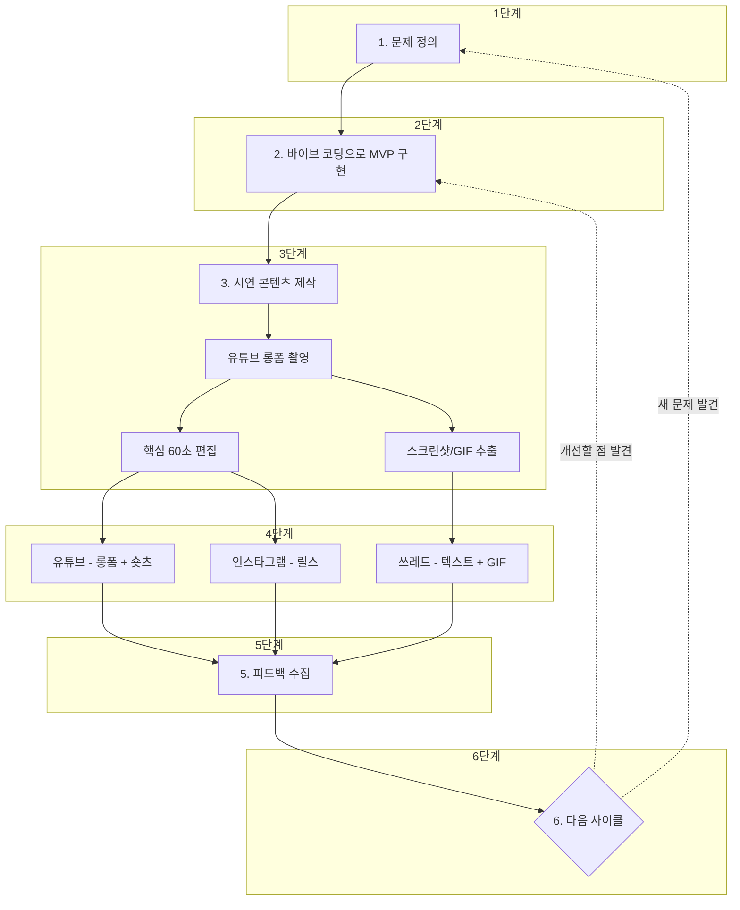

```mermaid
flowchart TB
    subgraph 1단계
        A[1. 문제 정의]
    end
    
    subgraph 2단계
        B[2. 바이브 코딩으로 MVP 구현]
    end
    
    subgraph 3단계
        C[3. 시연 콘텐츠 제작]
        C1[유튜브 롱폼 촬영]
        C2[핵심 60초 편집]
        C3[스크린샷/GIF 추출]
    end
    
    subgraph 4단계
        D1[유튜브 - 롱폼 + 숏츠]
        D2[인스타그램 - 릴스]
        D3[쓰레드 - 텍스트 + GIF]
    end
    
    subgraph 5단계
        E[5. 피드백 수집]
    end
    
    subgraph 6단계
        F{6. 다음 사이클}
    end
    
    A --> B
    B --> C
    C --> C1
    C1 --> C2
    C1 --> C3
    C2 --> D1
    C2 --> D2
    C3 --> D3
    D1 --> E
    D2 --> E
    D3 --> E
    E --> F
    F -.->|개선할 점 발견| B
    F -.->|새 문제 발견| A
```